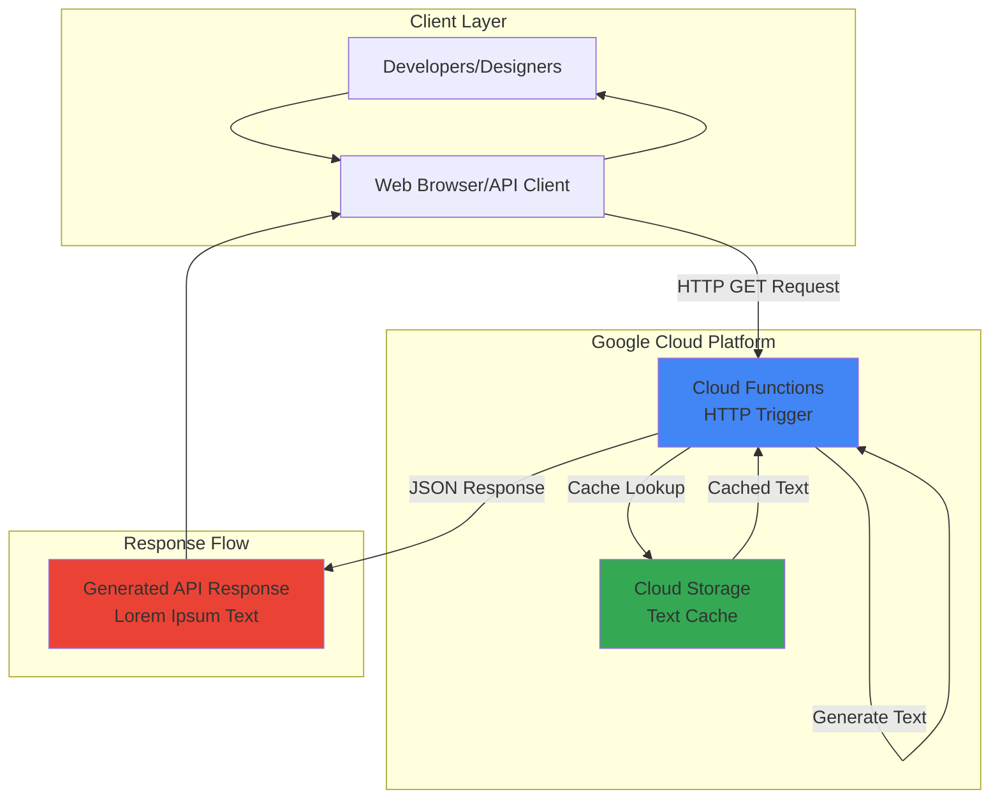

# Lorem Ipsum Generator Cloud Functions API

## Problem

Developers and designers frequently need placeholder text for mockups, prototypes, and testing applications, but manually copying lorem ipsum text from websites is time-consuming and inconsistent. Existing solutions often lack customization options for paragraph counts, word limits, or API integration capabilities. This workflow interruption slows down development cycles and creates dependency on external services that may have usage restrictions or availability issues.

## Solution

Build a serverless HTTP API using Google Cloud Functions that generates customizable lorem ipsum text on-demand. The solution integrates Cloud Storage to cache commonly requested text patterns, ensuring fast response times while providing developers with a reliable, scalable API endpoint. This approach eliminates external dependencies while offering unlimited customization through query parameters for paragraph counts and word limits.

## Architecture Diagram



## Prerequisites

1. Google Cloud account with billing enabled and appropriate permissions for Cloud Functions and Cloud Storage
2. Google Cloud CLI (gcloud) installed and configured
3. Basic understanding of serverless functions and HTTP APIs
4. Familiarity with Python programming (functions will be written in Python)
5. Estimated cost: $0.01-0.50 USD for function invocations and storage (within free tier limits for Cloud Functions 2nd gen and Cloud Storage)

   > **Note**: This recipe uses Google Cloud's free tier resources. Cloud Functions 2nd generation provides 2 million invocations free per month, and Cloud Storage offers 5GB free storage and 1TB free network egress per month.

## Preparation

```bash
# Set environment variables for GCP resources
export PROJECT_ID="lorem-ipsum-$(date +%s)"
export REGION="us-central1"
export ZONE="us-central1-a"

# Generate unique suffix for resource names
RANDOM_SUFFIX=$(openssl rand -hex 3)

# Set default project and region
gcloud config set project ${PROJECT_ID}
gcloud config set compute/region ${REGION}
gcloud config set compute/zone ${ZONE}

# Enable required APIs
gcloud services enable cloudfunctions.googleapis.com
gcloud services enable storage.googleapis.com
gcloud services enable cloudbuild.googleapis.com

echo "✅ Project configured: ${PROJECT_ID}"
```

## Steps

1. **Create Cloud Storage Bucket for Text Caching**:

   Cloud Storage provides durable object storage that enables our function to cache frequently requested lorem ipsum patterns, reducing computation time and improving response performance. The bucket serves as a high-availability cache layer that can store pre-generated text templates and commonly requested configurations.

   ```bash
   # Create storage bucket with regional location
   export BUCKET_NAME="lorem-cache-${RANDOM_SUFFIX}"
   gsutil mb -p ${PROJECT_ID} \
       -c STANDARD \
       -l ${REGION} \
       gs://${BUCKET_NAME}
   
   # Enable versioning for data protection
   gsutil versioning set on gs://${BUCKET_NAME}
   
   echo "✅ Storage bucket created: ${BUCKET_NAME}"
   ```

   The storage bucket is now configured with versioning enabled, providing both performance optimization through caching and data protection. This foundation supports the serverless architecture by decoupling text generation from storage concerns.

2. **Create Function Source Directory and Dependencies**:

   Cloud Functions requires a structured source directory with dependencies defined in requirements.txt. This preparation step establishes the local development environment and specifies the Python libraries needed for text generation and Google Cloud integration.

   ```bash
   # Create function directory structure
   mkdir -p lorem-function
   cd lorem-function
   
   # Create requirements.txt with dependencies
   cat > requirements.txt << EOF
   functions-framework==3.8.*
   google-cloud-storage==2.17.*
   EOF
   
   echo "✅ Function directory and dependencies created"
   ```

   The directory structure and dependencies are now prepared, establishing the foundation for Cloud Functions deployment with Google Cloud Storage integration capabilities.

3. **Implement Lorem Ipsum Generation Function**:

   The main function implements lorem ipsum text generation with customizable parameters for paragraphs and words per paragraph. It includes caching logic using Cloud Storage to improve performance for repeated requests with identical parameters.

   ```bash
   # Create the main Python function
   cat > main.py << 'EOF'
import json
import random
import hashlib
from google.cloud import storage
import functions_framework

# Lorem ipsum word bank for text generation
LOREM_WORDS = [
    "lorem", "ipsum", "dolor", "sit", "amet", "consectetur", "adipiscing", "elit",
    "sed", "do", "eiusmod", "tempor", "incididunt", "ut", "labore", "et", "dolore",
    "magna", "aliqua", "enim", "ad", "minim", "veniam", "quis", "nostrud",
    "exercitation", "ullamco", "laboris", "nisi", "aliquip", "ex", "ea", "commodo",
    "consequat", "duis", "aute", "irure", "in", "reprehenderit", "voluptate",
    "velit", "esse", "cillum", "fugiat", "nulla", "pariatur", "excepteur", "sint",
    "occaecat", "cupidatat", "non", "proident", "sunt", "culpa", "qui", "officia",
    "deserunt", "mollit", "anim", "id", "est", "laborum"
]

def get_cached_text(cache_key, bucket_name):
    """Retrieve cached lorem ipsum text from Cloud Storage"""
    try:
        client = storage.Client()
        bucket = client.bucket(bucket_name)
        blob = bucket.blob(f"cache/{cache_key}.txt")
        
        if blob.exists():
            return blob.download_as_text()
    except Exception as e:
        print(f"Cache retrieval error: {e}")
    return None

def cache_text(cache_key, text, bucket_name):
    """Store generated lorem ipsum text in Cloud Storage cache"""
    try:
        client = storage.Client()
        bucket = client.bucket(bucket_name)
        blob = bucket.blob(f"cache/{cache_key}.txt")
        blob.upload_from_string(text)
    except Exception as e:
        print(f"Cache storage error: {e}")

def generate_lorem_text(paragraphs=3, words_per_paragraph=50):
    """Generate lorem ipsum text with specified parameters"""
    result_paragraphs = []
    
    for _ in range(paragraphs):
        # Generate words for this paragraph
        paragraph_words = []
        for i in range(words_per_paragraph):
            word = random.choice(LOREM_WORDS)
            # Capitalize first word of paragraph
            if i == 0:
                word = word.capitalize()
            paragraph_words.append(word)
        
        # Join words and add period at end
        paragraph = " ".join(paragraph_words) + "."
        result_paragraphs.append(paragraph)
    
    return "\n\n".join(result_paragraphs)

@functions_framework.http
def lorem_generator(request):
    """HTTP Cloud Function entry point for lorem ipsum generation"""
    # Set CORS headers for web browser access
    headers = {
        'Access-Control-Allow-Origin': '*',
        'Access-Control-Allow-Methods': 'GET, POST, OPTIONS',
        'Access-Control-Allow-Headers': 'Content-Type',
        'Content-Type': 'application/json'
    }
    
    # Handle preflight OPTIONS request
    if request.method == 'OPTIONS':
        return ('', 204, headers)
    
    try:
        # Parse query parameters with defaults
        paragraphs = int(request.args.get('paragraphs', 3))
        words_per_paragraph = int(request.args.get('words', 50))
        
        # Validate parameters
        paragraphs = max(1, min(paragraphs, 10))  # Limit 1-10 paragraphs
        words_per_paragraph = max(10, min(words_per_paragraph, 200))  # Limit 10-200 words
        
        # Generate cache key from parameters
        cache_key = hashlib.md5(f"{paragraphs}-{words_per_paragraph}".encode()).hexdigest()
        bucket_name = "lorem-cache-PLACEHOLDER"  # Will be replaced during deployment
        
        # Try to get cached text first
        cached_text = get_cached_text(cache_key, bucket_name)
        if cached_text:
            response_data = {
                "text": cached_text,
                "paragraphs": paragraphs,
                "words_per_paragraph": words_per_paragraph,
                "cached": True
            }
        else:
            # Generate new text
            lorem_text = generate_lorem_text(paragraphs, words_per_paragraph)
            
            # Cache the generated text
            cache_text(cache_key, lorem_text, bucket_name)
            
            response_data = {
                "text": lorem_text,
                "paragraphs": paragraphs,
                "words_per_paragraph": words_per_paragraph,
                "cached": False
            }
        
        return (json.dumps(response_data), 200, headers)
    
    except Exception as e:
        error_response = {
            "error": "Failed to generate lorem ipsum text",
            "message": str(e)
        }
        return (json.dumps(error_response), 500, headers)
EOF
   
   echo "✅ Lorem ipsum generation function implemented"
   ```

   The function is now complete with caching capabilities, parameter validation, and CORS support for web browser integration. It provides a robust API that can handle various request patterns while maintaining performance through intelligent caching.

4. **Update Function with Actual Bucket Name**:

   The function template contains a placeholder for the bucket name that must be replaced with the actual bucket created earlier. This step ensures the function can properly access the Cloud Storage cache during execution.

   ```bash
   # Replace placeholder with actual bucket name
   sed -i "s/lorem-cache-PLACEHOLDER/${BUCKET_NAME}/g" main.py
   
   echo "✅ Function updated with bucket name: ${BUCKET_NAME}"
   ```

   The function configuration now references the correct Cloud Storage bucket, enabling seamless integration between the serverless function and the caching layer.

5. **Deploy Cloud Function with HTTP Trigger**:

   Cloud Functions deployment creates a managed serverless endpoint that automatically scales based on incoming requests. Using the `--gen2` flag deploys to the latest Cloud Functions generation with improved performance, concurrency, and better integration with other Google Cloud services. The HTTP trigger configuration enables direct API access from web browsers, applications, and development tools without additional authentication for this public API.

   ```bash
   # Deploy function with HTTP trigger
   export FUNCTION_NAME="lorem-generator-${RANDOM_SUFFIX}"
   gcloud functions deploy ${FUNCTION_NAME} \
       --gen2 \
       --runtime python312 \
       --trigger-http \
       --source . \
       --entry-point lorem_generator \
       --memory 256MB \
       --timeout 60s \
       --allow-unauthenticated \
       --region ${REGION}
   
   echo "✅ Cloud Function deployed: ${FUNCTION_NAME}"
   ```

   The serverless API is now live and accessible via HTTP, providing scalable lorem ipsum generation with automatic caching and cross-origin resource sharing support for web applications.

6. **Retrieve Function URL and Test Basic Functionality**:

   The deployed function receives a unique HTTPS URL that serves as the API endpoint. Testing with basic parameters validates the deployment and demonstrates the API's response format and performance characteristics.

   ```bash
   # Get the function URL
   export FUNCTION_URL=$(gcloud functions describe ${FUNCTION_NAME} \
       --format="value(httpsTrigger.url)")
   
   # Test basic functionality
   curl "${FUNCTION_URL}?paragraphs=2&words=30" \
       | python3 -m json.tool
   
   echo "✅ Function URL: ${FUNCTION_URL}"
   ```

   The API endpoint is now verified and ready for integration into development workflows, providing reliable lorem ipsum text generation with customizable parameters.

## Validation & Testing

1. **Verify Cloud Functions deployment status**:

   ```bash
   # Check function status and configuration
   gcloud functions describe ${FUNCTION_NAME} \
       --format="table(name,status,httpsTrigger.url)"
   ```

   Expected output: Function should show status as ACTIVE with the HTTPS trigger URL displayed.

2. **Test various parameter combinations**:

   ```bash
   # Test minimum parameters
   curl "${FUNCTION_URL}?paragraphs=1&words=10" | python3 -m json.tool
   
   # Test maximum parameters  
   curl "${FUNCTION_URL}?paragraphs=5&words=100" | python3 -m json.tool
   
   # Test caching by repeating identical request
   curl "${FUNCTION_URL}?paragraphs=3&words=50" | python3 -m json.tool
   ```

3. **Verify Cloud Storage cache functionality**:

   ```bash
   # List cached files in storage bucket
   gsutil ls gs://${BUCKET_NAME}/cache/
   
   # Verify cached content exists
   gsutil cat gs://${BUCKET_NAME}/cache/*.txt | head -n 5
   ```

4. **Test cross-origin requests from browser console**:

   ```javascript
   // Run this in any browser's developer console
   fetch('YOUR_FUNCTION_URL?paragraphs=2&words=25')
     .then(response => response.json())
     .then(data => console.log(data));
   ```

## Cleanup

1. **Delete Cloud Function**:

   ```bash
   # Remove the deployed function
   gcloud functions delete ${FUNCTION_NAME} \
       --gen2 \
       --region=${REGION} \
       --quiet
   
   echo "✅ Deleted Cloud Function: ${FUNCTION_NAME}"
   ```

2. **Remove Cloud Storage bucket and contents**:

   ```bash
   # Delete all objects in bucket first
   gsutil -m rm -r gs://${BUCKET_NAME}
   
   echo "✅ Deleted storage bucket: ${BUCKET_NAME}"
   ```

3. **Clean up local development files**:

   ```bash
   # Remove function source directory
   cd ..
   rm -rf lorem-function
   
   # Clear environment variables
   unset PROJECT_ID REGION ZONE RANDOM_SUFFIX
   unset BUCKET_NAME FUNCTION_NAME FUNCTION_URL
   
   echo "✅ Local cleanup completed"
   ```

## Discussion

This serverless lorem ipsum generator demonstrates the power of Google Cloud Functions for creating lightweight, scalable APIs without infrastructure management overhead. The solution leverages Cloud Functions 2nd generation (gen2) with improved performance, better cold start times, and enhanced concurrency compared to the previous generation. The automatic scaling capabilities handle traffic spikes seamlessly while maintaining cost efficiency through pay-per-invocation pricing. When no requests are being processed, there are no compute costs, making this ideal for development tools that may have sporadic usage patterns.

The integration with Cloud Storage for caching represents a best practice for serverless architectures. By storing frequently requested text patterns, the function reduces computational overhead and improves response times for repeated requests. This approach is particularly valuable for lorem ipsum generation since many developers tend to use similar paragraph and word count combinations. The caching strategy also demonstrates how to implement stateful behavior in stateless serverless functions, a common architectural pattern for performance optimization.

The function's implementation includes several production-ready features including CORS support for web browser integration, parameter validation to prevent abuse, and comprehensive error handling. The CORS configuration enables direct usage from web applications, making it suitable for integration into development tools, content management systems, or design applications. The parameter validation ensures the API remains responsive even with extreme inputs by limiting paragraph counts and words per paragraph to reasonable ranges.

Security considerations for this public API include the unauthenticated access model, which is appropriate for a lorem ipsum generator but might need modification for sensitive applications. For production use cases requiring authentication, Google Cloud Functions supports identity-based access control through Cloud IAM, integration with Firebase Authentication, or custom authentication logic within the function itself.

> **Tip**: Monitor function performance and costs using Google Cloud Monitoring, which provides detailed metrics on invocation counts, execution duration, and error rates to optimize the API's performance and cost efficiency.

**Documentation Sources:**
- [Google Cloud Functions Documentation](https://cloud.google.com/functions/docs) - Comprehensive serverless function deployment and configuration guidance
- [Cloud Functions 2nd Generation](https://cloud.google.com/functions/docs/2nd-gen/overview) - Latest generation features and improvements
- [Cloud Storage Client Libraries](https://cloud.google.com/storage/docs/reference/libraries) - Best practices for integrating Cloud Storage with serverless functions
- [Google Cloud CLI Reference](https://cloud.google.com/sdk/gcloud/reference/functions) - Complete command reference for Cloud Functions management
- [Functions Framework for Python](https://github.com/GoogleCloudPlatform/functions-framework-python) - Official framework for local development and testing
- [Google Cloud Architecture Center](https://cloud.google.com/architecture/serverless-overview) - Serverless architecture patterns and best practices

## Challenge

Extend this solution by implementing these enhancements:

1. **Add multiple text generation styles** by implementing different lorem ipsum variants (Latin classical, modern English, technical jargon) selectable via a `style` query parameter
2. **Implement rate limiting** using Cloud Firestore to track API usage per IP address and prevent abuse while maintaining the serverless architecture
3. **Add text formatting options** such as HTML paragraph tags, Markdown formatting, or plain text output controlled by a `format` parameter
4. **Create a simple web interface** using Cloud Storage static website hosting that provides a user-friendly form for generating lorem ipsum text
5. **Integrate with Cloud Monitoring** to create custom dashboards showing API usage patterns, popular parameter combinations, and cache hit rates for performance optimization

## Infrastructure Code

### Available Infrastructure as Code:

- [Infrastructure Code Overview](code/README.md) - Detailed description of all infrastructure components
- [Infrastructure Manager](code/infrastructure-manager/) - GCP Infrastructure Manager templates
- [Bash CLI Scripts](code/scripts/) - Example bash scripts using gcloud CLI commands to deploy infrastructure
- [Terraform](code/terraform/) - Terraform configuration files