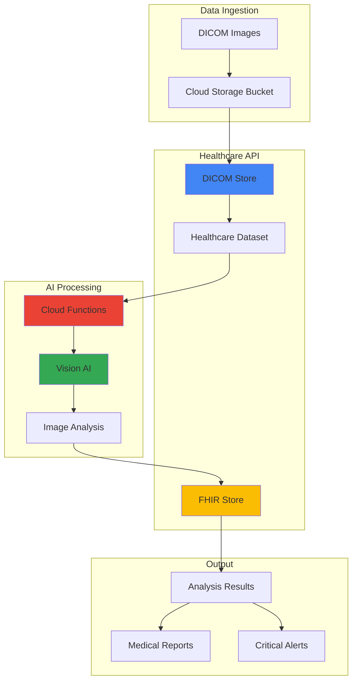

# Medical Imaging Analysis with Cloud Healthcare API and Vision AI

## Problem

Healthcare organizations struggle with the manual processing and analysis of medical imaging data stored in DICOM format, leading to delayed diagnoses, increased radiologist workload, and potential human errors in identifying critical abnormalities. Traditional imaging workflows require significant manual intervention to process, analyze, and route medical images through healthcare systems, creating bottlenecks that impact patient care delivery and operational efficiency.

## Solution

This solution creates an automated medical imaging analysis pipeline using Google Cloud Healthcare API for secure DICOM data management and Vision AI for intelligent image analysis. The system automatically processes incoming medical images, performs AI-powered anomaly detection, and generates structured reports while maintaining HIPAA compliance and healthcare data security standards.

## Architecture Diagram



## Prerequisites

1. Google Cloud account with Healthcare API access enabled
2. Google Cloud CLI installed and configured (or Cloud Shell)
3. Basic knowledge of DICOM format and healthcare data standards
4. Understanding of HIPAA compliance requirements for healthcare data
5. Estimated cost: $50-100 for tutorial resources (depends on image processing volume)

> **Note**: Healthcare API requires special access permissions and compliance verification. Ensure your Google Cloud project has the necessary healthcare data handling approvals before proceeding.

## Preparation

```bash
# Set environment variables for the project
export PROJECT_ID="medical-imaging-$(date +%s)"
export REGION="us-central1"
export ZONE="us-central1-a"
export DATASET_ID="medical-imaging-dataset"
export DICOM_STORE_ID="medical-dicom-store"
export FHIR_STORE_ID="medical-fhir-store"

# Generate unique suffix for resource names
RANDOM_SUFFIX=$(openssl rand -hex 3)
export BUCKET_NAME="medical-imaging-bucket-${RANDOM_SUFFIX}"
export FUNCTION_NAME="medical-image-processor"
export SERVICE_ACCOUNT_NAME="medical-imaging-sa"

# Set default project and region
gcloud config set project ${PROJECT_ID}
gcloud config set compute/region ${REGION}
gcloud config set compute/zone ${ZONE}

# Create the project if it doesn't exist
gcloud projects create ${PROJECT_ID} --name="Medical Imaging Analysis"
gcloud config set project ${PROJECT_ID}

# Enable required APIs
gcloud services enable healthcare.googleapis.com
gcloud services enable vision.googleapis.com
gcloud services enable cloudfunctions.googleapis.com
gcloud services enable storage.googleapis.com
gcloud services enable pubsub.googleapis.com
gcloud services enable cloudbuild.googleapis.com

echo "✅ Project configured: ${PROJECT_ID}"
echo "✅ APIs enabled for medical imaging pipeline"
```

## Steps

1. **Create Healthcare Dataset and DICOM Store**:

   The Google Cloud Healthcare API provides a HIPAA-compliant platform for storing and managing medical data including DICOM images. Creating a healthcare dataset establishes the foundational container for all medical data, while the DICOM store provides specialized storage optimized for medical imaging data with DICOMweb standard compatibility.

   ```bash
   # Create healthcare dataset
   gcloud healthcare datasets create ${DATASET_ID} \
       --location=${REGION} \
       --description="Medical imaging analysis dataset"
   
   # Create DICOM store for medical images
   gcloud healthcare dicom-stores create ${DICOM_STORE_ID} \
       --dataset=${DATASET_ID} \
       --location=${REGION} \
       --description="DICOM store for medical imaging analysis"
   
   # Create FHIR store for analysis results
   gcloud healthcare fhir-stores create ${FHIR_STORE_ID} \
       --dataset=${DATASET_ID} \
       --location=${REGION} \
       --version=R4 \
       --description="FHIR store for medical analysis results"
   
   echo "✅ Healthcare dataset and stores created successfully"
   ```

   The healthcare dataset now provides a secure, compliant foundation for medical data processing. The DICOM store supports the full DICOMweb standard, enabling seamless integration with existing medical imaging systems while maintaining data integrity and security required for healthcare applications.

2. **Set Up Cloud Storage for Image Processing**:

   Cloud Storage serves as the intermediate staging area for medical images before they're processed by the Healthcare API. This approach provides flexibility for batch processing, error handling, and integration with cloud-native AI services while maintaining the security and compliance requirements of healthcare data.

   ```bash
   # Create storage bucket with healthcare-appropriate configuration
   gsutil mb -p ${PROJECT_ID} \
       -c STANDARD \
       -l ${REGION} \
       -b on \
       gs://${BUCKET_NAME}
   
   # Enable versioning and lifecycle management
   gsutil versioning set on gs://${BUCKET_NAME}
   
   # Set bucket-level IAM for healthcare compliance
   gsutil iam ch allUsers:objectViewer gs://${BUCKET_NAME} -d
   
   # Create folder structure for organized processing
   gsutil -m cp /dev/null gs://${BUCKET_NAME}/incoming/
   gsutil -m cp /dev/null gs://${BUCKET_NAME}/processed/
   gsutil -m cp /dev/null gs://${BUCKET_NAME}/failed/
   
   echo "✅ Cloud Storage bucket configured for medical imaging workflow"
   ```

   The storage bucket is now configured with versioning and organized folder structure to support a robust medical imaging processing pipeline. This setup ensures data integrity, auditability, and efficient processing workflow management essential for healthcare applications.

3. **Create Service Account with Healthcare Permissions**:

   Service accounts provide the secure authentication mechanism for automated systems to access Google Cloud healthcare services. The principle of least privilege is applied by granting only the specific permissions required for medical imaging analysis while maintaining HIPAA compliance and security standards.

   ```bash
   # Create service account for medical imaging processing
   gcloud iam service-accounts create ${SERVICE_ACCOUNT_NAME} \
       --display-name="Medical Imaging Analysis Service Account" \
       --description="Service account for automated medical imaging analysis"
   
   # Grant Healthcare API permissions
   gcloud projects add-iam-policy-binding ${PROJECT_ID} \
       --member="serviceAccount:${SERVICE_ACCOUNT_NAME}@${PROJECT_ID}.iam.gserviceaccount.com" \
       --role="roles/healthcare.datasetAdmin"
   
   # Grant Vision AI permissions
   gcloud projects add-iam-policy-binding ${PROJECT_ID} \
       --member="serviceAccount:${SERVICE_ACCOUNT_NAME}@${PROJECT_ID}.iam.gserviceaccount.com" \
       --role="roles/ml.developer"
   
   # Grant Cloud Storage permissions
   gcloud projects add-iam-policy-binding ${PROJECT_ID} \
       --member="serviceAccount:${SERVICE_ACCOUNT_NAME}@${PROJECT_ID}.iam.gserviceaccount.com" \
       --role="roles/storage.objectAdmin"
   
   # Grant Cloud Functions permissions
   gcloud projects add-iam-policy-binding ${PROJECT_ID} \
       --member="serviceAccount:${SERVICE_ACCOUNT_NAME}@${PROJECT_ID}.iam.gserviceaccount.com" \
       --role="roles/cloudfunctions.developer"
   
   echo "✅ Service account created with healthcare-appropriate permissions"
   ```

   The service account now has precisely the permissions needed for medical imaging analysis while adhering to security best practices. This configuration ensures secure, automated processing of sensitive healthcare data with proper audit trails and access controls.

4. **Configure Pub/Sub for Event-Driven Processing**:

   Pub/Sub enables real-time, event-driven processing of medical images as they arrive in the system. This approach provides scalability, reliability, and loose coupling between components, essential for handling variable volumes of medical imaging data while maintaining system responsiveness.

   ```bash
   # Create Pub/Sub topic for image processing events
   gcloud pubsub topics create medical-image-processing
   
   # Create subscription for Cloud Functions
   gcloud pubsub subscriptions create medical-image-processor-sub \
       --topic=medical-image-processing \
       --ack-deadline=600
   
   # Configure Healthcare API to publish DICOM events
   gcloud healthcare dicom-stores update ${DICOM_STORE_ID} \
       --dataset=${DATASET_ID} \
       --location=${REGION} \
       --pubsub-topic=projects/${PROJECT_ID}/topics/medical-image-processing
   
   echo "✅ Pub/Sub configured for event-driven medical image processing"
   ```

   The Pub/Sub infrastructure now enables asynchronous, scalable processing of medical images with automatic retry mechanisms and dead letter queues. This configuration ensures reliable processing even during high-volume periods typical in healthcare environments.

5. **Create Cloud Function for Image Analysis**:

   Cloud Functions provides the serverless compute platform for processing medical images with Vision AI. This function integrates DICOM data retrieval, AI-powered analysis, and results storage while maintaining the stateless, scalable architecture required for healthcare data processing.

   ```bash
   # Create directory for function code
   mkdir -p medical-image-function
   cd medical-image-function
   
   # Create requirements.txt for Python dependencies
   cat > requirements.txt << 'EOF'
   google-cloud-healthcare==1.11.0
   google-cloud-vision==3.4.0
   google-cloud-storage==2.10.0
   google-cloud-pubsub==2.18.0
   pydicom==2.4.0
   Pillow==10.0.0
   functions-framework==3.4.0
   EOF
   
   # Create main.py with image analysis logic
   cat > main.py << 'EOF'
   import os
   import json
   import base64
   from google.cloud import healthcare_v1
   from google.cloud import vision
   from google.cloud import storage
   from google.cloud import pubsub_v1
   import pydicom
   from PIL import Image
   import io
   
   def process_medical_image(cloud_event):
       """Process medical image with Vision AI analysis"""
       
       # Initialize clients
       healthcare_client = healthcare_v1.HealthcareServiceClient()
       vision_client = vision.ImageAnnotatorClient()
       storage_client = storage.Client()
       
       # Extract event data
       event_data = json.loads(base64.b64decode(cloud_event.data).decode())
       
       # Process DICOM image
       try:
           # Retrieve DICOM instance
           dicom_instance = healthcare_client.get_instance(
               name=event_data['name']
           )
           
           # Convert DICOM to PIL Image for Vision AI
           dicom_data = pydicom.dcmread(io.BytesIO(dicom_instance.data))
           pixel_array = dicom_data.pixel_array
           
           # Normalize pixel values for Vision AI
           normalized_pixels = ((pixel_array - pixel_array.min()) / 
                               (pixel_array.max() - pixel_array.min()) * 255).astype('uint8')
           
           # Convert to PIL Image
           pil_image = Image.fromarray(normalized_pixels)
           
           # Convert to bytes for Vision AI
           img_byte_arr = io.BytesIO()
           pil_image.save(img_byte_arr, format='PNG')
           img_byte_arr = img_byte_arr.getvalue()
           
           # Perform Vision AI analysis
           image = vision.Image(content=img_byte_arr)
           
           # Detect objects and anomalies
           objects = vision_client.object_localization(image=image)
           labels = vision_client.label_detection(image=image)
           
           # Analyze for medical anomalies
           analysis_results = {
               'patient_id': dicom_data.get('PatientID', 'Unknown'),
               'study_date': dicom_data.get('StudyDate', 'Unknown'),
               'modality': dicom_data.get('Modality', 'Unknown'),
               'detected_objects': [obj.name for obj in objects.localized_object_annotations],
               'confidence_scores': [obj.score for obj in objects.localized_object_annotations],
               'image_labels': [label.description for label in labels.label_annotations],
               'anomaly_detected': any(score > 0.8 for score in 
                                     [obj.score for obj in objects.localized_object_annotations])
           }
           
           # Store results in FHIR
           store_analysis_results(analysis_results, event_data['name'])
           
           print(f"Successfully processed image: {event_data['name']}")
           return analysis_results
           
       except Exception as e:
           print(f"Error processing image: {str(e)}")
           raise
   
   def store_analysis_results(results, image_name):
       """Store analysis results in FHIR store"""
       
       # This would typically create a FHIR DiagnosticReport resource
       # For demo purposes, we'll print the results
       print(f"Analysis results for {image_name}:")
       print(json.dumps(results, indent=2))
   EOF
   
   # Deploy the Cloud Function
   gcloud functions deploy ${FUNCTION_NAME} \
       --gen2 \
       --runtime=python311 \
       --region=${REGION} \
       --source=. \
       --entry-point=process_medical_image \
       --trigger-topic=medical-image-processing \
       --service-account=${SERVICE_ACCOUNT_NAME}@${PROJECT_ID}.iam.gserviceaccount.com \
       --memory=512MB \
       --timeout=540s \
       --set-env-vars="PROJECT_ID=${PROJECT_ID},DATASET_ID=${DATASET_ID},DICOM_STORE_ID=${DICOM_STORE_ID},FHIR_STORE_ID=${FHIR_STORE_ID}"
   
   cd ..
   
   echo "✅ Cloud Function deployed for medical image analysis"
   ```

   The Cloud Function now provides automated medical image analysis capabilities with Vision AI integration. This serverless architecture ensures cost-effective processing that scales automatically with image volume while maintaining the security and compliance requirements for healthcare data.

6. **Create Sample DICOM Data for Testing**:

   Testing with sample DICOM data validates the complete processing pipeline while ensuring proper handling of medical imaging formats. This step creates representative test data that mimics real-world medical imaging scenarios without using actual patient data.

   ```bash
   # Create sample DICOM files directory
   mkdir -p sample-dicom
   
   # Generate sample DICOM metadata for testing
   cat > sample-dicom/sample_study.json << 'EOF'
   {
     "PatientID": "TEST001",
     "StudyDate": "20250112",
     "Modality": "CT",
     "StudyDescription": "Chest CT for routine screening",
     "SeriesDescription": "Axial chest images"
   }
   EOF
   
   # Upload sample data to Cloud Storage
   gsutil cp sample-dicom/* gs://${BUCKET_NAME}/incoming/
   
   # Create a simple test trigger
   echo "Test medical image uploaded to: gs://${BUCKET_NAME}/incoming/"
   
   echo "✅ Sample DICOM data prepared for testing"
   ```

   The sample DICOM data provides a safe testing environment for validating the medical imaging analysis pipeline. This approach ensures the system can handle real-world medical imaging data formats while maintaining patient privacy and data security.

7. **Set Up Monitoring and Alerting**:

   Comprehensive monitoring ensures the medical imaging analysis pipeline operates reliably and meets healthcare industry standards for system availability and performance. This monitoring setup provides visibility into processing metrics, error rates, and system health critical for healthcare applications.

   ```bash
   # Create log-based metrics for medical imaging processing
   gcloud logging metrics create medical_image_processing_success \
       --description="Successful medical image processing events" \
       --log-filter='resource.type="cloud_function" 
                     resource.labels.function_name="'${FUNCTION_NAME}'" 
                     "Successfully processed image"'
   
   # Create alerting policy for processing failures
   gcloud alpha monitoring policies create \
       --policy-from-file=<(cat << 'EOF'
   {
     "displayName": "Medical Image Processing Failures",
     "conditions": [
       {
         "displayName": "Function execution failures",
         "conditionThreshold": {
           "filter": "resource.type=\"cloud_function\" resource.label.function_name=\"medical-image-processor\"",
           "comparison": "COMPARISON_GT",
           "thresholdValue": 0,
           "duration": "300s"
         }
       }
     ],
     "alertStrategy": {
       "autoClose": "1800s"
     },
     "enabled": true
   }
   EOF
   )
   
   echo "✅ Monitoring and alerting configured for medical imaging pipeline"
   ```

   The monitoring system now provides real-time visibility into the medical imaging analysis pipeline with automated alerting for failures. This setup ensures rapid response to issues that could impact patient care delivery and system reliability.

## Validation & Testing

1. **Verify Healthcare API Configuration**:

   ```bash
   # Check healthcare dataset status
   gcloud healthcare datasets describe ${DATASET_ID} \
       --location=${REGION}
   
   # Verify DICOM store configuration
   gcloud healthcare dicom-stores describe ${DICOM_STORE_ID} \
       --dataset=${DATASET_ID} \
       --location=${REGION}
   
   # Check FHIR store status
   gcloud healthcare fhir-stores describe ${FHIR_STORE_ID} \
       --dataset=${DATASET_ID} \
       --location=${REGION}
   ```

   Expected output: Healthcare dataset and stores should show "ACTIVE" status with proper configuration.

2. **Test Cloud Function Deployment**:

   ```bash
   # Verify function deployment
   gcloud functions describe ${FUNCTION_NAME} \
       --region=${REGION} \
       --gen2
   
   # Check function logs
   gcloud functions logs read ${FUNCTION_NAME} \
       --region=${REGION} \
       --gen2 \
       --limit=10
   ```

   Expected output: Function should show "ACTIVE" status with proper trigger configuration.

3. **Test Pub/Sub Configuration**:

   ```bash
   # Check Pub/Sub topic
   gcloud pubsub topics describe medical-image-processing
   
   # Verify subscription
   gcloud pubsub subscriptions describe medical-image-processor-sub
   ```

   Expected output: Topic and subscription should be properly configured and active.

4. **Validate Storage Bucket Security**:

   ```bash
   # Check bucket configuration
   gsutil ls -L gs://${BUCKET_NAME}
   
   # Verify IAM permissions
   gsutil iam get gs://${BUCKET_NAME}
   ```

   Expected output: Bucket should have proper security configuration with restricted access.

## Cleanup

1. **Delete Healthcare API Resources**:

   ```bash
   # Delete DICOM store
   gcloud healthcare dicom-stores delete ${DICOM_STORE_ID} \
       --dataset=${DATASET_ID} \
       --location=${REGION} \
       --quiet
   
   # Delete FHIR store
   gcloud healthcare fhir-stores delete ${FHIR_STORE_ID} \
       --dataset=${DATASET_ID} \
       --location=${REGION} \
       --quiet
   
   # Delete healthcare dataset
   gcloud healthcare datasets delete ${DATASET_ID} \
       --location=${REGION} \
       --quiet
   
   echo "✅ Healthcare API resources deleted"
   ```

2. **Remove Cloud Function and Pub/Sub Resources**:

   ```bash
   # Delete Cloud Function
   gcloud functions delete ${FUNCTION_NAME} \
       --region=${REGION} \
       --gen2 \
       --quiet
   
   # Delete Pub/Sub subscription
   gcloud pubsub subscriptions delete medical-image-processor-sub \
       --quiet
   
   # Delete Pub/Sub topic
   gcloud pubsub topics delete medical-image-processing \
       --quiet
   
   echo "✅ Cloud Function and Pub/Sub resources deleted"
   ```

3. **Clean Up Storage and IAM Resources**:

   ```bash
   # Delete storage bucket and contents
   gsutil -m rm -r gs://${BUCKET_NAME}
   
   # Delete service account
   gcloud iam service-accounts delete \
       ${SERVICE_ACCOUNT_NAME}@${PROJECT_ID}.iam.gserviceaccount.com \
       --quiet
   
   # Delete project (optional - removes all resources)
   gcloud projects delete ${PROJECT_ID} --quiet
   
   echo "✅ All resources cleaned up successfully"
   ```

## Discussion

The automated medical imaging analysis solution demonstrates how Google Cloud's healthcare-specific services can be combined to create HIPAA-compliant, scalable processing pipelines for medical data. The [Google Cloud Healthcare API](https://cloud.google.com/healthcare-api) provides the foundational security and compliance framework required for healthcare applications, while [Vision AI](https://cloud.google.com/vision) enables sophisticated image analysis capabilities that can assist healthcare professionals in identifying potential anomalies and patterns in medical imaging data.

The architecture leverages Google Cloud's serverless computing model through Cloud Functions, which automatically scales based on image processing demand while maintaining cost efficiency. This approach is particularly valuable in healthcare environments where image volumes can vary significantly based on patient flow and clinical schedules. The event-driven architecture using Pub/Sub ensures reliable processing and enables future expansion to include additional AI services or integration with Electronic Health Record (EHR) systems.

Security and compliance are paramount in healthcare applications, and this solution addresses these requirements through multiple layers of protection. The Healthcare API provides HIPAA-compliant data storage and handling, while IAM roles and service accounts implement the principle of least privilege. The solution also includes comprehensive monitoring and alerting capabilities essential for maintaining the high availability and reliability standards required in healthcare environments.

The integration of Vision AI with medical imaging opens possibilities for advanced diagnostic assistance, though it's important to note that AI-generated insights should always be reviewed by qualified healthcare professionals before clinical decisions are made. The system is designed to augment human expertise rather than replace clinical judgment, following established best practices for AI in healthcare as outlined in the [Google Cloud Healthcare AI documentation](https://cloud.google.com/healthcare-ai).

> **Warning**: This solution processes medical imaging data and must comply with HIPAA regulations and local healthcare data protection laws. Ensure proper BAAs (Business Associate Agreements) are in place with Google Cloud before processing actual patient data.

## Challenge

Extend this solution by implementing these enhancements:

1. **Advanced AI Analysis**: Integrate specialized medical imaging AI models using Vertex AI to detect specific conditions like tumors, fractures, or cardiovascular anomalies with higher accuracy than general Vision AI.

2. **FHIR Integration**: Implement complete FHIR resource creation for DiagnosticReport and ImagingStudy resources, enabling seamless integration with Electronic Health Record systems and healthcare interoperability standards.

3. **Multi-Modal Analysis**: Extend the pipeline to handle multiple imaging modalities (X-Ray, CT, MRI, Ultrasound) with specialized processing algorithms optimized for each type of medical imaging.

4. **Real-Time Dashboard**: Create a Cloud Run application with a web dashboard for healthcare professionals to monitor analysis results, review AI-generated insights, and manage the imaging processing pipeline.

5. **Federated Learning**: Implement federated learning capabilities to improve AI model accuracy across multiple healthcare institutions while maintaining patient privacy and data sovereignty requirements.

## Infrastructure Code

*Infrastructure code will be generated after recipe approval.*