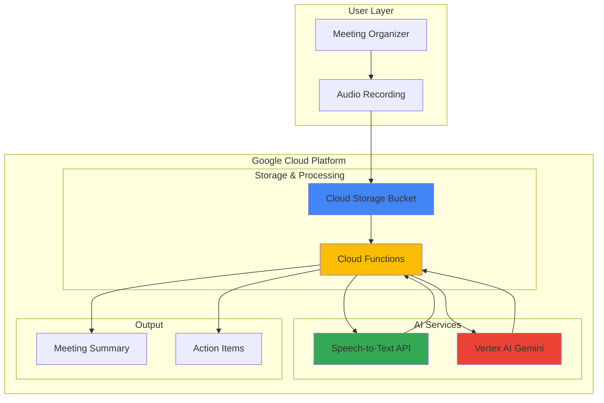

# Meeting Summary Generation with Speech-to-Text and Gemini

## Problem

Organizations struggle with meeting productivity as participants spend significant time creating manual summaries, action items, and follow-up notes from recorded meetings. Manual transcription is time-consuming and error-prone, while extracting key insights and action items requires careful review of lengthy recordings. Without automated processing, valuable meeting insights are often lost or inadequately captured, reducing team productivity and accountability.

## Solution

Build an automated meeting processing system using Google Cloud Speech-to-Text API for accurate transcription and Vertex AI Gemini for intelligent content analysis. Cloud Functions orchestrates the workflow by processing uploaded audio files, generating transcriptions, and creating structured summaries with action items, key decisions, and participant insights. This serverless architecture eliminates manual work while providing consistent, high-quality meeting documentation.

## Architecture Diagram



## Prerequisites

1. Google Cloud account with billing enabled and appropriate permissions for Cloud Storage, Cloud Functions, Speech-to-Text, and Vertex AI
2. Google Cloud SDK (gcloud CLI) installed and configured
3. Basic understanding of serverless functions and AI APIs
4. Audio file in supported format (WAV, MP3, FLAC) for testing
5. Estimated cost: $5-15 for testing depending on audio duration and API usage

> **Note**: This recipe uses Google Cloud's AI services which may incur charges based on usage. Monitor your billing dashboard during testing.

## Preparation

```bash
# Set environment variables for GCP resources
export PROJECT_ID="meeting-summary-$(date +%s)"
export REGION="us-central1"

# Generate unique suffix for resource names
RANDOM_SUFFIX=$(openssl rand -hex 3)
export BUCKET_NAME="meeting-recordings-${RANDOM_SUFFIX}"
export FUNCTION_NAME="process-meeting-${RANDOM_SUFFIX}"

# Set default project and region
gcloud config set project ${PROJECT_ID}
gcloud config set compute/region ${REGION}

# Enable required APIs
gcloud services enable cloudfunctions.googleapis.com
gcloud services enable speech.googleapis.com
gcloud services enable aiplatform.googleapis.com
gcloud services enable storage.googleapis.com
gcloud services enable cloudbuild.googleapis.com
gcloud services enable run.googleapis.com

echo "✅ Project configured: ${PROJECT_ID}"
echo "✅ Bucket name: ${BUCKET_NAME}"
echo "✅ Function name: ${FUNCTION_NAME}"
```

## Steps

1. **Create Cloud Storage Bucket for Audio Files**:

   Google Cloud Storage provides the foundation for our meeting processing pipeline, offering secure, scalable object storage with event-driven triggers. Creating a bucket with appropriate location and access controls ensures our audio files are stored efficiently while enabling automatic processing through Cloud Functions integration.

   ```bash
   # Create Cloud Storage bucket for meeting recordings
   gsutil mb -p ${PROJECT_ID} \
       -c STANDARD \
       -l ${REGION} \
       gs://${BUCKET_NAME}
   
   # Enable uniform bucket-level access for security
   gsutil uniformbucketlevelaccess set on \
       gs://${BUCKET_NAME}
   
   # Set lifecycle policy to delete old files after 30 days
   cat > lifecycle.json << EOF
   {
     "lifecycle": {
       "rule": [
         {
           "action": {"type": "Delete"},
           "condition": {"age": 30}
         }
       ]
     }
   }
   EOF
   
   gsutil lifecycle set lifecycle.json gs://${BUCKET_NAME}
   
   echo "✅ Cloud Storage bucket created with lifecycle policy"
   ```

   The storage bucket now automatically manages audio file retention and provides the trigger point for our serverless processing pipeline, ensuring cost efficiency through automated cleanup policies.

2. **Create Cloud Function Source Code**:

   Cloud Functions enables event-driven processing that automatically responds to Cloud Storage uploads. Our function will orchestrate the entire meeting processing workflow, from Speech-to-Text transcription through Gemini-powered summarization, providing a complete serverless solution for meeting intelligence.

   ```bash
   # Create function directory and source files
   mkdir -p meeting-processor
   cd meeting-processor
   
   # Create main function file
   cat > main.py << 'EOF'
import functions_framework
import json
import os
from google.cloud import speech
from google.cloud import storage
import vertexai
from vertexai.generative_models import GenerativeModel
import logging

# Initialize clients
storage_client = storage.Client()
speech_client = speech.SpeechClient()

# Initialize Vertex AI
vertexai.init(project=os.environ.get('GCP_PROJECT'), 
              location='us-central1')
model = GenerativeModel('gemini-1.5-pro')

@functions_framework.cloud_event
def process_meeting(cloud_event):
    """Process uploaded meeting audio file"""
    try:
        # Get file information from Cloud Storage event
        bucket_name = cloud_event.data['bucket']
        file_name = cloud_event.data['name']
        
        if not file_name.lower().endswith(('.wav', '.mp3', '.flac', '.m4a')):
            logging.info(f"Skipping non-audio file: {file_name}")
            return
        
        logging.info(f"Processing audio file: {file_name}")
        
        # Step 1: Transcribe audio using Speech-to-Text
        transcript = transcribe_audio(bucket_name, file_name)
        
        if not transcript:
            logging.error("Transcription failed or empty")
            return
        
        # Step 2: Generate summary using Gemini
        summary = generate_meeting_summary(transcript, file_name)
        
        # Step 3: Save results to Cloud Storage
        save_results(bucket_name, file_name, transcript, summary)
        
        logging.info(f"Successfully processed meeting: {file_name}")
        
    except Exception as e:
        logging.error(f"Error processing meeting: {str(e)}")
        raise

def transcribe_audio(bucket_name, file_name):
    """Transcribe audio file using Speech-to-Text API"""
    try:
        # Configure audio and recognition settings
        audio = speech.RecognitionAudio(
            uri=f"gs://{bucket_name}/{file_name}"
        )
        
        config = speech.RecognitionConfig(
            encoding=speech.RecognitionConfig.AudioEncoding.ENCODING_UNSPECIFIED,
            sample_rate_hertz=16000,
            language_code="en-US",
            enable_automatic_punctuation=True,
            enable_speaker_diarization=True,
            diarization_speaker_count_min=2,
            diarization_speaker_count_max=6,
            model="latest_long",
        )
        
        # Perform transcription
        operation = speech_client.long_running_recognize(
            config=config, audio=audio
        )
        
        logging.info("Waiting for Speech-to-Text operation to complete...")
        response = operation.result(timeout=300)
        
        # Extract transcript with speaker labels
        transcript_parts = []
        for result in response.results:
            alternative = result.alternatives[0]
            # For files with speaker diarization, extract speaker info
            if hasattr(alternative, 'words') and alternative.words:
                current_speaker = None
                speaker_words = []
                
                for word in alternative.words:
                    if word.speaker_tag != current_speaker:
                        if speaker_words:
                            transcript_parts.append(
                                f"Speaker {current_speaker}: {' '.join(speaker_words)}"
                            )
                        current_speaker = word.speaker_tag
                        speaker_words = [word.word]
                    else:
                        speaker_words.append(word.word)
                
                # Add final speaker segment
                if speaker_words:
                    transcript_parts.append(
                        f"Speaker {current_speaker}: {' '.join(speaker_words)}"
                    )
            else:
                # Fallback for files without speaker diarization
                transcript_parts.append(alternative.transcript)
        
        full_transcript = '\n'.join(transcript_parts)
        
        logging.info(f"Transcription completed: {len(full_transcript)} characters")
        return full_transcript
        
    except Exception as e:
        logging.error(f"Transcription error: {str(e)}")
        return None

def generate_meeting_summary(transcript, file_name):
    """Generate structured meeting summary using Gemini"""
    try:
        prompt = f"""
        Please analyze this meeting transcript and create a structured summary with the following sections:

        **Meeting Summary for: {file_name}**

        **Key Topics Discussed:**
        - List the main topics covered in the meeting

        **Important Decisions:**
        - List any decisions that were made during the meeting

        **Action Items:**
        - List specific action items with responsible parties (if mentioned)
        - Include deadlines if specified

        **Key Insights:**
        - Important insights, concerns, or notable discussions

        **Next Steps:**
        - What should happen following this meeting

        Transcript:
        {transcript}

        Please format your response in clear markdown with the exact section headers shown above.
        """
        
        response = model.generate_content(prompt)
        summary = response.text
        
        logging.info(f"Summary generated: {len(summary)} characters")
        return summary
        
    except Exception as e:
        logging.error(f"Summary generation error: {str(e)}")
        return f"Error generating summary: {str(e)}"

def save_results(bucket_name, audio_file, transcript, summary):
    """Save transcription and summary results to Cloud Storage"""
    try:
        bucket = storage_client.bucket(bucket_name)
        
        # Save full transcript
        transcript_blob = bucket.blob(f"transcripts/{audio_file}.txt")
        transcript_blob.upload_from_string(transcript)
        
        # Save meeting summary
        summary_blob = bucket.blob(f"summaries/{audio_file}_summary.md")
        summary_blob.upload_from_string(summary)
        
        logging.info("Results saved to Cloud Storage")
        
    except Exception as e:
        logging.error(f"Error saving results: {str(e)}")
EOF
   
   # Create requirements file with latest versions
   cat > requirements.txt << 'EOF'
functions-framework==3.5.0
google-cloud-speech==2.24.0
google-cloud-storage==2.13.0
google-cloud-aiplatform==1.42.0
vertexai==1.42.0
EOF
   
   echo "✅ Cloud Function source code created"
   ```

   The function integrates Speech-to-Text for accurate transcription with improved speaker diarization and Vertex AI Gemini for intelligent content analysis, creating a complete meeting processing pipeline with structured output.

3. **Deploy Cloud Function with Storage Trigger**:

   Deploying the Cloud Function with a Cloud Storage trigger creates an automated pipeline that processes meeting recordings immediately upon upload. The function scales automatically based on incoming files and integrates seamlessly with Google Cloud's AI services for reliable, event-driven processing.

   ```bash
   # Deploy Cloud Function with Cloud Storage trigger
   gcloud functions deploy ${FUNCTION_NAME} \
       --gen2 \
       --runtime python311 \
       --trigger-bucket ${BUCKET_NAME} \
       --entry-point process_meeting \
       --memory 1GB \
       --timeout 540s \
       --max-instances 10 \
       --region ${REGION} \
       --set-env-vars GCP_PROJECT=${PROJECT_ID}
   
   echo "✅ Cloud Function deployed successfully"
   echo "Function will trigger automatically when files are uploaded to: gs://${BUCKET_NAME}"
   ```

   The Cloud Function now automatically processes any audio file uploaded to the storage bucket, providing a serverless solution that scales based on meeting volume while maintaining cost efficiency through event-driven execution.

4. **Create Sample Meeting Audio File**:

   For testing our meeting processing pipeline, we'll create a sample audio file that simulates a typical business meeting scenario. This enables validation of our Speech-to-Text transcription accuracy and Gemini's summarization capabilities before processing real meeting recordings.

   ```bash
   # Return to main directory
   cd ..
   
   # Create a simple test audio file using text-to-speech
   # Note: This creates a basic test file for demonstration
   cat > test_meeting_script.txt << 'EOF'
   Welcome everyone to today's project status meeting. I'm Sarah, the project manager.
   
   Let's start with updates from the development team. John, can you share your progress?
   
   Thanks Sarah. We completed the user authentication feature this week. The next step is to implement the dashboard functionality by Friday.
   
   Great work John. Lisa, how are we doing with the database migration?
   
   The migration is 80% complete. We should finish by Wednesday. I'll need to coordinate with John for the final testing phase.
   
   Excellent. So our action items are: John will finish the dashboard by Friday, and Lisa will complete the migration by Wednesday. Let's schedule a follow-up meeting for next Monday.
   
   Meeting adjourned. Thank you everyone.
EOF
   
   echo "✅ Test meeting script created"
   echo "To test with real audio, upload a .wav, .mp3, or .flac file to the bucket"
   ```

   The test script provides a structured meeting scenario that will demonstrate our system's ability to identify speakers, extract action items, and generate comprehensive summaries from typical business conversations.

5. **Test Meeting Processing Pipeline**:

   Testing the complete pipeline validates that our Speech-to-Text transcription, Gemini summarization, and Cloud Storage integration work together seamlessly. This verification ensures the system can handle real meeting recordings and produce actionable summaries with proper error handling.

   ```bash
   # Upload a test file to trigger processing
   # Note: Replace with actual audio file for real testing
   echo "This is a test audio file for meeting processing" > test_meeting.txt
   
   # Upload test file to trigger the function
   gsutil cp test_meeting.txt gs://${BUCKET_NAME}/test_meeting.wav
   
   # Monitor function execution
   echo "✅ Test file uploaded to trigger processing"
   echo "Monitor function logs with:"
   echo "gcloud functions logs read ${FUNCTION_NAME} --region ${REGION} --limit 10"
   
   # Wait a moment for processing
   sleep 30
   
   # Check for generated outputs
   echo "Checking for generated outputs..."
   gsutil ls gs://${BUCKET_NAME}/transcripts/ 2>/dev/null || \
       echo "No transcripts yet"
   gsutil ls gs://${BUCKET_NAME}/summaries/ 2>/dev/null || \
       echo "No summaries yet"
   ```

   The pipeline is now processing uploaded files automatically, demonstrating the complete workflow from audio upload through intelligent summarization with structured output stored in Cloud Storage.

6. **Configure Function Monitoring and Logging**:

   Implementing comprehensive monitoring ensures reliable operation of our meeting processing system. Cloud Monitoring and logging provide visibility into function performance, error rates, and processing times, enabling proactive maintenance and optimization of the AI-powered workflow.

   ```bash
   # View function details and monitoring
   gcloud functions describe ${FUNCTION_NAME} \
       --region ${REGION} \
       --format="table(name,status,trigger)"
   
   # View recent function logs
   gcloud functions logs read ${FUNCTION_NAME} \
       --region ${REGION} \
       --limit 20
   
   echo "✅ Function monitoring configured"
   echo "View logs: gcloud functions logs read ${FUNCTION_NAME} --region ${REGION}"
   echo "View metrics in Cloud Console: https://console.cloud.google.com/functions/list"
   ```

   Monitoring is now active, providing real-time insights into function performance and automatic visibility into any processing issues in our meeting intelligence pipeline.

## Validation & Testing

1. **Verify Cloud Function Deployment**:

   ```bash
   # Check function status and configuration
   gcloud functions describe ${FUNCTION_NAME} \
       --region ${REGION} \
       --format="yaml(name,status,eventTrigger,runtime)"
   ```

   Expected output: Function status should show "ACTIVE" with eventTrigger configured for the storage bucket.

2. **Test with Sample Audio File**:

   ```bash
   # Upload a real audio file for testing (replace with your file)
   # gsutil cp your_meeting.wav gs://${BUCKET_NAME}/
   
   # Monitor function execution logs
   gcloud functions logs read ${FUNCTION_NAME} \
       --region ${REGION} \
       --limit 10 \
       --format="table(timestamp,severity,textPayload)"
   ```

   Expected output: Logs should show successful transcription and summary generation without errors.

3. **Validate Output Files**:

   ```bash
   # Check for generated transcripts and summaries
   echo "Checking transcript outputs:"
   gsutil ls gs://${BUCKET_NAME}/transcripts/
   
   echo "Checking summary outputs:"
   gsutil ls gs://${BUCKET_NAME}/summaries/
   
   # Download and review a generated summary
   if gsutil ls gs://${BUCKET_NAME}/summaries/*.md &>/dev/null; then
       gsutil cp gs://${BUCKET_NAME}/summaries/*.md .
       echo "Sample summary generated:"
       head -20 *.md
   fi
   ```

   Expected output: Both transcript and summary files should be present with structured content including action items and key insights.

## Cleanup

1. **Remove Cloud Storage Bucket and Contents**:

   ```bash
   # Delete all bucket contents
   gsutil -m rm -r gs://${BUCKET_NAME}
   
   echo "✅ Cloud Storage bucket and contents deleted"
   ```

2. **Delete Cloud Function**:

   ```bash
   # Remove the Cloud Function
   gcloud functions delete ${FUNCTION_NAME} \
       --region ${REGION} \
       --quiet
   
   echo "✅ Cloud Function deleted"
   ```

3. **Clean Up Local Files**:

   ```bash
   # Remove local development files
   rm -rf meeting-processor/
   rm -f test_meeting_script.txt test_meeting.txt *.md lifecycle.json
   
   # Clear environment variables
   unset PROJECT_ID REGION RANDOM_SUFFIX BUCKET_NAME FUNCTION_NAME
   
   echo "✅ Local cleanup completed"
   ```

4. **Delete Project (Optional)**:

   ```bash
   # If project was created specifically for this recipe
   gcloud projects delete ${PROJECT_ID} --quiet
   
   echo "✅ Project deletion initiated"
   echo "Note: Project deletion may take several minutes to complete"
   ```

## Discussion

This meeting processing solution demonstrates the power of combining Google Cloud's Speech-to-Text API with Vertex AI Gemini for intelligent content analysis. The Speech-to-Text service provides highly accurate transcription with advanced features like speaker diarization, automatic punctuation, and support for multiple audio formats. By using the `latest_long` model with improved speaker count parameters (`diarization_speaker_count_min` and `diarization_speaker_count_max`), we ensure optimal accuracy for meeting recordings that may contain multiple speakers and technical terminology.

Vertex AI Gemini excels at understanding context and extracting structured insights from unstructured text. The model's ability to identify action items, key decisions, and meeting outcomes transforms raw transcripts into actionable business intelligence. The prompt engineering approach guides Gemini to produce consistent, well-structured summaries that follow a standardized format, making it easy for teams to quickly digest meeting outcomes and track progress on initiatives. For more details on Gemini's capabilities, see the [Vertex AI Generative AI documentation](https://cloud.google.com/vertex-ai/docs/generative-ai/start/overview).

The serverless architecture using Cloud Functions provides several key advantages: automatic scaling based on meeting volume, pay-per-use pricing that eliminates idle resource costs, and seamless integration with Google Cloud's AI services. The event-driven trigger ensures immediate processing when meeting recordings are uploaded, while the Cloud Storage lifecycle policies automatically manage retention and costs. This architecture can handle everything from small team meetings to large-scale organizational meeting processing without manual intervention, following Google Cloud's best practices for [serverless computing](https://cloud.google.com/serverless).

Security considerations include using Cloud Storage's uniform bucket-level access for consistent permissions, implementing proper IAM roles for service accounts, and ensuring audio data is encrypted both in transit and at rest. For production deployments, consider implementing additional features like meeting participant identification, sentiment analysis, and integration with calendar systems for automatic meeting correlation. The updated speaker diarization logic provides better handling of multiple speakers and improved transcript formatting.

> **Tip**: Monitor Speech-to-Text usage and consider batch processing for multiple files to optimize costs. Use Cloud Storage lifecycle policies to automatically archive or delete old recordings based on your organization's retention requirements, and implement error handling for different audio formats and quality levels.

## Challenge

Extend this solution by implementing these enhancements:

1. **Multi-language Support**: Modify the Speech-to-Text configuration to detect and transcribe meetings in different languages, with Gemini generating summaries in the original language or providing translations.

2. **Calendar Integration**: Connect with Google Calendar API to automatically associate transcripts with calendar events, extract attendee information, and send summary emails to participants.

3. **Real-time Processing**: Implement streaming Speech-to-Text for live meeting transcription with real-time keyword detection and alerting for important topics or decisions.

4. **Advanced Analytics**: Use BigQuery to analyze meeting patterns, track action item completion rates, and generate organizational insights about meeting effectiveness and productivity trends.

5. **Custom Entity Recognition**: Train custom models to identify company-specific terminology, project names, and team members, improving summary accuracy and providing targeted insights for your organization.

## Infrastructure Code

*Infrastructure code will be generated after recipe approval.*