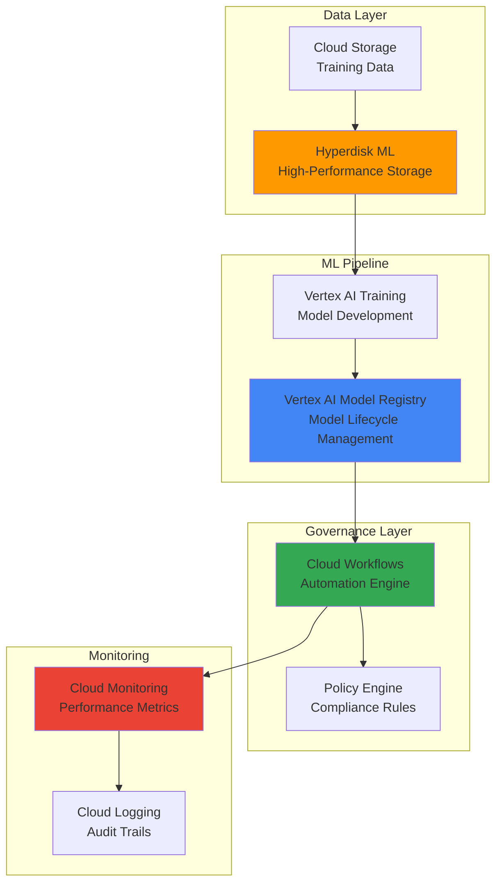

# ML Pipeline Governance with Hyperdisk ML and Vertex AI Model Registry

## Problem

Organizations struggle with managing machine learning models at scale, facing challenges with model lineage tracking, compliance enforcement, and inefficient training data storage that bottlenecks ML workflows. Without proper governance frameworks, teams cannot ensure model quality, maintain audit trails, or optimize training performance, leading to delayed deployments and regulatory compliance issues that impact business operations.

## Solution

Build a comprehensive ML governance system using Hyperdisk ML for high-performance training data storage and Vertex AI Model Registry for centralized model lifecycle management. This solution combines automated compliance monitoring through Cloud Workflows with real-time performance tracking via Cloud Monitoring to create an enterprise-grade MLOps governance framework that ensures model quality while optimizing training efficiency.

## Architecture Diagram



## Prerequisites

1. Google Cloud project with billing enabled and appropriate IAM permissions for Vertex AI, Compute Engine, and Cloud Workflows
2. Google Cloud CLI installed and configured (or Cloud Shell access)
3. Basic understanding of machine learning pipelines and MLOps concepts
4. Familiarity with Python for ML model development and governance scripts
5. Estimated cost: $50-100 for running training workloads and storage during recipe execution

> **Note**: This recipe follows Google Cloud MLOps best practices and the Well-Architected Framework. Review the [Vertex AI Model Registry documentation](https://cloud.google.com/vertex-ai/docs/model-registry/introduction) for additional governance guidance.

## Preparation

```bash
# Set environment variables for GCP resources
export PROJECT_ID="ml-governance-$(date +%s)"
export REGION="us-central1"
export ZONE="us-central1-a"

# Generate unique suffix for resource names
RANDOM_SUFFIX=$(openssl rand -hex 3)

# Set default project and region
gcloud config set project ${PROJECT_ID}
gcloud config set compute/region ${REGION}
gcloud config set compute/zone ${ZONE}

# Enable required APIs
gcloud services enable compute.googleapis.com
gcloud services enable aiplatform.googleapis.com
gcloud services enable workflows.googleapis.com
gcloud services enable monitoring.googleapis.com
gcloud services enable logging.googleapis.com
gcloud services enable storage.googleapis.com

# Create service accounts for ML governance
gcloud iam service-accounts create ml-governance-sa \
    --display-name="ML Governance Service Account"

# Assign necessary IAM roles
gcloud projects add-iam-policy-binding ${PROJECT_ID} \
    --member="serviceAccount:ml-governance-sa@${PROJECT_ID}.iam.gserviceaccount.com" \
    --role="roles/aiplatform.user"

gcloud projects add-iam-policy-binding ${PROJECT_ID} \
    --member="serviceAccount:ml-governance-sa@${PROJECT_ID}.iam.gserviceaccount.com" \
    --role="roles/workflows.invoker"

# Create Cloud Storage bucket for training data
gsutil mb -p ${PROJECT_ID} \
    -c STANDARD \
    -l ${REGION} \
    gs://ml-training-data-${RANDOM_SUFFIX}

echo "✅ Project configured: ${PROJECT_ID}"
echo "✅ Services enabled and IAM configured"
echo "✅ Storage bucket created: ml-training-data-${RANDOM_SUFFIX}"
```

## Steps

1. **Create Hyperdisk ML Volume for High-Performance Training Data**:

   Hyperdisk ML provides the highest read-only throughput optimized for machine learning workloads, offering up to 1,200,000 MiB/s throughput and supporting attachment to up to 2,500 instances. This specialized storage type dramatically improves training performance by reducing data loading bottlenecks that commonly limit ML pipeline efficiency.

   ```bash
   # Create Hyperdisk ML volume for training data
   gcloud compute disks create ml-training-hyperdisk-${RANDOM_SUFFIX} \
       --size=1000GB \
       --type=hyperdisk-ml \
       --region=${REGION} \
       --provisioned-throughput=10000
   
   echo "✅ Hyperdisk ML volume created with 10,000 MiB/s throughput"
   ```

   The Hyperdisk ML volume now provides enterprise-grade storage performance specifically optimized for ML workloads, ensuring that data access never becomes the bottleneck in your training pipelines.

2. **Create Compute Instance for ML Training with Hyperdisk ML Attachment**:

   Google Cloud's compute instances integrate seamlessly with Hyperdisk ML to maximize training performance. By attaching the high-performance storage directly to training instances, we establish the foundation for efficient model development with optimized data access patterns.

   ```bash
   # Create compute instance optimized for ML workloads
   gcloud compute instances create ml-training-instance-${RANDOM_SUFFIX} \
       --zone=${ZONE} \
       --machine-type=n1-standard-8 \
       --disk=name=ml-training-hyperdisk-${RANDOM_SUFFIX},mode=ro \
       --service-account=ml-governance-sa@${PROJECT_ID}.iam.gserviceaccount.com \
       --scopes=https://www.googleapis.com/auth/cloud-platform \
       --image-family=debian-11 \
       --image-project=debian-cloud
   
   # Wait for instance to be ready
   gcloud compute instances describe ml-training-instance-${RANDOM_SUFFIX} \
       --zone=${ZONE} \
       --format="value(status)"
   
   echo "✅ ML training instance created with Hyperdisk ML attachment"
   ```

   The training instance now has access to high-performance storage, enabling efficient data loading for intensive ML training workloads while maintaining cost-effective compute resources.

3. **Set Up Vertex AI Model Registry for Centralized Model Management**:

   Vertex AI Model Registry serves as the central repository for managing ML model lifecycles, providing versioning, metadata tracking, and deployment management. This centralized approach ensures consistent model governance across development, staging, and production environments.

   ```bash
   # Create a model in Vertex AI Model Registry
   gcloud ai models upload \
       --region=${REGION} \
       --display-name=governance-demo-model-${RANDOM_SUFFIX} \
       --description="ML model with automated governance tracking" \
       --version-aliases=staging \
       --container-image-uri=gcr.io/cloud-aiplatform/prediction/sklearn-cpu.1-0:latest \
       --artifact-uri=gs://ml-training-data-${RANDOM_SUFFIX}/models/
   
   # Store model ID for future reference
   export MODEL_ID=$(gcloud ai models list \
       --region=${REGION} \
       --filter="displayName:governance-demo-model-${RANDOM_SUFFIX}" \
       --format="value(name)" | cut -d'/' -f6)
   
   echo "✅ Model registered in Vertex AI Model Registry with ID: ${MODEL_ID}"
   ```

   The model is now registered with version control and alias management, providing the foundation for automated governance workflows and deployment tracking.

4. **Create Cloud Monitoring Metrics for ML Pipeline Governance**:

   Cloud Monitoring enables comprehensive tracking of ML pipeline performance, model quality metrics, and governance compliance indicators. Custom metrics provide visibility into training efficiency, model drift, and policy adherence across the entire ML lifecycle.

   ```bash
   # Create custom metrics for ML governance tracking
   cat > governance-metrics.yaml << EOF
   displayName: "ML Governance Metrics Dashboard"
   mosaicLayout:
     tiles:
     - width: 6
       height: 4
       widget:
         title: "Model Training Performance"
         scorecard:
           timeSeriesQuery:
             timeSeriesFilter:
               filter: 'resource.type="gce_instance"'
   EOF
   
   # Create monitoring dashboard for ML governance
   gcloud monitoring dashboards create \
       --config-from-file=governance-metrics.yaml
   
   echo "✅ ML governance monitoring dashboard created"
   ```

   The monitoring infrastructure now tracks key governance metrics, enabling proactive identification of performance issues and compliance violations in the ML pipeline.

5. **Implement Automated Governance Workflow with Cloud Workflows**:

   Cloud Workflows orchestrates automated governance processes, enforcing compliance policies, validating model quality, and managing deployment approvals. This serverless orchestration ensures consistent governance enforcement without manual intervention while maintaining audit trails for regulatory compliance.

   ```bash
   # Create governance workflow definition
   cat > ml-governance-workflow.yaml << EOF
   main:
     steps:
     - validateModel:
         call: validateModelQuality
         args:
           modelId: \${MODEL_ID}
           region: \${REGION}
     - checkCompliance:
         call: checkComplianceRules
         args:
           modelId: \${MODEL_ID}
     - updateRegistry:
         call: updateModelRegistry
         args:
           modelId: \${MODEL_ID}
           status: "approved"
     - notifyStakeholders:
         call: sendNotification
         args:
           message: "Model governance validation completed"
   
   validateModelQuality:
     params: [modelId, region]
     steps:
     - logValidation:
         call: sys.log
         args:
           text: \${"Validating model quality for: " + modelId}
     - return:
         return: {"status": "validated"}
   
   checkComplianceRules:
     params: [modelId]
     steps:
     - logCompliance:
         call: sys.log
         args:
           text: \${"Checking compliance for model: " + modelId}
     - return:
         return: {"compliance": "passed"}
   
   updateModelRegistry:
     params: [modelId, status]
     steps:
     - logUpdate:
         call: sys.log
         args:
           text: \${"Updating model registry: " + modelId}
     - return:
         return: {"updated": true}
   
   sendNotification:
     params: [message]
     steps:
     - logNotification:
         call: sys.log
         args:
           text: \${"Notification: " + message}
     - return:
         return: {"sent": true}
   EOF
   
   # Deploy the governance workflow
   gcloud workflows deploy ml-governance-workflow-${RANDOM_SUFFIX} \
       --source=ml-governance-workflow.yaml \
       --location=${REGION} \
       --service-account=ml-governance-sa@${PROJECT_ID}.iam.gserviceaccount.com
   
   echo "✅ Automated governance workflow deployed"
   ```

   The governance workflow now automatically validates model quality, checks compliance rules, and updates the model registry, ensuring consistent governance enforcement across all ML deployments.

6. **Configure Model Versioning and Alias Management**:

   Vertex AI Model Registry's versioning system enables controlled model evolution with proper governance checkpoints. Alias management supports safe deployment strategies, allowing teams to promote models through development, staging, and production environments with automated validation at each stage.

   ```bash
   # Create model version with governance metadata
   gcloud ai models upload \
       --region=${REGION} \
       --parent-model=${MODEL_ID} \
       --display-name=governance-demo-model-v2-${RANDOM_SUFFIX} \
       --description="Model version with enhanced governance features" \
       --version-aliases=development,governance-enabled \
       --container-image-uri=gcr.io/cloud-aiplatform/prediction/sklearn-cpu.1-0:latest \
       --artifact-uri=gs://ml-training-data-${RANDOM_SUFFIX}/models/v2/ \
       --labels=governance=enabled,compliance=validated
   
   # Set up model alias for controlled deployment
   gcloud ai models update ${MODEL_ID} \
       --region=${REGION} \
       --update-labels=governance-status=active,last-validated=$(date +%Y-%m-%d)
   
   echo "✅ Model versioning configured with governance labels"
   ```

   Model versions now include governance metadata and controlled aliases, enabling automated promotion through environments while maintaining compliance tracking and audit capabilities.

7. **Create Policy Engine for Compliance Enforcement**:

   A robust policy engine ensures that all models meet organizational standards before deployment. This automated compliance system validates security requirements, performance thresholds, and business rules, preventing non-compliant models from reaching production environments.

   ```bash
   # Create policy validation script
   cat > governance-policies.py << 'EOF'
   import json
   import logging
   from typing import Dict, List, Any
   
   class MLGovernancePolicies:
       def __init__(self):
           self.policies = {
               'performance_threshold': 0.85,
               'max_model_size': 1000,  # MB
               'required_labels': ['governance', 'compliance'],
               'security_scan_required': True
           }
       
       def validate_model(self, model_metadata: Dict[str, Any]) -> Dict[str, Any]:
           """Validate model against governance policies"""
           results = {
               'passed': True,
               'violations': [],
               'recommendations': []
           }
           
           # Check performance threshold
           if 'accuracy' in model_metadata:
               if model_metadata['accuracy'] < self.policies['performance_threshold']:
                   results['violations'].append(f"Model accuracy {model_metadata['accuracy']} below threshold {self.policies['performance_threshold']}")
                   results['passed'] = False
           
           # Check required labels
           model_labels = model_metadata.get('labels', {})
           for required_label in self.policies['required_labels']:
               if required_label not in model_labels:
                   results['violations'].append(f"Missing required label: {required_label}")
                   results['passed'] = False
           
           # Add recommendations
           if results['passed']:
               results['recommendations'].append("Model meets all governance requirements")
           else:
               results['recommendations'].append("Address policy violations before deployment")
           
           return results
   
   if __name__ == "__main__":
       # Example model metadata
       model_metadata = {
           'accuracy': 0.92,
           'labels': {'governance': 'enabled', 'compliance': 'validated'},
           'size_mb': 150
       }
       
       policy_engine = MLGovernancePolicies()
       validation_result = policy_engine.validate_model(model_metadata)
       print(json.dumps(validation_result, indent=2))
   EOF
   
   # Test policy validation
   python3 governance-policies.py
   
   echo "✅ Policy engine created for compliance enforcement"
   ```

   The policy engine now automatically validates models against organizational standards, ensuring compliance before deployment while providing clear feedback on any violations or recommendations.

8. **Set Up Automated Model Lineage Tracking**:

   Model lineage tracking provides complete visibility into model development processes, including data sources, training parameters, and deployment history. This comprehensive tracking enables reproducibility, debugging, and compliance auditing throughout the model lifecycle.

   ```bash
   # Create lineage tracking system
   cat > model-lineage.py << 'EOF'
   import json
   import uuid
   from datetime import datetime
   from typing import Dict, List, Any
   
   class ModelLineageTracker:
       def __init__(self, project_id: str, region: str):
           self.project_id = project_id
           self.region = region
           self.lineage_data = {}
       
       def track_training_run(self, model_id: str, training_config: Dict[str, Any]) -> str:
           """Track a new model training run"""
           run_id = str(uuid.uuid4())
           
           lineage_entry = {
               'run_id': run_id,
               'model_id': model_id,
               'timestamp': datetime.now().isoformat(),
               'training_config': training_config,
               'data_sources': training_config.get('data_sources', []),
               'hyperparameters': training_config.get('hyperparameters', {}),
               'environment': {
                   'project_id': self.project_id,
                   'region': self.region,
                   'storage_type': 'hyperdisk-ml'
               }
           }
           
           self.lineage_data[run_id] = lineage_entry
           return run_id
       
       def get_model_lineage(self, model_id: str) -> List[Dict[str, Any]]:
           """Retrieve complete lineage for a model"""
           return [entry for entry in self.lineage_data.values() 
                   if entry['model_id'] == model_id]
       
       def export_lineage(self) -> str:
           """Export lineage data for audit purposes"""
           return json.dumps(self.lineage_data, indent=2)
   
   # Initialize lineage tracker
   tracker = ModelLineageTracker("${PROJECT_ID}", "${REGION}")
   
   # Track a sample training run
   training_config = {
       'algorithm': 'random_forest',
       'data_sources': ['gs://ml-training-data-${RANDOM_SUFFIX}/dataset.csv'],
       'hyperparameters': {'n_estimators': 100, 'max_depth': 10},
       'storage_performance': '10000_mbps_throughput'
   }
   
   run_id = tracker.track_training_run("${MODEL_ID}", training_config)
   print(f"Training run tracked with ID: {run_id}")
   
   # Export lineage for audit
   with open('model-lineage-audit.json', 'w') as f:
       f.write(tracker.export_lineage())
   
   print("Model lineage tracking initialized and audit file created")
   EOF
   
   python3 model-lineage.py
   
   echo "✅ Model lineage tracking system configured"
   ```

   The lineage tracking system now captures comprehensive model development history, enabling full traceability and supporting regulatory compliance requirements with detailed audit trails.

## Validation & Testing

1. **Verify Hyperdisk ML Performance and Attachment**:

   ```bash
   # Check Hyperdisk ML volume status and performance
   gcloud compute disks describe ml-training-hyperdisk-${RANDOM_SUFFIX} \
       --region=${REGION} \
       --format="table(name,status,type,provisionedThroughput)"
   
   # Verify instance attachment
   gcloud compute instances describe ml-training-instance-${RANDOM_SUFFIX} \
       --zone=${ZONE} \
       --format="value(disks[].source)" | grep hyperdisk
   ```

   Expected output: Hyperdisk ML volume showing "READY" status with provisioned throughput of 10,000 MiB/s and successful attachment to the training instance.

2. **Test Vertex AI Model Registry Integration**:

   ```bash
   # Verify model registration and metadata
   gcloud ai models describe ${MODEL_ID} \
       --region=${REGION} \
       --format="table(displayName,labels,versionAliases)"
   
   # Check model versions and governance labels
   gcloud ai models list \
       --region=${REGION} \
       --filter="labels.governance=enabled" \
       --format="value(displayName,labels)"
   ```

   Expected output: Model registry showing registered models with governance labels and version aliases properly configured.

3. **Validate Governance Workflow Execution**:

   ```bash
   # Execute governance workflow
   gcloud workflows run ml-governance-workflow-${RANDOM_SUFFIX} \
       --location=${REGION} \
       --data='{"MODEL_ID":"'${MODEL_ID}'","REGION":"'${REGION}'"}'
   
   # Check workflow execution status
   EXECUTION_ID=$(gcloud workflows executions list \
       --workflow=ml-governance-workflow-${RANDOM_SUFFIX} \
       --location=${REGION} \
       --limit=1 \
       --format="value(name)")
   
   gcloud workflows executions describe ${EXECUTION_ID} \
       --workflow=ml-governance-workflow-${RANDOM_SUFFIX} \
       --location=${REGION} \
       --format="value(state,result)"
   ```

   Expected output: Workflow execution completing successfully with "SUCCEEDED" state and governance validation results.

4. **Test Policy Engine Compliance Validation**:

   ```bash
   # Run policy validation test
   python3 governance-policies.py
   
   # Verify compliance results
   if [ -f "model-lineage-audit.json" ]; then
       echo "✅ Lineage tracking operational"
       jq '.[] | .environment.storage_type' model-lineage-audit.json
   fi
   ```

   Expected output: Policy validation showing passed compliance checks and lineage audit file containing storage performance metrics.

## Cleanup

1. **Remove Workflow and Monitoring Resources**:

   ```bash
   # Delete governance workflow
   gcloud workflows delete ml-governance-workflow-${RANDOM_SUFFIX} \
       --location=${REGION} \
       --quiet
   
   # Remove monitoring dashboard
   DASHBOARD_ID=$(gcloud monitoring dashboards list \
       --filter="displayName:'ML Governance Metrics Dashboard'" \
       --format="value(name)")
   
   if [ ! -z "${DASHBOARD_ID}" ]; then
       gcloud monitoring dashboards delete ${DASHBOARD_ID} --quiet
   fi
   
   echo "✅ Deleted workflow and monitoring resources"
   ```

2. **Remove Vertex AI Models and Registry Entries**:

   ```bash
   # Delete model from Vertex AI Model Registry
   gcloud ai models delete ${MODEL_ID} \
       --region=${REGION} \
       --quiet
   
   echo "✅ Deleted Vertex AI models"
   ```

3. **Remove Compute Instance and Hyperdisk ML Volume**:

   ```bash
   # Delete compute instance
   gcloud compute instances delete ml-training-instance-${RANDOM_SUFFIX} \
       --zone=${ZONE} \
       --quiet
   
   # Delete Hyperdisk ML volume
   gcloud compute disks delete ml-training-hyperdisk-${RANDOM_SUFFIX} \
       --region=${REGION} \
       --quiet
   
   echo "✅ Deleted compute and storage resources"
   ```

4. **Remove Cloud Storage and Service Accounts**:

   ```bash
   # Remove Cloud Storage bucket and contents
   gsutil -m rm -r gs://ml-training-data-${RANDOM_SUFFIX}
   
   # Delete service account
   gcloud iam service-accounts delete ml-governance-sa@${PROJECT_ID}.iam.gserviceaccount.com \
       --quiet
   
   # Clean up local files
   rm -f governance-metrics.yaml ml-governance-workflow.yaml
   rm -f governance-policies.py model-lineage.py model-lineage-audit.json
   
   echo "✅ Cleanup completed successfully"
   echo "Note: Consider deleting the project if created specifically for this recipe"
   ```

## Discussion

This comprehensive ML governance solution demonstrates how Google Cloud's specialized services work together to create enterprise-grade MLOps infrastructure. Hyperdisk ML provides the high-performance storage foundation essential for efficient ML training, delivering up to 1,200,000 MiB/s throughput that eliminates data loading bottlenecks commonly experienced in traditional storage systems. This performance advantage becomes critical when training large models with massive datasets, where storage I/O often becomes the limiting factor in training efficiency.

The Vertex AI Model Registry serves as the central governance hub, providing not just model storage but comprehensive lifecycle management including versioning, metadata tracking, and deployment control. This centralized approach ensures that all models follow consistent governance practices, from initial development through production deployment. The registry's integration with Google Cloud's security framework ensures that access controls and audit trails meet enterprise compliance requirements while supporting collaborative ML development workflows.

Cloud Workflows orchestrates the governance automation, enforcing compliance policies and validation rules without manual intervention. This serverless orchestration approach ensures that governance processes scale with ML workload demands while maintaining consistent enforcement of organizational policies. The workflow system's integration with Cloud Monitoring provides real-time visibility into governance processes, enabling proactive identification of compliance issues and performance bottlenecks.

The policy engine implementation demonstrates how organizations can codify their ML governance requirements into automated validation systems. By defining clear performance thresholds, security requirements, and compliance standards, teams can ensure that only models meeting organizational criteria progress to production environments. This automated approach reduces the risk of human error while providing consistent governance enforcement across diverse ML projects and teams.

> **Tip**: Implement gradual rollout strategies using Vertex AI Model Registry aliases to safely promote models through environments while maintaining governance controls and rollback capabilities.

## Challenge

Extend this ML governance solution by implementing these advanced enhancements:

1. **Implement automated model drift detection** using Cloud Monitoring custom metrics and alerting to trigger retraining workflows when model performance degrades in production environments.

2. **Create a multi-environment promotion pipeline** that automatically validates models in staging environments before production deployment, including A/B testing capabilities and performance comparison analytics.

3. **Build advanced lineage tracking** that captures feature engineering pipelines, data transformation steps, and external data source dependencies to provide complete end-to-end traceability for regulatory compliance.

4. **Integrate with external governance tools** such as Apache Atlas or custom LDAP systems to synchronize access controls and approval workflows with existing enterprise governance infrastructure.

5. **Implement cost optimization governance** that tracks training costs, storage utilization, and compute efficiency to automatically recommend resource optimization strategies and enforce budget constraints across ML projects.

## Infrastructure Code

*Infrastructure code will be generated after recipe approval.*