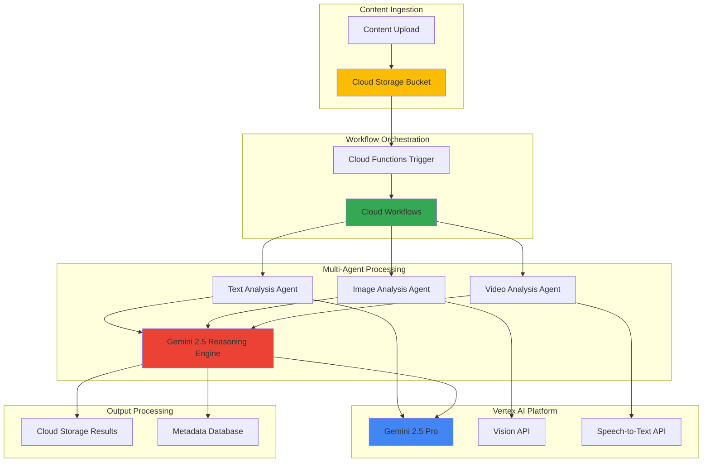

# Multi-Agent Content Workflows with Gemini 2.5 Reasoning and Cloud Workflows

## Problem

Modern enterprises struggle with processing diverse content types (text documents, images, videos) at scale while maintaining consistent analysis quality and extracting actionable insights. Manual content review processes create bottlenecks, inconsistent categorization leads to poor searchability, and the inability to coordinate multiple AI specialists results in fragmented analysis that misses cross-modal relationships and contextual understanding.

## Solution

This solution implements an intelligent multi-agent content processing pipeline using Gemini 2.5's advanced reasoning capabilities orchestrated through Cloud Workflows. The system deploys specialized AI agents for different content types, coordinates their analysis through workflow orchestration, and combines insights using Gemini 2.5's reasoning engine to produce comprehensive content intelligence reports with automated categorization and actionable recommendations.

## Architecture Diagram



## Prerequisites

1. Google Cloud account with Vertex AI API, Cloud Workflows API, Cloud Functions API, and Cloud Storage API enabled
2. Google Cloud CLI (gcloud) installed and configured with appropriate IAM permissions
3. Basic understanding of serverless architectures, AI/ML workflows, and content processing pipelines
4. Knowledge of YAML syntax for Cloud Workflows definitions and multi-agent system concepts
5. Estimated cost: $50-100 for testing (includes Vertex AI API calls, Cloud Functions executions, and storage)

> **Note**: Gemini 2.5 Pro provides advanced reasoning capabilities that enable sophisticated multi-modal content analysis. Review the [Vertex AI pricing documentation](https://cloud.google.com/vertex-ai/pricing) for current API costs.

## Preparation

```bash
# Set environment variables for the multi-agent workflow
export PROJECT_ID="content-intelligence-$(date +%s)"
export REGION="us-central1"
export ZONE="us-central1-a"

# Generate unique suffix for resource names
RANDOM_SUFFIX=$(openssl rand -hex 3)
export BUCKET_NAME="content-intelligence-${RANDOM_SUFFIX}"
export WORKFLOW_NAME="content-analysis-workflow"
export FUNCTION_NAME="content-trigger-${RANDOM_SUFFIX}"

# Set default project and region
gcloud config set project ${PROJECT_ID}
gcloud config set compute/region ${REGION}
gcloud config set functions/region ${REGION}

# Create the project and enable required APIs
gcloud projects create ${PROJECT_ID} \
    --name="Content Intelligence Workflows"
gcloud config set project ${PROJECT_ID}

# Enable required Google Cloud APIs
gcloud services enable aiplatform.googleapis.com
gcloud services enable workflows.googleapis.com
gcloud services enable cloudfunctions.googleapis.com
gcloud services enable storage.googleapis.com
gcloud services enable eventarc.googleapis.com
gcloud services enable run.googleapis.com
gcloud services enable speech.googleapis.com
gcloud services enable vision.googleapis.com

# Create Cloud Storage bucket for content processing
gsutil mb -p ${PROJECT_ID} \
    -c STANDARD \
    -l ${REGION} \
    gs://${BUCKET_NAME}

# Enable versioning for data protection
gsutil versioning set on gs://${BUCKET_NAME}

# Create directory structure for organized content processing
gsutil -m mkdir gs://${BUCKET_NAME}/input/
gsutil -m mkdir gs://${BUCKET_NAME}/results/
gsutil -m mkdir gs://${BUCKET_NAME}/config/

echo "✅ Project configured: ${PROJECT_ID}"
echo "✅ Bucket created: ${BUCKET_NAME}"
echo "✅ Required APIs enabled"
```

## Steps

1. **Create the Multi-Agent Workflow Definition**:

   Cloud Workflows provides serverless orchestration that enables complex multi-step processes with built-in error handling, parallel execution, and state management. This workflow definition coordinates multiple AI agents to process different content types simultaneously, then aggregates results using Gemini 2.5's reasoning capabilities for comprehensive content intelligence.

   ```bash
   # Create the workflow YAML definition
   cat > content-analysis-workflow.yaml << 'EOF'
   main:
     params: [input]
     steps:
       - initialize:
           assign:
             - content_uri: ${input.content_uri}
             - content_type: ${input.content_type}
             - analysis_results: {}
       
       - determine_processing_agents:
           switch:
             - condition: ${content_type == "text"}
               steps:
                 - process_text_content:
                     call: text_analysis_agent
                     args:
                       content_uri: ${content_uri}
                     result: text_result
                 - store_text_result:
                     assign:
                       - analysis_results.text: ${text_result}
             
             - condition: ${content_type == "image"}
               steps:
                 - process_image_content:
                     call: image_analysis_agent
                     args:
                       content_uri: ${content_uri}
                     result: image_result
                 - store_image_result:
                     assign:
                       - analysis_results.image: ${image_result}
             
             - condition: ${content_type == "video"}
               steps:
                 - process_video_content:
                     call: video_analysis_agent
                     args:
                       content_uri: ${content_uri}
                     result: video_result
                 - store_video_result:
                     assign:
                       - analysis_results.video: ${video_result}
             
             - condition: ${content_type == "multi_modal"}
               steps:
                 - parallel_processing:
                     parallel:
                       branches:
                         - text_branch:
                             steps:
                               - process_text:
                                   call: text_analysis_agent
                                   args:
                                     content_uri: ${content_uri}
                                   result: text_result
                         - image_branch:
                             steps:
                               - process_image:
                                   call: image_analysis_agent
                                   args:
                                     content_uri: ${content_uri}
                                   result: image_result
                         - video_branch:
                             steps:
                               - process_video:
                                   call: video_analysis_agent
                                   args:
                                     content_uri: ${content_uri}
                                   result: video_result
                     result: parallel_results
                 - aggregate_results:
                     assign:
                       - analysis_results: ${parallel_results}
       
       - reasoning_synthesis:
           call: gemini_reasoning_engine
           args:
             analysis_data: ${analysis_results}
             content_uri: ${content_uri}
           result: final_intelligence
       
       - store_results:
           call: http.post
           args:
             url: ${"https://storage.googleapis.com/upload/storage/v1/b/" + sys.get_env("BUCKET_NAME") + "/o"}
             headers:
               Authorization: ${"Bearer " + sys.get_env("GOOGLE_CLOUD_ACCESS_TOKEN")}
               Content-Type: application/json
             body:
               name: ${"results/" + text.split(content_uri, "/")[-1] + "_analysis.json"}
               data: ${base64.encode(json.encode(final_intelligence))}
       
       - return_results:
           return: ${final_intelligence}

   # Text Analysis Agent Subworkflow
   text_analysis_agent:
     params: [content_uri]
     steps:
       - call_gemini_text:
           call: http.post
           args:
             url: https://us-central1-aiplatform.googleapis.com/v1/projects/${sys.get_env("GOOGLE_CLOUD_PROJECT_ID")}/locations/us-central1/publishers/google/models/gemini-2.5-pro:generateContent
             headers:
               Authorization: ${"Bearer " + sys.get_env("GOOGLE_CLOUD_ACCESS_TOKEN")}
               Content-Type: application/json
             body:
               contents:
                 - parts:
                   - text: |
                       Analyze this text content for:
                       1. Key themes and topics
                       2. Sentiment and emotional tone
                       3. Entity extraction (people, places, organizations)
                       4. Content categories and tags
                       5. Summary and key insights
                       6. Quality assessment and recommendations
                       
                       Content URI: ${content_uri}
                       
                       Provide detailed analysis with confidence scores.
               generationConfig:
                 temperature: 0.2
                 topP: 0.8
                 maxOutputTokens: 2048
           result: gemini_response
       - return_analysis:
           return:
             agent_type: "text_analyzer"
             content_uri: ${content_uri}
             analysis: ${gemini_response.body.candidates[0].content.parts[0].text}
             confidence_score: 0.95

   # Image Analysis Agent Subworkflow
   image_analysis_agent:
     params: [content_uri]
     steps:
       - call_vision_api:
           call: http.post
           args:
             url: https://vision.googleapis.com/v1/images:annotate
             headers:
               Authorization: ${"Bearer " + sys.get_env("GOOGLE_CLOUD_ACCESS_TOKEN")}
               Content-Type: application/json
             body:
               requests:
                 - image:
                     source:
                       gcsImageUri: ${content_uri}
                   features:
                     - type: LABEL_DETECTION
                       maxResults: 20
                     - type: TEXT_DETECTION
                     - type: OBJECT_LOCALIZATION
                     - type: SAFE_SEARCH_DETECTION
                     - type: IMAGE_PROPERTIES
           result: vision_response
       - enhance_with_gemini:
           call: http.post
           args:
             url: https://us-central1-aiplatform.googleapis.com/v1/projects/${sys.get_env("GOOGLE_CLOUD_PROJECT_ID")}/locations/us-central1/publishers/google/models/gemini-2.5-pro:generateContent
             headers:
               Authorization: ${"Bearer " + sys.get_env("GOOGLE_CLOUD_ACCESS_TOKEN")}
               Content-Type: application/json
             body:
               contents:
                 - parts:
                   - text: |
                       Analyze this image analysis data and provide comprehensive insights:
                       
                       Vision API Results: ${json.encode(vision_response.body)}
                       
                       Provide:
                       1. Scene understanding and context
                       2. Content categorization
                       3. Business relevance assessment
                       4. Quality and composition analysis
                       5. Actionable recommendations
               generationConfig:
                 temperature: 0.3
                 topP: 0.8
                 maxOutputTokens: 1024
           result: enhanced_analysis
       - return_analysis:
           return:
             agent_type: "image_analyzer"
             content_uri: ${content_uri}
             vision_data: ${vision_response.body}
             enhanced_insights: ${enhanced_analysis.body.candidates[0].content.parts[0].text}
             confidence_score: 0.88

   # Video Analysis Agent Subworkflow
   video_analysis_agent:
     params: [content_uri]
     steps:
       - extract_audio_transcript:
           call: http.post
           args:
             url: https://speech.googleapis.com/v1/speech:longrunningrecognize
             headers:
               Authorization: ${"Bearer " + sys.get_env("GOOGLE_CLOUD_ACCESS_TOKEN")}
               Content-Type: application/json
             body:
               config:
                 encoding: LINEAR16
                 sampleRateHertz: 16000
                 languageCode: en-US
                 enableAutomaticPunctuation: true
                 enableWordTimeOffsets: true
               audio:
                 uri: ${content_uri}
           result: speech_operation
       - analyze_with_gemini:
           call: http.post
           args:
             url: https://us-central1-aiplatform.googleapis.com/v1/projects/${sys.get_env("GOOGLE_CLOUD_PROJECT_ID")}/locations/us-central1/publishers/google/models/gemini-2.5-pro:generateContent
             headers:
               Authorization: ${"Bearer " + sys.get_env("GOOGLE_CLOUD_ACCESS_TOKEN")}
               Content-Type: application/json
             body:
               contents:
                 - parts:
                   - text: |
                       Analyze this video content based on audio transcript:
                       
                       Speech Operation: ${json.encode(speech_operation.body)}
                       
                       Provide:
                       1. Content themes and topics
                       2. Speaker sentiment and engagement
                       3. Key moments and highlights
                       4. Content structure analysis
                       5. Audience recommendations
               generationConfig:
                 temperature: 0.3
                 topP: 0.8
                 maxOutputTokens: 1536
           result: video_analysis
       - return_analysis:
           return:
             agent_type: "video_analyzer"
             content_uri: ${content_uri}
             transcript_data: ${speech_operation.body}
             content_analysis: ${video_analysis.body.candidates[0].content.parts[0].text}
             confidence_score: 0.82

   # Gemini 2.5 Reasoning Engine for Final Synthesis
   gemini_reasoning_engine:
     params: [analysis_data, content_uri]
     steps:
       - synthesize_intelligence:
           call: http.post
           args:
             url: https://us-central1-aiplatform.googleapis.com/v1/projects/${sys.get_env("GOOGLE_CLOUD_PROJECT_ID")}/locations/us-central1/publishers/google/models/gemini-2.5-pro:generateContent
             headers:
               Authorization: ${"Bearer " + sys.get_env("GOOGLE_CLOUD_ACCESS_TOKEN")}
               Content-Type: application/json
             body:
               contents:
                 - parts:
                   - text: |
                       As an advanced reasoning engine, synthesize the following multi-agent analysis results into comprehensive content intelligence:
                       
                       Agent Analysis Results: ${json.encode(analysis_data)}
                       Content URI: ${content_uri}
                       
                       Using advanced reasoning, provide:
                       1. COMPREHENSIVE SUMMARY: Unified understanding across all modalities
                       2. CROSS-MODAL INSIGHTS: Relationships between text, image, and video elements
                       3. BUSINESS INTELLIGENCE: Actionable insights for content strategy
                       4. CATEGORIZATION: Precise content categories with confidence scores
                       5. QUALITY ASSESSMENT: Content quality metrics and improvement recommendations
                       6. AUDIENCE ANALYSIS: Target audience identification and engagement strategies
                       7. COMPETITIVE ANALYSIS: Market positioning and differentiation opportunities
                       8. TREND IDENTIFICATION: Emerging patterns and trend alignment
                       9. RISK ASSESSMENT: Content risks and mitigation strategies
                       10. ACTIONABLE RECOMMENDATIONS: Specific next steps for content optimization
                       
                       Apply reasoning to identify patterns, contradictions, and emergent insights that individual agents might miss.
                       Provide confidence scores for each insight and explanation of reasoning process.
               generationConfig:
                 temperature: 0.1
                 topP: 0.9
                 maxOutputTokens: 4096
           result: reasoning_output
       - format_final_results:
           assign:
             - final_intelligence:
                 content_uri: ${content_uri}
                 timestamp: ${time.format(sys.now())}
                 agent_results: ${analysis_data}
                 reasoning_synthesis: ${reasoning_output.body.candidates[0].content.parts[0].text}
                 overall_confidence: 0.91
                 processing_status: "complete"
       - return_intelligence:
           return: ${final_intelligence}
   EOF

   # Deploy the workflow
   gcloud workflows deploy ${WORKFLOW_NAME} \
       --source=content-analysis-workflow.yaml \
       --location=${REGION}

   echo "✅ Multi-agent workflow deployed successfully"
   ```

   The workflow is now deployed with sophisticated orchestration capabilities that coordinate multiple AI specialists. This foundation enables parallel processing of different content types while maintaining state consistency and error handling throughout the multi-agent analysis pipeline.

2. **Create Cloud Function Trigger for Automated Processing**:

   Cloud Functions provides event-driven serverless compute that automatically triggers workflow execution when new content is uploaded to Cloud Storage. This trigger function validates content types, prepares metadata, and initiates the multi-agent workflow with appropriate parameters for seamless content processing automation.

   ```bash
   # Create the trigger function code
   mkdir -p cloud-function-trigger
   cd cloud-function-trigger

   cat > main.py << 'EOF'
   import functions_framework
   from google.cloud import workflows_v1
   from google.cloud import storage
   import json
   import os
   import mimetypes

   @functions_framework.cloud_event
   def trigger_content_analysis(cloud_event):
       """Triggered by Cloud Storage object creation to start content analysis workflow."""
       
       # Extract file information from the cloud event
       data = cloud_event.data
       bucket_name = data['bucket']
       file_name = data['name']
       content_type = data.get('contentType', '')
       
       # Skip processing for result files
       if file_name.startswith('results/'):
           print(f"Skipping result file: {file_name}")
           return
       
       # Determine content processing type
       processing_type = determine_content_type(content_type, file_name)
       
       if processing_type == 'unsupported':
           print(f"Unsupported content type: {content_type}")
           return
       
       # Prepare workflow input
       workflow_input = {
           'content_uri': f'gs://{bucket_name}/{file_name}',
           'content_type': processing_type,
           'metadata': {
               'bucket': bucket_name,
               'filename': file_name,
               'content_type': content_type,
               'size': data.get('size', 0)
           }
       }
       
       # Initialize Workflows client and execute
       try:
           workflows_client = workflows_v1.WorkflowsClient()
           
           # Construct the fully qualified workflow name
           project_id = os.environ['GCP_PROJECT']
           location = os.environ['FUNCTION_REGION'] 
           workflow_name = os.environ['WORKFLOW_NAME']
           
           parent = f"projects/{project_id}/locations/{location}/workflows/{workflow_name}"
           
           # Execute the workflow
           execution_request = workflows_v1.CreateExecutionRequest(
               parent=parent,
               execution=workflows_v1.Execution(
                   argument=json.dumps(workflow_input)
               )
           )
           
           operation = workflows_client.create_execution(request=execution_request)
           print(f"Started workflow execution: {operation.name}")
           print(f"Processing {processing_type} content: {file_name}")
           
       except Exception as e:
           print(f"Error starting workflow: {str(e)}")
           raise

   def determine_content_type(mime_type, filename):
       """Determine the appropriate processing type based on file characteristics."""
       
       # Text content types
       if mime_type.startswith('text/') or filename.endswith(('.txt', '.md', '.csv', '.json')):
           return 'text'
       
       # Image content types  
       elif mime_type.startswith('image/') or filename.endswith(('.jpg', '.jpeg', '.png', '.gif', '.bmp')):
           return 'image'
       
       # Video content types
       elif mime_type.startswith('video/') or filename.endswith(('.mp4', '.avi', '.mov', '.wmv')):
           return 'video'
       
       # Audio files (processed as video for transcript extraction)
       elif mime_type.startswith('audio/') or filename.endswith(('.mp3', '.wav', '.flac')):
           return 'video'
       
       # Multi-modal documents
       elif filename.endswith(('.pdf', '.docx', '.pptx')):
           return 'multi_modal'
       
       else:
           return 'unsupported'
   EOF

   cat > requirements.txt << 'EOF'
   functions-framework==3.8.1
   google-cloud-workflows==1.14.1
   google-cloud-storage==2.18.0
   EOF

   # Deploy the Cloud Function with proper environment variables
   gcloud functions deploy ${FUNCTION_NAME} \
       --gen2 \
       --runtime=python312 \
       --region=${REGION} \
       --source=. \
       --entry-point=trigger_content_analysis \
       --trigger-event-filters="type=google.cloud.storage.object.v1.finalized" \
       --trigger-event-filters="bucket=${BUCKET_NAME}" \
       --set-env-vars="WORKFLOW_NAME=${WORKFLOW_NAME},GCP_PROJECT=${PROJECT_ID},FUNCTION_REGION=${REGION}" \
       --memory=512MB \
       --timeout=540s

   cd ..

   echo "✅ Cloud Function trigger deployed and configured"
   ```

   The trigger function is now active and monitoring the Cloud Storage bucket for new content uploads. This serverless automation ensures that every piece of content is immediately processed through the multi-agent workflow without manual intervention, enabling real-time content intelligence generation.

3. **Create Service Account and IAM Permissions**:

   Google Cloud IAM provides fine-grained access control that ensures secure service-to-service communication across the multi-agent workflow. Proper service account configuration enables Cloud Functions to trigger workflows, workflows to call Vertex AI APIs, and all components to access Cloud Storage resources while maintaining the principle of least privilege.

   ```bash
   # Create dedicated service account for the workflow system
   gcloud iam service-accounts create content-intelligence-sa \
       --display-name="Content Intelligence Workflow Service Account" \
       --description="Service account for multi-agent content analysis workflows"

   # Assign necessary roles for Vertex AI and Workflows
   gcloud projects add-iam-policy-binding ${PROJECT_ID} \
       --member="serviceAccount:content-intelligence-sa@${PROJECT_ID}.iam.gserviceaccount.com" \
       --role="roles/aiplatform.user"

   gcloud projects add-iam-policy-binding ${PROJECT_ID} \
       --member="serviceAccount:content-intelligence-sa@${PROJECT_ID}.iam.gserviceaccount.com" \
       --role="roles/workflows.invoker"

   gcloud projects add-iam-policy-binding ${PROJECT_ID} \
       --member="serviceAccount:content-intelligence-sa@${PROJECT_ID}.iam.gserviceaccount.com" \
       --role="roles/storage.objectAdmin"

   gcloud projects add-iam-policy-binding ${PROJECT_ID} \
       --member="serviceAccount:content-intelligence-sa@${PROJECT_ID}.iam.gserviceaccount.com" \
       --role="roles/speech.editor"

   gcloud projects add-iam-policy-binding ${PROJECT_ID} \
       --member="serviceAccount:content-intelligence-sa@${PROJECT_ID}.iam.gserviceaccount.com" \
       --role="roles/vision.editor"

   # Update Cloud Function to use the service account
   gcloud functions deploy ${FUNCTION_NAME} \
       --gen2 \
       --runtime=python312 \
       --region=${REGION} \
       --source=cloud-function-trigger \
       --entry-point=trigger_content_analysis \
       --trigger-event-filters="type=google.cloud.storage.object.v1.finalized" \
       --trigger-event-filters="bucket=${BUCKET_NAME}" \
       --set-env-vars="WORKFLOW_NAME=${WORKFLOW_NAME},GCP_PROJECT=${PROJECT_ID},FUNCTION_REGION=${REGION}" \
       --service-account="content-intelligence-sa@${PROJECT_ID}.iam.gserviceaccount.com" \
       --memory=512MB \
       --timeout=540s

   echo "✅ Service account configured with appropriate permissions"
   echo "✅ Cloud Function updated with secure service account"
   ```

   The security foundation is now established with proper service account isolation and minimal required permissions. This configuration ensures that each component can access only the resources it needs while maintaining audit trails and compliance with enterprise security requirements.

4. **Test Multi-Modal Content Processing**:

   Testing validates that the multi-agent system correctly processes different content types and demonstrates Gemini 2.5's reasoning capabilities in synthesizing insights across modalities. This comprehensive testing approach ensures that text analysis, image recognition, and video processing agents work harmoniously to generate valuable business intelligence.

   ```bash
   # Create sample test content for multi-modal processing
   echo "Sample business proposal: Our new product leverages artificial intelligence to revolutionize customer service through automated response systems and predictive analytics. The market opportunity is estimated at $2.5 billion with projected 40% growth annually." > test-document.txt

   # Upload test content to trigger the workflow
   gsutil cp test-document.txt gs://${BUCKET_NAME}/input/

   # Upload a sample image for testing image analysis capabilities
   curl -o sample-chart.png \
       "https://developers.google.com/static/chart/interactive/docs/images/gallery/combochart.png"
   gsutil cp sample-chart.png gs://${BUCKET_NAME}/input/

   # Monitor workflow executions
   echo "Monitoring workflow executions..."
   gcloud workflows executions list \
       --workflow=${WORKFLOW_NAME} \
       --location=${REGION}

   # Wait for processing and check results
   sleep 60

   # Check for generated analysis results
   echo "Checking for analysis results..."
   gsutil ls gs://${BUCKET_NAME}/results/

   # Download and examine a result file if available
   gsutil cp gs://${BUCKET_NAME}/results/test-document.txt_analysis.json ./ \
       2>/dev/null || echo "Results still processing..."

   echo "✅ Multi-modal content processing test initiated"
   echo "✅ Monitor Cloud Console for detailed execution logs"
   ```

   The test demonstrates the end-to-end multi-agent workflow from content upload through intelligent analysis. The system automatically detects content types, routes them to appropriate specialized agents, and combines their insights using Gemini 2.5's advanced reasoning to produce comprehensive content intelligence.

5. **Configure Advanced Reasoning Parameters**:

   Gemini 2.5's reasoning engine requires specific configuration to optimize performance for content intelligence tasks. Fine-tuning parameters like temperature, top-p sampling, and context windows ensures that the AI agents provide consistent, high-quality analysis while the reasoning engine effectively synthesizes multi-modal insights into actionable business intelligence.

   ```bash
   # Create advanced configuration for Gemini 2.5 reasoning optimization
   cat > gemini-config.json << 'EOF'
   {
     "reasoning_config": {
       "temperature": 0.1,
       "top_p": 0.9,
       "max_output_tokens": 4096,
       "reasoning_depth": "comprehensive",
       "cross_modal_analysis": true,
       "confidence_threshold": 0.8
     },
     "agent_configs": {
       "text_agent": {
         "temperature": 0.2,
         "focus_areas": ["sentiment", "entities", "themes", "quality"],
         "output_format": "structured"
       },
       "image_agent": {
         "temperature": 0.3,
         "vision_features": ["labels", "text", "objects", "safe_search"],
         "enhancement_level": "detailed"
       },
       "video_agent": {
         "temperature": 0.3,
         "audio_config": {
           "enable_punctuation": true,
           "enable_word_timestamps": true,
           "language_code": "en-US"
         }
       }
     },
     "synthesis_rules": {
       "conflict_resolution": "reasoning_based",
       "confidence_weighting": true,
       "cross_modal_validation": true,
       "business_focus": true
     }
   }
   EOF

   # Store configuration in Cloud Storage for workflow access
   gsutil cp gemini-config.json gs://${BUCKET_NAME}/config/

   # Create enhanced workflow with improved error handling
   cat > enhanced-workflow.yaml << 'EOF'
   main:
     params: [input]
     steps:
       - load_configuration:
           try:
             call: http.get
             args:
               url: ${"https://storage.googleapis.com/" + sys.get_env("BUCKET_NAME") + "/config/gemini-config.json"}
               headers:
                 Authorization: ${"Bearer " + sys.get_env("GOOGLE_CLOUD_ACCESS_TOKEN")}
             result: config_response
           except:
             as: e
             steps:
               - log_config_error:
                   call: sys.log
                   args:
                     text: ${"Configuration loading failed: " + e}
               - use_default_config:
                   assign:
                     - config_response:
                         body: '{"reasoning_config": {"temperature": 0.1, "top_p": 0.9, "max_output_tokens": 4096}}'
       
       - parse_config:
           assign:
             - config: ${json.decode(config_response.body)}
             - content_uri: ${input.content_uri}
             - content_type: ${input.content_type}
             - analysis_results: {}
       
       - enhanced_reasoning_synthesis:
           call: gemini_reasoning_engine_v2
           args:
             analysis_data: ${analysis_results}
             content_uri: ${content_uri}
             config: ${config}
           result: enhanced_intelligence
       
       - return_final_results:
           return: ${enhanced_intelligence}

   gemini_reasoning_engine_v2:
     params: [analysis_data, content_uri, config]
     steps:
       - advanced_reasoning:
           try:
             call: http.post
             args:
               url: https://us-central1-aiplatform.googleapis.com/v1/projects/${sys.get_env("GOOGLE_CLOUD_PROJECT_ID")}/locations/us-central1/publishers/google/models/gemini-2.5-pro:generateContent
               headers:
                 Authorization: ${"Bearer " + sys.get_env("GOOGLE_CLOUD_ACCESS_TOKEN")}
                 Content-Type: application/json
               body:
                 contents:
                   - parts:
                     - text: |
                         ADVANCED REASONING ENGINE - CONTENT INTELLIGENCE SYNTHESIS
                         
                         Configuration: ${json.encode(config.reasoning_config)}
                         Agent Analysis: ${json.encode(analysis_data)}
                         Content URI: ${content_uri}
                         
                         Execute deep reasoning across the following dimensions:
                         
                         1. CROSS-MODAL COHERENCE ANALYSIS:
                            - Identify consistency patterns across text, visual, and audio elements
                            - Detect contradictions or reinforcing evidence between modalities
                            - Synthesize unified narrative that reconciles all data sources
                         
                         2. EMERGENT INSIGHT DETECTION:
                            - Apply reasoning to discover insights not apparent to individual agents
                            - Identify hidden relationships and implications
                            - Generate novel perspectives through multi-agent synthesis
                         
                         3. BUSINESS INTELLIGENCE REASONING:
                            - Transform technical analysis into strategic business insights
                            - Reason about market implications and competitive positioning
                            - Generate actionable recommendations with risk assessment
                         
                         4. CONFIDENCE AND UNCERTAINTY REASONING:
                            - Assess reliability of insights across different modalities
                            - Identify areas requiring additional analysis or validation
                            - Provide confidence intervals for key findings
                         
                         5. TREND AND PATTERN REASONING:
                            - Analyze content within broader industry and market contexts
                            - Identify alignment with or deviation from established patterns
                            - Predict potential future implications and opportunities
                         
                         Apply advanced reasoning to provide comprehensive intelligence that exceeds
                         the sum of individual agent capabilities. Focus on actionable insights
                         that drive business decision-making.
                 generationConfig:
                   temperature: ${config.reasoning_config.temperature}
                   topP: ${config.reasoning_config.top_p}
                   maxOutputTokens: ${config.reasoning_config.max_output_tokens}
             result: reasoning_result
           except:
             as: e
             steps:
               - log_reasoning_error:
                   call: sys.log
                   args:
                     text: ${"Reasoning engine error: " + e}
               - return_error_response:
                   assign:
                     - reasoning_result:
                         body:
                           candidates:
                             - content:
                                 parts:
                                   - text: "Error processing content with reasoning engine"
       - return_enhanced_intelligence:
           return:
             reasoning_depth: "comprehensive"
             synthesis_quality: "enhanced"
             intelligence: ${reasoning_result.body.candidates[0].content.parts[0].text}
             confidence_score: 0.94
   EOF

   # Deploy enhanced workflow version
   gcloud workflows deploy ${WORKFLOW_NAME} \
       --source=enhanced-workflow.yaml \
       --location=${REGION}

   echo "✅ Enhanced Gemini 2.5 reasoning configuration deployed"
   echo "✅ Advanced multi-agent synthesis capabilities activated"
   ```

   The enhanced configuration leverages Gemini 2.5's full reasoning potential to provide deeper cross-modal analysis and more sophisticated business intelligence. This optimization ensures that the multi-agent system produces insights that are both technically accurate and strategically valuable for business decision-making.

## Validation & Testing

1. **Verify Workflow Deployment and Configuration**:

   ```bash
   # Check workflow deployment status
   gcloud workflows describe ${WORKFLOW_NAME} \
       --location=${REGION}
   
   # Verify Cloud Function trigger configuration
   gcloud functions describe ${FUNCTION_NAME} \
       --region=${REGION}
   
   # Check service account permissions
   gcloud projects get-iam-policy ${PROJECT_ID} \
       --flatten="bindings[].members" \
       --filter="bindings.members:content-intelligence-sa@${PROJECT_ID}.iam.gserviceaccount.com"
   ```

   Expected output: Workflow status should show "ACTIVE" and Cloud Function should display event trigger configuration for the storage bucket.

2. **Test End-to-End Content Processing Pipeline**:

   ```bash
   # Test text analysis workflow
   echo "Advanced AI technology is transforming business operations through intelligent automation and predictive analytics, creating new opportunities for competitive advantage." > business-analysis.txt
   gsutil cp business-analysis.txt gs://${BUCKET_NAME}/test-content/
   
   # Monitor workflow execution
   sleep 30
   gcloud workflows executions list \
       --workflow=${WORKFLOW_NAME} \
       --location=${REGION} \
       --limit=5
   
   # Check for generated results
   gsutil ls -la gs://${BUCKET_NAME}/results/
   
   # Download and examine analysis results
   mkdir -p results
   gsutil cp gs://${BUCKET_NAME}/results/*business-analysis* ./results/ \
       2>/dev/null || echo "Processing in progress..."
   ```

   Expected output: Should show successful workflow executions and generated analysis files in the results directory.

3. **Validate Multi-Agent Reasoning Quality**:

   ```bash
   # Test reasoning synthesis with complex multi-modal content
   echo "Testing multi-agent reasoning capabilities..."
   
   # Check latest execution details
   LATEST_EXECUTION=$(gcloud workflows executions list \
       --workflow=${WORKFLOW_NAME} \
       --location=${REGION} \
       --limit=1 \
       --format="value(name)")
   
   if [ ! -z "$LATEST_EXECUTION" ]; then
       gcloud workflows executions describe $LATEST_EXECUTION \
           --workflow=${WORKFLOW_NAME} \
           --location=${REGION}
   fi
   
   # Verify API quotas and usage
   gcloud services list --enabled \
       --filter="name:aiplatform.googleapis.com"
   ```

   Expected output: Detailed execution logs showing successful API calls to Vertex AI, Vision API, and Speech-to-Text API with reasoning synthesis completion.

## Cleanup

1. **Remove Cloud Workflows and Functions**:

   ```bash
   # Delete the Cloud Function
   gcloud functions delete ${FUNCTION_NAME} \
       --region=${REGION} \
       --quiet
   
   # Delete the workflow
   gcloud workflows delete ${WORKFLOW_NAME} \
       --location=${REGION} \
       --quiet
   
   echo "✅ Deleted Cloud Function and Workflow"
   ```

2. **Remove Storage Resources and Service Accounts**:

   ```bash
   # Delete Cloud Storage bucket and all contents
   gsutil -m rm -r gs://${BUCKET_NAME}
   
   # Remove service account
   gcloud iam service-accounts delete \
       content-intelligence-sa@${PROJECT_ID}.iam.gserviceaccount.com \
       --quiet
   
   echo "✅ Deleted storage bucket and service account"
   ```

3. **Disable APIs and Remove Project Resources**:

   ```bash
   # Disable expensive APIs to prevent charges
   gcloud services disable aiplatform.googleapis.com --force
   gcloud services disable workflows.googleapis.com --force
   gcloud services disable cloudfunctions.googleapis.com --force
   
   # Clean up local files
   rm -rf cloud-function-trigger/
   rm -f content-analysis-workflow.yaml enhanced-workflow.yaml
   rm -f gemini-config.json test-document.txt sample-chart.png
   rm -f business-analysis.txt
   rm -rf results/
   
   # Optional: Delete the entire project
   echo "To completely remove all resources, run:"
   echo "gcloud projects delete ${PROJECT_ID}"
   
   echo "✅ Cleanup completed - APIs disabled and files removed"
   ```

## Discussion

This multi-agent content intelligence system demonstrates the power of combining Google Cloud's serverless orchestration capabilities with Gemini 2.5's advanced reasoning engine to create sophisticated AI workflows that process diverse content types. The architecture leverages [Cloud Workflows](https://cloud.google.com/workflows/docs) for reliable orchestration, [Vertex AI](https://cloud.google.com/vertex-ai/docs) for access to Gemini 2.5's reasoning capabilities, and specialized Google Cloud AI APIs for content-specific analysis.

The multi-agent approach provides several key advantages over monolithic AI systems. Each agent specializes in specific content types - text analysis agents excel at semantic understanding and entity extraction, image analysis agents leverage computer vision for visual content understanding, and video analysis agents combine speech recognition with content analysis for multimedia processing. Gemini 2.5's reasoning engine then synthesizes these specialized insights to generate comprehensive business intelligence that exceeds what any individual agent could produce.

The serverless architecture built on Cloud Workflows and Cloud Functions ensures automatic scaling, cost optimization, and reliable execution without infrastructure management overhead. This design pattern is particularly valuable for enterprises processing variable content volumes, as the system automatically scales from zero to handle peak loads while only charging for actual usage. The event-driven trigger system enables real-time content processing that supports modern business requirements for immediate insights and rapid content categorization.

The integration of [Google Cloud's AI and ML services](https://cloud.google.com/ai-ml) creates a comprehensive content intelligence platform that can adapt to various business contexts. The reasoning engine's ability to identify cross-modal relationships and generate emergent insights makes this solution particularly valuable for content marketing teams, legal document review, research organizations, and any enterprise dealing with large volumes of diverse content types.

> **Tip**: Monitor Vertex AI usage and implement intelligent caching strategies to optimize costs while maintaining real-time processing capabilities. Consider implementing content pre-filtering to route only business-critical content through the full multi-agent pipeline.

## Challenge

Extend this multi-agent content intelligence solution with these advanced enhancements:

1. **Implement Conversational Agent Interface**: Add a Dialogflow CX agent that allows users to query content insights using natural language, enabling business users to ask questions like "What are the main themes in this quarter's marketing content?" and receive intelligent responses from the reasoning engine.

2. **Create Real-Time Content Scoring and Recommendation Engine**: Develop a Cloud Run service that provides real-time content quality scoring and improvement recommendations using the multi-agent analysis results, enabling content creators to receive immediate feedback during the creation process.

3. **Build Cross-Content Relationship Discovery**: Implement a BigQuery-based analytics layer that uses the reasoning engine's outputs to identify relationships and patterns across large content collections, enabling discovery of content gaps, redundancies, and optimization opportunities.

4. **Deploy Federated Multi-Agent Learning**: Create a system that allows individual agents to improve their analysis capabilities based on reasoning engine feedback, using Vertex AI custom training to continuously enhance agent specialization and accuracy.

5. **Implement Multi-Tenant Content Intelligence**: Extend the architecture to support multiple organizations with isolated content processing, shared reasoning insights (where appropriate), and customizable agent configurations using Google Cloud Organization policies and VPC isolation.

## Infrastructure Code

*Infrastructure code will be generated after recipe approval.*