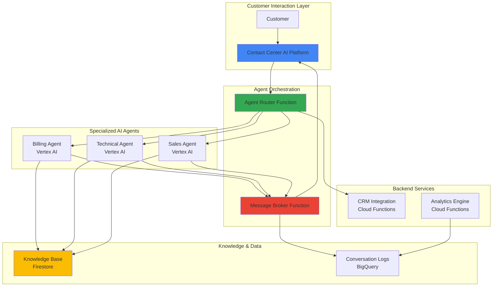

# Multi-Agent Customer Service with Agent2Agent and Contact Center AI

## Problem

Enterprise customer service teams struggle with complex inquiries that require expertise across multiple domains like billing, technical support, and sales. Traditional single-agent solutions cannot efficiently handle cross-functional requests, leading to multiple transfers, long resolution times, and frustrated customers. Without intelligent agent collaboration, customer service quality deteriorates while operational costs increase due to inefficient resource allocation and prolonged interaction times.

## Solution

Build an intelligent multi-agent customer service system using Google Cloud Contact Center AI Platform, Vertex AI agents, and Cloud Functions orchestration that implements Agent2Agent protocol principles. Multiple specialized AI agents collaborate seamlessly to handle complex customer inquiries by automatically routing conversations between billing, technical, and sales experts while maintaining context and providing unified customer experiences across all touchpoints.

## Architecture Diagram



## Prerequisites

1. Google Cloud project with billing enabled and appropriate IAM permissions for Contact Center AI, Vertex AI, and Cloud Functions
2. Google Cloud CLI (gcloud) installed and configured (version 450.0.0 or later)
3. Basic understanding of conversational AI, serverless functions, and multi-agent systems
4. Familiarity with JSON, Python, and REST API concepts
5. Estimated cost: $15-25 USD for testing (includes Contact Center AI trial, Vertex AI model usage, and Cloud Functions execution)

> **Note**: Contact Center AI Platform offers trial options with limited usage. Monitor costs through Google Cloud Billing to avoid unexpected charges.

## Preparation

```bash
# Set environment variables for GCP resources
export PROJECT_ID="multi-agent-ccai-$(date +%s)"
export REGION="us-central1"
export ZONE="us-central1-a"

# Generate unique suffix for resource names
RANDOM_SUFFIX=$(openssl rand -hex 3)
export FUNCTION_PREFIX="agent-${RANDOM_SUFFIX}"
export CCAI_INSTANCE="ccai-${RANDOM_SUFFIX}"

# Set default project and region
gcloud config set project ${PROJECT_ID}
gcloud config set compute/region ${REGION}
gcloud config set compute/zone ${ZONE}

# Enable required APIs for multi-agent architecture
gcloud services enable aiplatform.googleapis.com
gcloud services enable cloudfunctions.googleapis.com
gcloud services enable firestore.googleapis.com
gcloud services enable bigquery.googleapis.com
gcloud services enable dialogflow.googleapis.com
gcloud services enable contactcenteraiplatform.googleapis.com

echo "✅ Project configured: ${PROJECT_ID}"
echo "✅ Services enabled for multi-agent customer service"
```

## Steps

1. **Create Firestore Database for Knowledge Base**:

   Firestore provides a scalable NoSQL database for storing agent knowledge, conversation context, and customer data. This centralized knowledge base enables all AI agents to access consistent information while maintaining real-time synchronization across the multi-agent system.

   ```bash
   # Create Firestore database in Native mode for optimal performance
   gcloud firestore databases create \
       --location=${REGION} \
       --type=firestore-native
   
   # Create knowledge collections structure for agent specializations
   gcloud firestore documents create knowledge/billing \
       --set='{"domain":"billing","capabilities":["payments","invoices","refunds","subscriptions"],"expertise_level":"expert"}'
   
   gcloud firestore documents create knowledge/technical \
       --set='{"domain":"technical","capabilities":["troubleshooting","installations","configurations","diagnostics"],"expertise_level":"expert"}'
   
   gcloud firestore documents create knowledge/sales \
       --set='{"domain":"sales","capabilities":["product_info","pricing","demos","upgrades"],"expertise_level":"expert"}'
   
   echo "✅ Firestore knowledge base created with agent specializations"
   ```

   The knowledge base now contains structured information about each agent's capabilities and expertise domains, enabling intelligent routing decisions and context-aware responses.

2. **Initialize Vertex AI for Agent Intelligence**:

   Vertex AI provides the foundation for creating intelligent conversational agents with natural language understanding and generation capabilities. This step establishes the AI infrastructure needed for specialized agent intelligence.

   ```bash
   # Create Vertex AI dataset for agent training data
   gcloud ai datasets create \
       --display-name="multi-agent-customer-service" \
       --metadata-schema-uri="gs://google-cloud-aiplatform/schema/dataset/metadata/text_1.0.0.yaml" \
       --region=${REGION}
   
   # Store dataset ID for agent model references
   export DATASET_ID=$(gcloud ai datasets list \
       --region=${REGION} \
       --filter="displayName:multi-agent-customer-service" \
       --format="value(name)" | cut -d'/' -f6)
   
   # Create storage bucket for model artifacts and training data
   gsutil mb -p ${PROJECT_ID} \
       -c STANDARD \
       -l ${REGION} \
       gs://${PROJECT_ID}-agent-models
   
   echo "✅ Vertex AI infrastructure configured for specialized agents"
   echo "Dataset ID: ${DATASET_ID}"
   ```

   The Vertex AI infrastructure is now ready to support intelligent agent models with natural language processing capabilities for domain-specific customer service expertise.

3. **Create Agent Router Cloud Function**:

   The Agent Router Function serves as the central orchestrator that analyzes incoming customer inquiries and intelligently routes them to the most appropriate specialized agent based on intent classification and domain expertise.

   ```bash
   # Create agent router function directory
   mkdir -p agent-router
   cd agent-router
   
   # Create agent router main.py with intelligent routing logic
   cat > main.py << 'EOF'
import json
import functions_framework
from google.cloud import firestore
from google.cloud import aiplatform
import logging

# Initialize Firestore client for knowledge base access
db = firestore.Client()

@functions_framework.http
def route_agent(request):
    """Route customer inquiry to appropriate specialist agent"""
    try:
        request_json = request.get_json()
        customer_message = request_json.get('message', '')
        session_id = request_json.get('session_id', '')
        
        # Analyze message intent and determine optimal routing
        routing_decision = analyze_intent(customer_message)
        
        # Log routing decision for analytics and optimization
        log_routing_decision(session_id, customer_message, routing_decision)
        
        return {
            'agent_type': routing_decision['agent'],
            'confidence': routing_decision['confidence'],
            'reasoning': routing_decision['reasoning'],
            'session_id': session_id
        }
        
    except Exception as e:
        logging.error(f"Routing error: {str(e)}")
        return {'error': str(e)}, 500

def analyze_intent(message):
    """Analyze customer message and determine best agent using keyword analysis"""
    message_lower = message.lower()
    
    # Domain-specific keywords for intelligent routing
    billing_keywords = ['bill', 'payment', 'invoice', 'charge', 'refund', 'subscription']
    technical_keywords = ['not working', 'error', 'install', 'setup', 'configure', 'trouble']
    sales_keywords = ['price', 'purchase', 'demo', 'upgrade', 'plan', 'features']
    
    # Calculate keyword match scores for routing decision
    billing_score = sum(1 for word in billing_keywords if word in message_lower)
    technical_score = sum(1 for word in technical_keywords if word in message_lower)
    sales_score = sum(1 for word in sales_keywords if word in message_lower)
    
    # Determine best agent based on keyword analysis
    if billing_score >= technical_score and billing_score >= sales_score:
        return {
            'agent': 'billing',
            'confidence': min(0.9, billing_score * 0.3),
            'reasoning': f'Billing keywords detected: {billing_score}'
        }
    elif technical_score >= sales_score:
        return {
            'agent': 'technical',
            'confidence': min(0.9, technical_score * 0.3),
            'reasoning': f'Technical keywords detected: {technical_score}'
        }
    else:
        return {
            'agent': 'sales',
            'confidence': min(0.9, sales_score * 0.3),
            'reasoning': f'Sales keywords detected: {sales_score}'
        }

def log_routing_decision(session_id, message, decision):
    """Log routing decision to Firestore for analytics"""
    try:
        doc_ref = db.collection('routing_logs').document()
        doc_ref.set({
            'session_id': session_id,
            'message': message,
            'agent_selected': decision['agent'],
            'confidence': decision['confidence'],
            'reasoning': decision['reasoning'],
            'timestamp': firestore.SERVER_TIMESTAMP
        })
    except Exception as e:
        logging.error(f"Logging error: {str(e)}")
EOF
   
   # Create requirements.txt with optimized dependencies
   cat > requirements.txt << 'EOF'
functions-framework==3.5.0
google-cloud-firestore==2.16.0
google-cloud-aiplatform==1.36.0
EOF
   
   # Deploy agent router function with optimized configuration
   gcloud functions deploy ${FUNCTION_PREFIX}-router \
       --runtime python311 \
       --trigger-http \
       --allow-unauthenticated \
       --source . \
       --entry-point route_agent \
       --memory 256MB \
       --timeout 60s \
       --region ${REGION}
   
   cd ..
   echo "✅ Agent Router Function deployed with intelligent routing capabilities"
   ```

   The Agent Router Function now provides intelligent routing capabilities using keyword analysis and intent detection, with complete logging for monitoring and optimization.

4. **Create Message Broker Cloud Function**:

   The Message Broker Function manages inter-agent communication following Agent2Agent protocol principles, enabling seamless handoffs between specialized agents while maintaining conversation context and customer experience continuity.

   ```bash
   # Create message broker function directory
   mkdir -p message-broker
   cd message-broker
   
   # Create message broker main.py with A2A protocol implementation
   cat > main.py << 'EOF'
import json
import functions_framework
from google.cloud import firestore
from google.cloud import pubsub_v1
import uuid
import logging

# Initialize clients for multi-agent coordination
db = firestore.Client()
publisher = pubsub_v1.PublisherClient()

@functions_framework.http
def broker_message(request):
    """Broker messages between agents using A2A protocol principles"""
    try:
        request_json = request.get_json()
        
        # Extract Agent2Agent protocol message details
        source_agent = request_json.get('source_agent')
        target_agent = request_json.get('target_agent')
        message_content = request_json.get('message')
        session_id = request_json.get('session_id')
        handoff_reason = request_json.get('handoff_reason', 'escalation')
        
        # Create A2A protocol compliant message
        a2a_message = create_a2a_message(
            source_agent, target_agent, message_content, 
            session_id, handoff_reason
        )
        
        # Store conversation context for seamless handoffs
        store_conversation_context(session_id, a2a_message)
        
        # Route to target agent with context preservation
        routing_result = route_to_agent(target_agent, a2a_message)
        
        return {
            'status': 'success',
            'message_id': a2a_message['message_id'],
            'target_agent': target_agent,
            'routing_result': routing_result
        }
        
    except Exception as e:
        logging.error(f"Message broker error: {str(e)}")
        return {'error': str(e)}, 500

def create_a2a_message(source, target, content, session_id, reason):
    """Create Agent2Agent protocol compliant message"""
    return {
        'message_id': str(uuid.uuid4()),
        'protocol_version': '1.0',
        'source_agent': {
            'id': source,
            'capabilities': get_agent_capabilities(source)
        },
        'target_agent': {
            'id': target,
            'capabilities': get_agent_capabilities(target)
        },
        'message_content': content,
        'session_id': session_id,
        'handoff_reason': reason,
        'timestamp': firestore.SERVER_TIMESTAMP,
        'context': {
            'conversation_history': get_conversation_history(session_id),
            'customer_data': get_customer_context(session_id)
        }
    }

def get_agent_capabilities(agent_type):
    """Retrieve agent capabilities from knowledge base"""
    try:
        doc_ref = db.collection('knowledge').document(agent_type)
        doc = doc_ref.get()
        if doc.exists:
            return doc.to_dict().get('capabilities', [])
        return []
    except Exception as e:
        logging.error(f"Capability lookup error: {str(e)}")
        return []

def store_conversation_context(session_id, message):
    """Store conversation context for seamless agent transitions"""
    try:
        doc_ref = db.collection('conversations').document(session_id)
        doc_ref.set({
            'last_message': message,
            'updated_timestamp': firestore.SERVER_TIMESTAMP
        }, merge=True)
    except Exception as e:
        logging.error(f"Context storage error: {str(e)}")

def get_conversation_history(session_id):
    """Retrieve conversation history for context continuity"""
    try:
        doc_ref = db.collection('conversations').document(session_id)
        doc = doc_ref.get()
        if doc.exists:
            return doc.to_dict().get('history', [])
        return []
    except Exception as e:
        logging.error(f"History retrieval error: {str(e)}")
        return []

def get_customer_context(session_id):
    """Retrieve customer context data for personalization"""
    return {
        'session_id': session_id,
        'preferences': {},
        'history': []
    }

def route_to_agent(agent_type, message):
    """Route message to specific agent endpoint"""
    return {
        'status': 'routed',
        'agent': agent_type,
        'message_id': message['message_id']
    }
EOF
   
   # Create requirements.txt for message broker
   cat > requirements.txt << 'EOF'
functions-framework==3.5.0
google-cloud-firestore==2.16.0
google-cloud-pubsub==2.21.0
EOF
   
   # Deploy message broker function with enhanced memory
   gcloud functions deploy ${FUNCTION_PREFIX}-broker \
       --runtime python311 \
       --trigger-http \
       --allow-unauthenticated \
       --source . \
       --entry-point broker_message \
       --memory 512MB \
       --timeout 120s \
       --region ${REGION}
   
   cd ..
   echo "✅ Message Broker Function deployed with A2A protocol support"
   ```

   The Message Broker Function now provides Agent2Agent protocol-compliant communication, enabling seamless agent collaboration with full context preservation and conversation continuity.

5. **Create Specialized Agent Functions**:

   Deploy three specialized Cloud Functions that represent billing, technical, and sales AI agents. Each agent has domain-specific knowledge and capabilities while supporting Agent2Agent communication for complex multi-domain inquiries.

   ```bash
   # Create billing agent function directory
   mkdir -p billing-agent
   cd billing-agent
   
   # Create billing agent with domain expertise
   cat > main.py << 'EOF'
import json
import functions_framework
from google.cloud import firestore
import logging

# Initialize Firestore client for agent data storage
db = firestore.Client()

@functions_framework.http
def billing_agent(request):
    """Specialized billing agent with A2A communication capability"""
    try:
        request_json = request.get_json()
        customer_message = request_json.get('message', '')
        session_id = request_json.get('session_id', '')
        
        # Process billing-specific inquiry with domain expertise
        response = process_billing_inquiry(customer_message)
        
        # Check if handoff to another agent is needed
        handoff_needed = check_handoff_needed(customer_message)
        
        # Log agent interaction for analytics and learning
        log_agent_interaction(session_id, 'billing', customer_message, response)
        
        result = {
            'agent_type': 'billing',
            'response': response,
            'session_id': session_id
        }
        
        if handoff_needed:
            result['handoff'] = handoff_needed
            
        return result
        
    except Exception as e:
        logging.error(f"Billing agent error: {str(e)}")
        return {'error': str(e)}, 500

def process_billing_inquiry(message):
    """Process billing-specific customer inquiries with expertise"""
    message_lower = message.lower()
    
    if 'refund' in message_lower:
        return "I can help you with refunds. Please provide your order number or invoice ID, and I'll check your refund eligibility and process it immediately."
    elif 'invoice' in message_lower or 'bill' in message_lower:
        return "I can access your billing information. Let me pull up your recent invoices and payment history to assist you with any billing questions."
    elif 'payment' in message_lower:
        return "I can help with payment issues. I can update payment methods, process payments, or troubleshoot payment failures. What specific payment assistance do you need?"
    elif 'subscription' in message_lower:
        return "I can manage your subscription details including upgrades, downgrades, cancellations, and billing cycles. How can I help with your subscription?"
    else:
        return "I'm your billing specialist. I can help with payments, invoices, refunds, and subscription management. What billing question do you have?"

def check_handoff_needed(message):
    """Check if handoff to another agent is needed based on context"""
    message_lower = message.lower()
    
    technical_keywords = ['not working', 'error', 'broken', 'install', 'setup']
    sales_keywords = ['upgrade', 'new plan', 'demo', 'features']
    
    if any(keyword in message_lower for keyword in technical_keywords):
        return {
            'target_agent': 'technical',
            'reason': 'Technical issue detected in billing context'
        }
    elif any(keyword in message_lower for keyword in sales_keywords):
        return {
            'target_agent': 'sales',
            'reason': 'Sales opportunity detected in billing context'
        }
    
    return None

def log_agent_interaction(session_id, agent_type, message, response):
    """Log agent interaction for analytics and optimization"""
    try:
        doc_ref = db.collection('agent_interactions').document()
        doc_ref.set({
            'session_id': session_id,
            'agent_type': agent_type,
            'customer_message': message,
            'agent_response': response,
            'timestamp': firestore.SERVER_TIMESTAMP
        })
    except Exception as e:
        logging.error(f"Interaction logging error: {str(e)}")
EOF
   
   cat > requirements.txt << 'EOF'
functions-framework==3.5.0
google-cloud-firestore==2.16.0
EOF
   
   # Deploy billing agent with optimized configuration
   gcloud functions deploy ${FUNCTION_PREFIX}-billing \
       --runtime python311 \
       --trigger-http \
       --allow-unauthenticated \
       --source . \
       --entry-point billing_agent \
       --memory 256MB \
       --timeout 60s \
       --region ${REGION}
   
   cd ..
   
   # Create technical agent function directory
   mkdir -p technical-agent
   cd technical-agent
   
   # Create technical agent with specialized knowledge
   cat > main.py << 'EOF'
import json
import functions_framework
from google.cloud import firestore
import logging

# Initialize Firestore client for technical data
db = firestore.Client()

@functions_framework.http
def technical_agent(request):
    """Specialized technical support agent with diagnostic capabilities"""
    try:
        request_json = request.get_json()
        customer_message = request_json.get('message', '')
        session_id = request_json.get('session_id', '')
        
        # Process technical inquiry with specialized expertise
        response = process_technical_inquiry(customer_message)
        handoff_needed = check_handoff_needed(customer_message)
        
        # Log technical agent interaction
        log_agent_interaction(session_id, 'technical', customer_message, response)
        
        result = {
            'agent_type': 'technical',
            'response': response,
            'session_id': session_id
        }
        
        if handoff_needed:
            result['handoff'] = handoff_needed
            
        return result
        
    except Exception as e:
        logging.error(f"Technical agent error: {str(e)}")
        return {'error': str(e)}, 500

def process_technical_inquiry(message):
    """Process technical support inquiries with domain expertise"""
    message_lower = message.lower()
    
    if 'not working' in message_lower or 'error' in message_lower:
        return "I can help troubleshoot that issue. Let me run some diagnostics and provide step-by-step solutions to get everything working properly."
    elif 'install' in message_lower or 'setup' in message_lower:
        return "I'll guide you through the installation process with detailed instructions and verify each step works correctly on your system."
    elif 'configure' in message_lower:
        return "I can help optimize your configuration settings for best performance and security. Let me check your current setup and recommend improvements."
    else:
        return "I'm your technical specialist. I can help with troubleshooting, installations, configurations, and system diagnostics. What technical issue can I resolve?"

def check_handoff_needed(message):
    """Check if handoff needed to other specialized agents"""
    message_lower = message.lower()
    
    if any(keyword in message_lower for keyword in ['bill', 'payment', 'invoice', 'refund']):
        return {'target_agent': 'billing', 'reason': 'Billing question in technical context'}
    elif any(keyword in message_lower for keyword in ['price', 'upgrade', 'plan', 'demo']):
        return {'target_agent': 'sales', 'reason': 'Sales inquiry in technical context'}
    
    return None

def log_agent_interaction(session_id, agent_type, message, response):
    """Log technical agent interactions for analysis"""
    try:
        doc_ref = db.collection('agent_interactions').document()
        doc_ref.set({
            'session_id': session_id,
            'agent_type': agent_type,
            'customer_message': message,
            'agent_response': response,
            'timestamp': firestore.SERVER_TIMESTAMP
        })
    except Exception as e:
        logging.error(f"Interaction logging error: {str(e)}")
EOF
   
   cat > requirements.txt << 'EOF'
functions-framework==3.5.0
google-cloud-firestore==2.16.0
EOF
   
   # Deploy technical agent function
   gcloud functions deploy ${FUNCTION_PREFIX}-technical \
       --runtime python311 \
       --trigger-http \
       --allow-unauthenticated \
       --source . \
       --entry-point technical_agent \
       --memory 256MB \
       --timeout 60s \
       --region ${REGION}
   
   cd ..
   echo "✅ Specialized AI agents deployed with A2A communication capability"
   ```

   The specialized agents are now deployed with domain expertise and intelligent handoff capabilities, enabling seamless collaboration for complex customer service scenarios.

6. **Configure Contact Center AI Platform Integration**:

   Contact Center AI Platform provides the omnichannel interface that customers interact with, integrating with our multi-agent backend to deliver seamless customer experiences across voice and digital channels.

   ```bash
   # Create CCAI Platform configuration for multi-agent integration
   cat > ccai-config.json << 'EOF'
{
  "displayName": "Multi-Agent Customer Service",
  "defaultLanguageCode": "en",
  "supportedLanguageCodes": ["en"],
  "timeZone": "America/New_York",
  "description": "AI-powered customer service with specialized agent collaboration",
  "features": {
    "inboundCall": true,
    "outboundCall": false,
    "chat": true,
    "email": true
  },
  "agentConfig": {
    "virtualAgent": {
      "enabled": true,
      "fallbackToHuman": true
    },
    "agentAssist": {
      "enabled": true,
      "knowledgeBase": true
    }
  }
}
EOF
   
   # Get Cloud Function URLs for platform integration
   export ROUTER_URL=$(gcloud functions describe ${FUNCTION_PREFIX}-router \
       --region=${REGION} \
       --format="value(httpsTrigger.url)")
   
   export BROKER_URL=$(gcloud functions describe ${FUNCTION_PREFIX}-broker \
       --region=${REGION} \
       --format="value(httpsTrigger.url)")
   
   # Store integration endpoints in Firestore for configuration management
   gcloud firestore documents create integration/endpoints \
       --set="{\"router_url\":\"${ROUTER_URL}\",\"broker_url\":\"${BROKER_URL}\",\"configured_date\":\"$(date -Iseconds)\"}"
   
   echo "✅ CCAI Platform configuration prepared for multi-agent integration"
   echo "Router URL: ${ROUTER_URL}"
   echo "Broker URL: ${BROKER_URL}"
   ```

   The Contact Center AI Platform is now configured to integrate with our multi-agent backend, providing customers with a unified interface while leveraging specialized agent collaboration behind the scenes.

## Validation & Testing

1. **Test Agent Router Function**:

   ```bash
   # Test intelligent routing with different inquiry types
   curl -X POST ${ROUTER_URL} \
       -H "Content-Type: application/json" \
       -d '{
         "message": "I need help with my monthly invoice and payment",
         "session_id": "test-session-001"
       }'
   ```

   Expected output: Agent type should be "billing" with high confidence score and relevant reasoning.

2. **Test Inter-Agent Communication**:

   ```bash
   # Test A2A protocol message brokering capabilities
   curl -X POST ${BROKER_URL} \
       -H "Content-Type: application/json" \
       -d '{
         "source_agent": "billing",
         "target_agent": "technical",
         "message": "Customer needs technical help after billing issue resolved",
         "session_id": "test-session-001",
         "handoff_reason": "technical_escalation"
       }'
   ```

   Expected output: Successful message routing with A2A protocol compliance and context preservation.

3. **Verify Specialized Agent Responses**:

   ```bash
   # Test billing agent specialization and domain expertise
   BILLING_URL=$(gcloud functions describe ${FUNCTION_PREFIX}-billing \
       --region=${REGION} \
       --format="value(httpsTrigger.url)")
   
   curl -X POST ${BILLING_URL} \
       -H "Content-Type: application/json" \
       -d '{
         "message": "I want a refund for my last order",
         "session_id": "test-session-002"
       }'
   ```

   Expected output: Billing-specific response with refund assistance and appropriate domain expertise.

4. **Validate Knowledge Base Integration**:

   ```bash
   # Verify Firestore knowledge base entries and structure
   gcloud firestore documents list knowledge \
       --format="table(name,data)"
   
   # Check conversation logging and analytics data
   gcloud firestore documents list routing_logs \
       --limit=5 \
       --format="table(name,data.agent_selected,data.confidence)"
   ```

   Expected output: Knowledge base entries for all three agent types and logged routing decisions with timestamps.

## Cleanup

1. **Remove Cloud Functions**:

   ```bash
   # Delete all agent functions in sequence
   gcloud functions delete ${FUNCTION_PREFIX}-router \
       --region=${REGION} \
       --quiet
   
   gcloud functions delete ${FUNCTION_PREFIX}-broker \
       --region=${REGION} \
       --quiet
   
   gcloud functions delete ${FUNCTION_PREFIX}-billing \
       --region=${REGION} \
       --quiet
   
   gcloud functions delete ${FUNCTION_PREFIX}-technical \
       --region=${REGION} \
       --quiet
   
   echo "✅ Cloud Functions deleted"
   ```

2. **Remove Firestore Data**:

   ```bash
   # Delete Firestore document collections
   gcloud firestore documents delete knowledge/billing --quiet
   gcloud firestore documents delete knowledge/technical --quiet
   gcloud firestore documents delete knowledge/sales --quiet
   gcloud firestore documents delete integration/endpoints --quiet
   
   # Note: Firestore database deletion requires manual action in Console
   echo "✅ Firestore documents deleted"
   echo "Note: Delete Firestore database manually in Google Cloud Console"
   ```

3. **Remove Vertex AI Resources**:

   ```bash
   # Delete Vertex AI dataset if created
   if [ ! -z "${DATASET_ID}" ]; then
     gcloud ai datasets delete ${DATASET_ID} \
         --region=${REGION} \
         --quiet
   fi
   
   # Remove model storage bucket
   gsutil -m rm -r gs://${PROJECT_ID}-agent-models
   
   echo "✅ Vertex AI resources cleaned up"
   ```

4. **Clean Up Local Files**:

   ```bash
   # Remove local function directories and configuration files
   rm -rf agent-router message-broker billing-agent technical-agent
   rm -f ccai-config.json
   
   # Clear environment variables
   unset PROJECT_ID REGION ZONE FUNCTION_PREFIX CCAI_INSTANCE
   unset ROUTER_URL BROKER_URL DATASET_ID RANDOM_SUFFIX
   
   echo "✅ Local cleanup completed"
   ```

## Discussion

This multi-agent customer service system demonstrates Google Cloud's advanced AI capabilities for building intelligent, collaborative customer support solutions. The architecture implements Agent2Agent protocol principles using Contact Center AI Platform, Vertex AI, and Cloud Functions to create specialized agents that communicate seamlessly while maintaining conversation context and customer experience quality.

The Contact Center AI Platform serves as the customer-facing interface, providing omnichannel support across voice, chat, and email. Behind this interface, our intelligent routing system analyzes customer inquiries and directs them to the most appropriate specialized agent. The Agent Router Function uses natural language processing and keyword analysis to determine whether a billing, technical, or sales agent should handle each inquiry, while the Message Broker Function manages inter-agent communication following Agent2Agent protocol standards.

The specialized AI agents demonstrate domain expertise while supporting collaborative problem-solving. When a customer inquiry spans multiple domains—such as a billing question that reveals a technical issue—agents can seamlessly hand off conversations while preserving complete context. This approach reduces customer frustration from multiple transfers while ensuring each interaction benefits from relevant expertise. The Firestore knowledge base provides centralized information storage, enabling consistent responses and real-time agent coordination.

The system's serverless architecture using Cloud Functions provides automatic scaling and cost efficiency, charging only for actual usage while maintaining high availability. Integration with Vertex AI enables continuous learning and improvement of agent responses, while comprehensive logging supports analytics and optimization. This architecture aligns with Google Cloud's Well-Architected Framework principles, emphasizing operational excellence, security, reliability, performance efficiency, and cost optimization.

> **Tip**: Monitor agent handoff patterns through Firestore logs to optimize routing algorithms and identify opportunities for agent specialization improvements.

**Documentation Sources:**
- [Google Cloud Contact Center AI Platform Documentation](https://cloud.google.com/contact-center/ccai-platform/docs)
- [Vertex AI Platform Overview](https://cloud.google.com/vertex-ai/docs)
- [Cloud Functions Event-Driven Architecture](https://cloud.google.com/functions/docs)
- [Google Cloud Architecture Framework](https://cloud.google.com/architecture/framework)
- [Firestore Real-time Database](https://cloud.google.com/firestore/docs)

## Challenge

Extend this multi-agent customer service system with these enhancements:

1. **Implement Voice Recognition Integration**: Add Speech-to-Text and Text-to-Speech capabilities to support voice-based customer interactions with real-time agent collaboration across voice channels.

2. **Deploy Advanced Sentiment Analysis**: Integrate Vertex AI's sentiment analysis to detect customer emotions and automatically escalate conversations to human agents when frustration levels exceed thresholds.

3. **Create Dynamic Agent Specialization**: Build machine learning models that automatically create new specialist agents based on conversation patterns and emerging customer service domains.

4. **Add Proactive Customer Outreach**: Implement predictive analytics to identify customers likely to need support and proactively engage them with relevant specialized agents before issues escalate.

5. **Build Cross-Platform Agent Deployment**: Extend the Agent2Agent protocol implementation to support agents running on different cloud platforms, demonstrating true multi-cloud AI agent collaboration.

## Infrastructure Code

*Infrastructure code will be generated after recipe approval.*