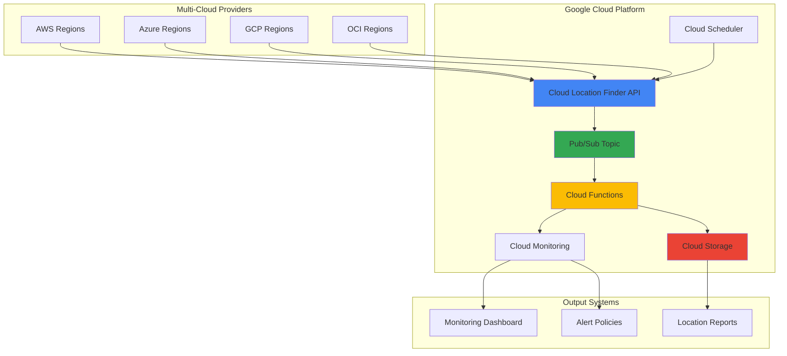

# Multi-Cloud Resource Discovery with Cloud Location Finder and Pub/Sub

## Problem

Modern enterprises operate across multiple cloud providers (AWS, Azure, GCP, OCI) but lack centralized visibility into optimal deployment locations. Teams manually research region capabilities, latency characteristics, and compliance requirements across providers, leading to suboptimal resource placement, increased costs, and delayed deployments. Without automated location intelligence, organizations cannot dynamically adapt to changing cloud provider landscapes or optimize workloads based on real-time regional attributes.

## Solution

Build an intelligent multi-cloud resource discovery system using Google Cloud's Location Finder service to aggregate unified location data across all major cloud providers. The solution processes location intelligence through Pub/Sub message streams, triggers Cloud Functions for automated deployment recommendations, and provides real-time monitoring of multi-cloud resource optimization opportunities. This approach enables data-driven location decisions with 24-hour data freshness and eliminates manual location management overhead.

## Architecture Diagram



## Prerequisites

1. Google Cloud Platform account with billing enabled and project owner permissions
2. Google Cloud CLI (gcloud) installed and configured (version 400.0.0 or later)
3. Basic understanding of serverless computing, message queuing, and multi-cloud architectures
4. Familiarity with API integration and JSON data processing
5. Estimated cost: $15-25 USD for running this recipe (includes Cloud Functions invocations, Pub/Sub messages, and Cloud Storage)

> **Note**: Cloud Location Finder provides unified data for Google Cloud, AWS, Azure, and OCI regions with 24-hour freshness guarantees.

## Preparation

```bash
# Set environment variables for GCP resources
export PROJECT_ID="multi-cloud-discovery-$(date +%s)"
export REGION="us-central1"
export ZONE="us-central1-a"

# Generate unique suffix for resource names
RANDOM_SUFFIX=$(openssl rand -hex 3)

# Set resource names with unique identifiers
export TOPIC_NAME="location-discovery-${RANDOM_SUFFIX}"
export FUNCTION_NAME="process-locations-${RANDOM_SUFFIX}"
export BUCKET_NAME="location-reports-${RANDOM_SUFFIX}"
export SCHEDULER_JOB="location-sync-${RANDOM_SUFFIX}"

# Create and set the project
gcloud projects create ${PROJECT_ID}
gcloud config set project ${PROJECT_ID}
gcloud config set compute/region ${REGION}
gcloud config set compute/zone ${ZONE}

# Enable billing for the project (manual step required)
echo "Please enable billing for project ${PROJECT_ID} in the Google Cloud Console"
echo "Press any key to continue after enabling billing..."
read -n 1

# Enable required APIs for multi-cloud location discovery
gcloud services enable cloudfuctions.googleapis.com
gcloud services enable pubsub.googleapis.com
gcloud services enable cloudscheduler.googleapis.com
gcloud services enable storage.googleapis.com
gcloud services enable monitoring.googleapis.com

echo "✅ Project configured: ${PROJECT_ID}"
echo "✅ Required APIs enabled for multi-cloud resource discovery"
```

## Steps

1. **Create Pub/Sub Topic for Location Data Processing**:

   Google Cloud Pub/Sub provides the messaging backbone for processing location data from Cloud Location Finder. The topic-subscription model enables asynchronous processing of location intelligence, allowing multiple consumers to react to location updates independently. This decoupled architecture ensures scalable processing of multi-cloud location data streams.

   ```bash
   # Create Pub/Sub topic for location data
   gcloud pubsub topics create ${TOPIC_NAME}
   
   # Create subscription for Cloud Function processing
   gcloud pubsub subscriptions create ${TOPIC_NAME}-sub \
       --topic=${TOPIC_NAME} \
       --ack-deadline=300 \
       --message-retention-duration=7d
   
   echo "✅ Pub/Sub topic created: ${TOPIC_NAME}"
   echo "✅ Subscription configured with 5-minute ack deadline"
   ```

   The Pub/Sub topic is now ready to receive location data from Cloud Location Finder API calls. The subscription configuration includes extended acknowledgment deadlines to accommodate complex location processing logic and week-long message retention for replay scenarios.

2. **Create Cloud Storage Bucket for Location Reports**:

   Cloud Storage provides durable, scalable storage for location intelligence reports and historical data. The bucket serves as both a data lake for location analytics and a repository for deployment recommendations. Regional storage configuration optimizes access patterns for location processing workflows.

   ```bash
   # Create Cloud Storage bucket for location reports
   gsutil mb -p ${PROJECT_ID} \
       -c STANDARD \
       -l ${REGION} \
       gs://${BUCKET_NAME}
   
   # Enable versioning for report history tracking
   gsutil versioning set on gs://${BUCKET_NAME}
   
   # Create folder structure for organized storage
   echo "" | gsutil cp - gs://${BUCKET_NAME}/reports/.gitkeep
   echo "" | gsutil cp - gs://${BUCKET_NAME}/raw-data/.gitkeep
   echo "" | gsutil cp - gs://${BUCKET_NAME}/recommendations/.gitkeep
   
   echo "✅ Cloud Storage bucket created: ${BUCKET_NAME}"
   echo "✅ Folder structure initialized for location data organization"
   ```

   The storage bucket now provides organized repositories for different types of location data, with versioning enabled to track changes in cloud provider location offerings over time.

3. **Deploy Cloud Function for Location Data Processing**:

   Cloud Functions provides serverless processing of location data from Pub/Sub messages. The function integrates with Cloud Location Finder API to retrieve multi-cloud location intelligence and generates deployment recommendations. This event-driven approach automatically scales based on location data volume and eliminates infrastructure management overhead.

   ```bash
   # Create function source directory
   mkdir -p /tmp/location-function
   cd /tmp/location-function
   
   # Create requirements.txt for Python dependencies
   cat > requirements.txt << 'EOF'
google-cloud-pubsub==2.23.0
google-cloud-storage==2.10.0
google-cloud-monitoring==2.16.0
requests==2.31.0
functions-framework==3.5.0
google-auth==2.25.0
EOF
   
   # Create main function code
   cat > main.py << 'EOF'
import json
import logging
import os
from datetime import datetime
from typing import Dict, List, Any
import requests
from google.cloud import storage
from google.cloud import monitoring_v3
import functions_framework
from google.auth import default
from google.auth.transport.requests import Request

# Configure logging
logging.basicConfig(level=logging.INFO)
logger = logging.getLogger(__name__)

# Environment variables
BUCKET_NAME = os.environ.get('BUCKET_NAME')
PROJECT_ID = os.environ.get('PROJECT_ID')

def get_location_data() -> List[Dict[str, Any]]:
    """Fetch location data from Cloud Location Finder API"""
    try:
        # Get authenticated credentials
        credentials, _ = default()
        credentials.refresh(Request())
        
        # Cloud Location Finder API endpoint
        url = "https://cloudlocationfinder.googleapis.com/v1/locations"
        headers = {
            "Authorization": f"Bearer {credentials.token}",
            "Content-Type": "application/json"
        }
        
        # Make API request for multi-cloud location data
        response = requests.get(url, headers=headers, timeout=30)
        response.raise_for_status()
        
        data = response.json()
        locations = data.get('locations', [])
        
        logger.info(f"Retrieved {len(locations)} locations from Cloud Location Finder")
        return locations
    
    except Exception as e:
        logger.error(f"Error fetching location data: {str(e)}")
        return []

def analyze_locations(locations: List[Dict[str, Any]]) -> Dict[str, Any]:
    """Analyze location data for deployment recommendations"""
    analysis = {
        'total_locations': len(locations),
        'providers': {},
        'regions_by_provider': {},
        'low_carbon_regions': [],
        'recommendations': []
    }
    
    for location in locations:
        provider = location.get('cloudProvider', 'unknown')
        region = location.get('regionCode', 'unknown')
        carbon_footprint = location.get('carbonFootprint', {})
        
        # Count providers and regions
        if provider not in analysis['providers']:
            analysis['providers'][provider] = 0
            analysis['regions_by_provider'][provider] = []
        
        analysis['providers'][provider] += 1
        if region not in analysis['regions_by_provider'][provider]:
            analysis['regions_by_provider'][provider].append(region)
        
        # Identify low-carbon regions (Google Cloud data only)
        if provider == 'GOOGLE_CLOUD' and carbon_footprint.get('carbonIntensity', 1000) < 200:
            analysis['low_carbon_regions'].append({
                'provider': provider,
                'region': region,
                'carbonIntensity': carbon_footprint.get('carbonIntensity')
            })
    
    # Generate deployment recommendations
    analysis['recommendations'] = generate_recommendations(analysis)
    
    return analysis

def generate_recommendations(analysis: Dict[str, Any]) -> List[Dict[str, Any]]:
    """Generate deployment recommendations based on location analysis"""
    recommendations = []
    
    # Recommend low-carbon regions
    if analysis['low_carbon_regions']:
        recommendations.append({
            'type': 'sustainability',
            'priority': 'high',
            'description': f"Deploy to {len(analysis['low_carbon_regions'])} low-carbon regions",
            'regions': analysis['low_carbon_regions'][:3]  # Top 3
        })
    
    # Recommend multi-provider strategy
    if len(analysis['providers']) >= 3:
        recommendations.append({
            'type': 'resilience',
            'priority': 'medium',
            'description': 'Consider multi-provider deployment for resilience',
            'providers': list(analysis['providers'].keys())
        })
    
    return recommendations

def save_to_storage(data: Dict[str, Any], filename: str) -> None:
    """Save analysis data to Cloud Storage"""
    try:
        client = storage.Client()
        bucket = client.bucket(BUCKET_NAME)
        blob = bucket.blob(f"reports/{filename}")
        
        blob.upload_from_string(
            json.dumps(data, indent=2),
            content_type='application/json'
        )
        
        logger.info(f"Saved report to gs://{BUCKET_NAME}/reports/{filename}")
    
    except Exception as e:
        logger.error(f"Error saving to storage: {str(e)}")

def create_custom_metric(analysis: Dict[str, Any]) -> None:
    """Create custom monitoring metrics"""
    try:
        client = monitoring_v3.MetricServiceClient()
        project_name = f"projects/{PROJECT_ID}"
        
        # Create time series data
        series = monitoring_v3.TimeSeries()
        series.resource.type = "global"
        series.metric.type = "custom.googleapis.com/multicloud/total_locations"
        
        # Add data point
        point = series.points.add()
        point.value.int64_value = analysis['total_locations']
        point.interval.end_time.seconds = int(datetime.now().timestamp())
        
        # Write time series
        client.create_time_series(
            name=project_name,
            time_series=[series]
        )
        
        logger.info("Custom metric created successfully")
    
    except Exception as e:
        logger.error(f"Error creating custom metric: {str(e)}")

@functions_framework.cloud_event
def process_location_data(cloud_event):
    """Main function to process location discovery messages"""
    try:
        logger.info("Processing location discovery request")
        
        # Fetch location data from Cloud Location Finder
        locations = get_location_data()
        
        if not locations:
            logger.warning("No location data received")
            return
        
        # Analyze location data for recommendations
        analysis = analyze_locations(locations)
        
        # Generate timestamped filename
        timestamp = datetime.now().strftime('%Y%m%d_%H%M%S')
        filename = f"location_analysis_{timestamp}.json"
        
        # Save analysis to Cloud Storage
        save_to_storage(analysis, filename)
        
        # Create monitoring metrics
        create_custom_metric(analysis)
        
        logger.info(f"Successfully processed {len(locations)} locations")
        logger.info(f"Generated {len(analysis['recommendations'])} recommendations")
        
        return {"status": "success", "locations_processed": len(locations)}
    
    except Exception as e:
        logger.error(f"Error in process_location_data: {str(e)}")
        raise
EOF
   
   # Deploy Cloud Function with environment variables
   gcloud functions deploy ${FUNCTION_NAME} \
       --runtime python311 \
       --trigger-topic ${TOPIC_NAME} \
       --source . \
       --entry-point process_location_data \
       --memory 512MB \
       --timeout 300s \
       --set-env-vars BUCKET_NAME=${BUCKET_NAME},PROJECT_ID=${PROJECT_ID} \
       --region ${REGION}
   
   echo "✅ Cloud Function deployed: ${FUNCTION_NAME}"
   echo "✅ Function configured with Pub/Sub trigger and environment variables"
   ```

   The Cloud Function is now deployed with comprehensive location processing capabilities, including API integration, data analysis, and storage operations. The function automatically scales based on Pub/Sub message volume and provides detailed logging for monitoring processing effectiveness.

4. **Create Cloud Scheduler Job for Automated Discovery**:

   Cloud Scheduler enables periodic triggering of location discovery workflows, ensuring fresh multi-cloud location intelligence. The scheduled job publishes messages to Pub/Sub at configurable intervals, maintaining current awareness of cloud provider location changes. This automation eliminates manual intervention while providing consistent location data updates.

   ```bash
   # Create Cloud Scheduler job for periodic location discovery
   gcloud scheduler jobs create pubsub ${SCHEDULER_JOB} \
       --schedule="0 */6 * * *" \
       --topic=${TOPIC_NAME} \
       --message-body='{"trigger":"scheduled_discovery","timestamp":"'$(date -u +%Y-%m-%dT%H:%M:%SZ)'"}' \
       --time-zone="UTC" \
       --description="Automated multi-cloud location discovery" \
       --location=${REGION}
   
   # Manually trigger the first execution
   gcloud scheduler jobs run ${SCHEDULER_JOB} \
       --location=${REGION}
   
   echo "✅ Cloud Scheduler job created: ${SCHEDULER_JOB}"
   echo "✅ Scheduled for every 6 hours with manual trigger executed"
   ```

   The scheduler job now automatically triggers location discovery every 6 hours, ensuring continuous monitoring of multi-cloud location changes and maintaining fresh deployment recommendations.

5. **Configure Cloud Monitoring Dashboard**:

   Cloud Monitoring provides comprehensive visibility into multi-cloud location discovery operations. Custom dashboards display location metrics, processing performance, and recommendation trends. This monitoring foundation enables proactive optimization of location discovery workflows and ensures reliable multi-cloud intelligence delivery.

   ```bash
   # Create custom dashboard configuration
   cat > dashboard-config.json << EOF
{
  "displayName": "Multi-Cloud Location Discovery Dashboard",
  "mosaicLayout": {
    "tiles": [
      {
        "width": 6,
        "height": 4,
        "widget": {
          "title": "Total Locations Discovered",
          "xyChart": {
            "dataSets": [
              {
                "timeSeriesQuery": {
                  "timeSeriesFilter": {
                    "filter": "metric.type=\"custom.googleapis.com/multicloud/total_locations\"",
                    "aggregation": {
                      "alignmentPeriod": "60s",
                      "perSeriesAligner": "ALIGN_MEAN"
                    }
                  }
                }
              }
            ]
          }
        }
      },
      {
        "width": 6,
        "height": 4,
        "xPos": 6,
        "widget": {
          "title": "Function Execution Count",
          "xyChart": {
            "dataSets": [
              {
                "timeSeriesQuery": {
                  "timeSeriesFilter": {
                    "filter": "resource.type=\"cloud_function\" AND metric.type=\"cloudfunctions.googleapis.com/function/executions\"",
                    "aggregation": {
                      "alignmentPeriod": "60s",
                      "perSeriesAligner": "ALIGN_RATE"
                    }
                  }
                }
              }
            ]
          }
        }
      }
    ]
  }
}
EOF
   
   # Create the monitoring dashboard
   gcloud monitoring dashboards create \
       --config-from-file=dashboard-config.json
   
   echo "✅ Cloud Monitoring dashboard created"
   echo "✅ Dashboard includes location metrics and function performance"
   ```

   The monitoring dashboard now provides real-time visibility into location discovery operations, enabling teams to track processing performance and identify optimization opportunities.

6. **Set Up Alert Policies for Discovery Monitoring**:

   Alert policies provide proactive notification of location discovery issues, ensuring reliable multi-cloud intelligence delivery. Configurable thresholds monitor function execution failures, message processing delays, and data freshness. This alerting foundation enables rapid response to location discovery disruptions.

   ```bash
   # Create alert policy for function failures
   cat > alert-policy.json << EOF
{
  "displayName": "Location Discovery Function Failures",
  "conditions": [
    {
      "displayName": "Function execution failures",
      "conditionThreshold": {
        "filter": "resource.type=\"cloud_function\" AND resource.labels.function_name=\"${FUNCTION_NAME}\" AND metric.type=\"cloudfunctions.googleapis.com/function/execution_count\"",
        "comparison": "COMPARISON_GREATER_THAN",
        "thresholdValue": {
          "doubleValue": 5
        },
        "duration": "300s",
        "aggregations": [
          {
            "alignmentPeriod": "60s",
            "perSeriesAligner": "ALIGN_RATE"
          }
        ]
      }
    }
  ],
  "alertStrategy": {
    "autoClose": "1800s"
  },
  "enabled": true
}
EOF
   
   # Create the alert policy
   gcloud alpha monitoring policies create \
       --policy-from-file=alert-policy.json
   
   echo "✅ Alert policy created for function failure monitoring"
   echo "✅ Alerts configured with 5-minute threshold and auto-close"
   ```

   Alert policies are now active, providing automated notification of location discovery issues and enabling rapid response to maintain continuous multi-cloud intelligence.

## Validation & Testing

1. **Verify Cloud Location Finder Integration**:

   ```bash
   # Check if the Cloud Function processed location data
   gcloud functions logs read ${FUNCTION_NAME} \
       --limit=20 \
       --region=${REGION} \
       --format="value(textPayload)"
   ```

   Expected output: Log entries showing successful location data retrieval and processing, including counts of locations discovered across multiple cloud providers.

2. **Test Pub/Sub Message Flow**:

   ```bash
   # Manually publish a test message to trigger processing
   gcloud pubsub topics publish ${TOPIC_NAME} \
       --message='{"trigger":"manual_test","timestamp":"'$(date -u +%Y-%m-%dT%H:%M:%SZ)'"}'
   
   # Verify message processing
   sleep 30
   gcloud functions logs read ${FUNCTION_NAME} \
       --limit=5 \
       --region=${REGION} \
       --format="value(textPayload)"
   ```

   Expected output: Function logs showing successful message processing and location analysis completion.

3. **Validate Storage Reports Generation**:

   ```bash
   # List generated location reports
   gsutil ls gs://${BUCKET_NAME}/reports/
   
   # View latest report content
   LATEST_REPORT=$(gsutil ls gs://${BUCKET_NAME}/reports/ | tail -1)
   gsutil cat ${LATEST_REPORT}
   ```

   Expected output: JSON reports containing location analysis, provider distribution, and deployment recommendations.

4. **Verify Monitoring Metrics**:

   ```bash
   # Check custom metrics creation
   gcloud monitoring metrics list \
       --filter="metric.type:custom.googleapis.com/multicloud" \
       --format="value(type)"
   
   # View dashboard status
   gcloud monitoring dashboards list \
       --format="table(displayName,name)"
   ```

   Expected output: Custom metrics for location discovery and active monitoring dashboard.

## Cleanup

1. **Remove Cloud Scheduler Job**:

   ```bash
   # Delete the scheduled job
   gcloud scheduler jobs delete ${SCHEDULER_JOB} \
       --location=${REGION} \
       --quiet
   
   echo "✅ Cloud Scheduler job removed"
   ```

2. **Delete Cloud Function and Storage**:

   ```bash
   # Delete Cloud Function
   gcloud functions delete ${FUNCTION_NAME} \
       --region=${REGION} \
       --quiet
   
   # Remove Cloud Storage bucket and contents
   gsutil -m rm -r gs://${BUCKET_NAME}
   
   echo "✅ Cloud Function and storage resources deleted"
   ```

3. **Remove Pub/Sub Resources**:

   ```bash
   # Delete Pub/Sub subscription and topic
   gcloud pubsub subscriptions delete ${TOPIC_NAME}-sub --quiet
   gcloud pubsub topics delete ${TOPIC_NAME} --quiet
   
   echo "✅ Pub/Sub resources cleaned up"
   ```

4. **Clean Up Monitoring Resources**:

   ```bash
   # Delete custom dashboards and alert policies
   DASHBOARD_ID=$(gcloud monitoring dashboards list \
       --filter="displayName:'Multi-Cloud Location Discovery Dashboard'" \
       --format="value(name)")
   
   if [ ! -z "$DASHBOARD_ID" ]; then
       gcloud monitoring dashboards delete ${DASHBOARD_ID} --quiet
   fi
   
   # Remove alert policies
   POLICY_ID=$(gcloud alpha monitoring policies list \
       --filter="displayName:'Location Discovery Function Failures'" \
       --format="value(name)")
   
   if [ ! -z "$POLICY_ID" ]; then
       gcloud alpha monitoring policies delete ${POLICY_ID} --quiet
   fi
   
   echo "✅ Monitoring resources cleaned up"
   ```

5. **Delete Project (Optional)**:

   ```bash
   # Delete the entire project if created specifically for this recipe
   gcloud projects delete ${PROJECT_ID} --quiet
   
   echo "✅ Project deleted (this may take several minutes to complete)"
   echo "Note: Billing charges will cease once deletion is complete"
   ```

## Discussion

Google Cloud Location Finder represents a significant advancement in multi-cloud resource management, providing unified location intelligence across Google Cloud, AWS, Azure, and Oracle Cloud Infrastructure. This service eliminates the complexity of maintaining separate location databases for each cloud provider while ensuring 24-hour data freshness. The integration with Pub/Sub and Cloud Functions creates a powerful automation framework that can scale to support enterprise-wide multi-cloud deployments.

The architecture pattern demonstrated in this recipe leverages several key Google Cloud strengths: serverless computing for cost-effective processing, managed messaging for reliable data flow, and comprehensive monitoring for operational visibility. The event-driven design ensures the system responds immediately to location data updates while maintaining high availability through Google Cloud's managed services. This approach significantly reduces operational overhead compared to traditional polling-based systems or manual location management processes.

The solution provides actionable insights through automated analysis of carbon footprint data (for Google Cloud regions), regional capabilities, and provider distribution. These insights enable organizations to make data-driven decisions about workload placement, considering factors like sustainability goals, regulatory compliance, and performance requirements. The generated recommendations can integrate with infrastructure-as-code pipelines or deployment automation tools to enable truly intelligent multi-cloud resource orchestration.

From a cost optimization perspective, this solution demonstrates Google Cloud's pay-per-use pricing model benefits. Cloud Functions only incur charges during execution, Pub/Sub charges based on message volume, and Cloud Storage provides cost-effective long-term retention of location intelligence data. Organizations can further optimize costs by adjusting the discovery frequency based on their deployment velocity and change tolerance.

> **Tip**: Consider implementing additional Cloud Functions to act on deployment recommendations automatically, creating a fully autonomous multi-cloud placement system that responds to changing location attributes in real-time.

For more detailed information, see:
- [Google Cloud Location Finder Documentation](https://cloud.google.com/location-finder/docs)
- [Pub/Sub Best Practices](https://cloud.google.com/pubsub/docs/best-practices)
- [Cloud Functions Event-Driven Architecture](https://cloud.google.com/functions/docs/concepts/events-triggers)
- [Cloud Monitoring Custom Metrics](https://cloud.google.com/monitoring/custom-metrics)
- [Multi-Cloud Architecture Patterns](https://cloud.google.com/architecture/multi-cloud-patterns)

## Challenge

Extend this solution by implementing these enhancements:

1. **Intelligent Deployment Automation**: Create additional Cloud Functions that automatically deploy test workloads to recommended locations and measure actual performance metrics like latency, throughput, and cost-per-operation to validate Location Finder recommendations.

2. **Advanced Analytics Integration**: Connect the location data to BigQuery for advanced analytics, creating ML models that predict optimal deployment locations based on workload characteristics, historical performance data, and business requirements.

3. **Multi-Cloud Cost Optimization**: Integrate with cloud provider billing APIs to correlate location recommendations with actual cost data, creating a comprehensive total-cost-of-ownership analysis that includes compute, networking, and data transfer costs across providers.

4. **Compliance and Governance Automation**: Extend the system to automatically validate deployment locations against organizational compliance requirements, regulatory constraints, and data sovereignty rules, providing governance-aware location recommendations.

5. **Real-Time Location Performance Monitoring**: Implement continuous monitoring of deployed resources across recommended locations, creating feedback loops that improve future recommendations based on actual performance outcomes and changing business priorities.

## Infrastructure Code

*Infrastructure code will be generated after recipe approval.*