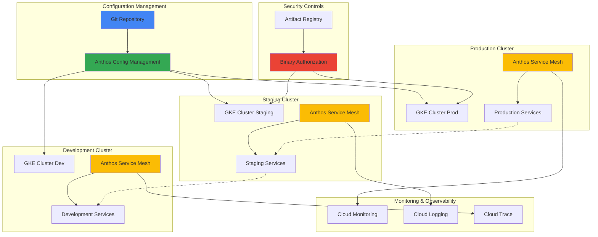

# Establishing Multi-Cluster Service Mesh Governance with Anthos Service Mesh and Config Management

## Problem

Enterprise organizations running microservices across multiple Kubernetes clusters face significant challenges in maintaining consistent security policies, traffic management, and compliance requirements. Traditional approaches to service mesh governance often result in configuration drift, inconsistent security controls, and complex manual processes that don't scale across distributed environments, leading to security vulnerabilities and operational overhead.

## Solution

Implement enterprise-grade service mesh governance using Anthos Service Mesh for traffic management and security, combined with Anthos Config Management for automated policy enforcement and Binary Authorization for container image security. This approach provides centralized policy management, automated compliance enforcement, and consistent security controls across multiple GKE clusters through GitOps-driven configuration management.

## Architecture Diagram



## Prerequisites

1. Google Cloud project with Owner or Editor permissions
2. Google Cloud CLI (gcloud) installed and authenticated
3. kubectl CLI tool installed (version 1.24 or later)
4. Git repository for configuration management
5. Basic understanding of Kubernetes, Istio, and GitOps principles
6. Estimated cost: $150-300/month for 3 GKE clusters with Anthos Service Mesh and monitoring

> **Note**: This recipe uses Google Cloud's managed Anthos Service Mesh, which provides enterprise-grade service mesh capabilities without the operational overhead of managing Istio control planes manually.

## Preparation

```bash
# Set environment variables for GCP resources
export PROJECT_ID="service-mesh-gov-$(date +%s)"
export REGION="us-central1"
export ZONE="us-central1-a"

# Generate unique suffix for resource names
RANDOM_SUFFIX=$(openssl rand -hex 3)

# Set cluster names for different environments
export PROD_CLUSTER="prod-cluster-${RANDOM_SUFFIX}"
export STAGING_CLUSTER="staging-cluster-${RANDOM_SUFFIX}"
export DEV_CLUSTER="dev-cluster-${RANDOM_SUFFIX}"

# Set default project and region
gcloud config set project ${PROJECT_ID}
gcloud config set compute/region ${REGION}
gcloud config set compute/zone ${ZONE}

# Enable required APIs
gcloud services enable container.googleapis.com
gcloud services enable mesh.googleapis.com
gcloud services enable gkehub.googleapis.com
gcloud services enable sourcerepo.googleapis.com
gcloud services enable binaryauthorization.googleapis.com
gcloud services enable containeranalysis.googleapis.com
gcloud services enable artifactregistry.googleapis.com
gcloud services enable monitoring.googleapis.com
gcloud services enable logging.googleapis.com

# Create Artifact Registry for container images
gcloud artifacts repositories create secure-apps \
    --repository-format=docker \
    --location=${REGION} \
    --description="Secure container images repository"

# Create Git repository for configuration management
gcloud source repos create anthos-config-management

echo "✅ Project configured: ${PROJECT_ID}"
echo "✅ Required APIs enabled"
echo "✅ Artifact Registry and Git repository created"
```

## Steps

1. **Create GKE Clusters with Anthos Service Mesh**:

   Google Kubernetes Engine provides managed Kubernetes with integrated security, monitoring, and networking. When combined with Anthos Service Mesh, these clusters gain advanced traffic management, security policies, and observability without the complexity of self-managing Istio control planes.

   ```bash
   # Create production cluster with Workload Identity and service mesh
   gcloud container clusters create ${PROD_CLUSTER} \
       --zone=${ZONE} \
       --machine-type=e2-standard-4 \
       --num-nodes=3 \
       --enable-ip-alias \
       --enable-autorepair \
       --enable-autoupgrade \
       --enable-workload-identity \
       --labels="env=production,mesh=enabled" \
       --logging=SYSTEM,WORKLOAD \
       --monitoring=SYSTEM
   
   # Create staging cluster
   gcloud container clusters create ${STAGING_CLUSTER} \
       --zone=${ZONE} \
       --machine-type=e2-standard-2 \
       --num-nodes=2 \
       --enable-ip-alias \
       --enable-autorepair \
       --enable-autoupgrade \
       --enable-workload-identity \
       --labels="env=staging,mesh=enabled"
   
   # Create development cluster
   gcloud container clusters create ${DEV_CLUSTER} \
       --zone=${ZONE} \
       --machine-type=e2-standard-2 \
       --num-nodes=2 \
       --enable-ip-alias \
       --enable-autorepair \
       --enable-autoupgrade \
       --enable-workload-identity \
       --labels="env=development,mesh=enabled"
   
   echo "✅ Three GKE clusters created successfully"
   ```

   The clusters are now provisioned with Workload Identity for secure pod-to-Google Cloud service authentication and appropriate resource allocation for each environment. This foundation supports both the service mesh infrastructure and application workloads while maintaining cost efficiency through environment-appropriate sizing.

2. **Register Clusters to Fleet and Enable Service Mesh**:

   Google Cloud Fleet Management enables centralized management of multiple clusters, while Anthos Service Mesh provides observability, security, and traffic management across the entire fleet. This step establishes the foundation for cross-cluster service communication and centralized policy enforcement.

   ```bash
   # Get cluster credentials
   gcloud container clusters get-credentials ${PROD_CLUSTER} --zone=${ZONE}
   gcloud container clusters get-credentials ${STAGING_CLUSTER} --zone=${ZONE}
   gcloud container clusters get-credentials ${DEV_CLUSTER} --zone=${ZONE}
   
   # Register clusters to fleet
   gcloud container fleet memberships register prod-membership \
       --gke-cluster=${ZONE}/${PROD_CLUSTER} \
       --enable-workload-identity
   
   gcloud container fleet memberships register staging-membership \
       --gke-cluster=${ZONE}/${STAGING_CLUSTER} \
       --enable-workload-identity
   
   gcloud container fleet memberships register dev-membership \
       --gke-cluster=${ZONE}/${DEV_CLUSTER} \
       --enable-workload-identity
   
   # Enable Service Mesh feature on the fleet
   gcloud container fleet mesh enable
   
   # Apply managed service mesh to all clusters
   gcloud container fleet mesh update \
       --memberships=prod-membership,staging-membership,dev-membership \
       --management=MANAGEMENT_AUTOMATIC \
       --control-plane=AUTOMATIC
   
   echo "✅ Clusters registered to fleet and service mesh enabled"
   ```

   The clusters are now part of a managed fleet with Anthos Service Mesh automatically provisioned and managed by Google Cloud. This eliminates the operational complexity of managing Istio control planes while providing enterprise-grade service mesh capabilities across all environments.

3. **Configure Multi-Cluster Service Discovery**:

   Multi-cluster service discovery enables services in one cluster to communicate with services in other clusters securely and efficiently. This capability is essential for implementing cross-cluster traffic routing, disaster recovery scenarios, and gradual service migration between environments.

   ```bash
   # Enable cross-cluster service discovery
   kubectl apply --context=gke_${PROJECT_ID}_${ZONE}_${PROD_CLUSTER} -f - <<EOF
   apiVersion: networking.istio.io/v1beta1
   kind: Gateway
   metadata:
     name: cross-cluster-gateway
     namespace: istio-system
   spec:
     selector:
       istio: eastwestgateway
     servers:
       - port:
           number: 15021
           name: status-port
           protocol: HTTP
         hosts:
           - "*"
   EOF
   
   # Apply same configuration to staging and dev clusters
   kubectl apply --context=gke_${PROJECT_ID}_${ZONE}_${STAGING_CLUSTER} -f - <<EOF
   apiVersion: networking.istio.io/v1beta1
   kind: Gateway
   metadata:
     name: cross-cluster-gateway
     namespace: istio-system
   spec:
     selector:
       istio: eastwestgateway
     servers:
       - port:
           number: 15021
           name: status-port
           protocol: HTTP
         hosts:
           - "*"
   EOF
   
   kubectl apply --context=gke_${PROJECT_ID}_${ZONE}_${DEV_CLUSTER} -f - <<EOF
   apiVersion: networking.istio.io/v1beta1
   kind: Gateway
   metadata:
     name: cross-cluster-gateway
     namespace: istio-system
   spec:
     selector:
       istio: eastwestgateway
     servers:
       - port:
           number: 15021
           name: status-port
           protocol: HTTP
         hosts:
           - "*"
   EOF
   
   echo "✅ Cross-cluster service discovery configured"
   ```

   Cross-cluster communication is now enabled through Istio gateways, allowing services to discover and communicate with each other across different clusters while maintaining security through mutual TLS and service mesh policies.

4. **Set Up Anthos Config Management with GitOps**:

   Anthos Config Management provides GitOps-driven configuration management, ensuring that all cluster configurations remain consistent and auditable. This approach prevents configuration drift and enables automated policy enforcement across the entire fleet through declarative Git-based workflows.

   ```bash
   # Clone the configuration repository
   gcloud source repos clone anthos-config-management --project=${PROJECT_ID}
   cd anthos-config-management
   
   # Create directory structure for configuration management
   mkdir -p config-root/{namespaces,cluster,system}
   mkdir -p config-root/namespaces/{production,staging,development}
   
   # Create root configuration
   cat > config-root/system/repo.yaml <<EOF
   apiVersion: configmanagement.gke.io/v1
   kind: Repo
   metadata:
     name: repo
   spec:
     version: "1.0.0"
   EOF
   
   # Create namespace configurations
   cat > config-root/namespaces/production/namespace.yaml <<EOF
   apiVersion: v1
   kind: Namespace
   metadata:
     name: production
     labels:
       env: production
       istio-injection: enabled
   EOF
   
   cat > config-root/namespaces/staging/namespace.yaml <<EOF
   apiVersion: v1
   kind: Namespace
   metadata:
     name: staging
     labels:
       env: staging
       istio-injection: enabled
   EOF
   
   cat > config-root/namespaces/development/namespace.yaml <<EOF
   apiVersion: v1
   kind: Namespace
   metadata:
     name: development
     labels:
       env: development
       istio-injection: enabled
   EOF
   
   # Commit initial configuration
   git add .
   git commit -m "Initial Anthos Config Management setup"
   git push origin master
   
   echo "✅ Anthos Config Management repository configured"
   ```

   The GitOps repository structure is now established with environment-specific namespace configurations. This foundation enables declarative management of all cluster resources, ensuring consistency and providing an audit trail for all configuration changes.

5. **Configure Service Mesh Security Policies**:

   Implementing comprehensive security policies ensures that service-to-service communication follows zero-trust principles with mutual TLS, authorization controls, and traffic encryption. These policies are essential for meeting enterprise security requirements and regulatory compliance standards.

   ```bash
   # Create strict mutual TLS policy
   cat > config-root/cluster/strict-mtls-policy.yaml <<EOF
   apiVersion: security.istio.io/v1beta1
   kind: PeerAuthentication
   metadata:
     name: default
     namespace: istio-system
   spec:
     mtls:
       mode: STRICT
   ---
   apiVersion: security.istio.io/v1beta1
   kind: PeerAuthentication
   metadata:
     name: production-strict
     namespace: production
   spec:
     mtls:
       mode: STRICT
   ---
   apiVersion: security.istio.io/v1beta1
   kind: PeerAuthentication
   metadata:
     name: staging-strict
     namespace: staging
   spec:
     mtls:
       mode: STRICT
   EOF
   
   # Create authorization policies for environment isolation
   cat > config-root/namespaces/production/authz-policy.yaml <<EOF
   apiVersion: security.istio.io/v1beta1
   kind: AuthorizationPolicy
   metadata:
     name: production-access-control
     namespace: production
   spec:
     selector:
       matchLabels:
         env: production
     rules:
     - from:
       - source:
           namespaces: ["production"]
       - source:
           namespaces: ["staging"]
           principals: ["cluster.local/ns/staging/sa/staging-service"]
       to:
       - operation:
           methods: ["GET", "POST"]
   EOF
   
   # Create network policies for additional security
   cat > config-root/namespaces/production/network-policy.yaml <<EOF
   apiVersion: networking.k8s.io/v1
   kind: NetworkPolicy
   metadata:
     name: production-network-policy
     namespace: production
   spec:
     podSelector: {}
     policyTypes:
     - Ingress
     - Egress
     ingress:
     - from:
       - namespaceSelector:
           matchLabels:
             name: production
       - namespaceSelector:
           matchLabels:
             name: istio-system
     egress:
     - to:
       - namespaceSelector:
           matchLabels:
             name: production
       - namespaceSelector:
           matchLabels:
             name: istio-system
     - to: []
       ports:
       - protocol: TCP
         port: 443
   EOF
   
   git add .
   git commit -m "Add service mesh security policies"
   git push origin master
   
   echo "✅ Service mesh security policies configured"
   ```

   Comprehensive security policies are now in place, enforcing strict mutual TLS authentication, namespace-based authorization controls, and network-level traffic restrictions. These policies ensure that all service communication is encrypted and authorized, meeting zero-trust security requirements.

6. **Implement Binary Authorization for Container Security**:

   Binary Authorization provides automated container image security validation, ensuring that only trusted and verified container images can be deployed to production clusters. This capability is crucial for supply chain security and preventing the deployment of vulnerable or malicious containers.

   ```bash
   # Create Binary Authorization policy
   cat > binary-auth-policy.yaml <<EOF
   admissionWhitelistPatterns:
   - namePattern: gcr.io/google-containers/*
   - namePattern: gcr.io/google_containers/*
   - namePattern: k8s.gcr.io/*
   - namePattern: gke.gcr.io/*
   - namePattern: gcr.io/stackdriver-agents/*
   clusterAdmissionRules:
     ${ZONE}.${PROD_CLUSTER}:
       requireAttestationsBy:
       - projects/${PROJECT_ID}/attestors/production-attestor
       enforcementMode: ENFORCED_BLOCK_AND_AUDIT_LOG
       evaluationMode: REQUIRE_ATTESTATION
     ${ZONE}.${STAGING_CLUSTER}:
       requireAttestationsBy:
       - projects/${PROJECT_ID}/attestors/staging-attestor
       enforcementMode: ENFORCED_BLOCK_AND_AUDIT_LOG
       evaluationMode: REQUIRE_ATTESTATION
   defaultAdmissionRule:
     requireAttestationsBy: []
     enforcementMode: ENFORCED_BLOCK_AND_AUDIT_LOG
     evaluationMode: ALWAYS_DENY
   name: projects/${PROJECT_ID}/policy
   EOF
   
   # Apply Binary Authorization policy
   gcloud container binauthz policy import binary-auth-policy.yaml
   
   # Create attestors for production and staging
   gcloud container binauthz attestors create production-attestor \
       --attestation-authority-note-project=${PROJECT_ID} \
       --attestation-authority-note=production-note \
       --description="Production environment attestor"
   
   gcloud container binauthz attestors create staging-attestor \
       --attestation-authority-note-project=${PROJECT_ID} \
       --attestation-authority-note=staging-note \
       --description="Staging environment attestor"
   
   echo "✅ Binary Authorization policies configured"
   ```

   Container image security validation is now enforced through Binary Authorization, ensuring that only attested and verified images can be deployed to production and staging environments. This provides an additional layer of supply chain security and compliance enforcement.

7. **Deploy Config Management to Clusters**:

   Deploying Config Management operators to each cluster enables automated synchronization of configurations from the Git repository. This ensures that policy changes are automatically applied across all clusters, maintaining consistency and reducing manual configuration errors.

   ```bash
   # Configure Config Management for each cluster
   cat > config-management.yaml <<EOF
   apiVersion: configmanagement.gke.io/v1
   kind: ConfigManagement
   metadata:
     name: config-management
   spec:
     git:
       syncRepo: https://source.developers.google.com/p/${PROJECT_ID}/r/anthos-config-management
       syncBranch: master
       secretType: none
       policyDir: config-root
     sourceFormat: unstructured
     enableMultiRepo: false
   EOF
   
   # Apply Config Management to production cluster
   kubectl apply --context=gke_${PROJECT_ID}_${ZONE}_${PROD_CLUSTER} \
       -f config-management.yaml
   
   # Apply Config Management to staging cluster
   kubectl apply --context=gke_${PROJECT_ID}_${ZONE}_${STAGING_CLUSTER} \
       -f config-management.yaml
   
   # Apply Config Management to development cluster
   kubectl apply --context=gke_${PROJECT_ID}_${ZONE}_${DEV_CLUSTER} \
       -f config-management.yaml
   
   # Wait for Config Management to sync
   sleep 60
   
   echo "✅ Anthos Config Management deployed to all clusters"
   ```

   Config Management operators are now actively monitoring the Git repository and automatically synchronizing configurations across all clusters. This establishes a continuous compliance mechanism that ensures policy enforcement and configuration consistency without manual intervention.

8. **Deploy Sample Applications with Service Mesh Integration**:

   Deploying sample applications demonstrates the service mesh capabilities and validates that security policies, traffic management, and observability features are working correctly across the multi-cluster environment. These applications serve as reference implementations for production workloads.

   ```bash
   # Create sample application configurations
   mkdir -p config-root/namespaces/production/apps
   
   cat > config-root/namespaces/production/apps/frontend-app.yaml <<EOF
   apiVersion: apps/v1
   kind: Deployment
   metadata:
     name: frontend
     namespace: production
     labels:
       app: frontend
       version: v1
   spec:
     replicas: 2
     selector:
       matchLabels:
         app: frontend
         version: v1
     template:
       metadata:
         labels:
           app: frontend
           version: v1
       spec:
         serviceAccountName: frontend-sa
         containers:
         - name: frontend
           image: gcr.io/google-samples/hello-app:1.0
           ports:
           - containerPort: 8080
           env:
           - name: VERSION
             value: "production-v1"
   ---
   apiVersion: v1
   kind: Service
   metadata:
     name: frontend
     namespace: production
     labels:
       app: frontend
   spec:
     selector:
       app: frontend
     ports:
     - port: 80
       targetPort: 8080
   ---
   apiVersion: v1
   kind: ServiceAccount
   metadata:
     name: frontend-sa
     namespace: production
   EOF
   
   # Create virtual service for traffic management
   cat > config-root/namespaces/production/apps/frontend-vs.yaml <<EOF
   apiVersion: networking.istio.io/v1beta1
   kind: VirtualService
   metadata:
     name: frontend
     namespace: production
   spec:
     hosts:
     - frontend
     http:
     - match:
       - headers:
           canary:
             exact: "true"
       route:
       - destination:
           host: frontend
           subset: v2
         weight: 100
     - route:
       - destination:
           host: frontend
           subset: v1
         weight: 100
   ---
   apiVersion: networking.istio.io/v1beta1
   kind: DestinationRule
   metadata:
     name: frontend
     namespace: production
   spec:
     host: frontend
     subsets:
     - name: v1
       labels:
         version: v1
     - name: v2
       labels:
         version: v2
   EOF
   
   git add .
   git commit -m "Add sample applications with service mesh configuration"
   git push origin master
   
   echo "✅ Sample applications configured for deployment"
   ```

   Sample applications with service mesh integration are now configured in the GitOps repository. These applications demonstrate traffic routing, version management, and security policy enforcement while providing a foundation for testing and validation of the service mesh governance implementation.

9. **Configure Observability and Monitoring**:

   Comprehensive observability is essential for monitoring service mesh health, tracking security policy compliance, and troubleshooting issues across the multi-cluster environment. Google Cloud's integrated monitoring and logging provide deep insights into service mesh operations and application performance.

   ```bash
   # Enable service mesh observability features
   cat > config-root/cluster/telemetry-config.yaml <<EOF
   apiVersion: install.istio.io/v1alpha1
   kind: IstioOperator
   metadata:
     name: telemetry-config
     namespace: istio-system
   spec:
     values:
       telemetry:
         v2:
           prometheus:
             configOverride:
               metric_relabeling_configs:
               - source_labels: [__name__]
                 regex: 'istio_.*'
                 target_label: __tmp_istio_metric
               - source_labels: [__tmp_istio_metric]
                 target_label: __name__
   EOF
   
   # Create monitoring dashboard configuration
   cat > monitoring-dashboard.json <<EOF
   {
     "displayName": "Service Mesh Governance Dashboard",
     "mosaicLayout": {
       "tiles": [
         {
           "width": 6,
           "height": 4,
           "widget": {
             "title": "Service Mesh Request Rate",
             "xyChart": {
               "dataSets": [
                 {
                   "timeSeriesQuery": {
                     "prometheusQuery": "sum(rate(istio_requests_total[5m])) by (source_app, destination_service_name)"
                   }
                 }
               ]
             }
           }
         },
         {
           "width": 6,
           "height": 4,
           "xPos": 6,
           "widget": {
             "title": "mTLS Policy Compliance",
             "scorecard": {
               "timeSeriesQuery": {
                 "prometheusQuery": "sum(istio_requests_total{security_policy=\"mutual_tls\"}) / sum(istio_requests_total)"
               }
             }
           }
         }
       ]
     }
   }
   EOF
   
   # Create the monitoring dashboard
   gcloud monitoring dashboards create --config-from-file=monitoring-dashboard.json
   
   git add config-root/cluster/telemetry-config.yaml
   git commit -m "Add service mesh observability configuration"
   git push origin master
   
   echo "✅ Observability and monitoring configured"
   ```

   Comprehensive monitoring and observability are now enabled for the service mesh, providing insights into request rates, security policy compliance, and overall system health. The monitoring dashboard enables operators to track key metrics and ensure that governance policies are being enforced effectively.

## Validation & Testing

1. **Verify Cluster Fleet Registration and Service Mesh Status**:

   ```bash
   # Check fleet membership status
   gcloud container fleet memberships list
   
   # Verify service mesh status
   gcloud container fleet mesh describe
   
   # Check service mesh readiness on each cluster
   kubectl get pods -n istio-system --context=gke_${PROJECT_ID}_${ZONE}_${PROD_CLUSTER}
   kubectl get pods -n istio-system --context=gke_${PROJECT_ID}_${ZONE}_${STAGING_CLUSTER}
   kubectl get pods -n istio-system --context=gke_${PROJECT_ID}_${ZONE}_${DEV_CLUSTER}
   ```

   Expected output: All clusters should show as registered fleet members with service mesh status as "READY" and Istio system pods running successfully.

2. **Test Config Management Synchronization**:

   ```bash
   # Check Config Management sync status
   kubectl get configmanagement --context=gke_${PROJECT_ID}_${ZONE}_${PROD_CLUSTER}
   
   # Verify namespace creation and labeling
   kubectl get namespaces --show-labels --context=gke_${PROJECT_ID}_${ZONE}_${PROD_CLUSTER}
   
   # Check policy enforcement
   kubectl get peerauthentication -A --context=gke_${PROJECT_ID}_${ZONE}_${PROD_CLUSTER}
   kubectl get authorizationpolicy -A --context=gke_${PROJECT_ID}_${ZONE}_${PROD_CLUSTER}
   ```

   Expected output: Config Management should show "SYNCED" status, namespaces should exist with correct labels, and security policies should be applied across all clusters.

3. **Validate Binary Authorization Policy Enforcement**:

   ```bash
   # Check Binary Authorization policy
   gcloud container binauthz policy export
   
   # Verify attestors
   gcloud container binauthz attestors list
   
   # Test policy enforcement by attempting to deploy unsigned image
   kubectl run test-pod --image=nginx --context=gke_${PROJECT_ID}_${ZONE}_${PROD_CLUSTER} -n production
   ```

   Expected output: Binary Authorization policy should be active, attestors should be listed, and unsigned image deployment should be blocked with policy violation message.

4. **Test Cross-Cluster Service Communication**:

   ```bash
   # Deploy test services if applications are running
   kubectl get services -n production --context=gke_${PROJECT_ID}_${ZONE}_${PROD_CLUSTER}
   
   # Test service mesh traffic policies
   kubectl get virtualservices -A --context=gke_${PROJECT_ID}_${ZONE}_${PROD_CLUSTER}
   kubectl get destinationrules -A --context=gke_${PROJECT_ID}_${ZONE}_${PROD_CLUSTER}
   
   # Verify mutual TLS enforcement
   kubectl get peerauthentication -A --context=gke_${PROJECT_ID}_${ZONE}_${PROD_CLUSTER}
   ```

   Expected output: Services should be accessible within authorized namespaces, traffic policies should be configured, and mutual TLS should be enforced across all service communications.

## Cleanup

1. **Remove Sample Applications and Configurations**:

   ```bash
   # Clean up Git repository configurations
   cd anthos-config-management
   git rm -r config-root/namespaces/*/apps/
   git commit -m "Remove sample applications"
   git push origin master
   
   # Wait for Config Management to sync deletions
   sleep 60
   
   echo "✅ Sample applications removed"
   ```

2. **Disable Config Management and Fleet Features**:

   ```bash
   # Remove Config Management from clusters
   kubectl delete configmanagement config-management --context=gke_${PROJECT_ID}_${ZONE}_${PROD_CLUSTER}
   kubectl delete configmanagement config-management --context=gke_${PROJECT_ID}_${ZONE}_${STAGING_CLUSTER}
   kubectl delete configmanagement config-management --context=gke_${PROJECT_ID}_${ZONE}_${DEV_CLUSTER}
   
   # Disable service mesh on fleet
   gcloud container fleet mesh disable --force
   
   # Unregister clusters from fleet
   gcloud container fleet memberships unregister prod-membership
   gcloud container fleet memberships unregister staging-membership
   gcloud container fleet memberships unregister dev-membership
   
   echo "✅ Fleet features disabled and clusters unregistered"
   ```

3. **Delete GKE Clusters**:

   ```bash
   # Delete all clusters
   gcloud container clusters delete ${PROD_CLUSTER} --zone=${ZONE} --quiet
   gcloud container clusters delete ${STAGING_CLUSTER} --zone=${ZONE} --quiet
   gcloud container clusters delete ${DEV_CLUSTER} --zone=${ZONE} --quiet
   
   echo "✅ GKE clusters deleted"
   ```

4. **Clean Up Supporting Resources**:

   ```bash
   # Delete Binary Authorization attestors and policy
   gcloud container binauthz attestors delete production-attestor --quiet
   gcloud container binauthz attestors delete staging-attestor --quiet
   
   # Reset Binary Authorization policy to default
   gcloud container binauthz policy import /dev/stdin <<< '{
     "defaultAdmissionRule": {
       "requireAttestationsBy": [],
       "enforcementMode": "PERMISSIVE_ENFORCEMENT",
       "evaluationMode": "ALWAYS_ALLOW"
     },
     "name": "projects/'${PROJECT_ID}'/policy"
   }'
   
   # Delete Artifact Registry repository
   gcloud artifacts repositories delete secure-apps --location=${REGION} --quiet
   
   # Delete monitoring dashboard
   DASHBOARD_ID=$(gcloud monitoring dashboards list --filter="displayName:'Service Mesh Governance Dashboard'" --format="value(name)")
   if [ ! -z "$DASHBOARD_ID" ]; then
     gcloud monitoring dashboards delete $DASHBOARD_ID --quiet
   fi
   
   # Delete source repository
   gcloud source repos delete anthos-config-management --quiet
   
   echo "✅ All supporting resources cleaned up"
   ```

## Discussion

This implementation demonstrates enterprise-grade service mesh governance using Google Cloud's managed Anthos Service Mesh combined with Anthos Config Management for automated policy enforcement. The solution addresses critical challenges in multi-cluster environments by providing centralized configuration management, automated security policy enforcement, and comprehensive observability across distributed Kubernetes clusters.

The architecture leverages Google Cloud's Fleet Management to establish a unified control plane for multiple GKE clusters, enabling consistent policy application and operational management. Anthos Service Mesh provides the foundation for secure service-to-service communication through automatic mutual TLS, fine-grained access controls, and advanced traffic management capabilities. By using Google's managed service mesh offering, organizations eliminate the operational complexity of maintaining Istio control planes while gaining enterprise-grade features and Google's SRE expertise.

Anthos Config Management implements GitOps principles for configuration management, ensuring that all cluster configurations remain consistent and auditable. This approach prevents configuration drift, a common source of security vulnerabilities and operational issues in multi-cluster environments. The Git-based workflow provides version control, rollback capabilities, and change approval processes that are essential for enterprise governance requirements. Binary Authorization adds an additional layer of security by ensuring that only verified and attested container images can be deployed to production environments, addressing supply chain security concerns and compliance requirements.

The observability and monitoring configuration provides comprehensive insights into service mesh operations, security policy compliance, and application performance. Google Cloud's integrated monitoring and logging services offer deep visibility into service mesh metrics, enabling operators to track policy enforcement, identify performance bottlenecks, and troubleshoot issues quickly. This observability foundation is crucial for maintaining service mesh governance at scale and ensuring that security policies are effectively enforced across the entire infrastructure.

> **Tip**: Implement gradual rollout strategies using Istio traffic splitting capabilities to safely deploy configuration changes and new policies across your service mesh environment, minimizing risk and enabling quick rollback if issues are detected.

For additional technical guidance and best practices, refer to the [Google Cloud Service Mesh Security Best Practices](https://cloud.google.com/service-mesh/docs/security/anthos-service-mesh-security-best-practices), [Anthos Config Management Documentation](https://cloud.google.com/anthos-config-management/docs), [Multi-cluster Service Mesh Setup Guide](https://cloud.google.com/service-mesh/docs/operate-and-maintain/multi-cluster), [Binary Authorization Documentation](https://cloud.google.com/binary-authorization/docs), and the [Google Cloud Architecture Framework](https://cloud.google.com/architecture/framework) for comprehensive guidance on implementing secure and scalable cloud-native architectures.

## Challenge

Extend this service mesh governance implementation with these advanced capabilities:

1. **Implement Progressive Delivery Pipelines**: Create automated canary deployments using Istio traffic splitting, Cloud Build, and Config Management to enable safe, gradual rollouts of application changes across the service mesh with automated rollback capabilities based on SLI metrics.

2. **Add Multi-Region Disaster Recovery**: Extend the architecture to include clusters across multiple regions with cross-region service discovery, automated failover mechanisms, and data replication strategies to ensure business continuity and meet disaster recovery requirements.

3. **Integrate Advanced Security Scanning**: Implement Container Analysis API integration with Binary Authorization to automatically scan container images for vulnerabilities, enforce security policies based on CVE severity levels, and create automated security incident response workflows.

4. **Implement Cost Optimization Automation**: Create intelligent resource scaling policies using Vertical Pod Autoscaler, Horizontal Pod Autoscaler, and Cluster Autoscaler with service mesh metrics to optimize costs while maintaining performance across the multi-cluster environment.

5. **Build Compliance Automation Framework**: Develop automated compliance reporting and validation using Policy Controller, Config Validator, and Cloud Asset Inventory to ensure continuous compliance with industry standards like SOC 2, PCI DSS, and HIPAA across the entire service mesh infrastructure.

## Infrastructure Code

*Infrastructure code will be generated after recipe approval.*