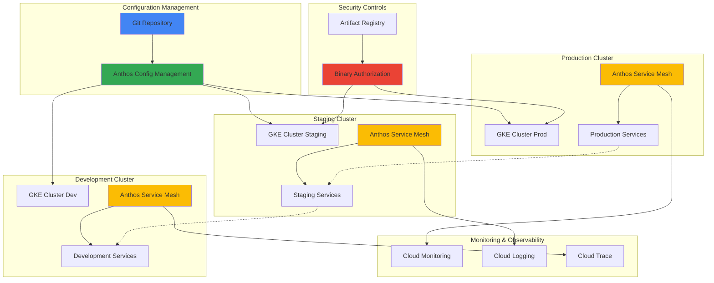

# Establishing Multi-Cluster Service Mesh Governance with Anthos Service Mesh and Config Management

## Problem

Enterprise organizations running microservices across multiple Kubernetes clusters face significant challenges in maintaining consistent security policies, traffic management, and compliance requirements. Traditional approaches to service mesh governance often result in configuration drift, inconsistent security controls, and complex manual processes that don't scale across distributed environments, leading to security vulnerabilities and operational overhead.

## Solution

Implement enterprise-grade service mesh governance using Anthos Service Mesh for traffic management and security, combined with Anthos Config Management for automated policy enforcement and Binary Authorization for container image security. This approach provides centralized policy management, automated compliance enforcement, and consistent security controls across multiple GKE clusters through GitOps-driven configuration management.

## Architecture Diagram



## Prerequisites

1. Google Cloud project with Owner or Editor permissions
2. Google Cloud CLI (gcloud) installed and authenticated (version 450.0.0+)
3. kubectl CLI tool installed (version 1.24 or later)
4. Git repository for configuration management
5. Basic understanding of Kubernetes, Istio, and GitOps principles
6. Estimated cost: $200-400/month for 3 GKE clusters with Anthos Service Mesh and monitoring

> **Note**: This recipe uses Google Cloud's managed Anthos Service Mesh, which provides enterprise-grade service mesh capabilities without the operational overhead of managing Istio control planes manually.

## Preparation

```bash
# Set environment variables for GCP resources
export PROJECT_ID="service-mesh-gov-$(date +%s)"
export REGION="us-central1"
export ZONE="us-central1-a"

# Generate unique suffix for resource names
RANDOM_SUFFIX=$(openssl rand -hex 3)

# Set cluster names for different environments
export PROD_CLUSTER="prod-cluster-${RANDOM_SUFFIX}"
export STAGING_CLUSTER="staging-cluster-${RANDOM_SUFFIX}"
export DEV_CLUSTER="dev-cluster-${RANDOM_SUFFIX}"

# Set default project and region
gcloud config set project ${PROJECT_ID}
gcloud config set compute/region ${REGION}
gcloud config set compute/zone ${ZONE}

# Enable required APIs
gcloud services enable container.googleapis.com
gcloud services enable gkehub.googleapis.com
gcloud services enable mesh.googleapis.com
gcloud services enable sourcerepo.googleapis.com
gcloud services enable binaryauthorization.googleapis.com
gcloud services enable containeranalysis.googleapis.com
gcloud services enable artifactregistry.googleapis.com
gcloud services enable monitoring.googleapis.com
gcloud services enable logging.googleapis.com
gcloud services enable anthos.googleapis.com

# Create Artifact Registry for container images
gcloud artifacts repositories create secure-apps \
    --repository-format=docker \
    --location=${REGION} \
    --description="Secure container images repository"

# Create Git repository for configuration management
gcloud source repos create anthos-config-management

echo "✅ Project configured: ${PROJECT_ID}"
echo "✅ Required APIs enabled"
echo "✅ Artifact Registry and Git repository created"
```

## Steps

1. **Create GKE Clusters with Fleet Registration**:

   Google Kubernetes Engine provides managed Kubernetes with integrated security, monitoring, and networking. Creating clusters with proper fleet registration enables centralized management and service mesh capabilities across multiple environments.

   ```bash
   # Create production cluster with enhanced security and monitoring
   gcloud container clusters create ${PROD_CLUSTER} \
       --zone=${ZONE} \
       --machine-type=e2-standard-4 \
       --num-nodes=3 \
       --enable-ip-alias \
       --enable-autorepair \
       --enable-autoupgrade \
       --enable-workload-identity \
       --enable-shielded-nodes \
       --labels="env=production,mesh=enabled" \
       --logging=SYSTEM,WORKLOAD \
       --monitoring=SYSTEM
   
   # Create staging cluster with cost-optimized settings
   gcloud container clusters create ${STAGING_CLUSTER} \
       --zone=${ZONE} \
       --machine-type=e2-standard-2 \
       --num-nodes=2 \
       --enable-ip-alias \
       --enable-autorepair \
       --enable-autoupgrade \
       --enable-workload-identity \
       --enable-shielded-nodes \
       --labels="env=staging,mesh=enabled"
   
   # Create development cluster with minimal resources
   gcloud container clusters create ${DEV_CLUSTER} \
       --zone=${ZONE} \
       --machine-type=e2-standard-2 \
       --num-nodes=2 \
       --enable-ip-alias \
       --enable-autorepair \
       --enable-autoupgrade \
       --enable-workload-identity \
       --enable-shielded-nodes \
       --labels="env=development,mesh=enabled"
   
   echo "✅ Three GKE clusters created successfully"
   ```

   The clusters are now provisioned with enhanced security features including Workload Identity and Shielded GKE nodes. These security-hardened clusters provide the foundation for service mesh deployment while maintaining cost efficiency through environment-appropriate resource allocation.

2. **Register Clusters to Fleet and Enable Service Mesh**:

   Google Cloud Fleet Management enables centralized governance across multiple clusters, while the managed service mesh provides automated Istio deployment and lifecycle management. This eliminates the operational complexity of managing service mesh infrastructure.

   ```bash
   # Get cluster credentials for kubectl access
   gcloud container clusters get-credentials ${PROD_CLUSTER} --zone=${ZONE}
   gcloud container clusters get-credentials ${STAGING_CLUSTER} --zone=${ZONE}
   gcloud container clusters get-credentials ${DEV_CLUSTER} --zone=${ZONE}
   
   # Register clusters to the fleet for centralized management
   gcloud container fleet memberships register prod-membership \
       --gke-cluster=${ZONE}/${PROD_CLUSTER} \
       --enable-workload-identity
   
   gcloud container fleet memberships register staging-membership \
       --gke-cluster=${ZONE}/${STAGING_CLUSTER} \
       --enable-workload-identity
   
   gcloud container fleet memberships register dev-membership \
       --gke-cluster=${ZONE}/${DEV_CLUSTER} \
       --enable-workload-identity
   
   # Enable Service Mesh feature on the fleet
   gcloud container fleet mesh enable
   
   # Deploy managed Anthos Service Mesh to all clusters
   gcloud container fleet mesh update \
       --memberships=prod-membership,staging-membership,dev-membership \
       --management=MANAGEMENT_AUTOMATIC \
       --control-plane=AUTOMATIC
   
   echo "✅ Clusters registered to fleet and service mesh enabled"
   ```

   All clusters are now part of a managed fleet with Anthos Service Mesh automatically deployed. Google Cloud manages the Istio control plane lifecycle, upgrades, and security patches, reducing operational overhead while providing enterprise-grade service mesh capabilities.

3. **Configure Cross-Cluster Service Discovery**:

   Multi-cluster service discovery enables secure communication between services across different clusters through Istio's east-west gateway. This configuration supports disaster recovery scenarios, canary deployments, and gradual service migration patterns.

   ```bash
   # Wait for service mesh installation to complete
   sleep 120
   
   # Configure east-west gateway for cross-cluster communication
   for CLUSTER in ${PROD_CLUSTER} ${STAGING_CLUSTER} ${DEV_CLUSTER}; do
     kubectl apply --context=gke_${PROJECT_ID}_${ZONE}_${CLUSTER} -f - <<EOF
   apiVersion: networking.istio.io/v1beta1
   kind: Gateway
   metadata:
     name: cross-cluster-gateway
     namespace: istio-system
   spec:
     selector:
       istio: eastwestgateway
     servers:
       - port:
           number: 15021
           name: status-port
           protocol: HTTP
         hosts:
           - "*"
       - port:
           number: 15443
           name: tls
           protocol: TLS
         tls:
           mode: ISTIO_MUTUAL
         hosts:
           - "*.local"
   EOF
   done
   
   echo "✅ Cross-cluster service discovery configured"
   ```

   Cross-cluster communication is now enabled with proper TLS configuration for secure service-to-service communication. The east-west gateways allow services to discover and communicate across cluster boundaries while maintaining Istio's security policies.

4. **Set Up Anthos Config Management with GitOps**:

   Anthos Config Management provides GitOps-driven configuration management using Config Sync for automated policy enforcement. This approach ensures configuration consistency and provides a complete audit trail for all changes across the fleet.

   ```bash
   # Clone the configuration repository
   gcloud source repos clone anthos-config-management --project=${PROJECT_ID}
   cd anthos-config-management
   
   # Initialize Git repository if empty
   git config user.email "service-mesh-admin@example.com"
   git config user.name "Service Mesh Administrator"
   
   # Create directory structure for Config Sync
   mkdir -p config-root/{namespaces,cluster,system}
   mkdir -p config-root/namespaces/{production,staging,development}
   
   # Create root sync configuration
   cat > config-root/system/repo.yaml <<EOF
   apiVersion: configmanagement.gke.io/v1
   kind: Repo
   metadata:
     name: repo
   spec:
     version: "1.0.0"
   EOF
   
   # Create namespace configurations with service mesh injection
   cat > config-root/namespaces/production/namespace.yaml <<EOF
   apiVersion: v1
   kind: Namespace
   metadata:
     name: production
     labels:
       env: production
       istio-injection: enabled
       security-level: high
   EOF
   
   cat > config-root/namespaces/staging/namespace.yaml <<EOF
   apiVersion: v1
   kind: Namespace
   metadata:
     name: staging
     labels:
       env: staging
       istio-injection: enabled
       security-level: medium
   EOF
   
   cat > config-root/namespaces/development/namespace.yaml <<EOF
   apiVersion: v1
   kind: Namespace
   metadata:
     name: development
     labels:
       env: development
       istio-injection: enabled
       security-level: low
   EOF
   
   # Commit initial configuration
   git add .
   git commit -m "Initial Anthos Config Management setup with service mesh namespaces"
   git push origin master
   
   echo "✅ Anthos Config Management repository configured"
   ```

   The GitOps repository structure is established with security-labeled namespaces and automatic service mesh injection. This foundation enables declarative management of all cluster resources while maintaining strict change control and auditability.

5. **Configure Service Mesh Security Policies**:

   Implementing comprehensive security policies ensures zero-trust service communication through mutual TLS, fine-grained authorization controls, and network-level traffic restrictions. These policies form the security foundation for the entire service mesh.

   ```bash
   # Create strict mutual TLS policies for all environments
   cat > config-root/cluster/strict-mtls-policy.yaml <<EOF
   apiVersion: security.istio.io/v1beta1
   kind: PeerAuthentication
   metadata:
     name: default-strict-mtls
     namespace: istio-system
   spec:
     mtls:
       mode: STRICT
   ---
   apiVersion: security.istio.io/v1beta1
   kind: PeerAuthentication
   metadata:
     name: production-strict-mtls
     namespace: production
   spec:
     mtls:
       mode: STRICT
   ---
   apiVersion: security.istio.io/v1beta1
   kind: PeerAuthentication
   metadata:
     name: staging-strict-mtls
     namespace: staging
   spec:
     mtls:
       mode: STRICT
   EOF
   
   # Create authorization policies for environment isolation
   cat > config-root/namespaces/production/authz-policy.yaml <<EOF
   apiVersion: security.istio.io/v1beta1
   kind: AuthorizationPolicy
   metadata:
     name: production-access-control
     namespace: production
   spec:
     selector:
       matchLabels:
         env: production
     rules:
     - from:
       - source:
           namespaces: ["production"]
       - source:
           namespaces: ["staging"]
           principals: ["cluster.local/ns/staging/sa/staging-service"]
       to:
       - operation:
           methods: ["GET", "POST", "PUT"]
       when:
       - key: source.labels[security-level]
         values: ["high", "medium"]
   EOF
   
   # Create network policies for defense in depth
   cat > config-root/namespaces/production/network-policy.yaml <<EOF
   apiVersion: networking.k8s.io/v1
   kind: NetworkPolicy
   metadata:
     name: production-network-isolation
     namespace: production
   spec:
     podSelector: {}
     policyTypes:
     - Ingress
     - Egress
     ingress:
     - from:
       - namespaceSelector:
           matchLabels:
             name: production
       - namespaceSelector:
           matchLabels:
             name: istio-system
       - namespaceSelector:
           matchLabels:
             env: staging
     egress:
     - to:
       - namespaceSelector:
           matchLabels:
             name: production
       - namespaceSelector:
           matchLabels:
             name: istio-system
     - to: []
       ports:
       - protocol: TCP
         port: 443
       - protocol: TCP
         port: 53
       - protocol: UDP
         port: 53
   EOF
   
   # Commit security policies
   git add .
   git commit -m "Add comprehensive service mesh security policies"
   git push origin master
   
   echo "✅ Service mesh security policies configured"
   ```

   Comprehensive security policies are now in place, implementing defense-in-depth through multiple layers including mutual TLS authentication, namespace-based authorization, and network-level traffic controls. These policies ensure all service communication is encrypted, authenticated, and authorized.

6. **Implement Binary Authorization for Container Security**:

   Binary Authorization provides supply chain security by ensuring only verified and attested container images can be deployed to production environments. This prevents deployment of vulnerable or unauthorized container images.

   ```bash
   # Create comprehensive Binary Authorization policy
   cat > binary-auth-policy.yaml <<EOF
   admissionWhitelistPatterns:
   - namePattern: gcr.io/google-containers/*
   - namePattern: gcr.io/google_containers/*
   - namePattern: k8s.gcr.io/*
   - namePattern: gke.gcr.io/*
   - namePattern: gcr.io/stackdriver-agents/*
   - namePattern: gcr.io/gke-release/*
   - namePattern: ${REGION}-docker.pkg.dev/${PROJECT_ID}/secure-apps/*
   clusterAdmissionRules:
     ${ZONE}.${PROD_CLUSTER}:
       requireAttestationsBy:
       - projects/${PROJECT_ID}/attestors/production-attestor
       enforcementMode: ENFORCED_BLOCK_AND_AUDIT_LOG
       evaluationMode: REQUIRE_ATTESTATION
     ${ZONE}.${STAGING_CLUSTER}:
       requireAttestationsBy:
       - projects/${PROJECT_ID}/attestors/staging-attestor
       enforcementMode: ENFORCED_BLOCK_AND_AUDIT_LOG
       evaluationMode: REQUIRE_ATTESTATION
     ${ZONE}.${DEV_CLUSTER}:
       requireAttestationsBy: []
       enforcementMode: PERMISSIVE_ENFORCEMENT
       evaluationMode: ALWAYS_ALLOW
   defaultAdmissionRule:
     requireAttestationsBy: []
     enforcementMode: ENFORCED_BLOCK_AND_AUDIT_LOG
     evaluationMode: ALWAYS_DENY
   name: projects/${PROJECT_ID}/policy
   EOF
   
   # Apply Binary Authorization policy
   gcloud container binauthz policy import binary-auth-policy.yaml
   
   # Create container analysis notes for attestation
   gcloud container analysis notes create production-note \
       --attestation-authority-hint="Production Environment Authority" \
       --description="Production environment container attestation"
   
   gcloud container analysis notes create staging-note \
       --attestation-authority-hint="Staging Environment Authority" \
       --description="Staging environment container attestation"
   
   # Create attestors with enhanced security
   gcloud container binauthz attestors create production-attestor \
       --attestation-authority-note-project=${PROJECT_ID} \
       --attestation-authority-note=production-note \
       --description="Production environment attestor with vulnerability scanning"
   
   gcloud container binauthz attestors create staging-attestor \
       --attestation-authority-note-project=${PROJECT_ID} \
       --attestation-authority-note=staging-note \
       --description="Staging environment attestor for pre-production validation"
   
   echo "✅ Binary Authorization policies configured with supply chain security"
   ```

   Container image security validation is now enforced through Binary Authorization with environment-specific policies. Only properly attested images can be deployed to production and staging, while development maintains flexibility for rapid iteration.

7. **Deploy Config Management to Clusters**:

   Installing Config Sync on each cluster enables automatic synchronization of configurations from the Git repository. This establishes continuous compliance and ensures policy changes are immediately applied across the entire fleet.

   ```bash
   # Enable Config Management feature in the fleet
   gcloud container fleet config-management enable
   
   # Configure Config Sync for each cluster using fleet management
   cat > config-sync-feature.yaml <<EOF
   apiVersion: configmanagement.gke.io/v1
   kind: ConfigManagement
   metadata:
     name: config-management
   spec:
     git:
       syncRepo: https://source.developers.google.com/p/${PROJECT_ID}/r/anthos-config-management
       syncBranch: master
       secretType: none
       policyDir: config-root
     sourceFormat: unstructured
     enableMultiRepo: true
     preventDrift: true
   EOF
   
   # Apply Config Management configuration to all fleet members
   gcloud container fleet config-management apply \
       --config=config-sync-feature.yaml \
       --membership=prod-membership
   
   gcloud container fleet config-management apply \
       --config=config-sync-feature.yaml \
       --membership=staging-membership
   
   gcloud container fleet config-management apply \
       --config=config-sync-feature.yaml \
       --membership=dev-membership
   
   # Wait for Config Management to synchronize
   sleep 90
   
   echo "✅ Anthos Config Management deployed to all clusters with drift prevention"
   ```

   Config Management is now actively monitoring the Git repository and automatically applying configurations across all clusters. The preventDrift feature ensures that manual changes are automatically corrected, maintaining configuration consistency.

8. **Deploy Sample Applications with Service Mesh Integration**:

   Sample applications demonstrate the service mesh capabilities and validate that security policies, traffic management, and observability features work correctly across the multi-cluster environment.

   ```bash
   # Create comprehensive sample application configuration
   mkdir -p config-root/namespaces/production/apps
   
   cat > config-root/namespaces/production/apps/frontend-app.yaml <<EOF
   apiVersion: apps/v1
   kind: Deployment
   metadata:
     name: frontend
     namespace: production
     labels:
       app: frontend
       version: v1
       security-level: high
   spec:
     replicas: 3
     selector:
       matchLabels:
         app: frontend
         version: v1
     template:
       metadata:
         labels:
           app: frontend
           version: v1
           security-level: high
         annotations:
           sidecar.istio.io/inject: "true"
       spec:
         serviceAccountName: frontend-sa
         securityContext:
           runAsNonRoot: true
           runAsUser: 1000
           fsGroup: 2000
         containers:
         - name: frontend
           image: gcr.io/google-samples/hello-app:1.0
           ports:
           - containerPort: 8080
           env:
           - name: VERSION
             value: "production-v1"
           - name: ENVIRONMENT
             value: "production"
           securityContext:
             allowPrivilegeEscalation: false
             readOnlyRootFilesystem: true
             capabilities:
               drop:
               - ALL
           resources:
             requests:
               memory: "64Mi"
               cpu: "50m"
             limits:
               memory: "128Mi"
               cpu: "100m"
           readinessProbe:
             httpGet:
               path: /
               port: 8080
             initialDelaySeconds: 5
             periodSeconds: 10
           livenessProbe:
             httpGet:
               path: /
               port: 8080
             initialDelaySeconds: 15
             periodSeconds: 20
   ---
   apiVersion: v1
   kind: Service
   metadata:
     name: frontend
     namespace: production
     labels:
       app: frontend
       security-level: high
   spec:
     selector:
       app: frontend
     ports:
     - name: http
       port: 80
       targetPort: 8080
       protocol: TCP
   ---
   apiVersion: v1
   kind: ServiceAccount
   metadata:
     name: frontend-sa
     namespace: production
     labels:
       security-level: high
   EOF
   
   # Create advanced Istio traffic management configuration
   cat > config-root/namespaces/production/apps/frontend-istio.yaml <<EOF
   apiVersion: networking.istio.io/v1beta1
   kind: VirtualService
   metadata:
     name: frontend
     namespace: production
   spec:
     hosts:
     - frontend
     http:
     - match:
       - headers:
           canary:
             exact: "true"
       route:
       - destination:
           host: frontend
           subset: v2
         weight: 100
       fault:
         delay:
           percentage:
             value: 0.1
           fixedDelay: 5s
     - route:
       - destination:
           host: frontend
           subset: v1
         weight: 100
       timeout: 30s
       retries:
         attempts: 3
         perTryTimeout: 10s
   ---
   apiVersion: networking.istio.io/v1beta1
   kind: DestinationRule
   metadata:
     name: frontend
     namespace: production
   spec:
     host: frontend
     trafficPolicy:
       tls:
         mode: ISTIO_MUTUAL
       connectionPool:
         tcp:
           maxConnections: 10
         http:
           http1MaxPendingRequests: 10
           maxRequestsPerConnection: 2
       circuitBreaker:
         consecutiveErrors: 3
         interval: 30s
         baseEjectionTime: 30s
     subsets:
     - name: v1
       labels:
         version: v1
       trafficPolicy:
         tls:
           mode: ISTIO_MUTUAL
     - name: v2
       labels:
         version: v2
       trafficPolicy:
         tls:
           mode: ISTIO_MUTUAL
   EOF
   
   # Commit sample applications
   git add .
   git commit -m "Add production-ready sample applications with advanced Istio configuration"
   git push origin master
   
   echo "✅ Sample applications configured with security hardening and traffic management"
   ```

   Production-ready sample applications are now configured with security best practices, resource limits, health checks, and advanced Istio traffic management features including circuit breakers, retries, and fault injection capabilities.

9. **Configure Observability and Monitoring**:

   Comprehensive observability provides deep insights into service mesh operations, security policy compliance, and application performance across the multi-cluster environment through Google Cloud's integrated monitoring platform.

   ```bash
   # Create advanced telemetry configuration
   cat > config-root/cluster/telemetry-config.yaml <<EOF
   apiVersion: v1
   kind: ConfigMap
   metadata:
     name: istio-telemetry-config
     namespace: istio-system
   data:
     custom_telemetry.yaml: |
       apiVersion: telemetry.istio.io/v1alpha1
       kind: Telemetry
       metadata:
         name: default
         namespace: istio-system
       spec:
         metrics:
         - providers:
           - name: prometheus
         - overrides:
           - match:
               metric: ALL_METRICS
             tagOverrides:
               environment:
                 operation: UPSERT
                 value: "%{ENVIRONMENT}"
         accessLogging:
         - providers:
           - name: stackdriver
   EOF
   
   # Create comprehensive monitoring dashboard
   cat > monitoring-dashboard.json <<EOF
   {
     "displayName": "Service Mesh Governance Dashboard",
     "mosaicLayout": {
       "tiles": [
         {
           "width": 6,
           "height": 4,
           "widget": {
             "title": "Service Mesh Request Rate by Environment",
             "xyChart": {
               "dataSets": [
                 {
                   "timeSeriesQuery": {
                     "prometheusQuery": "sum(rate(istio_requests_total[5m])) by (source_app, destination_service_name, environment)"
                   },
                   "plotType": "LINE"
                 }
               ]
             }
           }
         },
         {
           "width": 6,
           "height": 4,
           "xPos": 6,
           "widget": {
             "title": "mTLS Policy Compliance Rate",
             "scorecard": {
               "timeSeriesQuery": {
                 "prometheusQuery": "sum(istio_requests_total{security_policy=\"mutual_tls\"}) / sum(istio_requests_total) * 100"
               },
               "sparkChartView": {
                 "sparkChartType": "SPARK_LINE"
               }
             }
           }
         },
         {
           "width": 6,
           "height": 4,
           "yPos": 4,
           "widget": {
             "title": "Authorization Policy Violations",
             "xyChart": {
               "dataSets": [
                 {
                   "timeSeriesQuery": {
                     "prometheusQuery": "sum(rate(istio_requests_total{response_code=\"403\"}[5m])) by (source_app, destination_service_name)"
                   },
                   "plotType": "STACKED_AREA"
                 }
               ]
             }
           }
         },
         {
           "width": 6,
           "height": 4,
           "xPos": 6,
           "yPos": 4,
           "widget": {
             "title": "Cross-Cluster Traffic Volume",
             "xyChart": {
               "dataSets": [
                 {
                   "timeSeriesQuery": {
                     "prometheusQuery": "sum(rate(istio_requests_total[5m])) by (source_cluster, destination_cluster)"
                   },
                   "plotType": "STACKED_BAR"
                 }
               ]
             }
           }
         }
       ]
     }
   }
   EOF
   
   # Create the monitoring dashboard
   gcloud monitoring dashboards create --config-from-file=monitoring-dashboard.json
   
   # Create alerting policies for security violations
   cat > alerting-policy.json <<EOF
   {
     "displayName": "Service Mesh Security Violations",
     "conditions": [
       {
         "displayName": "High Authorization Policy Violations",
         "conditionThreshold": {
           "filter": "resource.type=\"k8s_cluster\" AND metric.type=\"prometheus.googleapis.com/istio_requests_total/counter\"",
           "comparison": "COMPARISON_GREATER_THAN",
           "thresholdValue": 10,
           "duration": "300s",
           "aggregations": [
             {
               "alignmentPeriod": "60s",
               "perSeriesAligner": "ALIGN_RATE"
             }
           ]
         }
       }
     ],
     "enabled": true,
     "notificationChannels": []
   }
   EOF
   
   gcloud alpha monitoring policies create --policy-from-file=alerting-policy.json
   
   # Commit telemetry configuration
   git add config-root/cluster/telemetry-config.yaml
   git commit -m "Add comprehensive service mesh observability and security monitoring"
   git push origin master
   
   echo "✅ Advanced observability and security monitoring configured"
   ```

   Comprehensive monitoring is now enabled with custom telemetry collection, security violation alerting, and cross-cluster traffic analysis. The monitoring dashboard provides real-time insights into service mesh governance effectiveness and security policy compliance.

## Validation & Testing

1. **Verify Cluster Fleet Registration and Service Mesh Status**:

   ```bash
   # Check fleet membership status
   gcloud container fleet memberships list
   
   # Verify service mesh status across all clusters
   gcloud container fleet mesh describe
   
   # Check Istio control plane components
   kubectl get pods -n istio-system --context=gke_${PROJECT_ID}_${ZONE}_${PROD_CLUSTER}
   kubectl get pods -n istio-system --context=gke_${PROJECT_ID}_${ZONE}_${STAGING_CLUSTER}
   kubectl get pods -n istio-system --context=gke_${PROJECT_ID}_${ZONE}_${DEV_CLUSTER}
   
   # Verify service mesh version and status
   kubectl get pods -n istio-system -l app=istiod --context=gke_${PROJECT_ID}_${ZONE}_${PROD_CLUSTER} -o jsonpath='{.items[0].spec.containers[0].image}'
   ```

   Expected output: All clusters should show as registered fleet members with service mesh status as "READY" and Istio system pods running successfully with consistent versions.

2. **Test Config Management Synchronization**:

   ```bash
   # Check Config Management sync status
   gcloud container fleet config-management status
   
   # Verify namespace creation and labeling
   kubectl get namespaces --show-labels --context=gke_${PROJECT_ID}_${ZONE}_${PROD_CLUSTER}
   
   # Check policy enforcement across all clusters
   kubectl get peerauthentication -A --context=gke_${PROJECT_ID}_${ZONE}_${PROD_CLUSTER}
   kubectl get authorizationpolicy -A --context=gke_${PROJECT_ID}_${ZONE}_${PROD_CLUSTER}
   
   # Verify drift prevention is working
   kubectl patch namespace production -p '{"metadata":{"labels":{"test":"drift"}}}' --context=gke_${PROJECT_ID}_${ZONE}_${PROD_CLUSTER}
   sleep 30
   kubectl get namespace production --show-labels --context=gke_${PROJECT_ID}_${ZONE}_${PROD_CLUSTER}
   ```

   Expected output: Config Management should show "SYNCED" status, namespaces should exist with correct labels, and security policies should be applied consistently. Manual changes should be automatically reverted.

3. **Validate Binary Authorization Policy Enforcement**:

   ```bash
   # Check Binary Authorization policy configuration
   gcloud container binauthz policy export
   
   # Verify attestors are properly configured
   gcloud container binauthz attestors list
   
   # Test policy enforcement with unauthorized image
   kubectl run unauthorized-test --image=nginx:latest \
       --context=gke_${PROJECT_ID}_${ZONE}_${PROD_CLUSTER} \
       -n production --dry-run=server
   
   # Verify allowed images can be deployed
   kubectl run authorized-test --image=gcr.io/google-samples/hello-app:1.0 \
       --context=gke_${PROJECT_ID}_${ZONE}_${DEV_CLUSTER} \
       -n development --dry-run=server
   ```

   Expected output: Binary Authorization policy should block unauthorized images in production/staging while allowing system images and permitting all images in development.

4. **Test Service Mesh Security and Traffic Management**:

   ```bash
   # Verify mutual TLS is enforced
   kubectl get peerauthentication -A --context=gke_${PROJECT_ID}_${ZONE}_${PROD_CLUSTER}
   
   # Check if sample applications are running with sidecar injection
   kubectl get pods -n production --context=gke_${PROJECT_ID}_${ZONE}_${PROD_CLUSTER} -o jsonpath='{.items[*].spec.containers[*].name}'
   
   # Test traffic policies are active
   kubectl get virtualservices -A --context=gke_${PROJECT_ID}_${ZONE}_${PROD_CLUSTER}
   kubectl get destinationrules -A --context=gke_${PROJECT_ID}_${ZONE}_${PROD_CLUSTER}
   
   # Verify cross-cluster connectivity
   kubectl get gateway -n istio-system --context=gke_${PROJECT_ID}_${ZONE}_${PROD_CLUSTER}
   ```

   Expected output: All services should have Istio sidecar containers, mutual TLS should be enforced, traffic policies should be configured, and cross-cluster gateways should be active.

## Cleanup

1. **Remove Sample Applications and Configurations**:

   ```bash
   # Clean up Git repository configurations
   cd anthos-config-management
   git rm -r config-root/namespaces/*/apps/ 2>/dev/null || true
   git add .
   git commit -m "Remove sample applications" --allow-empty
   git push origin master
   
   # Wait for Config Management to sync deletions
   sleep 60
   
   echo "✅ Sample applications removed"
   ```

2. **Disable Fleet Features and Config Management**:

   ```bash
   # Disable Config Management feature
   gcloud container fleet config-management disable --force
   
   # Disable service mesh on fleet
   gcloud container fleet mesh disable --force
   
   # Unregister clusters from fleet
   gcloud container fleet memberships unregister prod-membership --quiet
   gcloud container fleet memberships unregister staging-membership --quiet
   gcloud container fleet memberships unregister dev-membership --quiet
   
   echo "✅ Fleet features disabled and clusters unregistered"
   ```

3. **Delete GKE Clusters**:

   ```bash
   # Delete all clusters in parallel
   gcloud container clusters delete ${PROD_CLUSTER} --zone=${ZONE} --quiet &
   gcloud container clusters delete ${STAGING_CLUSTER} --zone=${ZONE} --quiet &
   gcloud container clusters delete ${DEV_CLUSTER} --zone=${ZONE} --quiet &
   
   # Wait for all deletions to complete
   wait
   
   echo "✅ GKE clusters deleted"
   ```

4. **Clean Up Supporting Resources**:

   ```bash
   # Delete Binary Authorization attestors
   gcloud container binauthz attestors delete production-attestor --quiet
   gcloud container binauthz attestors delete staging-attestor --quiet
   
   # Delete container analysis notes
   gcloud container analysis notes delete production-note --quiet
   gcloud container analysis notes delete staging-note --quiet
   
   # Reset Binary Authorization policy to default
   gcloud container binauthz policy import /dev/stdin <<< '{
     "defaultAdmissionRule": {
       "requireAttestationsBy": [],
       "enforcementMode": "PERMISSIVE_ENFORCEMENT",
       "evaluationMode": "ALWAYS_ALLOW"
     },
     "name": "projects/'${PROJECT_ID}'/policy"
   }'
   
   # Delete Artifact Registry repository
   gcloud artifacts repositories delete secure-apps \
       --location=${REGION} --quiet
   
   # Delete monitoring resources
   DASHBOARD_ID=$(gcloud monitoring dashboards list \
       --filter="displayName:'Service Mesh Governance Dashboard'" \
       --format="value(name)")
   if [ ! -z "$DASHBOARD_ID" ]; then
     gcloud monitoring dashboards delete $DASHBOARD_ID --quiet
   fi
   
   # Delete alerting policies
   POLICY_ID=$(gcloud alpha monitoring policies list \
       --filter="displayName:'Service Mesh Security Violations'" \
       --format="value(name)")
   if [ ! -z "$POLICY_ID" ]; then
     gcloud alpha monitoring policies delete $POLICY_ID --quiet
   fi
   
   # Delete source repository
   gcloud source repos delete anthos-config-management --quiet
   
   echo "✅ All supporting resources cleaned up"
   ```

## Discussion

This implementation demonstrates enterprise-grade service mesh governance using Google Cloud's managed Anthos Service Mesh combined with Anthos Config Management for automated policy enforcement. The solution addresses critical challenges in multi-cluster environments by providing centralized configuration management, automated security policy enforcement, and comprehensive observability across distributed Kubernetes clusters.

The architecture leverages Google Cloud's Fleet Management to establish a unified control plane for multiple GKE clusters, enabling consistent policy application and operational management. Anthos Service Mesh provides the foundation for secure service-to-service communication through automatic mutual TLS, fine-grained access controls, and advanced traffic management capabilities. By using Google's managed service mesh offering, organizations eliminate the operational complexity of maintaining Istio control planes while gaining enterprise-grade features and Google's SRE expertise.

Anthos Config Management implements GitOps principles through Config Sync, ensuring that all cluster configurations remain consistent and auditable. This approach prevents configuration drift, a common source of security vulnerabilities and operational issues in multi-cluster environments. The Git-based workflow provides version control, rollback capabilities, and change approval processes that are essential for enterprise governance requirements. The drift prevention feature automatically corrects manual changes, maintaining configuration integrity across the fleet.

Binary Authorization adds supply chain security by ensuring that only verified and attested container images can be deployed to production environments, addressing container security concerns and compliance requirements. The environment-specific policies balance security requirements with development agility, enforcing strict controls in production while maintaining flexibility in development environments.

> **Tip**: Implement gradual rollout strategies using Istio traffic splitting capabilities to safely deploy configuration changes and new policies across your service mesh environment, minimizing risk and enabling quick rollback if issues are detected.

The comprehensive observability and monitoring configuration provides deep insights into service mesh operations, security policy compliance, and application performance through Google Cloud's integrated monitoring platform. Custom telemetry collection, security violation alerting, and cross-cluster traffic analysis enable operators to maintain governance effectiveness and ensure security policies are properly enforced across the entire infrastructure.

For additional technical guidance and best practices, refer to the [Google Cloud Service Mesh Security Best Practices](https://cloud.google.com/service-mesh/docs/security/anthos-service-mesh-security-best-practices), [Anthos Config Management Documentation](https://cloud.google.com/anthos-config-management/docs), [Multi-cluster Service Mesh Setup Guide](https://cloud.google.com/service-mesh/docs/operate-and-maintain/multi-cluster), [Binary Authorization Documentation](https://cloud.google.com/binary-authorization/docs), [Config Sync Documentation](https://cloud.google.com/kubernetes-engine/enterprise/config-sync/docs), and the [Google Cloud Architecture Framework](https://cloud.google.com/architecture/framework) for comprehensive guidance on implementing secure and scalable cloud-native architectures.

## Challenge

Extend this service mesh governance implementation with these advanced capabilities:

1. **Implement Progressive Delivery Pipelines**: Create automated canary deployments using Istio traffic splitting, Cloud Build, and Config Management to enable safe, gradual rollouts of application changes across the service mesh with automated rollback capabilities based on SLI metrics and security policy compliance.

2. **Add Multi-Region Disaster Recovery**: Extend the architecture to include clusters across multiple regions with cross-region service discovery, automated failover mechanisms, and data replication strategies to ensure business continuity and meet disaster recovery requirements while maintaining security policy consistency.

3. **Integrate Advanced Security Scanning**: Implement Container Analysis API integration with Binary Authorization to automatically scan container images for vulnerabilities, enforce security policies based on CVE severity levels, and create automated security incident response workflows with Config Sync policy modifications.

4. **Implement Cost Optimization Automation**: Create intelligent resource scaling policies using Vertical Pod Autoscaler, Horizontal Pod Autoscaler, and Cluster Autoscaler integrated with service mesh metrics to optimize costs while maintaining performance and security across the multi-cluster environment.

5. **Build Compliance Automation Framework**: Develop automated compliance reporting and validation using Policy Controller, Config Validator, and Cloud Asset Inventory to ensure continuous compliance with industry standards like SOC 2, PCI DSS, and HIPAA across the entire service mesh infrastructure with automated remediation workflows.

## Infrastructure Code

*Infrastructure code will be generated after recipe approval.*