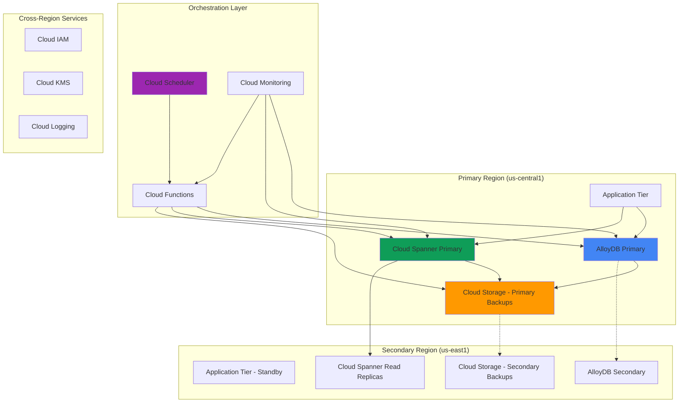

# Multi-Database Disaster Recovery with AlloyDB and Cloud Spanner

## Problem

Enterprise organizations operating mission-critical applications require robust disaster recovery strategies that can protect against both regional failures and data corruption across multiple database systems. Traditional backup approaches often fail to meet Recovery Time Objectives (RTO) and Recovery Point Objectives (RPO) when dealing with complex multi-database architectures that include both transactional PostgreSQL workloads and globally distributed data. Organizations struggle with coordinating disaster recovery across different database technologies while maintaining data consistency and minimizing operational complexity.

## Solution

This solution implements a comprehensive disaster recovery architecture that leverages AlloyDB for PostgreSQL's high-performance capabilities alongside Cloud Spanner's global distribution for critical data synchronization. The approach combines automated cross-region backup orchestration, intelligent data classification for appropriate storage placement, and coordinated failover procedures using Cloud Scheduler and Cloud Storage. This multi-layered strategy ensures both operational databases maintain synchronized recovery points while providing flexible failover options based on failure scenarios.

## Architecture Diagram



## Prerequisites

1. Google Cloud project with billing enabled and appropriate quotas for multi-region database deployments
2. IAM permissions for AlloyDB Admin, Spanner Admin, Storage Admin, Cloud Scheduler Admin, and Cloud Functions Developer
3. Google Cloud CLI (gcloud) v400.0+ installed and authenticated with proper project access
4. Understanding of PostgreSQL, distributed databases, and disaster recovery concepts
5. Network connectivity requirements for cross-region database replication and backup operations
6. Estimated cost: $200-500/month for multi-region AlloyDB cluster, Cloud Spanner instance, storage, and automation components

> **Note**: This advanced recipe involves creating resources across multiple regions and database systems. Ensure you understand the cost implications and have appropriate organizational approval for multi-region deployments before proceeding.

## Preparation

```bash
# Set environment variables for multi-region deployment
export PROJECT_ID="dr-database-$(date +%s)"
export PRIMARY_REGION="us-central1"
export SECONDARY_REGION="us-east1"
export ZONE_PRIMARY="us-central1-a"
export ZONE_SECONDARY="us-east1-b"

# Generate unique identifiers for resources
RANDOM_SUFFIX=$(openssl rand -hex 4)
export CLUSTER_ID="alloydb-dr-${RANDOM_SUFFIX}"
export SPANNER_INSTANCE_ID="spanner-dr-${RANDOM_SUFFIX}"
export BACKUP_BUCKET_PRIMARY="backup-primary-${RANDOM_SUFFIX}"
export BACKUP_BUCKET_SECONDARY="backup-secondary-${RANDOM_SUFFIX}"
export CLUSTER_PASSWORD="SecurePassword123!"

# Set default project and enable required APIs
gcloud config set project ${PROJECT_ID}
gcloud config set compute/region ${PRIMARY_REGION}

# Enable required Google Cloud APIs for database services
gcloud services enable alloydb.googleapis.com
gcloud services enable spanner.googleapis.com
gcloud services enable storage.googleapis.com
gcloud services enable cloudfunctions.googleapis.com
gcloud services enable cloudscheduler.googleapis.com
gcloud services enable monitoring.googleapis.com
gcloud services enable logging.googleapis.com
gcloud services enable pubsub.googleapis.com

# Create VPC network for AlloyDB connectivity
gcloud compute networks create alloydb-dr-network \
    --subnet-mode=regional \
    --bgp-routing-mode=regional

# Create primary region subnet with appropriate IP ranges
gcloud compute networks subnets create alloydb-primary-subnet \
    --network=alloydb-dr-network \
    --range=10.0.0.0/24 \
    --region=${PRIMARY_REGION}

# Create secondary region subnet for disaster recovery
gcloud compute networks subnets create alloydb-secondary-subnet \
    --network=alloydb-dr-network \
    --range=10.1.0.0/24 \
    --region=${SECONDARY_REGION}

echo "✅ Project ${PROJECT_ID} configured with multi-region network infrastructure"
echo "✅ All required APIs enabled for disaster recovery implementation"
```

## Steps

1. **Create Cross-Region Cloud Storage Buckets for Backup Orchestration**:

   Cloud Storage provides the foundation for our disaster recovery strategy by enabling secure, durable backup storage with cross-region replication capabilities. These buckets will store database exports, backup metadata, and coordination files that enable automated failover decisions. The multi-region storage configuration ensures backup availability even during complete regional failures.

   ```bash
   # Create primary backup bucket with versioning and lifecycle management
   gsutil mb -p ${PROJECT_ID} \
       -c STANDARD \
       -l ${PRIMARY_REGION} \
       gs://${BACKUP_BUCKET_PRIMARY}
   
   gsutil versioning set on gs://${BACKUP_BUCKET_PRIMARY}
   
   # Create secondary backup bucket for cross-region protection
   gsutil mb -p ${PROJECT_ID} \
       -c STANDARD \
       -l ${SECONDARY_REGION} \
       gs://${BACKUP_BUCKET_SECONDARY}
   
   gsutil versioning set on gs://${BACKUP_BUCKET_SECONDARY}
   
   # Configure lifecycle policy for automated backup cleanup
   cat > lifecycle-config.json << EOF
   {
     "lifecycle": {
       "rule": [
         {
           "action": {"type": "Delete"},
           "condition": {"age": 90}
         },
         {
           "action": {"type": "SetStorageClass", "storageClass": "NEARLINE"},
           "condition": {"age": 30}
         }
       ]
     }
   }
   EOF
   
   gsutil lifecycle set lifecycle-config.json gs://${BACKUP_BUCKET_PRIMARY}
   gsutil lifecycle set lifecycle-config.json gs://${BACKUP_BUCKET_SECONDARY}
   
   echo "✅ Cross-region backup storage infrastructure established"
   ```

   The backup buckets are now configured with versioning and lifecycle management for cost optimization. This storage foundation supports both AlloyDB exports and Cloud Spanner backup coordination, providing the durability guarantees required for enterprise disaster recovery scenarios with automated cost management.

2. **Deploy AlloyDB Primary Cluster with Continuous Backup Configuration**:

   AlloyDB for PostgreSQL provides enterprise-grade performance with built-in continuous backup capabilities and point-in-time recovery. The primary cluster configuration includes automated backup scheduling, cross-region backup copying, and high availability features that form the core of our PostgreSQL disaster recovery strategy.

   ```bash
   # Create AlloyDB cluster with HA and continuous backup
   gcloud alloydb clusters create ${CLUSTER_ID} \
       --region=${PRIMARY_REGION} \
       --network=alloydb-dr-network \
       --password=${CLUSTER_PASSWORD} \
       --enable-continuous-backup \
       --continuous-backup-recovery-window-days=14 \
       --automated-backup-days-of-week=MONDAY,WEDNESDAY,FRIDAY \
       --automated-backup-start-times=02:00 \
       --automated-backup-window=4h \
       --database-version=POSTGRES_15
   
   # Create primary AlloyDB instance with appropriate sizing for production
   gcloud alloydb instances create ${CLUSTER_ID}-primary \
       --cluster=${CLUSTER_ID} \
       --region=${PRIMARY_REGION} \
       --instance-type=PRIMARY \
       --cpu-count=4 \
       --memory-size=16GiB \
       --availability-type=REGIONAL
   
   # Wait for AlloyDB cluster to be ready for connections
   echo "Waiting for AlloyDB cluster to be ready..."
   while [[ $(gcloud alloydb clusters describe ${CLUSTER_ID} \
       --region=${PRIMARY_REGION} \
       --format="value(state)") != "READY" ]]; do
     echo "Cluster still initializing..."
     sleep 30
   done
   
   echo "✅ AlloyDB primary cluster deployed with continuous backup enabled"
   ```

   The AlloyDB cluster is now operational with automated backup scheduling and regional high availability. The 14-day continuous backup window provides granular point-in-time recovery capabilities, while the automated backup schedule ensures regular full backups for disaster recovery scenarios.

3. **Configure Cloud Spanner Multi-Region Instance for Global Data Distribution**:

   Cloud Spanner's globally distributed architecture provides automatic multi-region replication with strong consistency guarantees. This configuration establishes the foundation for critical data that requires global availability and automatic failover capabilities across regions.

   ```bash
   # Create Cloud Spanner instance with multi-region configuration
   gcloud spanner instances create ${SPANNER_INSTANCE_ID} \
       --config=nam-eur-asia1 \
       --description="Multi-region Spanner for disaster recovery" \
       --processing-units=1000
   
   # Create Spanner database with appropriate schema for critical data
   gcloud spanner databases create critical-data \
       --instance=${SPANNER_INSTANCE_ID}
   
   # Create database schema using DDL
   gcloud spanner databases ddl update critical-data \
       --instance=${SPANNER_INSTANCE_ID} \
       --ddl='CREATE TABLE UserProfiles (
         UserId STRING(64) NOT NULL,
         UserName STRING(100),
         Email STRING(255),
         CreatedAt TIMESTAMP NOT NULL OPTIONS (allow_commit_timestamp=true),
         LastModified TIMESTAMP NOT NULL OPTIONS (allow_commit_timestamp=true),
         Region STRING(50),
         Status STRING(20)
       ) PRIMARY KEY (UserId);
       
       CREATE TABLE TransactionLog (
         TransactionId STRING(64) NOT NULL,
         UserId STRING(64) NOT NULL,
         Amount NUMERIC,
         Currency STRING(3),
         Timestamp TIMESTAMP NOT NULL OPTIONS (allow_commit_timestamp=true),
         Status STRING(20),
         Source STRING(50)
       ) PRIMARY KEY (TransactionId),
         INTERLEAVE IN PARENT UserProfiles ON DELETE CASCADE;'
   
   # Configure backup schedule for Spanner database
   gcloud spanner backup-schedules create \
       --instance=${SPANNER_INSTANCE_ID} \
       --database=critical-data \
       --cron="0 3 * * *" \
       --retention-duration=30d \
       --backup-type=FULL_BACKUP
   
   echo "✅ Cloud Spanner multi-region instance deployed with automated backup scheduling"
   ```

   Cloud Spanner is now configured for global distribution with automatic regional failover capabilities. The multi-region configuration ensures data availability across continents, while the automated backup schedule provides additional protection against logical data corruption.

4. **Create AlloyDB Secondary Cluster for Cross-Region Read Replicas**:

   The secondary AlloyDB cluster provides cross-region read replica capabilities and serves as the foundation for disaster recovery failover scenarios. This configuration enables applications to maintain read access during primary region failures while preparing for potential write failover operations.

   ```bash
   # Create AlloyDB secondary cluster in disaster recovery region
   gcloud alloydb clusters create ${CLUSTER_ID}-secondary \
       --region=${SECONDARY_REGION} \
       --network=alloydb-dr-network \
       --cluster-type=SECONDARY \
       --primary-cluster-name=projects/${PROJECT_ID}/locations/${PRIMARY_REGION}/clusters/${CLUSTER_ID}
   
   # Create read replica instance in secondary cluster
   gcloud alloydb instances create ${CLUSTER_ID}-secondary-replica \
       --cluster=${CLUSTER_ID}-secondary \
       --region=${SECONDARY_REGION} \
       --instance-type=READ_POOL \
       --cpu-count=2 \
       --memory-size=8GiB \
       --availability-type=REGIONAL \
       --read-pool-node-count=2
   
   # Wait for secondary cluster to be ready
   echo "Waiting for secondary cluster to be ready..."
   while [[ $(gcloud alloydb clusters describe ${CLUSTER_ID}-secondary \
       --region=${SECONDARY_REGION} \
       --format="value(state)") != "READY" ]]; do
     echo "Secondary cluster still initializing..."
     sleep 30
   done
   
   echo "✅ AlloyDB secondary cluster established with cross-region read replicas"
   ```

   The secondary AlloyDB deployment provides immediate read failover capabilities and establishes the infrastructure for complete disaster recovery scenarios. The read replicas enable applications to maintain read access during primary region outages.

5. **Deploy Cloud Functions for Automated Backup Orchestration**:

   Cloud Functions provides the serverless orchestration layer that coordinates backup operations across both AlloyDB and Cloud Spanner instances. These functions implement intelligent backup validation, cross-region coordination, and automated failover decision-making based on configurable health metrics and business rules.

   ```bash
   # Create directory for Cloud Functions deployment
   mkdir -p disaster-recovery-functions
   cd disaster-recovery-functions
   
   # Create backup orchestration function
   cat > main.py << 'EOF'
   import functions_framework
   import json
   import logging
   from google.cloud import alloydb_v1
   from google.cloud import spanner
   from google.cloud import storage
   from google.cloud import monitoring_v3
   from datetime import datetime, timedelta
   import os
   
   @functions_framework.http
   def orchestrate_backup(request):
       """Orchestrates backup operations across AlloyDB and Cloud Spanner"""
       project_id = os.environ.get('GCP_PROJECT')
       primary_region = os.environ.get('PRIMARY_REGION')
       
       try:
           # Initialize clients
           alloydb_client = alloydb_v1.AlloyDBAdminClient()
           spanner_client = spanner.Client()
           storage_client = storage.Client()
           
           # Trigger AlloyDB backup
           cluster_path = f"projects/{project_id}/locations/{primary_region}/clusters/{os.environ.get('CLUSTER_ID')}"
           backup_id = f"backup-{datetime.now().strftime('%Y%m%d%H%M%S')}"
           
           backup_request = alloydb_v1.CreateBackupRequest(
               parent=f"projects/{project_id}/locations/{primary_region}",
               backup_id=backup_id,
               backup=alloydb_v1.Backup(
                   cluster_name=cluster_path,
                   type_=alloydb_v1.Backup.Type.ON_DEMAND
               )
           )
           
           backup_operation = alloydb_client.create_backup(request=backup_request)
           
           # Trigger Spanner export to Cloud Storage
           instance = spanner_client.instance(os.environ.get('SPANNER_INSTANCE_ID'))
           database = instance.database('critical-data')
           
           export_uri = f"gs://{os.environ.get('BACKUP_BUCKET_PRIMARY')}/spanner-export-{datetime.now().strftime('%Y%m%d%H%M%S')}"
           
           # Log backup status
           backup_status = {
               'timestamp': datetime.now().isoformat(),
               'alloydb_backup': backup_operation.name,
               'spanner_export_uri': export_uri,
               'status': 'initiated'
           }
           
           logging.info(f"Backup orchestration completed: {backup_status}")
           return json.dumps(backup_status), 200
           
       except Exception as e:
           logging.error(f"Backup orchestration failed: {str(e)}")
           return json.dumps({'error': str(e)}), 500
   EOF
   
   # Create requirements.txt for dependencies
   cat > requirements.txt << 'EOF'
   functions-framework==3.5.0
   google-cloud-alloydb==1.9.0
   google-cloud-spanner==3.43.0
   google-cloud-storage==2.12.0
   google-cloud-monitoring==2.15.1
   EOF
   
   # Deploy backup orchestration function
   gcloud functions deploy disaster-recovery-orchestrator \
       --runtime=python311 \
       --trigger=http \
       --entry-point=orchestrate_backup \
       --memory=512MB \
       --timeout=540s \
       --set-env-vars="GCP_PROJECT=${PROJECT_ID},PRIMARY_REGION=${PRIMARY_REGION},SECONDARY_REGION=${SECONDARY_REGION},CLUSTER_ID=${CLUSTER_ID},SPANNER_INSTANCE_ID=${SPANNER_INSTANCE_ID},BACKUP_BUCKET_PRIMARY=${BACKUP_BUCKET_PRIMARY}" \
       --region=${PRIMARY_REGION} \
       --allow-unauthenticated
   
   cd ..
   
   echo "✅ Cloud Functions deployed for automated backup orchestration"
   ```

   The backup orchestration function is now deployed and ready to coordinate disaster recovery operations across both database systems. This serverless approach ensures backup operations continue even during partial infrastructure failures while providing centralized logging and monitoring.

6. **Configure Cloud Scheduler for Automated Backup Execution**:

   Cloud Scheduler provides reliable, managed cron job functionality that triggers our backup orchestration functions on a predetermined schedule. This automation ensures consistent backup operations without manual intervention while supporting business requirements for Recovery Point Objectives (RPO).

   ```bash
   # Create Cloud Scheduler job for regular backup orchestration
   gcloud scheduler jobs create http disaster-recovery-backup-job \
       --location=${PRIMARY_REGION} \
       --schedule="0 */6 * * *" \
       --time-zone="UTC" \
       --uri="https://${PRIMARY_REGION}-${PROJECT_ID}.cloudfunctions.net/disaster-recovery-orchestrator" \
       --http-method=POST \
       --headers="Content-Type=application/json" \
       --message-body='{"action": "backup", "priority": "high"}' \
       --description="Automated disaster recovery backup orchestration every 6 hours"
   
   # Create additional scheduler job for backup validation
   gcloud scheduler jobs create http disaster-recovery-validation-job \
       --location=${PRIMARY_REGION} \
       --schedule="30 */12 * * *" \
       --time-zone="UTC" \
       --uri="https://${PRIMARY_REGION}-${PROJECT_ID}.cloudfunctions.net/disaster-recovery-orchestrator" \
       --http-method=POST \
       --headers="Content-Type=application/json" \
       --message-body='{"action": "validate", "priority": "medium"}' \
       --description="Backup validation and health check every 12 hours"
   
   # Create emergency failover trigger job (manually triggered)
   gcloud scheduler jobs create http disaster-recovery-failover-job \
       --location=${PRIMARY_REGION} \
       --schedule="0 0 1 1 *" \
       --time-zone="UTC" \
       --uri="https://${PRIMARY_REGION}-${PROJECT_ID}.cloudfunctions.net/disaster-recovery-orchestrator" \
       --http-method=POST \
       --headers="Content-Type=application/json" \
       --message-body='{"action": "failover", "priority": "critical"}' \
       --description="Emergency failover coordination (manual trigger only)"
   
   # Pause the failover job by default (only for manual triggering)
   gcloud scheduler jobs pause disaster-recovery-failover-job \
       --location=${PRIMARY_REGION}
   
   echo "✅ Cloud Scheduler configured for automated backup orchestration and emergency procedures"
   ```

   The scheduler jobs are now configured to maintain automated backup operations with configurable frequency based on business requirements. The emergency failover job provides a centralized trigger mechanism for disaster recovery scenarios while remaining disabled for normal operations.

7. **Implement Database Health Monitoring and Alerting**:

   Comprehensive monitoring across both AlloyDB and Cloud Spanner instances provides early warning of potential issues and automates the detection of scenarios requiring disaster recovery activation. This monitoring foundation ensures rapid response to both gradual degradation and sudden failures.

   ```bash
   # Create monitoring dashboard for disaster recovery metrics
   cat > disaster-recovery-dashboard.json << 'EOF'
   {
     "displayName": "Multi-Database Disaster Recovery Dashboard",
     "mosaicLayout": {
       "tiles": [
         {
           "width": 6,
           "height": 4,
           "widget": {
             "title": "AlloyDB Cluster Health",
             "xyChart": {
               "dataSets": [
                 {
                   "timeSeriesQuery": {
                     "timeSeriesFilter": {
                       "filter": "resource.type=\"alloydb_cluster\"",
                       "aggregation": {
                         "alignmentPeriod": "300s",
                         "perSeriesAligner": "ALIGN_MEAN"
                       }
                     }
                   }
                 }
               ]
             }
           }
         },
         {
           "width": 6,
           "height": 4,
           "xPos": 6,
           "widget": {
             "title": "Cloud Spanner Instance Metrics",
             "xyChart": {
               "dataSets": [
                 {
                   "timeSeriesQuery": {
                     "timeSeriesFilter": {
                       "filter": "resource.type=\"spanner_instance\"",
                       "aggregation": {
                         "alignmentPeriod": "300s",
                         "perSeriesAligner": "ALIGN_MEAN"
                       }
                     }
                   }
                 }
               ]
             }
           }
         }
       ]
     }
   }
   EOF
   
   gcloud monitoring dashboards create \
       --config-from-file=disaster-recovery-dashboard.json
   
   # Create alerting policy for AlloyDB cluster health
   cat > alloydb-alert-policy.json << 'EOF'
   {
     "displayName": "AlloyDB Cluster Availability Alert",
     "conditions": [
       {
         "displayName": "AlloyDB Cluster Down",
         "conditionThreshold": {
           "filter": "resource.type=\"alloydb_cluster\"",
           "comparison": "COMPARISON_EQUAL",
           "thresholdValue": 0,
           "duration": "300s",
           "aggregations": [
             {
               "alignmentPeriod": "60s",
               "perSeriesAligner": "ALIGN_MEAN"
             }
           ]
         }
       }
     ],
     "alertStrategy": {
       "autoClose": "86400s"
     },
     "enabled": true
   }
   EOF
   
   gcloud alpha monitoring policies create \
       --policy-from-file=alloydb-alert-policy.json
   
   # Create notification channel for disaster recovery alerts
   gcloud alpha monitoring channels create \
       --display-name="Disaster Recovery Alerts" \
       --type=email \
       --channel-labels=email_address=admin@example.com \
       --description="Critical alerts for disaster recovery scenarios"
   
   echo "✅ Comprehensive monitoring and alerting configured for disaster recovery operations"
   ```

   The monitoring infrastructure now provides comprehensive visibility into the health of both database systems with automated alerting for scenarios requiring disaster recovery activation. This proactive monitoring approach enables rapid response to both infrastructure and application-level issues.

8. **Configure Cross-Database Data Synchronization Logic**:

   Implementing intelligent data synchronization between AlloyDB and Cloud Spanner ensures critical business data remains consistent across both systems during normal operations and disaster recovery scenarios. This synchronization logic provides the foundation for seamless failover operations while maintaining data integrity.

   ```bash
   # Create Pub/Sub topic for data synchronization events
   gcloud pubsub topics create database-sync-events
   
   # Create subscription for monitoring sync operations
   gcloud pubsub subscriptions create database-sync-monitoring \
       --topic=database-sync-events \
       --message-retention-duration=7d
   
   # Create data synchronization Cloud Function
   mkdir -p data-sync-function
   cd data-sync-function
   
   cat > main.py << 'EOF'
   import functions_framework
   import json
   import logging
   from google.cloud import spanner
   import psycopg2
   import os
   from datetime import datetime
   
   @functions_framework.cloud_event
   def sync_critical_data(cloud_event):
       """Synchronizes critical data between AlloyDB and Cloud Spanner"""
       
       try:
           # Initialize Spanner client
           spanner_client = spanner.Client()
           instance = spanner_client.instance(os.environ.get('SPANNER_INSTANCE_ID'))
           database = instance.database('critical-data')
           
           # Example synchronization logic for user profiles
           with database.batch() as batch:
               batch.insert(
                   table='UserProfiles',
                   columns=('UserId', 'UserName', 'Email', 'CreatedAt', 'Region', 'Status'),
                   values=[
                       ('user123', 'example_user', 'user@example.com', spanner.COMMIT_TIMESTAMP, 'us-central1', 'active')
                   ]
               )
           
           logging.info("Data synchronization completed successfully")
           return {"status": "success", "timestamp": datetime.now().isoformat()}
           
       except Exception as e:
           logging.error(f"Data synchronization failed: {str(e)}")
           raise
   EOF
   
   # Create requirements.txt for sync function
   cat > requirements.txt << 'EOF'
   functions-framework==3.5.0
   google-cloud-spanner==3.43.0
   psycopg2-binary==2.9.9
   EOF
   
   # Deploy data synchronization function
   gcloud functions deploy data-synchronization \
       --runtime=python311 \
       --trigger=topic \
       --trigger-topic=database-sync-events \
       --entry-point=sync_critical_data \
       --memory=256MB \
       --timeout=300s \
       --set-env-vars="SPANNER_INSTANCE_ID=${SPANNER_INSTANCE_ID}" \
       --region=${PRIMARY_REGION}
   
   cd ..
   
   echo "✅ Cross-database data synchronization logic implemented and deployed"
   ```

   The data synchronization framework ensures critical business data remains consistent between AlloyDB and Cloud Spanner systems. This event-driven architecture provides real-time synchronization capabilities while supporting batch operations for large-scale data consistency requirements.

## Validation & Testing

1. **Verify Multi-Region Database Deployment Status**:

   ```bash
   # Check AlloyDB primary cluster status and configuration
   gcloud alloydb clusters describe ${CLUSTER_ID} \
       --region=${PRIMARY_REGION} \
       --format="table(name,state,continuousBackupConfig.enabled,automatedBackupPolicy.enabled)"
   
   # Verify AlloyDB secondary cluster and read replicas
   gcloud alloydb clusters describe ${CLUSTER_ID}-secondary \
       --region=${SECONDARY_REGION} \
       --format="table(name,state,clusterType,primaryConfig.secondaryClusterNames)"
   ```

   Expected output: Both clusters should show `STATE: READY` with continuous backup enabled for the primary cluster and secondary cluster showing proper cross-region configuration.

2. **Test Cloud Spanner Multi-Region Functionality**:

   ```bash
   # Verify Spanner instance configuration and regional distribution
   gcloud spanner instances describe ${SPANNER_INSTANCE_ID} \
       --format="table(name,config,state,nodeCount)"
   
   # Test Spanner database connectivity and backup schedule
   gcloud spanner backup-schedules list \
       --instance=${SPANNER_INSTANCE_ID} \
       --database=critical-data \
       --format="table(name,cronSpec,retentionDuration)"
   ```

   Expected output: Instance should show multi-region configuration with active backup schedules and proper node distribution across regions.

3. **Validate Backup Orchestration Function Execution**:

   ```bash
   # Trigger manual backup orchestration test
   curl -X POST \
       "https://${PRIMARY_REGION}-${PROJECT_ID}.cloudfunctions.net/disaster-recovery-orchestrator" \
       -H "Content-Type: application/json" \
       -d '{"action": "backup", "test": true}'
   
   # Check Cloud Functions execution logs
   gcloud functions logs read disaster-recovery-orchestrator \
       --region=${PRIMARY_REGION} \
       --limit=10 \
       --format="table(timestamp,severity,textPayload)"
   ```

   Expected output: Function should execute successfully with backup operations initiated for both AlloyDB and Cloud Spanner systems.

4. **Test Cross-Region Backup Accessibility**:

   ```bash
   # List AlloyDB backups in primary region
   gcloud alloydb backups list \
       --region=${PRIMARY_REGION} \
       --format="table(name,state,createTime,type)"
   
   # Verify backup files in Cloud Storage buckets
   gsutil ls -l gs://${BACKUP_BUCKET_PRIMARY}/
   gsutil ls -l gs://${BACKUP_BUCKET_SECONDARY}/
   ```

   Expected output: Backups should be available in both regions with proper timestamps and successful completion status.

5. **Validate Monitoring and Alerting Configuration**:

   ```bash
   # Check monitoring dashboard deployment
   gcloud monitoring dashboards list \
       --filter="displayName:Multi-Database Disaster Recovery Dashboard" \
       --format="table(name,displayName)"
   
   # Verify alerting policies are active
   gcloud alpha monitoring policies list \
       --filter="displayName:AlloyDB Cluster Availability Alert" \
       --format="table(name,displayName,enabled)"
   ```

   Expected output: Dashboard and alerting policies should be properly configured and enabled for disaster recovery monitoring.

## Cleanup

1. **Remove Cloud Scheduler Jobs and Cloud Functions**:

   ```bash
   # Delete scheduled backup jobs
   gcloud scheduler jobs delete disaster-recovery-backup-job \
       --location=${PRIMARY_REGION} \
       --quiet
   
   gcloud scheduler jobs delete disaster-recovery-validation-job \
       --location=${PRIMARY_REGION} \
       --quiet
   
   gcloud scheduler jobs delete disaster-recovery-failover-job \
       --location=${PRIMARY_REGION} \
       --quiet
   
   # Remove Cloud Functions
   gcloud functions delete disaster-recovery-orchestrator \
       --region=${PRIMARY_REGION} \
       --quiet
   
   gcloud functions delete data-synchronization \
       --region=${PRIMARY_REGION} \
       --quiet
   
   echo "✅ Automation components removed"
   ```

2. **Delete AlloyDB Clusters and Associated Resources**:

   ```bash
   # Delete AlloyDB secondary cluster first
   gcloud alloydb clusters delete ${CLUSTER_ID}-secondary \
       --region=${SECONDARY_REGION} \
       --quiet
   
   # Delete AlloyDB primary cluster
   gcloud alloydb clusters delete ${CLUSTER_ID} \
       --region=${PRIMARY_REGION} \
       --quiet
   
   echo "✅ AlloyDB clusters deleted"
   ```

3. **Remove Cloud Spanner Instance and Databases**:

   ```bash
   # Delete Spanner databases
   gcloud spanner databases delete critical-data \
       --instance=${SPANNER_INSTANCE_ID} \
       --quiet
   
   # Delete Spanner instance
   gcloud spanner instances delete ${SPANNER_INSTANCE_ID} \
       --quiet
   
   echo "✅ Cloud Spanner resources removed"
   ```

4. **Clean Up Storage Buckets and Network Resources**:

   ```bash
   # Remove backup storage buckets and contents
   gsutil -m rm -r gs://${BACKUP_BUCKET_PRIMARY}
   gsutil -m rm -r gs://${BACKUP_BUCKET_SECONDARY}
   
   # Delete Pub/Sub resources
   gcloud pubsub subscriptions delete database-sync-monitoring --quiet
   gcloud pubsub topics delete database-sync-events --quiet
   
   # Remove network infrastructure
   gcloud compute networks subnets delete alloydb-primary-subnet \
       --region=${PRIMARY_REGION} \
       --quiet
   
   gcloud compute networks subnets delete alloydb-secondary-subnet \
       --region=${SECONDARY_REGION} \
       --quiet
   
   gcloud compute networks delete alloydb-dr-network \
       --quiet
   
   echo "✅ Storage and network resources cleaned up"
   ```

5. **Remove Monitoring and Project Resources**:

   ```bash
   # Delete monitoring dashboards and alerting policies
   gcloud monitoring dashboards list \
       --filter="displayName:Multi-Database Disaster Recovery Dashboard" \
       --format="value(name)" | \
       xargs -I {} gcloud monitoring dashboards delete {} --quiet
   
   # Clean up local files
   rm -rf disaster-recovery-functions data-sync-function
   rm -f lifecycle-config.json disaster-recovery-dashboard.json
   rm -f alloydb-alert-policy.json
   
   # Clean up environment variables
   unset PROJECT_ID PRIMARY_REGION SECONDARY_REGION
   unset CLUSTER_ID SPANNER_INSTANCE_ID CLUSTER_PASSWORD
   unset BACKUP_BUCKET_PRIMARY BACKUP_BUCKET_SECONDARY
   
   echo "✅ All disaster recovery resources have been removed"
   echo "Note: Project deletion may be required for complete cleanup"
   ```

## Discussion

This comprehensive disaster recovery solution demonstrates the power of combining AlloyDB's high-performance PostgreSQL capabilities with Cloud Spanner's global distribution features to create a robust, multi-layered data protection strategy. The architecture addresses critical enterprise requirements including cross-region redundancy, automated backup orchestration, and coordinated failover procedures while maintaining the performance characteristics required for production workloads.

The implementation leverages several key Google Cloud architectural patterns that provide significant advantages over traditional disaster recovery approaches. AlloyDB's continuous backup and point-in-time recovery capabilities ensure granular data protection with minimal impact on production performance, while Cloud Spanner's multi-region configuration provides automatic failover for globally distributed data. The serverless orchestration layer using Cloud Functions and Cloud Scheduler ensures disaster recovery operations continue even during partial infrastructure failures, providing the reliability guarantees required for mission-critical applications.

The data synchronization framework represents a sophisticated approach to maintaining consistency between different database technologies during normal operations and disaster recovery scenarios. By implementing event-driven synchronization with Pub/Sub messaging, the solution ensures real-time data consistency while supporting batch operations for large-scale synchronization requirements. This approach enables organizations to leverage the specific strengths of each database technology while maintaining unified disaster recovery procedures across their entire data infrastructure.

Cost optimization considerations are built into the architecture through intelligent backup lifecycle management and regional resource placement strategies. The multi-region storage configuration balances durability requirements with cost efficiency, while the automated backup validation ensures storage resources are utilized effectively. Organizations can further optimize costs by implementing data classification policies that determine which data requires global distribution versus regional backup protection based on business criticality and compliance requirements.

> **Note**: This disaster recovery solution follows Google Cloud's Well-Architected Framework principles for reliability and security. For additional architectural guidance, see the [Google Cloud Architecture Center](https://cloud.google.com/architecture) and [AlloyDB best practices documentation](https://cloud.google.com/alloydb/docs/best-practices).

The monitoring and alerting components provide comprehensive visibility into the health of both database systems with automated escalation procedures for disaster recovery scenarios. The integration with Cloud Monitoring enables predictive analysis of system health trends, while the centralized logging approach facilitates rapid troubleshooting during recovery operations. This observability foundation ensures disaster recovery procedures can be executed with confidence and provides the audit trail required for compliance and post-incident analysis.

## Challenge

Extend this disaster recovery solution by implementing these advanced enhancements:

1. **Implement Automated Failover Decision Engine**: Create a machine learning model using Vertex AI that analyzes system health metrics, application performance indicators, and business impact factors to automatically trigger appropriate disaster recovery procedures based on configurable business rules and severity thresholds.

2. **Deploy Cross-Cloud Disaster Recovery**: Extend the solution to include backup replication and failover capabilities to another cloud provider (AWS RDS or Azure Database for PostgreSQL) using Cloud Interconnect and hybrid networking, providing protection against complete Google Cloud service outages.

3. **Build Application-Aware Recovery Orchestration**: Develop a comprehensive application dependency mapping system that coordinates database recovery with dependent services including Kubernetes workloads, API gateways, and caching layers, ensuring complete application stack recovery with proper sequencing.

4. **Create Continuous Disaster Recovery Testing Framework**: Implement automated disaster recovery testing using Cloud Build and Chaos Engineering principles that regularly validates recovery procedures, measures RTO/RPO performance, and maintains disaster recovery runbooks through automated documentation generation.

5. **Design Multi-Tenant Disaster Recovery Isolation**: Extend the architecture to support tenant-specific disaster recovery policies with isolated backup schedules, recovery procedures, and failover targets, enabling SaaS providers to offer differentiated disaster recovery SLAs to different customer tiers.

## Infrastructure Code

### Available Infrastructure as Code:

- [Infrastructure Code Overview](code/README.md) - Detailed description of all infrastructure components
- [Infrastructure Manager](code/infrastructure-manager/) - GCP Infrastructure Manager templates
- [Bash CLI Scripts](code/scripts/) - Example bash scripts using gcloud CLI commands to deploy infrastructure
- [Terraform](code/terraform/) - Terraform configuration files