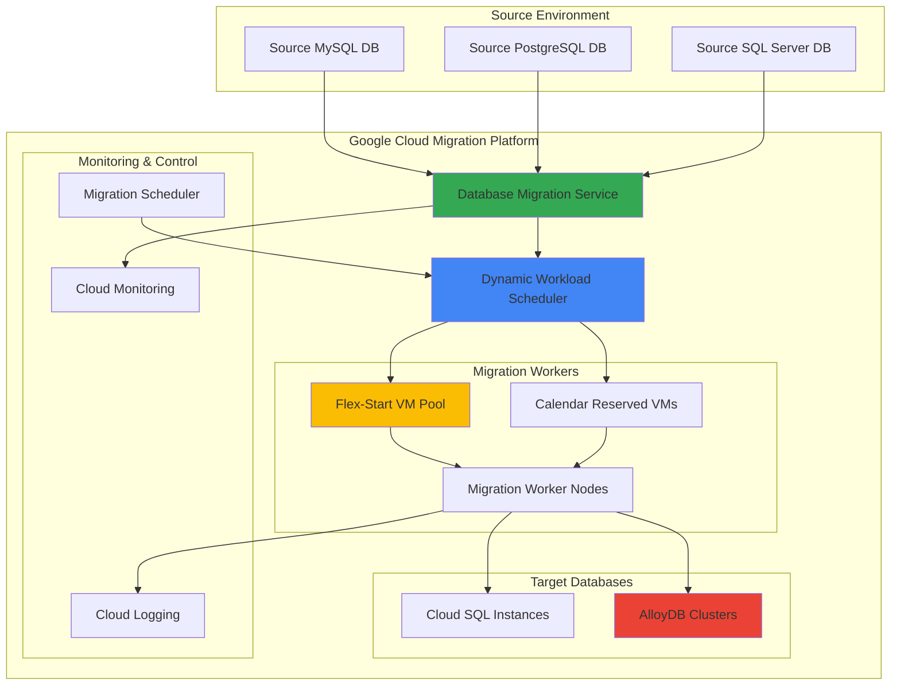

# Multi-Database Migration Workflows with Database Migration Service and Dynamic Workload Scheduler

## Problem

Enterprise organizations managing large-scale database migrations face significant challenges with compute cost optimization and resource scheduling during multi-database transitions. Traditional migration approaches often require provisioning peak capacity resources continuously, leading to substantial cost inefficiencies when migrating dozens of databases with varying workload patterns. Without intelligent workload scheduling, migration jobs compete for resources, creating bottlenecks that extend migration timelines and increase operational complexity.

## Solution

Build an intelligent database migration orchestration system that leverages Google Cloud's Database Migration Service for continuous, minimal-downtime database transfers combined with Dynamic Workload Scheduler's flex-start provisioning model. This approach automatically optimizes compute costs by dynamically allocating resources based on migration workload demands while ensuring high-priority migrations receive guaranteed capacity through calendar mode scheduling.

## Architecture Diagram



## Prerequisites

1. Google Cloud Project with billing enabled and appropriate IAM permissions
2. gcloud CLI v2 installed and configured (or Google Cloud Shell)
3. Source databases accessible from Google Cloud (VPN, interconnect, or public internet)
4. Basic understanding of database migration concepts and Google Cloud networking
5. Estimated cost: $200-500 for 2-hour workshop (varies by database sizes and compute resources)

> **Note**: Dynamic Workload Scheduler and AlloyDB are available in specific regions. Verify [service availability](https://cloud.google.com/about/locations/) for your target regions before proceeding.

## Preparation

```bash
# Set environment variables for the migration platform
export PROJECT_ID="migration-workshop-$(date +%s)"
export REGION="us-central1"
export ZONE="us-central1-a"
export NETWORK_NAME="migration-network"

# Generate unique identifiers for resources
RANDOM_SUFFIX=$(openssl rand -hex 3)
export INSTANCE_TEMPLATE="migration-template-${RANDOM_SUFFIX}"
export CLOUD_SQL_INSTANCE="mysql-target-${RANDOM_SUFFIX}"
export ALLOYDB_CLUSTER="postgres-cluster-${RANDOM_SUFFIX}"

# Configure gcloud defaults
gcloud config set project ${PROJECT_ID}
gcloud config set compute/region ${REGION}
gcloud config set compute/zone ${ZONE}

# Enable required Google Cloud APIs for the migration platform
gcloud services enable compute.googleapis.com
gcloud services enable sqladmin.googleapis.com
gcloud services enable alloydb.googleapis.com
gcloud services enable datamigration.googleapis.com
gcloud services enable monitoring.googleapis.com
gcloud services enable logging.googleapis.com

# Create VPC network for secure migration traffic
gcloud compute networks create ${NETWORK_NAME} \
    --subnet-mode regional \
    --bgp-routing-mode regional

gcloud compute networks subnets create ${NETWORK_NAME}-subnet \
    --network ${NETWORK_NAME} \
    --range 10.0.0.0/24 \
    --region ${REGION}

echo "✅ Project configured: ${PROJECT_ID}"
echo "✅ Migration network created: ${NETWORK_NAME}"
```

## Steps

1. **Create Dynamic Workload Scheduler Configuration for Migration Workers**:

   Dynamic Workload Scheduler optimizes resource allocation for batch workloads by providing two modes: flex-start for cost optimization and calendar mode for guaranteed capacity. For database migrations, we leverage flex-start mode to reduce costs during low-priority transfers while using calendar mode for time-sensitive migrations that require guaranteed compute resources.

   ```bash
   # Create instance template for migration workers with optimal configurations
   gcloud compute instance-templates create ${INSTANCE_TEMPLATE} \
       --machine-type e2-standard-4 \
       --network-interface network=${NETWORK_NAME},subnet=${NETWORK_NAME}-subnet \
       --boot-disk-size 100GB \
       --boot-disk-type pd-ssd \
       --image-family debian-12 \
       --image-project debian-cloud \
       --scopes cloud-platform \
       --tags migration-worker \
       --metadata startup-script='#!/bin/bash
   apt-get update
   apt-get install -y mysql-client postgresql-client python3-pip
   pip3 install google-cloud-monitoring google-cloud-logging'
   
   # Create managed instance group for auto-scaling migration workers
   gcloud compute instance-groups managed create migration-workers \
       --template ${INSTANCE_TEMPLATE} \
       --size 0 \
       --region ${REGION}
   
   echo "✅ Migration worker template configured for Dynamic Workload Scheduler"
   ```

   The instance template establishes the foundation for migration workers that will be dynamically provisioned by the Dynamic Workload Scheduler. This configuration includes essential database client tools and monitoring capabilities, enabling the workers to handle various database migration tasks while providing observability into the migration process.

2. **Configure Cloud SQL Target Instance with High Availability**:

   Cloud SQL provides fully managed database services with built-in high availability, automated backups, and seamless scaling. For migration scenarios, configuring Cloud SQL with appropriate performance settings ensures optimal data transfer rates and provides enterprise-grade reliability for production workloads.

   ```bash
   # Create Cloud SQL MySQL instance as migration target
   gcloud sql instances create ${CLOUD_SQL_INSTANCE} \
       --database-version MYSQL_8_0 \
       --tier db-n1-standard-4 \
       --region ${REGION} \
       --network ${NETWORK_NAME} \
       --no-assign-ip \
       --storage-type SSD \
       --storage-size 100GB \
       --storage-auto-increase \
       --backup-start-time 03:00 \
       --enable-bin-log \
       --maintenance-window-day SUN \
       --maintenance-window-hour 04 \
       --deletion-protection
   
   # Create database user for migration service
   gcloud sql users create migration-user \
       --instance ${CLOUD_SQL_INSTANCE} \
       --password "SecureMigration123!"
   
   # Create target database for migration
   gcloud sql databases create sample_db \
       --instance ${CLOUD_SQL_INSTANCE}
   
   echo "✅ Cloud SQL target instance ready: ${CLOUD_SQL_INSTANCE}"
   ```

   The Cloud SQL instance is now configured with high availability, automated backups, and network security. This target database provides the scalability and reliability needed for production workloads while maintaining compatibility with Database Migration Service for continuous replication and minimal downtime cutover.

3. **Deploy AlloyDB Cluster for PostgreSQL Workloads**:

   AlloyDB for PostgreSQL combines Google's high-performance database engine with PostgreSQL compatibility, delivering up to 4x better performance than standard PostgreSQL. For enterprise migrations requiring advanced analytics capabilities and vector search functionality, AlloyDB provides the optimal target platform with built-in intelligence and scaling capabilities.

   ```bash
   # Create AlloyDB cluster for PostgreSQL migrations
   gcloud alloydb clusters create ${ALLOYDB_CLUSTER} \
       --region ${REGION} \
       --network ${NETWORK_NAME} \
       --database-version POSTGRES_15
   
   # Create primary AlloyDB instance with optimal configuration
   gcloud alloydb instances create ${ALLOYDB_CLUSTER}-primary \
       --cluster ${ALLOYDB_CLUSTER} \
       --region ${REGION} \
       --instance-type PRIMARY \
       --cpu-count 4 \
       --memory-size 16GB
   
   # Wait for AlloyDB cluster to become ready
   echo "Waiting for AlloyDB cluster to become ready..."
   while [[ $(gcloud alloydb clusters describe ${ALLOYDB_CLUSTER} \
       --region ${REGION} \
       --format "value(state)") != "READY" ]]; do
       echo "Cluster still initializing..."
       sleep 30
   done
   
   echo "✅ AlloyDB cluster deployed: ${ALLOYDB_CLUSTER}"
   ```

   The AlloyDB cluster provides enterprise-grade PostgreSQL compatibility with Google's performance enhancements and AI-ready vector capabilities. This target environment supports complex analytical workloads and provides seamless migration paths from various PostgreSQL sources while maintaining full ACID compliance and enterprise security features.

4. **Configure Database Migration Service Connection Profiles**:

   Database Migration Service streamlines database migrations by managing continuous replication, network connectivity, and schema conversion. Connection profiles define the source and destination database configurations, enabling secure and efficient data transfer while maintaining data consistency throughout the migration process.

   ```bash
   # Create source MySQL connection profile
   gcloud database-migration connection-profiles create mysql source-mysql \
       --region ${REGION} \
       --host 203.0.113.1 \
       --port 3306 \
       --username migration_user \
       --password SecureSourcePass123!
   
   # Create destination Cloud SQL connection profile
   gcloud database-migration connection-profiles create cloudsql dest-cloudsql \
       --region ${REGION} \
       --cloudsql-instance projects/${PROJECT_ID}/instances/${CLOUD_SQL_INSTANCE}
   
   # Create source PostgreSQL connection profile
   gcloud database-migration connection-profiles create postgresql source-postgres \
       --region ${REGION} \
       --host 203.0.113.2 \
       --port 5432 \
       --username migration_user \
       --password SecureSourcePass123!
   
   # Create destination AlloyDB connection profile
   gcloud database-migration connection-profiles create alloydb dest-alloydb \
       --region ${REGION} \
       --alloydb-cluster projects/${PROJECT_ID}/locations/${REGION}/clusters/${ALLOYDB_CLUSTER}
   
   echo "✅ Database Migration Service connection profiles configured"
   ```

   The connection profiles establish secure communication channels between source databases and Google Cloud targets. These profiles encapsulate authentication, network routing, and encryption settings, enabling Database Migration Service to perform continuous replication while maintaining security and compliance requirements.

5. **Create Flex-Start Migration Jobs with Dynamic Workload Scheduler**:

   Flex-start mode in Dynamic Workload Scheduler provides cost-optimized resource allocation for batch workloads that can tolerate flexible start times. For database migrations, this mode reduces compute costs by up to 60% while ensuring all required resources are allocated simultaneously when capacity becomes available.

   ```bash
   # Create flex-start capacity request for migration workloads
   gcloud compute future-reservations create migration-flex-capacity \
       --source-instance-template ${INSTANCE_TEMPLATE} \
       --total-count 4 \
       --planning-status PLANNING_STATUS_PLANNED \
       --zone ${ZONE}
   
   # Configure autoscaling for migration workers based on queue depth
   gcloud compute instance-groups managed set-autoscaling migration-workers \
       --region ${REGION} \
       --max-num-replicas 8 \
       --min-num-replicas 0 \
       --target-cpu-utilization 0.7 \
       --cool-down-period 300
   
   # Create migration job for MySQL to Cloud SQL
   gcloud database-migration migration-jobs create mysql-migration-job \
       --region ${REGION} \
       --source source-mysql \
       --destination dest-cloudsql \
       --type CONTINUOUS \
       --dump-path gs://${PROJECT_ID}-migration-bucket/mysql-dumps
   
   echo "✅ Flex-start migration configuration deployed"
   ```

   The flex-start configuration optimizes cost efficiency by allowing Google Cloud to schedule migration workloads when capacity is available at reduced rates. This approach maintains migration performance while significantly reducing compute costs for non-time-critical database transfers.

6. **Implement Migration Orchestration with Cloud Functions**:

   Cloud Functions provides serverless orchestration capabilities for managing complex migration workflows. By implementing migration logic in Cloud Functions, the system can automatically respond to migration events, optimize resource allocation, and coordinate multiple database transfers based on business priorities and resource availability.

   ```bash
   # Create Cloud Storage bucket for migration artifacts and logs
   gsutil mb -p ${PROJECT_ID} -c STANDARD -l ${REGION} \
       gs://${PROJECT_ID}-migration-bucket
   
   # Create Cloud Function for migration orchestration
   cat > migration_orchestrator.py << 'EOF'
import os
import json
from google.cloud import compute_v1
from google.cloud import monitoring_v3
from google.cloud import functions_v1

def orchestrate_migration(request):
    """Orchestrate database migration workflows with Dynamic Workload Scheduler"""
    
    # Parse migration request
    request_json = request.get_json()
    migration_priority = request_json.get('priority', 'low')
    database_size = request_json.get('size_gb', 100)
    
    # Calculate optimal worker count based on database size
    worker_count = min(max(database_size // 50, 1), 8)
    
    # Scale migration workers based on workload
    compute_client = compute_v1.InstanceGroupManagersClient()
    project_id = os.environ.get('PROJECT_ID')
    region = os.environ.get('REGION')
    
    operation = compute_client.resize(
        project=project_id,
        region=region,
        instance_group_manager='migration-workers',
        size=worker_count
    )
    
    return {
        'status': 'success',
        'worker_count': worker_count,
        'migration_mode': 'flex-start' if migration_priority == 'low' else 'calendar'
    }
EOF
   
   # Deploy Cloud Function for migration orchestration
   gcloud functions deploy migration-orchestrator \
       --runtime python39 \
       --trigger-http \
       --allow-unauthenticated \
       --source . \
       --entry-point orchestrate_migration \
       --set-env-vars PROJECT_ID=${PROJECT_ID},REGION=${REGION}
   
   echo "✅ Migration orchestration function deployed"
   ```

   The orchestration function intelligently manages migration resources by analyzing workload characteristics and automatically scaling worker capacity. This serverless approach ensures optimal resource utilization while providing the flexibility to handle varying migration demands and priorities.

7. **Configure Monitoring and Alerting for Migration Progress**:

   Cloud Monitoring and Cloud Logging provide comprehensive observability for database migration workflows. Implementing custom metrics and alerts ensures proactive monitoring of migration progress, resource utilization, and potential issues, enabling rapid response to migration anomalies and optimization opportunities.

   ```bash
   # Create custom migration metrics dashboard
   cat > migration_dashboard.json << 'EOF'
{
  "displayName": "Database Migration Dashboard",
  "mosaicLayout": {
    "tiles": [
      {
        "width": 6,
        "height": 4,
        "widget": {
          "title": "Migration Progress",
          "xyChart": {
            "dataSets": [
              {
                "timeSeriesQuery": {
                  "timeSeriesFilter": {
                    "filter": "resource.type=\"gce_instance\" AND metric.type=\"compute.googleapis.com/instance/cpu/utilization\"",
                    "aggregation": {
                      "alignmentPeriod": "60s",
                      "perSeriesAligner": "ALIGN_MEAN"
                    }
                  }
                }
              }
            ]
          }
        }
      }
    ]
  }
}
EOF
   
   # Create monitoring dashboard
   gcloud monitoring dashboards create --config-from-file migration_dashboard.json
   
   # Create alerting policy for migration failures
   gcloud alpha monitoring policies create \
       --policy-from-file <(cat << 'EOF'
displayName: "Migration Worker Failure Alert"
conditions:
  - displayName: "High error rate"
    conditionThreshold:
      filter: 'resource.type="gce_instance" AND resource.label.instance_name=~"migration-workers-.*"'
      comparison: COMPARISON_GREATER_THAN
      thresholdValue: 0.1
      duration: 300s
notificationChannels: []
enabled: true
EOF
)
   
   echo "✅ Migration monitoring and alerting configured"
   ```

   The monitoring configuration provides real-time visibility into migration performance, worker health, and cost optimization metrics. Custom dashboards and alerts enable proactive management of migration workflows while ensuring SLA compliance and optimal resource utilization.

8. **Execute Coordinated Multi-Database Migration**:

   The final step orchestrates the complete migration workflow by coordinating multiple database transfers, optimizing resource allocation, and managing migration priorities. This approach ensures efficient utilization of Dynamic Workload Scheduler capabilities while maintaining data consistency and minimizing business disruption.

   ```bash
   # Start MySQL migration with flex-start optimization
   gcloud database-migration migration-jobs start mysql-migration-job \
       --region ${REGION}
   
   # Create PostgreSQL to AlloyDB migration job
   gcloud database-migration migration-jobs create postgres-migration-job \
       --region ${REGION} \
       --source source-postgres \
       --destination dest-alloydb \
       --type CONTINUOUS
   
   # Start PostgreSQL migration
   gcloud database-migration migration-jobs start postgres-migration-job \
       --region ${REGION}
   
   # Trigger migration orchestration function
   FUNCTION_URL=$(gcloud functions describe migration-orchestrator \
       --format "value(httpsTrigger.url)")
   
   curl -X POST ${FUNCTION_URL} \
       -H "Content-Type: application/json" \
       -d '{"priority": "high", "size_gb": 500}'
   
   # Monitor migration progress
   gcloud database-migration migration-jobs describe mysql-migration-job \
       --region ${REGION} \
       --format "table(state,createTime,updateTime)"
   
   echo "✅ Multi-database migration workflow initiated"
   ```

   The coordinated migration workflow leverages Dynamic Workload Scheduler's intelligent resource allocation to optimize costs while ensuring timely completion of database transfers. The system automatically adjusts capacity based on migration priorities and workload characteristics, providing both cost efficiency and performance optimization.

## Validation & Testing

1. **Verify Dynamic Workload Scheduler Resource Allocation**:

   ```bash
   # Check flex-start capacity reservation status
   gcloud compute future-reservations describe migration-flex-capacity \
       --zone ${ZONE} \
       --format "table(status,specificReservation.count)"
   
   # Monitor migration worker scaling
   gcloud compute instance-groups managed describe migration-workers \
       --region ${REGION} \
       --format "table(targetSize,currentActions.creating,currentActions.deleting)"
   ```

   Expected output: Reservation should show ACTIVE status with allocated capacity, and instance group should show appropriate scaling based on workload demands.

2. **Validate Migration Job Progress and Data Consistency**:

   ```bash
   # Check migration job status and progress
   gcloud database-migration migration-jobs describe mysql-migration-job \
       --region ${REGION} \
       --format "table(state,phase,duration)"
   
   # Verify data replication lag
   gcloud database-migration migration-jobs describe postgres-migration-job \
       --region ${REGION} \
       --format "value(replicationCycle.replicationLog.replicationLag)"
   ```

   Expected output: Migration jobs should show RUNNING state with acceptable replication lag (typically under 5 seconds for optimal performance).

3. **Test Cost Optimization and Resource Efficiency**:

   ```bash
   # Monitor compute cost optimization metrics
   gcloud monitoring metrics list \
       --filter "metric.type:compute.googleapis.com/instance" \
       --format "value(metricDescriptor.type)"
   
   # Check Dynamic Workload Scheduler cost savings
   gcloud compute operations list \
       --filter "operationType:compute.futureReservations.create" \
       --format "table(name,status,progress)"
   ```

## Cleanup

1. **Stop and Remove Migration Jobs**:

   ```bash
   # Stop active migration jobs
   gcloud database-migration migration-jobs stop mysql-migration-job \
       --region ${REGION}
   
   gcloud database-migration migration-jobs stop postgres-migration-job \
       --region ${REGION}
   
   # Delete migration jobs
   gcloud database-migration migration-jobs delete mysql-migration-job \
       --region ${REGION} \
       --quiet
   
   echo "✅ Migration jobs stopped and removed"
   ```

2. **Remove Database Resources and Connection Profiles**:

   ```bash
   # Delete connection profiles
   gcloud database-migration connection-profiles delete source-mysql \
       --region ${REGION} \
       --quiet
   
   gcloud database-migration connection-profiles delete dest-cloudsql \
       --region ${REGION} \
       --quiet
   
   # Delete Cloud SQL instance
   gcloud sql instances delete ${CLOUD_SQL_INSTANCE} --quiet
   
   # Delete AlloyDB cluster
   gcloud alloydb clusters delete ${ALLOYDB_CLUSTER} \
       --region ${REGION} \
       --quiet
   
   echo "✅ Database resources cleaned up"
   ```

3. **Clean Up Compute and Networking Resources**:

   ```bash
   # Delete instance group and template
   gcloud compute instance-groups managed delete migration-workers \
       --region ${REGION} \
       --quiet
   
   gcloud compute instance-templates delete ${INSTANCE_TEMPLATE} --quiet
   
   # Remove future reservations
   gcloud compute future-reservations delete migration-flex-capacity \
       --zone ${ZONE} \
       --quiet
   
   # Delete Cloud Function
   gcloud functions delete migration-orchestrator --quiet
   
   # Remove VPC network
   gcloud compute networks subnets delete ${NETWORK_NAME}-subnet \
       --region ${REGION} \
       --quiet
   
   gcloud compute networks delete ${NETWORK_NAME} --quiet
   
   # Remove Cloud Storage bucket
   gsutil rm -r gs://${PROJECT_ID}-migration-bucket
   
   echo "✅ All infrastructure resources removed"
   ```

## Discussion

This recipe demonstrates how to leverage Google Cloud's advanced database migration and workload scheduling capabilities to optimize both cost and performance during large-scale database transitions. The combination of Database Migration Service and Dynamic Workload Scheduler provides a sophisticated approach to handling enterprise migration scenarios that traditional methods cannot efficiently address.

Database Migration Service excels in providing continuous replication with minimal downtime, supporting both homogeneous and heterogeneous migrations. By integrating with Cloud SQL and AlloyDB, organizations can migrate to fully managed database platforms that provide superior performance, scalability, and operational simplicity. The continuous migration approach ensures data consistency while enabling gradual cutover strategies that minimize business disruption.

Dynamic Workload Scheduler revolutionizes resource allocation for batch workloads like database migrations by introducing flex-start and calendar modes. Flex-start mode can reduce compute costs by up to 60% for workloads that can tolerate flexible scheduling, while calendar mode provides guaranteed capacity for time-sensitive operations. This dual approach enables organizations to optimize costs for routine migrations while ensuring critical business migrations receive prioritized resources.

The architectural pattern implemented in this recipe provides several key benefits beyond cost optimization. The serverless orchestration layer using Cloud Functions enables intelligent workload management based on business priorities and technical requirements. Integration with Cloud Monitoring and Cloud Logging provides comprehensive observability, enabling proactive identification of performance bottlenecks and optimization opportunities. The modular design supports scaling from single database migrations to enterprise-scale programs involving hundreds of databases.

For additional guidance on database migration best practices, refer to the [Google Cloud Database Migration Service documentation](https://cloud.google.com/database-migration/docs), [Dynamic Workload Scheduler overview](https://cloud.google.com/blog/products/compute/introducing-dynamic-workload-scheduler), [Cloud SQL best practices](https://cloud.google.com/sql/docs/mysql/best-practices), [AlloyDB for PostgreSQL documentation](https://cloud.google.com/alloydb/docs), and the [Google Cloud Architecture Framework](https://cloud.google.com/architecture/framework).

> **Tip**: Monitor your migration costs using Cloud Billing budgets and alerts. Dynamic Workload Scheduler's flex-start mode provides significant cost savings, but understanding your actual usage patterns helps optimize the balance between cost efficiency and migration timeline requirements.

## Challenge

Extend this solution by implementing these advanced enhancements:

1. **Implement heterogeneous migration support** by adding schema conversion capabilities for Oracle to PostgreSQL migrations using Database Migration Service's built-in conversion tools and custom transformation logic for complex data types.

2. **Build predictive cost optimization** using BigQuery and Vertex AI to analyze historical migration patterns and automatically recommend optimal resource allocation strategies based on database characteristics, business priorities, and budget constraints.

3. **Create automated validation pipelines** that perform comprehensive data consistency checks, performance testing, and application compatibility verification as part of the migration workflow, integrating with Cloud Build for CI/CD automation.

4. **Develop disaster recovery integration** by automatically configuring cross-region replication, backup strategies, and failover procedures for migrated databases, ensuring business continuity from day one of the migration.

5. **Implement advanced monitoring and alerting** using custom Cloud Monitoring metrics, SLI/SLO tracking, and integration with third-party tools like PagerDuty or Slack for comprehensive operational visibility and incident response.

## Infrastructure Code

*Infrastructure code will be generated after recipe approval.*