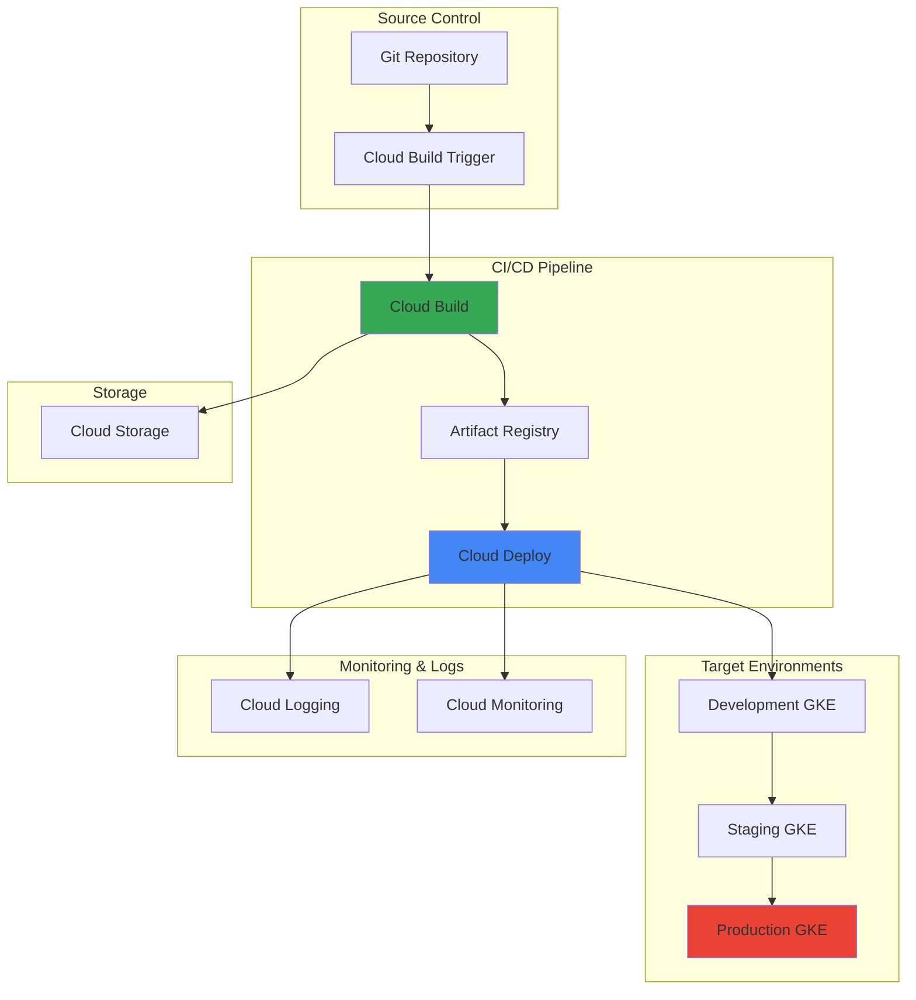

# Multi-Environment Application Deployment with Cloud Deploy and Cloud Build

## Problem

Organizations struggle with manual deployment processes across multiple environments (development, staging, production) that lead to inconsistencies, deployment errors, and delayed software releases. Traditional deployment workflows often lack proper rollback mechanisms, environment-specific configurations, and automated testing verification, creating significant risks when pushing changes to production environments.

## Solution

Google Cloud Deploy provides automated progressive delivery pipelines that orchestrate application deployments across multiple environments with built-in rollback capabilities and deployment verification. Combined with Cloud Build for continuous integration, this solution creates a comprehensive CI/CD pipeline that ensures consistent, reliable deployments while maintaining environmental isolation and implementing automated quality gates.

## Architecture Diagram



## Prerequisites

1. Google Cloud project with billing enabled and appropriate IAM permissions (Editor or Owner role)
2. Google Cloud CLI (gcloud) installed and configured
3. Git repository with a containerized application (we'll create a sample)
4. Basic knowledge of Kubernetes, Docker, and CI/CD concepts
5. Estimated cost: $10-20 for GKE clusters during testing period

> **Note**: This recipe uses Google Kubernetes Engine (GKE) as the deployment target. Cloud Deploy also supports Cloud Run and other compute platforms. See the [Cloud Deploy documentation](https://cloud.google.com/deploy/docs/deploy-app-run) for additional deployment targets.

## Preparation

```bash
# Set environment variables for GCP resources
export PROJECT_ID="my-cicd-project-$(date +%s)"
export REGION="us-central1"
export ZONE="us-central1-a"

# Generate unique suffix for resource names
RANDOM_SUFFIX=$(openssl rand -hex 3)
export CLUSTER_PREFIX="deploy-demo-${RANDOM_SUFFIX}"
export PIPELINE_NAME="sample-app-pipeline"
export APP_NAME="sample-webapp"

# Create new project for this demo
gcloud projects create ${PROJECT_ID} --name="CI/CD Demo Project"
gcloud config set project ${PROJECT_ID}

# Set default region and zone
gcloud config set compute/region ${REGION}
gcloud config set compute/zone ${ZONE}

# Enable required APIs
gcloud services enable container.googleapis.com \
    cloudbuild.googleapis.com \
    clouddeploy.googleapis.com \
    storage.googleapis.com \
    logging.googleapis.com \
    monitoring.googleapis.com \
    artifactregistry.googleapis.com

# Create Artifact Registry repository for container images
gcloud artifacts repositories create ${APP_NAME}-repo \
    --repository-format=docker \
    --location=${REGION} \
    --description="Container images for ${APP_NAME}"

# Create Cloud Storage bucket for build artifacts
gsutil mb gs://${PROJECT_ID}-build-artifacts

echo "✅ Project configured: ${PROJECT_ID}"
echo "✅ Required APIs enabled"
echo "✅ Artifact Registry repository created"
echo "✅ Storage bucket created for build artifacts"
```

## Steps

1. **Create Multi-Environment GKE Clusters**:

   Google Kubernetes Engine provides the foundation for our multi-environment deployment architecture. Each environment requires its own cluster to ensure proper isolation and enable environment-specific configurations. GKE Autopilot mode simplifies cluster management by automatically handling node provisioning, scaling, and security updates while following Google Cloud best practices.

   ```bash
   # Create development cluster
   gcloud container clusters create-auto ${CLUSTER_PREFIX}-dev \
       --region=${REGION} \
       --release-channel=regular \
       --labels=env=development,app=${APP_NAME}
   
   # Create staging cluster
   gcloud container clusters create-auto ${CLUSTER_PREFIX}-staging \
       --region=${REGION} \
       --release-channel=regular \
       --labels=env=staging,app=${APP_NAME}
   
   # Create production cluster
   gcloud container clusters create-auto ${CLUSTER_PREFIX}-prod \
       --region=${REGION} \
       --release-channel=regular \
       --labels=env=production,app=${APP_NAME}
   
   echo "✅ Multi-environment GKE clusters created successfully"
   ```

   The three clusters now provide isolated environments with automatic node management and security updates. This separation ensures that development changes don't impact production workloads while maintaining consistent Kubernetes APIs across all environments.

2. **Configure kubectl Contexts for Each Environment**:

   Kubernetes contexts allow seamless switching between different clusters and environments. Properly configured contexts prevent accidental deployments to the wrong environment and provide clear visibility into which cluster you're currently managing.

   ```bash
   # Get credentials for all clusters
   gcloud container clusters get-credentials ${CLUSTER_PREFIX}-dev \
       --region=${REGION}
   gcloud container clusters get-credentials ${CLUSTER_PREFIX}-staging \
       --region=${REGION}
   gcloud container clusters get-credentials ${CLUSTER_PREFIX}-prod \
       --region=${REGION}
   
   # Rename contexts for clarity
   kubectl config rename-context \
       gke_${PROJECT_ID}_${REGION}_${CLUSTER_PREFIX}-dev \
       dev-context
   kubectl config rename-context \
       gke_${PROJECT_ID}_${REGION}_${CLUSTER_PREFIX}-staging \
       staging-context
   kubectl config rename-context \
       gke_${PROJECT_ID}_${REGION}_${CLUSTER_PREFIX}-prod \
       prod-context
   
   # Set development as default context
   kubectl config use-context dev-context
   
   echo "✅ kubectl contexts configured for all environments"
   ```

3. **Create Sample Application and Kubernetes Manifests**:

   A containerized application with proper Kubernetes manifests demonstrates real-world deployment scenarios. This sample application includes environment-specific configurations and resource requirements that showcase Cloud Deploy's ability to handle complex deployment scenarios.

   ```bash
   # Create application directory structure
   mkdir -p ${APP_NAME}/{src,k8s/{base,overlays/{dev,staging,prod}}}
   
   # Create sample Node.js application
   cat > ${APP_NAME}/src/app.js << 'EOF'
   const express = require('express');
   const app = express();
   const port = process.env.PORT || 3000;
   const environment = process.env.NODE_ENV || 'development';
   
   app.get('/', (req, res) => {
     res.json({
       message: 'Hello from Cloud Deploy!',
       environment: environment,
       timestamp: new Date().toISOString(),
       hostname: process.env.HOSTNAME || 'localhost'
     });
   });
   
   app.get('/health', (req, res) => {
     res.status(200).json({ status: 'healthy' });
   });
   
   app.get('/version', (req, res) => {
     res.json({
       version: process.env.APP_VERSION || '1.0.0',
       environment: environment
     });
   });
   
   app.listen(port, () => {
     console.log(`Server running on port ${port} in ${environment} environment`);
   });
   EOF
   
   # Create package.json
   cat > ${APP_NAME}/src/package.json << 'EOF'
   {
     "name": "sample-webapp",
     "version": "1.0.0",
     "description": "Sample web application for Cloud Deploy demo",
     "main": "app.js",
     "scripts": {
       "start": "node app.js"
     },
     "dependencies": {
       "express": "^4.18.2"
     }
   }
   EOF
   
   # Create Dockerfile
   cat > ${APP_NAME}/Dockerfile << 'EOF'
   FROM node:18-alpine
   WORKDIR /app
   COPY src/package.json .
   RUN npm install
   COPY src/ .
   EXPOSE 3000
   CMD ["npm", "start"]
   EOF
   
   echo "✅ Sample application created with Node.js and Express"
   ```

4. **Create Base Kubernetes Manifests**:

   Kubernetes manifests define the desired state of your application across all environments. The base configuration contains common elements like container specifications and service definitions, while environment-specific overlays handle variations in resource allocation, replicas, and environment variables.

   ```bash
   # Create base deployment manifest
   cat > ${APP_NAME}/k8s/base/deployment.yaml << EOF
   apiVersion: apps/v1
   kind: Deployment
   metadata:
     name: ${APP_NAME}
     labels:
       app: ${APP_NAME}
   spec:
     replicas: 2
     selector:
       matchLabels:
         app: ${APP_NAME}
     template:
       metadata:
         labels:
           app: ${APP_NAME}
       spec:
         containers:
         - name: webapp
           image: ${REGION}-docker.pkg.dev/${PROJECT_ID}/${APP_NAME}-repo/${APP_NAME}:latest
           ports:
           - containerPort: 3000
           env:
           - name: NODE_ENV
             value: "production"
           - name: APP_VERSION
             value: "1.0.0"
           livenessProbe:
             httpGet:
               path: /health
               port: 3000
             initialDelaySeconds: 30
             periodSeconds: 10
           readinessProbe:
             httpGet:
               path: /health
               port: 3000
             initialDelaySeconds: 5
             periodSeconds: 5
           resources:
             requests:
               cpu: 100m
               memory: 128Mi
             limits:
               cpu: 500m
               memory: 512Mi
   EOF
   
   # Create service manifest
   cat > ${APP_NAME}/k8s/base/service.yaml << EOF
   apiVersion: v1
   kind: Service
   metadata:
     name: ${APP_NAME}-service
     labels:
       app: ${APP_NAME}
   spec:
     selector:
       app: ${APP_NAME}
     ports:
     - protocol: TCP
       port: 80
       targetPort: 3000
     type: LoadBalancer
   EOF
   
   echo "✅ Base Kubernetes manifests created"
   ```

5. **Create Environment-Specific Kustomize Overlays**:

   Kustomize provides a declarative approach to customizing Kubernetes manifests for different environments without duplicating configuration. Each environment overlay defines specific modifications like replica counts, resource limits, and environment variables while inheriting the base configuration.

   ```bash
   # Create development overlay
   cat > ${APP_NAME}/k8s/overlays/dev/kustomization.yaml << EOF
   apiVersion: kustomize.config.k8s.io/v1beta1
   kind: Kustomization
   
   resources:
   - ../../base
   
   replicas:
   - name: ${APP_NAME}
     count: 1
   
   patches:
   - target:
       kind: Deployment
       name: ${APP_NAME}
     patch: |-
       - op: replace
         path: /spec/template/spec/containers/0/env/0/value
         value: "development"
       - op: replace
         path: /spec/template/spec/containers/0/resources/requests/cpu
         value: "50m"
       - op: replace
         path: /spec/template/spec/containers/0/resources/limits/cpu
         value: "200m"
   
   namePrefix: dev-
   EOF
   
   # Create staging overlay
   cat > ${APP_NAME}/k8s/overlays/staging/kustomization.yaml << EOF
   apiVersion: kustomize.config.k8s.io/v1beta1
   kind: Kustomization
   
   resources:
   - ../../base
   
   replicas:
   - name: ${APP_NAME}
     count: 2
   
   patches:
   - target:
       kind: Deployment
       name: ${APP_NAME}
     patch: |-
       - op: replace
         path: /spec/template/spec/containers/0/env/0/value
         value: "staging"
   
   namePrefix: staging-
   EOF
   
   # Create production overlay
   cat > ${APP_NAME}/k8s/overlays/prod/kustomization.yaml << EOF
   apiVersion: kustomize.config.k8s.io/v1beta1
   kind: Kustomization
   
   resources:
   - ../../base
   
   replicas:
   - name: ${APP_NAME}
     count: 3
   
   patches:
   - target:
       kind: Deployment
       name: ${APP_NAME}
     patch: |-
       - op: replace
         path: /spec/template/spec/containers/0/env/0/value
         value: "production"
       - op: replace
         path: /spec/template/spec/containers/0/resources/requests/cpu
         value: "200m"
       - op: replace
         path: /spec/template/spec/containers/0/resources/limits/cpu
         value: "1000m"
       - op: replace
         path: /spec/template/spec/containers/0/resources/limits/memory
         value: "1Gi"
   
   namePrefix: prod-
   EOF
   
   echo "✅ Environment-specific Kustomize overlays created"
   ```

6. **Create Cloud Build Configuration**:

   Cloud Build automates the container image building process and integrates with Cloud Deploy for continuous deployment. The build configuration defines steps for building, testing, and publishing container images while generating the deployment artifacts needed for Cloud Deploy pipeline execution.

   ```bash
   # Create Cloud Build configuration
   cat > ${APP_NAME}/cloudbuild.yaml << EOF
   steps:
   # Build the container image
   - name: 'gcr.io/cloud-builders/docker'
     args: ['build', '-t', '${REGION}-docker.pkg.dev/${PROJECT_ID}/${APP_NAME}-repo/${APP_NAME}:\$SHORT_SHA', '.']
   
   # Push the image to Artifact Registry
   - name: 'gcr.io/cloud-builders/docker'
     args: ['push', '${REGION}-docker.pkg.dev/${PROJECT_ID}/${APP_NAME}-repo/${APP_NAME}:\$SHORT_SHA']
   
   # Update image tag in manifests
   - name: 'gcr.io/cloud-builders/gke-deploy'
     args:
     - prepare
     - --filename=k8s/overlays/dev
     - --image=${REGION}-docker.pkg.dev/${PROJECT_ID}/${APP_NAME}-repo/${APP_NAME}:\$SHORT_SHA
     - --app=${APP_NAME}
     - --version=\$SHORT_SHA
     - --namespace=default
     - --output=output
   
   # Create release in Cloud Deploy
   - name: 'gcr.io/cloud-builders/gcloud'
     args:
     - deploy
     - releases
     - create
     - release-\$SHORT_SHA
     - --delivery-pipeline=${PIPELINE_NAME}
     - --region=${REGION}
     - --source=output
   
   images:
   - '${REGION}-docker.pkg.dev/${PROJECT_ID}/${APP_NAME}-repo/${APP_NAME}:\$SHORT_SHA'
   
   options:
     logging: CLOUD_LOGGING_ONLY
     machineType: 'E2_HIGHCPU_8'
   
   timeout: 1200s
   EOF
   
   echo "✅ Cloud Build configuration created"
   ```

7. **Create Cloud Deploy Pipeline Configuration**:

   Cloud Deploy pipelines define the progression of deployments across environments with configurable approval processes and rollback capabilities. The pipeline configuration specifies deployment targets, promotion criteria, and environment-specific deployment strategies including canary deployments and blue-green rollouts.

   ```bash
   # Create Cloud Deploy pipeline configuration
   cat > ${APP_NAME}/clouddeploy.yaml << EOF
   apiVersion: deploy.cloud.google.com/v1
   kind: DeliveryPipeline
   metadata:
     name: ${PIPELINE_NAME}
   description: Multi-environment deployment pipeline for ${APP_NAME}
   serialPipeline:
     stages:
     - targetId: dev-target
       profiles: []
       strategy:
         standard:
           verify: false
     - targetId: staging-target
       profiles: []
       strategy:
         standard:
           verify: true
     - targetId: prod-target
       profiles: []
       strategy:
         canary:
           runtimeConfig:
             kubernetes:
               serviceNetworking:
                 service: prod-${APP_NAME}-service
                 deployment: prod-${APP_NAME}
           canaryDeployment:
             percentages: [25, 50, 100]
             verify: true
   ---
   apiVersion: deploy.cloud.google.com/v1
   kind: Target
   metadata:
     name: dev-target
   description: Development environment target
   gke:
     cluster: projects/${PROJECT_ID}/locations/${REGION}/clusters/${CLUSTER_PREFIX}-dev
   executionConfigs:
   - usages:
     - RENDER
     - DEPLOY
     defaultPool:
       serviceAccount: \${_CLOUDDEPLOY_SA_EMAIL}
   ---
   apiVersion: deploy.cloud.google.com/v1
   kind: Target
   metadata:
     name: staging-target
   description: Staging environment target
   gke:
     cluster: projects/${PROJECT_ID}/locations/${REGION}/clusters/${CLUSTER_PREFIX}-staging
   executionConfigs:
   - usages:
     - RENDER
     - DEPLOY
     defaultPool:
       serviceAccount: \${_CLOUDDEPLOY_SA_EMAIL}
   requireApproval: true
   ---
   apiVersion: deploy.cloud.google.com/v1
   kind: Target
   metadata:
     name: prod-target
   description: Production environment target
   gke:
     cluster: projects/${PROJECT_ID}/locations/${REGION}/clusters/${CLUSTER_PREFIX}-prod
   executionConfigs:
   - usages:
     - RENDER
     - DEPLOY
     defaultPool:
       serviceAccount: \${_CLOUDDEPLOY_SA_EMAIL}
   requireApproval: true
   EOF
   
   echo "✅ Cloud Deploy pipeline configuration created"
   ```

8. **Create Cloud Deploy Service Account and Apply Pipeline**:

   Cloud Deploy requires a service account with appropriate permissions to deploy to GKE clusters and manage resources across environments. This service account follows the principle of least privilege while providing necessary access for deployment operations, monitoring, and logging.

   ```bash
   # Create service account for Cloud Deploy
   gcloud iam service-accounts create clouddeploy-sa \
       --display-name="Cloud Deploy Service Account"
   
   # Grant necessary permissions
   gcloud projects add-iam-policy-binding ${PROJECT_ID} \
       --member="serviceAccount:clouddeploy-sa@${PROJECT_ID}.iam.gserviceaccount.com" \
       --role="roles/container.clusterAdmin"
   
   gcloud projects add-iam-policy-binding ${PROJECT_ID} \
       --member="serviceAccount:clouddeploy-sa@${PROJECT_ID}.iam.gserviceaccount.com" \
       --role="roles/clouddeploy.jobRunner"
   
   # Apply Cloud Deploy pipeline
   export _CLOUDDEPLOY_SA_EMAIL="clouddeploy-sa@${PROJECT_ID}.iam.gserviceaccount.com"
   gcloud deploy apply \
       --file=${APP_NAME}/clouddeploy.yaml \
       --region=${REGION} \
       --project=${PROJECT_ID}
   
   echo "✅ Cloud Deploy service account created and pipeline applied"
   ```

9. **Set up Cloud Build Trigger**:

   Cloud Build triggers automate the CI/CD pipeline by responding to source code changes in your repository. The trigger configuration defines build criteria, environment variables, and service account permissions needed for successful builds and deployments across all environments.

   ```bash
   # Initialize git repository
   cd ${APP_NAME}
   git init
   git add .
   git commit -m "Initial commit: Multi-environment deployment setup"
   
   # Grant Cloud Build service account necessary permissions
   PROJECT_NUMBER=$(gcloud projects describe ${PROJECT_ID} --format="value(projectNumber)")
   
   gcloud projects add-iam-policy-binding ${PROJECT_ID} \
       --member="serviceAccount:${PROJECT_NUMBER}@cloudbuild.gserviceaccount.com" \
       --role="roles/clouddeploy.releaser"
   
   gcloud projects add-iam-policy-binding ${PROJECT_ID} \
       --member="serviceAccount:${PROJECT_NUMBER}@cloudbuild.gserviceaccount.com" \
       --role="roles/container.admin"
   
   gcloud projects add-iam-policy-binding ${PROJECT_ID} \
       --member="serviceAccount:${PROJECT_NUMBER}@cloudbuild.gserviceaccount.com" \
       --role="roles/artifactregistry.writer"
   
   echo "✅ Cloud Build permissions configured"
   ```

10. **Execute Initial Build and Deployment**:

    The initial build and deployment validates the entire CI/CD pipeline from source code to production deployment. This process demonstrates Cloud Deploy's progressive delivery capabilities, including automatic progression through development, manual approval for staging, and canary deployment to production.

    ```bash
    # Trigger initial build
    gcloud builds submit . \
        --config=cloudbuild.yaml \
        --substitutions=_CLOUDDEPLOY_SA_EMAIL="clouddeploy-sa@${PROJECT_ID}.iam.gserviceaccount.com"
    
    # Monitor build progress
    echo "Build started. Monitor progress with:"
    echo "gcloud builds list --limit=1"
    
    # Wait for build completion
    echo "Waiting for build to complete..."
    sleep 90
    
    # Check Cloud Deploy pipeline status
    gcloud deploy delivery-pipelines describe ${PIPELINE_NAME} \
        --region=${REGION} \
        --format="table(name,condition.pipeline_ready_condition.status)"
    
    echo "✅ Initial build and deployment initiated"
    echo "✅ Check Cloud Deploy console for deployment progress"
    ```

## Validation & Testing

1. **Verify Cloud Deploy Pipeline Status**:

   ```bash
   # Check pipeline status
   gcloud deploy delivery-pipelines list \
       --region=${REGION} \
       --format="table(name,condition.pipeline_ready_condition.status)"
   
   # List all releases
   gcloud deploy releases list \
       --delivery-pipeline=${PIPELINE_NAME} \
       --region=${REGION} \
       --format="table(name,createTime,deployState)"
   ```

   Expected output: Pipeline should show as "True" for ready status and releases should show "SUCCEEDED" state.

2. **Test Application Deployment in Each Environment**:

   ```bash
   # Test development environment
   kubectl config use-context dev-context
   kubectl get pods -l app=${APP_NAME}
   DEV_IP=$(kubectl get service dev-${APP_NAME}-service -o jsonpath='{.status.loadBalancer.ingress[0].ip}')
   echo "Development environment IP: ${DEV_IP}"
   curl -s http://${DEV_IP}/ | jq .
   
   # Test staging environment
   kubectl config use-context staging-context
   kubectl get pods -l app=${APP_NAME}
   STAGING_IP=$(kubectl get service staging-${APP_NAME}-service -o jsonpath='{.status.loadBalancer.ingress[0].ip}')
   echo "Staging environment IP: ${STAGING_IP}"
   curl -s http://${STAGING_IP}/ | jq .
   
   # Test production environment
   kubectl config use-context prod-context
   kubectl get pods -l app=${APP_NAME}
   PROD_IP=$(kubectl get service prod-${APP_NAME}-service -o jsonpath='{.status.loadBalancer.ingress[0].ip}')
   echo "Production environment IP: ${PROD_IP}"
   curl -s http://${PROD_IP}/ | jq .
   ```

3. **Verify Environment-Specific Configurations**:

   ```bash
   # Check replica counts per environment
   echo "=== Development Environment ==="
   kubectl config use-context dev-context
   kubectl get deployment dev-${APP_NAME} -o jsonpath='{.spec.replicas}'
   
   echo -e "\n=== Staging Environment ==="
   kubectl config use-context staging-context
   kubectl get deployment staging-${APP_NAME} -o jsonpath='{.spec.replicas}'
   
   echo -e "\n=== Production Environment ==="
   kubectl config use-context prod-context
   kubectl get deployment prod-${APP_NAME} -o jsonpath='{.spec.replicas}'
   
   # Verify environment variables
   echo -e "\n=== Environment Variable Verification ==="
   kubectl config use-context dev-context
   kubectl get deployment dev-${APP_NAME} -o jsonpath='{.spec.template.spec.containers[0].env[0].value}'
   ```

4. **Test Rollback Functionality**:

   ```bash
   # List rollout history
   gcloud deploy rollouts list \
       --delivery-pipeline=${PIPELINE_NAME} \
       --region=${REGION} \
       --format="table(name,createTime,state)"
   
   # View deployment history
   gcloud deploy targets list \
       --region=${REGION} \
       --format="table(name,gke.cluster)"
   ```

## Cleanup

1. **Delete Cloud Deploy Pipeline and Targets**:

   ```bash
   # Delete the delivery pipeline
   gcloud deploy delivery-pipelines delete ${PIPELINE_NAME} \
       --region=${REGION} \
       --quiet
   
   echo "✅ Cloud Deploy pipeline deleted"
   ```

2. **Remove GKE Clusters**:

   ```bash
   # Delete all GKE clusters
   gcloud container clusters delete ${CLUSTER_PREFIX}-dev \
       --region=${REGION} \
       --quiet
   
   gcloud container clusters delete ${CLUSTER_PREFIX}-staging \
       --region=${REGION} \
       --quiet
   
   gcloud container clusters delete ${CLUSTER_PREFIX}-prod \
       --region=${REGION} \
       --quiet
   
   echo "✅ GKE clusters deleted"
   ```

3. **Clean up Cloud Build Resources**:

   ```bash
   # Delete Artifact Registry repository
   gcloud artifacts repositories delete ${APP_NAME}-repo \
       --location=${REGION} \
       --quiet
   
   echo "✅ Artifact Registry repository deleted"
   ```

4. **Remove Service Accounts and Storage**:

   ```bash
   # Delete service account
   gcloud iam service-accounts delete \
       clouddeploy-sa@${PROJECT_ID}.iam.gserviceaccount.com \
       --quiet
   
   # Delete storage bucket
   gsutil -m rm -r gs://${PROJECT_ID}-build-artifacts
   
   # Delete project (optional)
   gcloud projects delete ${PROJECT_ID} --quiet
   
   echo "✅ Service accounts and storage cleaned up"
   echo "✅ Project deleted (if selected)"
   ```

## Discussion

Cloud Deploy represents Google Cloud's approach to implementing GitOps and progressive delivery patterns that have become essential for modern software development teams. The service abstracts away the complexity of multi-environment deployments while providing enterprise-grade features like automated rollbacks, deployment verification, and approval workflows. When combined with Cloud Build's continuous integration capabilities, organizations can achieve a complete CI/CD pipeline that follows industry best practices for software delivery.

The progressive delivery model implemented in this solution addresses several critical challenges in software deployment. By automatically progressing through development, staging, and production environments with configurable approval gates, teams can catch issues early while maintaining deployment velocity. The canary deployment strategy in the production environment further reduces risk by gradually rolling out changes to a subset of users before full deployment, allowing teams to monitor key metrics and automatically rollback if problems are detected.

Environment-specific configurations managed through Kustomize overlays provide a clean separation between application logic and deployment concerns. This approach enables teams to maintain different resource allocations, replica counts, and environment variables across development, staging, and production environments without duplicating Kubernetes manifests. The result is a more maintainable codebase that reduces configuration drift and deployment errors commonly associated with manual environment management.

The integration with Google Cloud's native monitoring and logging services provides comprehensive observability throughout the deployment pipeline. Cloud Deploy automatically creates deployment logs in Cloud Logging, while Cloud Monitoring can be configured to track deployment success rates, rollback frequency, and deployment duration metrics. This observability enables teams to continuously improve their deployment processes based on real performance data and helps identify bottlenecks or reliability issues before they impact users.

For more information on Cloud Deploy features and best practices, see the [Cloud Deploy documentation](https://cloud.google.com/deploy/docs), [Cloud Build CI/CD patterns](https://cloud.google.com/build/docs/deploying-builds), [GKE deployment strategies](https://cloud.google.com/kubernetes-engine/docs/concepts/deployment), [Google Cloud Architecture Framework](https://cloud.google.com/architecture/framework), and [Progressive delivery patterns](https://cloud.google.com/architecture/application-deployment-and-testing-strategies).

> **Tip**: Enable Cloud Deploy notifications to Slack or email for real-time deployment status updates. Use Cloud Deploy's built-in metrics to track deployment frequency, lead time, and failure rates as key DevOps performance indicators.

## Challenge

Extend this solution by implementing these enhancements:

1. **Add Deployment Verification Hooks**: Implement custom verification scripts that run automated tests against each environment before promoting to the next stage, including smoke tests, integration tests, and performance benchmarks.

2. **Implement Blue-Green Deployment Strategy**: Modify the production deployment to use blue-green deployment patterns with traffic splitting capabilities, allowing for instant rollbacks and zero-downtime deployments.

3. **Add Security Scanning Integration**: Integrate container vulnerability scanning and security policy enforcement using Binary Authorization and Container Analysis API to block deployments with security vulnerabilities.

4. **Create Multi-Region Deployment Pipeline**: Extend the pipeline to support multi-region deployments with region-specific configurations, disaster recovery capabilities, and automated failover mechanisms.

5. **Implement Advanced Monitoring and Alerting**: Add comprehensive monitoring dashboards, SLI/SLO tracking, and automated alerting for deployment failures, performance degradation, and rollback triggers using Cloud Monitoring and Cloud Alerting.

## Infrastructure Code

*Infrastructure code will be generated after recipe approval.*