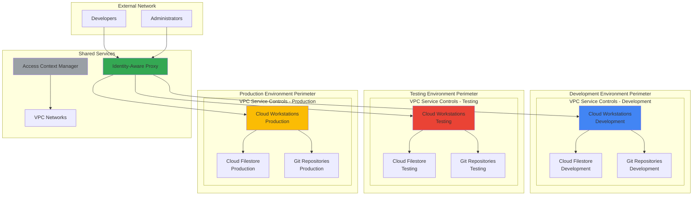

# Establishing Multi-Environment Development Isolation with VPC Service Controls and Cloud Workstations

## Problem

Modern software development teams need secure, isolated environments for development, testing, and production workloads while maintaining seamless collaboration and protecting sensitive data. Traditional approaches struggle with data exfiltration risks, inconsistent development environments, and complex access management across multiple environments. Without proper isolation, intellectual property and customer data can be inadvertently exposed, and misconfigurations in one environment can impact others.

## Solution

This solution creates secure, isolated development environments using VPC Service Controls to establish security perimeters around Google Cloud resources, combined with Cloud Workstations for consistent, managed development environments. Cloud Filestore provides shared storage for team collaboration, while Identity-Aware Proxy enables secure access controls. This architecture ensures data cannot exfiltrate from controlled environments while providing developers with powerful, scalable workstations.

## Architecture Diagram



## Prerequisites

1. Google Cloud Organization with Organization Admin permissions
2. Google Cloud CLI installed and configured (version 450.0.0 or later)
3. Knowledge of Google Cloud IAM, VPC networks, and security concepts
4. Basic understanding of development workflows and container technologies
5. Estimated cost: $75-150 per month depending on workstation usage and storage requirements

> **Note**: VPC Service Controls requires a Google Cloud Organization and cannot be used with individual projects. Ensure your organization has the necessary security policies in place before implementing this solution.

## Preparation

```bash
# Set environment variables for the multi-environment setup
export PROJECT_ID="secure-dev-environments-$(date +%s)"
export ORGANIZATION_ID="your-org-id"
export REGION="us-central1"
export ZONE="us-central1-a"

# Generate unique suffix for resource names
RANDOM_SUFFIX=$(openssl rand -hex 3)
export DEV_PROJECT_ID="${PROJECT_ID}-dev-${RANDOM_SUFFIX}"
export TEST_PROJECT_ID="${PROJECT_ID}-test-${RANDOM_SUFFIX}"
export PROD_PROJECT_ID="${PROJECT_ID}-prod-${RANDOM_SUFFIX}"

# Create projects for each environment
gcloud projects create ${DEV_PROJECT_ID} \
    --organization=${ORGANIZATION_ID} \
    --name="Development Environment"

gcloud projects create ${TEST_PROJECT_ID} \
    --organization=${ORGANIZATION_ID} \
    --name="Testing Environment"

gcloud projects create ${PROD_PROJECT_ID} \
    --organization=${ORGANIZATION_ID} \
    --name="Production Environment"

# Set billing account (replace with your billing account ID)
export BILLING_ACCOUNT_ID="your-billing-account-id"
gcloud billing projects link ${DEV_PROJECT_ID} \
    --billing-account=${BILLING_ACCOUNT_ID}
gcloud billing projects link ${TEST_PROJECT_ID} \
    --billing-account=${BILLING_ACCOUNT_ID}
gcloud billing projects link ${PROD_PROJECT_ID} \
    --billing-account=${BILLING_ACCOUNT_ID}

# Enable required APIs for all projects
for PROJECT in ${DEV_PROJECT_ID} ${TEST_PROJECT_ID} ${PROD_PROJECT_ID}; do
    gcloud services enable \
        compute.googleapis.com \
        workstations.googleapis.com \
        file.googleapis.com \
        iap.googleapis.com \
        accesscontextmanager.googleapis.com \
        --project=${PROJECT}
done

echo "✅ Environment setup complete"
echo "Development Project: ${DEV_PROJECT_ID}"
echo "Testing Project: ${TEST_PROJECT_ID}"
echo "Production Project: ${PROD_PROJECT_ID}"
```

## Steps

1. **Create Access Context Manager Policy and Access Levels**:

   Access Context Manager provides the foundation for VPC Service Controls by defining access levels that determine who can access resources within service perimeters. This centralized policy management ensures consistent security controls across all environments while allowing granular access control based on user identity, device state, and network origin.

   ```bash
   # Create access context manager policy
   gcloud access-context-manager policies create \
       --organization=${ORGANIZATION_ID} \
       --title="Multi-Environment Security Policy"
   
   # Get the policy ID
   POLICY_ID=$(gcloud access-context-manager policies list \
       --organization=${ORGANIZATION_ID} \
       --format="value(name)" \
       --filter="title:'Multi-Environment Security Policy'")
   
   # Create the access level specification file
   cat > internal_users_spec.yaml << EOF
   conditions:
   - members:
     - user:dev-team@yourdomain.com
     - user:admin@yourdomain.com
   EOF
   
   # Create access level for internal users
   gcloud access-context-manager levels create internal_users \
       --policy=${POLICY_ID} \
       --title="Internal Users Access Level" \
       --basic-level-spec=internal_users_spec.yaml
   
   echo "✅ Access Context Manager policy and access levels created"
   ```

   The access policy now controls who can access resources within VPC Service Controls perimeters. This creates a security boundary that prevents unauthorized users from accessing sensitive development environments, even if they have valid Google Cloud credentials.

2. **Create VPC Networks for Each Environment**:

   Each environment requires its own VPC network to provide network-level isolation between development, testing, and production resources. This network segregation prevents accidental cross-environment access and provides the foundation for VPC Service Controls perimeter enforcement.

   ```bash
   # Create VPC networks for each environment
   gcloud compute networks create dev-vpc \
       --subnet-mode=regional \
       --project=${DEV_PROJECT_ID}
   
   gcloud compute networks create test-vpc \
       --subnet-mode=regional \
       --project=${TEST_PROJECT_ID}
   
   gcloud compute networks create prod-vpc \
       --subnet-mode=regional \
       --project=${PROD_PROJECT_ID}
   
   # Create subnets for each environment
   gcloud compute networks subnets create dev-subnet \
       --network=dev-vpc \
       --range=10.1.0.0/24 \
       --region=${REGION} \
       --project=${DEV_PROJECT_ID}
   
   gcloud compute networks subnets create test-subnet \
       --network=test-vpc \
       --range=10.2.0.0/24 \
       --region=${REGION} \
       --project=${TEST_PROJECT_ID}
   
   gcloud compute networks subnets create prod-subnet \
       --network=prod-vpc \
       --range=10.3.0.0/24 \
       --region=${REGION} \
       --project=${PROD_PROJECT_ID}
   
   # Enable Private Google Access for each subnet
   for PROJECT in ${DEV_PROJECT_ID} ${TEST_PROJECT_ID} ${PROD_PROJECT_ID}; do
       SUBNET_NAME=$(echo ${PROJECT} | cut -d'-' -f3)-subnet
       gcloud compute networks subnets update ${SUBNET_NAME} \
           --region=${REGION} \
           --enable-private-ip-google-access \
           --project=${PROJECT}
   done
   
   echo "✅ VPC networks and subnets created for all environments"
   ```

   The VPC networks provide isolated network environments for each development stage. Private Google Access ensures that workstations can access Google Cloud services without requiring external IP addresses, enhancing security while maintaining functionality.

3. **Create VPC Service Controls Perimeters**:

   VPC Service Controls perimeters create security boundaries around Google Cloud resources to prevent data exfiltration and unauthorized access. Each environment gets its own perimeter, ensuring that data cannot flow between development, testing, and production environments without explicit authorization.

   ```bash
   # Create service perimeter for development environment
   gcloud access-context-manager perimeters create dev-perimeter \
       --policy=${POLICY_ID} \
       --title="Development Environment Perimeter" \
       --perimeter-type=regular \
       --resources=projects/${DEV_PROJECT_ID} \
       --restricted-services=storage.googleapis.com,compute.googleapis.com,workstations.googleapis.com,file.googleapis.com \
       --access-levels=accessPolicies/${POLICY_ID}/accessLevels/internal_users
   
   # Create service perimeter for testing environment
   gcloud access-context-manager perimeters create test-perimeter \
       --policy=${POLICY_ID} \
       --title="Testing Environment Perimeter" \
       --perimeter-type=regular \
       --resources=projects/${TEST_PROJECT_ID} \
       --restricted-services=storage.googleapis.com,compute.googleapis.com,workstations.googleapis.com,file.googleapis.com \
       --access-levels=accessPolicies/${POLICY_ID}/accessLevels/internal_users
   
   # Create service perimeter for production environment
   gcloud access-context-manager perimeters create prod-perimeter \
       --policy=${POLICY_ID} \
       --title="Production Environment Perimeter" \
       --perimeter-type=regular \
       --resources=projects/${PROD_PROJECT_ID} \
       --restricted-services=storage.googleapis.com,compute.googleapis.com,workstations.googleapis.com,file.googleapis.com \
       --access-levels=accessPolicies/${POLICY_ID}/accessLevels/internal_users
   
   echo "✅ VPC Service Controls perimeters created for all environments"
   ```

   The service perimeters now prevent data exfiltration between environments and external networks. Only authorized users meeting the access level requirements can access resources within each perimeter, providing strong security controls without impacting developer productivity.

4. **Create Cloud Filestore Instances for Shared Storage**:

   Cloud Filestore provides high-performance, fully managed NFS file shares that enable seamless collaboration between development teams. Each environment gets its own Filestore instance to maintain isolation while providing shared storage for project files, dependencies, and build artifacts.

   ```bash
   # Create Cloud Filestore instances for each environment
   gcloud filestore instances create dev-filestore \
       --zone=${ZONE} \
       --tier=BASIC_SSD \
       --file-share=name=dev_share,capacity=1TB \
       --network=name=dev-vpc \
       --project=${DEV_PROJECT_ID}
   
   gcloud filestore instances create test-filestore \
       --zone=${ZONE} \
       --tier=BASIC_SSD \
       --file-share=name=test_share,capacity=1TB \
       --network=name=test-vpc \
       --project=${TEST_PROJECT_ID}
   
   gcloud filestore instances create prod-filestore \
       --zone=${ZONE} \
       --tier=BASIC_SSD \
       --file-share=name=prod_share,capacity=1TB \
       --network=name=prod-vpc \
       --project=${PROD_PROJECT_ID}
   
   # Get IP addresses for mounting
   DEV_FILESTORE_IP=$(gcloud filestore instances describe dev-filestore \
       --zone=${ZONE} \
       --project=${DEV_PROJECT_ID} \
       --format="value(networks.ipAddresses[0])")
   
   TEST_FILESTORE_IP=$(gcloud filestore instances describe test-filestore \
       --zone=${ZONE} \
       --project=${TEST_PROJECT_ID} \
       --format="value(networks.ipAddresses[0])")
   
   PROD_FILESTORE_IP=$(gcloud filestore instances describe prod-filestore \
       --zone=${ZONE} \
       --project=${PROD_PROJECT_ID} \
       --format="value(networks.ipAddresses[0])")
   
   echo "✅ Cloud Filestore instances created"
   echo "Development Filestore IP: ${DEV_FILESTORE_IP}"
   echo "Testing Filestore IP: ${TEST_FILESTORE_IP}"
   echo "Production Filestore IP: ${PROD_FILESTORE_IP}"
   ```

   The Filestore instances provide shared, persistent storage that survives workstation restarts and enables team collaboration. The high-performance SSD storage ensures fast access to project files, improving developer productivity while maintaining environment isolation.

5. **Create Cloud Workstations Clusters and Configurations**:

   Cloud Workstations provides managed, secure development environments that can be customized for specific development needs. Each environment gets its own workstation cluster and configuration, ensuring consistent development environments while maintaining security isolation.

   ```bash
   # Create workstation clusters for each environment
   gcloud workstations clusters create dev-cluster \
       --region=${REGION} \
       --network=projects/${DEV_PROJECT_ID}/global/networks/dev-vpc \
       --subnetwork=projects/${DEV_PROJECT_ID}/regions/${REGION}/subnetworks/dev-subnet \
       --project=${DEV_PROJECT_ID}
   
   gcloud workstations clusters create test-cluster \
       --region=${REGION} \
       --network=projects/${TEST_PROJECT_ID}/global/networks/test-vpc \
       --subnetwork=projects/${TEST_PROJECT_ID}/regions/${REGION}/subnetworks/test-subnet \
       --project=${TEST_PROJECT_ID}
   
   gcloud workstations clusters create prod-cluster \
       --region=${REGION} \
       --network=projects/${PROD_PROJECT_ID}/global/networks/prod-vpc \
       --subnetwork=projects/${PROD_PROJECT_ID}/regions/${REGION}/subnetworks/prod-subnet \
       --project=${PROD_PROJECT_ID}
   
   # Wait for clusters to be created
   echo "Waiting for workstation clusters to be ready..."
   sleep 120
   
   # Create workstation configurations
   for PROJECT in ${DEV_PROJECT_ID} ${TEST_PROJECT_ID} ${PROD_PROJECT_ID}; do
       ENV=$(echo ${PROJECT} | cut -d'-' -f3)
       FILESTORE_IP_VAR="${ENV^^}_FILESTORE_IP"
       FILESTORE_IP=${!FILESTORE_IP_VAR}
       
       gcloud workstations configs create ${ENV}-workstation-config \
           --region=${REGION} \
           --cluster=${ENV}-cluster \
           --machine-type=e2-standard-4 \
           --pd-disk-size=50GB \
           --pd-disk-type=pd-standard \
           --container-image=us-central1-docker.pkg.dev/cloud-workstations-images/predefined/code-oss:latest \
           --container-env=FILESTORE_IP=${FILESTORE_IP} \
           --project=${PROJECT}
   done
   
   echo "✅ Cloud Workstations clusters and configurations created"
   ```

   The workstation configurations provide consistent, secure development environments with direct access to environment-specific resources. The persistent disks ensure that developer settings and work persist across sessions, while the containerized approach provides consistent tooling.

6. **Configure Identity-Aware Proxy for Secure Access**:

   Identity-Aware Proxy (IAP) provides secure access to Cloud Workstations without requiring VPN connections. IAP verifies user identity and device state before granting access, adding an additional layer of security to the development environment.

   ```bash
   # Configure IAP for each project
   for PROJECT in ${DEV_PROJECT_ID} ${TEST_PROJECT_ID} ${PROD_PROJECT_ID}; do
       # Create OAuth consent screen configuration
       cat > consent-screen-config.json << EOF
   {
     "application_title": "Secure Development Environment - ${PROJECT}",
     "support_email": "admin@yourdomain.com"
   }
   EOF
       
       # Grant IAP access to development team
       gcloud projects add-iam-policy-binding ${PROJECT} \
           --member="user:dev-team@yourdomain.com" \
           --role="roles/iap.httpsResourceAccessor"
       
       # Grant workstation access
       gcloud projects add-iam-policy-binding ${PROJECT} \
           --member="user:dev-team@yourdomain.com" \
           --role="roles/workstations.user"
   done
   
   echo "✅ Identity-Aware Proxy configured for all environments"
   ```

   IAP now provides secure, identity-based access to workstations without requiring complex VPN configurations. Users must authenticate and meet security requirements before accessing development environments.

7. **Create Sample Development Workstations**:

   With the infrastructure in place, create sample workstations for developers to demonstrate the isolated environment functionality. These workstations will have access to their environment-specific resources while being isolated from other environments.

   ```bash
   # Create sample workstations for each environment
   for PROJECT in ${DEV_PROJECT_ID} ${TEST_PROJECT_ID} ${PROD_PROJECT_ID}; do
       ENV=$(echo ${PROJECT} | cut -d'-' -f3)
       
       gcloud workstations create ${ENV}-workstation-1 \
           --region=${REGION} \
           --cluster=${ENV}-cluster \
           --config=${ENV}-workstation-config \
           --project=${PROJECT}
   done
   
   echo "✅ Sample workstations created for all environments"
   ```

   The workstations are now ready for developers to use, with each workstation having access only to its environment-specific resources. This ensures that development work remains isolated while providing powerful, consistent development environments.

8. **Configure Firestore Rules and Mounting Scripts**:

   Create mounting scripts and configure environment-specific access patterns to ensure secure file sharing within each development environment while maintaining isolation between environments.

   ```bash
   # Create mounting scripts for each environment
   for PROJECT in ${DEV_PROJECT_ID} ${TEST_PROJECT_ID} ${PROD_PROJECT_ID}; do
       ENV=$(echo ${PROJECT} | cut -d'-' -f3)
       FILESTORE_IP_VAR="${ENV^^}_FILESTORE_IP"
       FILESTORE_IP=${!FILESTORE_IP_VAR}
       
       cat > mount-${ENV}-filestore.sh << EOF
   #!/bin/bash
   # Mount Filestore for ${ENV} environment
   sudo mkdir -p /mnt/${ENV}-shared
   sudo mount -t nfs ${FILESTORE_IP}:/${ENV}_share /mnt/${ENV}-shared
   sudo chmod 755 /mnt/${ENV}-shared
   echo "✅ Filestore mounted at /mnt/${ENV}-shared"
   EOF
       
       chmod +x mount-${ENV}-filestore.sh
   done
   
   echo "✅ Filestore mounting scripts created"
   ```

   The mounting scripts provide a standardized way to access shared storage within each environment, ensuring consistent file access patterns while maintaining security boundaries.

## Validation & Testing

1. **Verify VPC Service Controls Perimeters**:

   ```bash
   # List all service perimeters
   gcloud access-context-manager perimeters list \
       --policy=${POLICY_ID} \
       --format="table(name,title,perimeterType)"
   
   # Check perimeter status
   gcloud access-context-manager perimeters describe dev-perimeter \
       --policy=${POLICY_ID} \
       --format="yaml"
   ```

   Expected output: Three perimeters (dev, test, prod) with "ACTIVE" status and proper resource assignments.

2. **Test Cloud Workstations Connectivity**:

   ```bash
   # Check workstation status
   gcloud workstations list \
       --region=${REGION} \
       --cluster=dev-cluster \
       --project=${DEV_PROJECT_ID} \
       --format="table(name,state,createTime)"
   
   # Test SSH access to workstation
   gcloud workstations ssh dev-workstation-1 \
       --region=${REGION} \
       --cluster=dev-cluster \
       --config=dev-workstation-config \
       --project=${DEV_PROJECT_ID}
   ```

   Expected output: Workstations should be in "RUNNING" state and SSH access should work without errors.

3. **Verify Cloud Filestore Access**:

   ```bash
   # Test Filestore connectivity from workstation
   gcloud workstations ssh dev-workstation-1 \
       --region=${REGION} \
       --cluster=dev-cluster \
       --config=dev-workstation-config \
       --project=${DEV_PROJECT_ID} \
       --command="./mount-dev-filestore.sh"
   ```

   Expected output: Successful mount of the NFS share without errors.

4. **Test Environment Isolation**:

   ```bash
   # Attempt to access resources from different environments
   # This should fail due to VPC Service Controls
   gcloud workstations ssh dev-workstation-1 \
       --region=${REGION} \
       --cluster=dev-cluster \
       --config=dev-workstation-config \
       --project=${DEV_PROJECT_ID} \
       --command="gcloud storage ls --project=${TEST_PROJECT_ID}"
   ```

   Expected output: Access denied error due to VPC Service Controls perimeter restrictions.

## Cleanup

1. **Delete Cloud Workstations**:

   ```bash
   # Delete workstations
   for PROJECT in ${DEV_PROJECT_ID} ${TEST_PROJECT_ID} ${PROD_PROJECT_ID}; do
       ENV=$(echo ${PROJECT} | cut -d'-' -f3)
       gcloud workstations delete ${ENV}-workstation-1 \
           --region=${REGION} \
           --cluster=${ENV}-cluster \
           --quiet \
           --project=${PROJECT}
   done
   
   echo "✅ Workstations deleted"
   ```

2. **Delete Cloud Workstations Configurations and Clusters**:

   ```bash
   # Delete workstation configurations
   for PROJECT in ${DEV_PROJECT_ID} ${TEST_PROJECT_ID} ${PROD_PROJECT_ID}; do
       ENV=$(echo ${PROJECT} | cut -d'-' -f3)
       gcloud workstations configs delete ${ENV}-workstation-config \
           --region=${REGION} \
           --cluster=${ENV}-cluster \
           --quiet \
           --project=${PROJECT}
   done
   
   # Delete workstation clusters
   for PROJECT in ${DEV_PROJECT_ID} ${TEST_PROJECT_ID} ${PROD_PROJECT_ID}; do
       ENV=$(echo ${PROJECT} | cut -d'-' -f3)
       gcloud workstations clusters delete ${ENV}-cluster \
           --region=${REGION} \
           --quiet \
           --project=${PROJECT}
   done
   
   echo "✅ Workstation configurations and clusters deleted"
   ```

3. **Delete Cloud Filestore Instances**:

   ```bash
   # Delete Filestore instances
   for PROJECT in ${DEV_PROJECT_ID} ${TEST_PROJECT_ID} ${PROD_PROJECT_ID}; do
       ENV=$(echo ${PROJECT} | cut -d'-' -f3)
       gcloud filestore instances delete ${ENV}-filestore \
           --zone=${ZONE} \
           --quiet \
           --project=${PROJECT}
   done
   
   echo "✅ Cloud Filestore instances deleted"
   ```

4. **Delete VPC Service Controls Perimeters and Access Policy**:

   ```bash
   # Delete service perimeters
   gcloud access-context-manager perimeters delete dev-perimeter \
       --policy=${POLICY_ID} \
       --quiet
   
   gcloud access-context-manager perimeters delete test-perimeter \
       --policy=${POLICY_ID} \
       --quiet
   
   gcloud access-context-manager perimeters delete prod-perimeter \
       --policy=${POLICY_ID} \
       --quiet
   
   # Delete access levels
   gcloud access-context-manager levels delete internal_users \
       --policy=${POLICY_ID} \
       --quiet
   
   # Delete access context manager policy
   gcloud access-context-manager policies delete ${POLICY_ID} \
       --quiet
   
   echo "✅ VPC Service Controls resources deleted"
   ```

5. **Delete Projects and Cleanup Local Files**:

   ```bash
   # Delete all projects
   gcloud projects delete ${DEV_PROJECT_ID} --quiet
   gcloud projects delete ${TEST_PROJECT_ID} --quiet
   gcloud projects delete ${PROD_PROJECT_ID} --quiet
   
   # Clean up local files
   rm -f internal_users_spec.yaml
   rm -f consent-screen-config.json
   rm -f mount-*-filestore.sh
   
   echo "✅ All projects deleted and local files cleaned up"
   echo "Note: Project deletion may take several minutes to complete"
   ```

## Discussion

This architecture provides enterprise-grade security for multi-environment development workflows by leveraging Google Cloud's advanced security controls. VPC Service Controls creates strong security perimeters that prevent data exfiltration while maintaining developer productivity. The combination of Cloud Workstations, Cloud Filestore, and Identity-Aware Proxy provides a comprehensive solution for secure development environments that addresses modern security challenges in cloud-native development.

The key architectural benefits include complete environment isolation through VPC Service Controls perimeters, which prevent accidental data movement between environments. Cloud Workstations provide consistent, managed development environments that can be customized for specific development needs while maintaining security controls. The integration with Cloud Filestore enables team collaboration through shared storage, while Identity-Aware Proxy provides secure access without complex VPN configurations. This approach eliminates the need for traditional VPN infrastructure while providing stronger security controls than conventional approaches.

Security considerations are paramount in this design. VPC Service Controls provides defense-in-depth by preventing data exfiltration even if IAM policies are misconfigured. The use of separate projects for each environment ensures complete resource isolation, while Identity-Aware Proxy adds additional authentication and authorization layers. Regular security audits and access reviews should be conducted to maintain the security posture of the development environments. The architecture also supports compliance requirements by providing detailed audit logs and access controls that meet enterprise security standards.

Cost optimization can be achieved by implementing workstation auto-shutdown policies during off-hours and using appropriate machine types based on development requirements. Cloud Filestore can be scaled based on actual usage, and unused workstations should be deleted to avoid unnecessary costs. Consider using preemptible instances for development workloads and implementing automated resource scheduling to reduce costs during non-business hours. For more information on VPC Service Controls, see the [official documentation](https://cloud.google.com/vpc-service-controls/docs/overview). Additional guidance on Cloud Workstations security can be found in the [security best practices guide](https://cloud.google.com/workstations/docs/security-best-practices). For Identity-Aware Proxy configuration, refer to the [IAP documentation](https://cloud.google.com/iap/docs/concepts-overview).

> **Tip**: Implement automated monitoring and alerting for VPC Service Controls violations to quickly identify and respond to potential security incidents. Use Cloud Monitoring to track workstation usage and costs for better resource management, and consider implementing Cloud Asset Inventory to maintain visibility into resource configurations across all environments.

## Challenge

Extend this solution by implementing these enhancements:

1. **Implement automated workstation provisioning** using Cloud Build triggers that create environment-specific workstations based on project requirements, including custom container images with pre-installed development tools and environment-specific configurations.

2. **Add data loss prevention (DLP) scanning** to monitor and prevent sensitive data from being inadvertently committed to repositories or transferred between environments, with automated remediation workflows for policy violations.

3. **Create automated compliance reporting** that tracks access patterns, resource usage, and security events across all environments, generating regular compliance reports for auditing purposes and integration with SIEM systems.

4. **Implement cross-environment deployment pipelines** with approval workflows that allow controlled promotion of code from development to testing to production while maintaining security boundaries and audit trails.

5. **Add advanced threat detection** using Google Cloud Security Command Center to monitor for suspicious activities, unauthorized access attempts, and potential security breaches across all development environments with automated incident response capabilities.

## Infrastructure Code

*Infrastructure code will be generated after recipe approval.*