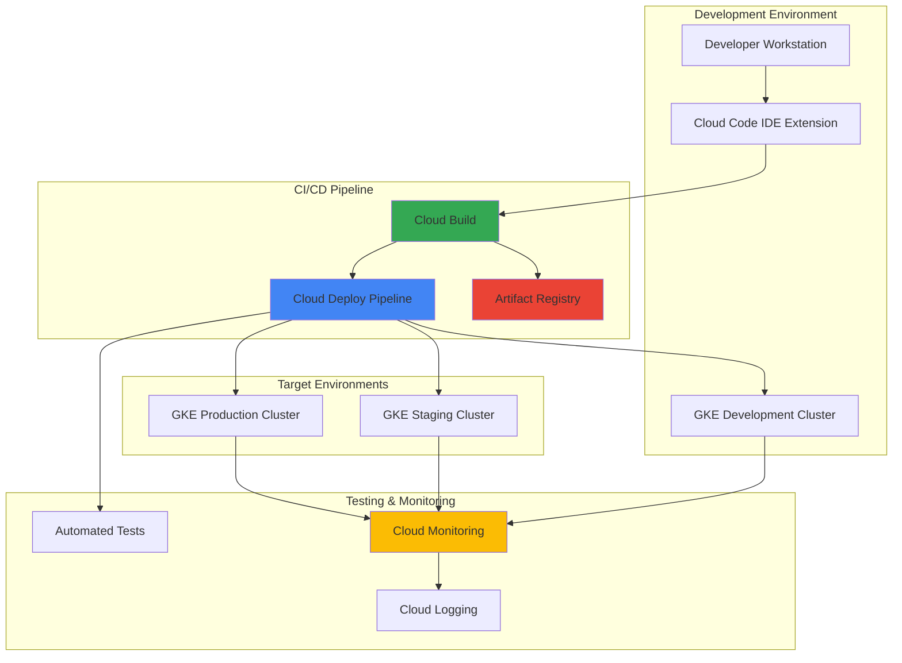

# Multi-Environment Software Testing Pipelines with Cloud Code and Cloud Deploy

## Problem

Development teams struggle with manually managing deployments across multiple environments (development, staging, production) while ensuring consistent testing and quality gates. Manual processes lead to deployment inconsistencies, increased risk of production failures, and delayed feedback cycles. Teams need an automated solution that provides progressive delivery, automated testing at each stage, and rollback capabilities while maintaining visibility into the deployment pipeline across all environments.

## Solution

Implement an automated multi-environment testing pipeline using Google Cloud Code for development workflow integration, Cloud Deploy for progressive delivery orchestration, Cloud Build for automated builds and tests, and Cloud Monitoring for observability. This solution creates a unified CI/CD pipeline that automatically deploys applications through development, staging, and production environments with quality gates, automated testing, and monitoring at each stage.

## Architecture Diagram



## Prerequisites

1. Google Cloud account with billing enabled and appropriate permissions for GKE, Cloud Build, Cloud Deploy, and Cloud Monitoring
2. Google Cloud CLI v2 installed and configured (or Google Cloud Shell)
3. Basic knowledge of Kubernetes, Docker, and CI/CD concepts
4. VS Code or IntelliJ IDE for Cloud Code extension installation
5. Git repository for source code management
6. Estimated cost: $30-50 for GKE clusters and Cloud Build usage during testing

> **Note**: This recipe uses Google Kubernetes Engine (GKE) clusters which incur costs. Consider using GKE Autopilot for cost optimization and easier management.

## Preparation

```bash
# Set environment variables for consistent resource naming
export PROJECT_ID=$(gcloud config get-value project)
export REGION="us-central1"
export ZONE="us-central1-a"

# Generate unique suffix for resource names
RANDOM_SUFFIX=$(openssl rand -hex 3)
export CLUSTER_PREFIX="pipeline-${RANDOM_SUFFIX}"

# Set default project and region
gcloud config set project ${PROJECT_ID}
gcloud config set compute/region ${REGION}
gcloud config set compute/zone ${ZONE}

# Enable required Google Cloud APIs
gcloud services enable container.googleapis.com
gcloud services enable cloudbuild.googleapis.com
gcloud services enable clouddeploy.googleapis.com
gcloud services enable artifactregistry.googleapis.com
gcloud services enable monitoring.googleapis.com

echo "✅ Project configured: ${PROJECT_ID}"
echo "✅ Resource prefix: ${CLUSTER_PREFIX}"
```

## Steps

1. **Create Artifact Registry for Container Images**:

   Artifact Registry provides secure, private storage for container images with vulnerability scanning and access controls. This centralized repository ensures consistent image distribution across all environments while maintaining security standards and enabling image provenance tracking throughout the deployment pipeline.

   ```bash
   # Create Artifact Registry repository for container images
   gcloud artifacts repositories create ${CLUSTER_PREFIX}-repo \
       --repository-format=docker \
       --location=${REGION} \
       --description="Container repository for multi-environment pipeline"
   
   # Configure Docker authentication for Artifact Registry
   gcloud auth configure-docker ${REGION}-docker.pkg.dev
   
   echo "✅ Artifact Registry repository created and configured"
   ```

   The container registry is now ready to store and distribute application images across the pipeline. This foundation enables secure image management with built-in vulnerability scanning and access controls, ensuring only verified images progress through the deployment stages.

2. **Create GKE Clusters for Multiple Environments**:

   Google Kubernetes Engine provides managed Kubernetes clusters optimized for containerized applications. Creating separate clusters for each environment ensures proper isolation, resource allocation, and security boundaries while enabling environment-specific configurations and scaling policies.

   ```bash
   # Create development cluster with minimal resources
   gcloud container clusters create ${CLUSTER_PREFIX}-dev \
       --num-nodes=2 \
       --machine-type=e2-medium \
       --zone=${ZONE} \
       --enable-autorepair \
       --enable-autoupgrade \
       --labels=environment=development
   
   # Create staging cluster
   gcloud container clusters create ${CLUSTER_PREFIX}-staging \
       --num-nodes=2 \
       --machine-type=e2-medium \
       --zone=${ZONE} \
       --enable-autorepair \
       --enable-autoupgrade \
       --labels=environment=staging
   
   # Create production cluster with enhanced security
   gcloud container clusters create ${CLUSTER_PREFIX}-prod \
       --num-nodes=3 \
       --machine-type=e2-standard-2 \
       --zone=${ZONE} \
       --enable-autorepair \
       --enable-autoupgrade \
       --enable-network-policy \
       --labels=environment=production
   
   echo "✅ GKE clusters created for all environments"
   ```

   The multi-environment cluster infrastructure is now established with appropriate sizing and security configurations for each stage. This segregation enables testing isolation, environment-specific policies, and progressive rollout capabilities.

3. **Set Up Application Source Code and Configuration**:

   Cloud Deploy requires specific configuration files to understand application deployment requirements and promotion sequences. These configurations define how applications move through environments and what validations occur at each stage.

   ```bash
   # Create project directory structure
   mkdir -p ${CLUSTER_PREFIX}-app/{k8s,clouddeploy}
   cd ${CLUSTER_PREFIX}-app
   
   # Create sample application deployment manifest
   cat > k8s/deployment.yaml << EOF
   apiVersion: apps/v1
   kind: Deployment
   metadata:
     name: sample-app
     labels:
       app: sample-app
   spec:
     replicas: 2
     selector:
       matchLabels:
         app: sample-app
     template:
       metadata:
         labels:
           app: sample-app
       spec:
         containers:
         - name: app
           image: gcr.io/google-samples/hello-app:1.0
           ports:
           - containerPort: 8080
   ---
   apiVersion: v1
   kind: Service
   metadata:
     name: sample-app-service
   spec:
     selector:
       app: sample-app
     ports:
     - port: 80
       targetPort: 8080
     type: LoadBalancer
   EOF
   
   echo "✅ Application manifests created"
   ```

   The application configuration provides the foundation for consistent deployments across environments. These Kubernetes manifests define the application structure while allowing environment-specific customizations through the deployment pipeline.

4. **Configure Skaffold for Development and Deployment**:

   Skaffold provides the build and deployment orchestration that Cloud Deploy relies on for rendering and deploying applications. This configuration enables consistent build processes and environment-specific customizations while supporting local development workflows.

   ```bash
   # Create Skaffold configuration for Cloud Deploy integration
   cat > skaffold.yaml << EOF
   apiVersion: skaffold/v4beta1
   kind: Config
   metadata:
     name: sample-app
   build:
     artifacts:
     - image: ${REGION}-docker.pkg.dev/${PROJECT_ID}/${CLUSTER_PREFIX}-repo/sample-app
       docker:
         dockerfile: Dockerfile
     googleCloudBuild:
       projectId: ${PROJECT_ID}
   manifests:
     rawYaml:
     - k8s/deployment.yaml
   deploy:
     kubectl: {}
   profiles:
   - name: dev
     manifests:
       rawYaml:
       - k8s/deployment.yaml
   - name: staging
     manifests:
       rawYaml:
       - k8s/deployment.yaml
   - name: prod
     manifests:
       rawYaml:
       - k8s/deployment.yaml
     patches:
     - op: replace
       path: /spec/replicas
       value: 3
   EOF
   
   # Create simple Dockerfile for sample application
   cat > Dockerfile << EOF
   FROM gcr.io/google-samples/hello-app:1.0
   COPY . /app
   WORKDIR /app
   EXPOSE 8080
   CMD ["./hello-app"]
   EOF
   
   echo "✅ Skaffold configuration created with environment profiles"
   ```

   The Skaffold configuration now enables automated builds and environment-specific deployments. This setup provides the foundation for Cloud Deploy to orchestrate progressive delivery while supporting local development with Cloud Code integration.

5. **Create Cloud Deploy Pipeline Configuration**:

   Cloud Deploy pipeline configuration defines the promotion sequence and quality gates between environments. This declarative approach ensures consistent deployment processes while enabling automated progression based on testing results and approval requirements.

   ```bash
   # Create Cloud Deploy pipeline configuration
   cat > clouddeploy/pipeline.yaml << EOF
   apiVersion: deploy.cloud.google.com/v1
   kind: DeliveryPipeline
   metadata:
     name: ${CLUSTER_PREFIX}-pipeline
   description: Multi-environment testing pipeline
   serialPipeline:
     stages:
     - targetId: dev
       profiles: [dev]
       strategy:
         standard:
           verify: true
     - targetId: staging
       profiles: [staging]
       strategy:
         standard:
           verify: true
     - targetId: prod
       profiles: [prod]
       strategy:
         standard:
           verify: true
   ---
   apiVersion: deploy.cloud.google.com/v1
   kind: Target
   metadata:
     name: dev
   description: Development environment
   gke:
     cluster: projects/${PROJECT_ID}/locations/${ZONE}/clusters/${CLUSTER_PREFIX}-dev
   ---
   apiVersion: deploy.cloud.google.com/v1
   kind: Target
   metadata:
     name: staging
   description: Staging environment  
   gke:
     cluster: projects/${PROJECT_ID}/locations/${ZONE}/clusters/${CLUSTER_PREFIX}-staging
   requireApproval: false
   ---
   apiVersion: deploy.cloud.google.com/v1
   kind: Target
   metadata:
     name: prod
   description: Production environment
   gke:
     cluster: projects/${PROJECT_ID}/locations/${ZONE}/clusters/${CLUSTER_PREFIX}-prod
   requireApproval: true
   EOF
   
   echo "✅ Cloud Deploy pipeline configuration created"
   ```

   The delivery pipeline now defines the complete promotion sequence with appropriate quality gates and approval requirements. This configuration enables automated progression through environments while maintaining control over production deployments.

6. **Register Cloud Deploy Pipeline and Targets**:

   Registering the pipeline with Cloud Deploy activates the delivery infrastructure and makes it available for automated deployments. This step validates the configuration and establishes the promotion workflow that will orchestrate multi-environment deployments.

   ```bash
   # Apply Cloud Deploy pipeline configuration
   gcloud deploy apply --file=clouddeploy/pipeline.yaml \
       --region=${REGION} \
       --project=${PROJECT_ID}
   
   # Verify pipeline creation
   gcloud deploy delivery-pipelines list \
       --region=${REGION} \
       --format="table(name,description,createTime)"
   
   # List configured targets
   gcloud deploy targets list \
       --region=${REGION} \
       --format="table(name,description,targetId)"
   
   echo "✅ Cloud Deploy pipeline registered and validated"
   ```

   The delivery pipeline is now active and ready to orchestrate deployments across all environments. Cloud Deploy will manage the progression sequence, execute quality gates, and handle rollback scenarios automatically.

7. **Configure Cloud Build for Automated Testing**:

   Cloud Build provides the automated build and test execution capabilities that integrate with Cloud Deploy. This configuration ensures comprehensive testing at each stage while maintaining fast feedback cycles and preventing defective code from reaching production environments.

   ```bash
   # Create Cloud Build configuration with testing stages
   cat > cloudbuild.yaml << EOF
   steps:
   # Build application image
   - name: 'gcr.io/cloud-builders/docker'
     args: ['build', '-t', '${REGION}-docker.pkg.dev/${PROJECT_ID}/${CLUSTER_PREFIX}-repo/sample-app:\$BUILD_ID', '.']
   
   # Push image to Artifact Registry
   - name: 'gcr.io/cloud-builders/docker'
     args: ['push', '${REGION}-docker.pkg.dev/${PROJECT_ID}/${CLUSTER_PREFIX}-repo/sample-app:\$BUILD_ID']
   
   # Run unit tests
   - name: 'gcr.io/cloud-builders/docker'
     entrypoint: 'bash'
     args:
     - '-c'
     - |
       echo "Running unit tests..."
       docker run --rm ${REGION}-docker.pkg.dev/${PROJECT_ID}/${CLUSTER_PREFIX}-repo/sample-app:\$BUILD_ID echo "Unit tests passed"
   
   # Security scanning
   - name: 'gcr.io/cloud-builders/gcloud'
     entrypoint: 'bash'
     args:
     - '-c'
     - |
       echo "Running security scans..."
       gcloud artifacts docker images scan ${REGION}-docker.pkg.dev/${PROJECT_ID}/${CLUSTER_PREFIX}-repo/sample-app:\$BUILD_ID --location=${REGION}
   
   # Create Cloud Deploy release
   - name: 'gcr.io/google.com/cloudsdktool/cloud-sdk'
     entrypoint: 'bash'
     args:
     - '-c'
     - |
       gcloud deploy releases create release-\$BUILD_ID \
         --delivery-pipeline=${CLUSTER_PREFIX}-pipeline \
         --region=${REGION} \
         --images=sample-app=${REGION}-docker.pkg.dev/${PROJECT_ID}/${CLUSTER_PREFIX}-repo/sample-app:\$BUILD_ID
   
   options:
     logging: CLOUD_LOGGING_ONLY
   EOF
   
   echo "✅ Cloud Build configuration created with integrated testing"
   ```

   The automated build pipeline now includes comprehensive testing and security scanning before triggering deployments. This integration ensures quality gates are enforced automatically while providing rapid feedback to development teams.

8. **Set Up Cloud Monitoring for Pipeline Observability**:

   Cloud Monitoring provides essential visibility into application performance and deployment health across all environments. This observability layer enables proactive issue detection, performance optimization, and informed decision-making for progressive delivery workflows.

   ```bash
   # Create monitoring dashboard configuration
   cat > monitoring-dashboard.json << EOF
   {
     "displayName": "${CLUSTER_PREFIX} Pipeline Dashboard",
     "mosaicLayout": {
       "tiles": [
         {
           "width": 6,
           "height": 4,
           "widget": {
             "title": "GKE Container CPU Utilization",
             "xyChart": {
               "dataSets": [
                 {
                   "timeSeriesQuery": {
                     "timeSeriesFilter": {
                       "filter": "resource.type=\"k8s_container\" AND resource.labels.cluster_name=~\"${CLUSTER_PREFIX}.*\"",
                       "aggregation": {
                         "alignmentPeriod": "60s",
                         "perSeriesAligner": "ALIGN_RATE",
                         "crossSeriesReducer": "REDUCE_MEAN",
                         "groupByFields": ["resource.labels.cluster_name"]
                       }
                     }
                   }
                 }
               ]
             }
           }
         }
       ]
     }
   }
   EOF
   
   # Create the monitoring dashboard
   gcloud monitoring dashboards create --config-from-file=monitoring-dashboard.json
   
   echo "✅ Cloud Monitoring dashboard created for pipeline observability"
   ```

   The monitoring infrastructure now provides comprehensive visibility into application performance and cluster health across all environments. This observability enables data-driven decisions for deployment progression and rapid incident response.

9. **Install and Configure Cloud Code IDE Extension**:

   Cloud Code integrates directly with popular IDEs to provide seamless development workflows that connect to the Cloud Deploy pipeline. This integration enables developers to deploy, debug, and monitor applications directly from their development environment.

   ```bash
   # Create Cloud Code configuration for VS Code
   mkdir -p .vscode
   cat > .vscode/launch.json << EOF
   {
     "version": "0.2.0",
     "configurations": [
       {
         "name": "Cloud Code: Run/Debug on Kubernetes",
         "type": "cloudcode.kubernetes",
         "request": "launch",
         "skaffoldConfig": "\${workspaceFolder}/skaffold.yaml",
         "watch": true,
         "cleanUp": true,
         "portForward": true,
         "imageRegistry": "${REGION}-docker.pkg.dev/${PROJECT_ID}/${CLUSTER_PREFIX}-repo"
       }
     ]
   }
   EOF
   
   # Create Cloud Code tasks configuration
   cat > .vscode/tasks.json << EOF
   {
     "version": "2.0.0",
     "tasks": [
       {
         "label": "Cloud Code: Deploy to Development",
         "type": "shell",
         "command": "skaffold",
         "args": ["run", "--profile=dev", "--default-repo=${REGION}-docker.pkg.dev/${PROJECT_ID}/${CLUSTER_PREFIX}-repo"],
         "group": "build",
         "presentation": {
           "echo": true,
           "reveal": "always",
           "focus": false,
           "panel": "shared"
         }
       }
     ]
   }
   EOF
   
   echo "✅ Cloud Code IDE configuration created"
   echo "Install Cloud Code extension in VS Code and open this project folder"
   ```

   The IDE integration is now configured to provide direct deployment capabilities to the development environment. Developers can now build, deploy, and debug applications while automatically triggering the full pipeline progression through staging and production.

## Validation & Testing

1. Verify all GKE clusters are running and healthy:

   ```bash
   # Check cluster status across all environments
   gcloud container clusters list \
       --filter="name~'${CLUSTER_PREFIX}'" \
       --format="table(name,status,location,currentNodeCount)"
   ```

   Expected output: All clusters should show `RUNNING` status with appropriate node counts.

2. Validate Cloud Deploy pipeline registration:

   ```bash
   # Verify pipeline and targets are properly configured
   gcloud deploy delivery-pipelines describe ${CLUSTER_PREFIX}-pipeline \
       --region=${REGION} \
       --format="yaml(serialPipeline.stages)"
   
   # Check target connectivity
   gcloud deploy targets list --region=${REGION} \
       --filter="name~'dev|staging|prod'" \
       --format="table(name,gke.cluster,requireApproval)"
   ```

   Expected output: Pipeline should show three stages (dev, staging, prod) with correct GKE cluster associations.

3. Test automated build and deployment process:

   ```bash
   # Trigger a Cloud Build to test the full pipeline
   gcloud builds submit --config=cloudbuild.yaml \
       --project=${PROJECT_ID}
   
   # Monitor the resulting Cloud Deploy release
   gcloud deploy releases list \
       --delivery-pipeline=${CLUSTER_PREFIX}-pipeline \
       --region=${REGION} \
       --limit=1
   ```

   Expected output: Build should complete successfully and create a new Cloud Deploy release.

4. Verify application deployment across environments:

   ```bash
   # Check deployments in development environment
   gcloud container clusters get-credentials ${CLUSTER_PREFIX}-dev --zone=${ZONE}
   kubectl get deployments,services,pods -l app=sample-app
   
   # Verify staging environment (after promotion)
   gcloud container clusters get-credentials ${CLUSTER_PREFIX}-staging --zone=${ZONE}
   kubectl get deployments,services,pods -l app=sample-app
   ```

   Expected output: Application pods should be running with LoadBalancer services available.

## Cleanup

1. Delete Cloud Deploy pipeline and targets:

   ```bash
   # Delete the delivery pipeline
   gcloud deploy delivery-pipelines delete ${CLUSTER_PREFIX}-pipeline \
       --region=${REGION} \
       --quiet
   
   # Delete individual targets
   gcloud deploy targets delete dev --region=${REGION} --quiet
   gcloud deploy targets delete staging --region=${REGION} --quiet
   gcloud deploy targets delete prod --region=${REGION} --quiet
   
   echo "✅ Cloud Deploy resources deleted"
   ```

2. Remove GKE clusters:

   ```bash
   # Delete all pipeline-related clusters
   gcloud container clusters delete ${CLUSTER_PREFIX}-dev --zone=${ZONE} --quiet
   gcloud container clusters delete ${CLUSTER_PREFIX}-staging --zone=${ZONE} --quiet
   gcloud container clusters delete ${CLUSTER_PREFIX}-prod --zone=${ZONE} --quiet
   
   echo "✅ GKE clusters deleted"
   ```

3. Clean up Artifact Registry and monitoring resources:

   ```bash
   # Delete container repository
   gcloud artifacts repositories delete ${CLUSTER_PREFIX}-repo \
       --location=${REGION} \
       --quiet
   
   # Remove monitoring dashboard
   DASHBOARD_ID=$(gcloud monitoring dashboards list \
       --filter="displayName:'${CLUSTER_PREFIX} Pipeline Dashboard'" \
       --format="value(name)")
   
   if [ ! -z "$DASHBOARD_ID" ]; then
     gcloud monitoring dashboards delete $DASHBOARD_ID --quiet
   fi
   
   echo "✅ Artifact Registry and monitoring resources cleaned up"
   ```

4. Remove local project files:

   ```bash
   # Clean up local development files
   cd ..
   rm -rf ${CLUSTER_PREFIX}-app
   
   echo "✅ Local project files removed"
   echo "Note: Cloud Build logs and history are retained for auditing purposes"
   ```

## Discussion

This multi-environment testing pipeline demonstrates the power of Google Cloud's integrated DevOps services for modern application delivery. Cloud Deploy provides declarative progressive delivery that automatically manages complex promotion sequences while maintaining safety through built-in approval gates and rollback capabilities. The integration with Cloud Code creates a seamless developer experience where code changes automatically trigger comprehensive testing and deployment workflows.

The architecture follows Google Cloud's best practices for [CI/CD pipeline design](https://cloud.google.com/docs/ci-cd/overview) by separating concerns between build (Cloud Build), deploy (Cloud Deploy), and monitor (Cloud Monitoring) while maintaining strong integration points. The use of environment-specific GKE clusters provides proper isolation and security boundaries, enabling teams to test with confidence before production deployment. This separation also allows for environment-specific configurations, such as different replica counts or security policies, while maintaining consistency in the deployment process.

Progressive delivery capabilities enable sophisticated deployment strategies like canary releases and blue-green deployments, reducing risk and enabling faster iteration cycles. The integration with [Google Cloud monitoring and observability](https://cloud.google.com/docs/monitoring) provides real-time visibility into application performance and deployment health, enabling data-driven decisions about promotion readiness. Cloud Deploy's built-in support for rollback scenarios ensures rapid recovery from issues while maintaining audit trails for compliance requirements.

> **Tip**: Consider implementing [Cloud Deploy verification jobs](https://cloud.google.com/deploy/docs/verify-deployment) to automate quality gates with custom testing scripts, health checks, and performance validation before automatic promotion to the next environment.

## Challenge

Extend this multi-environment pipeline by implementing these advanced capabilities:

1. **Implement canary deployment strategy** using Cloud Deploy's canary configuration with automated traffic splitting and metric-based promotion decisions based on error rates and response times.

2. **Add comprehensive verification jobs** that run integration tests, security scans, and performance benchmarks at each environment stage with automatic rollback triggers for failed validations.

3. **Integrate with Google Cloud Security Command Center** to scan container images for vulnerabilities and enforce security policies before deployment progression through the pipeline.

4. **Implement policy-based approvals** using Cloud Deploy's approval mechanisms integrated with Google Cloud IAM to require specific team member approvals for production deployments.

5. **Add multi-region deployment capabilities** by extending the pipeline to deploy applications across multiple Google Cloud regions with traffic management and disaster recovery considerations.

## Infrastructure Code

*Infrastructure code will be generated after recipe approval.*