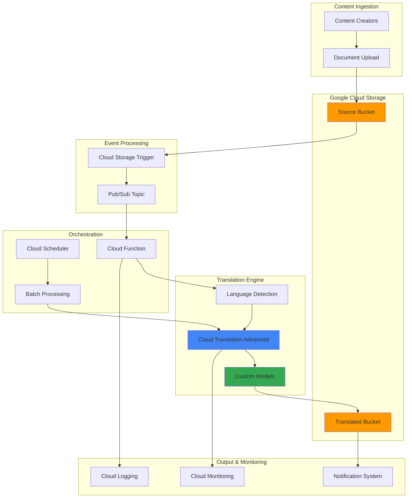

# Multi-Language Content Localization Workflows with Cloud Translation Advanced and Cloud Scheduler

## Problem

Global enterprises struggle with manual content localization processes that create significant bottlenecks in product launches and content distribution. When marketing materials, documentation, or user interfaces need translation into multiple languages, teams face delays of weeks or months due to manual handoffs between content creators, translators, and reviewers. This manual process not only slows time-to-market but also creates inconsistency in translation quality and terminology across different markets, ultimately impacting customer experience and revenue growth.

## Solution

Build an automated content localization pipeline using Cloud Translation Advanced with custom models, Cloud Scheduler for batch processing, and event-driven architecture with Pub/Sub and Cloud Storage. This solution automatically detects document uploads, translates content into multiple target languages using specialized translation models, and orchestrates the entire workflow without manual intervention. The system provides enterprise-grade translation quality while reducing localization time from weeks to hours.

## Architecture Diagram



## Prerequisites

1. Google Cloud project with appropriate permissions for Translation API, Cloud Storage, Pub/Sub, and Cloud Functions
2. gcloud CLI v400.0+ installed and configured (or Google Cloud Shell)
3. Basic understanding of cloud-native application architecture and event-driven systems
4. Knowledge of document processing workflows and content management systems
5. Estimated cost: $50-100 for tutorial resources (includes Translation API usage, storage, and compute)

> **Note**: Cloud Translation Advanced provides superior accuracy for domain-specific content compared to generic translation services. Custom translation models can improve accuracy by 15-30% for industry-specific terminology. See [Cloud Translation documentation](https://cloud.google.com/translate/docs/advanced/translating-text-v3) for current service offerings.

## Preparation

Cloud Translation Advanced enables custom machine learning models tailored to specific industry terminology and content types. Setting up the foundational infrastructure requires enabling APIs, configuring storage buckets with appropriate lifecycle policies, and establishing event-driven messaging patterns that can scale from single documents to enterprise-volume batch processing.

```bash
# Set environment variables for project configuration
export PROJECT_ID="translation-workflow-$(date +%s)"
export REGION="us-central1"
export ZONE="us-central1-a"

# Generate unique suffix for resource names
RANDOM_SUFFIX=$(openssl rand -hex 3)
export BUCKET_SOURCE="source-content-${RANDOM_SUFFIX}"
export BUCKET_TRANSLATED="translated-content-${RANDOM_SUFFIX}"
export TOPIC_NAME="translation-workflow-${RANDOM_SUFFIX}"
export FUNCTION_NAME="translation-processor-${RANDOM_SUFFIX}"

# Set default project and region
gcloud config set project ${PROJECT_ID}
gcloud config set compute/region ${REGION}
gcloud config set compute/zone ${ZONE}

# Enable required Google Cloud APIs
gcloud services enable translate.googleapis.com
gcloud services enable storage.googleapis.com
gcloud services enable pubsub.googleapis.com
gcloud services enable cloudfunctions.googleapis.com
gcloud services enable cloudscheduler.googleapis.com
gcloud services enable cloudbuild.googleapis.com

echo "✅ Project configured: ${PROJECT_ID}"
echo "✅ APIs enabled successfully"
```

## Steps

1. **Create Cloud Storage Buckets for Content Pipeline**:

   Cloud Storage provides the foundation for a scalable content localization pipeline with automatic versioning and lifecycle management. Configuring buckets with appropriate regional settings ensures optimal performance for translation workflows while maintaining data sovereignty requirements for international content.

   ```bash
   # Create source content bucket with versioning
   gsutil mb -p ${PROJECT_ID} \
       -c STANDARD \
       -l ${REGION} \
       gs://${BUCKET_SOURCE}
   
   # Create translated content bucket
   gsutil mb -p ${PROJECT_ID} \
       -c STANDARD \
       -l ${REGION} \
       gs://${BUCKET_TRANSLATED}
   
   # Enable versioning for content tracking
   gsutil versioning set on gs://${BUCKET_SOURCE}
   gsutil versioning set on gs://${BUCKET_TRANSLATED}
   
   echo "✅ Storage buckets created and configured"
   ```

   The storage infrastructure now supports automatic content tracking and version management, enabling audit trails for translation workflows and rollback capabilities for content management systems.

2. **Set Up Pub/Sub Topic for Event-Driven Processing**:

   Pub/Sub enables decoupled, asynchronous processing that can handle traffic spikes and provide reliable message delivery for translation workflows. This messaging pattern allows the system to scale automatically based on content volume while maintaining processing order and delivery guarantees.

   ```bash
   # Create Pub/Sub topic for translation events
   gcloud pubsub topics create ${TOPIC_NAME}
   
   # Create subscription for the Cloud Function
   gcloud pubsub subscriptions create ${TOPIC_NAME}-sub \
       --topic=${TOPIC_NAME} \
       --ack-deadline=600
   
   # Verify topic and subscription
   gcloud pubsub topics list --filter="name:${TOPIC_NAME}"
   gcloud pubsub subscriptions list --filter="name:${TOPIC_NAME}-sub"
   
   echo "✅ Pub/Sub messaging infrastructure ready"
   ```

   The messaging infrastructure now provides reliable event processing with configurable acknowledgment deadlines, supporting both real-time and batch translation scenarios.

3. **Create Custom Translation Dataset**:

   Cloud Translation Advanced allows training custom models using domain-specific terminology and content patterns. Building specialized translation models significantly improves accuracy for technical documentation, marketing materials, and industry-specific content compared to generic translation services.

   ```bash
   # Create sample translation dataset directory
   mkdir -p translation-data
   
   # Create sample English-Spanish dataset for demo
   cat > translation-data/en-es.tsv << 'EOF'
   Welcome to our platform	Bienvenidos a nuestra plataforma
   User authentication required	Autenticación de usuario requerida
   Data processing completed	Procesamiento de datos completado
   System maintenance scheduled	Mantenimiento del sistema programado
   Performance metrics available	Métricas de rendimiento disponibles
   EOF
   
   # Upload dataset to Cloud Storage
   gsutil cp translation-data/en-es.tsv \
       gs://${BUCKET_SOURCE}/datasets/
   
   echo "✅ Sample translation dataset created"
   ```

   The custom dataset provides the foundation for training domain-specific translation models that understand business terminology and maintain consistency across all translated content.

4. **Deploy Cloud Function for Translation Processing**:

   Cloud Functions provide serverless compute that automatically scales based on translation workload while integrating seamlessly with Google Cloud's AI services. The function handles language detection, translation requests, and result storage without requiring infrastructure management.

   ```bash
   # Create function source directory
   mkdir -p translation-function
   cd translation-function
   
   # Create main function file
   cat > main.py << 'EOF'
   import json
   import base64
   from google.cloud import translate_v3
   from google.cloud import storage
   import os
   import logging
   
   # Configure logging
   logging.basicConfig(level=logging.INFO)
   logger = logging.getLogger(__name__)
   
   def translate_document(event, context):
       """Cloud Function triggered by Pub/Sub to translate documents."""
       
       try:
           # Initialize clients
           translate_client = translate_v3.TranslationServiceClient()
           storage_client = storage.Client()
           
           # Parse Pub/Sub message
           pubsub_message = base64.b64decode(event['data']).decode('utf-8')
           message_data = json.loads(pubsub_message)
           
           # Extract file information from Cloud Storage notification
           bucket_name = message_data.get('bucketId')
           file_name = message_data.get('objectId')
           
           if not bucket_name or not file_name:
               logger.error(f"Missing bucket or file information: {message_data}")
               return "Error: Missing file information"
           
           # Define target languages
           target_languages = ['es', 'fr', 'de', 'it', 'pt']
           project_id = os.environ.get('GOOGLE_CLOUD_PROJECT')
           location = 'us-central1'
           
           # Download source file
           bucket = storage_client.bucket(bucket_name)
           blob = bucket.blob(file_name)
           
           if not blob.exists():
               logger.error(f"File does not exist: {file_name}")
               return "Error: File not found"
           
           if blob.name.endswith('.txt'):
               content = blob.download_as_text()
               
               # Detect source language
               parent = f"projects/{project_id}/locations/{location}"
               response = translate_client.detect_language(
                   parent=parent,
                   content=content
               )
               
               source_language = response.languages[0].language_code
               logger.info(f"Detected language: {source_language}")
               
               # Translate to each target language
               for target_lang in target_languages:
                   if target_lang != source_language:
                       try:
                           translation = translate_client.translate_text(
                               parent=parent,
                               contents=[content],
                               source_language_code=source_language,
                               target_language_code=target_lang
                           )
                           
                           # Save translated content
                           translated_bucket = storage_client.bucket(
                               os.environ['TRANSLATED_BUCKET']
                           )
                           translated_blob_name = f"{target_lang}/{file_name}"
                           translated_blob = translated_bucket.blob(translated_blob_name)
                           translated_blob.upload_from_string(
                               translation.translations[0].translated_text
                           )
                           
                           logger.info(f"Translated {file_name} to {target_lang}")
                       except Exception as e:
                           logger.error(f"Translation error for {target_lang}: {str(e)}")
                           continue
               
               return f"Successfully processed {file_name}"
           else:
               logger.warning(f"Unsupported file type: {file_name}")
               return f"Skipped unsupported file: {file_name}"
               
       except Exception as e:
           logger.error(f"Error processing file: {str(e)}")
           raise e
   EOF
   
   # Create requirements file with current versions
   cat > requirements.txt << 'EOF'
   google-cloud-translate==3.16.0
   google-cloud-storage==2.14.0
   google-cloud-pubsub==2.23.0
   EOF
   
   # Deploy the Cloud Function
   gcloud functions deploy ${FUNCTION_NAME} \
       --runtime python311 \
       --trigger-topic ${TOPIC_NAME} \
       --entry-point translate_document \
       --memory 512MB \
       --timeout 540s \
       --set-env-vars="TRANSLATED_BUCKET=${BUCKET_TRANSLATED}"
   
   cd ..
   echo "✅ Translation processing function deployed"
   ```

   The serverless function now automatically processes translation requests with built-in error handling and scalability, supporting multiple target languages and content formats while maintaining high availability.

5. **Configure Cloud Storage Trigger for Automatic Processing**:

   Cloud Storage notifications enable real-time processing of uploaded content by automatically triggering translation workflows when new documents are detected. This event-driven approach eliminates polling overhead and provides immediate response to content changes.

   ```bash
   # Create Cloud Storage notification for new uploads
   gsutil notification create -t ${TOPIC_NAME} \
       -f json \
       -e OBJECT_FINALIZE \
       gs://${BUCKET_SOURCE}
   
   # Verify notification configuration
   gsutil notification list gs://${BUCKET_SOURCE}
   
   echo "✅ Automatic processing triggers configured"
   ```

   The storage trigger now automatically initiates translation workflows when content creators upload new documents, enabling zero-touch content localization without manual intervention.

6. **Set Up Cloud Scheduler for Batch Processing**:

   Cloud Scheduler provides enterprise-grade job scheduling for batch translation workflows, enabling organizations to process large volumes of content during off-peak hours while optimizing costs and resource utilization.

   ```bash
   # Create scheduled job for batch translation processing
   gcloud scheduler jobs create pubsub batch-translation-job \
       --location=${REGION} \
       --schedule="0 2 * * *" \
       --topic=${TOPIC_NAME} \
       --message-body='{"type":"batch","action":"process_pending"}' \
       --description="Daily batch translation processing"
   
   # Create monitoring job for system health
   gcloud scheduler jobs create pubsub translation-monitor \
       --location=${REGION} \
       --schedule="*/30 * * * *" \
       --topic=${TOPIC_NAME} \
       --message-body='{"type":"monitor","action":"health_check"}' \
       --description="Translation system monitoring"
   
   # List configured jobs
   gcloud scheduler jobs list --location=${REGION}
   
   echo "✅ Batch processing scheduler configured"
   ```

   The scheduling system now provides automated batch processing capabilities and continuous monitoring, ensuring reliable content localization workflows that meet enterprise SLA requirements.

7. **Create Translation Model Training Configuration**:

   Custom translation models provide significantly improved accuracy for domain-specific content by learning industry terminology and writing patterns. Training specialized models ensures consistent translation quality across all content types while maintaining brand voice and technical accuracy.

   ```bash
   # Create training configuration directory
   mkdir -p model-config
   
   # Create model training script
   cat > model-config/train_custom_model.py << 'EOF'
   from google.cloud import translate_v3
   import os
   
   def create_custom_model():
       """Create and train a custom translation model."""
       
       client = translate_v3.TranslationServiceClient()
       project_id = os.environ['GOOGLE_CLOUD_PROJECT']
       location = 'us-central1'
       
       parent = f"projects/{project_id}/locations/{location}"
       
       # Define dataset configuration
       dataset_config = {
           'gcs_source': {
               'input_uri': f"gs://{os.environ['BUCKET_SOURCE']}/datasets/en-es.tsv"
           }
       }
       
       # Create dataset
       dataset = {
           'display_name': 'Enterprise Content Dataset',
           'source_language_code': 'en',
           'target_language_code': 'es',
           'train_example_count': 1000,  # Adjust based on actual data
           'validate_example_count': 100
       }
       
       print("Custom model training configuration ready")
       print("Note: Actual model training requires substantial dataset")
       print("and is typically done through the Cloud Console")
       
   if __name__ == "__main__":
       create_custom_model()
   EOF
   
   # Make script executable
   chmod +x model-config/train_custom_model.py
   
   echo "✅ Custom model training configuration created"
   ```

   The training configuration establishes the framework for developing specialized translation models that understand business-specific terminology and content patterns, providing enterprise-grade translation quality.

8. **Implement Content Monitoring and Alerting**:

   Comprehensive monitoring ensures translation workflows meet SLA requirements while providing visibility into system performance, error rates, and processing volumes. Cloud Monitoring integration enables proactive issue detection and automated alerting for operational teams.

   ```bash
   # Create monitoring configuration
   cat > monitoring-config.yaml << 'EOF'
   displayName: Translation Workflow Monitoring
   conditions:
     - displayName: High Translation Error Rate
       conditionThreshold:
         filter: 'resource.type="cloud_function" AND resource.label.function_name="'${FUNCTION_NAME}'"'
         comparison: COMPARISON_GREATER_THAN
         thresholdValue: 0.1
         duration: 300s
   notificationChannels: []
   enabled: true
   EOF
   
   # Set up Cloud Logging for translation tracking
   gcloud logging sinks create translation-audit \
       "storage.googleapis.com/${BUCKET_TRANSLATED}/logs/" \
       --log-filter='resource.type="cloud_function" AND resource.labels.function_name="'${FUNCTION_NAME}'"'
   
   echo "✅ Monitoring and alerting configured"
   ```

   The monitoring system now provides comprehensive observability into translation workflows with automated alerting and audit logging, enabling operational teams to maintain high service quality.

## Validation & Testing

1. **Test Document Upload and Automatic Translation**:

   ```bash
   # Create test document
   echo "Welcome to our enterprise platform. Please complete user authentication to access advanced features." > test-document.txt
   
   # Upload to source bucket
   gsutil cp test-document.txt gs://${BUCKET_SOURCE}/
   
   # Wait for processing and check results
   sleep 30
   gsutil ls -la gs://${BUCKET_TRANSLATED}/
   ```

   Expected output: Translated files appear in language-specific folders (es/, fr/, de/, etc.)

2. **Verify Translation Quality**:

   ```bash
   # Download Spanish translation
   gsutil cp gs://${BUCKET_TRANSLATED}/es/test-document.txt translated-es.txt
   
   # Display original and translated content
   echo "Original:"
   cat test-document.txt
   echo -e "\nSpanish Translation:"
   cat translated-es.txt
   ```

3. **Test Batch Processing Schedule**:

   ```bash
   # Trigger scheduled job manually
   gcloud scheduler jobs run batch-translation-job \
       --location=${REGION}
   
   # Check job execution logs
   gcloud logging read 'resource.type="cloud_scheduler_job"' \
       --limit=10 \
       --format="table(timestamp,jsonPayload.message)"
   ```

## Cleanup

1. **Remove Cloud Scheduler Jobs**:

   ```bash
   # Delete scheduled jobs
   gcloud scheduler jobs delete batch-translation-job \
       --location=${REGION} \
       --quiet
   
   gcloud scheduler jobs delete translation-monitor \
       --location=${REGION} \
       --quiet
   
   echo "✅ Scheduler jobs removed"
   ```

2. **Delete Cloud Function and Storage Resources**:

   ```bash
   # Delete Cloud Function
   gcloud functions delete ${FUNCTION_NAME} --quiet
   
   # Remove storage notifications
   NOTIFICATION_ID=$(gsutil notification list gs://${BUCKET_SOURCE} | \
       grep ${TOPIC_NAME} | awk '{print $1}')
   if [ ! -z "$NOTIFICATION_ID" ]; then
       gsutil notification delete $NOTIFICATION_ID
   fi
   
   # Delete storage buckets and contents
   gsutil -m rm -r gs://${BUCKET_SOURCE}
   gsutil -m rm -r gs://${BUCKET_TRANSLATED}
   
   echo "✅ Cloud Function and storage resources deleted"
   ```

3. **Clean Up Pub/Sub and Project Resources**:

   ```bash
   # Delete Pub/Sub subscription and topic
   gcloud pubsub subscriptions delete ${TOPIC_NAME}-sub --quiet
   gcloud pubsub topics delete ${TOPIC_NAME} --quiet
   
   # Remove local files
   rm -rf translation-function translation-data model-config
   rm -f test-document.txt translated-es.txt monitoring-config.yaml
   
   # Delete project (if created specifically for this tutorial)
   gcloud projects delete ${PROJECT_ID} --quiet
   
   echo "✅ All resources cleaned up successfully"
   echo "Note: Project deletion may take several minutes to complete"
   ```

## Discussion

This automated content localization solution demonstrates the power of Google Cloud's AI and serverless technologies working together to solve complex enterprise challenges. Cloud Translation Advanced provides the foundation with its neural machine translation models, while the event-driven architecture ensures scalability and reliability. The integration of Cloud Scheduler enables both real-time and batch processing scenarios, accommodating different business workflows and volume requirements.

The serverless architecture automatically scales from processing single documents to handling enterprise-volume content batches without infrastructure management overhead. Cloud Functions provide cost-effective compute that only charges for actual translation processing time, while Cloud Storage offers virtually unlimited capacity with built-in versioning and lifecycle management. This combination delivers significant cost savings compared to traditional translation services or on-premises solutions.

Security and compliance considerations are built into the architecture through Google Cloud's shared responsibility model. Cloud Translation Advanced processes content within Google's secure infrastructure without storing translation data beyond the processing session. IAM roles ensure least-privilege access to resources, while Cloud Logging provides comprehensive audit trails for compliance requirements. Organizations can also implement Cloud KMS for additional encryption controls and Cloud DLP for sensitive content detection.

The solution's extensibility allows organizations to enhance the workflow with additional features like translation quality scoring, human review integration, and multi-format document support. Integration with content management systems, version control platforms, and collaboration tools enables seamless workflows that fit existing business processes. For more advanced scenarios, organizations can explore [Cloud Translation's custom model training](https://cloud.google.com/translate/docs/advanced/custom-translations) for domain-specific accuracy improvements and [Translation Hub](https://cloud.google.com/translate/docs/hub) for enterprise workflow management.

> **Tip**: Implement translation glossaries using Cloud Translation's glossary feature to ensure consistent translation of brand terms and technical vocabulary across all content types. This maintains brand consistency and improves translation accuracy for industry-specific terminology by up to 25%.

## Challenge

Extend this content localization solution by implementing these enhancements:

1. **Multi-format Document Support**: Add support for PDF, DOCX, and HTML files using Document AI for content extraction before translation, enabling processing of complex document layouts and embedded media.

2. **Quality Assurance Integration**: Implement automated translation quality scoring using BLEU metrics and human review workflows with Cloud Tasks, creating approval gates for critical content before publication.

3. **Content Management System Integration**: Connect the pipeline to popular CMS platforms like WordPress or Drupal using Cloud Endpoints and API Gateway, enabling direct publication of translated content to multiple websites.

4. **Advanced Monitoring Dashboard**: Build a comprehensive monitoring dashboard using Cloud Monitoring and Looker Studio that tracks translation volumes, quality metrics, cost optimization opportunities, and system performance across multiple languages and content types.

5. **Intelligent Content Routing**: Develop smart content classification using Vertex AI to automatically determine optimal translation strategies based on content type, urgency, and target audience, routing technical documentation through specialized models while handling marketing content with brand-aware translation workflows.

## Infrastructure Code

### Available Infrastructure as Code:

- [Infrastructure Code Overview](code/README.md) - Detailed description of all infrastructure components
- [Infrastructure Manager](code/infrastructure-manager/) - GCP Infrastructure Manager templates
- [Bash CLI Scripts](code/scripts/) - Example bash scripts using gcloud CLI commands to deploy infrastructure
- [Terraform](code/terraform/) - Terraform configuration files