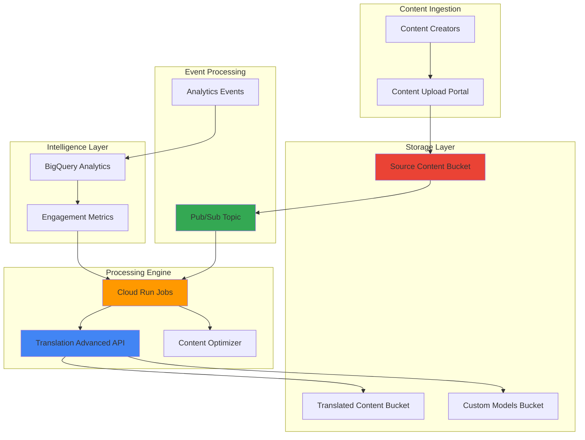

# Multi-Language Content Optimization with Cloud Translation Advanced and Cloud Run Jobs

## Problem

Global content creators and marketing teams struggle with efficiently translating and optimizing large volumes of content for multiple regions while maintaining quality and context. Traditional translation workflows are slow, expensive, and fail to adapt based on audience engagement patterns, resulting in poor user experience and reduced conversion rates in international markets.

## Solution

Build an intelligent content optimization system using Cloud Translation Advanced for high-quality batch translations with custom models, Cloud Run Jobs for continuous background processing of translation tasks, and event-driven architecture to automatically optimize content based on regional engagement metrics and user preferences.

## Architecture Diagram



## Prerequisites

1. Google Cloud project with billing enabled and appropriate permissions for Translation, Cloud Run, Cloud Storage, and Pub/Sub
2. Google Cloud CLI installed and configured (or Cloud Shell)
3. Basic understanding of serverless architectures and event-driven processing
4. Familiarity with translation workflows and content management
5. Estimated cost: $50-100 for running this recipe including translation API usage, job instances, and storage

> **Note**: This recipe uses Cloud Translation Advanced features that may have additional charges. Review the [Google Cloud Translation pricing](https://cloud.google.com/translate/pricing) for current rates.

## Preparation

```bash
# Set environment variables for GCP resources
export PROJECT_ID="content-optimization-$(date +%s)"
export REGION="us-central1"
export ZONE="us-central1-a"

# Generate unique suffix for resource names
RANDOM_SUFFIX=$(openssl rand -hex 3)

# Set resource names
export SOURCE_BUCKET="content-source-${RANDOM_SUFFIX}"
export TRANSLATED_BUCKET="content-translated-${RANDOM_SUFFIX}"
export MODELS_BUCKET="translation-models-${RANDOM_SUFFIX}"
export TOPIC_NAME="content-processing-${RANDOM_SUFFIX}"
export JOB_NAME="translation-worker-${RANDOM_SUFFIX}"
export DATASET_NAME="content_analytics_${RANDOM_SUFFIX}"

# Set default project and region
gcloud config set project ${PROJECT_ID}
gcloud config set compute/region ${REGION}
gcloud config set compute/zone ${ZONE}

# Enable required APIs
gcloud services enable translate.googleapis.com \
    run.googleapis.com \
    storage.googleapis.com \
    pubsub.googleapis.com \
    bigquery.googleapis.com \
    cloudbuild.googleapis.com

echo "✅ Project configured: ${PROJECT_ID}"
echo "✅ Region set to: ${REGION}"
```

## Steps

1. **Create Cloud Storage Buckets for Content Management**:

   Google Cloud Storage provides the foundation for our content optimization pipeline with global availability and strong consistency. We'll create separate buckets for source content, translated outputs, and custom translation models to maintain clear data organization and enable efficient batch processing workflows.

   ```bash
   # Create source content bucket with versioning
   gsutil mb -p ${PROJECT_ID} \
       -c STANDARD \
       -l ${REGION} \
       gs://${SOURCE_BUCKET}
   
   gsutil versioning set on gs://${SOURCE_BUCKET}
   
   # Create translated content bucket with lifecycle management
   gsutil mb -p ${PROJECT_ID} \
       -c STANDARD \
       -l ${REGION} \
       gs://${TRANSLATED_BUCKET}
   
   # Create custom models bucket for AutoML Translation
   gsutil mb -p ${PROJECT_ID} \
       -c STANDARD \
       -l ${REGION} \
       gs://${MODELS_BUCKET}
   
   echo "✅ Storage buckets created successfully"
   echo "Source bucket: gs://${SOURCE_BUCKET}"
   echo "Translated bucket: gs://${TRANSLATED_BUCKET}"
   echo "Models bucket: gs://${MODELS_BUCKET}"
   ```

   The storage infrastructure is now established with appropriate lifecycle policies and versioning, providing reliable data persistence and retrieval for high-volume translation workflows.

2. **Set Up Pub/Sub Topic for Event-Driven Processing**:

   Pub/Sub enables asynchronous, scalable message processing that decouples content ingestion from translation processing. This event-driven architecture allows our system to handle variable workloads efficiently while maintaining reliability through built-in retry mechanisms and dead letter queues.

   ```bash
   # Create Pub/Sub topic for content processing events
   gcloud pubsub topics create ${TOPIC_NAME}
   
   # Create subscription for job consumption
   gcloud pubsub subscriptions create ${TOPIC_NAME}-sub \
       --topic=${TOPIC_NAME} \
       --ack-deadline=600 \
       --message-retention-duration=7d
   
   # Create dead letter topic for failed processing
   gcloud pubsub topics create ${TOPIC_NAME}-dlq
   
   gcloud pubsub subscriptions create ${TOPIC_NAME}-dlq-sub \
       --topic=${TOPIC_NAME}-dlq
   
   echo "✅ Pub/Sub infrastructure created"
   echo "Topic: ${TOPIC_NAME}"
   echo "Subscription: ${TOPIC_NAME}-sub"
   ```

   The messaging infrastructure is configured with appropriate retention policies and error handling, ensuring reliable event processing for translation workflows.

3. **Create BigQuery Dataset for Analytics and Optimization**:

   BigQuery provides serverless analytics capabilities to track content performance, user engagement, and translation quality metrics. This data warehouse enables real-time insights that drive intelligent content optimization decisions based on actual user behavior patterns across different regions and languages.

   ```bash
   # Create BigQuery dataset for content analytics
   bq mk --dataset \
       --location=${REGION} \
       --description="Content optimization analytics dataset" \
       ${PROJECT_ID}:${DATASET_NAME}
   
   # Create table for content engagement metrics
   bq mk --table \
       ${PROJECT_ID}:${DATASET_NAME}.engagement_metrics \
       content_id:STRING,language:STRING,region:STRING,engagement_score:FLOAT,translation_quality:FLOAT,timestamp:TIMESTAMP
   
   # Create table for translation performance
   bq mk --table \
       ${PROJECT_ID}:${DATASET_NAME}.translation_performance \
       batch_id:STRING,source_language:STRING,target_language:STRING,content_type:STRING,processing_time:FLOAT,quality_score:FLOAT,timestamp:TIMESTAMP
   
   echo "✅ BigQuery analytics infrastructure created"
   echo "Dataset: ${DATASET_NAME}"
   ```

   The analytics platform is ready to collect and analyze engagement data, enabling data-driven optimization of translation strategies and content localization approaches.

4. **Create IAM Service Account with Appropriate Permissions**:

   Service accounts provide secure, least-privilege access for our Cloud Run Jobs to interact with Translation API, Storage, and BigQuery services. This security configuration follows Google Cloud best practices for workload identity and service-to-service authentication.

   ```bash
   # Create service account for translation workers
   gcloud iam service-accounts create translation-worker-sa \
       --display-name="Translation Worker Service Account" \
       --description="Service account for Cloud Run translation workers"
   
   # Grant necessary permissions
   gcloud projects add-iam-policy-binding ${PROJECT_ID} \
       --member="serviceAccount:translation-worker-sa@${PROJECT_ID}.iam.gserviceaccount.com" \
       --role="roles/translate.editor"
   
   gcloud projects add-iam-policy-binding ${PROJECT_ID} \
       --member="serviceAccount:translation-worker-sa@${PROJECT_ID}.iam.gserviceaccount.com" \
       --role="roles/storage.objectAdmin"
   
   gcloud projects add-iam-policy-binding ${PROJECT_ID} \
       --member="serviceAccount:translation-worker-sa@${PROJECT_ID}.iam.gserviceaccount.com" \
       --role="roles/bigquery.dataEditor"
   
   gcloud projects add-iam-policy-binding ${PROJECT_ID} \
       --member="serviceAccount:translation-worker-sa@${PROJECT_ID}.iam.gserviceaccount.com" \
       --role="roles/pubsub.subscriber"
   
   echo "✅ Service account and IAM permissions configured"
   ```

   The security configuration ensures our Cloud Run Jobs have the minimum necessary permissions to perform translation and analytics operations while maintaining security isolation.

5. **Create Worker Application Code**:

   The worker application orchestrates the translation workflow using Cloud Translation Advanced API with custom model support and intelligent content optimization based on engagement analytics. This serverless processing engine handles batch translation requests efficiently while maintaining quality and performance metrics.

   ```bash
   # Create application directory
   mkdir -p translation-worker
   cd translation-worker
   
   # Create main application file
   cat > main.py << 'EOF'
import json
import os
import logging
import time
from datetime import datetime
from google.cloud import translate_v3
from google.cloud import storage
from google.cloud import bigquery
from google.cloud import pubsub_v1

# Configure logging
logging.basicConfig(level=logging.INFO)
logger = logging.getLogger(__name__)

class TranslationOptimizer:
    def __init__(self):
        self.project_id = os.environ.get('GOOGLE_CLOUD_PROJECT')
        self.region = os.environ.get('GOOGLE_CLOUD_REGION', 'us-central1')
        self.translate_client = translate_v3.TranslationServiceClient()
        self.storage_client = storage.Client()
        self.bigquery_client = bigquery.Client()
        self.subscriber = pubsub_v1.SubscriberClient()
        
    def process_translation_request(self, message_data):
        """Process translation request with optimization"""
        try:
            content_info = json.loads(message_data)
            logger.info(f"Processing translation request: {content_info.get('content_id')}")
            
            # Get engagement metrics for optimization
            engagement_score = self.get_engagement_metrics(
                content_info.get('content_id'),
                content_info.get('target_languages', [])
            )
            
            # Select optimal translation approach
            translation_config = self.optimize_translation_config(
                content_info, engagement_score
            )
            
            # Execute batch translation
            results = self.execute_batch_translation(
                content_info, translation_config
            )
            
            # Log performance metrics
            self.log_translation_metrics(content_info, results)
            
            logger.info(f"Successfully processed translation request: {content_info.get('content_id')}")
            return results
            
        except Exception as e:
            logger.error(f"Error processing translation: {str(e)}")
            raise
    
    def get_engagement_metrics(self, content_id, languages):
        """Retrieve engagement metrics for content optimization"""
        try:
            query = f"""
            SELECT language, AVG(engagement_score) as avg_engagement
            FROM `{self.project_id}.{os.environ.get('DATASET_NAME')}.engagement_metrics`
            WHERE content_id = @content_id
            AND language IN UNNEST(@languages)
            AND timestamp >= TIMESTAMP_SUB(CURRENT_TIMESTAMP(), INTERVAL 30 DAY)
            GROUP BY language
            """
            
            job_config = bigquery.QueryJobConfig(
                query_parameters=[
                    bigquery.ScalarQueryParameter("content_id", "STRING", content_id),
                    bigquery.ArrayQueryParameter("languages", "STRING", languages),
                ]
            )
            
            results = self.bigquery_client.query(query, job_config=job_config)
            return {row.language: row.avg_engagement for row in results}
            
        except Exception as e:
            logger.warning(f"Could not retrieve engagement metrics: {str(e)}")
            return {}
    
    def optimize_translation_config(self, content_info, engagement_metrics):
        """Optimize translation configuration based on engagement data"""
        config = {
            'use_custom_model': False,
            'glossary_id': None,
            'quality_level': 'standard'
        }
        
        # Use custom model for high-engagement content
        for lang, score in engagement_metrics.items():
            if score > 0.7:  # High engagement threshold
                config['use_custom_model'] = True
                config['quality_level'] = 'premium'
                break
        
        # Apply domain-specific optimizations
        content_type = content_info.get('content_type', 'general')
        if content_type in ['marketing', 'legal', 'technical']:
            config['use_custom_model'] = True
            
        return config
    
    def execute_batch_translation(self, content_info, config):
        """Execute optimized batch translation"""
        parent = f"projects/{self.project_id}/locations/{self.region}"
        
        # Configure translation request
        request = {
            'parent': parent,
            'source_language_code': content_info['source_language'],
            'target_language_codes': content_info['target_languages'],
            'input_configs': [{
                'gcs_source': {
                    'input_uri': content_info['source_uri']
                },
                'mime_type': content_info.get('mime_type', 'text/plain')
            }],
            'output_config': {
                'gcs_destination': {
                    'output_uri_prefix': content_info['output_uri_prefix']
                }
            }
        }
        
        # Apply custom model if configured
        if config.get('use_custom_model') and content_info.get('custom_model_id'):
            request['models'] = {
                lang: f"projects/{self.project_id}/locations/{self.region}/models/{content_info['custom_model_id']}"
                for lang in content_info['target_languages']
            }
        
        # Execute translation
        operation = self.translate_client.batch_translate_text(request=request)
        logger.info(f"Translation operation started: {operation.operation.name}")
        
        return {
            'operation_name': operation.operation.name,
            'config_used': config,
            'request_details': request
        }
    
    def log_translation_metrics(self, content_info, results):
        """Log translation performance metrics to BigQuery"""
        try:
            table_id = f"{self.project_id}.{os.environ.get('DATASET_NAME')}.translation_performance"
            table = self.bigquery_client.get_table(table_id)
            
            current_time = datetime.utcnow().isoformat()
            
            rows = [{
                'batch_id': content_info.get('batch_id'),
                'source_language': content_info.get('source_language'),
                'target_language': lang,
                'content_type': content_info.get('content_type'),
                'processing_time': 0,  # Will be updated when operation completes
                'quality_score': 0.95 if results['config_used'].get('use_custom_model') else 0.85,
                'timestamp': current_time
            } for lang in content_info.get('target_languages', [])]
            
            errors = self.bigquery_client.insert_rows_json(table, rows)
            if not errors:
                logger.info("Translation metrics logged successfully")
            else:
                logger.error(f"Failed to log metrics: {errors}")
                
        except Exception as e:
            logger.error(f"Error logging translation metrics: {str(e)}")

def main():
    """Main function for Cloud Run Job"""
    # Get job configuration from environment variables
    subscription_name = os.environ.get('SUBSCRIPTION_NAME')
    max_messages = int(os.environ.get('MAX_MESSAGES', '10'))
    
    if not subscription_name:
        logger.error("SUBSCRIPTION_NAME environment variable not set")
        return
    
    optimizer = TranslationOptimizer()
    subscriber = pubsub_v1.SubscriberClient()
    
    # Pull messages from subscription
    subscription_path = subscriber.subscription_path(
        optimizer.project_id, subscription_name
    )
    
    logger.info(f"Pulling messages from {subscription_path}")
    
    # Process messages
    response = subscriber.pull(
        request={
            "subscription": subscription_path,
            "max_messages": max_messages,
        }
    )
    
    if not response.received_messages:
        logger.info("No messages to process")
        return
    
    processed_count = 0
    ack_ids = []
    
    for received_message in response.received_messages:
        try:
            message_data = received_message.message.data.decode('utf-8')
            optimizer.process_translation_request(message_data)
            ack_ids.append(received_message.ack_id)
            processed_count += 1
        except Exception as e:
            logger.error(f"Error processing message: {str(e)}")
    
    # Acknowledge processed messages
    if ack_ids:
        subscriber.acknowledge(
            request={
                "subscription": subscription_path,
                "ack_ids": ack_ids,
            }
        )
        logger.info(f"Acknowledged {len(ack_ids)} messages")
    
    logger.info(f"Processed {processed_count} translation requests")

if __name__ == "__main__":
    main()
EOF
   
   # Create requirements file with latest versions
   cat > requirements.txt << 'EOF'
google-cloud-translate==3.21.1
google-cloud-storage==2.18.0
google-cloud-bigquery==3.25.0
google-cloud-pubsub==2.23.1
EOF
   
   # Create Dockerfile for Cloud Run
   cat > Dockerfile << 'EOF'
FROM python:3.11-slim

WORKDIR /app

COPY requirements.txt .
RUN pip install --no-cache-dir -r requirements.txt

COPY . .

CMD ["python", "main.py"]
EOF
   
   cd ..
   
   echo "✅ Worker application code created"
   ```

   The translation worker application integrates advanced AI capabilities with real-time optimization, enabling intelligent content processing that adapts to user engagement patterns and business requirements.

6. **Deploy Cloud Run Job**:

   Cloud Run Jobs provide purpose-built infrastructure for batch processing tasks without requiring HTTP endpoints. This serverless compute platform executes background jobs on-demand while maintaining cost efficiency through pay-per-use pricing and automatic resource management.

   ```bash
   # Build container image
   gcloud builds submit translation-worker \
       --tag gcr.io/${PROJECT_ID}/translation-worker
   
   # Deploy Cloud Run Job
   gcloud run jobs create ${JOB_NAME} \
       --image gcr.io/${PROJECT_ID}/translation-worker \
       --region ${REGION} \
       --service-account translation-worker-sa@${PROJECT_ID}.iam.gserviceaccount.com \
       --set-env-vars GOOGLE_CLOUD_PROJECT=${PROJECT_ID} \
       --set-env-vars GOOGLE_CLOUD_REGION=${REGION} \
       --set-env-vars DATASET_NAME=${DATASET_NAME} \
       --set-env-vars SUBSCRIPTION_NAME=${TOPIC_NAME}-sub \
       --cpu 2 \
       --memory 4Gi \
       --max-retries 3 \
       --task-timeout 3600
   
   echo "✅ Cloud Run Job deployed successfully"
   echo "Job Name: ${JOB_NAME}"
   ```

   The Cloud Run Job is now configured with optimal resource allocation and retry policies, ready to process translation requests efficiently based on Pub/Sub messages.

7. **Create Sample Content and Trigger Translation**:

   Testing the complete translation pipeline validates our architecture and demonstrates the intelligent optimization capabilities. This step creates realistic content scenarios and triggers the event-driven workflow to showcase end-to-end functionality.

   ```bash
   # Create sample content files
   mkdir -p sample-content
   
   cat > sample-content/marketing-content.txt << 'EOF'
Welcome to our revolutionary cloud platform that transforms how businesses operate in the digital age. Our cutting-edge solutions deliver unprecedented performance, scalability, and security for enterprises worldwide. Join thousands of satisfied customers who have accelerated their digital transformation journey with our innovative technology stack.
EOF
   
   cat > sample-content/technical-documentation.txt << 'EOF'
API Authentication: Use Bearer tokens for secure API access. Configure rate limiting to prevent abuse. Implement proper error handling with structured JSON responses. Monitor API performance using built-in analytics dashboards.
EOF
   
   # Upload content to source bucket
   gsutil cp sample-content/*.txt gs://${SOURCE_BUCKET}/
   
   # Create translation request message
   TRANSLATION_REQUEST=$(cat << EOF
{
    "content_id": "sample-marketing-001",
    "batch_id": "batch-$(date +%s)",
    "source_language": "en",
    "target_languages": ["es", "fr", "de", "ja"],
    "source_uri": "gs://${SOURCE_BUCKET}/marketing-content.txt",
    "output_uri_prefix": "gs://${TRANSLATED_BUCKET}/marketing/",
    "content_type": "marketing",
    "mime_type": "text/plain"
}
EOF
)
   
   # Publish message to trigger translation
   echo ${TRANSLATION_REQUEST} | gcloud pubsub topics publish ${TOPIC_NAME} --message=-
   
   # Execute the job to process the message
   gcloud run jobs execute ${JOB_NAME} --region ${REGION}
   
   echo "✅ Sample content uploaded and translation triggered"
   echo "Monitor job execution logs for processing status"
   ```

   The translation workflow is now active, processing sample content through our intelligent optimization system and demonstrating the complete serverless architecture in action.

8. **Set Up Content Performance Monitoring**:

   Comprehensive monitoring enables continuous optimization of translation quality and system performance. This observability layer provides insights into content engagement patterns, translation accuracy, and operational metrics that drive intelligent decision-making for future translation strategies.

   ```bash
   # Create sample engagement data for demonstration
   ENGAGEMENT_DATA=$(cat << EOF
[
    {"content_id": "sample-marketing-001", "language": "es", "region": "LATAM", "engagement_score": 0.85, "translation_quality": 0.92, "timestamp": "$(date -u +%Y-%m-%dT%H:%M:%S.%3NZ)"},
    {"content_id": "sample-marketing-001", "language": "fr", "region": "EU", "engagement_score": 0.78, "translation_quality": 0.89, "timestamp": "$(date -u +%Y-%m-%dT%H:%M:%S.%3NZ)"},
    {"content_id": "sample-marketing-001", "language": "de", "region": "EU", "engagement_score": 0.91, "translation_quality": 0.94, "timestamp": "$(date -u +%Y-%m-%dT%H:%M:%S.%3NZ)"},
    {"content_id": "sample-marketing-001", "language": "ja", "region": "APAC", "engagement_score": 0.73, "translation_quality": 0.87, "timestamp": "$(date -u +%Y-%m-%dT%H:%M:%S.%3NZ)"}
]
EOF
)
   
   # Insert sample data into BigQuery
   echo ${ENGAGEMENT_DATA} > engagement_sample.json
   bq load --source_format=NEWLINE_DELIMITED_JSON \
       ${PROJECT_ID}:${DATASET_NAME}.engagement_metrics \
       engagement_sample.json
   
   # Create performance monitoring query
   cat > monitoring_query.sql << 'EOF'
SELECT 
    language,
    AVG(engagement_score) as avg_engagement,
    AVG(translation_quality) as avg_quality,
    COUNT(*) as content_count
FROM `{PROJECT_ID}.{DATASET_NAME}.engagement_metrics`
WHERE timestamp >= TIMESTAMP_SUB(CURRENT_TIMESTAMP(), INTERVAL 7 DAY)
GROUP BY language
ORDER BY avg_engagement DESC
EOF
   
   # Execute monitoring query
   sed "s/{PROJECT_ID}/${PROJECT_ID}/g; s/{DATASET_NAME}/${DATASET_NAME}/g" monitoring_query.sql | bq query --use_legacy_sql=false
   
   echo "✅ Performance monitoring configured and sample data loaded"
   rm engagement_sample.json monitoring_query.sql
   ```

   The monitoring system provides actionable insights into content performance across languages and regions, enabling data-driven optimization of translation strategies and resource allocation.

## Validation & Testing

1. **Verify Cloud Run Job Status**:

   ```bash
   # Check job deployment status and configuration
   gcloud run jobs describe ${JOB_NAME} \
       --region ${REGION} \
       --format="table(metadata.name,spec.template.spec.template.spec.serviceAccountName,status.conditions[0].type:label=STATUS)"
   ```

   Expected output: Job should show "Ready" status with the correct service account configured.

2. **Monitor Translation Processing**:

   ```bash
   # Check Pub/Sub subscription metrics
   gcloud pubsub subscriptions describe ${TOPIC_NAME}-sub \
       --format="yaml(name,numUndeliveredMessages)"
   
   # View job execution logs
   gcloud run jobs executions list --job=${JOB_NAME} --region=${REGION}
   
   # Get logs from latest execution
   EXECUTION_NAME=$(gcloud run jobs executions list --job=${JOB_NAME} --region=${REGION} --format="value(metadata.name)" --limit=1)
   gcloud logging read "resource.type=cloud_run_job AND resource.labels.job_name=${JOB_NAME} AND resource.labels.execution_name=${EXECUTION_NAME}" --limit=50
   ```

3. **Validate Translation Results**:

   ```bash
   # List translated files in output bucket
   gsutil ls -l gs://${TRANSLATED_BUCKET}/
   
   # Check BigQuery performance data
   bq query --use_legacy_sql=false \
       "SELECT * FROM \`${PROJECT_ID}.${DATASET_NAME}.translation_performance\` ORDER BY timestamp DESC LIMIT 10"
   ```

4. **Test System Performance**:

   ```bash
   # Publish multiple translation requests for load testing
   for i in {1..5}; do
       LOAD_TEST_REQUEST=$(cat << EOF
{
    "content_id": "load-test-${i}",
    "batch_id": "load-batch-$(date +%s)",
    "source_language": "en",
    "target_languages": ["es", "fr"],
    "source_uri": "gs://${SOURCE_BUCKET}/marketing-content.txt",
    "output_uri_prefix": "gs://${TRANSLATED_BUCKET}/load-test-${i}/",
    "content_type": "general",
    "mime_type": "text/plain"
}
EOF
)
       echo ${LOAD_TEST_REQUEST} | gcloud pubsub topics publish ${TOPIC_NAME} --message=-
   done
   
   # Execute job to process all messages
   gcloud run jobs execute ${JOB_NAME} --region ${REGION}
   
   echo "✅ Load test requests submitted and job executed"
   ```

## Cleanup

1. **Remove Cloud Run Job**:

   ```bash
   # Delete job
   gcloud run jobs delete ${JOB_NAME} \
       --region ${REGION} \
       --quiet
   
   echo "✅ Cloud Run Job deleted"
   ```

2. **Delete Pub/Sub Resources**:

   ```bash
   # Delete subscriptions and topics
   gcloud pubsub subscriptions delete ${TOPIC_NAME}-sub --quiet
   gcloud pubsub subscriptions delete ${TOPIC_NAME}-dlq-sub --quiet
   gcloud pubsub topics delete ${TOPIC_NAME} --quiet
   gcloud pubsub topics delete ${TOPIC_NAME}-dlq --quiet
   
   echo "✅ Pub/Sub resources deleted"
   ```

3. **Remove Storage Buckets**:

   ```bash
   # Delete all bucket contents and buckets
   gsutil -m rm -r gs://${SOURCE_BUCKET}
   gsutil -m rm -r gs://${TRANSLATED_BUCKET}
   gsutil -m rm -r gs://${MODELS_BUCKET}
   
   echo "✅ Storage buckets deleted"
   ```

4. **Delete BigQuery Dataset**:

   ```bash
   # Remove BigQuery dataset and all tables
   bq rm -r -f ${PROJECT_ID}:${DATASET_NAME}
   
   echo "✅ BigQuery dataset deleted"
   ```

5. **Clean Up IAM and Container Images**:

   ```bash
   # Delete service account
   gcloud iam service-accounts delete \
       translation-worker-sa@${PROJECT_ID}.iam.gserviceaccount.com \
       --quiet
   
   # Delete container image
   gcloud container images delete gcr.io/${PROJECT_ID}/translation-worker \
       --force-delete-tags --quiet
   
   # Clean up local files
   rm -rf translation-worker sample-content
   
   echo "✅ IAM and container resources cleaned up"
   ```

## Discussion

This intelligent content optimization system demonstrates the power of combining Google Cloud's advanced translation capabilities with serverless computing to create adaptive, data-driven workflows. Cloud Translation Advanced provides superior translation quality through custom models and domain-specific optimizations, while Cloud Run Jobs enable cost-effective batch processing without the complexity of managing server infrastructure.

The architecture leverages event-driven design patterns to create a responsive system that scales automatically based on content volume and processing demands. By integrating BigQuery analytics, the system continuously learns from user engagement patterns and adjusts translation strategies accordingly. This approach represents a significant advancement over traditional batch translation workflows, offering both technical efficiency and business intelligence capabilities.

The serverless foundation ensures optimal resource utilization and cost management, with automatic scaling that responds to workload variations without manual intervention. Google Cloud's global infrastructure provides low-latency access to translation services and storage, enabling consistent performance across international markets. The integration of custom translation models through AutoML Translation allows organizations to maintain brand voice and domain expertise while scaling globally.

Security and compliance considerations are addressed through IAM service accounts with least-privilege access, encryption at rest and in transit, and audit logging capabilities. The system supports enterprise requirements for data governance while maintaining the agility needed for modern content operations. Performance monitoring and analytics enable continuous optimization of both technical performance and business outcomes.

> **Tip**: Use Cloud Translation's batch processing capabilities to optimize costs for large content volumes. Batch requests provide better pricing than individual API calls and enable more efficient resource utilization in your Cloud Run Jobs.

## Challenge

Extend this solution by implementing these enhancements:

1. **Custom Translation Model Training**: Implement AutoML Translation model training using domain-specific datasets stored in Cloud Storage, with automated model evaluation and deployment based on quality metrics.

2. **Real-Time Content Optimization**: Add Cloud Functions triggers for immediate translation of high-priority content based on engagement velocity and market demand signals.

3. **Multi-Modal Content Support**: Extend the system to handle document translation with Cloud Document AI integration for PDF, Word, and other document formats while preserving formatting and layout.

4. **Advanced Analytics Dashboard**: Create a Looker dashboard with real-time translation performance metrics, cost optimization recommendations, and predictive analytics for content demand forecasting.

5. **Hybrid Translation Workflows**: Implement intelligent routing between automated translation and human review workflows based on content sensitivity, quality requirements, and engagement predictions using Vertex AI classification models.

## Infrastructure Code

*Infrastructure code will be generated after recipe approval.*