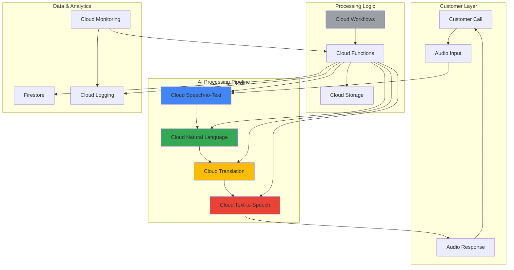

# Multi-Language Customer Support Automation with Cloud AI Services

## Problem

Global businesses struggle with providing consistent, high-quality customer support across multiple languages and time zones. Manual translation services are costly and slow, while human agents may not speak all customer languages fluently. This creates delays in issue resolution, inconsistent service quality, and customer dissatisfaction. Without automated multilingual support, companies lose customers and revenue due to communication barriers.

## Solution

Build an intelligent customer support system that automatically processes voice calls in multiple languages, analyzes customer sentiment, and provides real-time translated responses with natural speech output. The solution leverages Google Cloud AI services to create a seamless multilingual experience that scales globally while maintaining consistent service quality and reducing operational costs.

## Architecture Diagram



## Prerequisites

1. Google Cloud Project with billing enabled and appropriate IAM permissions
2. gcloud CLI installed and configured (version 400.0.0 or later)
3. Basic understanding of Google Cloud AI services and REST APIs
4. Familiarity with Cloud Functions and serverless architecture concepts
5. Estimated cost: $20-50 for testing (includes API calls, storage, and compute resources)

> **Note**: This solution uses Google Cloud AI APIs with pay-per-use pricing. Review the pricing documentation for [Speech-to-Text](https://cloud.google.com/speech-to-text/pricing), [Translation](https://cloud.google.com/translate/pricing), [Natural Language](https://cloud.google.com/natural-language/pricing), and [Text-to-Speech](https://cloud.google.com/text-to-speech/pricing) to understand costs for your expected usage volume.

## Preparation

```bash
# Set environment variables for GCP resources
export PROJECT_ID="multilang-support-$(date +%s)"
export REGION="us-central1"
export ZONE="us-central1-a"

# Generate unique suffix for resource names
RANDOM_SUFFIX=$(openssl rand -hex 3)
export BUCKET_NAME="customer-support-audio-${RANDOM_SUFFIX}"
export FUNCTION_NAME="multilang-processor-${RANDOM_SUFFIX}"
export WORKFLOW_NAME="support-workflow-${RANDOM_SUFFIX}"

# Set default project and region
gcloud config set project ${PROJECT_ID}
gcloud config set compute/region ${REGION}
gcloud config set compute/zone ${ZONE}

# Enable required APIs
gcloud services enable speech.googleapis.com
gcloud services enable translate.googleapis.com
gcloud services enable language.googleapis.com
gcloud services enable texttospeech.googleapis.com
gcloud services enable cloudfunctions.googleapis.com
gcloud services enable workflows.googleapis.com
gcloud services enable firestore.googleapis.com
gcloud services enable logging.googleapis.com
gcloud services enable monitoring.googleapis.com
gcloud services enable cloudbuild.googleapis.com

# Create Cloud Storage bucket for audio files
gsutil mb -p ${PROJECT_ID} \
    -c STANDARD \
    -l ${REGION} \
    gs://${BUCKET_NAME}

# Enable versioning for data protection
gsutil versioning set on gs://${BUCKET_NAME}

echo "✅ Project configured: ${PROJECT_ID}"
echo "✅ Storage bucket created: ${BUCKET_NAME}"
```

## Steps

1. **Create Firestore Database for Session Management**:

   Firestore provides a NoSQL document database that scales automatically and offers real-time synchronization capabilities. For customer support automation, Firestore serves as the central repository for conversation history, customer preferences, and session state management. This enables the system to maintain context across multiple interactions and provide personalized responses based on previous conversations.

   ```bash
   # Create Firestore database in Native mode
   gcloud firestore databases create \
       --region=${REGION} \
       --type=firestore-native
   
   # Create indexes for efficient querying
   gcloud firestore indexes composite create \
       --collection-group=conversations \
       --field-config field-path=customerId,order=ASCENDING \
       --field-config field-path=timestamp,order=DESCENDING
   
   echo "✅ Firestore database created and indexed"
   ```

   The Firestore database now provides persistent storage for conversation data with optimized indexing for customer lookup and chronological ordering. This foundation enables the system to track customer interactions, maintain conversation context, and provide personalized support experiences across multiple languages and channels.

2. **Configure Cloud Speech-to-Text for Multi-Language Recognition**:

   Cloud Speech-to-Text converts audio to text using Google's advanced neural network models trained on millions of hours of speech data. The service supports over 125 languages and variants, automatic language detection, and speaker diarization. Configuring speech recognition with multiple language models ensures accurate transcription regardless of the customer's native language.

   ```bash
   # Create configuration file for multi-language speech recognition
   cat << EOF > speech-config.json
   {
     "config": {
       "encoding": "WEBM_OPUS",
       "sampleRateHertz": 48000,
       "languageCode": "en-US",
       "alternativeLanguageCodes": ["es-ES", "fr-FR", "de-DE", "it-IT", "pt-BR"],
       "enableAutomaticPunctuation": true,
       "enableWordTimeOffsets": true,
       "enableSpeakerDiarization": true,
       "diarizationConfig": {
         "enableSpeakerDiarization": true,
         "minSpeakerCount": 1,
         "maxSpeakerCount": 2
       },
       "model": "latest_long"
     }
   }
   EOF
   
   # Upload configuration to Cloud Storage
   gsutil cp speech-config.json gs://${BUCKET_NAME}/config/
   
   echo "✅ Speech-to-Text configuration created"
   ```

   The speech recognition configuration is now optimized for customer support scenarios with automatic language detection, speaker separation, and enhanced accuracy for conversational speech. This enables the system to handle diverse customer accents and languages while maintaining high transcription accuracy.

3. **Set Up Cloud Translation for Real-Time Language Processing**:

   Cloud Translation provides neural machine translation capabilities that can translate between over 100 languages with high accuracy and natural-sounding output. The Advanced edition offers additional features like document translation, batch processing, and custom model training. For customer support, translation enables seamless communication between customers and support agents regardless of language barriers.

   ```bash
   # Create translation configuration with supported languages
   cat << EOF > translation-config.json
   {
     "supportedLanguages": [
       {"code": "en", "name": "English"},
       {"code": "es", "name": "Spanish"},
       {"code": "fr", "name": "French"},
       {"code": "de", "name": "German"},
       {"code": "it", "name": "Italian"},
       {"code": "pt", "name": "Portuguese"},
       {"code": "ja", "name": "Japanese"},
       {"code": "ko", "name": "Korean"},
       {"code": "zh", "name": "Chinese"}
     ],
     "defaultTargetLanguage": "en",
     "glossarySupport": true,
     "model": "nmt"
   }
   EOF
   
   # Upload translation configuration
   gsutil cp translation-config.json gs://${BUCKET_NAME}/config/
   
   echo "✅ Translation service configured"
   ```

   The translation service is now configured with comprehensive language support and automatic language detection. This enables the system to process customer inquiries in their native language and provide responses in the appropriate language, creating a more natural and accessible customer experience.

4. **Configure Cloud Natural Language for Sentiment Analysis**:

   Cloud Natural Language uses machine learning to analyze text and extract insights such as sentiment, entities, and syntax. For customer support, sentiment analysis helps identify frustrated customers, prioritize urgent issues, and tailor responses based on emotional context. This enables proactive support and improved customer satisfaction.

   ```bash
   # Create sentiment analysis configuration
   cat << EOF > sentiment-config.json
   {
     "features": {
       "sentiment": true,
       "entities": true,
       "entitySentiment": true,
       "syntax": false,
       "classification": true
     },
     "thresholds": {
       "negative": -0.2,
       "positive": 0.2,
       "urgency": -0.5
     },
     "entityTypes": [
       "PERSON",
       "ORGANIZATION",
       "LOCATION",
       "EVENT",
       "WORK_OF_ART",
       "CONSUMER_GOOD"
     ]
   }
   EOF
   
   # Upload sentiment configuration
   gsutil cp sentiment-config.json gs://${BUCKET_NAME}/config/
   
   echo "✅ Natural Language sentiment analysis configured"
   ```

   The sentiment analysis system is now configured to identify customer emotions and extract relevant entities from conversations. This enables the support system to automatically escalate negative sentiment cases, identify key topics, and provide contextually appropriate responses.

5. **Set Up Cloud Text-to-Speech for Natural Response Generation**:

   Cloud Text-to-Speech converts text into natural-sounding speech using WaveNet and Neural2 voices. The service supports multiple languages, voice types, and speaking styles. For customer support, natural speech output creates more engaging and accessible interactions, especially for customers who prefer audio communication.

   ```bash
   # Create Text-to-Speech configuration
   cat << EOF > tts-config.json
   {
     "voices": {
       "en-US": {
         "name": "en-US-Neural2-J",
         "ssmlGender": "FEMALE",
         "languageCode": "en-US"
       },
       "es-ES": {
         "name": "es-ES-Neural2-F",
         "ssmlGender": "FEMALE",
         "languageCode": "es-ES"
       },
       "fr-FR": {
         "name": "fr-FR-Neural2-C",
         "ssmlGender": "FEMALE",
         "languageCode": "fr-FR"
       },
       "de-DE": {
         "name": "de-DE-Neural2-F",
         "ssmlGender": "FEMALE",
         "languageCode": "de-DE"
       }
     },
     "audioConfig": {
       "audioEncoding": "MP3",
       "speakingRate": 1.0,
       "pitch": 0.0,
       "volumeGainDb": 0.0
     }
   }
   EOF
   
   # Upload TTS configuration
   gsutil cp tts-config.json gs://${BUCKET_NAME}/config/
   
   echo "✅ Text-to-Speech service configured"
   ```

   The text-to-speech system is now configured with natural-sounding voices in multiple languages. This enables the system to generate audio responses that sound professional and engaging, improving the overall customer experience through voice-based interactions.

6. **Deploy Cloud Function for AI Service Orchestration**:

   Cloud Functions provides serverless compute that automatically scales based on demand. For the multilingual support system, Cloud Functions orchestrates the AI services pipeline, handling the flow from speech-to-text through translation and sentiment analysis to text-to-speech. This serverless approach ensures cost-effective operation and automatic scaling.

   ```bash
   # Create the main processing function
   mkdir -p multilang-function
   cd multilang-function
   
   # Create requirements.txt
   cat << EOF > requirements.txt
   functions-framework>=3.2.0
   google-cloud-speech>=2.21.0
   google-cloud-translate>=3.12.0
   google-cloud-language>=2.11.0
   google-cloud-texttospeech>=2.16.0
   google-cloud-firestore>=2.13.0
   google-cloud-storage>=2.12.0
   flask>=2.3.3
   EOF
   
   # Create main.py
   cat << 'EOF' > main.py
   import functions_framework
   import json
   import logging
   import os
   from google.cloud import speech
   from google.cloud import translate_v2 as translate
   from google.cloud import language_v1
   from google.cloud import texttospeech
   from google.cloud import firestore
   from google.cloud import storage
   import base64
   import datetime
   
   # Initialize clients
   speech_client = speech.SpeechClient()
   translate_client = translate.Client()
   language_client = language_v1.LanguageServiceClient()
   tts_client = texttospeech.TextToSpeechClient()
   db = firestore.Client()
   storage_client = storage.Client()
   
   @functions_framework.http
   def process_customer_audio(request):
       """Process customer audio through AI pipeline"""
       try:
           # Parse request
           request_json = request.get_json()
           if not request_json or 'audio_data' not in request_json:
               return {'error': 'Invalid request format'}, 400
               
           audio_data = base64.b64decode(request_json['audio_data'])
           customer_id = request_json.get('customer_id', 'anonymous')
           session_id = request_json.get('session_id', 'default')
           
           # Step 1: Speech-to-Text
           audio = speech.RecognitionAudio(content=audio_data)
           config = speech.RecognitionConfig(
               encoding=speech.RecognitionConfig.AudioEncoding.WEBM_OPUS,
               sample_rate_hertz=48000,
               language_code="en-US",
               alternative_language_codes=["es-ES", "fr-FR", "de-DE", "it-IT", "pt-BR"],
               enable_automatic_punctuation=True,
           )
           
           response = speech_client.recognize(config=config, audio=audio)
           
           if not response.results:
               return {'error': 'No speech detected'}, 400
           
           transcript = response.results[0].alternatives[0].transcript
           detected_language = response.results[0].language_code if hasattr(response.results[0], 'language_code') else 'en-US'
           
           # Step 2: Sentiment Analysis
           document = language_v1.Document(
               content=transcript,
               type_=language_v1.Document.Type.PLAIN_TEXT
           )
           
           sentiment_response = language_client.analyze_sentiment(
               request={'document': document}
           )
           
           sentiment_score = sentiment_response.document_sentiment.score
           sentiment_magnitude = sentiment_response.document_sentiment.magnitude
           
           # Step 3: Translation (if needed)
           detected_lang_code = detected_language.split('-')[0] if '-' in detected_language else detected_language
           if detected_lang_code != 'en':
               translation = translate_client.translate(
                   transcript,
                   target_language='en',
                   source_language=detected_lang_code
               )
               translated_text = translation['translatedText']
           else:
               translated_text = transcript
           
           # Step 4: Generate response based on sentiment
           if sentiment_score < -0.2:
               response_text = "I understand your frustration. Let me help you resolve this issue immediately."
           elif sentiment_score > 0.2:
               response_text = "Thank you for your positive feedback! How can I assist you further?"
           else:
               response_text = "I understand your concern. Let me help you with that."
           
           # Step 5: Translate response back to customer language
           if detected_lang_code != 'en':
               response_translation = translate_client.translate(
                   response_text,
                   target_language=detected_lang_code,
                   source_language='en'
               )
               final_response = response_translation['translatedText']
           else:
               final_response = response_text
           
           # Step 6: Text-to-Speech
           synthesis_input = texttospeech.SynthesisInput(text=final_response)
           
           # Select voice based on detected language
           voice_config = {
               'en': texttospeech.VoiceSelectionParams(
                   language_code="en-US",
                   name="en-US-Neural2-J",
                   ssml_gender=texttospeech.SsmlVoiceGender.FEMALE
               ),
               'es': texttospeech.VoiceSelectionParams(
                   language_code="es-ES",
                   name="es-ES-Neural2-F",
                   ssml_gender=texttospeech.SsmlVoiceGender.FEMALE
               ),
               'fr': texttospeech.VoiceSelectionParams(
                   language_code="fr-FR",
                   name="fr-FR-Neural2-C",
                   ssml_gender=texttospeech.SsmlVoiceGender.FEMALE
               )
           }
           
           voice = voice_config.get(detected_lang_code, voice_config['en'])
           audio_config = texttospeech.AudioConfig(
               audio_encoding=texttospeech.AudioEncoding.MP3
           )
           
           tts_response = tts_client.synthesize_speech(
               input=synthesis_input,
               voice=voice,
               audio_config=audio_config
           )
           
           # Step 7: Store conversation in Firestore
           conversation_data = {
               'customer_id': customer_id,
               'session_id': session_id,
               'timestamp': datetime.datetime.utcnow(),
               'original_text': transcript,
               'detected_language': detected_language,
               'translated_text': translated_text,
               'sentiment_score': sentiment_score,
               'sentiment_magnitude': sentiment_magnitude,
               'response_text': final_response,
               'processed': True
           }
           
           db.collection('conversations').add(conversation_data)
           
           # Return response
           return {
               'transcript': transcript,
               'detected_language': detected_language,
               'sentiment_score': sentiment_score,
               'response_text': final_response,
               'audio_response': base64.b64encode(tts_response.audio_content).decode('utf-8')
           }
           
       except Exception as e:
           logging.error(f"Error processing audio: {str(e)}")
           return {'error': str(e)}, 500
   EOF
   
   # Deploy the function
   gcloud functions deploy ${FUNCTION_NAME} \
       --gen2 \
       --runtime python311 \
       --trigger-http \
       --allow-unauthenticated \
       --region=${REGION} \
       --memory=1Gi \
       --timeout=60s \
       --set-env-vars="BUCKET_NAME=${BUCKET_NAME}"
   
   cd ..
   
   echo "✅ Cloud Function deployed: ${FUNCTION_NAME}"
   ```

   The Cloud Function now provides a serverless endpoint that orchestrates the entire AI pipeline. It processes incoming audio, detects language, analyzes sentiment, generates appropriate responses, and returns audio output. This creates a complete multilingual customer support automation system that scales automatically with demand.

7. **Create Cloud Workflows for Complex Support Scenarios**:

   Cloud Workflows orchestrates complex business processes by connecting multiple services and APIs. For customer support, workflows handle escalation procedures, routing based on sentiment analysis, and integration with existing support systems. This ensures consistent handling of complex scenarios while maintaining audit trails.

   ```bash
   # Create workflow definition
   cat << EOF > support-workflow.yaml
   main:
     params: [args]
     steps:
       - init:
           assign:
             - customer_id: \${args.customer_id}
             - audio_data: \${args.audio_data}
             - session_id: \${args.session_id}
       
       - process_audio:
           call: http.post
           args:
             url: https://${REGION}-${PROJECT_ID}.cloudfunctions.net/${FUNCTION_NAME}
             body:
               customer_id: \${customer_id}
               audio_data: \${audio_data}
               session_id: \${session_id}
           result: processing_result
       
       - check_sentiment:
           switch:
             - condition: \${processing_result.body.sentiment_score < -0.5}
               next: escalate_to_human
             - condition: \${processing_result.body.sentiment_score > 0.5}
               next: send_satisfaction_survey
           next: log_interaction
       
       - escalate_to_human:
           call: http.post
           args:
             url: https://your-support-system.example.com/escalate
             body:
               customer_id: \${customer_id}
               session_id: \${session_id}
               urgency: "high"
               sentiment_score: \${processing_result.body.sentiment_score}
           next: log_interaction
       
       - send_satisfaction_survey:
           call: http.post
           args:
             url: https://your-survey-system.example.com/send
             body:
               customer_id: \${customer_id}
               session_id: \${session_id}
               language: \${processing_result.body.detected_language}
           next: log_interaction
       
       - log_interaction:
           call: sys.log
           args:
             data: \${processing_result.body}
             severity: "INFO"
       
       - return_response:
           return: \${processing_result.body}
   EOF
   
   # Deploy workflow
   gcloud workflows deploy ${WORKFLOW_NAME} \
       --source=support-workflow.yaml \
       --location=${REGION}
   
   echo "✅ Workflow deployed: ${WORKFLOW_NAME}"
   ```

   The workflow system now provides intelligent routing and escalation capabilities based on sentiment analysis. It automatically escalates frustrated customers to human agents, sends satisfaction surveys to happy customers, and maintains comprehensive logging for all interactions.

8. **Set Up Monitoring and Alerting**:

   Cloud Monitoring provides comprehensive observability for the multilingual support system. Monitoring tracks API usage, response times, error rates, and sentiment trends. Alerting ensures rapid response to issues and helps maintain service quality. This operational visibility is crucial for maintaining high-quality customer support.

   ```bash
   # Create log-based metric for sentiment tracking
   gcloud logging metrics create sentiment_score \
       --description="Track customer sentiment scores" \
       --log-filter="resource.type=\"cloud_function\" AND jsonPayload.sentiment_score EXISTS" \
       --value-extractor="EXTRACT(jsonPayload.sentiment_score)"
   
   # Create alerting policy for negative sentiment
   gcloud alpha monitoring policies create \
       --policy-from-file=<(cat << EOF
   {
     "displayName": "High Negative Sentiment Alert",
     "conditions": [
       {
         "displayName": "Negative sentiment threshold",
         "conditionThreshold": {
           "filter": "resource.type=\"cloud_function\" AND metric.type=\"logging.googleapis.com/user/sentiment_score\"",
           "comparison": "COMPARISON_LESS_THAN",
           "thresholdValue": -0.5,
           "duration": "300s",
           "aggregations": [
             {
               "alignmentPeriod": "60s",
               "perSeriesAligner": "ALIGN_MEAN"
             }
           ]
         }
       }
     ],
     "alertStrategy": {
       "autoClose": "1800s"
     },
     "enabled": true
   }
   EOF
   )
   
   echo "✅ Monitoring and alerting configured"
   ```

   The monitoring system now provides real-time visibility into customer sentiment trends, system performance, and error rates. Automated alerts notify support teams when negative sentiment patterns emerge, enabling proactive intervention and service improvement.

## Validation & Testing

1. **Test Speech-to-Text Processing**:

   ```bash
   # Download a test audio file
   curl -o test-audio.wav \
       "https://storage.googleapis.com/cloud-samples-data/speech/brooklyn.wav"
   
   # Test speech recognition using client libraries (Python example)
   python3 -c "
   from google.cloud import speech
   client = speech.SpeechClient()
   with open('test-audio.wav', 'rb') as audio_file:
       content = audio_file.read()
   audio = speech.RecognitionAudio(content=content)
   config = speech.RecognitionConfig(
       encoding=speech.RecognitionConfig.AudioEncoding.LINEAR16,
       sample_rate_hertz=16000,
       language_code='en-US'
   )
   response = client.recognize(config=config, audio=audio)
   for result in response.results:
       print('Transcript: {}'.format(result.alternatives[0].transcript))
   "
   ```

   Expected output: Transcript of the audio file content

2. **Test Multi-Language Translation**:

   ```bash
   # Test translation using Python client library
   python3 -c "
   from google.cloud import translate_v2 as translate
   client = translate.Client()
   result = client.translate('Necesito ayuda con mi pedido urgentemente', source_language='es', target_language='en')
   print('Original: Necesito ayuda con mi pedido urgentemente')
   print('Translation: {}'.format(result['translatedText']))
   "
   ```

   Expected output: Translated text from Spanish to English

3. **Test Sentiment Analysis**:

   ```bash
   # Test sentiment analysis using Python client library  
   python3 -c "
   from google.cloud import language_v1
   client = language_v1.LanguageServiceClient()
   text = 'I love this product! It is amazing!'
   document = language_v1.Document(content=text, type_=language_v1.Document.Type.PLAIN_TEXT)
   response = client.analyze_sentiment(request={'document': document})
   sentiment = response.document_sentiment
   print('Text: {}'.format(text))
   print('Sentiment score: {}'.format(sentiment.score))
   print('Sentiment magnitude: {}'.format(sentiment.magnitude))
   "
   ```

   Expected output: Sentiment scores ranging from -1.0 to 1.0

4. **Test End-to-End Function**:

   ```bash
   # Create test payload with base64 encoded audio
   cat << EOF > test-payload.json
   {
     "audio_data": "$(base64 -w 0 test-audio.wav)",
     "customer_id": "test-customer-123",
     "session_id": "test-session-456"
   }
   EOF
   
   # Test the Cloud Function
   curl -X POST \
       -H "Content-Type: application/json" \
       -d @test-payload.json \
       "https://${REGION}-${PROJECT_ID}.cloudfunctions.net/${FUNCTION_NAME}"
   ```

   Expected output: Complete processing result with transcript, sentiment, and audio response

## Cleanup

1. **Delete Cloud Functions**:

   ```bash
   # Delete the processing function
   gcloud functions delete ${FUNCTION_NAME} \
       --region=${REGION} \
       --quiet
   
   echo "✅ Cloud Function deleted"
   ```

2. **Delete Workflows**:

   ```bash
   # Delete workflow
   gcloud workflows delete ${WORKFLOW_NAME} \
       --location=${REGION} \
       --quiet
   
   echo "✅ Workflow deleted"
   ```

3. **Delete Firestore Database**:

   ```bash
   # Delete Firestore database (requires manual confirmation)
   gcloud firestore databases delete \
       --database="(default)" \
       --quiet
   
   echo "✅ Firestore database deleted"
   ```

4. **Delete Storage Resources**:

   ```bash
   # Delete storage bucket and contents
   gsutil -m rm -r gs://${BUCKET_NAME}
   
   echo "✅ Storage bucket deleted"
   ```

5. **Clean Up Local Files**:

   ```bash
   # Remove local files
   rm -rf multilang-function/
   rm -f speech-config.json translation-config.json
   rm -f sentiment-config.json tts-config.json
   rm -f support-workflow.yaml
   rm -f test-payload.json test-audio.wav
   
   echo "✅ Local files cleaned up"
   ```

## Discussion

This multilingual customer support automation system demonstrates the power of combining Google Cloud AI services to create sophisticated, scalable solutions. The architecture leverages Cloud Speech-to-Text for accurate voice recognition across multiple languages, Cloud Translation for seamless language conversion, Cloud Natural Language for sentiment analysis, and Cloud Text-to-Speech for natural response generation.

The serverless approach using Cloud Functions provides cost-effective scaling, automatically handling varying loads without manual intervention. The system processes customer inquiries through a complete AI pipeline: speech recognition, sentiment analysis, intelligent response generation, and natural voice synthesis. This creates a consistent, high-quality customer experience regardless of language barriers.

The sentiment analysis component adds intelligent routing capabilities, automatically escalating frustrated customers to human agents while providing satisfaction surveys to happy customers. This proactive approach improves customer satisfaction and enables support teams to focus on complex issues requiring human intervention. The Firestore integration maintains conversation history, enabling personalized responses and continuous improvement through data analysis.

Monitoring and alerting ensure operational excellence by tracking key metrics such as sentiment trends, response times, and error rates. This visibility enables support teams to identify issues before they impact customers and continuously optimize the system based on real-world usage patterns. The solution follows Google Cloud best practices for security, scalability, and cost optimization.

> **Tip**: Consider implementing custom terminology glossaries in Cloud Translation to ensure consistent translation of domain-specific terms and company-specific language. This improves accuracy for technical support scenarios.

For production deployment, consider implementing additional features such as conversation context management, integration with existing CRM systems, and advanced analytics for customer behavior insights. The system can be extended to support chat interfaces, email processing, and omnichannel customer experiences. Regular model retraining and performance optimization ensure continued accuracy and efficiency as usage patterns evolve.

**Referenced Documentation:**
- [Cloud Speech-to-Text Documentation](https://cloud.google.com/speech-to-text/docs)
- [Cloud Translation Documentation](https://cloud.google.com/translate/docs)
- [Cloud Natural Language Documentation](https://cloud.google.com/natural-language/docs)
- [Cloud Text-to-Speech Documentation](https://cloud.google.com/text-to-speech/docs)
- [Google Cloud AI Best Practices](https://cloud.google.com/ai-platform/docs/technical-overview)

## Challenge

Extend this solution by implementing these enhancements:

1. **Implement Real-Time Streaming**: Add support for real-time audio streaming using Cloud Speech-to-Text streaming API and WebSockets for live conversation processing with immediate response generation.

2. **Add Custom Entity Recognition**: Train custom models using AutoML Entity Extraction to identify company-specific terms, product names, and domain-specific entities for more accurate sentiment analysis and response generation.

3. **Create Conversation Context Management**: Implement conversation memory using Firestore to maintain context across multiple interactions, enabling more personalized and contextually aware responses.

4. **Integrate with CRM Systems**: Connect the system to Salesforce, HubSpot, or other CRM platforms to automatically create tickets, update customer records, and trigger follow-up workflows based on sentiment analysis.

5. **Implement Advanced Analytics Dashboard**: Build a comprehensive analytics dashboard using BigQuery and Looker Studio to track customer satisfaction trends, language usage patterns, and support effectiveness metrics across different regions and languages.

## Infrastructure Code

*Infrastructure code will be generated after recipe approval.*