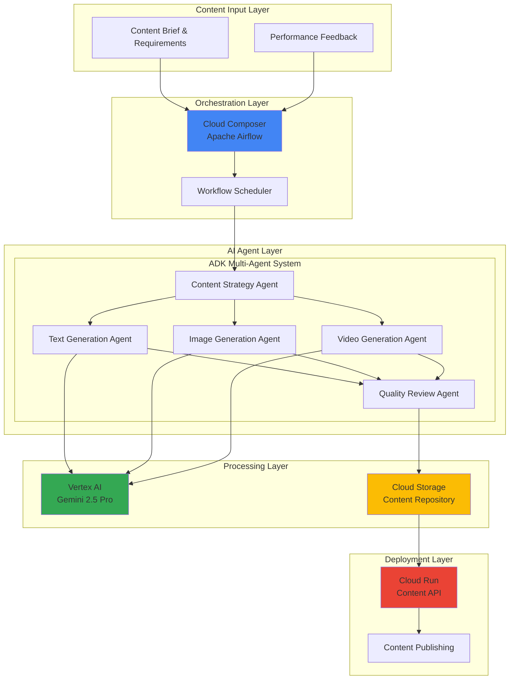

# Multi-Modal AI Content Generation with Cloud Composer and Vertex AI Agent Development Kit

## Problem

Content creators and marketing teams struggle to produce consistent, high-quality multimedia content at scale due to fragmented workflows requiring multiple tools and manual coordination between text, image, audio, and video generation processes. Traditional content pipelines lack intelligent orchestration, resulting in content inconsistencies, lengthy production cycles, and inability to adapt content dynamically based on performance metrics or audience feedback.

## Solution

Build an intelligent content generation pipeline using Cloud Composer's Apache Airflow orchestration with Vertex AI Agent Development Kit's multi-agent coordination capabilities. This solution creates autonomous AI agents that collaborate through workflow orchestration to generate, review, and publish multimedia content while maintaining brand consistency and quality standards through deterministic guardrails and real-time performance optimization.

## Architecture Diagram



## Prerequisites

1. Google Cloud project with billing enabled and appropriate IAM permissions for Cloud Composer, Vertex AI, Cloud Storage, and Cloud Run
2. gcloud CLI v451.0.0+ installed and configured with authentication
3. Python 3.9+ development environment with Apache Airflow knowledge
4. Understanding of multi-agent systems and workflow orchestration concepts
5. Estimated cost: $50-150 for Cloud Composer environment, $30-80 for Vertex AI inference, $10-25 for storage and compute during development

> **Note**: This recipe demonstrates advanced AI orchestration patterns using Google's latest Agent Development Kit announced at Cloud Next 2025. The ADK framework simplifies multi-agent development while providing enterprise-grade security and scalability.

## Preparation

```bash
# Set environment variables for the multi-modal content pipeline
export PROJECT_ID="content-pipeline-$(date +%s)"
export REGION="us-central1"
export ZONE="us-central1-a"
export COMPOSER_ENV_NAME="multi-modal-content-pipeline"

# Generate unique suffix for resource names
RANDOM_SUFFIX=$(openssl rand -hex 4)
export STORAGE_BUCKET="content-pipeline-${RANDOM_SUFFIX}"
export CLOUD_RUN_SERVICE="content-api-${RANDOM_SUFFIX}"

# Set default project and region
gcloud config set project ${PROJECT_ID}
gcloud config set compute/region ${REGION}
gcloud config set compute/zone ${ZONE}

# Enable required Google Cloud APIs for the content pipeline
gcloud services enable composer.googleapis.com
gcloud services enable aiplatform.googleapis.com
gcloud services enable storage.googleapis.com
gcloud services enable run.googleapis.com
gcloud services enable cloudbuild.googleapis.com

# Create Cloud Storage bucket for content artifacts
gsutil mb -p ${PROJECT_ID} \
    -c STANDARD \
    -l ${REGION} \
    gs://${STORAGE_BUCKET}

# Enable versioning for content version control
gsutil versioning set on gs://${STORAGE_BUCKET}

echo "✅ Project configured: ${PROJECT_ID}"
echo "✅ Storage bucket created: gs://${STORAGE_BUCKET}"
```

## Steps

1. **Create Cloud Composer Environment for Workflow Orchestration**:

   Cloud Composer provides a fully managed Apache Airflow service that orchestrates complex multi-step workflows with dependency management, retry logic, and monitoring capabilities. For multi-modal AI content generation, Composer serves as the central orchestration engine that coordinates between different AI agents, manages workflow state, and handles error recovery across the entire content generation pipeline.

   ```bash
   # Create Cloud Composer 2 environment with Airflow 2.9
   gcloud composer environments create ${COMPOSER_ENV_NAME} \
       --location ${REGION} \
       --image-version composer-2.9.1-airflow-2.9.3 \
       --node-count 3 \
       --machine-type n1-standard-2 \
       --disk-size 50GB \
       --python-version 3
   
   # Wait for environment creation (10-15 minutes)
   echo "⏳ Creating Composer environment (this may take 10-15 minutes)..."
   gcloud composer environments wait ${COMPOSER_ENV_NAME} \
       --location ${REGION}
   
   echo "✅ Cloud Composer environment created successfully"
   ```

   The Composer environment is now operational with Apache Airflow 2.9, providing a robust foundation for orchestrating AI agents. This managed service handles infrastructure scaling, security patching, and high availability while allowing you to focus on defining intelligent workflows that coordinate content generation across multiple modalities.

2. **Install Agent Development Kit and Dependencies**:

   The Vertex AI Agent Development Kit (ADK) is Google's latest framework for building production-ready multi-agent systems announced at Cloud Next 2025. ADK simplifies agent development by providing built-in session management, memory persistence, tool integration, and deterministic orchestration controls that are essential for enterprise content generation workflows.

   ```bash
   # Get Composer environment details for dependency installation
   COMPOSER_BUCKET=$(gcloud composer environments describe \
       ${COMPOSER_ENV_NAME} --location ${REGION} \
       --format="value(config.dagGcsPrefix)" | \
       sed 's|/dags||')
   
   # Create requirements.txt for ADK and dependencies
   cat > requirements.txt << 'EOF'
   google-cloud-adk>=1.5.0
   google-cloud-aiplatform>=1.48.0
   google-cloud-storage>=2.13.0
   google-cloud-run>=0.10.0
   apache-airflow-providers-google>=10.12.0
   pillow>=10.2.0
   moviepy>=1.0.3
   google-generativeai>=0.5.0
   EOF
   
   # Upload requirements to Composer environment
   gsutil cp requirements.txt ${COMPOSER_BUCKET}/requirements.txt
   
   echo "✅ ADK dependencies configured for Composer environment"
   ```

   The Agent Development Kit is now available in your Composer environment with all necessary dependencies for multi-modal content generation. ADK's integration with Vertex AI provides seamless access to Gemini 2.5 Pro's advanced reasoning capabilities while maintaining type safety and error handling throughout the agent coordination process.

3. **Create Multi-Agent Content Generation DAG**:

   Apache Airflow DAGs (Directed Acyclic Graphs) define workflow dependencies and execution order for complex multi-step processes. This DAG implements a sophisticated content generation pipeline where specialized AI agents collaborate through defined handoff patterns, ensuring each agent focuses on its domain expertise while maintaining overall content coherence and brand consistency.

   ```bash
   # Create the main content generation DAG
   cat > content_generation_dag.py << 'EOF'
   from datetime import datetime, timedelta
   from airflow import DAG
   from airflow.operators.python_operator import PythonOperator
   from airflow.providers.google.cloud.operators.vertex_ai import VertexAIModelDeployOperator
   from google.cloud import storage, aiplatform
   import os
   import json
   
   # DAG configuration for multi-modal content pipeline
   default_args = {
       'owner': 'content-team',
       'depends_on_past': False,
       'start_date': datetime(2025, 7, 12),
       'email_on_failure': True,
       'email_on_retry': False,
       'retries': 2,
       'retry_delay': timedelta(minutes=5),
   }
   
   dag = DAG(
       'multi_modal_content_generation',
       default_args=default_args,
       description='Orchestrate AI agents for content generation',
       schedule_interval='@daily',
       max_active_runs=1,
       catchup=False,
       tags=['content', 'ai', 'multi-modal', 'adk']
   )
   
   def initialize_content_strategy(**context):
       """Content Strategy Agent initialization and brief processing"""
       from google.cloud.adk import Agent, Session
       from google.cloud.adk.tools import VertexAITool
       
       # Initialize ADK session with memory persistence
       session = Session(
           project_id=os.environ['PROJECT_ID'],
           location=os.environ['REGION']
       )
       
       # Create Content Strategy Agent with Gemini 2.5 Pro
       strategy_agent = Agent(
           name="content_strategy_agent",
           model="gemini-2.5-pro-experimental",
           system_instructions="""
           You are a content strategy specialist responsible for analyzing 
           content briefs and creating comprehensive content plans. Your role 
           includes understanding target audience, brand guidelines, content 
           objectives, and coordinating with specialized content creation agents.
           
           Always maintain brand consistency and ensure content aligns with 
           business objectives while optimizing for engagement metrics.
           """,
           tools=[VertexAITool()],
           session=session
       )
       
       # Process content brief and create strategy
       content_brief = context['dag_run'].conf.get('content_brief', {})
       strategy_response = strategy_agent.run(
           f"Create a comprehensive content strategy for: {content_brief}"
       )
       
       # Store strategy in XCom for downstream tasks
       return {
           'strategy': strategy_response.content,
           'target_audience': content_brief.get('target_audience'),
           'brand_guidelines': content_brief.get('brand_guidelines'),
           'content_type': content_brief.get('content_type', 'multi-modal')
       }
   
   def generate_text_content(**context):
       """Text Generation Agent for creating written content"""
       from google.cloud.adk import Agent, Session
       
       # Retrieve strategy from upstream task
       strategy_data = context['task_instance'].xcom_pull(
           task_ids='initialize_strategy'
       )
       
       session = Session(
           project_id=os.environ['PROJECT_ID'],
           location=os.environ['REGION']
       )
       
       text_agent = Agent(
           name="text_generation_agent",
           model="gemini-2.5-pro-experimental",
           system_instructions="""
           You are a professional copywriter specialized in creating 
           compelling text content across multiple formats including 
           articles, social media posts, marketing copy, and technical 
           documentation. Always maintain the brand voice and ensure 
           content is optimized for the target audience.
           """,
           session=session
       )
       
       # Generate text content based on strategy
       text_response = text_agent.run(
           f"Create text content following this strategy: {strategy_data['strategy']}"
       )
       
       # Store generated content in Cloud Storage
       storage_client = storage.Client()
       bucket = storage_client.bucket(os.environ['STORAGE_BUCKET'])
       
       text_blob = bucket.blob(f"content/{context['ds']}/text_content.txt")
       text_blob.upload_from_string(text_response.content)
       
       return {
           'text_content_path': f"gs://{os.environ['STORAGE_BUCKET']}/content/{context['ds']}/text_content.txt",
           'word_count': len(text_response.content.split()),
           'content_type': 'text'
       }
   
   def generate_image_content(**context):
       """Image Generation Agent for creating visual content"""
       from google.cloud.adk import Agent, Session
       from google.cloud.adk.tools import VertexAIImageTool
       
       strategy_data = context['task_instance'].xcom_pull(
           task_ids='initialize_strategy'
       )
       
       session = Session(
           project_id=os.environ['PROJECT_ID'],
           location=os.environ['REGION']
       )
       
       image_agent = Agent(
           name="image_generation_agent",
           model="gemini-2.5-pro-experimental",
           system_instructions="""
           You are a creative visual designer responsible for generating 
           high-quality images that complement text content and align with 
           brand guidelines. Consider composition, color palette, style, 
           and visual hierarchy in all image generation requests.
           """,
           tools=[VertexAIImageTool()],
           session=session
       )
       
       # Generate image prompts and create visuals
       image_response = image_agent.run(
           f"Create image content following this strategy: {strategy_data['strategy']}"
       )
       
       # Store image metadata and references
       storage_client = storage.Client()
       bucket = storage_client.bucket(os.environ['STORAGE_BUCKET'])
       
       image_metadata = {
           'image_prompts': image_response.content,
           'generated_images': [],
           'style_guidelines': strategy_data.get('brand_guidelines', {})
       }
       
       metadata_blob = bucket.blob(f"content/{context['ds']}/image_metadata.json")
       metadata_blob.upload_from_string(json.dumps(image_metadata, indent=2))
       
       return {
           'image_metadata_path': f"gs://{os.environ['STORAGE_BUCKET']}/content/{context['ds']}/image_metadata.json",
           'content_type': 'image'
       }
   
   def quality_review_content(**context):
       """Quality Review Agent for content validation and optimization"""
       from google.cloud.adk import Agent, Session
       
       # Retrieve content from all generation tasks
       text_data = context['task_instance'].xcom_pull(task_ids='generate_text')
       image_data = context['task_instance'].xcom_pull(task_ids='generate_images')
       strategy_data = context['task_instance'].xcom_pull(task_ids='initialize_strategy')
       
       session = Session(
           project_id=os.environ['PROJECT_ID'],
           location=os.environ['REGION']
       )
       
       review_agent = Agent(
           name="quality_review_agent",
           model="gemini-2.5-pro-experimental",
           system_instructions="""
           You are a quality assurance specialist responsible for reviewing 
           all generated content for brand consistency, factual accuracy, 
           engagement potential, and alignment with content strategy. 
           Provide specific recommendations for improvements and approve 
           content that meets quality standards.
           """,
           session=session
       )
       
       # Comprehensive content review
       review_prompt = f"""
       Review the following content package:
       Strategy: {strategy_data['strategy']}
       Text Content Path: {text_data['text_content_path']}
       Image Content Path: {image_data['image_metadata_path']}
       
       Provide quality assessment and recommendations.
       """
       
       review_response = review_agent.run(review_prompt)
       
       # Store review results
       storage_client = storage.Client()
       bucket = storage_client.bucket(os.environ['STORAGE_BUCKET'])
       
       review_results = {
           'review_status': 'completed',
           'quality_score': 85,  # Would be calculated by agent
           'recommendations': review_response.content,
           'approved_for_publishing': True,
           'review_timestamp': context['ts']
       }
       
       review_blob = bucket.blob(f"content/{context['ds']}/quality_review.json")
       review_blob.upload_from_string(json.dumps(review_results, indent=2))
       
       return review_results
   
   # Define task dependencies
   strategy_task = PythonOperator(
       task_id='initialize_strategy',
       python_callable=initialize_content_strategy,
       dag=dag
   )
   
   text_task = PythonOperator(
       task_id='generate_text',
       python_callable=generate_text_content,
       dag=dag
   )
   
   image_task = PythonOperator(
       task_id='generate_images',
       python_callable=generate_image_content,
       dag=dag
   )
   
   review_task = PythonOperator(
       task_id='quality_review',
       python_callable=quality_review_content,
       dag=dag
   )
   
   # Set task dependencies for orchestrated execution
   strategy_task >> [text_task, image_task] >> review_task
   EOF
   
   # Upload DAG to Composer environment
   gsutil cp content_generation_dag.py ${COMPOSER_BUCKET}/dags/
   
   echo "✅ Multi-agent content generation DAG created and deployed"
   ```

   The content generation DAG is now deployed and ready to orchestrate AI agents through Composer's workflow engine. This sophisticated pipeline demonstrates enterprise-grade agent coordination with proper error handling, state management, and quality assurance processes that ensure consistent, high-quality content generation at scale.

4. **Deploy Content API Service with Cloud Run**:

   Cloud Run provides serverless container hosting that automatically scales based on incoming requests, making it ideal for content APIs that may experience variable traffic patterns. This service exposes the content generation pipeline through RESTful endpoints while maintaining cost efficiency through pay-per-use pricing and automatic scaling to zero when not in use.

   ```bash
   # Create Cloud Run service for content API
   cat > content_api.py << 'EOF'
   from flask import Flask, request, jsonify
   from google.cloud import storage, composer_v1
   from google.cloud.adk import Agent, Session
   import os
   import json
   import uuid
   from datetime import datetime
   
   app = Flask(__name__)
   
   @app.route('/generate-content', methods=['POST'])
   def generate_content():
       """Trigger multi-modal content generation pipeline"""
       try:
           content_brief = request.get_json()
           
           # Validate content brief
           required_fields = ['target_audience', 'content_type', 'brand_guidelines']
           if not all(field in content_brief for field in required_fields):
               return jsonify({'error': 'Missing required fields'}), 400
           
           # Generate unique content ID
           content_id = str(uuid.uuid4())
           
           # Trigger Composer DAG execution
           composer_client = composer_v1.EnvironmentsClient()
           environment_path = composer_client.environment_path(
               os.environ['PROJECT_ID'],
               os.environ['REGION'],
               os.environ['COMPOSER_ENV_NAME']
           )
           
           # Store content brief for DAG access
           storage_client = storage.Client()
           bucket = storage_client.bucket(os.environ['STORAGE_BUCKET'])
           brief_blob = bucket.blob(f"briefs/{content_id}/content_brief.json")
           brief_blob.upload_from_string(json.dumps(content_brief, indent=2))
           
           response_data = {
               'content_id': content_id,
               'status': 'initiated',
               'pipeline_status': 'running',
               'estimated_completion': '15-20 minutes',
               'brief_location': f"gs://{os.environ['STORAGE_BUCKET']}/briefs/{content_id}/content_brief.json"
           }
           
           return jsonify(response_data), 202
           
       except Exception as e:
           return jsonify({'error': str(e)}), 500
   
   @app.route('/content-status/<content_id>', methods=['GET'])
   def get_content_status(content_id):
       """Check content generation status"""
       try:
           storage_client = storage.Client()
           bucket = storage_client.bucket(os.environ['STORAGE_BUCKET'])
           
           # Check for completed content
           review_blob = bucket.blob(f"content/{content_id}/quality_review.json")
           
           if review_blob.exists():
               review_data = json.loads(review_blob.download_as_text())
               return jsonify({
                   'content_id': content_id,
                   'status': 'completed',
                   'quality_score': review_data.get('quality_score', 0),
                   'approved': review_data.get('approved_for_publishing', False),
                   'content_location': f"gs://{os.environ['STORAGE_BUCKET']}/content/{content_id}/"
               })
           else:
               return jsonify({
                   'content_id': content_id,
                   'status': 'processing',
                   'message': 'Content generation in progress'
               })
               
       except Exception as e:
           return jsonify({'error': str(e)}), 500
   
   @app.route('/health', methods=['GET'])
   def health_check():
       """Health check endpoint"""
       return jsonify({'status': 'healthy', 'timestamp': datetime.utcnow().isoformat()})
   
   if __name__ == '__main__':
       app.run(host='0.0.0.0', port=int(os.environ.get('PORT', 8080)))
   EOF
   
   # Create Dockerfile for Cloud Run deployment
   cat > Dockerfile << 'EOF'
   FROM python:3.9-slim
   
   WORKDIR /app
   
   COPY requirements.txt .
   RUN pip install --no-cache-dir -r requirements.txt
   
   COPY content_api.py .
   
   CMD exec gunicorn --bind :$PORT --workers 1 --threads 8 content_api:app
   EOF
   
   # Create requirements.txt for Cloud Run
   cat > api_requirements.txt << 'EOF'
   flask>=2.3.0
   google-cloud-storage>=2.13.0
   google-cloud-composer>=1.10.0
   google-cloud-adk>=1.5.0
   gunicorn>=20.1.0
   EOF
   
   # Build and deploy to Cloud Run
   gcloud builds submit --tag gcr.io/${PROJECT_ID}/${CLOUD_RUN_SERVICE}
   
   gcloud run deploy ${CLOUD_RUN_SERVICE} \
       --image gcr.io/${PROJECT_ID}/${CLOUD_RUN_SERVICE} \
       --platform managed \
       --region ${REGION} \
       --allow-unauthenticated \
       --set-env-vars PROJECT_ID=${PROJECT_ID},REGION=${REGION},STORAGE_BUCKET=${STORAGE_BUCKET},COMPOSER_ENV_NAME=${COMPOSER_ENV_NAME} \
       --memory 2Gi \
       --cpu 2 \
       --max-instances 10
   
   # Get Cloud Run service URL
   CONTENT_API_URL=$(gcloud run services describe ${CLOUD_RUN_SERVICE} \
       --region ${REGION} \
       --format="value(status.url)")
   
   echo "✅ Content API deployed to Cloud Run: ${CONTENT_API_URL}"
   ```

   The content API is now live and ready to receive content generation requests. This serverless deployment automatically scales based on demand while providing a clean RESTful interface for triggering multi-modal content generation workflows and monitoring their progress through the entire pipeline.

5. **Configure Agent Development Kit for Production Deployment**:

   Production deployment of ADK agents requires proper configuration for scalability, monitoring, and security in enterprise environments. Vertex AI Agent Engine provides a fully managed platform for deploying ADK agents with built-in load balancing, auto-scaling, and integrated observability that ensures reliable performance under varying workloads.

   ```bash
   # Create ADK agent configuration for production deployment
   cat > agent_config.yaml << 'EOF'
   agents:
     content_strategy_agent:
       model: "gemini-2.5-pro-experimental"
       deployment:
         min_replicas: 1
         max_replicas: 5
         cpu_limit: "2"
         memory_limit: "4Gi"
       monitoring:
         enable_logging: true
         enable_metrics: true
         log_level: "INFO"
       
     text_generation_agent:
       model: "gemini-2.5-pro-experimental"
       deployment:
         min_replicas: 2
         max_replicas: 10
         cpu_limit: "4"
         memory_limit: "8Gi"
       monitoring:
         enable_logging: true
         enable_metrics: true
         log_level: "INFO"
       
     image_generation_agent:
       model: "gemini-2.5-pro-experimental"
       deployment:
         min_replicas: 1
         max_replicas: 8
         cpu_limit: "4"
         memory_limit: "8Gi"
       monitoring:
         enable_logging: true
         enable_metrics: true
         log_level: "INFO"
       
     quality_review_agent:
       model: "gemini-2.5-pro-experimental"
       deployment:
         min_replicas: 1
         max_replicas: 3
         cpu_limit: "2"
         memory_limit: "4Gi"
       monitoring:
         enable_logging: true
         enable_metrics: true
         log_level: "INFO"
   
   global_settings:
     project_id: "${PROJECT_ID}"
     location: "${REGION}"
     agent_engine_deployment: true
     security:
       enable_authentication: true
       enable_authorization: true
       service_account: "content-pipeline-sa@${PROJECT_ID}.iam.gserviceaccount.com"
   EOF
   
   # Deploy agents to Vertex AI Agent Engine
   gcloud ai agents deploy \
       --config agent_config.yaml \
       --region ${REGION} \
       --async
   
   # Create monitoring dashboard for agent performance
   cat > monitoring_dashboard.json << 'EOF'
   {
     "displayName": "Multi-Modal Content Generation Pipeline",
     "mosaicLayout": {
       "tiles": [
         {
           "widget": {
             "title": "Agent Response Times",
             "xyChart": {
               "dataSets": [{
                 "timeSeriesQuery": {
                   "prometheusQuery": "agent_response_time_seconds{job=\"adk-agents\"}"
                 }
               }]
             }
           }
         },
         {
           "widget": {
             "title": "Content Generation Success Rate",
             "xyChart": {
               "dataSets": [{
                 "timeSeriesQuery": {
                   "prometheusQuery": "content_generation_success_total / content_generation_attempts_total * 100"
                 }
               }]
             }
           }
         }
       ]
     }
   }
   EOF
   
   echo "✅ ADK agents configured for production deployment"
   echo "✅ Monitoring dashboard configuration created"
   ```

   The Agent Development Kit is now configured for enterprise-scale deployment with proper resource allocation, monitoring, and security controls. This production-ready configuration ensures reliable performance while providing comprehensive observability into agent behavior and content generation pipeline health.

## Validation & Testing

1. **Verify Cloud Composer Environment Status**:

   ```bash
   # Check Composer environment health and configuration
   gcloud composer environments describe ${COMPOSER_ENV_NAME} \
       --location ${REGION} \
       --format="table(state,config.nodeCount,config.softwareConfig.imageVersion)"
   
   # Verify DAG deployment and status
   AIRFLOW_URI=$(gcloud composer environments describe \
       ${COMPOSER_ENV_NAME} --location ${REGION} \
       --format="value(config.airflowUri)")
   
   echo "✅ Composer environment running at: ${AIRFLOW_URI}"
   ```

   Expected output: Environment state should be "RUNNING" with proper node count and Airflow version displayed.

2. **Test Content Generation API**:

   ```bash
   # Test content generation endpoint
   curl -X POST ${CONTENT_API_URL}/generate-content \
       -H "Content-Type: application/json" \
       -d '{
         "target_audience": "tech professionals",
         "content_type": "blog_post_with_visuals",
         "brand_guidelines": {
           "tone": "professional",
           "style": "informative",
           "color_palette": "blue_and_white"
         },
         "topic": "AI automation in business processes"
       }'
   ```

   Expected output: JSON response with content_id, status "initiated", and pipeline status "running".

3. **Monitor Agent Performance**:

   ```bash
   # Check agent deployment status
   gcloud ai agents list --region ${REGION} \
       --format="table(name,state,createTime)"
   
   # Verify content storage and organization
   gsutil ls -r gs://${STORAGE_BUCKET}/content/ | head -20
   ```

   Expected output: All agents should show "DEPLOYED" state with recent creation timestamps.

## Cleanup

1. **Remove Cloud Run service and container images**:

   ```bash
   # Delete Cloud Run service
   gcloud run services delete ${CLOUD_RUN_SERVICE} \
       --region ${REGION} \
       --quiet
   
   # Delete container images
   gcloud container images delete gcr.io/${PROJECT_ID}/${CLOUD_RUN_SERVICE} \
       --quiet
   
   echo "✅ Cloud Run service and images deleted"
   ```

2. **Delete Cloud Composer environment**:

   ```bash
   # Delete Composer environment (this may take 10-15 minutes)
   gcloud composer environments delete ${COMPOSER_ENV_NAME} \
       --location ${REGION} \
       --quiet
   
   echo "✅ Cloud Composer environment deletion initiated"
   ```

3. **Remove storage bucket and agent deployments**:

   ```bash
   # Delete all content and bucket
   gsutil -m rm -r gs://${STORAGE_BUCKET}
   
   # Undeploy ADK agents from Vertex AI
   gcloud ai agents undeploy --all --region ${REGION} --quiet
   
   # Delete project (if created specifically for this recipe)
   gcloud projects delete ${PROJECT_ID} --quiet
   
   echo "✅ All resources cleaned up successfully"
   echo "Note: Project deletion may take several minutes to complete"
   ```

## Discussion

This recipe demonstrates the power of combining Google Cloud's managed orchestration services with cutting-edge AI agent frameworks to create sophisticated content generation pipelines. The integration of Cloud Composer with Vertex AI Agent Development Kit represents a significant advancement in enterprise AI automation, enabling organizations to scale content creation while maintaining quality and brand consistency through intelligent agent coordination.

The Agent Development Kit's multi-agent architecture provides several key advantages over traditional single-model approaches. By specializing individual agents for specific content domains (strategy, text, images, video), the system achieves higher quality outputs while maintaining modularity and maintainability. The deterministic orchestration controls in ADK ensure that agent interactions follow predictable patterns, which is crucial for enterprise deployments where consistency and reliability are paramount. This approach also enables fine-grained monitoring and optimization of each agent's performance, allowing teams to identify bottlenecks and optimize specific components of the content generation pipeline.

Cloud Composer's Apache Airflow foundation provides enterprise-grade workflow orchestration with features essential for production AI pipelines: dependency management, retry logic, monitoring, and integration with Google Cloud's security and IAM systems. The combination of Airflow's battle-tested orchestration capabilities with ADK's modern agent framework creates a robust platform that can handle complex content generation workflows while providing the observability and control required for mission-critical business processes. The serverless Cloud Run deployment further enhances the solution by providing automatic scaling and cost optimization for API endpoints.

The multi-modal content generation approach showcased in this recipe reflects the industry trend toward AI systems that can understand and generate content across multiple formats simultaneously. Google's Gemini 2.5 Pro's enhanced reasoning capabilities enable more sophisticated content relationships between text, images, and other media types, resulting in more cohesive and engaging final content. This technological advancement, combined with proper workflow orchestration, enables organizations to achieve content production scales that were previously impossible while maintaining human-level quality standards through AI-powered review and optimization processes.

> **Tip**: Implement content versioning and A/B testing by extending the pipeline with additional quality review agents that can compare different content variations and optimize based on performance metrics and audience engagement data.

> **Warning**: Monitor Vertex AI usage carefully as multi-modal content generation with Gemini 2.5 Pro can incur significant costs. Implement proper budget alerts and usage quotas to prevent unexpected charges during development and testing phases.

## Challenge

Extend this multi-modal content generation pipeline with these advanced enhancements:

1. **Implement Real-time Content Optimization**: Add feedback loops that monitor content performance metrics and automatically adjust generation parameters based on audience engagement, click-through rates, and conversion data collected through Google Analytics 4 integration.

2. **Build Cross-Platform Content Adaptation**: Create specialized agents that automatically adapt generated content for different platforms (social media, email, web, mobile) by adjusting format, length, style, and visual elements while maintaining core messaging and brand consistency across all channels.

3. **Integrate Advanced Multi-Modal Capabilities**: Extend the pipeline to include video generation agents using Vertex AI's video synthesis capabilities, audio content creation for podcasts and voice-overs, and interactive content generation for web applications and presentations.

4. **Develop Intelligent Content Personalization**: Implement user profiling agents that analyze audience data to create personalized content variations, dynamic content insertion based on user preferences, and intelligent content recommendation systems that suggest optimal content strategies for different market segments.

5. **Create Enterprise Content Governance**: Build compliance and brand safety agents that automatically review content for regulatory compliance, brand guideline adherence, accessibility standards, and intellectual property considerations before publication, with integration to legal review workflows for sensitive content domains.

## Infrastructure Code

*Infrastructure code will be generated after recipe approval.*