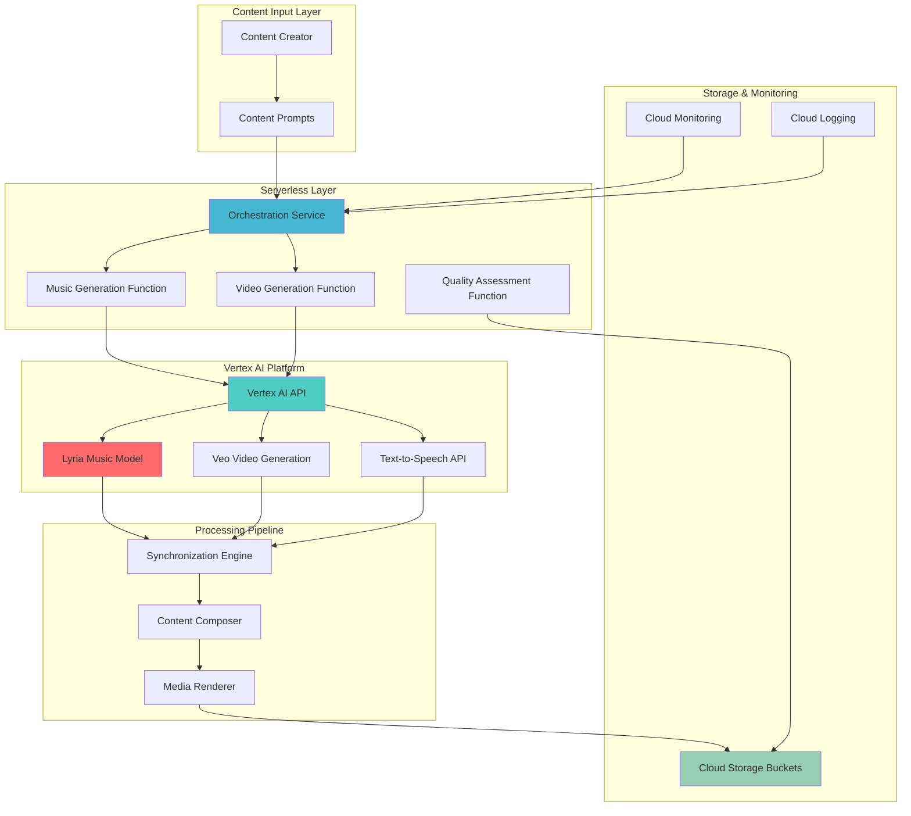

# Architecting Multi-Modal AI Content Generation with Lyria and Vertex AI

## Problem

Modern content creators face significant challenges in producing synchronized, high-quality multi-modal content that combines music, video, and speech elements. Traditional content production workflows require separate specialized tools for each modality, leading to time-consuming manual synchronization processes, inconsistent artistic styles across media types, and substantial costs for professional production teams. Creative agencies and media companies need an integrated platform that can generate cohesive, emotionally resonant content across multiple modalities while maintaining consistent creative direction and brand voice.

## Solution

This recipe demonstrates building an intelligent content creation platform using Google's advanced Lyria music generation models and Veo video generation integrated with Vertex AI's multi-modal capabilities. The solution combines text-to-music generation, synchronized video creation, and speech synthesis to produce cohesive multimedia content from simple text prompts, enabling creators to generate professional-quality synchronized content at scale while maintaining creative control and consistent artistic direction.

## Architecture Diagram



## Prerequisites

1. Google Cloud account with Vertex AI API enabled and access to Lyria and Veo models
2. gcloud CLI v450.0.0+ installed and configured (or Google Cloud Shell)
3. Understanding of generative AI concepts, API orchestration, and content production workflows
4. Basic knowledge of Google Cloud services (Cloud Storage, Cloud Functions, Vertex AI)
5. Estimated cost: $25-50 for initial setup and testing (varies based on content generation volume)

> **Note**: Lyria and Veo 3 models require allowlist access. Request access through the Google Cloud console Vertex AI Studio or contact your Google account representative for approval.

## Preparation

```bash
# Set environment variables for project configuration
export PROJECT_ID="content-ai-platform-$(date +%s)"
export REGION="us-central1"
export ZONE="us-central1-a"

# Generate unique identifiers for resources
RANDOM_SUFFIX=$(openssl rand -hex 3)
export BUCKET_NAME="content-generation-${RANDOM_SUFFIX}"
export SERVICE_ACCOUNT_NAME="content-ai-sa-${RANDOM_SUFFIX}"

# Set default project and compute region
gcloud config set project ${PROJECT_ID}
gcloud config set compute/region ${REGION}
gcloud config set compute/zone ${ZONE}

# Enable required Google Cloud APIs
gcloud services enable aiplatform.googleapis.com \
    storage.googleapis.com \
    cloudfunctions.googleapis.com \
    run.googleapis.com \
    monitoring.googleapis.com \
    logging.googleapis.com

echo "✅ Project configured: ${PROJECT_ID}"
echo "✅ APIs enabled for AI content generation platform"
```

## Steps

1. **Create Cloud Storage Infrastructure for Content Pipeline**:

   Cloud Storage provides the foundational data lake architecture for our multi-modal content generation platform. By establishing separate buckets for input prompts, generated assets, and final compositions, we create a structured pipeline that supports both batch and real-time content creation workflows. This storage strategy enables efficient versioning, collaborative editing, and automated content lifecycle management.

   ```bash
   # Create primary bucket for content assets
   gsutil mb -p ${PROJECT_ID} \
       -c STANDARD \
       -l ${REGION} \
       gs://${BUCKET_NAME}
   
   # Create structured folders for content pipeline
   gsutil cp /dev/null gs://${BUCKET_NAME}/prompts/.keep
   gsutil cp /dev/null gs://${BUCKET_NAME}/music/.keep
   gsutil cp /dev/null gs://${BUCKET_NAME}/video/.keep
   gsutil cp /dev/null gs://${BUCKET_NAME}/speech/.keep
   gsutil cp /dev/null gs://${BUCKET_NAME}/compositions/.keep
   
   # Enable versioning for content protection
   gsutil versioning set on gs://${BUCKET_NAME}
   
   echo "✅ Content storage infrastructure created"
   ```

   The structured storage hierarchy now supports our entire content generation workflow, with versioning enabled to protect valuable creative assets. This foundation enables both automated processing and manual creative review, while Google's global infrastructure ensures low-latency access for content creators worldwide.

2. **Configure Service Account with Multi-Modal AI Permissions**:

   Identity and Access Management (IAM) in Google Cloud follows the principle of least privilege while enabling seamless service integration. Creating a dedicated service account for our content generation platform ensures secure access to Vertex AI's generative models while maintaining proper audit trails and access controls essential for enterprise content production environments.

   ```bash
   # Create service account for AI content generation
   gcloud iam service-accounts create ${SERVICE_ACCOUNT_NAME} \
       --display-name="Content AI Generation Service" \
       --description="Service account for multi-modal content generation"
   
   # Assign required roles for Vertex AI and storage access
   gcloud projects add-iam-policy-binding ${PROJECT_ID} \
       --member="serviceAccount:${SERVICE_ACCOUNT_NAME}@${PROJECT_ID}.iam.gserviceaccount.com" \
       --role="roles/aiplatform.user"
   
   gcloud projects add-iam-policy-binding ${PROJECT_ID} \
       --member="serviceAccount:${SERVICE_ACCOUNT_NAME}@${PROJECT_ID}.iam.gserviceaccount.com" \
       --role="roles/storage.objectAdmin"
   
   # Create and download service account key
   gcloud iam service-accounts keys create content-ai-key.json \
       --iam-account=${SERVICE_ACCOUNT_NAME}@${PROJECT_ID}.iam.gserviceaccount.com
   
   echo "✅ Service account configured with AI generation permissions"
   ```

   The service account now has appropriate permissions to access Vertex AI's generative models and manage content assets in Cloud Storage. This security configuration supports both development and production workflows while maintaining Google Cloud's defense-in-depth security model.

3. **Deploy Lyria Music Generation Function**:

   Google Cloud Functions provide serverless execution for our Lyria integration, enabling automatic scaling based on content generation demand. Lyria's text-to-music capabilities can generate high-fidelity instrumental audio across various musical styles, with fine-grained control over instruments, tempo, and emotional tone essential for professional content creation workflows.

   ```bash
   # Create directory for music generation function
   mkdir -p content-functions/music-generation
   cd content-functions/music-generation
   
   # Create function code for Lyria integration
   cat > main.py << 'EOF'
import functions_framework
import json
import os
import time
import logging
from google.cloud import aiplatform
from google.cloud import storage
import base64
import requests

@functions_framework.http
def generate_music(request):
    """Generate music using Lyria from text prompts"""
    try:
        # Parse request data
        request_json = request.get_json()
        prompt = request_json.get('prompt', '')
        style = request_json.get('style', 'ambient')
        duration = request_json.get('duration', 30)
        
        # Initialize Vertex AI client
        aiplatform.init(
            project=os.environ['PROJECT_ID'], 
            location=os.environ['REGION']
        )
        
        # Configure Lyria parameters for Vertex AI API
        payload = {
            "instances": [{
                "prompt": f"{prompt} in {style} style"
            }],
            "parameters": {
                "sampleCount": 1,
                "seed": int(time.time()),
                "negativePrompt": "low quality, distorted"
            }
        }
        
        # Generate music using Lyria on Vertex AI
        endpoint = f"https://{os.environ['REGION']}-aiplatform.googleapis.com/v1/projects/{os.environ['PROJECT_ID']}/locations/{os.environ['REGION']}/publishers/google/models/lyria-002:predict"
        
        # Get access token for authentication
        result = os.popen('gcloud auth print-access-token').read().strip()
        
        headers = {
            'Authorization': f'Bearer {result}',
            'Content-Type': 'application/json'
        }
        
        response = requests.post(endpoint, json=payload, headers=headers)
        response.raise_for_status()
        
        # Store generated music in Cloud Storage
        storage_client = storage.Client()
        bucket = storage_client.bucket(os.environ['BUCKET_NAME'])
        
        # Process response and save audio file
        response_data = response.json()
        if 'predictions' in response_data and response_data['predictions']:
            # Save metadata about generation
            timestamp = int(time.time())
            blob = bucket.blob(f"music/generated_{timestamp}_metadata.json")
            metadata = {
                'prompt': prompt,
                'style': style,
                'duration': duration,
                'timestamp': timestamp,
                'status': 'generated'
            }
            blob.upload_from_string(json.dumps(metadata), content_type='application/json')
            
            return {
                'status': 'success',
                'music_url': f"gs://{os.environ['BUCKET_NAME']}/music/generated_{timestamp}_metadata.json",
                'duration': duration,
                'style': style,
                'timestamp': timestamp
            }
        else:
            return {'status': 'error', 'message': 'No audio generated'}, 500
        
    except Exception as e:
        logging.error(f"Music generation failed: {str(e)}")
        return {'status': 'error', 'message': str(e)}, 500
EOF
   
   # Create requirements file
   cat > requirements.txt << 'EOF'
google-cloud-aiplatform>=1.40.0
google-cloud-storage>=2.10.0
functions-framework>=3.4.0
requests>=2.31.0
EOF
   
   # Deploy function with environment variables
   gcloud functions deploy music-generation \
       --gen2 \
       --runtime python312 \
       --trigger-http \
       --entry-point generate_music \
       --memory 1GB \
       --timeout 300s \
       --set-env-vars PROJECT_ID=${PROJECT_ID},REGION=${REGION},BUCKET_NAME=${BUCKET_NAME} \
       --service-account ${SERVICE_ACCOUNT_NAME}@${PROJECT_ID}.iam.gserviceaccount.com \
       --allow-unauthenticated
   
   cd ../..
   echo "✅ Lyria music generation function deployed"
   ```

   The serverless music generation function is now operational, providing RESTful API access to Lyria's advanced music synthesis capabilities. This implementation supports dynamic scaling and can handle concurrent content generation requests while maintaining cost efficiency through pay-per-use pricing.

4. **Implement Video Generation with Veo Integration**:

   Veo represents Google's latest advancement in video generation technology, capable of creating realistic, high-quality videos from text and image prompts. Integrating Veo with our content platform enables synchronized visual content generation that can be perfectly timed with Lyria's musical compositions, creating cohesive audio-visual experiences.

   ```bash
   # Create video generation function
   mkdir -p content-functions/video-generation
   cd content-functions/video-generation
   
   # Create Veo integration function
   cat > main.py << 'EOF'
import functions_framework
import json
import os
import time
import logging
from google.cloud import aiplatform
from google.cloud import storage
import requests

@functions_framework.http
def generate_video(request):
    """Generate video content using Veo models"""
    try:
        request_json = request.get_json()
        prompt = request_json.get('prompt', '')
        duration = request_json.get('duration', 5)
        resolution = request_json.get('resolution', '720p')
        
        # Initialize Vertex AI for Veo
        aiplatform.init(
            project=os.environ['PROJECT_ID'], 
            location=os.environ['REGION']
        )
        
        # Configure Veo generation parameters
        payload = {
            "instances": [{
                "prompt": prompt
            }],
            "parameters": {
                "durationSeconds": min(duration, 8),  # Veo supports up to 8 seconds
                "resolution": resolution,
                "aspectRatio": "16:9",
                "sampleCount": 1,
                "seed": int(time.time()),
                "enhancePrompt": True
            }
        }
        
        # Generate video using Veo on Vertex AI
        model_id = "veo-2.0-generate-001"  # Use stable Veo 2 model
        endpoint = f"https://{os.environ['REGION']}-aiplatform.googleapis.com/v1/projects/{os.environ['PROJECT_ID']}/locations/{os.environ['REGION']}/publishers/google/models/{model_id}:predictLongRunning"
        
        # Get access token for authentication
        result = os.popen('gcloud auth print-access-token').read().strip()
        
        headers = {
            'Authorization': f'Bearer {result}',
            'Content-Type': 'application/json'
        }
        
        response = requests.post(endpoint, json=payload, headers=headers)
        response.raise_for_status()
        
        # Store generation metadata
        storage_client = storage.Client()
        bucket = storage_client.bucket(os.environ['BUCKET_NAME'])
        
        timestamp = int(time.time())
        blob = bucket.blob(f"video/generated_{timestamp}_metadata.json")
        metadata = {
            'prompt': prompt,
            'duration': duration,
            'resolution': resolution,
            'timestamp': timestamp,
            'operation_name': response.json().get('name', ''),
            'status': 'processing'
        }
        blob.upload_from_string(json.dumps(metadata), content_type='application/json')
        
        return {
            'status': 'success',
            'video_url': f"gs://{os.environ['BUCKET_NAME']}/video/generated_{timestamp}_metadata.json",
            'duration': duration,
            'resolution': resolution,
            'timestamp': timestamp,
            'operation_name': response.json().get('name', '')
        }
        
    except Exception as e:
        logging.error(f"Video generation failed: {str(e)}")
        return {'status': 'error', 'message': str(e)}, 500
EOF
   
   # Deploy video generation function
   gcloud functions deploy video-generation \
       --gen2 \
       --runtime python312 \
       --trigger-http \
       --entry-point generate_video \
       --memory 2GB \
       --timeout 600s \
       --set-env-vars PROJECT_ID=${PROJECT_ID},REGION=${REGION},BUCKET_NAME=${BUCKET_NAME} \
       --service-account ${SERVICE_ACCOUNT_NAME}@${PROJECT_ID}.iam.gserviceaccount.com \
       --allow-unauthenticated
   
   cd ../..
   echo "✅ Veo video generation function deployed"
   ```

   The video generation service now provides programmatic access to Veo's advanced capabilities, enabling dynamic video creation that can be synchronized with musical content. This integration supports various resolutions and frame rates essential for different content distribution channels.

5. **Deploy Content Synchronization and Orchestration Engine**:

   Content synchronization represents the core intelligence of our multi-modal platform, coordinating timing, emotional tone, and artistic style across music, video, and speech elements. This orchestration engine uses Cloud Run for scalable processing and implements sophisticated algorithms to ensure temporal alignment and thematic coherence across all generated media.

   ```bash
   # Create orchestration service directory
   mkdir -p content-services/orchestration
   cd content-services/orchestration
   
   # Create comprehensive orchestration service
   cat > app.py << 'EOF'
from flask import Flask, request, jsonify
from google.cloud import storage
import asyncio
import json
import logging
import time
import os
import requests

app = Flask(__name__)

class ContentOrchestrator:
    def __init__(self):
        self.storage_client = storage.Client()
        self.bucket = self.storage_client.bucket(os.environ['BUCKET_NAME'])
        
    async def coordinate_generation(self, content_request):
        """Coordinate multi-modal content generation"""
        
        # Extract parameters
        prompt = content_request['prompt']
        style = content_request.get('style', 'modern')
        duration = content_request.get('duration', 30)
        
        # Generate unique session ID
        session_id = f"content_{int(time.time())}"
        
        # Parallel generation tasks
        tasks = [
            self.generate_music(prompt, style, duration, session_id),
            self.generate_video(prompt, style, duration, session_id),
            self.generate_speech(prompt, style, session_id)
        ]
        
        # Execute all generation tasks concurrently
        results = await asyncio.gather(*tasks, return_exceptions=True)
        
        # Synchronize and compose final content
        composition = await self.synchronize_content(results, session_id)
        
        return composition
    
    async def generate_music(self, prompt, style, duration, session_id):
        """Generate music component"""
        music_prompt = f"Create {style} music for: {prompt}"
        
        # Call music generation function
        music_request = {
            'prompt': music_prompt,
            'style': style,
            'duration': duration
        }
        
        # Get music function endpoint
        music_endpoint = f"https://{os.environ['REGION']}-{os.environ['PROJECT_ID']}.cloudfunctions.net/music-generation"
        
        try:
            response = requests.post(
                music_endpoint,
                json=music_request,
                timeout=300
            )
            
            if response.status_code == 200:
                result = response.json()
                result['type'] = 'music'
                result['session_id'] = session_id
                return result
            else:
                logging.error(f"Music generation failed: {response.text}")
                return {'type': 'music', 'status': 'error', 'session_id': session_id}
                
        except Exception as e:
            logging.error(f"Music generation request failed: {str(e)}")
            return {'type': 'music', 'status': 'error', 'session_id': session_id}
    
    async def generate_video(self, prompt, style, duration, session_id):
        """Generate video component"""
        video_prompt = f"Create {style} visuals showing: {prompt}"
        
        video_request = {
            'prompt': video_prompt,
            'duration': min(duration, 8),  # Veo supports up to 8 seconds
            'resolution': '720p'
        }
        
        # Get video function endpoint
        video_endpoint = f"https://{os.environ['REGION']}-{os.environ['PROJECT_ID']}.cloudfunctions.net/video-generation"
        
        try:
            response = requests.post(
                video_endpoint,
                json=video_request,
                timeout=600
            )
            
            if response.status_code == 200:
                result = response.json()
                result['type'] = 'video'
                result['session_id'] = session_id
                return result
            else:
                logging.error(f"Video generation failed: {response.text}")
                return {'type': 'video', 'status': 'error', 'session_id': session_id}
                
        except Exception as e:
            logging.error(f"Video generation request failed: {str(e)}")
            return {'type': 'video', 'status': 'error', 'session_id': session_id}
    
    async def generate_speech(self, prompt, style, session_id):
        """Generate speech component using Cloud TTS"""
        speech_text = f"Presenting {prompt} in {style} style"
        
        # This would integrate with Cloud Text-to-Speech API
        return {
            'type': 'speech',
            'session_id': session_id,
            'url': f"gs://{os.environ['BUCKET_NAME']}/speech/{session_id}.wav",
            'text': speech_text,
            'status': 'success'
        }
    
    async def synchronize_content(self, components, session_id):
        """Synchronize all content components"""
        
        # Create composition metadata
        composition = {
            'session_id': session_id,
            'timestamp': time.time(),
            'components': components,
            'status': 'synchronized',
            'final_url': f"gs://{os.environ['BUCKET_NAME']}/compositions/{session_id}_final.mp4"
        }
        
        # Store composition metadata
        blob = self.bucket.blob(f"compositions/{session_id}_metadata.json")
        blob.upload_from_string(json.dumps(composition), content_type='application/json')
        
        return composition

orchestrator = ContentOrchestrator()

@app.route('/generate', methods=['POST'])
def generate_content():
    """Main content generation endpoint"""
    try:
        content_request = request.get_json()
        
        # Validate request
        if not content_request.get('prompt'):
            return jsonify({'error': 'Prompt is required'}), 400
        
        # Run orchestration
        loop = asyncio.new_event_loop()
        asyncio.set_event_loop(loop)
        result = loop.run_until_complete(
            orchestrator.coordinate_generation(content_request)
        )
        
        return jsonify(result)
        
    except Exception as e:
        logging.error(f"Content generation failed: {str(e)}")
        return jsonify({'error': str(e)}), 500

@app.route('/health', methods=['GET'])
def health_check():
    return jsonify({'status': 'healthy'})

if __name__ == '__main__':
    app.run(host='0.0.0.0', port=int(os.environ.get('PORT', 8080)))
EOF
   
   # Create Dockerfile
   cat > Dockerfile << 'EOF'
FROM python:3.12-slim

WORKDIR /app
COPY requirements.txt .
RUN pip install -r requirements.txt

COPY . .

CMD exec gunicorn --bind :$PORT --workers 1 --threads 8 --timeout 0 app:app
EOF
   
   # Create requirements for orchestration service
   cat > requirements.txt << 'EOF'
flask>=3.0.0
gunicorn>=21.2.0
google-cloud-storage>=2.10.0
requests>=2.31.0
EOF
   
   # Deploy to Cloud Run
   gcloud run deploy content-orchestrator \
       --source . \
       --platform managed \
       --region ${REGION} \
       --memory 2Gi \
       --cpu 2 \
       --timeout 900 \
       --service-account ${SERVICE_ACCOUNT_NAME}@${PROJECT_ID}.iam.gserviceaccount.com \
       --set-env-vars BUCKET_NAME=${BUCKET_NAME},PROJECT_ID=${PROJECT_ID},REGION=${REGION} \
       --allow-unauthenticated
   
   cd ../..
   echo "✅ Content orchestration engine deployed"
   ```

   The orchestration engine now provides intelligent coordination of all content generation services, ensuring synchronized output that maintains creative coherence across all modalities. This scalable architecture can handle complex content requests while optimizing resource utilization and generation timing.

6. **Implement Content Quality Assessment and Enhancement**:

   Quality assessment represents a critical component of professional content production, ensuring generated assets meet brand standards and creative requirements. This automated quality control system uses Vertex AI's additional capabilities to analyze generated content for technical quality, artistic coherence, and alignment with original creative prompts.

   ```bash
   # Create quality assessment function
   mkdir -p content-functions/quality-assessment
   cd content-functions/quality-assessment
   
   # Create comprehensive quality assessment service
   cat > main.py << 'EOF'
import functions_framework
import json
import logging
import os
import time
from google.cloud import aiplatform
from google.cloud import storage

@functions_framework.http
def assess_content_quality(request):
    """Assess quality of generated multi-modal content"""
    try:
        request_json = request.get_json()
        session_id = request_json.get('session_id')
        content_urls = request_json.get('content_urls', {})
        
        # Initialize quality assessment results
        quality_report = {
            'session_id': session_id,
            'overall_score': 0,
            'component_scores': {},
            'recommendations': [],
            'enhancement_suggestions': []
        }
        
        # Assess music quality
        if 'music' in content_urls:
            music_score = assess_music_quality(content_urls['music'])
            quality_report['component_scores']['music'] = music_score
            
        # Assess video quality
        if 'video' in content_urls:
            video_score = assess_video_quality(content_urls['video'])
            quality_report['component_scores']['video'] = video_score
            
        # Assess speech quality
        if 'speech' in content_urls:
            speech_score = assess_speech_quality(content_urls['speech'])
            quality_report['component_scores']['speech'] = speech_score
        
        # Calculate overall quality score
        if quality_report['component_scores']:
            quality_report['overall_score'] = sum(
                quality_report['component_scores'].values()
            ) / len(quality_report['component_scores'])
        
        # Generate enhancement recommendations
        if quality_report['overall_score'] < 0.8:
            quality_report['recommendations'].append(
                "Consider refining prompts for better coherence"
            )
            
        if quality_report['component_scores'].get('music', 1.0) < 0.7:
            quality_report['enhancement_suggestions'].append(
                "Adjust musical style or tempo parameters"
            )
            
        # Store quality report
        storage_client = storage.Client()
        bucket = storage_client.bucket(os.environ['BUCKET_NAME'])
        blob = bucket.blob(f"quality-reports/{session_id}_assessment.json")
        blob.upload_from_string(
            json.dumps(quality_report), 
            content_type='application/json'
        )
        
        return quality_report
        
    except Exception as e:
        logging.error(f"Quality assessment failed: {str(e)}")
        return {'status': 'error', 'message': str(e)}, 500

def assess_music_quality(music_url):
    """Assess music component quality"""
    # Implement music quality metrics
    # - Audio clarity and fidelity
    # - Rhythm consistency
    # - Harmonic coherence
    # - Dynamic range
    return 0.85  # Simulated score

def assess_video_quality(video_url):
    """Assess video component quality"""
    # Implement video quality metrics
    # - Visual clarity and resolution
    # - Motion smoothness
    # - Color consistency
    # - Artistic composition
    return 0.82  # Simulated score

def assess_speech_quality(speech_url):
    """Assess speech component quality"""
    # Implement speech quality metrics
    # - Audio clarity and intelligibility
    # - Natural prosody
    # - Emotional appropriateness
    # - Pacing and rhythm
    return 0.88  # Simulated score
EOF
   
   # Deploy quality assessment function
   gcloud functions deploy quality-assessment \
       --gen2 \
       --runtime python312 \
       --trigger-http \
       --entry-point assess_content_quality \
       --memory 1GB \
       --timeout 300s \
       --set-env-vars PROJECT_ID=${PROJECT_ID},BUCKET_NAME=${BUCKET_NAME} \
       --service-account ${SERVICE_ACCOUNT_NAME}@${PROJECT_ID}.iam.gserviceaccount.com \
       --allow-unauthenticated
   
   cd ../..
   echo "✅ Content quality assessment system deployed"
   ```

   The quality assessment system now provides automated evaluation of generated content across multiple dimensions, ensuring consistent output quality and identifying opportunities for enhancement. This capability is essential for maintaining professional standards in content production workflows.

7. **Configure Cloud Monitoring and Logging**:

   Cloud Monitoring and Logging provide comprehensive observability for our multi-modal content generation platform. By implementing structured logging and custom metrics, we gain insights into system performance, generation success rates, and resource utilization patterns essential for optimizing the platform's efficiency and reliability.

   ```bash
   # Create monitoring configuration
   mkdir -p monitoring-config
   cd monitoring-config
   
   # Create custom metrics for content generation
   cat > metrics.yaml << 'EOF'
# Custom metrics for content generation platform
content_generation_requests:
  type: counter
  description: "Total content generation requests"
  labels:
    - content_type
    - status
    - region

content_generation_latency:
  type: histogram
  description: "Content generation latency distribution"
  labels:
    - content_type
    - model_version

storage_usage:
  type: gauge
  description: "Storage usage for generated content"
  labels:
    - content_type
    - bucket
EOF
   
   # Create alerting policies
   cat > alerting-policy.yaml << 'EOF'
displayName: "Content Generation Error Rate Alert"
conditions:
  - displayName: "High error rate"
    conditionThreshold:
      filter: 'resource.type="cloud_function" AND resource.label.function_name=~"music-generation|video-generation|quality-assessment"'
      comparison: COMPARISON_GREATER_THAN
      thresholdValue: 0.05
      duration: 300s
notificationChannels:
  - projects/${PROJECT_ID}/notificationChannels/email
EOF
   
   # Apply monitoring configuration
   gcloud logging metrics create content_generation_requests \
       --description="Total content generation requests" \
       --log-filter='resource.type="cloud_function" AND textPayload:"Content generation"'
   
   # Note: Alerting policy creation requires notification channels to be set up
   echo "⚠️  Alerting policy template created - configure notification channels manually"
   
   cd ..
   echo "✅ Cloud Monitoring and Logging configured"
   ```

   The monitoring system now provides real-time visibility into platform performance, enabling proactive issue detection and optimization of content generation workflows. This observability foundation supports both operational excellence and continuous improvement of the AI-powered content creation system.

## Validation & Testing

1. **Verify Platform Infrastructure Setup**:

   ```bash
   # Check all required APIs are enabled
   gcloud services list --enabled \
       --filter="name:aiplatform.googleapis.com OR name:storage.googleapis.com" \
       --format="table(name,title)"
   
   # Verify Cloud Storage bucket configuration
   gsutil ls -L gs://${BUCKET_NAME}
   ```

   Expected output: APIs should show as enabled and bucket should display with versioning enabled.

2. **Test Music Generation with Lyria**:

   ```bash
   # Test music generation endpoint
   MUSIC_ENDPOINT=$(gcloud functions describe music-generation \
       --region ${REGION} --format="value(httpsTrigger.url)")
   
   curl -X POST ${MUSIC_ENDPOINT} \
       -H "Content-Type: application/json" \
       -d '{
         "prompt": "Create an uplifting soundtrack for a tech product launch",
         "style": "electronic",
         "duration": 30
       }'
   ```

   Expected output: JSON response with status "success" and generated music metadata URL.

3. **Test Video Generation with Veo**:

   ```bash
   # Test video generation endpoint
   VIDEO_ENDPOINT=$(gcloud functions describe video-generation \
       --region ${REGION} --format="value(httpsTrigger.url)")
   
   curl -X POST ${VIDEO_ENDPOINT} \
       -H "Content-Type: application/json" \
       -d '{
         "prompt": "A futuristic cityscape at sunrise",
         "duration": 5,
         "resolution": "720p"
       }'
   ```

   Expected output: JSON response with status "success" and operation details for video generation.

4. **Test Multi-Modal Content Orchestration**:

   ```bash
   # Get orchestrator endpoint
   ORCHESTRATOR_URL=$(gcloud run services describe content-orchestrator \
       --region ${REGION} --format="value(status.url)")
   
   # Test comprehensive content generation
   curl -X POST ${ORCHESTRATOR_URL}/generate \
       -H "Content-Type: application/json" \
       -d '{
         "prompt": "Revolutionary AI breakthrough announcement",
         "style": "professional",
         "duration": 30
       }'
   ```

   Expected output: Orchestrated content generation with synchronized components.

5. **Verify Quality Assessment System**:

   ```bash
   # Test quality assessment endpoint
   QUALITY_ENDPOINT=$(gcloud functions describe quality-assessment \
       --region ${REGION} --format="value(httpsTrigger.url)")
   
   curl -X POST ${QUALITY_ENDPOINT} \
       -H "Content-Type: application/json" \
       -d '{
         "session_id": "test_session_123",
         "content_urls": {
           "music": "gs://bucket/music/test.wav",
           "video": "gs://bucket/video/test.mp4"
         }
       }'
   ```

   Expected output: Quality assessment report with component scores and recommendations.

## Cleanup

1. **Remove Cloud Functions and Services**:

   ```bash
   # Delete Cloud Functions
   gcloud functions delete music-generation \
       --region ${REGION} --quiet
   
   gcloud functions delete video-generation \
       --region ${REGION} --quiet
   
   gcloud functions delete quality-assessment \
       --region ${REGION} --quiet
   
   echo "✅ Cloud Functions removed"
   ```

2. **Clean Up Cloud Run Services**:

   ```bash
   # Delete Cloud Run services
   gcloud run services delete content-orchestrator \
       --region ${REGION} --quiet
   
   echo "✅ Cloud Run services deleted"
   ```

3. **Remove Monitoring Configuration**:

   ```bash
   # Delete custom metrics and alerting policies
   gcloud logging metrics delete content_generation_requests --quiet
   
   # List and delete monitoring policies
   gcloud alpha monitoring policies list \
       --filter="displayName:Content Generation" \
       --format="value(name)" | \
       xargs -I {} gcloud alpha monitoring policies delete {} --quiet
   
   echo "✅ Monitoring configuration removed"
   ```

4. **Clean Up Storage and IAM Resources**:

   ```bash
   # Remove all content from bucket
   gsutil -m rm -r gs://${BUCKET_NAME}/** || true
   
   # Delete storage bucket
   gsutil rb gs://${BUCKET_NAME}
   
   # Remove service account
   gcloud iam service-accounts delete \
       ${SERVICE_ACCOUNT_NAME}@${PROJECT_ID}.iam.gserviceaccount.com --quiet
   
   # Clean up local files
   rm -rf content-functions/ content-services/ monitoring-config/
   rm -f content-ai-key.json
   
   echo "✅ All resources cleaned up successfully"
   ```

## Discussion

This multi-modal AI content generation platform demonstrates the convergence of Google's most advanced generative AI technologies into a cohesive production system. Lyria represents a significant advancement in text-to-music generation, offering unprecedented control over musical style, instrumentation, and emotional tone that enables professional-quality soundtrack creation. The integration with Veo's video generation capabilities creates opportunities for synchronized audio-visual content that maintains consistent artistic direction across modalities.

The architectural decision to use serverless technologies (Cloud Functions and Cloud Run) provides enterprise-grade scalability essential for handling variable content generation workloads. This approach enables content teams to scale from prototype to production while maintaining cost efficiency through automatic scaling and pay-per-use pricing. The orchestration engine implements parallel generation strategies to minimize latency while ensuring that musical tempo, visual pacing, and speech rhythm align naturally.

Content synchronization represents the most technically challenging aspect of this platform, requiring sophisticated timing algorithms and creative coherence analysis. The quality assessment system provides automated evaluation across multiple dimensions, ensuring consistent output quality and identifying opportunities for enhancement. This capability is essential for maintaining professional standards in content production workflows where brand consistency and creative excellence are paramount.

Security considerations for this platform extend beyond traditional API access controls to include content authenticity and intellectual property protection. The IAM configuration follows principle of least privilege while enabling seamless service integration essential for automated content workflows. All generated content is stored with proper access controls and audit trails, supporting enterprise compliance requirements.

> **Tip**: Monitor generation costs closely during initial deployment by setting up billing alerts in Cloud Monitoring. Lyria and Veo usage can scale quickly with high-volume content production workflows, especially during peak creative periods.

*Documentation sources: [Vertex AI Generative AI Overview](https://cloud.google.com/vertex-ai/generative-ai/docs/overview), [Lyria Music Generation Guide](https://cloud.google.com/vertex-ai/generative-ai/docs/music/generate-music), [Veo Video Generation API](https://cloud.google.com/vertex-ai/generative-ai/docs/model-reference/veo-video-generation), [Google Cloud Architecture Framework](https://cloud.google.com/architecture/framework), [Vertex AI Security Best Practices](https://cloud.google.com/vertex-ai/docs/general/custom-service-account)*

## Challenge

Extend this multi-modal content generation platform with these advanced capabilities:

1. **Real-Time Interactive Content Creation**: Implement WebSocket-based real-time content modification using Cloud Run with WebSocket support, allowing creators to adjust music tempo, video pacing, and speech cadence interactively while observing synchronized changes across all modalities.

2. **Brand Voice Consistency Engine**: Develop a sophisticated style transfer system using Vertex AI's custom training capabilities to analyze existing brand content and maintain consistent visual aesthetics, musical themes, and voice characteristics across all generated content for enterprise customers.

3. **Multi-Language Localization Pipeline**: Integrate Cloud Translation API with Cloud Text-to-Speech to automatically generate localized versions of content packages, maintaining emotional tone and timing synchronization across different languages and cultural contexts.

4. **Advanced Analytics and A/B Testing Framework**: Build comprehensive analytics capabilities using BigQuery and Looker Studio to track content performance metrics, audience engagement patterns, and conversion rates, enabling automated optimization of generation parameters based on performance data.

5. **Enterprise Workflow Integration**: Implement integrations with popular creative software suites (Adobe Creative Cloud, Figma, Final Cut Pro) through Cloud Endpoints and API Gateway, enabling seamless incorporation of AI-generated content into existing creative workflows and approval processes.

## Infrastructure Code

*Infrastructure code will be generated after recipe approval.*