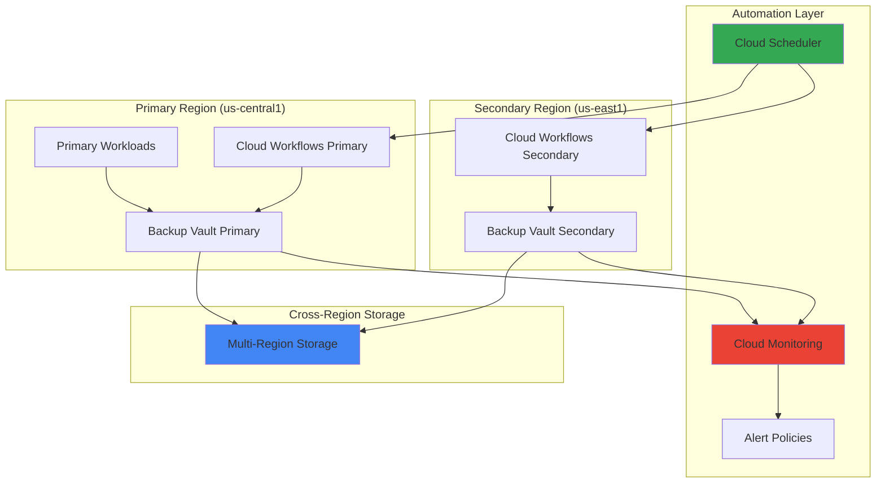

# Multi-Region Backup Automation with Backup and DR Service and Cloud Workflows

## Problem

Enterprise organizations running mission-critical applications in Google Cloud face significant challenges in implementing comprehensive backup and disaster recovery strategies across multiple regions. Manual backup processes are error-prone, time-consuming, and fail to meet strict recovery point objectives (RPO) and recovery time objectives (RTO) required for business continuity. Without automated multi-region backup orchestration, organizations risk data loss during regional outages and struggle to maintain compliance with regulatory requirements for data protection and availability.

## Solution

This solution implements an automated, enterprise-grade backup and disaster recovery system using Google Cloud's Backup and DR Service orchestrated by Cloud Workflows. The architecture automatically schedules and manages backup operations across multiple regions, provides intelligent monitoring and alerting through Cloud Monitoring, and ensures consistent backup policies for mission-critical workloads. This approach delivers reliable data protection with minimal manual intervention while maintaining cost efficiency through automated lifecycle management.

## Architecture Diagram



## Prerequisites

1. Google Cloud project with billing enabled and appropriate permissions
2. gcloud CLI v450.0.0 or later installed and configured
3. Compute Engine API, Backup and DR API, Cloud Workflows API, Cloud Scheduler API, and Cloud Monitoring API enabled
4. Basic understanding of backup and disaster recovery concepts
5. Estimated cost: $50-100/month for backup storage and automation services (varies with data volume)

> **Note**: Ensure your organization has the necessary IAM permissions for Backup and DR Service across multiple regions and that you understand the compliance requirements for your industry.

## Preparation

```bash
# Set environment variables for multi-region setup
export PROJECT_ID="backup-automation-$(date +%s | tail -c 6)"
export PRIMARY_REGION="us-central1"
export SECONDARY_REGION="us-east1"
export BACKUP_VAULT_PRIMARY="backup-vault-primary"
export BACKUP_VAULT_SECONDARY="backup-vault-secondary"

# Generate unique suffix for resource names
RANDOM_SUFFIX=$(openssl rand -hex 3)
export WORKFLOW_NAME="backup-workflow-${RANDOM_SUFFIX}"
export SCHEDULER_JOB="backup-scheduler-${RANDOM_SUFFIX}"

# Set default project and regions
gcloud config set project ${PROJECT_ID}
gcloud config set compute/region ${PRIMARY_REGION}

# Enable required APIs for backup automation
gcloud services enable compute.googleapis.com \
    backupdr.googleapis.com \
    workflows.googleapis.com \
    cloudscheduler.googleapis.com \
    monitoring.googleapis.com

echo "✅ Project configured: ${PROJECT_ID}"
echo "✅ Primary region: ${PRIMARY_REGION}"
echo "✅ Secondary region: ${SECONDARY_REGION}"
```

## Steps

1. **Create Service Account for Backup Automation**:

   Google Cloud's Backup and DR Service requires specific IAM permissions to access and manage resources across regions. Creating a dedicated service account with precise permissions follows the principle of least privilege and enables secure automation workflows. This service account will authenticate backup operations and ensure proper access control across your multi-region infrastructure.

   ```bash
   # Create service account for backup operations
   gcloud iam service-accounts create backup-automation-sa \
       --display-name="Backup Automation Service Account" \
       --description="Service account for multi-region backup automation"
   
   # Get service account email
   export SA_EMAIL="backup-automation-sa@${PROJECT_ID}.iam.gserviceaccount.com"
   
   # Grant necessary permissions for backup operations
   gcloud projects add-iam-policy-binding ${PROJECT_ID} \
       --member="serviceAccount:${SA_EMAIL}" \
       --role="roles/backupdr.admin"
   
   gcloud projects add-iam-policy-binding ${PROJECT_ID} \
       --member="serviceAccount:${SA_EMAIL}" \
       --role="roles/workflows.invoker"
   
   # Additional permissions for cross-region operations
   gcloud projects add-iam-policy-binding ${PROJECT_ID} \
       --member="serviceAccount:${SA_EMAIL}" \
       --role="roles/compute.viewer"
   
   gcloud projects add-iam-policy-binding ${PROJECT_ID} \
       --member="serviceAccount:${SA_EMAIL}" \
       --role="roles/monitoring.metricWriter"
   
   echo "✅ Service account created with backup permissions"
   ```

   The service account now has the required permissions to manage backup operations and invoke workflows. This foundation enables secure, automated backup processes while maintaining proper access controls across your Google Cloud environment.

2. **Create Multi-Region Backup Vaults**:

   Backup vaults provide immutable, indelible storage for your critical data with enterprise-grade security features. Google Cloud's backup vaults offer cross-region replication capabilities, ensuring your backups remain available even during regional outages. These vaults automatically encrypt data at rest and provide fine-grained access controls for compliance requirements.

   ```bash
   # Create backup vault in primary region
   gcloud backup-dr backup-vaults create ${BACKUP_VAULT_PRIMARY} \
       --location=${PRIMARY_REGION} \
       --backup-min-enforced-retention=30d \
       --description="Primary backup vault for multi-region automation" \
       --access-restriction=within-org
   
   # Create backup vault in secondary region
   gcloud backup-dr backup-vaults create ${BACKUP_VAULT_SECONDARY} \
       --location=${SECONDARY_REGION} \
       --backup-min-enforced-retention=30d \
       --description="Secondary backup vault for disaster recovery" \
       --access-restriction=within-org
   
   # Verify backup vaults are created
   gcloud backup-dr backup-vaults list \
       --format="table(name,location,state)"
   
   echo "✅ Multi-region backup vaults created successfully"
   ```

   Your backup vaults are now established across both regions with enforced retention policies. These vaults provide the secure storage foundation for your automated backup strategy, ensuring data immutability and compliance with regulatory requirements.

3. **Create Sample Compute Instance for Backup Testing**:

   To demonstrate the backup automation system, we'll create a sample Compute Engine instance that represents typical enterprise workloads. This instance will serve as our backup source and help validate the automated backup processes across regions. The instance includes metadata and labels that support backup policy automation.

   ```bash
   # Create a sample Compute Engine instance
   gcloud compute instances create backup-test-instance \
       --zone=${PRIMARY_REGION}-a \
       --machine-type=e2-medium \
       --image-family=debian-12 \
       --image-project=debian-cloud \
       --boot-disk-size=20GB \
       --boot-disk-type=pd-standard \
       --labels=backup-policy=critical,environment=production \
       --metadata=backup-schedule=daily
   
   # Create additional persistent disk for testing
   gcloud compute disks create backup-test-data-disk \
       --zone=${PRIMARY_REGION}-a \
       --size=10GB \
       --type=pd-standard
   
   # Attach the disk to the instance
   gcloud compute instances attach-disk backup-test-instance \
       --zone=${PRIMARY_REGION}-a \
       --disk=backup-test-data-disk
   
   echo "✅ Test instance created for backup validation"
   ```

   The test infrastructure is now ready with properly labeled resources that support automated backup policies. This setup represents real-world scenarios where enterprises need to protect various types of compute and storage resources across their Google Cloud environment.

4. **Create Backup Plans for Automated Protection**:

   Backup plans define the protection policies and schedules for your resources. Google Cloud's Backup and DR Service uses backup plans to automatically protect compute instances and persistent disks according to your business requirements. These plans include retention policies, backup frequency, and cross-region replication settings.

   ```bash
   # Create backup plan for the test instance
   gcloud backup-dr backup-plans create instance-backup-plan \
       --location=${PRIMARY_REGION} \
       --backup-vault=projects/${PROJECT_ID}/locations/${PRIMARY_REGION}/backupVaults/${BACKUP_VAULT_PRIMARY} \
       --resource-type=compute.googleapis.com/Instance \
       --description="Automated backup plan for compute instances"
   
   # Create backup plan association to link instance with plan
   gcloud backup-dr backup-plan-associations create \
       --backup-plan=projects/${PROJECT_ID}/locations/${PRIMARY_REGION}/backupPlans/instance-backup-plan \
       --location=${PRIMARY_REGION} \
       --resource=projects/${PROJECT_ID}/zones/${PRIMARY_REGION}-a/instances/backup-test-instance
   
   echo "✅ Backup plans configured for test resources"
   ```

   Backup plans are now established to automatically protect your compute resources. These plans provide consistent protection policies and enable automated backup execution without manual intervention.

5. **Create Cloud Workflow for Backup Orchestration**:

   Cloud Workflows provides serverless orchestration capabilities that enable complex backup operations across multiple regions. The workflow definition includes error handling, retry logic, and conditional branching to ensure reliable backup execution. This approach allows for sophisticated backup strategies while maintaining visibility into the entire process.

   ```bash
   # Create workflow definition file
   cat > backup-workflow.yaml << 'EOF'
main:
  params: [args]
  steps:
    - init:
        assign:
          - project_id: ${sys.get_env("GOOGLE_CLOUD_PROJECT_ID")}
          - primary_region: "us-central1"
          - secondary_region: "us-east1"
          - backup_vault_primary: "backup-vault-primary"
          - backup_vault_secondary: "backup-vault-secondary"
    
    - list_backup_plans:
        call: http.get
        args:
          url: ${"https://backupdr.googleapis.com/v1/projects/" + project_id + "/locations/" + primary_region + "/backupPlans"}
          auth:
            type: OAuth2
        result: backup_plans
    
    - trigger_backups:
        for:
          value: plan
          in: ${backup_plans.body.backup_plans}
          steps:
            - create_backup:
                call: http.post
                args:
                  url: ${"https://backupdr.googleapis.com/v1/projects/" + project_id + "/locations/" + primary_region + "/backups"}
                  auth:
                    type: OAuth2
                  headers:
                    Content-Type: "application/json"
                  body:
                    parent: ${plan.backup_vault}
                    backup_id: ${"backup-" + string(int(sys.now()))}
                    backup:
                      description: "Automated backup via Cloud Workflows"
                      backup_plan: ${plan.name}
                result: primary_backup
    
    - log_results:
        call: sys.log
        args:
          data: ${"Backup workflow completed successfully"}
          severity: "INFO"
    
    - return_results:
        return:
          status: "SUCCESS"
          timestamp: ${sys.now()}
EOF
   
   # Deploy the workflow
   gcloud workflows deploy ${WORKFLOW_NAME} \
       --source=backup-workflow.yaml \
       --location=${PRIMARY_REGION} \
       --service-account=${SA_EMAIL}
   
   echo "✅ Backup orchestration workflow deployed"
   ```

   The workflow is now deployed and ready to orchestrate multi-region backup operations. This serverless solution provides reliable automation with built-in error handling and monitoring capabilities, ensuring consistent backup execution across your infrastructure.

6. **Create Cloud Scheduler Job for Automated Execution**:

   Cloud Scheduler provides reliable, managed cron job functionality that triggers backup workflows at specified intervals. This managed service ensures backup operations execute consistently without requiring dedicated infrastructure. The scheduler integrates seamlessly with Cloud Workflows and provides detailed execution logs for monitoring and troubleshooting.

   ```bash
   # Create Cloud Scheduler job for daily backups
   gcloud scheduler jobs create http ${SCHEDULER_JOB} \
       --location=${PRIMARY_REGION} \
       --schedule="0 2 * * *" \
       --time-zone="America/New_York" \
       --uri="https://workflowexecutions.googleapis.com/v1/projects/${PROJECT_ID}/locations/${PRIMARY_REGION}/workflows/${WORKFLOW_NAME}/executions" \
       --http-method=POST \
       --headers="Content-Type=application/json" \
       --oauth-service-account-email=${SA_EMAIL} \
       --oauth-token-scope="https://www.googleapis.com/auth/cloud-platform" \
       --message-body='{"argument": "{\"backup_type\": \"scheduled\"}"}'
   
   # Create additional scheduler for weekly cross-region validation
   gcloud scheduler jobs create http ${SCHEDULER_JOB}-validation \
       --location=${PRIMARY_REGION} \
       --schedule="0 3 * * 0" \
       --time-zone="America/New_York" \
       --uri="https://workflowexecutions.googleapis.com/v1/projects/${PROJECT_ID}/locations/${PRIMARY_REGION}/workflows/${WORKFLOW_NAME}/executions" \
       --http-method=POST \
       --headers="Content-Type=application/json" \
       --oauth-service-account-email=${SA_EMAIL} \
       --oauth-token-scope="https://www.googleapis.com/auth/cloud-platform" \
       --message-body='{"argument": "{\"backup_type\": \"validation\"}"}'
   
   echo "✅ Backup scheduling configured for automated execution"
   ```

   Automated backup scheduling is now active with both daily backup operations and weekly validation runs. This ensures consistent data protection while providing regular verification that your backup and recovery processes remain functional and reliable.

7. **Configure Cloud Monitoring and Alerting**:

   Cloud Monitoring provides comprehensive observability for your backup automation system, tracking backup success rates, execution times, and storage utilization across regions. Proper monitoring ensures early detection of issues and enables proactive management of your backup infrastructure. Alert policies notify administrators of critical events requiring immediate attention.

   ```bash
   # Create alert policy for backup failures
   cat > backup-alert-policy.yaml << 'EOF'
displayName: "Backup Workflow Failures"
documentation:
  content: "Alert when backup workflows fail execution"
  mimeType: "text/markdown"
conditions:
  - displayName: "Workflow execution failure"
    conditionThreshold:
      filter: 'resource.type="workflows.googleapis.com/Workflow"'
      comparison: COMPARISON_GT
      thresholdValue: 0
      duration: "60s"
      aggregations:
        - alignmentPeriod: "300s"
          perSeriesAligner: ALIGN_RATE
          crossSeriesReducer: REDUCE_SUM
combiner: OR
enabled: true
notificationChannels: []
alertStrategy:
  autoClose: "604800s"
EOF
   
   # Create the alert policy
   gcloud alpha monitoring policies create \
       --policy-from-file=backup-alert-policy.yaml
   
   # Create custom dashboard for backup monitoring
   cat > backup-dashboard.json << 'EOF'
{
  "displayName": "Multi-Region Backup Dashboard",
  "mosaicLayout": {
    "tiles": [
      {
        "width": 6,
        "height": 4,
        "widget": {
          "title": "Backup Workflow Executions",
          "xyChart": {
            "dataSets": [
              {
                "timeSeriesQuery": {
                  "timeSeriesFilter": {
                    "filter": "resource.type=\"workflows.googleapis.com/Workflow\"",
                    "aggregation": {
                      "alignmentPeriod": "300s",
                      "perSeriesAligner": "ALIGN_RATE",
                      "crossSeriesReducer": "REDUCE_SUM"
                    }
                  }
                }
              }
            ],
            "timeshiftDuration": "0s",
            "yAxis": {
              "label": "Executions per second",
              "scale": "LINEAR"
            }
          }
        }
      }
    ]
  }
}
EOF
   
   # Deploy the dashboard
   gcloud monitoring dashboards create \
       --config-from-file=backup-dashboard.json
   
   echo "✅ Monitoring and alerting configured for backup operations"
   ```

   Comprehensive monitoring is now in place to track backup operations across both regions. The dashboard provides visual insights into backup performance while alert policies ensure immediate notification of any issues requiring attention.

8. **Test Manual Workflow Execution**:

   Before relying on automated scheduling, it's essential to validate the entire backup workflow through manual execution. This testing phase verifies that all components work together correctly and helps identify any configuration issues before production deployment. Manual testing also provides baseline performance metrics for monitoring purposes.

   ```bash
   # Execute the backup workflow manually
   gcloud workflows run ${WORKFLOW_NAME} \
       --location=${PRIMARY_REGION} \
       --data='{"backup_type": "manual_test"}'
   
   # Monitor workflow execution
   export EXECUTION_ID=$(gcloud workflows executions list \
       --workflow=${WORKFLOW_NAME} \
       --location=${PRIMARY_REGION} \
       --limit=1 \
       --format="value(name)")
   
   # Check execution status
   gcloud workflows executions describe ${EXECUTION_ID} \
       --workflow=${WORKFLOW_NAME} \
       --location=${PRIMARY_REGION} \
       --format="yaml(state,result,error)"
   
   echo "✅ Manual workflow execution completed"
   ```

   The manual test execution validates that your backup automation system operates correctly across both regions. This verification ensures that when automated scheduling begins, your backup processes will execute reliably and consistently protect your critical data.

## Validation & Testing

1. Verify backup vaults are operational across regions:

   ```bash
   # Check backup vault status in both regions
   gcloud backup-dr backup-vaults describe ${BACKUP_VAULT_PRIMARY} \
       --location=${PRIMARY_REGION} \
       --format="yaml(name,state,createTime)"
   
   gcloud backup-dr backup-vaults describe ${BACKUP_VAULT_SECONDARY} \
       --location=${SECONDARY_REGION} \
       --format="yaml(name,state,createTime)"
   ```

   Expected output: Both vaults should show `state: READY` with valid creation timestamps.

2. Verify backup plans and associations:

   ```bash
   # List backup plans
   gcloud backup-dr backup-plans list \
       --location=${PRIMARY_REGION} \
       --format="table(name,state,createTime)"
   
   # List backup plan associations
   gcloud backup-dr backup-plan-associations list \
       --location=${PRIMARY_REGION} \
       --format="table(name,resource,state)"
   ```

   Expected output: Plans should show `state: READY` and associations should be `state: READY`.

3. Test workflow execution and verify results:

   ```bash
   # List recent workflow executions
   gcloud workflows executions list \
       --workflow=${WORKFLOW_NAME} \
       --location=${PRIMARY_REGION} \
       --format="table(name,state,startTime,endTime)"
   
   # Check scheduler job status
   gcloud scheduler jobs describe ${SCHEDULER_JOB} \
       --location=${PRIMARY_REGION} \
       --format="yaml(state,schedule,lastAttemptTime)"
   ```

   Expected output: Executions should show `state: SUCCEEDED` and scheduler should be `state: ENABLED`.

4. Validate monitoring setup and alert policies:

   ```bash
   # List monitoring policies
   gcloud alpha monitoring policies list \
       --filter="displayName:Backup*" \
       --format="table(displayName,enabled,combiner)"
   
   # Check dashboard creation
   gcloud monitoring dashboards list \
       --filter="displayName:*Backup*" \
       --format="table(displayName,mosaicLayout.tiles[].widget.title)"
   ```

   Expected output: Alert policies should be enabled and dashboard should contain backup monitoring widgets.

## Cleanup

1. Delete backup plan associations and plans:

   ```bash
   # Delete backup plan associations
   gcloud backup-dr backup-plan-associations delete \
       --backup-plan=projects/${PROJECT_ID}/locations/${PRIMARY_REGION}/backupPlans/instance-backup-plan \
       --location=${PRIMARY_REGION} \
       --quiet
   
   # Delete backup plans
   gcloud backup-dr backup-plans delete instance-backup-plan \
       --location=${PRIMARY_REGION} \
       --quiet
   
   echo "✅ Backup plans and associations removed"
   ```

2. Delete scheduler jobs and workflow:

   ```bash
   # Delete scheduler jobs
   gcloud scheduler jobs delete ${SCHEDULER_JOB} \
       --location=${PRIMARY_REGION} \
       --quiet
   
   gcloud scheduler jobs delete ${SCHEDULER_JOB}-validation \
       --location=${PRIMARY_REGION} \
       --quiet
   
   # Delete workflow
   gcloud workflows delete ${WORKFLOW_NAME} \
       --location=${PRIMARY_REGION} \
       --quiet
   
   echo "✅ Automation components removed"
   ```

3. Remove backup vaults and test resources:

   ```bash
   # Delete backup vaults (this may take several minutes)
   gcloud backup-dr backup-vaults delete ${BACKUP_VAULT_PRIMARY} \
       --location=${PRIMARY_REGION} \
       --quiet
   
   gcloud backup-dr backup-vaults delete ${BACKUP_VAULT_SECONDARY} \
       --location=${SECONDARY_REGION} \
       --quiet
   
   # Delete test instance and disk
   gcloud compute instances delete backup-test-instance \
       --zone=${PRIMARY_REGION}-a \
       --quiet
   
   gcloud compute disks delete backup-test-data-disk \
       --zone=${PRIMARY_REGION}-a \
       --quiet
   
   echo "✅ Test resources and backup vaults removed"
   ```

4. Clean up monitoring and IAM resources:

   ```bash
   # Delete monitoring dashboard and alert policies
   DASHBOARD_ID=$(gcloud monitoring dashboards list \
       --filter="displayName:*Backup*" \
       --format="value(name)")
   
   if [ ! -z "$DASHBOARD_ID" ]; then
       gcloud monitoring dashboards delete ${DASHBOARD_ID} --quiet
   fi
   
   # Delete alert policies
   POLICY_IDS=$(gcloud alpha monitoring policies list \
       --filter="displayName:Backup*" \
       --format="value(name)")
   
   for POLICY_ID in $POLICY_IDS; do
       gcloud alpha monitoring policies delete ${POLICY_ID} --quiet
   done
   
   # Delete service account
   gcloud iam service-accounts delete ${SA_EMAIL} --quiet
   
   # Clean up local files
   rm -f backup-workflow.yaml backup-alert-policy.yaml backup-dashboard.json
   
   echo "✅ All resources cleaned up successfully"
   ```

## Discussion

This multi-region backup automation solution demonstrates how Google Cloud's managed services can create enterprise-grade data protection with minimal operational overhead. The Backup and DR Service provides immutable, indelible storage that meets the highest compliance standards, while Cloud Workflows orchestrates complex backup operations across regions with built-in error handling and retry logic.

The architecture leverages Cloud Scheduler for reliable automation, ensuring backup operations execute consistently without requiring dedicated infrastructure. Cloud Monitoring provides comprehensive observability, enabling proactive management of backup operations and quick identification of issues. This serverless approach significantly reduces operational complexity compared to traditional backup solutions while providing superior reliability and scalability.

Cross-region backup strategies are essential for business continuity planning, particularly for organizations operating in industries with strict regulatory requirements. The solution's ability to automatically replicate backups across regions ensures data availability even during regional outages, while automated validation processes verify backup integrity and recoverability. This comprehensive approach addresses both technical and compliance requirements for enterprise data protection.

The workflow-based orchestration enables sophisticated backup policies, including differential backup strategies, automated retention management, and conditional logic based on resource labels or metadata. Organizations can extend this foundation to implement advanced features such as backup deduplication, cross-cloud replication, and automated disaster recovery testing scenarios.

> **Tip**: Consider implementing backup lifecycle policies that automatically transition older backups to more cost-effective storage classes, and regularly test your disaster recovery procedures to ensure they meet your RTO and RPO requirements.

For detailed information on backup best practices, refer to the [Google Cloud Backup and DR Service documentation](https://cloud.google.com/backup-disaster-recovery/docs/concepts/backup-dr), [Cloud Workflows best practices guide](https://cloud.google.com/workflows/docs/best-practices), [Cloud Scheduler documentation](https://cloud.google.com/scheduler/docs), [Cloud Monitoring setup guide](https://cloud.google.com/monitoring/docs), and the [Google Cloud Architecture Framework for disaster recovery](https://cloud.google.com/architecture/disaster-recovery).

## Challenge

Extend this solution by implementing these enhancements:

1. **Implement backup policy automation** that automatically applies different backup schedules based on resource labels, implementing tiered backup strategies for critical, important, and standard workloads.

2. **Create cross-cloud backup replication** using Cloud Storage transfer jobs to replicate critical backups to other cloud providers or on-premises systems for additional redundancy.

3. **Develop automated recovery testing** by creating Cloud Functions that periodically perform test recoveries to validate backup integrity and measure actual recovery times.

4. **Build cost optimization workflows** that analyze backup storage usage patterns and automatically implement lifecycle policies to optimize costs while maintaining compliance requirements.

5. **Integrate with incident response systems** by connecting backup monitoring to external alerting systems like PagerDuty or ServiceNow for enterprise incident management workflows.

## Infrastructure Code

*Infrastructure code will be generated after recipe approval.*