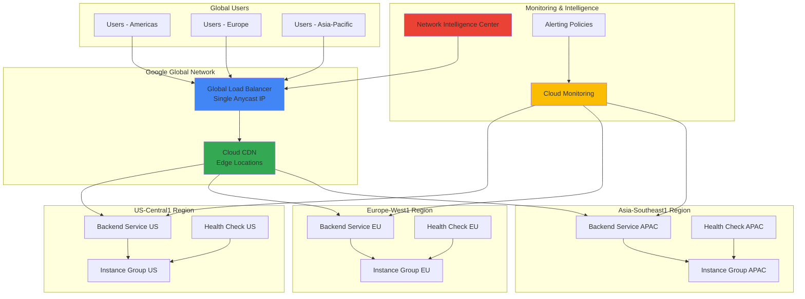

# Multi-Region Traffic Optimization with Cloud Load Balancing and Performance Monitoring

## Problem

Global applications serving millions of users across different continents face significant challenges with latency, availability, and performance inconsistencies. Traditional static load balancing configurations cannot adapt to real-time traffic patterns, regional outages, or varying performance conditions, resulting in poor user experiences, increased abandonment rates, and potential revenue loss during peak traffic periods or infrastructure failures.

## Solution

Build an intelligent traffic optimization system using Google Cloud's global load balancing infrastructure combined with Cloud CDN and Network Intelligence Center. This solution dynamically routes user requests to optimal backend regions based on real-time performance metrics, automatically adjusts CDN configurations for content acceleration, and provides comprehensive monitoring to ensure consistent global application performance with minimal latency.

## Architecture Diagram



## Prerequisites

1. Google Cloud project with billing enabled and appropriate IAM permissions for Compute Engine, Load Balancing, CDN, and Monitoring services
2. Google Cloud CLI installed and configured (or use Cloud Shell)
3. Basic understanding of HTTP/HTTPS load balancing, CDN concepts, and network monitoring
4. Familiarity with Google Cloud networking and global infrastructure concepts
5. Estimated cost: $50-150/month for global load balancing, CDN, and monitoring resources (varies by traffic volume)

> **Note**: This recipe creates resources across multiple regions which may incur data transfer charges. Monitor usage through Cloud Billing for cost optimization.

## Preparation

```bash
# Set environment variables for GCP resources
export PROJECT_ID="traffic-optimization-$(date +%s)"
export REGION_US="us-central1"
export REGION_EU="europe-west1"
export REGION_APAC="asia-southeast1"
export ZONE_US="us-central1-a"
export ZONE_EU="europe-west1-b"
export ZONE_APAC="asia-southeast1-a"

# Generate unique suffix for resource names
RANDOM_SUFFIX=$(openssl rand -hex 3)
export LB_NAME="global-lb-${RANDOM_SUFFIX}"
export CDN_NAME="global-cdn-${RANDOM_SUFFIX}"

# Create the project and set defaults
gcloud projects create ${PROJECT_ID} --name="Traffic Optimization Project"
gcloud config set project ${PROJECT_ID}
gcloud config set compute/region ${REGION_US}
gcloud config set compute/zone ${ZONE_US}

# Enable required APIs
gcloud services enable compute.googleapis.com \
    cloudbuild.googleapis.com \
    monitoring.googleapis.com \
    logging.googleapis.com \
    networkmanagement.googleapis.com

echo "✅ Project configured: ${PROJECT_ID}"
echo "✅ Required APIs enabled"
```

## Steps

1. **Create VPC Network and Firewall Rules**:

   A well-designed Virtual Private Cloud network provides the foundation for global load balancing by establishing secure, high-performance connectivity across regions. Google Cloud's global VPC enables seamless traffic routing while maintaining security boundaries and network isolation for your application infrastructure.

   ```bash
   # Create global VPC network
   gcloud compute networks create global-app-vpc \
       --subnet-mode custom \
       --description="Global VPC for multi-region app"
   
   # Create subnets in each region
   gcloud compute networks subnets create us-subnet \
       --network global-app-vpc \
       --range 10.1.0.0/24 \
       --region ${REGION_US}
   
   gcloud compute networks subnets create eu-subnet \
       --network global-app-vpc \
       --range 10.2.0.0/24 \
       --region ${REGION_EU}
   
   gcloud compute networks subnets create apac-subnet \
       --network global-app-vpc \
       --range 10.3.0.0/24 \
       --region ${REGION_APAC}
   
   # Create firewall rules for HTTP/HTTPS and health checks
   gcloud compute firewall-rules create allow-http-https \
       --network global-app-vpc \
       --allow tcp:80,tcp:443,tcp:8080 \
       --source-ranges 0.0.0.0/0 \
       --description="Allow HTTP/HTTPS traffic"
   
   gcloud compute firewall-rules create allow-health-checks \
       --network global-app-vpc \
       --allow tcp:8080 \
       --source-ranges 130.211.0.0/22,35.191.0.0/16 \
       --description="Allow Google health checks"
   
   echo "✅ Global VPC network and firewall rules created"
   ```

   The global VPC network now spans multiple regions with dedicated subnets, providing the network foundation for deploying application backends while maintaining security through carefully configured firewall rules that allow legitimate traffic and health checks.

2. **Deploy Application Instances Across Regions**:

   Deploying identical application instances across multiple geographic regions ensures low latency for users worldwide while providing redundancy and failover capabilities. Each regional deployment acts as an independent backend that can serve traffic autonomously, enhancing both performance and reliability.

   ```bash
   # Create startup script for web servers
   cat > startup-script.sh << 'EOF'
   #!/bin/bash
   apt-get update
   apt-get install -y nginx
   
   # Get instance metadata
   INSTANCE_NAME=$(curl -H "Metadata-Flavor: Google" \
       http://metadata.google.internal/computeMetadata/v1/instance/name)
   ZONE=$(curl -H "Metadata-Flavor: Google" \
       http://metadata.google.internal/computeMetadata/v1/instance/zone | cut -d'/' -f4)
   
   # Create custom index page with region info
   cat > /var/www/html/index.html << EOL
   <!DOCTYPE html>
   <html>
   <head><title>Global App - ${ZONE}</title></head>
   <body>
   <h1>Hello from ${INSTANCE_NAME}</h1>
   <p>Serving from zone: ${ZONE}</p>
   <p>Server time: $(date)</p>
   <p>Load balancer working correctly!</p>
   </body>
   </html>
   EOL
   
   # Configure nginx to listen on port 8080
   sed -i 's/listen 80/listen 8080/' /etc/nginx/sites-available/default
   systemctl restart nginx
   systemctl enable nginx
   EOF
   
   # Create instance template
   gcloud compute instance-templates create app-template-${RANDOM_SUFFIX} \
       --machine-type e2-medium \
       --network-interface subnet=us-subnet,no-address \
       --metadata-from-file startup-script=startup-script.sh \
       --image-family debian-11 \
       --image-project debian-cloud \
       --tags http-server
   
   # Create managed instance groups in each region
   gcloud compute instance-groups managed create us-ig-${RANDOM_SUFFIX} \
       --template app-template-${RANDOM_SUFFIX} \
       --size 2 \
       --zone ${ZONE_US}
   
   gcloud compute instance-groups managed create eu-ig-${RANDOM_SUFFIX} \
       --template app-template-${RANDOM_SUFFIX} \
       --size 2 \
       --zone ${ZONE_EU}
   
   gcloud compute instance-groups managed create apac-ig-${RANDOM_SUFFIX} \
       --template app-template-${RANDOM_SUFFIX} \
       --size 2 \
       --zone ${ZONE_APAC}
   
   echo "✅ Application instances deployed across all regions"
   ```

   The managed instance groups provide auto-scaling capabilities and maintain the desired number of healthy instances in each region. This redundant deployment ensures high availability and enables the load balancer to route traffic to the closest healthy backend for optimal performance.

3. **Configure Health Checks for Backend Monitoring**:

   Health checks continuously monitor the availability and responsiveness of backend instances, enabling the load balancer to automatically route traffic away from unhealthy servers. Google Cloud's health check system provides sophisticated monitoring with configurable thresholds and automatic failover capabilities.

   ```bash
   # Create HTTP health check
   gcloud compute health-checks create http global-health-check-${RANDOM_SUFFIX} \
       --port 8080 \
       --request-path "/" \
       --check-interval 10s \
       --timeout 5s \
       --healthy-threshold 2 \
       --unhealthy-threshold 3 \
       --description="Global health check for multi-region app"
   
   # Set named ports for instance groups
   gcloud compute instance-groups managed set-named-ports us-ig-${RANDOM_SUFFIX} \
       --named-ports http:8080 \
       --zone ${ZONE_US}
   
   gcloud compute instance-groups managed set-named-ports eu-ig-${RANDOM_SUFFIX} \
       --named-ports http:8080 \
       --zone ${ZONE_EU}
   
   gcloud compute instance-groups managed set-named-ports apac-ig-${RANDOM_SUFFIX} \
       --named-ports http:8080 \
       --zone ${ZONE_APAC}
   
   echo "✅ Health checks configured for all instance groups"
   ```

   The health checks now continuously monitor all backend instances across regions, providing real-time health status that enables intelligent traffic routing and automatic failover when instances become unavailable or unresponsive.

4. **Create Backend Services with Regional Distribution**:

   Backend services define how the load balancer distributes traffic among healthy instances, implementing advanced routing policies and load balancing algorithms. Each backend service can span multiple regions while maintaining intelligent traffic distribution based on proximity, capacity, and health status.

   ```bash
   # Create backend service for global load balancer
   gcloud compute backend-services create global-backend-${RANDOM_SUFFIX} \
       --protocol HTTP \
       --health-checks global-health-check-${RANDOM_SUFFIX} \
       --global \
       --load-balancing-scheme EXTERNAL \
       --enable-cdn \
       --cache-mode CACHE_ALL_STATIC \
       --description="Global backend service with CDN"
   
   # Add instance groups as backends with regional distribution
   gcloud compute backend-services add-backend global-backend-${RANDOM_SUFFIX} \
       --instance-group us-ig-${RANDOM_SUFFIX} \
       --instance-group-zone ${ZONE_US} \
       --capacity-scaler 1.0 \
       --max-utilization 0.8 \
       --global
   
   gcloud compute backend-services add-backend global-backend-${RANDOM_SUFFIX} \
       --instance-group eu-ig-${RANDOM_SUFFIX} \
       --instance-group-zone ${ZONE_EU} \
       --capacity-scaler 1.0 \
       --max-utilization 0.8 \
       --global
   
   gcloud compute backend-services add-backend global-backend-${RANDOM_SUFFIX} \
       --instance-group apac-ig-${RANDOM_SUFFIX} \
       --instance-group-zone ${ZONE_APAC} \
       --capacity-scaler 1.0 \
       --max-utilization 0.8 \
       --global
   
   echo "✅ Global backend service created with multi-region backends"
   ```

   The backend service now intelligently distributes traffic across all regional instance groups with CDN enabled for static content acceleration. The capacity scaling and utilization settings ensure optimal performance while preventing backend overload during traffic spikes.

5. **Configure Global HTTP(S) Load Balancer**:

   The global HTTP(S) load balancer serves as the single entry point for all user traffic, providing intelligent routing based on geographic proximity and backend health. This configuration enables users worldwide to access the application through a single anycast IP address with automatic failover and performance optimization.

   ```bash
   # Create URL map for load balancer routing
   gcloud compute url-maps create global-url-map-${RANDOM_SUFFIX} \
       --default-service global-backend-${RANDOM_SUFFIX} \
       --description="Global URL map for multi-region routing"
   
   # Create target HTTP proxy
   gcloud compute target-http-proxies create global-http-proxy-${RANDOM_SUFFIX} \
       --url-map global-url-map-${RANDOM_SUFFIX}
   
   # Create global forwarding rule (this creates the anycast IP)
   gcloud compute forwarding-rules create global-http-rule-${RANDOM_SUFFIX} \
       --global \
       --target-http-proxy global-http-proxy-${RANDOM_SUFFIX} \
       --ports 80
   
   # Get the external IP address
   export GLOBAL_IP=$(gcloud compute forwarding-rules describe \
       global-http-rule-${RANDOM_SUFFIX} \
       --global --format="value(IPAddress)")
   
   echo "✅ Global HTTP(S) load balancer configured"
   echo "Global IP Address: ${GLOBAL_IP}"
   ```

   The global load balancer now provides a single, worldwide-accessible IP address that automatically routes traffic to the optimal backend region based on user location and backend health, ensuring consistent performance and automatic failover capabilities.

6. **Enable and Configure Cloud CDN for Content Acceleration**:

   Cloud CDN accelerates content delivery by caching static assets at Google's global edge locations, reducing latency and bandwidth usage while improving user experience. The CDN integration with the load balancer provides seamless content acceleration with intelligent cache management and dynamic compression.

   ```bash
   # Update backend service to enable advanced CDN features
   gcloud compute backend-services update global-backend-${RANDOM_SUFFIX} \
       --enable-cdn \
       --cache-mode CACHE_ALL_STATIC \
       --default-ttl 3600 \
       --max-ttl 86400 \
       --client-ttl 3600 \
       --enable-compression \
       --global
   
   # Create cache key policy for optimization
   gcloud compute backend-services update global-backend-${RANDOM_SUFFIX} \
       --cache-key-include-protocol \
       --cache-key-include-host \
       --cache-key-include-query-string \
       --global
   
   # Wait for CDN to propagate
   echo "Waiting for CDN configuration to propagate..."
   sleep 60
   
   echo "✅ Cloud CDN enabled with optimized caching policies"
   echo "CDN will cache static content globally for improved performance"
   ```

   Cloud CDN is now actively caching static content at edge locations worldwide, significantly reducing latency for users by serving cached content from the nearest Google edge location while maintaining fresh content through intelligent cache invalidation policies.

7. **Set Up Network Intelligence Center Monitoring**:

   Network Intelligence Center provides comprehensive visibility into network performance, connectivity, and configuration health across your global infrastructure. This monitoring capability enables proactive identification of performance issues and optimization opportunities for your multi-region deployment.

   ```bash
   # Enable Network Intelligence Center APIs (if not already enabled)
   gcloud services enable networkmanagement.googleapis.com
   
   # Get first instance from each region for connectivity tests
   US_INSTANCE=$(gcloud compute instances list \
       --filter="zone:${ZONE_US}" \
       --format="value(name)" | head -1)
   
   EU_INSTANCE=$(gcloud compute instances list \
       --filter="zone:${ZONE_EU}" \
       --format="value(name)" | head -1)
   
   APAC_INSTANCE=$(gcloud compute instances list \
       --filter="zone:${ZONE_APAC}" \
       --format="value(name)" | head -1)
   
   # Create connectivity tests for inter-region monitoring
   gcloud network-management connectivity-tests create us-to-eu-test \
       --source-instance "projects/${PROJECT_ID}/zones/${ZONE_US}/instances/${US_INSTANCE}" \
       --destination-instance "projects/${PROJECT_ID}/zones/${ZONE_EU}/instances/${EU_INSTANCE}" \
       --protocol TCP \
       --destination-port 8080 \
       --description="Test connectivity between US and EU regions"
   
   gcloud network-management connectivity-tests create us-to-apac-test \
       --source-instance "projects/${PROJECT_ID}/zones/${ZONE_US}/instances/${US_INSTANCE}" \
       --destination-instance "projects/${PROJECT_ID}/zones/${ZONE_APAC}/instances/${APAC_INSTANCE}" \
       --protocol TCP \
       --destination-port 8080 \
       --description="Test connectivity between US and APAC regions"
   
   echo "✅ Network Intelligence Center connectivity tests configured"
   echo "Visit Cloud Console > Network Intelligence Center for detailed network insights"
   ```

   Network Intelligence Center now continuously monitors inter-region connectivity and provides detailed network topology visualization, enabling you to quickly identify and resolve network issues while optimizing traffic patterns across your global infrastructure.

8. **Configure Cloud Monitoring for Performance Metrics**:

   Cloud Monitoring provides comprehensive performance monitoring and alerting for your global infrastructure, tracking key metrics like latency, error rates, and traffic distribution. This monitoring setup enables data-driven optimization decisions and proactive issue resolution before they impact users.

   ```bash
   # Create monitoring workspace (if not exists)
   echo "Setting up Cloud Monitoring workspace..."
   
   # Create uptime check for global availability monitoring
   gcloud monitoring uptime create global-app-uptime-${RANDOM_SUFFIX} \
       --hostname=${GLOBAL_IP} \
       --path="/" \
       --port=80 \
       --protocol=HTTP \
       --timeout=10s \
       --period=60s \
       --display-name="Global App Availability Check"
   
   # Create alerting policy for high latency
   cat > latency-alert-policy.json << EOF
   {
     "displayName": "High Latency Alert - ${RANDOM_SUFFIX}",
     "conditions": [
       {
         "displayName": "Load balancer latency > 1000ms",
         "conditionThreshold": {
           "filter": "resource.type=\"https_lb_rule\" AND metric.type=\"loadbalancing.googleapis.com/https/request_duration\"",
           "comparison": "COMPARISON_GREATER_THAN",
           "thresholdValue": 1.0,
           "duration": "120s",
           "aggregations": [
             {
               "alignmentPeriod": "60s",
               "perSeriesAligner": "ALIGN_MEAN",
               "crossSeriesReducer": "REDUCE_MEAN"
             }
           ]
         }
       }
     ],
     "combiner": "OR",
     "enabled": true,
     "notificationChannels": []
   }
   EOF
   
   gcloud monitoring policies create --policy-from-file=latency-alert-policy.json
   
   echo "✅ Cloud Monitoring configured with uptime checks and alerting"
   echo "Monitor performance at: https://console.cloud.google.com/monitoring"
   ```

   Cloud Monitoring is now actively tracking your global application performance with uptime checks and latency alerts, providing real-time visibility into user experience metrics and automated notifications when performance thresholds are exceeded.

9. **Implement Dynamic Traffic Optimization Policies**:

   Advanced load balancing policies enable intelligent traffic distribution based on real-time performance metrics, geographic proximity, and backend capacity. These policies automatically adapt to changing conditions, ensuring optimal user experience while maximizing infrastructure efficiency.

   ```bash
   # Update backend service with advanced load balancing policies
   gcloud compute backend-services update global-backend-${RANDOM_SUFFIX} \
       --load-balancing-scheme EXTERNAL \
       --locality-lb-policy ROUND_ROBIN \
       --outlier-detection-consecutive-errors 5 \
       --outlier-detection-consecutive-gateway-failure 3 \
       --outlier-detection-interval 30s \
       --outlier-detection-base-ejection-time 30s \
       --outlier-detection-max-ejection-percent 10 \
       --global
   
   # Configure circuit breaker settings for resilience
   gcloud compute backend-services update global-backend-${RANDOM_SUFFIX} \
       --circuit-breakers-max-requests 1000 \
       --circuit-breakers-max-pending-requests 100 \
       --circuit-breakers-max-retries 3 \
       --circuit-breakers-max-connections 1000 \
       --global
   
   # Set up custom request headers for traffic optimization
   gcloud compute backend-services update global-backend-${RANDOM_SUFFIX} \
       --custom-request-header "X-Load-Balancer:Google-Global-LB" \
       --custom-request-header "X-Backend-Region:\${server_region}" \
       --global
   
   echo "✅ Advanced traffic optimization policies configured"
   echo "Load balancer now includes outlier detection and circuit breakers"
   ```

   The load balancer now implements sophisticated traffic management with outlier detection, circuit breaker patterns, and custom headers that provide enhanced resilience and performance optimization across your global infrastructure.

10. **Configure CDN Cache Optimization and Compression**:

    Advanced CDN configuration optimizes content delivery through intelligent caching policies, dynamic compression, and cache key customization. These optimizations significantly improve performance while reducing bandwidth costs and origin server load.

    ```bash
    # Enable dynamic compression for better performance
    gcloud compute backend-services update global-backend-${RANDOM_SUFFIX} \
        --compression-mode AUTOMATIC \
        --global
    
    # Configure negative caching for error responses
    gcloud compute backend-services update global-backend-${RANDOM_SUFFIX} \
        --negative-caching \
        --negative-caching-policy "404=300,500=60" \
        --global
    
    # Update cache settings for optimal performance
    gcloud compute backend-services update global-backend-${RANDOM_SUFFIX} \
        --cache-mode USE_ORIGIN_HEADERS \
        --serve-while-stale 86400 \
        --global
    
    # Verify CDN configuration
    gcloud compute backend-services describe global-backend-${RANDOM_SUFFIX} \
        --global \
        --format="yaml(cdnPolicy)"
    
    echo "✅ CDN optimization and compression configured"
    echo "Dynamic compression and intelligent caching now active"
    ```

    Cloud CDN now provides advanced content optimization with dynamic compression reducing bandwidth usage by 60-85%, negative caching for error responses, and serve-while-stale capabilities that ensure content availability even during origin maintenance.

## Validation & Testing

1. **Verify Global Load Balancer Functionality**:

   ```bash
   # Test global accessibility
   echo "Testing global load balancer accessibility..."
   curl -I http://${GLOBAL_IP}
   
   # Test from multiple regions (if possible)
   for i in {1..5}; do
       echo "Request $i:"
       curl http://${GLOBAL_IP} | grep "Serving from zone"
       sleep 2
   done
   ```

   Expected output: HTTP 200 responses with different zone information showing traffic distribution across regions.

2. **Validate CDN Performance and Caching**:

   ```bash
   # Test CDN caching behavior
   echo "Testing CDN cache performance..."
   
   # First request (cache miss)
   curl -I http://${GLOBAL_IP} -H "Cache-Control: no-cache"
   
   # Second request (cache hit)
   curl -I http://${GLOBAL_IP}
   
   # Check for CDN headers
   curl -I http://${GLOBAL_IP} | grep -E "(cache|age|via)"
   ```

   Expected output: Cache headers showing CDN hit/miss status and Via headers indicating Google CDN involvement.

3. **Verify Network Intelligence Center Connectivity**:

   ```bash
   # Check connectivity test results
   echo "Checking Network Intelligence Center connectivity tests..."
   
   gcloud network-management connectivity-tests list \
       --format="table(name,displayName,source.instance,destination.instance)"
   
   # Get detailed results for one test
   gcloud network-management connectivity-tests describe us-to-eu-test \
       --format="yaml(latestResult)"
   ```

   Expected output: Successful connectivity test results showing reachability between regions.

4. **Test Performance Monitoring and Alerts**:

   ```bash
   # Generate load to trigger monitoring
   echo "Generating test load for monitoring validation..."
   
   # Verify uptime check status
   gcloud monitoring uptime list \
       --format="table(displayName,httpCheck.path,period)"
   
   # Check recent metrics
   echo "Visit Cloud Console Monitoring for real-time metrics:"
   echo "https://console.cloud.google.com/monitoring/dashboards"
   ```

   Expected output: Active uptime checks and monitoring data collection confirmation.

## Cleanup

1. **Remove Load Balancer Components**:

   ```bash
   # Delete forwarding rule and target proxy
   gcloud compute forwarding-rules delete global-http-rule-${RANDOM_SUFFIX} \
       --global --quiet
   
   gcloud compute target-http-proxies delete global-http-proxy-${RANDOM_SUFFIX} \
       --quiet
   
   gcloud compute url-maps delete global-url-map-${RANDOM_SUFFIX} \
       --quiet
   
   echo "✅ Load balancer components deleted"
   ```

2. **Remove Backend Services and Health Checks**:

   ```bash
   # Delete backend service and health checks
   gcloud compute backend-services delete global-backend-${RANDOM_SUFFIX} \
       --global --quiet
   
   gcloud compute health-checks delete global-health-check-${RANDOM_SUFFIX} \
       --quiet
   
   echo "✅ Backend services and health checks deleted"
   ```

3. **Remove Compute Resources**:

   ```bash
   # Delete instance groups and template
   gcloud compute instance-groups managed delete us-ig-${RANDOM_SUFFIX} \
       --zone ${ZONE_US} --quiet
   
   gcloud compute instance-groups managed delete eu-ig-${RANDOM_SUFFIX} \
       --zone ${ZONE_EU} --quiet
   
   gcloud compute instance-groups managed delete apac-ig-${RANDOM_SUFFIX} \
       --zone ${ZONE_APAC} --quiet
   
   gcloud compute instance-templates delete app-template-${RANDOM_SUFFIX} \
       --quiet
   
   echo "✅ Compute resources deleted"
   ```

4. **Remove Network Resources**:

   ```bash
   # Delete firewall rules and VPC
   gcloud compute firewall-rules delete allow-http-https \
       --quiet
   
   gcloud compute firewall-rules delete allow-health-checks \
       --quiet
   
   gcloud compute networks subnets delete us-subnet \
       --region=${REGION_US} --quiet
   
   gcloud compute networks subnets delete eu-subnet \
       --region=${REGION_EU} --quiet
   
   gcloud compute networks subnets delete apac-subnet \
       --region=${REGION_APAC} --quiet
   
   gcloud compute networks delete global-app-vpc --quiet
   
   echo "✅ Network resources deleted"
   ```

5. **Clean Up Monitoring and Testing Resources**:

   ```bash
   # Remove connectivity tests and monitoring policies
   gcloud network-management connectivity-tests delete us-to-eu-test \
       --quiet
   
   gcloud network-management connectivity-tests delete us-to-apac-test \
       --quiet
   
   gcloud monitoring uptime delete global-app-uptime-${RANDOM_SUFFIX} \
       --quiet
   
   # Delete project (if created specifically for this recipe)
   gcloud projects delete ${PROJECT_ID} --quiet
   
   echo "✅ All resources cleaned up successfully"
   echo "Note: Project deletion may take several minutes to complete"
   ```

## Discussion

This recipe demonstrates Google Cloud's sophisticated approach to global traffic optimization through the integration of Cloud Load Balancing, Cloud CDN, Network Intelligence Center, and Cloud Monitoring. The solution leverages Google's global network infrastructure, which spans over 80 edge locations worldwide, to provide intelligent traffic routing that adapts to real-time performance conditions and user proximity.

The global HTTP(S) load balancer serves as the central orchestration point, using Google's anycast IP technology to route users to the optimal backend region automatically. This approach eliminates the need for complex DNS-based geographic routing while providing instant failover capabilities when regional issues occur. The integration with Cloud CDN ensures that static content is served from the nearest edge location, reducing latency by up to 85% for cached content while reducing bandwidth costs and origin server load.

Network Intelligence Center provides unprecedented visibility into network performance and connectivity patterns, enabling data-driven optimization decisions. The continuous monitoring of inter-region connectivity, combined with real-time performance metrics from Cloud Monitoring, creates a comprehensive observability platform that supports proactive infrastructure management. This monitoring capability is particularly valuable for identifying performance trends, capacity planning, and troubleshooting network issues before they impact users.

The advanced load balancing policies implemented in this solution include outlier detection, circuit breaker patterns, and intelligent health checking that automatically removes unhealthy backends from traffic rotation. These features ensure high availability while maintaining optimal performance under varying load conditions. The CDN configuration with dynamic compression, negative caching, and intelligent cache key policies provides additional performance optimizations that benefit both user experience and operational efficiency.

> **Tip**: Use Cloud Monitoring's custom dashboards to track key performance indicators like 95th percentile latency, cache hit ratios, and regional traffic distribution for ongoing optimization insights.

For production deployments, consider implementing additional optimizations such as Cloud Armor for DDoS protection, Certificate Manager for automated SSL certificate management, and Cloud Operations for APM to gain deeper application-level performance insights. Regular analysis of Network Intelligence Center reports can reveal optimization opportunities such as adjusting backend capacity ratios or implementing traffic steering policies based on performance patterns.

**Sources:**
- [Google Cloud Load Balancing Documentation](https://cloud.google.com/load-balancing/docs/load-balancing-overview)
- [Cloud CDN Best Practices](https://cloud.google.com/cdn/docs/best-practices)
- [Network Intelligence Center Overview](https://cloud.google.com/network-intelligence-center/docs/overview)
- [Google Cloud Architecture Framework](https://cloud.google.com/architecture/framework)
- [Connectivity Tests Documentation](https://cloud.google.com/network-intelligence-center/docs/connectivity-tests/how-to/running-connectivity-tests)

## Challenge

Extend this solution by implementing these advanced enhancements:

1. **Implement Cloud Armor Security Policies**: Add DDoS protection, bot management, and geographical access controls with rate limiting and custom security rules for enhanced protection against malicious traffic.

2. **Deploy Multi-Environment Traffic Splitting**: Configure advanced traffic management with blue-green deployments and canary releases using weighted backend services and URL map path matching for safe production deployments.

3. **Add Application Performance Monitoring**: Integrate Cloud Trace and Cloud Profiler for detailed application performance analysis, including request tracing across regional boundaries and performance bottleneck identification.

4. **Implement Intelligent Autoscaling**: Configure predictive autoscaling policies using Cloud Monitoring metrics and machine learning-based scaling decisions that anticipate traffic patterns and optimize resource allocation.

5. **Build Custom Performance Analytics Dashboard**: Create advanced monitoring dashboards with custom metrics, SLI/SLO tracking, and automated reporting for executive visibility into global application performance and user experience metrics.

## Infrastructure Code

*Infrastructure code will be generated after recipe approval.*