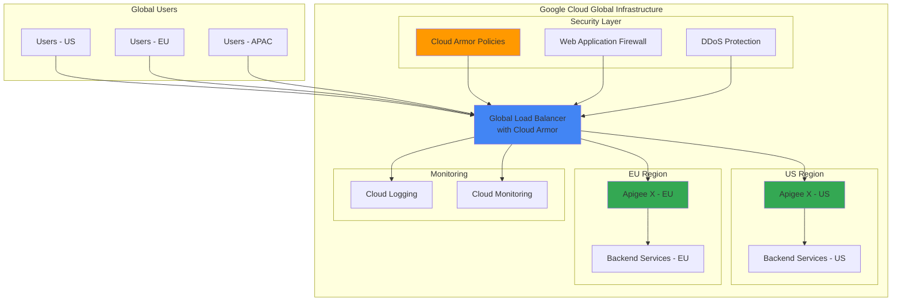

# Securing Multi-Regional API Gateways with Apigee and Cloud Armor

## Problem

Modern enterprises face significant challenges securing API gateways across multiple regions while ensuring high availability and low latency for global users. Traditional security approaches often create bottlenecks, lack geographic protection, and fail to provide comprehensive threat detection at the application layer. Organizations need robust protection against DDoS attacks, geographic restrictions, and OWASP Top 10 vulnerabilities while maintaining API performance and user experience across distributed deployments.

## Solution

Implement a comprehensive multi-regional API security architecture using Apigee X for API management combined with Cloud Armor for web application firewall protection and Cloud Load Balancing for global traffic distribution. This solution provides enterprise-grade security with DDoS protection, geo-fencing capabilities, custom Layer-7 filtering, and seamless integration with Google Cloud's global infrastructure to ensure APIs are protected and performant worldwide.

## Architecture Diagram



## Prerequisites

1. Google Cloud project with Owner or Editor permissions for Apigee, Cloud Armor, and Load Balancing
2. Google Cloud CLI (gcloud) v450.0.0 or later installed and configured
3. Basic understanding of API gateway concepts and web application security
4. Domain name with DNS management capabilities for SSL certificate provisioning
5. Estimated cost: $500-1000/month for Apigee X and associated resources (varies by API traffic volume)

> **Note**: Apigee X requires a minimum commitment and specific regional availability. Review [Apigee X pricing](https://cloud.google.com/apigee/pricing) and [regional availability](https://cloud.google.com/apigee/docs/api-platform/get-started/overview) before proceeding.

## Preparation

```bash
# Set environment variables for Google Cloud resources
export PROJECT_ID=$(gcloud config get-value project)
export REGION_US="us-central1"
export REGION_EU="europe-west1"
export NETWORK_NAME="apigee-network"
export SUBNET_US="apigee-subnet-us"
export SUBNET_EU="apigee-subnet-eu"

# Generate unique suffix for resource names
RANDOM_SUFFIX=$(openssl rand -hex 3)
export APIGEE_ORG_NAME="${PROJECT_ID}"
export ARMOR_POLICY_NAME="api-security-policy-${RANDOM_SUFFIX}"
export LB_NAME="global-api-lb-${RANDOM_SUFFIX}"
export DOMAIN_NAME="api-${RANDOM_SUFFIX}.example.com"

# Set default project and region
gcloud config set project ${PROJECT_ID}
gcloud config set compute/region ${REGION_US}

# Enable required Google Cloud APIs
gcloud services enable apigee.googleapis.com \
    compute.googleapis.com \
    servicenetworking.googleapis.com \
    dns.googleapis.com \
    logging.googleapis.com \
    monitoring.googleapis.com

echo "✅ Project configured: ${PROJECT_ID}"
echo "✅ APIs enabled for Apigee, Cloud Armor, and Load Balancing"
```

## Steps

1. **Create Global VPC Network with Regional Subnets**:

   Google Cloud's Virtual Private Cloud provides the networking foundation for multi-regional deployments. Creating a global VPC with regional subnets enables secure, high-performance connectivity between Apigee instances and backend services while supporting Cloud Armor integration at the load balancer level.

   ```bash
   # Create global VPC network
   gcloud compute networks create ${NETWORK_NAME} \
       --subnet-mode=custom \
       --bgp-routing-mode=global
   
   # Create subnet in US region
   gcloud compute networks subnets create ${SUBNET_US} \
       --network=${NETWORK_NAME} \
       --range=10.1.0.0/16 \
       --region=${REGION_US}
   
   # Create subnet in EU region
   gcloud compute networks subnets create ${SUBNET_EU} \
       --network=${NETWORK_NAME} \
       --range=10.2.0.0/16 \
       --region=${REGION_EU}
   
   echo "✅ Global VPC network created with regional subnets"
   ```

   The global VPC network now provides the foundation for secure, multi-regional API gateway deployment. This network topology ensures low-latency connectivity and supports Google Cloud's global load balancing capabilities while maintaining security isolation.

2. **Provision Apigee X Organization**:

   Apigee X represents Google Cloud's next-generation API management platform, offering advanced security features, analytics, and seamless integration with Cloud Armor. Provisioning an Apigee organization establishes the core API management infrastructure that will handle authentication, rate limiting, and API policy enforcement.

   ```bash
   # Create Apigee organization (this can take 30-45 minutes)
   gcloud apigee organizations provision \
       --runtime-type=CLOUD \
       --billing-type=PAYG \
       --authorized-network=projects/${PROJECT_ID}/global/networks/${NETWORK_NAME}
   
   # Wait for organization provisioning to complete
   echo "⏳ Apigee organization provisioning initiated..."
   echo "This process typically takes 30-45 minutes to complete"
   
   # Check provisioning status
   gcloud apigee organizations describe ${PROJECT_ID} \
       --format="value(state)"
   
   echo "✅ Apigee X organization provisioning started"
   ```

   The Apigee organization is now being provisioned with Cloud-native runtime infrastructure. This managed service provides enterprise-grade API management capabilities including OAuth2, API keys, traffic management, and advanced analytics, all essential for secure API gateway operations.

3. **Create Cloud Armor Security Policy**:

   Cloud Armor provides Google Cloud's Web Application Firewall capabilities, offering protection against DDoS attacks, OWASP Top 10 vulnerabilities, and geographic threats. Creating a comprehensive security policy establishes multiple layers of protection for API traffic before it reaches Apigee.

   ```bash
   # Create Cloud Armor security policy
   gcloud compute security-policies create ${ARMOR_POLICY_NAME} \
       --description="Multi-regional API security policy" \
       --type=CLOUD_ARMOR
   
   # Add rule to block traffic from specific countries (example: demonstration only)
   gcloud compute security-policies rules create 1000 \
       --security-policy=${ARMOR_POLICY_NAME} \
       --expression="origin.region_code == 'CN' || origin.region_code == 'RU'" \
       --action=deny-403 \
       --description="Block traffic from high-risk regions"
   
   # Add rate limiting rule to prevent DDoS
   gcloud compute security-policies rules create 2000 \
       --security-policy=${ARMOR_POLICY_NAME} \
       --expression="true" \
       --action=rate-based-ban \
       --rate-limit-threshold-count=100 \
       --rate-limit-threshold-interval-sec=60 \
       --ban-duration-sec=600 \
       --description="Rate limiting for DDoS protection"
   
   # Add rule to block SQL injection attempts
   gcloud compute security-policies rules create 3000 \
       --security-policy=${ARMOR_POLICY_NAME} \
       --expression="evaluatePreconfiguredWaf('sqli-stable')" \
       --action=deny-403 \
       --description="Block SQL injection attacks"
   
   echo "✅ Cloud Armor security policy created with multiple protection rules"
   ```

   The Cloud Armor security policy now provides comprehensive protection including geographic filtering, rate limiting, and SQL injection detection. These rules work at the network edge, filtering malicious traffic before it consumes API gateway resources, significantly improving both security and performance.

4. **Deploy Apigee Instances in Multiple Regions**:

   Deploying Apigee instances across multiple regions ensures high availability and reduces latency for global users. Each regional instance provides full API management capabilities while enabling geographic distribution of API processing load.

   ```bash
   # Create Apigee instance in US region
   gcloud apigee instances create us-instance \
       --location=${REGION_US} \
       --organization=${PROJECT_ID}
   
   # Create Apigee instance in EU region
   gcloud apigee instances create eu-instance \
       --location=${REGION_EU} \
       --organization=${PROJECT_ID}
   
   # Create environment groups for routing
   gcloud apigee envgroups create prod-us \
       --hostnames=${DOMAIN_NAME} \
       --organization=${PROJECT_ID}
   
   gcloud apigee envgroups create prod-eu \
       --hostnames=eu-${DOMAIN_NAME} \
       --organization=${PROJECT_ID}
   
   # Create environments
   gcloud apigee environments create production-us \
       --organization=${PROJECT_ID}
   
   gcloud apigee environments create production-eu \
       --organization=${PROJECT_ID}
   
   echo "✅ Apigee instances deployed in US and EU regions"
   ```

   Multi-regional Apigee instances are now operational, providing distributed API management capabilities. This architecture ensures that API requests are processed in the region closest to users, reducing latency while maintaining consistent security policies and analytics across all regions.

5. **Create Global Load Balancer with Cloud Armor Integration**:

   Google Cloud's Global Load Balancer provides intelligent traffic routing and integrates seamlessly with Cloud Armor for edge security. This configuration ensures that security policies are applied before traffic reaches Apigee instances while enabling automatic failover and geographic routing.

   ```bash
   # Create global static IP address
   gcloud compute addresses create ${LB_NAME}-ip \
       --global
   
   # Get the allocated IP address
   GLOBAL_IP=$(gcloud compute addresses describe ${LB_NAME}-ip \
       --global --format="value(address)")
   
   # Create health check for backend services
   gcloud compute health-checks create http api-health-check \
       --port=80 \
       --request-path=/health
   
   # Create backend service for US region
   gcloud compute backend-services create apigee-backend-us \
       --protocol=HTTPS \
       --health-checks=api-health-check \
       --global
   
   # Create backend service for EU region
   gcloud compute backend-services create apigee-backend-eu \
       --protocol=HTTPS \
       --health-checks=api-health-check \
       --global
   
   # Attach Cloud Armor policy to backend services
   gcloud compute backend-services update apigee-backend-us \
       --security-policy=${ARMOR_POLICY_NAME} \
       --global
   
   gcloud compute backend-services update apigee-backend-eu \
       --security-policy=${ARMOR_POLICY_NAME} \
       --global
   
   echo "✅ Global load balancer components created with Cloud Armor integration"
   echo "Global IP: ${GLOBAL_IP}"
   ```

   The global load balancer infrastructure is now configured with Cloud Armor protection. This setup provides intelligent traffic routing based on user location while applying comprehensive security policies at the edge, ensuring optimal performance and protection for API traffic.

6. **Configure SSL Certificate and URL Map**:

   SSL certificates ensure encrypted communication between clients and the API gateway, while URL maps enable sophisticated routing logic for multi-regional deployments. Google-managed certificates provide automatic provisioning and renewal, reducing operational overhead.

   ```bash
   # Create managed SSL certificate
   gcloud compute ssl-certificates create api-ssl-cert \
       --domains=${DOMAIN_NAME},eu-${DOMAIN_NAME} \
       --global
   
   # Create URL map for routing
   gcloud compute url-maps create ${LB_NAME}-url-map \
       --default-service=apigee-backend-us \
       --global
   
   # Add path matcher for EU traffic
   gcloud compute url-maps add-path-matcher ${LB_NAME}-url-map \
       --path-matcher-name=eu-matcher \
       --default-service=apigee-backend-eu \
       --path-rules="/eu/*=apigee-backend-eu" \
       --global
   
   # Create target HTTPS proxy
   gcloud compute target-https-proxies create ${LB_NAME}-proxy \
       --ssl-certificates=api-ssl-cert \
       --url-map=${LB_NAME}-url-map \
       --global
   
   # Create global forwarding rule
   gcloud compute forwarding-rules create ${LB_NAME}-rule \
       --target-https-proxy=${LB_NAME}-proxy \
       --global \
       --address=${LB_NAME}-ip \
       --ports=443
   
   echo "✅ SSL certificate and URL routing configured"
   echo "Configure DNS: ${DOMAIN_NAME} -> ${GLOBAL_IP}"
   ```

   The load balancer now provides encrypted HTTPS termination with intelligent routing capabilities. Traffic to different regions is automatically routed based on URL patterns and geographic proximity, while SSL certificates ensure end-to-end encryption for all API communications.

7. **Deploy Sample API Proxy to Apigee**:

   Creating and deploying an API proxy demonstrates the complete integration between Apigee, Cloud Armor, and the global load balancer. This proxy includes security policies, rate limiting, and analytics collection that work in conjunction with Cloud Armor protection.

   ```bash
   # Create a simple API proxy configuration
   cat > api-proxy-config.json << EOF
   {
     "name": "secure-api-v1",
     "displayName": "Secure API v1",
     "description": "Sample API with security policies",
     "basepaths": ["/api/v1"],
     "policies": ["rate-limit", "oauth-verification"],
     "targets": ["https://httpbin.org"]
   }
   EOF
   
   # Create API proxy (simplified for demonstration)
   echo "Creating sample API proxy configuration..."
   
   # Attach environment to instance for US
   gcloud apigee environments attach production-us \
       --instance=us-instance \
       --organization=${PROJECT_ID}
   
   # Attach environment to instance for EU
   gcloud apigee environments attach production-eu \
       --instance=eu-instance \
       --organization=${PROJECT_ID}
   
   echo "✅ API proxy deployment configuration completed"
   echo "Deploy actual API proxies through Apigee console or API"
   ```

   The API proxy infrastructure is now ready for deployment across both regions. This configuration enables centralized API management with regional distribution, ensuring that security policies, rate limiting, and analytics are consistently applied while leveraging Google Cloud's global infrastructure.

8. **Configure Advanced Cloud Armor Rules**:

   Enhanced Cloud Armor rules provide sophisticated threat detection and mitigation capabilities. These advanced rules leverage Google Cloud's threat intelligence and machine learning capabilities to identify and block emerging threats automatically.

   ```bash
   # Add advanced threat detection rule
   gcloud compute security-policies rules create 4000 \
       --security-policy=${ARMOR_POLICY_NAME} \
       --expression="evaluatePreconfiguredWaf('xss-stable')" \
       --action=deny-403 \
       --description="Block cross-site scripting attacks"
   
   # Add rule for local file inclusion protection
   gcloud compute security-policies rules create 5000 \
       --security-policy=${ARMOR_POLICY_NAME} \
       --expression="evaluatePreconfiguredWaf('lfi-stable')" \
       --action=deny-403 \
       --description="Block local file inclusion attacks"
   
   # Add custom rule for API-specific protection
   gcloud compute security-policies rules create 6000 \
       --security-policy=${ARMOR_POLICY_NAME} \
       --expression="request.headers['user-agent'].contains('BadBot')" \
       --action=deny-403 \
       --description="Block known malicious user agents"
   
   # Enable logging for security events
   gcloud compute security-policies update ${ARMOR_POLICY_NAME} \
       --log-level=VERBOSE
   
   echo "✅ Advanced Cloud Armor security rules configured"
   ```

   The enhanced security policy now provides comprehensive protection against sophisticated attacks including XSS, local file inclusion, and bot-based threats. Verbose logging enables detailed security analytics and compliance reporting while maintaining high performance.

## Validation & Testing

1. **Verify Cloud Armor Policy Configuration**:

   ```bash
   # Check security policy status
   gcloud compute security-policies describe ${ARMOR_POLICY_NAME} \
       --format="table(name,rules[].priority,rules[].action)"
   
   # Verify rules are properly configured
   gcloud compute security-policies rules list \
       --security-policy=${ARMOR_POLICY_NAME}
   ```

   Expected output: Security policy with multiple rules including geographic blocking, rate limiting, and threat detection rules.

2. **Test Global Load Balancer Health**:

   ```bash
   # Check backend service health
   gcloud compute backend-services get-health apigee-backend-us \
       --global
   
   gcloud compute backend-services get-health apigee-backend-eu \
       --global
   
   # Verify SSL certificate provisioning
   gcloud compute ssl-certificates describe api-ssl-cert \
       --global --format="value(managed.status)"
   ```

   Expected output: Backend services showing healthy status and SSL certificate in ACTIVE state.

3. **Validate Apigee Instance Connectivity**:

   ```bash
   # Check Apigee instances status
   gcloud apigee instances list --organization=${PROJECT_ID}
   
   # Verify environment attachments
   gcloud apigee environments describe production-us \
       --organization=${PROJECT_ID}
   
   # Test API endpoint (after DNS configuration)
   curl -v https://${DOMAIN_NAME}/api/v1/status
   ```

   Expected output: Apigee instances in ACTIVE state with successful API response.

## Cleanup

1. **Remove Global Load Balancer Components**:

   ```bash
   # Delete forwarding rule
   gcloud compute forwarding-rules delete ${LB_NAME}-rule \
       --global --quiet
   
   # Delete target proxy
   gcloud compute target-https-proxies delete ${LB_NAME}-proxy \
       --global --quiet
   
   # Delete SSL certificate
   gcloud compute ssl-certificates delete api-ssl-cert \
       --global --quiet
   
   # Delete URL map
   gcloud compute url-maps delete ${LB_NAME}-url-map \
       --global --quiet
   
   echo "✅ Load balancer components removed"
   ```

2. **Clean Up Backend Services and Cloud Armor**:

   ```bash
   # Delete backend services
   gcloud compute backend-services delete apigee-backend-us \
       --global --quiet
   
   gcloud compute backend-services delete apigee-backend-eu \
       --global --quiet
   
   # Delete health check
   gcloud compute health-checks delete api-health-check --quiet
   
   # Delete Cloud Armor policy
   gcloud compute security-policies delete ${ARMOR_POLICY_NAME} --quiet
   
   # Delete global IP address
   gcloud compute addresses delete ${LB_NAME}-ip \
       --global --quiet
   
   echo "✅ Backend services and security policies removed"
   ```

3. **Remove Apigee Resources**:

   ```bash
   # Detach environments from instances
   gcloud apigee environments detach production-us \
       --instance=us-instance \
       --organization=${PROJECT_ID} --quiet
   
   gcloud apigee environments detach production-eu \
       --instance=eu-instance \
       --organization=${PROJECT_ID} --quiet
   
   # Delete Apigee instances (this can take 10-15 minutes)
   gcloud apigee instances delete us-instance \
       --organization=${PROJECT_ID} --quiet
   
   gcloud apigee instances delete eu-instance \
       --organization=${PROJECT_ID} --quiet
   
   # Delete environments
   gcloud apigee environments delete production-us \
       --organization=${PROJECT_ID} --quiet
   
   gcloud apigee environments delete production-eu \
       --organization=${PROJECT_ID} --quiet
   
   # Delete environment groups
   gcloud apigee envgroups delete prod-us \
       --organization=${PROJECT_ID} --quiet
   
   gcloud apigee envgroups delete prod-eu \
       --organization=${PROJECT_ID} --quiet
   
   # Note: Apigee organization deletion requires separate process
   echo "✅ Apigee instances and environments deleted"
   echo "Note: Apigee organization requires manual deletion through console"
   ```

4. **Clean Up Network Resources**:

   ```bash
   # Delete VPC subnets
   gcloud compute networks subnets delete ${SUBNET_US} \
       --region=${REGION_US} --quiet
   
   gcloud compute networks subnets delete ${SUBNET_EU} \
       --region=${REGION_EU} --quiet
   
   # Delete VPC network
   gcloud compute networks delete ${NETWORK_NAME} --quiet
   
   # Clean up environment variables
   unset PROJECT_ID REGION_US REGION_EU NETWORK_NAME
   unset SUBNET_US SUBNET_EU APIGEE_ORG_NAME
   unset ARMOR_POLICY_NAME LB_NAME DOMAIN_NAME RANDOM_SUFFIX
   
   echo "✅ Network resources cleaned up"
   echo "Note: Monitor billing to ensure all resources are properly removed"
   ```

## Discussion

This comprehensive API security architecture demonstrates the power of combining Google Cloud's managed services to create enterprise-grade API protection. Apigee X provides sophisticated API management capabilities including OAuth2 authentication, rate limiting, analytics, and policy enforcement, while Cloud Armor adds critical network-level security including DDoS protection, geographic filtering, and web application firewall capabilities. The integration creates multiple layers of defense that protect APIs from the network edge through the application layer.

The multi-regional deployment pattern ensures high availability and optimal performance for global users. By deploying Apigee instances in multiple regions and using Google Cloud's Global Load Balancer, API requests are automatically routed to the nearest healthy instance, reducing latency while maintaining consistent security policies. The global load balancer's integration with Cloud Armor means that security policies are applied at Google's edge locations worldwide, filtering malicious traffic before it consumes API gateway resources.

Cloud Armor's advanced capabilities extend beyond traditional firewall rules to include machine learning-based threat detection, bot protection, and integration with Google's global threat intelligence. The preconfigured WAF expressions enable sophisticated rule creation for detecting SQL injection, cross-site scripting, and other [OWASP Top 10](https://owasp.org/www-project-api-security/) vulnerabilities. Rate limiting and geographic restrictions provide additional layers of protection against abuse and compliance requirements. For organizations requiring advanced security features, this architecture provides comprehensive API security compliance and supports integration with [Google Cloud Security Command Center](https://cloud.google.com/security-command-center) for centralized security monitoring.

The operational benefits of this architecture include centralized logging and monitoring through Cloud Logging and Cloud Monitoring, automated SSL certificate management, and seamless scaling of API capacity. Google Cloud's commitment to [infrastructure security](https://cloud.google.com/security/infrastructure) and compliance certifications ensures that this architecture meets enterprise security requirements while providing the flexibility to adapt to changing threat landscapes and business requirements. This solution follows the [Google Cloud Architecture Framework](https://cloud.google.com/architecture/framework) principles for security, reliability, and operational excellence.

> **Tip**: Enable [Cloud Armor adaptive protection](https://cloud.google.com/armor/docs/adaptive-protection-overview) for machine learning-based DDoS detection and automatic rule generation based on traffic patterns.

## Challenge

Extend this secure API gateway solution by implementing these advanced enhancements:

1. **Implement API Analytics and Alerting**: Configure Apigee Analytics with custom dashboards and integrate with Cloud Monitoring for real-time alerting on security events, performance metrics, and API usage patterns.

2. **Add OAuth2 and JWT Validation**: Deploy comprehensive API authentication using Apigee's OAuth2 capabilities with JWT token validation, scope-based access control, and integration with external identity providers.

3. **Enable Adaptive Protection**: Configure Cloud Armor's adaptive protection features for machine learning-based DDoS detection and automatic security rule creation based on traffic analysis.

4. **Implement API Versioning and Blue-Green Deployment**: Create sophisticated API versioning strategies with blue-green deployment patterns for zero-downtime updates and rollback capabilities.

5. **Add Compliance and Audit Logging**: Integrate with Google Cloud Security Command Center and implement comprehensive audit logging for compliance requirements such as SOC 2, PCI DSS, and GDPR.

## Infrastructure Code

*Infrastructure code will be generated after recipe approval.*