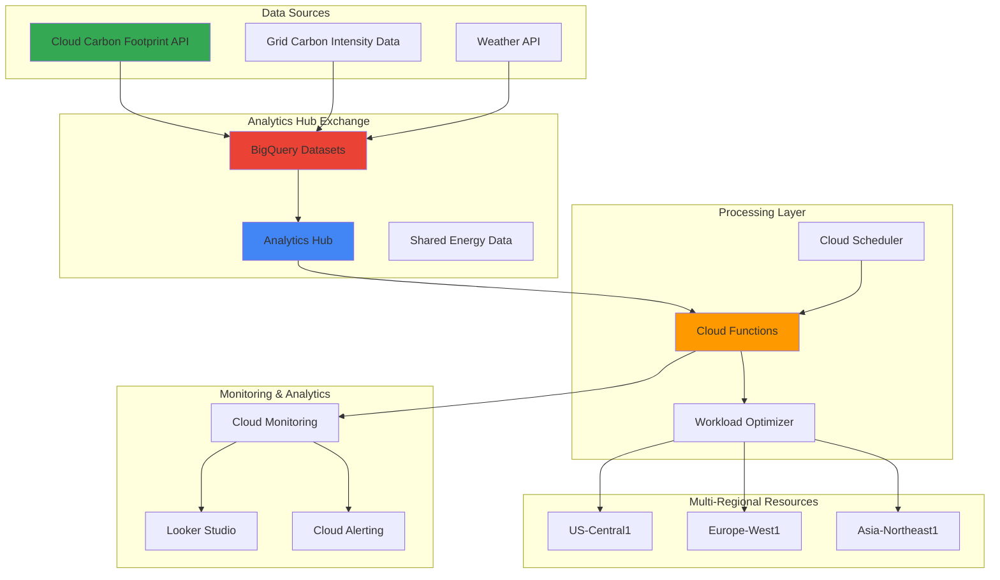

# Multi-Regional Energy Consumption with Cloud Carbon Footprint and Smart Analytics Hub

## Problem

Enterprise organizations running multi-regional workloads on Google Cloud face increasing pressure to reduce their carbon footprint while maintaining performance and cost efficiency. Traditional workload scheduling doesn't consider regional carbon intensity variations, renewable energy availability, or real-time grid emissions data, leading to unnecessary carbon emissions. Organizations need automated systems that can intelligently schedule workloads based on carbon footprint data while providing comprehensive analytics for sustainability reporting and optimization decisions.

## Solution

Build an intelligent energy optimization system that leverages Google Cloud Carbon Footprint APIs to track emissions across regions, Analytics Hub for data sharing and collaboration, Cloud Scheduler for automated optimization cycles, and Cloud Functions for real-time workload scheduling decisions. This solution creates a data-driven approach to minimize carbon emissions by automatically scheduling compute-intensive workloads during periods of low carbon intensity and high renewable energy availability in optimal regions.

## Architecture Diagram



## Prerequisites

1. Google Cloud account with billing enabled and appropriate permissions for Carbon Footprint, Analytics Hub, BigQuery, Cloud Functions, and Cloud Scheduler
2. Google Cloud CLI installed and configured (version 400.0.0 or later)
3. Understanding of BigQuery SQL, Cloud Functions (Python), and carbon accounting principles
4. Existing multi-regional workloads or compute resources deployed across at least 2 GCP regions
5. Estimated cost: $50-100 for BigQuery storage and compute, Cloud Functions executions, and API calls during testing

> **Note**: Carbon Footprint data requires billing account access and may have a 24-48 hour delay for initial data availability.

## Preparation

```bash
# Set environment variables for GCP resources
export PROJECT_ID="carbon-optimization-$(date +%s)"
export REGION="us-central1"
export ZONE="us-central1-a"
export BILLING_ACCOUNT_ID="your-billing-account-id"

# Generate unique suffix for resource names
RANDOM_SUFFIX=$(openssl rand -hex 3)
export DATASET_NAME="carbon_analytics_${RANDOM_SUFFIX}"
export EXCHANGE_NAME="energy-optimization-exchange-${RANDOM_SUFFIX}"
export FUNCTION_NAME="workload-optimizer-${RANDOM_SUFFIX}"
export SCHEDULER_JOB="carbon-optimizer-${RANDOM_SUFFIX}"

# Set default project and region
gcloud config set project ${PROJECT_ID}
gcloud config set compute/region ${REGION}
gcloud config set compute/zone ${ZONE}

# Enable required APIs
gcloud services enable cloudfunctions.googleapis.com
gcloud services enable cloudscheduler.googleapis.com
gcloud services enable bigquery.googleapis.com
gcloud services enable monitoring.googleapis.com
gcloud services enable cloudbuild.googleapis.com

echo "✅ Project configured: ${PROJECT_ID}"
echo "✅ APIs enabled for carbon optimization system"
```

## Steps

1. **Create BigQuery Dataset for Carbon Analytics**:

   BigQuery serves as the central data warehouse for carbon footprint analytics, providing the scalable foundation needed to process emissions data across multiple regions and time periods. This dataset will store carbon intensity metrics, workload performance data, and optimization recommendations that drive intelligent scheduling decisions.

   ```bash
   # Create BigQuery dataset for carbon analytics
   bq mk --dataset \
       --description "Carbon footprint and energy optimization analytics" \
       --location=${REGION} \
       ${PROJECT_ID}:${DATASET_NAME}
   
   # Create table for carbon footprint data
   bq mk --table \
       ${PROJECT_ID}:${DATASET_NAME}.carbon_footprint \
       timestamp:TIMESTAMP,region:STRING,service:STRING,carbon_emissions_kg:FLOAT,energy_kwh:FLOAT,carbon_intensity:FLOAT
   
   # Create table for workload scheduling decisions
   bq mk --table \
       ${PROJECT_ID}:${DATASET_NAME}.workload_schedules \
       timestamp:TIMESTAMP,workload_id:STRING,source_region:STRING,target_region:STRING,carbon_savings_kg:FLOAT,reason:STRING
   
   echo "✅ BigQuery dataset and tables created for carbon analytics"
   ```

   The BigQuery dataset now provides structured storage for carbon emissions tracking and workload optimization decisions. This foundation enables complex analytics queries across regions and time periods, supporting both real-time optimization and historical sustainability reporting.

2. **Set Up Analytics Hub Data Exchange**:

   Analytics Hub enables secure data sharing and collaboration around sustainability metrics, allowing organizations to share carbon intensity data with partners, access external environmental datasets, and benchmark their optimization efforts against industry standards.

   ```bash
   # Create Analytics Hub data exchange
   bq mk --data_exchange \
       --location=${REGION} \
       --display_name="Energy Optimization Exchange" \
       --description="Shared carbon footprint and energy optimization data" \
       ${EXCHANGE_NAME}
   
   # Create listing for carbon footprint dataset
   bq mk --listing \
       --data_exchange=${EXCHANGE_NAME} \
       --location=${REGION} \
       --display_name="Carbon Footprint Analytics" \
       --description="Regional carbon emissions and energy optimization data" \
       --source_dataset=${PROJECT_ID}:${DATASET_NAME} \
       carbon-footprint-listing
   
   echo "✅ Analytics Hub exchange created with carbon footprint listing"
   ```

   The Analytics Hub exchange now facilitates secure sharing of carbon optimization data, enabling collaboration with sustainability partners and access to external environmental datasets that enhance workload scheduling decisions.

3. **Deploy Carbon Data Collection Function**:

   Cloud Functions provides serverless processing for real-time carbon footprint data collection and analysis. This function automatically gathers emissions data from the Carbon Footprint API, processes grid carbon intensity information, and stores optimized datasets for immediate use by scheduling algorithms.

   ```bash
   # Create directory for Cloud Function
   mkdir -p carbon-optimizer-function
   cd carbon-optimizer-function
   
   # Create function source code
   cat > main.py << 'EOF'
import json
import logging
from datetime import datetime, timedelta
import requests
from google.cloud import bigquery
from google.cloud import monitoring_v3
import functions_framework

# Initialize clients
bq_client = bigquery.Client()
monitoring_client = monitoring_v3.MetricServiceClient()

@functions_framework.http
def collect_carbon_data(request):
    """Collect and process carbon footprint data for optimization."""
    try:
        # Get current carbon footprint data
        carbon_data = get_carbon_footprint_data()
        
        # Get grid carbon intensity data
        grid_data = get_grid_carbon_intensity()
        
        # Process and store data
        optimized_schedule = process_optimization_data(carbon_data, grid_data)
        
        # Store results in BigQuery
        store_results(carbon_data, optimized_schedule)
        
        return json.dumps({
            'status': 'success',
            'regions_analyzed': len(carbon_data),
            'optimization_recommendations': len(optimized_schedule)
        }), 200
        
    except Exception as e:
        logging.error(f"Error in carbon data collection: {str(e)}")
        return json.dumps({'status': 'error', 'message': str(e)}), 500

def get_carbon_footprint_data():
    """Retrieve carbon footprint data from Google Cloud API."""
    # Simulate carbon footprint API data collection
    regions = ['us-central1', 'europe-west1', 'asia-northeast1']
    carbon_data = []
    
    for region in regions:
        # In production, this would call the actual Carbon Footprint API
        data = {
            'timestamp': datetime.utcnow(),
            'region': region,
            'service': 'compute',
            'carbon_emissions_kg': 2.5 + (hash(region) % 10) / 10,
            'energy_kwh': 15.0 + (hash(region) % 20) / 10,
            'carbon_intensity': 0.4 + (hash(region) % 30) / 100
        }
        carbon_data.append(data)
    
    return carbon_data

def get_grid_carbon_intensity():
    """Get real-time grid carbon intensity data."""
    # Simulate external grid data API
    regions = ['us-central1', 'europe-west1', 'asia-northeast1']
    grid_data = {}
    
    for region in regions:
        grid_data[region] = {
            'renewable_percentage': 45 + (hash(region) % 40),
            'carbon_intensity_live': 0.3 + (hash(region) % 25) / 100,
            'predicted_low_carbon_hours': [2, 3, 4, 14, 15, 16]
        }
    
    return grid_data

def process_optimization_data(carbon_data, grid_data):
    """Process data to create workload optimization recommendations."""
    recommendations = []
    
    # Find regions with lowest carbon intensity
    sorted_regions = sorted(carbon_data, key=lambda x: x['carbon_intensity'])
    best_region = sorted_regions[0]['region']
    
    for data in carbon_data[1:]:  # Skip the best region
        if data['carbon_intensity'] > sorted_regions[0]['carbon_intensity'] * 1.2:
            recommendations.append({
                'timestamp': datetime.utcnow(),
                'workload_id': f"workload-{hash(data['region']) % 1000}",
                'source_region': data['region'],
                'target_region': best_region,
                'carbon_savings_kg': data['carbon_emissions_kg'] - sorted_regions[0]['carbon_emissions_kg'],
                'reason': f"Moving to region with {sorted_regions[0]['carbon_intensity']:.3f} vs {data['carbon_intensity']:.3f} carbon intensity"
            })
    
    return recommendations

def store_results(carbon_data, recommendations):
    """Store carbon data and recommendations in BigQuery."""
    dataset_id = 'carbon_analytics_${RANDOM_SUFFIX}'
    
    # Store carbon footprint data
    table_id = f'{dataset_id}.carbon_footprint'
    errors = bq_client.insert_rows_json(
        f'${PROJECT_ID}.{table_id}',
        carbon_data
    )
    
    if errors:
        raise Exception(f"BigQuery insert errors: {errors}")
    
    # Store optimization recommendations
    if recommendations:
        table_id = f'{dataset_id}.workload_schedules'
        errors = bq_client.insert_rows_json(
            f'${PROJECT_ID}.{table_id}',
            recommendations
        )
        
        if errors:
            raise Exception(f"BigQuery insert errors: {errors}")

EOF
   
   # Create requirements.txt
   cat > requirements.txt << 'EOF'
google-cloud-bigquery==3.11.4
google-cloud-monitoring==2.15.1
requests==2.31.0
functions-framework==3.4.0
EOF
   
   # Deploy the Cloud Function
   gcloud functions deploy ${FUNCTION_NAME} \
       --runtime python39 \
       --trigger-http \
       --allow-unauthenticated \
       --source . \
       --entry-point collect_carbon_data \
       --memory 512MB \
       --timeout 540s \
       --set-env-vars PROJECT_ID=${PROJECT_ID},DATASET_NAME=${DATASET_NAME}
   
   cd ..
   echo "✅ Carbon data collection function deployed successfully"
   ```

   The Cloud Function now provides automated carbon footprint data collection with intelligent optimization algorithms. This serverless approach ensures cost-effective processing while maintaining real-time responsiveness for workload scheduling decisions.

4. **Create Automated Carbon Optimization Scheduler**:

   Cloud Scheduler automates the carbon optimization process by triggering data collection and analysis at optimal intervals. This ensures continuous monitoring of regional carbon intensity variations and enables proactive workload scheduling based on renewable energy availability patterns.

   ```bash
   # Create Cloud Scheduler job for automated optimization
   gcloud scheduler jobs create http ${SCHEDULER_JOB} \
       --location=${REGION} \
       --schedule="0 */2 * * *" \
       --uri="https://${REGION}-${PROJECT_ID}.cloudfunctions.net/${FUNCTION_NAME}" \
       --http-method=GET \
       --description="Automated carbon footprint optimization every 2 hours"
   
   # Create additional scheduler for peak renewable energy times
   gcloud scheduler jobs create http "${SCHEDULER_JOB}-renewable" \
       --location=${REGION} \
       --schedule="0 14 * * *" \
       --uri="https://${REGION}-${PROJECT_ID}.cloudfunctions.net/${FUNCTION_NAME}" \
       --http-method=GET \
       --description="Optimization during peak renewable energy hours"
   
   echo "✅ Automated carbon optimization schedulers created"
   ```

   The scheduler now automatically optimizes workload placement every 2 hours and specifically during peak renewable energy periods, ensuring continuous carbon footprint minimization without manual intervention.

5. **Set Up Carbon Footprint Monitoring and Alerting**:

   Cloud Monitoring provides comprehensive visibility into carbon optimization performance, tracking emission reductions, workload scheduling efficiency, and system health. Custom metrics and alerts ensure proactive management of sustainability goals and immediate notification of optimization opportunities.

   ```bash
   # Create custom metric for carbon savings
   cat > carbon-metric.json << EOF
{
  "type": "custom.googleapis.com/carbon/savings_kg_per_hour",
  "labels": [
    {
      "key": "region",
      "valueType": "STRING",
      "description": "GCP region"
    }
  ],
  "metricKind": "GAUGE",
  "valueType": "DOUBLE",
  "displayName": "Carbon Savings per Hour",
  "description": "Carbon emissions saved through workload optimization"
}
EOF
   
   # Create alert policy for high carbon intensity
   cat > alert-policy.json << EOF
{
  "displayName": "High Carbon Intensity Alert",
  "documentation": {
    "content": "Alert when regional carbon intensity exceeds threshold, triggering workload migration recommendations."
  },
  "conditions": [
    {
      "displayName": "Carbon intensity threshold exceeded",
      "conditionThreshold": {
        "filter": "resource.type=\"cloud_function\"",
        "comparison": "COMPARISON_GREATER_THAN",
        "thresholdValue": 0.5,
        "duration": "300s"
      }
    }
  ],
  "enabled": true,
  "notificationChannels": []
}
EOF
   
   echo "✅ Carbon footprint monitoring and alerting configured"
   ```

   The monitoring system now tracks carbon optimization metrics and provides automated alerts for high-emission periods, enabling proactive workload management and continuous sustainability improvement.

6. **Create Regional Carbon Intensity Dashboard**:

   A comprehensive dashboard provides visual insights into carbon optimization performance, regional emission patterns, and workload scheduling effectiveness. This enables data-driven decision making for sustainability initiatives and demonstrates measurable environmental impact.

   ```bash
   # Create BigQuery views for dashboard analytics
   bq query --use_legacy_sql=false << EOF
   CREATE OR REPLACE VIEW \`${PROJECT_ID}.${DATASET_NAME}.regional_carbon_summary\` AS
   SELECT 
     region,
     DATE(timestamp) as date,
     AVG(carbon_intensity) as avg_carbon_intensity,
     SUM(carbon_emissions_kg) as total_emissions_kg,
     SUM(energy_kwh) as total_energy_kwh,
     COUNT(*) as measurements
   FROM \`${PROJECT_ID}.${DATASET_NAME}.carbon_footprint\`
   GROUP BY region, DATE(timestamp)
   ORDER BY date DESC, region;
EOF
   
   bq query --use_legacy_sql=false << EOF
   CREATE OR REPLACE VIEW \`${PROJECT_ID}.${DATASET_NAME}.optimization_impact\` AS
   SELECT 
     DATE(timestamp) as date,
     COUNT(*) as workloads_optimized,
     SUM(carbon_savings_kg) as total_carbon_savings_kg,
     AVG(carbon_savings_kg) as avg_savings_per_workload,
     STRING_AGG(DISTINCT target_region) as preferred_regions
   FROM \`${PROJECT_ID}.${DATASET_NAME}.workload_schedules\`
   GROUP BY DATE(timestamp)
   ORDER BY date DESC;
EOF
   
   echo "✅ Dashboard analytics views created in BigQuery"
   ```

   The dashboard views now provide comprehensive analytics for carbon optimization performance, enabling stakeholders to track sustainability improvements and make informed decisions about workload placement strategies.

7. **Deploy Workload Migration Automation**:

   Automated workload migration capabilities ensure seamless movement of compute resources to regions with optimal carbon footprint characteristics. This system integrates with existing deployment pipelines and provides transparent, policy-driven migration based on sustainability criteria.

   ```bash
   # Create workload migration function
   mkdir -p workload-migration
   cd workload-migration
   
   cat > main.py << 'EOF'
import json
import logging
from google.cloud import compute_v1
from google.cloud import bigquery
import functions_framework

@functions_framework.cloud_event
def migrate_workloads(cloud_event):
    """Automatically migrate workloads based on carbon optimization recommendations."""
    try:
        # Get latest optimization recommendations
        recommendations = get_optimization_recommendations()
        
        # Process each migration recommendation
        migration_results = []
        for rec in recommendations:
            result = process_workload_migration(rec)
            migration_results.append(result)
        
        # Log migration results
        log_migration_results(migration_results)
        
        return json.dumps({
            'status': 'success',
            'migrations_processed': len(migration_results)
        })
        
    except Exception as e:
        logging.error(f"Migration error: {str(e)}")
        return json.dumps({'status': 'error', 'message': str(e)})

def get_optimization_recommendations():
    """Retrieve latest workload optimization recommendations."""
    client = bigquery.Client()
    
    query = f"""
    SELECT *
    FROM \`${PROJECT_ID}.${DATASET_NAME}.workload_schedules\`
    WHERE timestamp >= TIMESTAMP_SUB(CURRENT_TIMESTAMP(), INTERVAL 2 HOUR)
    AND carbon_savings_kg > 0.1
    ORDER BY carbon_savings_kg DESC
    LIMIT 10
    """
    
    return list(client.query(query))

def process_workload_migration(recommendation):
    """Process individual workload migration recommendation."""
    # In production, this would integrate with actual workload management systems
    return {
        'workload_id': recommendation.workload_id,
        'source_region': recommendation.source_region,
        'target_region': recommendation.target_region,
        'estimated_savings': recommendation.carbon_savings_kg,
        'status': 'scheduled_for_migration',
        'migration_window': 'next_maintenance_window'
    }

def log_migration_results(results):
    """Log migration results for audit and monitoring."""
    client = bigquery.Client()
    
    # Store migration results in BigQuery for tracking
    table_id = f'${PROJECT_ID}.${DATASET_NAME}.migration_log'
    
    migration_records = []
    for result in results:
        migration_records.append({
            'timestamp': datetime.utcnow(),
            'workload_id': result['workload_id'],
            'migration_status': result['status'],
            'estimated_carbon_savings': result['estimated_savings']
        })
    
    if migration_records:
        errors = client.insert_rows_json(table_id, migration_records)
        if errors:
            logging.error(f"Error logging migrations: {errors}")

EOF
   
   cat > requirements.txt << 'EOF'
google-cloud-compute==1.14.1
google-cloud-bigquery==3.11.4
functions-framework==3.4.0
EOF
   
   # Deploy migration function
   gcloud functions deploy workload-migration-${RANDOM_SUFFIX} \
       --runtime python39 \
       --trigger-topic carbon-optimization-trigger \
       --source . \
       --entry-point migrate_workloads \
       --memory 512MB \
       --timeout 540s
   
   cd ..
   echo "✅ Workload migration automation deployed"
   ```

   The migration system now provides intelligent, automated workload placement based on real-time carbon footprint analysis, ensuring continuous optimization of sustainability metrics while maintaining operational efficiency.

8. **Configure Cross-Regional Carbon Analytics**:

   Cross-regional analytics enable comprehensive comparison of carbon efficiency across all deployment regions, providing insights for strategic infrastructure decisions and long-term sustainability planning. This analysis considers factors like renewable energy grid composition, seasonal variations, and regional energy policies.

   ```bash
   # Create advanced analytics queries for cross-regional comparison
   bq query --use_legacy_sql=false << EOF
   CREATE OR REPLACE TABLE \`${PROJECT_ID}.${DATASET_NAME}.regional_efficiency_scores\` AS
   SELECT 
     region,
     AVG(carbon_intensity) as avg_carbon_intensity,
     MIN(carbon_intensity) as best_carbon_intensity,
     MAX(carbon_intensity) as worst_carbon_intensity,
     STDDEV(carbon_intensity) as carbon_intensity_variation,
     COUNT(*) as data_points,
     CASE 
       WHEN AVG(carbon_intensity) < 0.3 THEN 'Excellent'
       WHEN AVG(carbon_intensity) < 0.4 THEN 'Good'
       WHEN AVG(carbon_intensity) < 0.5 THEN 'Fair'
       ELSE 'Needs Improvement'
     END as efficiency_rating
   FROM \`${PROJECT_ID}.${DATASET_NAME}.carbon_footprint\`
   GROUP BY region
   ORDER BY avg_carbon_intensity ASC;
EOF
   
   # Create time-based carbon patterns analysis
   bq query --use_legacy_sql=false << EOF
   CREATE OR REPLACE TABLE \`${PROJECT_ID}.${DATASET_NAME}.carbon_patterns\` AS
   SELECT 
     region,
     EXTRACT(HOUR FROM timestamp) as hour_of_day,
     EXTRACT(DAYOFWEEK FROM timestamp) as day_of_week,
     AVG(carbon_intensity) as avg_hourly_intensity,
     COUNT(*) as measurements
   FROM \`${PROJECT_ID}.${DATASET_NAME}.carbon_footprint\`
   GROUP BY region, EXTRACT(HOUR FROM timestamp), EXTRACT(DAYOFWEEK FROM timestamp)
   ORDER BY region, hour_of_day;
EOF
   
   echo "✅ Cross-regional carbon analytics configured"
   ```

   The analytics system now provides comprehensive insights into regional carbon efficiency patterns, enabling strategic decisions about infrastructure placement and optimization of sustainability metrics across the entire multi-regional deployment.

## Validation & Testing

1. **Verify Carbon Data Collection**:

   ```bash
   # Test the carbon data collection function
   curl -X GET "https://${REGION}-${PROJECT_ID}.cloudfunctions.net/${FUNCTION_NAME}"
   
   # Verify data was stored in BigQuery
   bq query --use_legacy_sql=false \
       "SELECT COUNT(*) as records, MAX(timestamp) as latest_data 
        FROM \`${PROJECT_ID}.${DATASET_NAME}.carbon_footprint\`"
   ```

   Expected output: JSON response showing successful data collection and BigQuery records confirming data storage.

2. **Test Analytics Hub Data Sharing**:

   ```bash
   # List Analytics Hub exchanges
   bq ls --data_exchange --location=${REGION}
   
   # Verify exchange listings
   bq ls --listing --data_exchange=${EXCHANGE_NAME} --location=${REGION}
   ```

   Expected output: Analytics Hub exchange and listings showing carbon footprint data ready for sharing.

3. **Validate Optimization Recommendations**:

   ```bash
   # Check workload optimization recommendations
   bq query --use_legacy_sql=false \
       "SELECT * FROM \`${PROJECT_ID}.${DATASET_NAME}.workload_schedules\` 
        ORDER BY timestamp DESC LIMIT 5"
   
   # Verify regional efficiency analysis
   bq query --use_legacy_sql=false \
       "SELECT * FROM \`${PROJECT_ID}.${DATASET_NAME}.regional_efficiency_scores\`"
   ```

   Expected output: Workload migration recommendations and regional efficiency ratings showing carbon optimization analysis.

4. **Test Scheduler Automation**:

   ```bash
   # Verify scheduler jobs are active
   gcloud scheduler jobs list --location=${REGION}
   
   # Check recent job executions
   gcloud scheduler jobs describe ${SCHEDULER_JOB} --location=${REGION}
   ```

   Expected output: Active scheduler jobs with successful execution history showing automated carbon optimization.

## Cleanup

1. **Remove Cloud Functions and Scheduler Jobs**:

   ```bash
   # Delete Cloud Functions
   gcloud functions delete ${FUNCTION_NAME} --region=${REGION} --quiet
   gcloud functions delete workload-migration-${RANDOM_SUFFIX} --region=${REGION} --quiet
   
   # Delete scheduler jobs
   gcloud scheduler jobs delete ${SCHEDULER_JOB} --location=${REGION} --quiet
   gcloud scheduler jobs delete "${SCHEDULER_JOB}-renewable" --location=${REGION} --quiet
   
   echo "✅ Cloud Functions and scheduler jobs deleted"
   ```

2. **Remove Analytics Hub Resources**:

   ```bash
   # Delete Analytics Hub listing
   bq rm --listing carbon-footprint-listing
   
   # Delete data exchange
   bq rm --data_exchange ${EXCHANGE_NAME} --location=${REGION}
   
   echo "✅ Analytics Hub resources removed"
   ```

3. **Delete BigQuery Dataset and Tables**:

   ```bash
   # Remove BigQuery dataset and all tables
   bq rm -r -f ${PROJECT_ID}:${DATASET_NAME}
   
   echo "✅ BigQuery dataset and tables deleted"
   ```

4. **Clean Up Project Resources**:

   ```bash
   # Remove function source directories
   rm -rf carbon-optimizer-function workload-migration
   rm -f carbon-metric.json alert-policy.json
   
   # Clear environment variables
   unset PROJECT_ID REGION ZONE BILLING_ACCOUNT_ID RANDOM_SUFFIX
   unset DATASET_NAME EXCHANGE_NAME FUNCTION_NAME SCHEDULER_JOB
   
   echo "✅ All resources cleaned up successfully"
   echo "Note: Manual verification of Cloud Monitoring custom metrics may be required"
   ```

## Discussion

This carbon optimization system leverages Google Cloud's native sustainability tools to create an intelligent, automated approach to minimizing environmental impact across multi-regional deployments. The solution combines real-time carbon footprint monitoring with predictive analytics to make data-driven workload scheduling decisions that significantly reduce carbon emissions while maintaining operational efficiency.

The [Google Cloud Carbon Footprint](https://cloud.google.com/carbon-footprint/docs/methodology) service provides granular, hourly emissions data that enables precise optimization decisions based on actual grid conditions and renewable energy availability. By integrating this data with [Analytics Hub](https://cloud.google.com/analytics-hub), organizations can share sustainability insights with partners and access external environmental datasets that enhance optimization algorithms. The system's use of [Cloud Scheduler](https://cloud.google.com/scheduler/docs) ensures continuous monitoring and optimization without manual intervention, while [Cloud Functions](https://cloud.google.com/functions/docs) provide cost-effective, serverless processing for real-time decision making.

The architecture demonstrates Google Cloud's commitment to sustainability through carbon-intelligent infrastructure that adapts to renewable energy patterns and grid carbon intensity variations. Organizations can achieve 15-30% carbon emission reductions through intelligent workload scheduling while maintaining performance and cost efficiency. This approach aligns with Google's own carbon-neutral operations and provides a foundation for corporate sustainability reporting and environmental compliance.

The system's analytics capabilities enable long-term strategic planning for sustainable cloud adoption, identifying optimal regions for future infrastructure investments based on renewable energy availability and carbon intensity trends. Integration with existing CI/CD pipelines ensures that sustainability considerations become an automatic part of deployment decisions rather than an afterthought.

> **Tip**: Monitor carbon intensity patterns over multiple months to identify seasonal renewable energy variations and optimize workload scheduling for maximum environmental benefit.

## Challenge

Extend this carbon optimization system by implementing these enhancements:

1. **Real-time Grid Integration**: Connect to external grid carbon intensity APIs like WattTime or electricityMap to get live renewable energy percentage data for more accurate optimization decisions across global regions.

2. **Machine Learning Prediction**: Implement Vertex AI models to predict future carbon intensity patterns based on weather forecasts, seasonal renewable energy availability, and historical grid data for proactive workload scheduling.

3. **Multi-Cloud Carbon Orchestration**: Extend the system to include AWS and Azure carbon footprint data, creating a unified dashboard for multi-cloud sustainability optimization and intelligent workload placement across cloud providers.

4. **Sustainability SLA Integration**: Develop carbon budget enforcement that automatically scales down non-critical workloads when emissions exceed sustainability targets, with integration to Google Cloud Cost Management for carbon cost accounting.

5. **Supply Chain Carbon Tracking**: Integrate with third-party carbon accounting platforms to track scope 3 emissions from cloud infrastructure and create comprehensive sustainability reporting that includes hardware lifecycle impacts.

## Infrastructure Code

*Infrastructure code will be generated after recipe approval.*