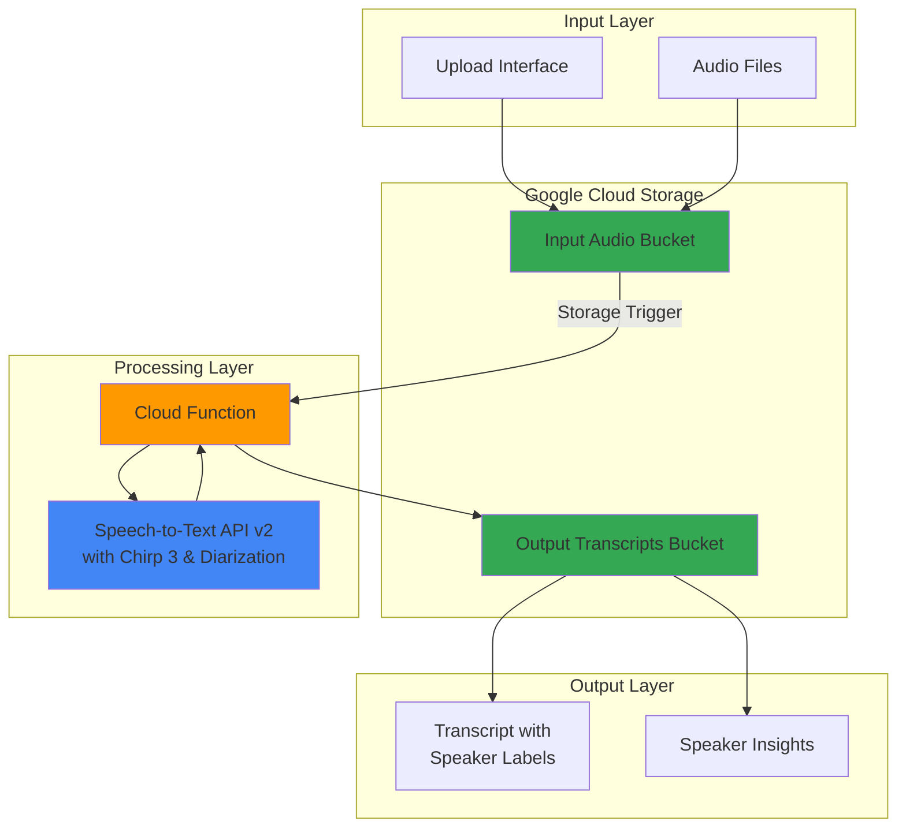

# Multi-Speaker Transcription with Chirp and Cloud Functions

## Problem

Organizations need to analyze audio recordings from meetings, customer service calls, and interviews to extract insights, but manually transcribing and identifying individual speakers is time-consuming and error-prone. Traditional transcription services often struggle with overlapping speakers, background noise, and speaker identification, leading to incomplete or inaccurate transcripts that limit their business value for analysis and compliance purposes.

## Solution

Google Cloud Speech-to-Text with Chirp 3 models and speaker diarization automatically processes audio files to identify multiple speakers and generate accurate transcripts with speaker labels. Cloud Functions provide serverless processing triggered by file uploads to Cloud Storage, enabling automatic transcription workflows that scale based on demand while maintaining cost efficiency and delivering structured output for downstream analysis.

## Architecture Diagram



## Prerequisites

1. Google Cloud account with Speech-to-Text API and Cloud Functions API enabled
2. Google Cloud CLI installed and configured with appropriate permissions
3. Basic understanding of serverless functions and audio processing concepts
4. Python 3.12+ development environment for function testing
5. Estimated cost: $0.10-$3.00 per hour of audio processed (varies by features used)

> **Note**: Speaker diarization and Chirp 3 models may incur additional charges beyond standard Speech-to-Text pricing. Review current pricing documentation for accurate cost estimates.

## Preparation

```bash
# Set environment variables for GCP resources
export PROJECT_ID="speech-transcription-$(date +%s)"
export REGION="us-central1"
export ZONE="us-central1-a"

# Generate unique suffix for resource names
RANDOM_SUFFIX=$(openssl rand -hex 3)

# Set default project and region
gcloud config set project ${PROJECT_ID}
gcloud config set compute/region ${REGION}
gcloud config set compute/zone ${ZONE}

# Enable required APIs
gcloud services enable speech.googleapis.com
gcloud services enable cloudfunctions.googleapis.com
gcloud services enable storage.googleapis.com
gcloud services enable cloudbuild.googleapis.com

echo "✅ Project configured: ${PROJECT_ID}"

# Create Cloud Storage buckets
export INPUT_BUCKET="${PROJECT_ID}-audio-input-${RANDOM_SUFFIX}"
export OUTPUT_BUCKET="${PROJECT_ID}-transcripts-output-${RANDOM_SUFFIX}"

gsutil mb -p ${PROJECT_ID} -c STANDARD -l ${REGION} gs://${INPUT_BUCKET}
gsutil mb -p ${PROJECT_ID} -c STANDARD -l ${REGION} gs://${OUTPUT_BUCKET}

echo "✅ Storage buckets created: ${INPUT_BUCKET}, ${OUTPUT_BUCKET}"
```

## Steps

1. **Create the Cloud Function source code directory**:

   Cloud Functions provide event-driven serverless computing that automatically scales based on incoming requests. For audio processing workloads, functions can be triggered by Cloud Storage events, enabling automatic processing when new audio files are uploaded without maintaining persistent infrastructure.

   ```bash
   # Create function directory and navigate to it
   mkdir -p transcription-function && cd transcription-function
   
   # Create requirements.txt for Python dependencies
   cat << 'EOF' > requirements.txt
   google-cloud-speech>=2.27.0
   google-cloud-storage>=2.18.0
   functions-framework>=3.8.0
   EOF
   
   echo "✅ Function directory and dependencies file created"
   ```

2. **Implement the main transcription function**:

   The Speech-to-Text API v2 with Chirp 3 models provides state-of-the-art speech recognition capabilities optimized for multiple languages and acoustic conditions. Chirp 3 now supports speaker diarization, automatically identifying and labeling different speakers in audio recordings, enabling advanced analytics and compliance workflows.

   ```bash
   # Create the main function code
   cat << 'EOF' > main.py
   import json
   import os
   from google.cloud import speech_v2 as speech
   from google.cloud import storage
   import functions_framework

   def transcribe_audio_with_diarization(audio_uri, output_bucket, filename):
       """Transcribe audio with speaker diarization using Chirp 3 model."""
       
       # Initialize Speech-to-Text v2 client
       client = speech.SpeechClient()
       
       # Create recognizer with Chirp 3 model configuration
       recognizer_config = speech.Recognizer(
           default_recognition_config=speech.RecognitionConfig(
               auto_decoding_config=speech.AutoDetectDecodingConfig(),
               language_codes=["en-US"],
               model="chirp_3",  # Use Chirp 3 model with diarization support
               features=speech.RecognitionFeatures(
                   enable_speaker_diarization=True,
                   diarization_speaker_count_min=2,
                   diarization_speaker_count_max=6,
                   enable_automatic_punctuation=True,
                   enable_word_time_offsets=True,
               ),
           )
       )
       
       # Create recognizer
       project_id = os.environ.get('GCP_PROJECT')
       recognizer_name = f"projects/{project_id}/locations/global/recognizers/_"
       
       # Configure batch recognition request
       request = speech.BatchRecognizeRequest(
           recognizer=recognizer_name,
           config=recognizer_config.default_recognition_config,
           files=[
               speech.BatchRecognizeFileMetadata(
                   uri=audio_uri,
               )
           ],
       )
       
       # Perform batch recognition operation
       operation = client.batch_recognize(request=request)
       
       print(f"Processing transcription for: {filename}")
       response = operation.result(timeout=600)  # 10 minute timeout
       
       # Process results with speaker labels
       transcript_data = {
           "filename": filename,
           "speakers": {},
           "full_transcript": "",
           "word_details": []
       }
       
       for result in response.results.values():
           for alternative in result.alternatives:
               transcript_data["full_transcript"] += alternative.transcript + " "
               
               # Process speaker-labeled words
               for word in alternative.words:
                   speaker_tag = word.speaker_tag if hasattr(word, 'speaker_tag') else 1
                   word_text = word.word
                   start_time = word.start_offset.total_seconds()
                   end_time = word.end_offset.total_seconds()
                   
                   # Group words by speaker
                   if speaker_tag not in transcript_data["speakers"]:
                       transcript_data["speakers"][speaker_tag] = []
                   
                   transcript_data["speakers"][speaker_tag].append({
                       "word": word_text,
                       "start_time": start_time,
                       "end_time": end_time
                   })
                   
                   transcript_data["word_details"].append({
                       "word": word_text,
                       "speaker": speaker_tag,
                       "start_time": start_time,
                       "end_time": end_time
                   })
       
       # Save results to output bucket
       storage_client = storage.Client()
       bucket = storage_client.bucket(output_bucket)
       
       # Save JSON transcript
       json_filename = f"transcripts/{filename}_transcript.json"
       blob = bucket.blob(json_filename)
       blob.upload_from_string(
           json.dumps(transcript_data, indent=2),
           content_type="application/json"
       )
       
       # Save readable transcript
       readable_transcript = generate_readable_transcript(transcript_data)
       txt_filename = f"transcripts/{filename}_readable.txt"
       blob = bucket.blob(txt_filename)
       blob.upload_from_string(readable_transcript, content_type="text/plain")
       
       return transcript_data

   def generate_readable_transcript(transcript_data):
       """Generate human-readable transcript with speaker labels."""
       output = f"Transcription Results\n"
       output += f"==================\n\n"
       output += f"File: {transcript_data['filename']}\n"
       output += f"Speakers detected: {len(transcript_data['speakers'])}\n\n"
       
       # Group consecutive words by speaker
       current_speaker = None
       current_segment = []
       
       for word_detail in transcript_data["word_details"]:
           if word_detail["speaker"] != current_speaker:
               if current_segment:
                   output += f"Speaker {current_speaker}: {' '.join(current_segment)}\n\n"
               current_speaker = word_detail["speaker"]
               current_segment = [word_detail["word"]]
           else:
               current_segment.append(word_detail["word"])
       
       # Add final segment
       if current_segment:
           output += f"Speaker {current_speaker}: {' '.join(current_segment)}\n\n"
       
       return output

   @functions_framework.cloud_event
   def process_audio_upload(cloud_event):
       """Cloud Function triggered by Cloud Storage uploads."""
       
       # Extract event data
       data = cloud_event.data
       bucket_name = data["bucket"]
       file_name = data["name"]
       
       # Only process audio files
       audio_extensions = ['.wav', '.mp3', '.flac', '.m4a']
       if not any(file_name.lower().endswith(ext) for ext in audio_extensions):
           print(f"Skipping non-audio file: {file_name}")
           return
       
       # Construct audio URI
       audio_uri = f"gs://{bucket_name}/{file_name}"
       output_bucket = os.environ.get('OUTPUT_BUCKET')
       
       try:
           # Process transcription
           result = transcribe_audio_with_diarization(
               audio_uri, output_bucket, file_name
           )
           
           print(f"Successfully processed: {file_name}")
           print(f"Speakers detected: {len(result['speakers'])}")
           
       except Exception as e:
           print(f"Error processing {file_name}: {str(e)}")
           raise e
   EOF
   
   echo "✅ Main function code created with Chirp 3 model and diarization"
   ```

3. **Deploy the Cloud Function with proper configuration**:

   Cloud Functions automatically scale based on incoming events and provide built-in monitoring and logging. The function configuration includes memory allocation, timeout settings, and environment variables needed for processing audio files efficiently while managing costs.

   ```bash
   # Deploy function with Cloud Storage trigger
   gcloud functions deploy process-audio-transcription \
       --gen2 \
       --runtime python312 \
       --trigger-bucket ${INPUT_BUCKET} \
       --source . \
       --entry-point process_audio_upload \
       --memory 2GB \
       --timeout 540s \
       --set-env-vars OUTPUT_BUCKET=${OUTPUT_BUCKET} \
       --max-instances 5 \
       --region ${REGION}
   
   echo "✅ Cloud Function deployed successfully"
   
   # Verify deployment
   gcloud functions describe process-audio-transcription \
       --region ${REGION} \
       --format="value(state)"
   ```

4. **Create a sample audio file for testing**:

   Testing with sample audio ensures the transcription pipeline works correctly before processing production audio files. Multi-speaker audio samples help validate the speaker diarization functionality and demonstrate the system's ability to distinguish between different voices.

   ```bash
   # Create a simple test script to generate sample audio URIs
   cat << 'EOF' > test_samples.py
   import json
   
   # Sample multi-speaker audio file URLs (public domain)
   test_files = [
       {
           "name": "meeting_sample.wav",
           "description": "Sample meeting recording",
           "url": "https://storage.googleapis.com/cloud-samples-tests/speech/multi-speaker-sample.wav"
       }
   ]
   
   print("Sample audio files for testing:")
   for file_info in test_files:
       print(f"- {file_info['name']}: {file_info['description']}")
   EOF
   
   python3 test_samples.py
   
   echo "✅ Test sample information prepared"
   ```

5. **Upload a test audio file to trigger processing**:

   File uploads to Cloud Storage automatically trigger the Cloud Function through event-driven architecture. This serverless approach ensures that audio processing begins immediately when files are available, enabling real-time transcription workflows for business applications.

   ```bash
   # Download a sample multi-speaker audio file
   curl -L "https://storage.googleapis.com/cloud-samples-tests/speech/multi-speaker-sample.wav" \
       -o sample_meeting.wav
   
   # Upload to input bucket to trigger function
   gsutil cp sample_meeting.wav gs://${INPUT_BUCKET}/
   
   echo "✅ Sample audio file uploaded and processing initiated"
   
   # Check function execution logs
   sleep 30
   gcloud functions logs read process-audio-transcription \
       --region ${REGION} \
       --limit 10 \
       --format="value(textPayload)"
   ```

6. **Monitor processing and verify output generation**:

   Cloud Functions provide comprehensive logging and monitoring capabilities that help track processing status, identify errors, and optimize performance. Monitoring ensures that transcription jobs complete successfully and output files are generated in the expected format.

   ```bash
   # Wait for processing to complete and check output
   sleep 60
   
   # List generated transcript files
   echo "Generated transcript files:"
   gsutil ls gs://${OUTPUT_BUCKET}/transcripts/
   
   # Check function logs for processing status
   gcloud functions logs read process-audio-transcription \
       --region ${REGION} \
       --limit 5 \
       --filter="textPayload:Successfully"
   
   echo "✅ Processing completed and output verified"
   ```

7. **Download and examine transcript results**:

   The transcription output includes both machine-readable JSON format for programmatic analysis and human-readable text format for review. Speaker diarization results enable advanced analytics like speaker talk time, conversation flow analysis, and automated meeting summaries.

   ```bash
   # Download transcript files for examination
   mkdir -p ./output
   gsutil -m cp -r gs://${OUTPUT_BUCKET}/transcripts/ ./output/
   
   # Display readable transcript
   echo "=== Readable Transcript ==="
   cat ./output/transcripts/sample_meeting.wav_readable.txt
   
   # Show JSON structure (first 20 lines)
   echo -e "\n=== JSON Transcript Structure ==="
   head -20 ./output/transcripts/sample_meeting.wav_transcript.json
   
   echo "✅ Transcript results downloaded and displayed"
   ```

8. **Configure notifications for processing completion**:

   Integration with Cloud Pub/Sub or Cloud Functions enables automated notifications when transcription processing completes. This allows downstream systems to automatically begin analysis or alerts stakeholders that results are ready for review, creating end-to-end automated workflows.

   ```bash
   # Create a simple notification function (optional)
   cat << 'EOF' > notification_handler.py
   import json
   from google.cloud import storage
   
   def send_completion_notification(transcript_data, filename):
       """Send notification when transcription completes."""
       
       summary = {
           "file_processed": filename,
           "speakers_detected": len(transcript_data["speakers"]),
           "total_words": len(transcript_data["word_details"]),
           "processing_status": "completed"
       }
       
       print("Transcription Summary:")
       print(json.dumps(summary, indent=2))
       
       # Here you could integrate with:
       # - Email notifications via SendGrid
       # - Slack notifications via webhooks
       # - Pub/Sub messages for downstream processing
       
       return summary
   EOF
   
   echo "✅ Notification handler template created"
   ```

## Validation & Testing

1. **Verify Cloud Function deployment and configuration**:

   ```bash
   # Check function status and configuration
   gcloud functions describe process-audio-transcription \
       --region ${REGION} \
       --format="table(state,runtime,availableMemoryMb,timeout)"
   
   # Verify environment variables
   gcloud functions describe process-audio-transcription \
       --region ${REGION} \
       --format="value(serviceConfig.environmentVariables.OUTPUT_BUCKET)"
   ```

   Expected output: Function should show `ACTIVE` state with correct memory and timeout settings.

2. **Test transcription accuracy with known audio**:

   ```bash
   # Upload additional test files if available
   echo "Testing with various audio formats..."
   
   # Check processing logs for any errors
   gcloud functions logs read process-audio-transcription \
       --region ${REGION} \
       --limit 20 \
       --filter="severity>=WARNING"
   ```

3. **Validate speaker diarization results**:

   ```bash
   # Analyze speaker detection accuracy
   python3 << 'EOF'
   import json
   
   try:
       with open('./output/transcripts/sample_meeting.wav_transcript.json', 'r') as f:
           data = json.load(f)
       
       print(f"File: {data['filename']}")
       print(f"Speakers detected: {len(data['speakers'])}")
       
       for speaker_id, words in data['speakers'].items():
           word_count = len(words)
           duration = words[-1]['end_time'] - words[0]['start_time'] if words else 0
           print(f"Speaker {speaker_id}: {word_count} words, {duration:.1f} seconds")
   
   except FileNotFoundError:
       print("Transcript file not found. Check processing status.")
   EOF
   ```

4. **Test function scaling with multiple files**:

   ```bash
   # Upload multiple files to test concurrent processing
   for i in {1..3}; do
       gsutil cp sample_meeting.wav gs://${INPUT_BUCKET}/test_file_${i}.wav
   done
   
   # Monitor concurrent executions
   sleep 30
   gcloud functions logs read process-audio-transcription \
       --region ${REGION} \
       --limit 10 \
       --format="value(timestamp,textPayload)" | head -15
   ```

## Cleanup

1. **Remove Cloud Function and associated resources**:

   ```bash
   # Delete the Cloud Function
   gcloud functions delete process-audio-transcription \
       --region ${REGION} \
       --quiet
   
   echo "✅ Cloud Function deleted"
   ```

2. **Clean up Cloud Storage buckets and contents**:

   ```bash
   # Remove all objects and buckets
   gsutil -m rm -r gs://${INPUT_BUCKET}
   gsutil -m rm -r gs://${OUTPUT_BUCKET}
   
   echo "✅ Storage buckets and contents deleted"
   ```

3. **Remove local files and directories**:

   ```bash
   # Clean up local development files
   cd .. && rm -rf transcription-function
   rm -rf ./output
   rm -f sample_meeting.wav
   
   echo "✅ Local files cleaned up"
   ```

4. **Disable APIs if no longer needed**:

   ```bash
   # Optional: Disable APIs (only if not used elsewhere)
   gcloud services disable speech.googleapis.com \
       cloudfunctions.googleapis.com \
       --force
   
   echo "✅ APIs disabled"
   echo "Note: Project deletion may take several minutes to complete"
   ```

## Discussion

Google Cloud Speech-to-Text with Chirp 3 models represents a significant advancement in automatic speech recognition, providing enhanced accuracy across multiple languages and acoustic conditions. Chirp 3 is the latest generation of Google's multilingual ASR-specific generative models, designed based on user feedback and experience. It improves upon the original Chirp and Chirp 2 models in accuracy and speed, while expanding into key new features like speaker diarization that were not available in earlier Chirp models.

The serverless architecture using Cloud Functions provides automatic scaling, cost efficiency, and simplified operations management. Functions are triggered by Cloud Storage events, ensuring immediate processing when audio files are uploaded without requiring persistent infrastructure. This event-driven approach supports both batch processing scenarios and real-time transcription workflows, making it suitable for various business use cases from podcast transcription to call center analytics.

Integration with Cloud Storage provides durable, scalable storage for both input audio files and output transcripts, with built-in versioning and access controls for data governance. The JSON output format enables programmatic analysis of transcription results, while human-readable text files support manual review and editing workflows. Organizations can extend this foundation with additional processing stages, such as sentiment analysis, keyword extraction, or automated summary generation using other Google Cloud AI services.

The solution's cost-effectiveness comes from the pay-per-use pricing model of both Speech-to-Text and Cloud Functions, with charges based on actual audio processing time and function execution duration. This makes it practical for organizations with variable transcription volumes, from startups processing occasional recordings to enterprises handling thousands of hours of audio content monthly.

> **Tip**: Use Cloud Monitoring to track transcription accuracy, processing times, and costs. Set up alerts for failed processing attempts to ensure reliable operation in production environments.

**Documentation Sources:**
- [Google Cloud Speech-to-Text V2 Documentation](https://cloud.google.com/speech-to-text/v2/docs)
- [Chirp 3: Enhanced multilingual accuracy](https://cloud.google.com/speech-to-text/v2/docs/chirp_3-model)
- [Cloud Functions Documentation](https://cloud.google.com/functions/docs)
- [Google Cloud Storage Event Triggers](https://cloud.google.com/functions/docs/calling/storage)
- [Speech-to-Text Pricing](https://cloud.google.com/speech-to-text/pricing)

## Challenge

Extend this solution by implementing these enhancements:

1. **Real-time Streaming Transcription**: Implement streaming speech recognition for live audio feeds using WebRTC and Cloud Functions, enabling real-time transcription of meetings or calls as they occur with Chirp 3's streaming support.

2. **Multi-language Detection**: Add automatic language detection and multi-language transcription support, allowing the system to process audio files containing multiple languages within a single recording using Chirp 3's multilingual capabilities.

3. **Sentiment and Entity Analysis**: Integrate Cloud Natural Language API to perform sentiment analysis and entity extraction on transcripts, providing insights into speaker emotions and identifying key topics, people, and organizations mentioned.

4. **Custom Vocabulary Training**: Implement custom vocabulary adaptation using Speech-to-Text's model adaptation features to improve accuracy for domain-specific terminology in fields like healthcare, legal, or technical industries.

5. **Audio Quality Enhancement**: Add pre-processing steps using Cloud AI services or third-party tools to enhance audio quality, remove background noise, and normalize volume levels before transcription for improved accuracy.

## Infrastructure Code

*Infrastructure code will be generated after recipe approval.*