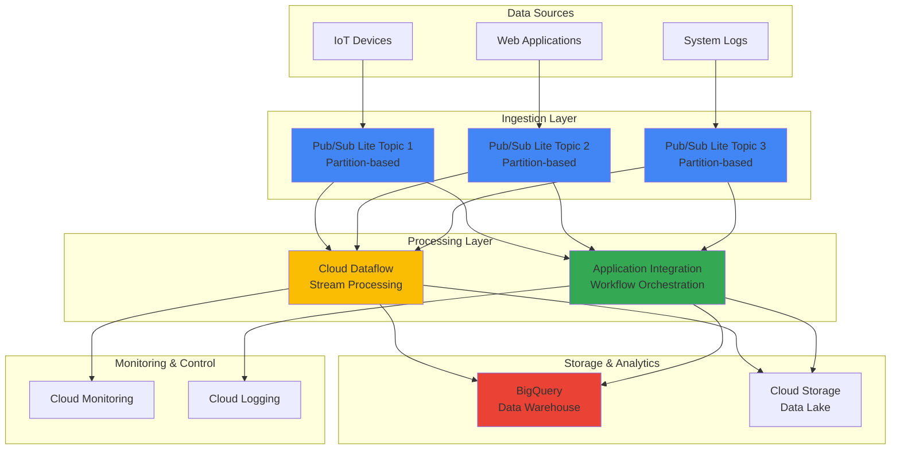

# Multi-Stream Data Processing Workflows with Pub/Sub Lite and Application Integration

## Problem

Many organizations struggle with processing high-volume data streams cost-effectively while maintaining real-time analytics capabilities and automated workflow orchestration. Traditional messaging solutions often require over-provisioning resources for peak loads, leading to increased costs during low-traffic periods, while lacking integrated workflow automation for complex multi-step data processing pipelines.

## Solution

Build a cost-optimized data streaming architecture using Pub/Sub Lite's partition-based messaging system for predictable throughput and pricing, combined with Application Integration for automated workflow orchestration. This solution leverages Cloud Dataflow for stream processing and BigQuery for real-time analytics, providing enterprise-scale data processing with fine-grained cost control and automated business logic execution.

## Architecture Diagram



## Prerequisites

1. Google Cloud project with billing enabled and appropriate IAM permissions for Pub/Sub Lite, Application Integration, Cloud Dataflow, and BigQuery
2. Google Cloud CLI (gcloud) installed and configured with authentication
3. Basic understanding of stream processing concepts, message partitioning, and workflow orchestration
4. Knowledge of BigQuery SQL and data modeling principles
5. Estimated cost: $50-150/month depending on data volume and processing requirements (Pub/Sub Lite offers predictable pricing based on reserved throughput capacity)

> **Note**: Pub/Sub Lite uses partition-based messaging which requires different design patterns compared to traditional Pub/Sub. Review [Pub/Sub Lite documentation](https://cloud.google.com/pubsub/lite/docs) for architectural considerations.

## Preparation

```bash
# Set environment variables for the project
export PROJECT_ID="data-streaming-$(date +%s)"
export REGION="us-central1"
export ZONE="us-central1-a"

# Generate unique suffix for resource names
RANDOM_SUFFIX=$(openssl rand -hex 3)
export LITE_TOPIC_1="iot-data-stream-${RANDOM_SUFFIX}"
export LITE_TOPIC_2="app-events-stream-${RANDOM_SUFFIX}"
export LITE_TOPIC_3="system-logs-stream-${RANDOM_SUFFIX}"
export SUBSCRIPTION_PREFIX="analytics-sub-${RANDOM_SUFFIX}"
export DATASET_NAME="streaming_analytics_${RANDOM_SUFFIX}"
export BUCKET_NAME="data-lake-${PROJECT_ID}-${RANDOM_SUFFIX}"

# Set default project and region
gcloud config set project ${PROJECT_ID}
gcloud config set compute/region ${REGION}
gcloud config set compute/zone ${ZONE}

# Enable required Google Cloud APIs
gcloud services enable pubsublite.googleapis.com
gcloud services enable integrations.googleapis.com
gcloud services enable dataflow.googleapis.com
gcloud services enable bigquery.googleapis.com
gcloud services enable storage.googleapis.com
gcloud services enable monitoring.googleapis.com
gcloud services enable logging.googleapis.com

# Create BigQuery dataset for analytics
bq mk --dataset \
    --location=${REGION} \
    ${PROJECT_ID}:${DATASET_NAME}

# Create Cloud Storage bucket for data lake
gsutil mb -p ${PROJECT_ID} \
    -c STANDARD \
    -l ${REGION} \
    gs://${BUCKET_NAME}

echo "✅ Project configured: ${PROJECT_ID}"
echo "✅ APIs enabled and foundational resources created"
```

## Steps

1. **Create Pub/Sub Lite Topics with Partition Configuration**:

   Pub/Sub Lite provides cost-effective, high-throughput messaging through partition-based architecture that enables predictable pricing and performance. Unlike traditional Pub/Sub, Lite requires you to pre-provision throughput capacity, making it ideal for applications with stable messaging patterns where cost optimization is critical.

   ```bash
   # Create Pub/Sub Lite topics with partition configuration
   # Each topic is configured for specific data stream characteristics
   
   # IoT data stream - high frequency, small messages
   gcloud pubsub lite-topics create ${LITE_TOPIC_1} \
       --location=${REGION} \
       --partitions=4 \
       --publish-throughput-capacity=4 \
       --subscribe-throughput-capacity=8 \
       --per-partition-bytes=30GiB \
       --message-retention-duration=7d
   
   # Application events - medium frequency, structured data
   gcloud pubsub lite-topics create ${LITE_TOPIC_2} \
       --location=${REGION} \
       --partitions=2 \
       --publish-throughput-capacity=2 \
       --subscribe-throughput-capacity=4 \
       --per-partition-bytes=50GiB \
       --message-retention-duration=14d
   
   # System logs - variable frequency, larger messages
   gcloud pubsub lite-topics create ${LITE_TOPIC_3} \
       --location=${REGION} \
       --partitions=3 \
       --publish-throughput-capacity=3 \
       --subscribe-throughput-capacity=6 \
       --per-partition-bytes=40GiB \
       --message-retention-duration=30d
   
   echo "✅ Pub/Sub Lite topics created with optimized partition configuration"
   ```

   The partition-based architecture provides ordered message delivery within each partition and enables horizontal scaling based on your throughput requirements. This configuration establishes dedicated capacity that ensures consistent performance while providing cost predictability through reserved throughput pricing.

2. **Create Pub/Sub Lite Subscriptions for Stream Processing**:

   Subscriptions in Pub/Sub Lite must be configured to match your consumer parallelism patterns. Each subscription can consume from multiple partitions, and the partition assignment affects message ordering and processing distribution across your downstream applications.

   ```bash
   # Create subscriptions for different processing workflows
   
   # Subscription for real-time analytics processing
   gcloud pubsub lite-subscriptions create ${SUBSCRIPTION_PREFIX}-analytics-1 \
       --location=${REGION} \
       --topic=${LITE_TOPIC_1} \
       --delivery-requirement=deliver-immediately
   
   gcloud pubsub lite-subscriptions create ${SUBSCRIPTION_PREFIX}-analytics-2 \
       --location=${REGION} \
       --topic=${LITE_TOPIC_2} \
       --delivery-requirement=deliver-immediately
   
   gcloud pubsub lite-subscriptions create ${SUBSCRIPTION_PREFIX}-analytics-3 \
       --location=${REGION} \
       --topic=${LITE_TOPIC_3} \
       --delivery-requirement=deliver-immediately
   
   # Subscription for workflow orchestration
   gcloud pubsub lite-subscriptions create ${SUBSCRIPTION_PREFIX}-workflow-1 \
       --location=${REGION} \
       --topic=${LITE_TOPIC_1} \
       --delivery-requirement=deliver-after-stored
   
   gcloud pubsub lite-subscriptions create ${SUBSCRIPTION_PREFIX}-workflow-2 \
       --location=${REGION} \
       --topic=${LITE_TOPIC_2} \
       --delivery-requirement=deliver-after-stored
   
   echo "✅ Pub/Sub Lite subscriptions created for multiple processing patterns"
   ```

   These subscriptions enable multiple consumers to process the same data streams with different delivery guarantees. The immediate delivery subscriptions support low-latency analytics, while the stored delivery subscriptions ensure durability for critical workflow processes.

3. **Set Up BigQuery Tables for Real-Time Analytics**:

   BigQuery's serverless architecture and columnar storage provide optimal performance for analytical workloads on streaming data. Partitioning and clustering the tables based on timestamp and key dimensions enables efficient queries and cost optimization through reduced data scanning.

   ```bash
   # Create partitioned and clustered tables for optimal query performance
   
   # IoT sensor data table
   bq mk --table \
       ${PROJECT_ID}:${DATASET_NAME}.iot_sensor_data \
       timestamp:TIMESTAMP,device_id:STRING,sensor_type:STRING,value:FLOAT64,location:GEOGRAPHY,metadata:JSON
   
   # Configure partitioning and clustering
   bq query --use_legacy_sql=false \
   "ALTER TABLE \`${PROJECT_ID}.${DATASET_NAME}.iot_sensor_data\`
   SET OPTIONS (
     partition_expiration_days = 365,
     clustering_fields = ['device_id', 'sensor_type']
   )"
   
   # Application events table
   bq mk --table \
       ${PROJECT_ID}:${DATASET_NAME}.application_events \
       event_timestamp:TIMESTAMP,user_id:STRING,event_type:STRING,session_id:STRING,properties:JSON,revenue:FLOAT64
   
   bq query --use_legacy_sql=false \
   "ALTER TABLE \`${PROJECT_ID}.${DATASET_NAME}.application_events\`
   SET OPTIONS (
     partition_expiration_days = 730,
     clustering_fields = ['user_id', 'event_type']
   )"
   
   # System logs aggregation table
   bq mk --table \
       ${PROJECT_ID}:${DATASET_NAME}.system_logs_summary \
       log_timestamp:TIMESTAMP,service_name:STRING,log_level:STRING,error_count:INT64,response_time_ms:FLOAT64,request_count:INT64
   
   echo "✅ BigQuery tables created with optimized partitioning and clustering"
   ```

   The table design follows BigQuery best practices with time-based partitioning for lifecycle management and clustering on frequently filtered columns. This structure supports both real-time dashboard queries and complex analytical workloads with optimal performance and cost efficiency.

4. **Create Application Integration Workflow for Data Processing Orchestration**:

   Application Integration provides a low-code approach to building complex data processing workflows that can respond to Pub/Sub Lite messages, execute business logic, and coordinate multiple Google Cloud services. This integration enables sophisticated data validation, transformation, and routing logic without custom code development.

   ```bash
   # Create service account for Application Integration
   gcloud iam service-accounts create app-integration-sa-${RANDOM_SUFFIX} \
       --display-name="Application Integration Service Account" \
       --description="Service account for data processing workflows"
   
   # Grant necessary IAM permissions
   gcloud projects add-iam-policy-binding ${PROJECT_ID} \
       --member="serviceAccount:app-integration-sa-${RANDOM_SUFFIX}@${PROJECT_ID}.iam.gserviceaccount.com" \
       --role="roles/pubsublite.editor"
   
   gcloud projects add-iam-policy-binding ${PROJECT_ID} \
       --member="serviceAccount:app-integration-sa-${RANDOM_SUFFIX}@${PROJECT_ID}.iam.gserviceaccount.com" \
       --role="roles/bigquery.dataEditor"
   
   gcloud projects add-iam-policy-binding ${PROJECT_ID} \
       --member="serviceAccount:app-integration-sa-${RANDOM_SUFFIX}@${PROJECT_ID}.iam.gserviceaccount.com" \
       --role="roles/storage.objectAdmin"
   
   # Enable Application Integration API and create initial configuration
   gcloud alpha integration regions provision \
       --location=${REGION} \
       --kms-config-project-id=${PROJECT_ID}
   
   echo "✅ Application Integration environment configured with proper IAM permissions"
   ```

   The service account configuration follows the principle of least privilege, granting only the specific permissions needed for the data processing workflows. Application Integration will use this identity to securely access Pub/Sub Lite, BigQuery, and Cloud Storage resources while maintaining audit trails and access controls.

5. **Deploy Cloud Dataflow Pipeline for Stream Processing**:

   Cloud Dataflow provides fully managed stream processing with automatic scaling and built-in integration with Pub/Sub Lite. The Apache Beam programming model enables complex windowing, aggregation, and transformation operations on streaming data while Dataflow handles infrastructure management and scaling decisions.

   ```bash
   # Create temporary Cloud Storage location for Dataflow staging
   gsutil mkdir gs://${BUCKET_NAME}/dataflow-temp
   gsutil mkdir gs://${BUCKET_NAME}/dataflow-staging
   
   # Create a basic Dataflow pipeline template for Pub/Sub Lite to BigQuery
   cat > pubsub-lite-to-bigquery-template.json << 'EOF'
   {
     "name": "PubSubLiteToBigQuery",
     "description": "Stream processing pipeline from Pub/Sub Lite to BigQuery",
     "parameters": [
       {
         "name": "inputSubscription",
         "label": "Pub/Sub Lite subscription path",
         "helpText": "Pub/Sub Lite subscription to read from"
       },
       {
         "name": "outputTable",
         "label": "BigQuery output table",
         "helpText": "BigQuery table to write results"
       }
     ]
   }
   EOF
   
   # Upload template configuration
   gsutil cp pubsub-lite-to-bigquery-template.json gs://${BUCKET_NAME}/templates/
   
   # Launch Dataflow job for IoT data processing
   gcloud dataflow jobs run iot-stream-processor-${RANDOM_SUFFIX} \
       --gcs-location=gs://dataflow-templates-${REGION}/latest/PubSub_Lite_to_BigQuery \
       --region=${REGION} \
       --parameters=inputSubscription=projects/${PROJECT_ID}/locations/${REGION}/subscriptions/${SUBSCRIPTION_PREFIX}-analytics-1,outputTable=${PROJECT_ID}:${DATASET_NAME}.iot_sensor_data \
       --max-workers=4 \
       --worker-machine-type=n1-standard-2 \
       --temp-location=gs://${BUCKET_NAME}/dataflow-temp \
       --staging-location=gs://${BUCKET_NAME}/dataflow-staging
   
   echo "✅ Cloud Dataflow pipeline deployed for real-time stream processing"
   ```

   The Dataflow pipeline automatically scales based on the message throughput from Pub/Sub Lite partitions and handles exactly-once delivery semantics to BigQuery. This ensures data consistency while providing the performance needed for real-time analytics dashboards and operational monitoring.

6. **Configure Monitoring and Alerting for the Pipeline**:

   Cloud Monitoring provides comprehensive observability for the entire data processing pipeline, from Pub/Sub Lite partition metrics to BigQuery job performance. Setting up proactive alerting helps identify performance bottlenecks, capacity issues, and data quality problems before they impact business operations.

   ```bash
   # Create custom monitoring dashboard
   cat > monitoring-dashboard.json << EOF
   {
     "displayName": "Multi-Stream Data Processing Dashboard",
     "mosaicLayout": {
       "tiles": [
         {
           "width": 6,
           "height": 4,
           "widget": {
             "title": "Pub/Sub Lite Message Rate",
             "xyChart": {
               "dataSets": [
                 {
                   "timeSeriesQuery": {
                     "timeSeriesFilter": {
                       "filter": "resource.type=\"pubsub_lite_topic\""
                     }
                   }
                 }
               ]
             }
           }
         }
       ]
     }
   }
   EOF
   
   # Create the dashboard
   gcloud monitoring dashboards create --config-from-file=monitoring-dashboard.json
   
   # Set up alerting policy for high message backlog
   gcloud alpha monitoring policies create \
       --policy-from-file=<(cat << 'EOF'
   displayName: "High Pub/Sub Lite Message Backlog"
   conditions:
     - displayName: "Message backlog too high"
       conditionThreshold:
         filter: 'resource.type="pubsub_lite_subscription"'
         comparison: COMPARISON_GREATER_THAN
         thresholdValue: 10000
         duration: 300s
   alertStrategy:
     autoClose: 604800s
   EOF
   )
   
   echo "✅ Monitoring dashboard and alerting policies configured"
   ```

   The monitoring configuration provides visibility into message processing rates, partition utilization, and downstream system performance. Automated alerting ensures rapid response to capacity issues or data processing delays that could impact business operations.

7. **Test the Complete Data Processing Pipeline**:

   Testing validates that all components work together correctly and helps identify any configuration issues or performance bottlenecks. The test data simulates realistic message patterns and volumes to ensure the system can handle production workloads.

   ```bash
   # Generate sample data for testing the pipeline
   cat > generate-test-data.py << 'EOF'
   import json
   import time
   import random
   from google.cloud import pubsublite
   from concurrent.futures import ThreadPoolExecutor
   
   def publish_iot_data(topic_path, num_messages=100):
       publisher = pubsublite.PublisherClient()
       for i in range(num_messages):
           data = {
               "timestamp": int(time.time() * 1000),
               "device_id": f"device_{random.randint(1, 100)}",
               "sensor_type": random.choice(["temperature", "humidity", "pressure"]),
               "value": round(random.uniform(10.0, 50.0), 2),
               "location": "POINT(-122.4194 37.7749)"
           }
           message = pubsublite.PubsubMessage(data=json.dumps(data).encode())
           publisher.publish(topic_path, message)
           time.sleep(0.1)
   
   if __name__ == "__main__":
       topic_path = pubsublite.TopicPath(
           "${PROJECT_ID}", "${REGION}", "${LITE_TOPIC_1}"
       )
       publish_iot_data(topic_path)
   EOF
   
   # Install required Python packages and run test
   pip3 install google-cloud-pubsublite
   python3 generate-test-data.py
   
   # Verify data is flowing through the pipeline
   sleep 60
   
   # Check BigQuery for received data
   bq query --use_legacy_sql=false \
   "SELECT COUNT(*) as message_count, 
           MIN(timestamp) as earliest_message,
           MAX(timestamp) as latest_message
    FROM \`${PROJECT_ID}.${DATASET_NAME}.iot_sensor_data\`
    WHERE timestamp >= TIMESTAMP_SUB(CURRENT_TIMESTAMP(), INTERVAL 5 MINUTE)"
   
   echo "✅ Pipeline test completed - check BigQuery results above"
   ```

   The test validates end-to-end data flow from message publication through stream processing to final storage in BigQuery. Successful test results confirm that partition assignment, message ordering, and data transformation are working correctly.

## Validation & Testing

1. **Verify Pub/Sub Lite Topics and Subscription Configuration**:

   ```bash
   # Check topic configuration and status
   gcloud pubsub lite-topics describe ${LITE_TOPIC_1} \
       --location=${REGION} \
       --format="table(name,partitions,throughputCapacity.publishMibPerSec,throughputCapacity.subscribeMibPerSec)"
   
   # Verify subscription status
   gcloud pubsub lite-subscriptions list \
       --location=${REGION} \
       --format="table(name,topic,deliveryConfig.deliveryRequirement)"
   ```

   Expected output: Topics should show configured partition counts and throughput capacity. Subscriptions should be active and properly associated with their topics.

2. **Test Message Publishing and Consumption**:

   ```bash
   # Monitor message flow through Pub/Sub Lite
   gcloud pubsub lite-topics get-partition-metadata ${LITE_TOPIC_1} \
       --location=${REGION} \
       --partition=0
   
   # Check subscription backlog
   gcloud pubsub lite-subscriptions describe ${SUBSCRIPTION_PREFIX}-analytics-1 \
       --location=${REGION}
   ```

   Expected output: Partition metadata should show message offset progression, and subscription backlog should be minimal during normal operations.

3. **Validate BigQuery Data Ingestion and Query Performance**:

   ```bash
   # Test analytical query performance
   bq query --use_legacy_sql=false \
   "SELECT 
       sensor_type,
       COUNT(*) as reading_count,
       AVG(value) as avg_value,
       STDDEV(value) as value_stddev
    FROM \`${PROJECT_ID}.${DATASET_NAME}.iot_sensor_data\`
    WHERE timestamp >= TIMESTAMP_SUB(CURRENT_TIMESTAMP(), INTERVAL 1 HOUR)
    GROUP BY sensor_type
    ORDER BY reading_count DESC"
   ```

   Expected output: Query should execute quickly (under 5 seconds) and return aggregated sensor data with statistical measures.

4. **Verify Cloud Dataflow Pipeline Health**:

   ```bash
   # Check Dataflow job status and metrics
   gcloud dataflow jobs list \
       --region=${REGION} \
       --status=running \
       --format="table(id,name,state,currentWorkers)"
   
   # Get detailed job metrics
   JOB_ID=$(gcloud dataflow jobs list --region=${REGION} --filter="name:iot-stream-processor-${RANDOM_SUFFIX}" --format="value(id)" --limit=1)
   gcloud dataflow jobs show ${JOB_ID} --region=${REGION}
   ```

   Expected output: Dataflow job should be in "Running" state with active workers processing messages from Pub/Sub Lite.

## Cleanup

1. **Stop Dataflow Pipeline and Clean Up Compute Resources**:

   ```bash
   # Stop Dataflow jobs
   JOB_ID=$(gcloud dataflow jobs list --region=${REGION} --filter="name:iot-stream-processor-${RANDOM_SUFFIX}" --format="value(id)" --limit=1)
   gcloud dataflow jobs cancel ${JOB_ID} --region=${REGION}
   
   # Wait for job to stop
   sleep 60
   
   echo "✅ Dataflow pipeline stopped"
   ```

2. **Delete Pub/Sub Lite Resources**:

   ```bash
   # Delete subscriptions first
   gcloud pubsub lite-subscriptions delete ${SUBSCRIPTION_PREFIX}-analytics-1 --location=${REGION} --quiet
   gcloud pubsub lite-subscriptions delete ${SUBSCRIPTION_PREFIX}-analytics-2 --location=${REGION} --quiet
   gcloud pubsub lite-subscriptions delete ${SUBSCRIPTION_PREFIX}-analytics-3 --location=${REGION} --quiet
   gcloud pubsub lite-subscriptions delete ${SUBSCRIPTION_PREFIX}-workflow-1 --location=${REGION} --quiet
   gcloud pubsub lite-subscriptions delete ${SUBSCRIPTION_PREFIX}-workflow-2 --location=${REGION} --quiet
   
   # Delete topics
   gcloud pubsub lite-topics delete ${LITE_TOPIC_1} --location=${REGION} --quiet
   gcloud pubsub lite-topics delete ${LITE_TOPIC_2} --location=${REGION} --quiet
   gcloud pubsub lite-topics delete ${LITE_TOPIC_3} --location=${REGION} --quiet
   
   echo "✅ Pub/Sub Lite resources deleted"
   ```

3. **Remove BigQuery Dataset and Cloud Storage Bucket**:

   ```bash
   # Delete BigQuery dataset and all tables
   bq rm -r -f ${PROJECT_ID}:${DATASET_NAME}
   
   # Remove Cloud Storage bucket and contents
   gsutil -m rm -r gs://${BUCKET_NAME}
   
   echo "✅ Storage resources cleaned up"
   ```

4. **Delete Service Accounts and IAM Bindings**:

   ```bash
   # Remove IAM bindings
   gcloud projects remove-iam-policy-binding ${PROJECT_ID} \
       --member="serviceAccount:app-integration-sa-${RANDOM_SUFFIX}@${PROJECT_ID}.iam.gserviceaccount.com" \
       --role="roles/pubsublite.editor"
   
   # Delete service account
   gcloud iam service-accounts delete \
       app-integration-sa-${RANDOM_SUFFIX}@${PROJECT_ID}.iam.gserviceaccount.com \
       --quiet
   
   echo "✅ Service accounts and IAM bindings removed"
   echo "Note: Consider deleting the entire project if created specifically for this recipe"
   ```

## Discussion

This multi-stream data processing architecture demonstrates how Google Cloud's specialized messaging and integration services can be combined to create cost-effective, high-performance analytics pipelines. **Pub/Sub Lite's partition-based messaging model** provides significant cost advantages over traditional pub/sub systems by allowing you to reserve exactly the throughput capacity you need, rather than paying per-message or over-provisioning for peak loads. The partition-based approach also enables ordered message processing within each partition, which is crucial for many analytical workloads and state management scenarios.

**Application Integration serves as the orchestration backbone**, enabling complex business logic and workflow automation without requiring custom application development. This iPaaS approach reduces development time and maintenance overhead while providing visual workflow design, error handling, and monitoring capabilities. The integration with Pub/Sub Lite allows for event-driven architectures that can respond to data patterns, trigger automated actions, and coordinate multi-step processing workflows across different Google Cloud services.

The combination of **Cloud Dataflow and BigQuery** provides both real-time stream processing and analytical query capabilities at scale. Dataflow's Apache Beam programming model enables sophisticated windowing, aggregation, and transformation operations while automatically managing resource scaling based on partition throughput. BigQuery's serverless architecture and columnar storage optimize analytical query performance, while partitioning and clustering strategies minimize costs and maximize query speed for time-series data patterns.

**Cost optimization** is achieved through several architectural decisions: Pub/Sub Lite's reserved capacity pricing provides predictable costs and typically reduces messaging expenses by 30-60% compared to per-message pricing models. Cloud Dataflow's automatic scaling ensures you only pay for the compute resources needed to process your actual data volume, while BigQuery's slot-based pricing and storage optimization features like partitioning and clustering reduce query costs. This architecture scales from startup workloads to enterprise volumes while maintaining cost efficiency at each scale point.

> **Tip**: Monitor partition utilization metrics regularly to optimize throughput capacity reservations. Pub/Sub Lite allows you to adjust capacity settings without service interruption, enabling fine-tuning based on actual usage patterns. See the [Pub/Sub Lite monitoring guide](https://cloud.google.com/pubsub/lite/docs/monitoring) for detailed capacity planning strategies.

For more detailed implementation guidance, consult the [Google Cloud Architecture Framework](https://cloud.google.com/architecture/framework) for data analytics best practices, the [Pub/Sub Lite documentation](https://cloud.google.com/pubsub/lite/docs) for advanced partition management strategies, the [Application Integration best practices guide](https://cloud.google.com/application-integration/docs/best-practices) for workflow optimization, the [Cloud Dataflow performance optimization guide](https://cloud.google.com/dataflow/docs/guides/deploying-a-pipeline#performance-and-cost-optimization) for stream processing tuning, and the [BigQuery best practices documentation](https://cloud.google.com/bigquery/docs/best-practices-performance-overview) for analytical query optimization.

## Challenge

Extend this solution by implementing these enhancements:

1. **Multi-Region Data Replication**: Configure regional Pub/Sub Lite topics with cross-region replication to BigQuery datasets, implementing automated failover and data consistency validation across regions for disaster recovery scenarios.

2. **Advanced Stream Processing**: Implement real-time anomaly detection using Dataflow's windowing functions and statistical analysis, with automatic alerting through Application Integration workflows when anomalies exceed configurable thresholds.

3. **ML-Powered Data Quality**: Integrate Vertex AI for automatic data quality assessment and schema evolution detection, using Application Integration to route data through validation pipelines and quarantine invalid messages for manual review.

4. **Dynamic Scaling Automation**: Build Application Integration workflows that monitor Pub/Sub Lite partition utilization and automatically adjust throughput capacity reservations based on traffic patterns, seasonal trends, and business growth projections.

5. **Advanced Security Controls**: Implement fine-grained access controls using Cloud IAM Conditions, data encryption with customer-managed keys, and audit logging integration with Security Command Center for comprehensive security monitoring and compliance reporting.

## Infrastructure Code

*Infrastructure code will be generated after recipe approval.*