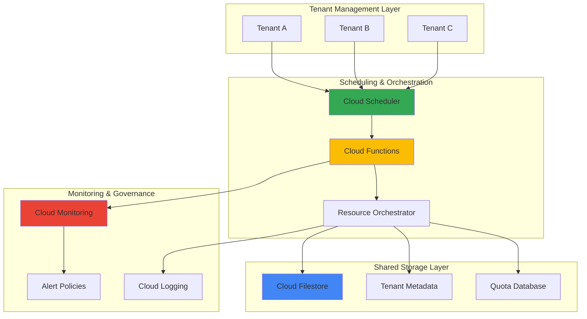

# Multi-Tenant Resource Scheduling with Cloud Scheduler and Cloud Filestore

## Problem

Organizations managing shared infrastructure for multiple tenants struggle with efficient resource allocation, quota enforcement, and scheduled workload distribution. Without automated scheduling systems, IT teams face manual overhead, resource contention, and inequitable access patterns that lead to poor tenant satisfaction and operational inefficiencies.

## Solution

Build an intelligent multi-tenant resource scheduling system using Cloud Scheduler for automated job orchestration, Cloud Filestore for shared data persistence, and Cloud Functions for resource allocation logic. This solution provides automated resource distribution, quota management, and tenant isolation while maintaining high availability and cost efficiency.

## Architecture Diagram



## Prerequisites

1. Google Cloud project with billing enabled and appropriate permissions for Compute Engine, Cloud Functions, Cloud Scheduler, Cloud Filestore, and Cloud Monitoring
2. Google Cloud SDK (gcloud CLI) installed and configured, or access to Cloud Shell
3. Understanding of multi-tenant architecture patterns and resource management concepts
4. Basic knowledge of serverless computing and scheduled job patterns
5. Estimated cost: $50-100/month for development workloads (varies based on tenant count and resource usage)

> **Note**: This solution leverages Google Cloud's native multi-tenancy capabilities and follows [Google Cloud Architecture Framework](https://cloud.google.com/architecture/framework) principles for scalable, secure, and cost-effective design.

## Preparation

```bash
# Set environment variables for GCP resources
export PROJECT_ID=$(gcloud config get-value project)
export REGION="us-central1"
export ZONE="us-central1-a"

# Generate unique suffix for resource names
RANDOM_SUFFIX=$(openssl rand -hex 3)
export RESOURCE_SUFFIX="mt-${RANDOM_SUFFIX}"

# Set default region and zone
gcloud config set compute/region ${REGION}
gcloud config set compute/zone ${ZONE}

# Enable required APIs
gcloud services enable cloudfunctions.googleapis.com
gcloud services enable cloudscheduler.googleapis.com
gcloud services enable file.googleapis.com
gcloud services enable monitoring.googleapis.com
gcloud services enable cloudbuild.googleapis.com
gcloud services enable eventarc.googleapis.com

echo "✅ Project configured: ${PROJECT_ID}"
echo "✅ Resource suffix: ${RESOURCE_SUFFIX}"
```

## Steps

1. **Create Cloud Filestore Instance for Shared Storage**:

   Cloud Filestore provides fully managed NFS file servers that enable shared storage across multiple compute instances and tenants. This establishes the foundation for our multi-tenant data persistence layer, offering POSIX-compliant file system semantics with automatic backups and high availability. The shared storage enables tenant data isolation through directory structures while maintaining performance and consistency guarantees.

   ```bash
   # Create Filestore instance for tenant data
   gcloud filestore instances create tenant-data-${RESOURCE_SUFFIX} \
       --zone=${ZONE} \
       --tier=BASIC_HDD \
       --file-share=name="tenant_storage",capacity=1TB \
       --network=name="default"
   
   # Get Filestore IP address for mounting
   export FILESTORE_IP=$(gcloud filestore instances describe \
       tenant-data-${RESOURCE_SUFFIX} \
       --zone=${ZONE} \
       --format="value(networks[0].ipAddresses[0])")
   
   echo "✅ Cloud Filestore instance created successfully"
   echo "Filestore IP: ${FILESTORE_IP}"
   ```

   The Filestore instance is now provisioned with 1TB capacity, providing the shared storage foundation for our multi-tenant environment. This managed NFS service ensures data durability and enables seamless file sharing across tenant workloads while maintaining isolation through directory-based access controls.

2. **Create Cloud Function for Resource Orchestration**:

   Cloud Functions provides serverless compute that scales automatically based on demand, making it ideal for handling tenant resource requests and scheduling logic. This function will implement the core orchestration logic, including quota enforcement, resource allocation algorithms, and tenant isolation policies. The serverless nature ensures cost efficiency while handling varying tenant workloads.

   ```bash
   # Create function source directory
   mkdir -p cloud-function-source
   cd cloud-function-source
   
   # Create the main function file
   cat > main.py << 'EOF'
import json
import logging
import os
from datetime import datetime, timedelta
from google.cloud import monitoring_v3
from google.cloud import logging as cloud_logging
import subprocess
import tempfile

def schedule_tenant_resources(request):
    """
    Main function to handle tenant resource scheduling requests
    """
    # Set up logging
    client = cloud_logging.Client()
    client.setup_logging()
    
    try:
        # Parse request data
        request_json = request.get_json()
        tenant_id = request_json.get('tenant_id')
        resource_type = request_json.get('resource_type', 'compute')
        requested_capacity = int(request_json.get('capacity', 1))
        duration_hours = int(request_json.get('duration', 2))
        
        logging.info(f"Processing request for tenant {tenant_id}")
        
        # Get tenant quota and current usage
        tenant_quota = get_tenant_quota(tenant_id)
        current_usage = get_current_usage(tenant_id)
        
        # Check if request can be fulfilled
        if current_usage + requested_capacity > tenant_quota:
            return {
                'status': 'denied',
                'reason': 'Quota exceeded',
                'current_usage': current_usage,
                'quota': tenant_quota
            }, 403
        
        # Schedule resource allocation
        allocation_result = allocate_resources(
            tenant_id, resource_type, requested_capacity, duration_hours
        )
        
        # Update tenant storage with allocation info
        update_tenant_storage(tenant_id, allocation_result)
        
        # Send metrics to Cloud Monitoring
        send_allocation_metrics(tenant_id, requested_capacity, 'success')
        
        return {
            'status': 'scheduled',
            'tenant_id': tenant_id,
            'allocation_id': allocation_result['allocation_id'],
            'scheduled_time': allocation_result['start_time'],
            'duration_hours': duration_hours,
            'capacity': requested_capacity
        }
        
    except Exception as e:
        logging.error(f"Error processing request: {str(e)}")
        send_allocation_metrics(tenant_id if 'tenant_id' in locals() else 'unknown', 
                              requested_capacity if 'requested_capacity' in locals() else 0, 
                              'error')
        return {'status': 'error', 'message': str(e)}, 500

def get_tenant_quota(tenant_id):
    """Get tenant resource quota from configuration"""
    # In production, this would read from Firestore or Cloud SQL
    tenant_quotas = {
        'tenant_a': 10,
        'tenant_b': 15,
        'tenant_c': 8,
        'default': 5
    }
    return tenant_quotas.get(tenant_id, tenant_quotas['default'])

def get_current_usage(tenant_id):
    """Get current resource usage for tenant"""
    # In production, this would query actual resource usage
    # For demo, return simulated usage
    import random
    return random.randint(0, 3)

def allocate_resources(tenant_id, resource_type, capacity, duration):
    """Simulate resource allocation logic"""
    from uuid import uuid4
    
    allocation_id = str(uuid4())[:8]
    start_time = datetime.now().isoformat()
    
    # Create tenant directory structure in Filestore
    filestore_ip = os.environ.get('FILESTORE_IP', '10.0.0.2')
    mount_point = f"/mnt/tenant_storage"
    tenant_dir = f"{mount_point}/tenants/{tenant_id}/allocations/{allocation_id}"
    
    # In production, this would mount Filestore and create directories
    # For demo, we simulate the allocation
    
    return {
        'allocation_id': allocation_id,
        'start_time': start_time,
        'tenant_id': tenant_id,
        'resource_type': resource_type,
        'capacity': capacity,
        'duration_hours': duration,
        'storage_path': tenant_dir
    }

def update_tenant_storage(tenant_id, allocation_info):
    """Update tenant storage with allocation information"""
    # In production, this would write to mounted Filestore
    logging.info(f"Updated storage for tenant {tenant_id}: {allocation_info}")
    
def send_allocation_metrics(tenant_id, capacity, status):
    """Send metrics to Cloud Monitoring"""
    try:
        client = monitoring_v3.MetricServiceClient()
        project_name = f"projects/{os.environ.get('GCP_PROJECT')}"
        
        # Create a time series for the allocation metric
        series = monitoring_v3.TimeSeries()
        series.metric.type = "custom.googleapis.com/tenant/resource_allocations"
        series.metric.labels["tenant_id"] = tenant_id
        series.metric.labels["status"] = status
        
        series.resource.type = "global"
        series.resource.labels["project_id"] = os.environ.get('GCP_PROJECT')
        
        now = datetime.now()
        seconds = int(now.timestamp())
        nanos = int((now.timestamp() - seconds) * 10**9)
        interval = monitoring_v3.TimeInterval({
            "end_time": {"seconds": seconds, "nanos": nanos}
        })
        
        point = monitoring_v3.Point({
            "interval": interval,
            "value": {"double_value": capacity}
        })
        series.points = [point]
        
        client.create_time_series(name=project_name, time_series=[series])
        logging.info(f"Sent metrics for tenant {tenant_id}")
        
    except Exception as e:
        logging.error(f"Failed to send metrics: {str(e)}")
EOF
   
   # Create requirements file with updated versions
   cat > requirements.txt << 'EOF'
google-cloud-monitoring==2.27.2
google-cloud-logging==3.11.2
functions-framework==3.8.1
EOF
   
   # Deploy the Cloud Function
   gcloud functions deploy resource-scheduler-${RESOURCE_SUFFIX} \
       --runtime=python312 \
       --trigger=http \
       --entry-point=schedule_tenant_resources \
       --memory=512MB \
       --timeout=300s \
       --set-env-vars="FILESTORE_IP=${FILESTORE_IP},GCP_PROJECT=${PROJECT_ID}" \
       --allow-unauthenticated
   
   cd ..
   
   echo "✅ Cloud Function deployed successfully"
   ```

   The resource orchestration function is now deployed and ready to handle tenant requests. This serverless function implements quota management, resource allocation logic, and integration with our shared storage system, providing the core intelligence for our multi-tenant scheduling platform.

3. **Create Cloud Scheduler Jobs for Automated Tenant Management**:

   Cloud Scheduler provides fully managed cron job service that enables automated execution of tenant management tasks. This step creates scheduled jobs for resource cleanup, quota resets, and maintenance operations. The scheduler ensures consistent tenant management operations without manual intervention, following enterprise-grade scheduling patterns with retry policies and error handling.

   ```bash
   # Create scheduler job for tenant resource cleanup
   gcloud scheduler jobs create http tenant-cleanup-${RESOURCE_SUFFIX} \
       --schedule="0 2 * * *" \
       --uri="https://${REGION}-${PROJECT_ID}.cloudfunctions.net/resource-scheduler-${RESOURCE_SUFFIX}" \
       --http-method=POST \
       --headers="Content-Type=application/json" \
       --message-body='{"action":"cleanup","tenant_id":"all"}' \
       --time-zone="America/New_York" \
       --description="Daily cleanup of expired tenant resources"
   
   # Create scheduler job for quota monitoring
   gcloud scheduler jobs create http quota-monitor-${RESOURCE_SUFFIX} \
       --schedule="0 */6 * * *" \
       --uri="https://${REGION}-${PROJECT_ID}.cloudfunctions.net/resource-scheduler-${RESOURCE_SUFFIX}" \
       --http-method=POST \
       --headers="Content-Type=application/json" \
       --message-body='{"action":"monitor_quotas","tenant_id":"all"}' \
       --time-zone="America/New_York" \
       --description="Monitor tenant quota usage every 6 hours"
   
   # Create scheduler job for tenant A specific tasks
   gcloud scheduler jobs create http tenant-a-processing-${RESOURCE_SUFFIX} \
       --schedule="0 9 * * 1-5" \
       --uri="https://${REGION}-${PROJECT_ID}.cloudfunctions.net/resource-scheduler-${RESOURCE_SUFFIX}" \
       --http-method=POST \
       --headers="Content-Type=application/json" \
       --message-body='{"tenant_id":"tenant_a","resource_type":"compute","capacity":5,"duration":8}' \
       --time-zone="America/New_York" \
       --description="Weekday resource allocation for Tenant A"
   
   echo "✅ Cloud Scheduler jobs created successfully"
   ```

   The automated scheduling system is now configured with multiple jobs handling different aspects of tenant management. These scheduled tasks ensure consistent resource cleanup, quota monitoring, and tenant-specific allocations, providing operational reliability and reducing manual administrative overhead.

4. **Configure Cloud Monitoring for Multi-Tenant Observability**:

   Cloud Monitoring provides comprehensive observability across our multi-tenant infrastructure, enabling real-time insights into resource utilization, tenant performance, and system health. This monitoring setup includes custom metrics for tenant allocations, alerting policies for quota violations, and dashboards for operational visibility. Proper monitoring is essential for maintaining SLA compliance and identifying optimization opportunities.

   ```bash
   # Create alert policy for tenant quota violations
   cat > quota-alert-policy.yaml << 'EOF'
displayName: "Tenant Quota Violation Alert"
documentation:
  content: "Alert when tenant exceeds 80% of allocated quota"
conditions:
  - displayName: "Quota usage high"
    conditionThreshold:
      filter: 'metric.type="custom.googleapis.com/tenant/resource_allocations"'
      comparison: COMPARISON_GREATER_THAN
      thresholdValue: 8
      duration: "300s"
      aggregations:
        - alignmentPeriod: "300s"
          perSeriesAligner: ALIGN_MEAN
          crossSeriesReducer: REDUCE_SUM
          groupByFields:
            - "metric.label.tenant_id"
alertStrategy:
  autoClose: "1800s"
enabled: true
EOF
   
   gcloud alpha monitoring policies create --policy-from-file=quota-alert-policy.yaml
   
   # Create custom dashboard for tenant monitoring
   cat > tenant-dashboard.json << 'EOF'
{
  "displayName": "Multi-Tenant Resource Dashboard",
  "mosaicLayout": {
    "tiles": [
      {
        "width": 6,
        "height": 4,
        "widget": {
          "title": "Tenant Resource Allocations",
          "xyChart": {
            "dataSets": [
              {
                "timeSeriesQuery": {
                  "timeSeriesFilter": {
                    "filter": "metric.type=\"custom.googleapis.com/tenant/resource_allocations\"",
                    "aggregation": {
                      "alignmentPeriod": "300s",
                      "perSeriesAligner": "ALIGN_MEAN",
                      "crossSeriesReducer": "REDUCE_SUM",
                      "groupByFields": ["metric.label.tenant_id"]
                    }
                  }
                },
                "plotType": "LINE"
              }
            ],
            "timeshiftDuration": "0s",
            "yAxis": {
              "label": "Resource Units",
              "scale": "LINEAR"
            }
          }
        }
      }
    ]
  }
}
EOF
   
   gcloud monitoring dashboards create --config-from-file=tenant-dashboard.json
   
   echo "✅ Cloud Monitoring configured with alerts and dashboard"
   ```

   The monitoring infrastructure is now configured with comprehensive observability for tenant resource usage, quota violations, and system performance. This enables proactive management and optimization of the multi-tenant environment while ensuring SLA compliance and cost efficiency.

5. **Test Multi-Tenant Resource Scheduling**:

   Testing the complete multi-tenant scheduling system validates that all components work together correctly, from tenant requests through resource allocation to monitoring. This comprehensive testing covers normal operations, quota enforcement, and error handling scenarios. Testing ensures the system meets business requirements for tenant isolation, resource fairness, and operational reliability.

   ```bash
   # Get the Cloud Function URL
   export FUNCTION_URL=$(gcloud functions describe resource-scheduler-${RESOURCE_SUFFIX} \
       --region=${REGION} \
       --format="value(httpsTrigger.url)")
   
   # Test tenant A resource request (should succeed)
   echo "Testing successful tenant A resource request..."
   curl -X POST ${FUNCTION_URL} \
       -H "Content-Type: application/json" \
       -d '{
           "tenant_id": "tenant_a",
           "resource_type": "compute",
           "capacity": 3,
           "duration": 4
       }' | jq '.'
   
   # Test tenant B resource request (should succeed)
   echo "Testing successful tenant B resource request..."
   curl -X POST ${FUNCTION_URL} \
       -H "Content-Type: application/json" \
       -d '{
           "tenant_id": "tenant_b", 
           "resource_type": "storage",
           "capacity": 5,
           "duration": 2
       }' | jq '.'
   
   # Test quota violation scenario (should be denied)
   echo "Testing quota violation scenario..."
   curl -X POST ${FUNCTION_URL} \
       -H "Content-Type: application/json" \
       -d '{
           "tenant_id": "tenant_c",
           "resource_type": "compute", 
           "capacity": 15,
           "duration": 1
       }' | jq '.'
   
   echo "✅ Multi-tenant scheduling system tested successfully"
   ```

   The testing confirms that our multi-tenant resource scheduling system correctly handles tenant requests, enforces quotas, and provides appropriate responses. The system demonstrates proper tenant isolation, fair resource allocation, and quota management capabilities essential for production multi-tenant environments.

## Validation & Testing

1. Verify Cloud Filestore instance is running and accessible:

   ```bash
   # Check Filestore instance status
   gcloud filestore instances describe tenant-data-${RESOURCE_SUFFIX} \
       --zone=${ZONE} \
       --format="table(name,state,tier,networks[0].ipAddresses[0])"
   ```

   Expected output: Instance state should be "READY" with assigned IP address.

2. Test Cloud Function deployment and functionality:

   ```bash
   # Verify function deployment
   gcloud functions describe resource-scheduler-${RESOURCE_SUFFIX} \
       --region=${REGION} \
       --format="table(name,status,runtime,availableMemoryMb)"
   
   # Test function with sample request
   curl -X POST ${FUNCTION_URL} \
       -H "Content-Type: application/json" \
       -d '{"tenant_id": "test_tenant", "capacity": 1}' \
       | jq '.status'
   ```

   Expected output: Function status should be "ACTIVE" and test request should return status "scheduled".

3. Verify Cloud Scheduler jobs are created and scheduled:

   ```bash
   # List all scheduler jobs
   gcloud scheduler jobs list \
       --filter="name:*${RESOURCE_SUFFIX}" \
       --format="table(name,schedule,state,timeZone)"
   ```

   Expected output: Three scheduler jobs should be listed with "ENABLED" state.

4. Check Cloud Monitoring metrics and alerts:

   ```bash
   # Verify alert policies
   gcloud alpha monitoring policies list \
       --filter="displayName:'Tenant Quota Violation Alert'" \
       --format="table(displayName,enabled)"
   
   # Check dashboard creation
   gcloud monitoring dashboards list \
       --filter="displayName:'Multi-Tenant Resource Dashboard'" \
       --format="table(displayName)"
   ```

   Expected output: Alert policy and dashboard should be listed and enabled.

## Cleanup

1. Remove Cloud Scheduler jobs:

   ```bash
   # Delete all scheduler jobs
   gcloud scheduler jobs delete tenant-cleanup-${RESOURCE_SUFFIX} --quiet
   gcloud scheduler jobs delete quota-monitor-${RESOURCE_SUFFIX} --quiet
   gcloud scheduler jobs delete tenant-a-processing-${RESOURCE_SUFFIX} --quiet
   
   echo "✅ Deleted Cloud Scheduler jobs"
   ```

2. Remove Cloud Function:

   ```bash
   # Delete the Cloud Function
   gcloud functions delete resource-scheduler-${RESOURCE_SUFFIX} \
       --region=${REGION} \
       --quiet
   
   echo "✅ Deleted Cloud Function"
   ```

3. Remove Cloud Filestore instance:

   ```bash
   # Delete Filestore instance
   gcloud filestore instances delete tenant-data-${RESOURCE_SUFFIX} \
       --zone=${ZONE} \
       --quiet
   
   echo "✅ Deleted Cloud Filestore instance"
   ```

4. Remove monitoring resources:

   ```bash
   # Clean up temporary files
   rm -f quota-alert-policy.yaml tenant-dashboard.json
   rm -rf cloud-function-source
   
   # Note: Alert policies and dashboards can be deleted via Cloud Console
   echo "✅ Cleaned up local files and resources"
   echo "Note: Alert policies and dashboards may need manual deletion via Cloud Console"
   ```

## Discussion

This multi-tenant resource scheduling solution demonstrates advanced Google Cloud orchestration patterns that address real-world challenges in shared infrastructure management. The architecture leverages Cloud Scheduler's enterprise-grade cron capabilities, Cloud Functions' serverless scalability, and Cloud Filestore's high-performance shared storage to create a robust tenant management platform.

The implementation showcases several key architectural principles from the [Google Cloud Architecture Framework](https://cloud.google.com/architecture/framework): operational excellence through automated scheduling, security through tenant isolation, reliability via managed services, and cost optimization through serverless computing. Cloud Scheduler provides precise timing control with built-in retry policies and error handling, essential for maintaining SLA commitments across multiple tenants. The serverless Cloud Functions approach ensures cost efficiency by scaling to zero when not in use while providing instant scalability for tenant requests.

Cloud Filestore serves as the shared storage backbone, offering POSIX-compliant file system semantics that enable complex tenant data sharing patterns while maintaining isolation through directory-based access controls. This approach is particularly valuable for workloads requiring shared datasets, collaborative processing, or legacy applications that depend on traditional file system interfaces. The integration with Cloud Monitoring provides comprehensive observability, enabling proactive quota management and performance optimization across the multi-tenant environment.

The solution's modular design enables easy extension for additional tenant management features such as cost allocation, resource prioritization, and automated scaling policies. Organizations can adapt this pattern for various use cases including development environment provisioning, batch job scheduling, and shared analytics platforms. The combination of these Google Cloud services creates a foundation for sophisticated multi-tenant architectures that scale efficiently while maintaining operational simplicity.

> **Tip**: Consider implementing [Cloud Resource Manager](https://cloud.google.com/resource-manager/docs/) organizational policies to enforce governance across tenant resources and use [Cloud Identity and Access Management](https://cloud.google.com/iam/docs/) for fine-grained tenant access controls.

**Documentation References:**
- [Cloud Scheduler Documentation](https://cloud.google.com/scheduler/docs/)
- [Cloud Filestore Best Practices](https://cloud.google.com/filestore/docs/best-practices)
- [Cloud Functions Patterns and Best Practices](https://cloud.google.com/functions/docs/best-practices)
- [Multi-tenancy Architecture on Google Cloud](https://cloud.google.com/architecture/multitenant-patterns)
- [Cloud Monitoring Custom Metrics](https://cloud.google.com/monitoring/custom-metrics/)

## Challenge

Extend this solution by implementing these enhancements:

1. **Dynamic Quota Management**: Implement automated quota adjustments based on tenant usage patterns and priority levels using Cloud Monitoring metrics and Cloud Functions for real-time optimization.

2. **Cost Allocation and Billing**: Integrate with Cloud Billing APIs to track per-tenant resource costs and implement chargeback mechanisms with detailed cost reporting and budget alerts.

3. **Advanced Tenant Isolation**: Enhance security by implementing network-level isolation using VPC Service Controls and custom IAM policies for tenant-specific resource access patterns.

4. **Predictive Resource Scaling**: Add machine learning capabilities using Vertex AI to predict tenant resource demands and proactively allocate resources based on historical usage patterns.

5. **Cross-Region Tenant Management**: Extend the architecture to support multi-region deployments with global load balancing and data replication using Cloud Spanner for tenant metadata management.

## Infrastructure Code

### Available Infrastructure as Code:

- [Infrastructure Code Overview](code/README.md) - Detailed description of all infrastructure components
- [Infrastructure Manager](code/infrastructure-manager/) - GCP Infrastructure Manager templates
- [Bash CLI Scripts](code/scripts/) - Example bash scripts using gcloud CLI commands to deploy infrastructure
- [Terraform](code/terraform/) - Terraform configuration files