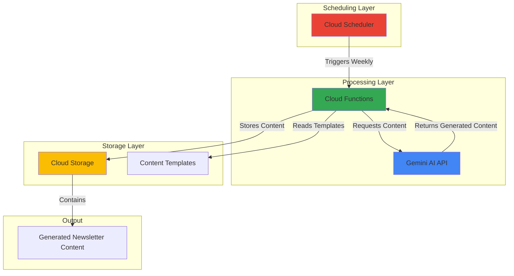

# Newsletter Content Generation with Gemini and Scheduler

## Problem

Marketing teams spend hours each week creating personalized newsletter content, manually crafting subject lines, articles, and calls-to-action for different audience segments. This time-intensive process limits campaign frequency, reduces content personalization, and prevents teams from focusing on strategy and analysis. Traditional content management systems lack AI-powered automation and struggle to maintain consistent brand voice across multiple campaigns.

## Solution

Implement an automated newsletter content generation system using Gemini AI for intelligent content creation, Cloud Functions for serverless processing, and Cloud Scheduler for automated execution. This serverless architecture generates personalized newsletter content on a predefined schedule, stores results in Cloud Storage, and scales automatically based on demand while maintaining cost efficiency through pay-per-use pricing.

## Architecture Diagram



## Prerequisites

1. Google Cloud project with billing enabled and appropriate IAM permissions
2. Google Cloud CLI installed and configured (or Cloud Shell access)
3. Basic understanding of serverless computing and AI APIs
4. Familiarity with Python programming and JSON data structures
5. Estimated cost: $5-15/month for moderate usage (1000 API calls, function executions, storage)

> **Note**: Gemini AI usage costs vary by model and token count. Monitor usage through Cloud Billing for cost optimization.

## Preparation

```bash
# Set environment variables for GCP resources
export PROJECT_ID="newsletter-gen-$(date +%s)"
export REGION="us-central1"
export ZONE="us-central1-a"

# Generate unique suffix for resource names
RANDOM_SUFFIX=$(openssl rand -hex 3)

# Set default project and region
gcloud config set project ${PROJECT_ID}
gcloud config set compute/region ${REGION}
gcloud config set compute/zone ${ZONE}

# Enable required APIs
gcloud services enable cloudfunctions.googleapis.com
gcloud services enable cloudscheduler.googleapis.com
gcloud services enable aiplatform.googleapis.com
gcloud services enable storage.googleapis.com
gcloud services enable cloudbuild.googleapis.com

echo "✅ Project configured: ${PROJECT_ID}"

# Create environment variables for resources
export FUNCTION_NAME="newsletter-generator-${RANDOM_SUFFIX}"
export BUCKET_NAME="newsletter-content-${PROJECT_ID}-${RANDOM_SUFFIX}"
export JOB_NAME="newsletter-schedule-${RANDOM_SUFFIX}"
export TOPIC_NAME="newsletter-trigger-${RANDOM_SUFFIX}"
```

## Steps

1. **Create Cloud Storage Bucket for Content Storage**:

   Cloud Storage provides scalable object storage with global accessibility and integrated security features. This bucket will store both input templates and generated newsletter content, enabling easy access for marketing teams and integration with content management systems.

   ```bash
   # Create bucket with standard storage class
   gsutil mb -p ${PROJECT_ID} \
       -c STANDARD \
       -l ${REGION} \
       gs://${BUCKET_NAME}
   
   # Enable versioning for content history
   gsutil versioning set on gs://${BUCKET_NAME}
   
   echo "✅ Storage bucket created: gs://${BUCKET_NAME}"
   ```

   The storage bucket now provides versioned object storage with regional redundancy, ensuring content durability and accessibility for the newsletter generation system.

2. **Create Content Template Files**:

   Templates provide structured guidance for Gemini AI, ensuring consistent brand voice and content format across all generated newsletters. These JSON templates define content sections, tone guidelines, and variable placeholders for personalization.

   ```bash
   # Create local template directory
   mkdir -p newsletter-function
   cd newsletter-function
   
   # Create content template file
   cat > content-template.json << 'EOF'
   {
     "newsletter_template": {
       "subject_line": "Generate an engaging subject line about {topic}",
       "intro": "Write a brief introduction paragraph about {topic} in a professional yet friendly tone",
       "main_content": "Create 2-3 paragraphs of informative content about {topic}, including practical tips or insights",
       "call_to_action": "Write a compelling call-to-action related to {topic}",
       "tone": "professional, engaging, informative",
       "target_audience": "business professionals and marketing teams",
       "word_limit": 300
     }
   }
   EOF
   
   echo "✅ Content template created"
   ```

   The template structure ensures consistent newsletter format while allowing dynamic content generation based on specified topics and audience preferences.

3. **Deploy Cloud Function for Content Generation**:

   Cloud Functions provides serverless execution for the newsletter generation logic, automatically scaling based on demand while integrating seamlessly with Gemini AI. This function processes template data, calls the Gemini API, and stores generated content.

   ```bash
   # Create function source code
   cat > main.py << 'EOF'
   import json
   import os
   from datetime import datetime
   from google.cloud import storage
   import vertexai
   from vertexai.generative_models import GenerativeModel
   import functions_framework
   
   def initialize_services():
       """Initialize Google Cloud services"""
       project_id = os.environ.get('GOOGLE_CLOUD_PROJECT')
       bucket_name = os.environ.get('BUCKET_NAME')
       
       # Initialize Vertex AI
       vertexai.init(project=project_id, location="us-central1")
       
       # Initialize storage client
       storage_client = storage.Client()
       bucket = storage_client.bucket(bucket_name)
       
       return bucket, project_id
   
   def generate_newsletter_content(topic, template):
       """Generate newsletter content using Gemini"""
       model = GenerativeModel("gemini-1.5-flash")
       
       prompt = f"""
       Create newsletter content based on this template and topic:
       Topic: {topic}
       
       Template Requirements:
       - Subject Line: {template['subject_line'].replace('{topic}', topic)}
       - Introduction: {template['intro'].replace('{topic}', topic)}
       - Main Content: {template['main_content'].replace('{topic}', topic)}
       - Call to Action: {template['call_to_action'].replace('{topic}', topic)}
       
       Additional Guidelines:
       - Tone: {template['tone']}
       - Target Audience: {template['target_audience']}
       - Word Limit: {template['word_limit']} words
       
       Please provide the content in JSON format with keys: subject_line, intro, main_content, call_to_action
       """
       
       response = model.generate_content(prompt)
       return response.text
   
   @functions_framework.http
   def generate_newsletter(request):
       """HTTP Cloud Function to generate newsletter content"""
       try:
           # Initialize services
           bucket, project_id = initialize_services()
           
           # Get request data
           request_json = request.get_json(silent=True)
           topic = request_json.get('topic', 'Digital Marketing Trends') if request_json else 'Digital Marketing Trends'
           
           # Load template (in production, load from Cloud Storage)
           template = {
               "subject_line": "Generate an engaging subject line about {topic}",
               "intro": "Write a brief introduction paragraph about {topic} in a professional yet friendly tone",
               "main_content": "Create 2-3 paragraphs of informative content about {topic}, including practical tips or insights",
               "call_to_action": "Write a compelling call-to-action related to {topic}",
               "tone": "professional, engaging, informative",
               "target_audience": "business professionals and marketing teams",
               "word_limit": 300
           }
           
           # Generate content
           generated_content = generate_newsletter_content(topic, template)
           
           # Create timestamp for filename
           timestamp = datetime.now().strftime("%Y%m%d_%H%M%S")
           filename = f"newsletter_{topic.replace(' ', '_').lower()}_{timestamp}.json"
           
           # Store result in Cloud Storage
           blob = bucket.blob(f"generated-content/{filename}")
           result_data = {
               "topic": topic,
               "generated_at": timestamp,
               "content": generated_content,
               "template_used": template
           }
           blob.upload_from_string(json.dumps(result_data, indent=2))
           
           return {
               "status": "success",
               "message": f"Newsletter content generated for topic: {topic}",
               "filename": filename,
               "storage_path": f"gs://{bucket.name}/generated-content/{filename}"
           }, 200
           
       except Exception as e:
           return {"status": "error", "message": str(e)}, 500
   EOF
   
   # Create requirements.txt with updated package versions
   cat > requirements.txt << 'EOF'
   google-cloud-storage==2.18.0
   google-cloud-aiplatform==1.102.0
   functions-framework==3.8.1
   vertexai==1.92.0
   EOF
   
   echo "✅ Function code created"
   ```

   The Cloud Function now contains comprehensive logic for content generation, error handling, and storage integration, providing a robust serverless solution for newsletter automation.

4. **Deploy the Cloud Function**:

   Deploying the function creates a managed, scalable endpoint that integrates with Google Cloud's security and monitoring systems. The deployment process builds the function, installs dependencies, and configures runtime environment variables.

   ```bash
   # Deploy function with environment variables and latest Python runtime
   gcloud functions deploy ${FUNCTION_NAME} \
       --runtime python312 \
       --trigger-http \
       --source . \
       --entry-point generate_newsletter \
       --memory 512MB \
       --timeout 300s \
       --set-env-vars BUCKET_NAME=${BUCKET_NAME} \
       --allow-unauthenticated
   
   # Get function URL for scheduling
   FUNCTION_URL=$(gcloud functions describe ${FUNCTION_NAME} \
       --format="value(httpsTrigger.url)")
   
   echo "✅ Cloud Function deployed successfully"
   echo "Function URL: ${FUNCTION_URL}"
   ```

   The Cloud Function is now live with HTTP trigger capabilities, environment variable configuration, and appropriate memory allocation for AI processing workloads using the latest Python 3.12 runtime.

5. **Create Cloud Scheduler Job for Automation**:

   Cloud Scheduler provides fully managed cron job functionality with built-in retry logic and failure handling. This scheduled job will trigger newsletter generation automatically, ensuring consistent content creation without manual intervention.

   ```bash
   # Create scheduler job for weekly newsletter generation
   gcloud scheduler jobs create http ${JOB_NAME} \
       --location=${REGION} \
       --schedule="0 9 * * 1" \
       --uri=${FUNCTION_URL} \
       --http-method=POST \
       --headers="Content-Type=application/json" \
       --message-body='{"topic":"Weekly Marketing Insights"}' \
       --description="Weekly newsletter content generation"
   
   echo "✅ Scheduler job created: ${JOB_NAME}"
   echo "Schedule: Every Monday at 9:00 AM"
   ```

   The scheduler is now configured to automatically trigger newsletter generation every Monday morning, providing consistent content delivery for marketing campaigns.

6. **Test the Complete System**:

   Testing validates the entire workflow from trigger to content generation, ensuring proper integration between all components and verifying content quality and storage functionality.

   ```bash
   # Manually trigger the scheduler job for testing
   gcloud scheduler jobs run ${JOB_NAME} --location=${REGION}
   
   echo "✅ Test execution triggered"
   echo "Check Cloud Functions logs for execution details"
   
   # Wait a moment for processing
   sleep 10
   
   # List generated content
   gsutil ls gs://${BUCKET_NAME}/generated-content/
   
   echo "✅ System test completed"
   ```

   The system test confirms end-to-end functionality, from scheduled execution through content generation to storage, validating the complete newsletter automation workflow.

## Validation & Testing

1. **Verify Cloud Function Deployment**:

   ```bash
   # Check function status and configuration
   gcloud functions describe ${FUNCTION_NAME} \
       --format="table(name,status,runtime,timeout)"
   ```

   Expected output: Function shows `ACTIVE` status with Python 3.12 runtime and 300s timeout.

2. **Test Content Generation API**:

   ```bash
   # Test function with custom topic
   curl -X POST ${FUNCTION_URL} \
       -H "Content-Type: application/json" \
       -d '{"topic":"AI in Email Marketing"}'
   ```

   Expected output: JSON response with success status and storage path for generated content.

3. **Verify Scheduled Job Configuration**:

   ```bash
   # Check scheduler job details
   gcloud scheduler jobs describe ${JOB_NAME} \
       --location=${REGION} \
       --format="table(name,schedule,state,lastAttemptTime)"
   ```

   Expected output: Job shows configuration with cron schedule and current state.

4. **Review Generated Content**:

   ```bash
   # Download and view latest generated content
   LATEST_FILE=$(gsutil ls gs://${BUCKET_NAME}/generated-content/ | tail -1)
   gsutil cp ${LATEST_FILE} ./latest-newsletter.json
   cat latest-newsletter.json | jq '.'
   ```

   Expected output: Well-formatted JSON with generated newsletter sections and metadata.

## Cleanup

1. **Delete Cloud Scheduler Job**:

   ```bash
   # Remove scheduled job
   gcloud scheduler jobs delete ${JOB_NAME} \
       --location=${REGION} \
       --quiet
   
   echo "✅ Scheduler job deleted"
   ```

2. **Delete Cloud Function**:

   ```bash
   # Remove function and associated resources
   gcloud functions delete ${FUNCTION_NAME} --quiet
   
   echo "✅ Cloud Function deleted"
   ```

3. **Remove Cloud Storage Bucket**:

   ```bash
   # Delete bucket contents and bucket
   gsutil -m rm -r gs://${BUCKET_NAME}
   
   echo "✅ Storage bucket deleted"
   ```

4. **Clean Local Files**:

   ```bash
   # Remove local function code
   cd ..
   rm -rf newsletter-function
   rm -f latest-newsletter.json
   
   echo "✅ Local files cleaned up"
   ```

## Discussion

This newsletter automation solution leverages Google Cloud's serverless architecture to create a cost-effective, scalable content generation system. The integration of Gemini AI with Cloud Functions provides intelligent content creation while maintaining consistent brand voice through structured templates. Cloud Scheduler ensures reliable execution without infrastructure management overhead, making this solution ideal for marketing teams seeking automation without complexity.

The serverless approach offers significant advantages over traditional content management systems. Cloud Functions automatically scale based on demand, eliminating the need for server provisioning and management. The pay-per-invocation pricing model makes this solution cost-effective for organizations of any size, from startups generating weekly newsletters to enterprises managing multiple content streams. Additionally, the integration with Google Cloud's security and monitoring services provides enterprise-grade reliability and observability.

Gemini AI's multimodal capabilities enable sophisticated content generation that can incorporate various input types and maintain contextual understanding across newsletter sections. The AI model can adapt to different topics, tones, and audience requirements while maintaining consistency with brand guidelines defined in the template structure. This flexibility allows marketing teams to create personalized content at scale without sacrificing quality or brand coherence.

The architecture's modularity supports easy extension and customization. Organizations can enhance the system by adding audience segmentation logic, A/B testing capabilities, or integration with email marketing platforms. The Cloud Storage component provides a centralized repository for content history, enabling analysis of content performance and refinement of generation strategies over time.

> **Tip**: Monitor Gemini API usage and optimize prompts to balance content quality with cost efficiency. Use Cloud Monitoring to track function performance and set up alerts for failures.

**Documentation Sources:**
- [Cloud Functions Documentation](https://cloud.google.com/functions/docs)
- [Cloud Scheduler Overview](https://cloud.google.com/scheduler/docs/overview)
- [Vertex AI Gemini API Reference](https://cloud.google.com/vertex-ai/docs/generative-ai/model-reference/gemini)
- [Cloud Storage Best Practices](https://cloud.google.com/storage/docs/best-practices)
- [Serverless Architecture Patterns](https://cloud.google.com/docs/application-development)

## Challenge

Extend this solution by implementing these enhancements:

1. **Audience Segmentation**: Add subscriber data analysis to generate personalized content for different audience segments using BigQuery and Cloud Functions.

2. **Multi-Channel Distribution**: Integrate with Gmail API and social media platforms to automatically distribute generated content across multiple channels.

3. **Performance Analytics**: Implement Cloud Monitoring dashboards to track content generation metrics, API usage, and cost optimization opportunities.

4. **A/B Testing Framework**: Create multiple content variations for each topic and implement automated testing to optimize engagement rates.

5. **Advanced Personalization**: Enhance the system with customer data integration and machine learning models to create highly personalized newsletter content based on user behavior and preferences.

## Infrastructure Code

### Available Infrastructure as Code:

- [Infrastructure Code Overview](code/README.md) - Detailed description of all infrastructure components
- [Infrastructure Manager](code/infrastructure-manager/) - GCP Infrastructure Manager templates
- [Bash CLI Scripts](code/scripts/) - Example bash scripts using gcloud CLI commands to deploy infrastructure
- [Terraform](code/terraform/) - Terraform configuration files