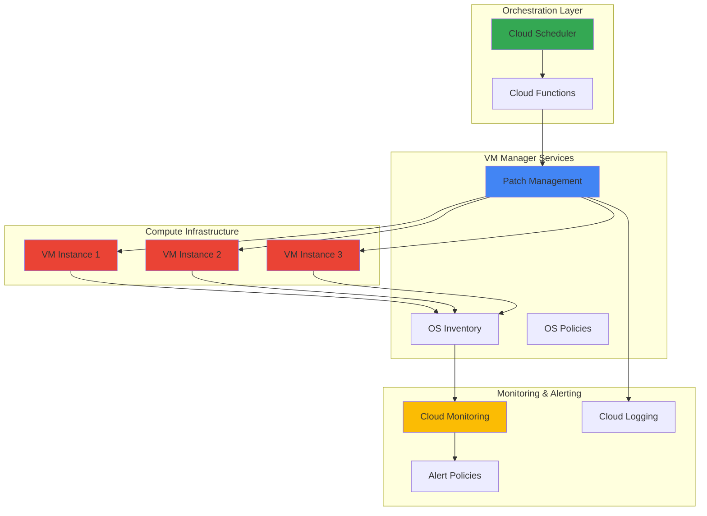

# OS Patch Management with VM Manager and Cloud Scheduler

## Problem

Enterprise organizations managing hundreds or thousands of virtual machines face significant challenges in maintaining consistent security patch deployment across their infrastructure. Manual patch management processes are error-prone, time-consuming, and often result in inconsistent security postures due to delayed updates and human oversight failures. Without automated patch management systems, organizations risk security vulnerabilities, compliance violations, and operational inefficiencies that can cost millions in breach remediation and regulatory penalties.

## Solution

This solution establishes a comprehensive automated OS patch management system using Google Cloud's VM Manager for patch deployment and compliance reporting, Cloud Scheduler for orchestrated timing, and Cloud Monitoring for visibility and alerting. The architecture creates scheduled patch jobs that automatically apply security updates across VM fleets while providing detailed compliance tracking and alerting capabilities to ensure consistent security posture across all infrastructure.

## Architecture Diagram



## Prerequisites

1. Google Cloud project with Compute Engine API enabled
2. Google Cloud CLI (gcloud) installed and authenticated
3. IAM permissions for Compute Engine, VM Manager, Cloud Scheduler, and Cloud Monitoring
4. Basic knowledge of Linux/Windows system administration and Google Cloud services
5. Estimated cost: $10-50/month for test environment (varies by VM instance types and monitoring usage)

> **Note**: VM Manager is included with Google Cloud at no additional cost. You only pay for the underlying Compute Engine resources and any Cloud Monitoring usage beyond the free tier.

## Preparation

```bash
# Set environment variables for GCP resources
export PROJECT_ID="patch-mgmt-$(date +%s)"
export REGION="us-central1"
export ZONE="us-central1-a"

# Generate unique suffix for resource names
RANDOM_SUFFIX=$(openssl rand -hex 3)
export INSTANCE_GROUP_NAME="patch-test-group-${RANDOM_SUFFIX}"
export SCHEDULER_JOB_NAME="patch-deployment-${RANDOM_SUFFIX}"
export FUNCTION_NAME="patch-trigger-${RANDOM_SUFFIX}"

# Set default project and region
gcloud config set project ${PROJECT_ID}
gcloud config set compute/region ${REGION}
gcloud config set compute/zone ${ZONE}

# Enable required APIs
gcloud services enable compute.googleapis.com
gcloud services enable osconfig.googleapis.com
gcloud services enable cloudscheduler.googleapis.com
gcloud services enable cloudfunctions.googleapis.com
gcloud services enable monitoring.googleapis.com
gcloud services enable logging.googleapis.com

echo "✅ Project configured: ${PROJECT_ID}"
echo "✅ APIs enabled for VM Manager, Cloud Scheduler, and monitoring"
```

## Steps

1. **Create Test VM Instances with VM Manager Enabled**:

   Google Cloud's VM Manager requires the OS Config agent to be enabled on target instances. This agent handles patch deployment, inventory collection, and policy enforcement across your VM fleet. Creating instances with proper metadata configuration ensures seamless integration with VM Manager services from the start.

   ```bash
   # Create VM instances with VM Manager enabled
   for i in {1..3}; do
     gcloud compute instances create patch-test-vm-${i} \
       --zone=${ZONE} \
       --machine-type=e2-medium \
       --image-family=ubuntu-2004-lts \
       --image-project=ubuntu-os-cloud \
       --boot-disk-size=20GB \
       --boot-disk-type=pd-standard \
       --metadata=enable-osconfig=TRUE \
       --tags=patch-management \
       --scopes=https://www.googleapis.com/auth/cloud-platform
   done
   
   echo "✅ Created 3 VM instances with VM Manager enabled"
   ```

   The VM instances are now configured with the OS Config agent enabled, allowing VM Manager to collect inventory data and apply patches automatically. The cloud-platform scope ensures the instances have the necessary permissions to communicate with VM Manager services.

2. **Verify VM Manager Setup and OS Inventory Collection**:

   VM Manager's OS inventory service automatically collects detailed information about installed packages, available updates, and system configuration. This data forms the foundation for patch compliance reporting and helps identify which systems require updates.

   ```bash
   # Wait for VM Manager to collect initial inventory
   echo "Waiting for VM Manager to collect OS inventory..."
   sleep 60
   
   # Check OS inventory for one of the instances
   gcloud compute os-config inventories describe \
     --instance=patch-test-vm-1 \
     --instance-zone=${ZONE} \
     --format="table(updateTime,osInfo.shortName,osInfo.version)"
   
   echo "✅ VM Manager OS inventory collection verified"
   ```

   The inventory data provides comprehensive visibility into your VM fleet's current state, including operating system versions, installed packages, and available updates. This information is crucial for patch compliance monitoring and planning.

3. **Create Cloud Storage Bucket for Patch Scripts**:

   Pre and post-patch scripts stored in Cloud Storage enable automated backup creation and validation checks during the patch deployment process. This ensures data protection and verification of system functionality after patches are applied.

   ```bash
   # Create Cloud Storage bucket for patch scripts
   gsutil mb -p ${PROJECT_ID} \
     -c STANDARD \
     -l ${REGION} \
     gs://patch-scripts-${PROJECT_ID}
   
   # Create pre-patch backup script
   cat > pre-patch-backup.sh << 'EOF'
   #!/bin/bash
   echo "Starting pre-patch backup at $(date)"
   
   # Create system backup
   sudo tar -czf /tmp/system-backup-$(date +%Y%m%d-%H%M%S).tar.gz \
     /etc /var/log /home --exclude=/home/*/.cache
   
   echo "Pre-patch backup completed successfully"
   EOF
   
   # Create post-patch validation script
   cat > post-patch-validation.sh << 'EOF'
   #!/bin/bash
   echo "Starting post-patch validation at $(date)"
   
   # Check system services
   systemctl status ssh
   systemctl status networking
   
   # Verify disk space
   df -h
   
   # Check for any failed services
   systemctl --failed
   
   echo "Post-patch validation completed at $(date)"
   EOF
   
   # Upload scripts to Cloud Storage
   gsutil cp pre-patch-backup.sh gs://patch-scripts-${PROJECT_ID}/
   gsutil cp post-patch-validation.sh gs://patch-scripts-${PROJECT_ID}/
   
   echo "✅ Patch scripts uploaded to Cloud Storage"
   ```

   The backup and validation scripts provide automated safeguards during the patch deployment process, ensuring data protection and system integrity verification after updates are applied.

4. **Deploy Cloud Function for Patch Orchestration**:

   Cloud Functions provide serverless orchestration for patch deployments, enabling complex logic for targeting specific VM groups, handling failures, and integrating with monitoring systems. This approach offers greater flexibility than direct API calls from Cloud Scheduler.

   ```bash
   # Create Cloud Function source code
   mkdir -p patch-function && cd patch-function
   
   cat > main.py << 'EOF'
   import json
   import os
   from google.cloud import osconfig_v1
   import functions_framework
   
   @functions_framework.http
   def trigger_patch_deployment(request):
       """Cloud Function to trigger VM patch deployment"""
       
       project_id = os.environ.get('GCP_PROJECT')
       zone = os.environ.get('ZONE', 'us-central1-a')
       
       # Initialize OS Config client
       client = osconfig_v1.OsConfigServiceClient()
       
       # Create patch job request
       patch_job = {
           "description": "Automated patch deployment via Cloud Scheduler",
           "instance_filter": {
               "instance_name_prefixes": ["patch-test-vm-"]
           },
           "patch_config": {
               "reboot_config": osconfig_v1.PatchConfig.RebootConfig.REBOOT_IF_REQUIRED,
               "apt": {
                   "type": osconfig_v1.AptSettings.Type.UPGRADE,
                   "excludes": ["test-package"]
               }
           },
           "duration": {"seconds": 7200},
           "dry_run": False
       }
       
       # Execute patch job
       parent = f"projects/{project_id}"
       response = client.execute_patch_job(
           request={"parent": parent, "patch_job": patch_job}
       )
       
       return {
           "status": "success",
           "patch_job_name": response.name,
           "message": f"Patch job {response.name} started successfully"
       }
   EOF
   
   cat > requirements.txt << 'EOF'
   google-cloud-os-config==1.20.1
   functions-framework==3.8.1
   EOF
   
   # Deploy Cloud Function
   gcloud functions deploy ${FUNCTION_NAME} \
     --gen2 \
     --runtime python312 \
     --trigger-http \
     --entry-point trigger_patch_deployment \
     --memory 256MB \
     --timeout 300s \
     --set-env-vars ZONE=${ZONE} \
     --allow-unauthenticated
   
   cd ..
   
   echo "✅ Cloud Function deployed for patch orchestration"
   ```

   The Cloud Function provides programmatic control over patch deployments, enabling custom logic for instance targeting, error handling, and integration with monitoring systems while maintaining serverless scalability.

5. **Create Cloud Scheduler Job for Automated Patch Deployment**:

   Cloud Scheduler provides reliable cron-like scheduling for patch deployments, ensuring consistent timing and retry capabilities. The scheduler integrates with Cloud Functions to trigger complex patch workflows while maintaining audit trails and error handling.

   ```bash
   # Get Cloud Function URL
   FUNCTION_URL=$(gcloud functions describe ${FUNCTION_NAME} \
     --region=${REGION} \
     --format="value(serviceConfig.uri)")
   
   # Create Cloud Scheduler job
   gcloud scheduler jobs create http ${SCHEDULER_JOB_NAME} \
     --schedule="0 2 * * SUN" \
     --time-zone="America/New_York" \
     --uri="${FUNCTION_URL}" \
     --http-method=POST \
     --headers="Content-Type=application/json" \
     --message-body='{"trigger":"scheduled-patch-deployment"}' \
     --description="Weekly automated patch deployment for VM fleet"
   
   echo "✅ Cloud Scheduler job created for weekly patch deployment"
   ```

   The scheduler job runs every Sunday at 2 AM Eastern Time, providing consistent patch deployment timing while allowing for maintenance windows that minimize business impact.

6. **Configure Cloud Monitoring for Patch Compliance**:

   Cloud Monitoring provides comprehensive visibility into patch deployment status, system health, and compliance metrics. Setting up monitoring dashboards and alerts ensures proactive management of patch deployment outcomes and system reliability.

   ```bash
   # Create monitoring dashboard for patch management
   cat > dashboard-config.json << EOF
   {
     "displayName": "VM Patch Management Dashboard",
     "mosaicLayout": {
       "tiles": [
         {
           "width": 6,
           "height": 4,
           "widget": {
             "title": "VM Instance Uptime",
             "xyChart": {
               "dataSets": [
                 {
                   "timeSeriesQuery": {
                     "timeSeriesFilter": {
                       "filter": "resource.type=\"gce_instance\" AND metric.type=\"compute.googleapis.com/instance/up\"",
                       "aggregation": {
                         "alignmentPeriod": "300s",
                         "perSeriesAligner": "ALIGN_MEAN"
                       }
                     }
                   }
                 }
               ]
             }
           }
         },
         {
           "width": 6,
           "height": 4,
           "yPos": 4,
           "widget": {
             "title": "OS Config Agent Status",
             "xyChart": {
               "dataSets": [
                 {
                   "timeSeriesQuery": {
                     "timeSeriesFilter": {
                       "filter": "resource.type=\"gce_instance\" AND metric.type=\"compute.googleapis.com/guest/system/processes\"",
                       "aggregation": {
                         "alignmentPeriod": "300s",
                         "perSeriesAligner": "ALIGN_MEAN"
                       }
                     }
                   }
                 }
               ]
             }
           }
         }
       ]
     }
   }
   EOF
   
   # Create the dashboard
   gcloud monitoring dashboards create \
     --config-from-file=dashboard-config.json
   
   echo "✅ Cloud Monitoring dashboard created for patch management"
   ```

   The monitoring dashboard provides real-time visibility into patch deployment status, system health metrics, and compliance trends, enabling proactive management of your VM fleet's security posture.

7. **Set Up Alert Policies for Patch Management**:

   Alert policies ensure immediate notification of patch deployment failures, compliance violations, or system issues. This proactive monitoring approach enables rapid response to security vulnerabilities and operational problems.

   ```bash
   # Create alert policy for VM instance downtime
   cat > alert-policy.yaml << EOF
   displayName: "VM Instance Down Alert"
   documentation:
     content: "Alert triggered when VM instances go down during patch operations"
   conditions:
     - displayName: "VM Instance Down"
       conditionThreshold:
         filter: 'resource.type="gce_instance" AND metric.type="compute.googleapis.com/instance/up"'
         comparison: COMPARISON_LESS_THAN
         thresholdValue: 1
         duration: 300s
         aggregations:
           - alignmentPeriod: 300s
             perSeriesAligner: ALIGN_MEAN
   notificationChannels: []
   alertStrategy:
     autoClose: 86400s
   EOF
   
   # Create alert policy
   gcloud alpha monitoring policies create \
     --policy-from-file=alert-policy.yaml
   
   echo "✅ Alert policy created for patch deployment monitoring"
   ```

   The alert policy provides immediate notification of patch deployment issues, enabling rapid response to maintain security compliance and system reliability across your VM fleet.

## Validation & Testing

1. **Verify VM Manager Configuration**:

   ```bash
   # Check VM Manager status on instances
   gcloud compute instances describe patch-test-vm-1 \
     --zone=${ZONE} \
     --format="value(metadata.items[key=enable-osconfig].value)"
   
   # Verify OS Config agent is running
   gcloud compute ssh patch-test-vm-1 \
     --zone=${ZONE} \
     --command="sudo systemctl status google-osconfig-agent"
   ```

   Expected output: `TRUE` for metadata and `active (running)` for the agent status.

2. **Test Patch Deployment Execution**:

   ```bash
   # Trigger manual patch deployment for testing
   gcloud compute os-config patch-jobs execute \
     --instance-filter-name-prefixes="patch-test-vm-" \
     --description="Manual test patch deployment" \
     --dry-run
   
   # Check patch job status
   gcloud compute os-config patch-jobs list \
     --format="table(name,state,createTime)"
   ```

   Expected output: Patch job creation success with `RUNNING` or `SUCCEEDED` state.

3. **Verify Cloud Scheduler Job Configuration**:

   ```bash
   # Check scheduler job status
   gcloud scheduler jobs describe ${SCHEDULER_JOB_NAME} \
     --format="table(name,schedule,state,lastAttemptTime)"
   
   # Manually trigger scheduler job for testing
   gcloud scheduler jobs run ${SCHEDULER_JOB_NAME}
   ```

   Expected output: Job details showing correct schedule and `ENABLED` state.

4. **Test Monitoring and Alerting**:

   ```bash
   # Check monitoring dashboard
   gcloud monitoring dashboards list \
     --format="table(displayName,name)"
   
   # Verify alert policies
   gcloud alpha monitoring policies list \
     --format="table(displayName,enabled,conditions[0].displayName)"
   ```

   Expected output: Dashboard and alert policy listed with correct configurations.

## Cleanup

1. **Delete Cloud Scheduler Job**:

   ```bash
   # Delete scheduler job
   gcloud scheduler jobs delete ${SCHEDULER_JOB_NAME} --quiet
   
   echo "✅ Deleted Cloud Scheduler job"
   ```

2. **Remove Cloud Function**:

   ```bash
   # Delete Cloud Function
   gcloud functions delete ${FUNCTION_NAME} --region=${REGION} --quiet
   
   echo "✅ Deleted Cloud Function"
   ```

3. **Clean Up VM Instances**:

   ```bash
   # Delete VM instances
   for i in {1..3}; do
     gcloud compute instances delete patch-test-vm-${i} \
       --zone=${ZONE} \
       --quiet
   done
   
   echo "✅ Deleted VM instances"
   ```

4. **Remove Cloud Storage Bucket**:

   ```bash
   # Delete Cloud Storage bucket and contents
   gsutil -m rm -r gs://patch-scripts-${PROJECT_ID}
   
   echo "✅ Deleted Cloud Storage bucket"
   ```

5. **Delete Monitoring Resources**:

   ```bash
   # Delete monitoring dashboard
   DASHBOARD_ID=$(gcloud monitoring dashboards list \
     --filter="displayName:'VM Patch Management Dashboard'" \
     --format="value(name)")
   
   if [ ! -z "$DASHBOARD_ID" ]; then
     gcloud monitoring dashboards delete $DASHBOARD_ID --quiet
   fi
   
   # Delete alert policies
   POLICY_ID=$(gcloud alpha monitoring policies list \
     --filter="displayName:'VM Instance Down Alert'" \
     --format="value(name)")
   
   if [ ! -z "$POLICY_ID" ]; then
     gcloud alpha monitoring policies delete $POLICY_ID --quiet
   fi
   
   echo "✅ Deleted monitoring resources"
   ```

6. **Clean Up Local Files**:

   ```bash
   # Remove local configuration files
   rm -f dashboard-config.json
   rm -f alert-policy.yaml
   rm -f pre-patch-backup.sh
   rm -f post-patch-validation.sh
   rm -rf patch-function
   
   echo "✅ Cleaned up local files"
   ```

## Discussion

Google Cloud's VM Manager provides a comprehensive solution for automated patch management that addresses the critical security and operational challenges faced by modern infrastructure teams. The service leverages the OS Config agent to execute patches using native OS tools like `apt`, `yum`, and Windows Update Agent, ensuring compatibility with existing system configurations while providing centralized control and monitoring capabilities.

The integration with Cloud Scheduler enables sophisticated patch orchestration that can accommodate complex deployment windows, rolling updates, and business-specific maintenance schedules. This approach significantly reduces the operational burden of manual patch management while improving security posture through consistent, automated updates. The serverless Cloud Functions integration provides flexibility for custom patch logic, error handling, and integration with existing enterprise systems.

Cloud Monitoring integration offers comprehensive visibility into patch deployment status, compliance metrics, and system health indicators. This monitoring capability is essential for maintaining audit trails, identifying security gaps, and ensuring regulatory compliance across large VM fleets. The combination of proactive alerting and detailed reporting enables organizations to maintain high security standards while minimizing operational overhead.

The architecture supports both scheduled and on-demand patch deployments, providing the flexibility to respond to critical security vulnerabilities while maintaining predictable maintenance windows for routine updates. Pre and post-patch scripts enable automated backup creation and validation, ensuring data protection and system integrity throughout the patch deployment process.

> **Tip**: Configure patch deployments during off-peak hours and use instance groups to enable rolling updates that maintain application availability during maintenance windows.

For comprehensive implementation guidance, refer to the [VM Manager documentation](https://cloud.google.com/compute/vm-manager/docs), [Cloud Scheduler best practices](https://cloud.google.com/scheduler/docs/best-practices), [Cloud Monitoring configuration guide](https://cloud.google.com/monitoring/docs/monitoring-overview), [Google Cloud security best practices](https://cloud.google.com/security/best-practices), and [OS Config API reference](https://cloud.google.com/compute/docs/osconfig/rest).

## Challenge

Extend this solution by implementing these enhancements:

1. **Multi-Region Patch Deployment**: Implement cross-region patch coordination with staged rollouts and region-specific maintenance windows using Cloud Scheduler and Cloud Functions.

2. **Advanced Compliance Reporting**: Create automated compliance reports using BigQuery and Looker Studio to track patch deployment history, vulnerability remediation timelines, and regulatory compliance metrics.

3. **Integration with ITSM Systems**: Develop webhook integrations with ServiceNow or Jira to automatically create change requests, track patch deployment status, and update incident management workflows.

4. **Canary Patch Deployments**: Implement graduated patch rollouts that test updates on a subset of instances before full deployment, with automated rollback capabilities based on health metrics.

5. **Custom Patch Validation**: Create comprehensive post-patch validation scripts that verify application functionality, performance benchmarks, and security configurations after patch deployment.

## Infrastructure Code

*Infrastructure code will be generated after recipe approval.*