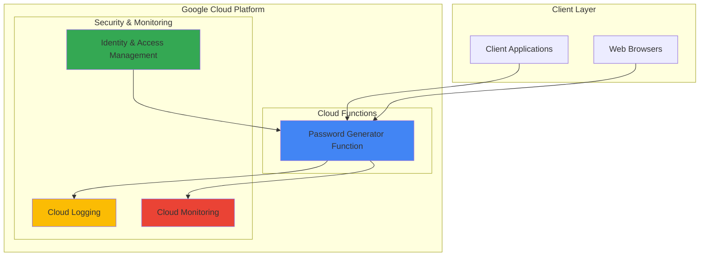

# Simple Password Generator with Cloud Functions

## Problem

Modern applications require secure password generation capabilities for user account creation, temporary access tokens, and API keys. Managing dedicated servers for simple utility functions like password generation creates unnecessary infrastructure overhead, increases operational costs, and requires ongoing maintenance. Development teams need a lightweight, scalable solution that can generate cryptographically secure passwords on-demand without infrastructure management.

## Solution

Deploy a serverless password generator API using Google Cloud Functions that creates secure passwords with customizable length and complexity options. Cloud Functions provides automatic scaling, built-in security features, and pay-per-invocation pricing, making it ideal for utility functions that need to handle variable request loads while maintaining high security standards.

## Architecture Diagram



## Prerequisites

1. Google Cloud Project with billing enabled and Cloud Functions API access
2. Google Cloud CLI installed and configured (or Cloud Shell access)
3. Basic Python programming knowledge and HTTP API concepts
4. Understanding of serverless computing and password security principles
5. Estimated cost: $0.00-$0.40 per million invocations (free tier includes 2 million invocations per month)

> **Note**: This recipe uses Google Cloud's free tier resources. Monitor usage through Cloud Billing to track any charges beyond free tier limits.

## Preparation

```bash
# Set environment variables for GCP resources
export PROJECT_ID="password-gen-$(date +%s)"
export REGION="us-central1"
export FUNCTION_NAME="password-generator"

# Generate unique suffix for resource names
RANDOM_SUFFIX=$(openssl rand -hex 3)

# Create new project for this recipe
gcloud projects create ${PROJECT_ID} \
    --name="Password Generator Demo"

# Set default project and region
gcloud config set project ${PROJECT_ID}
gcloud config set compute/region ${REGION}
gcloud config set functions/region ${REGION}

# Enable required APIs
gcloud services enable cloudfunctions.googleapis.com
gcloud services enable cloudbuild.googleapis.com
gcloud services enable run.googleapis.com

echo "✅ Project configured: ${PROJECT_ID}"
echo "✅ Region set to: ${REGION}"
```

## Steps

1. **Create the Function Directory and Source Code**:

   Google Cloud Functions follows a specific directory structure for Python applications. The main.py file serves as the entry point and contains the core password generation logic. Python's `secrets` module provides cryptographically secure random number generation, which is essential for password security unlike the standard `random` module that should never be used for security-sensitive applications.

   ```bash
   # Create function directory
   mkdir -p cloud-function-source
   cd cloud-function-source
   
   # Create main.py with password generation logic
   cat > main.py << 'EOF'
import json
import secrets
import string
from flask import Request
import functions_framework

@functions_framework.http
def generate_password(request: Request):
    """HTTP Cloud Function that generates secure passwords.
    
    Args:
        request (flask.Request): The request object with optional parameters:
            - length: Password length (default: 12, min: 4, max: 128)
            - include_symbols: Include special characters (default: true)
            - include_numbers: Include numbers (default: true)
            - include_uppercase: Include uppercase letters (default: true)
            - include_lowercase: Include lowercase letters (default: true)
    
    Returns:
        JSON response with generated password and metadata
    """
    
    # Set CORS headers for web browser compatibility
    headers = {
        'Access-Control-Allow-Origin': '*',
        'Access-Control-Allow-Methods': 'GET, POST, OPTIONS',
        'Access-Control-Allow-Headers': 'Content-Type'
    }
    
    # Handle preflight OPTIONS request
    if request.method == 'OPTIONS':
        return ('', 204, headers)
    
    try:
        # Parse request parameters
        request_json = request.get_json(silent=True)
        request_args = request.args
        
        # Get parameters from JSON body or query parameters
        if request_json:
            length = request_json.get('length', 12)
            include_symbols = request_json.get('include_symbols', True)
            include_numbers = request_json.get('include_numbers', True)
            include_uppercase = request_json.get('include_uppercase', True)
            include_lowercase = request_json.get('include_lowercase', True)
        else:
            length = int(request_args.get('length', 12))
            include_symbols = request_args.get('include_symbols', 'true').lower() == 'true'
            include_numbers = request_args.get('include_numbers', 'true').lower() == 'true'
            include_uppercase = request_args.get('include_uppercase', 'true').lower() == 'true'
            include_lowercase = request_args.get('include_lowercase', 'true').lower() == 'true'
        
        # Validate length parameter
        if length < 4 or length > 128:
            return (json.dumps({
                'error': 'Password length must be between 4 and 128 characters',
                'provided_length': length
            }), 400, headers)
        
        # Build character set based on requirements
        charset = ''
        if include_lowercase:
            charset += string.ascii_lowercase
        if include_uppercase:
            charset += string.ascii_uppercase
        if include_numbers:
            charset += string.digits
        if include_symbols:
            charset += '!@#$%^&*()_+-=[]{}|;:,.<>?'
        
        # Ensure at least one character type is selected
        if not charset:
            return (json.dumps({
                'error': 'At least one character type must be enabled'
            }), 400, headers)
        
        # Generate cryptographically secure password
        password = ''.join(secrets.choice(charset) for _ in range(length))
        
        # Calculate entropy bits using correct formula: log2(N^L) = L * log2(N)
        import math
        entropy_bits = length * math.log2(len(charset))
        
        # Prepare response with password and metadata
        response_data = {
            'password': password,
            'length': length,
            'character_types': {
                'lowercase': include_lowercase,
                'uppercase': include_uppercase,
                'numbers': include_numbers,
                'symbols': include_symbols
            },
            'entropy_bits': round(entropy_bits, 2),
            'charset_size': len(charset)
        }
        
        return (json.dumps(response_data), 200, headers)
        
    except ValueError as e:
        return (json.dumps({
            'error': f'Invalid parameter value: {str(e)}'
        }), 400, headers)
    except Exception as e:
        return (json.dumps({
            'error': f'Internal server error: {str(e)}'
        }), 500, headers)
EOF
   
   echo "✅ Created main.py with password generation logic"
   ```

2. **Create Requirements File**:

   The requirements.txt file specifies the Python dependencies needed for the Cloud Function. The Functions Framework handles HTTP request routing and integrates with Flask for request processing. Version pinning to major versions (using wildcards like `3.*`) ensures compatibility while allowing minor updates and security patches.

   ```bash
   # Create requirements.txt with necessary dependencies
   cat > requirements.txt << 'EOF'
functions-framework==3.*
flask==2.*
EOF
   
   echo "✅ Created requirements.txt with dependencies"
   ```

3. **Deploy the Cloud Function**:

   Cloud Functions Gen 2 provides improved performance, more configuration options, and better integration with Cloud Run. The deployment process builds a container image using Cloud Build, stores it in Artifact Registry, and creates a Cloud Run service that automatically scales based on incoming requests. The `--allow-unauthenticated` flag enables public access for testing purposes.

   ```bash
   # Deploy Cloud Function with HTTP trigger
   gcloud functions deploy ${FUNCTION_NAME} \
       --gen2 \
       --runtime=python311 \
       --region=${REGION} \
       --source=. \
       --entry-point=generate_password \
       --trigger-http \
       --allow-unauthenticated \
       --memory=256Mi \
       --timeout=60s \
       --max-instances=10
   
   echo "✅ Cloud Function deployed successfully"
   ```

4. **Get Function URL and Test Basic Functionality**:

   The Cloud Function's HTTP trigger creates a unique HTTPS endpoint that can be called from any HTTP client. The `gcloud functions describe` command retrieves comprehensive metadata about the function, including its trigger URL, runtime configuration, and deployment status.

   ```bash
   # Get the function URL
   FUNCTION_URL=$(gcloud functions describe ${FUNCTION_NAME} \
       --gen2 \
       --region=${REGION} \
       --format="value(serviceConfig.uri)")
   
   echo "Function URL: ${FUNCTION_URL}"
   
   # Test basic password generation
   curl -X GET "${FUNCTION_URL}?length=16" | jq '.'
   
   echo "✅ Function URL retrieved and basic test completed"
   ```

5. **Test Different Password Configurations**:

   Testing various parameter combinations ensures the function handles different use cases correctly. The function supports both GET requests with query parameters and POST requests with JSON payloads, providing flexibility for different client applications and integration patterns.

   ```bash
   # Test with different parameters using GET requests
   echo "Testing numeric-only password:"
   curl -X GET "${FUNCTION_URL}?length=8&include_symbols=false&include_uppercase=false&include_lowercase=false" | jq '.'
   
   echo -e "\nTesting complex password with all character types:"
   curl -X GET "${FUNCTION_URL}?length=20&include_symbols=true" | jq '.'
   
   # Test with POST request and JSON body
   echo -e "\nTesting with POST request:"
   curl -X POST "${FUNCTION_URL}" \
       -H "Content-Type: application/json" \
       -d '{"length": 14, "include_symbols": false}' | jq '.'
   
   echo "✅ Multiple password configurations tested successfully"
   ```

## Validation & Testing

1. **Verify Function Deployment Status**:

   ```bash
   # Check function deployment status
   gcloud functions describe ${FUNCTION_NAME} \
       --gen2 \
       --region=${REGION} \
       --format="table(name,state,updateTime)"
   ```

   Expected output: Function should show "ACTIVE" state with recent update time.

2. **Test Password Security and Randomness**:

   ```bash
   # Generate multiple passwords to verify randomness
   echo "Generating 5 passwords to verify randomness:"
   for i in {1..5}; do
       curl -s -X GET "${FUNCTION_URL}?length=12" | jq -r '.password'
   done
   
   # Test entropy calculation
   echo -e "\nTesting password entropy information:"
   curl -s -X GET "${FUNCTION_URL}?length=16" | jq '.entropy_bits, .charset_size'
   ```

3. **Test Error Handling**:

   ```bash
   # Test invalid length parameter
   echo "Testing error handling with invalid length:"
   curl -s -X GET "${FUNCTION_URL}?length=200" | jq '.'
   
   # Test with no character types enabled
   echo -e "\nTesting with all character types disabled:"
   curl -s -X GET "${FUNCTION_URL}?include_symbols=false&include_numbers=false&include_uppercase=false&include_lowercase=false" | jq '.'
   ```

## Cleanup

1. **Remove the Cloud Function**:

   ```bash
   # Delete the Cloud Function
   gcloud functions delete ${FUNCTION_NAME} \
       --gen2 \
       --region=${REGION} \
       --quiet
   
   echo "✅ Cloud Function deleted"
   ```

2. **Clean Up Project Resources**:

   ```bash
   # Delete the entire project (if created specifically for this recipe)
   gcloud projects delete ${PROJECT_ID} --quiet
   
   # Remove local source files
   cd ..
   rm -rf cloud-function-source
   
   echo "✅ Project and local files cleaned up"
   echo "Note: Project deletion may take several minutes to complete"
   ```

## Discussion

Google Cloud Functions provides an ideal platform for implementing utility services like password generators due to its serverless architecture and automatic scaling capabilities. The function uses Python's `secrets` module instead of the standard `random` module to ensure cryptographically secure password generation suitable for production applications. The secrets module leverages the operating system's cryptographically secure random number generator, making it appropriate for security-sensitive applications like password generation, as recommended by the [Python documentation](https://docs.python.org/3/library/secrets.html).

The implementation includes comprehensive error handling and parameter validation to ensure robust operation under various input conditions. The function supports both GET and POST requests with JSON payloads, providing flexibility for different client integration patterns. CORS headers are included to enable web browser access, making the function suitable for both server-to-server and client-side integrations. The entropy calculation feature helps developers understand the security strength of generated passwords using the correct formula: L × log₂(N), where L is password length and N is character set size, which is crucial for compliance and security auditing.

Cloud Functions' pay-per-invocation pricing model makes this solution highly cost-effective for password generation workloads. With Google Cloud's free tier providing 2 million function invocations per month, most applications can operate within the free tier limits. The automatic scaling capability ensures the function can handle sudden spikes in password generation requests without manual intervention or capacity planning. For production deployments, consider implementing authentication using [Cloud IAM](https://cloud.google.com/functions/docs/securing/authenticating) or [API Gateway](https://cloud.google.com/api-gateway/docs/about-api-gateway) for access control and rate limiting.

> **Tip**: Monitor function performance using Cloud Monitoring and set up alerting for unusual request patterns or error rates to maintain optimal security and availability.

## Challenge

Extend this solution by implementing these enhancements:

1. **Add password strength validation and scoring** - Implement algorithms to evaluate password strength based on entropy, common patterns, and dictionary checks using libraries like `zxcvbn-python`.

2. **Integrate with Cloud KMS for encryption** - Encrypt generated passwords using Cloud Key Management Service before storage or transmission, adding an extra layer of security for sensitive environments.

3. **Implement rate limiting and authentication** - Add Cloud Endpoints or API Gateway integration to provide API key authentication, request throttling, and usage analytics for production deployments.

4. **Create password policy templates** - Develop predefined password generation profiles for different use cases (e.g., financial services, healthcare, general web applications) with appropriate complexity requirements.

5. **Add Cloud Firestore integration for audit logging** - Store password generation events (without the actual passwords) in Firestore for compliance auditing and usage analytics while maintaining security best practices.

## Infrastructure Code

*Infrastructure code will be generated after recipe approval.*