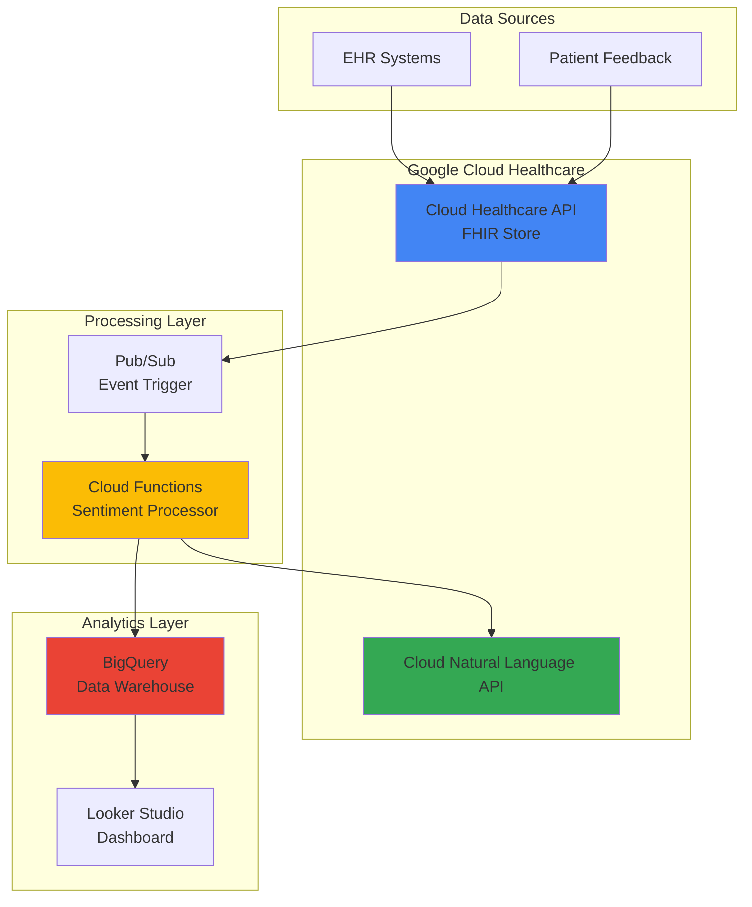

# Patient Sentiment Analysis with Cloud Healthcare API and Natural Language AI

## Problem

Healthcare organizations struggle to extract meaningful insights from unstructured patient feedback and clinical notes stored in Electronic Health Records (EHRs). Traditional manual review processes are time-consuming, subjective, and fail to scale across thousands of patient records, leading to missed opportunities to improve patient satisfaction and clinical outcomes.

## Solution

Build an intelligent healthcare analytics pipeline that processes FHIR patient records from Cloud Healthcare API, leverages Natural Language AI to extract sentiment insights from clinical notes and patient feedback, and stores results in BigQuery for comprehensive analytics dashboards that enable data-driven improvements in patient care quality.

## Architecture Diagram



## Prerequisites

1. Google Cloud account with billing enabled and Healthcare API access
2. Google Cloud CLI v455+ installed and configured (or Cloud Shell)
3. Basic understanding of FHIR healthcare data standards and JSON
4. Familiarity with Cloud Functions and BigQuery fundamentals
5. Estimated cost: $15-25 for running this recipe (includes FHIR store, Natural Language API calls, and BigQuery storage)

> **Note**: Healthcare data requires special compliance considerations. Ensure your Google Cloud project has appropriate security controls and meets healthcare regulatory requirements like HIPAA before processing real patient data.

## Preparation

```bash
# Set environment variables for GCP resources
export PROJECT_ID="healthcare-sentiment-$(date +%s)"
export REGION="us-central1"
export ZONE="us-central1-a"

# Generate unique suffix for resource names
RANDOM_SUFFIX=$(openssl rand -hex 3)
export HEALTHCARE_DATASET="patient-records-${RANDOM_SUFFIX}"
export FHIR_STORE="patient-fhir-${RANDOM_SUFFIX}"
export FUNCTION_NAME="sentiment-processor-${RANDOM_SUFFIX}"
export PUBSUB_TOPIC="fhir-notifications-${RANDOM_SUFFIX}"
export BQ_DATASET="patient_sentiment_${RANDOM_SUFFIX}"

# Create project and set default configuration
gcloud projects create ${PROJECT_ID}
gcloud config set project ${PROJECT_ID}
gcloud config set compute/region ${REGION}
gcloud config set compute/zone ${ZONE}

# Enable required APIs
gcloud services enable healthcare.googleapis.com \
    language.googleapis.com \
    cloudfunctions.googleapis.com \
    bigquery.googleapis.com \
    pubsub.googleapis.com \
    cloudbuild.googleapis.com

echo "✅ Project configured: ${PROJECT_ID}"
echo "✅ APIs enabled for healthcare sentiment analysis"
```

## Steps

1. **Create Healthcare Dataset and FHIR Store**:

   Google Cloud Healthcare API provides a secure, HIPAA-compliant environment for storing and processing healthcare data in industry-standard formats. The FHIR (Fast Healthcare Interoperability Resources) standard enables structured representation of patient records, clinical observations, and care plans, making it ideal for sentiment analysis of patient interactions and treatment outcomes.

   ```bash
   # Create healthcare dataset
   gcloud healthcare datasets create ${HEALTHCARE_DATASET} \
       --location=${REGION}
   
   # Create FHIR store with Pub/Sub notifications
   gcloud healthcare fhir-stores create ${FHIR_STORE} \
       --dataset=${HEALTHCARE_DATASET} \
       --location=${REGION} \
       --version=R4 \
       --pubsub-topic=projects/${PROJECT_ID}/topics/${PUBSUB_TOPIC}
   
   echo "✅ Healthcare dataset and FHIR store created"
   ```

   The FHIR R4 store is now configured with Pub/Sub notifications, enabling real-time processing of patient data updates. This foundation supports scalable healthcare analytics while maintaining compliance with medical data standards and privacy requirements.

2. **Create Pub/Sub Topic for Event-Driven Processing**:

   Pub/Sub provides reliable, asynchronous messaging that triggers sentiment analysis whenever new patient records are added or updated. This event-driven architecture ensures timely processing of patient feedback while decoupling data ingestion from analysis workloads for optimal performance and scalability.

   ```bash
   # Create Pub/Sub topic for FHIR notifications
   gcloud pubsub topics create ${PUBSUB_TOPIC}
   
   # Create subscription for Cloud Functions trigger
   gcloud pubsub subscriptions create ${PUBSUB_TOPIC}-sub \
       --topic=${PUBSUB_TOPIC}
   
   echo "✅ Pub/Sub topic and subscription created"
   ```

   The messaging infrastructure is now ready to capture FHIR store events and trigger sentiment analysis workflows, providing the foundation for real-time patient sentiment monitoring and alerting capabilities.

3. **Create BigQuery Dataset for Analytics Storage**:

   BigQuery provides a serverless data warehouse optimized for healthcare analytics, offering SQL-based querying, machine learning capabilities, and integration with visualization tools. Storing sentiment analysis results in BigQuery enables complex analytics queries, trend analysis, and reporting across patient populations.

   ```bash
   # Create BigQuery dataset
   bq mk --dataset \
       --location=${REGION} \
       --description="Patient sentiment analysis results" \
       ${PROJECT_ID}:${BQ_DATASET}
   
   # Create table for sentiment analysis results
   bq mk --table \
       ${PROJECT_ID}:${BQ_DATASET}.sentiment_analysis \
       patient_id:STRING,observation_id:STRING,text_content:STRING,sentiment_score:FLOAT,magnitude:FLOAT,overall_sentiment:STRING,processing_timestamp:TIMESTAMP,fhir_resource_type:STRING
   
   echo "✅ BigQuery dataset and table created"
   ```

   The BigQuery infrastructure is configured to store sentiment analysis results with proper schema design for healthcare analytics, enabling longitudinal patient sentiment tracking and population-level insights for quality improvement initiatives.

4. **Create Cloud Function for Sentiment Analysis Processing**:

   Cloud Functions provides serverless compute for processing FHIR events and calling Natural Language AI. This function extracts text content from patient records, performs sentiment analysis, and stores enriched results in BigQuery, creating an automated pipeline for patient sentiment monitoring.

   ```bash
   # Create function source directory
   mkdir -p sentiment-function
   cd sentiment-function
   
   # Create function code
   cat > main.py << 'EOF'
import json
import base64
import logging
from google.cloud import language_v1
from google.cloud import bigquery
from google.cloud import healthcare_v1
import functions_framework

# Initialize clients
language_client = language_v1.LanguageServiceClient()
bq_client = bigquery.Client()
healthcare_client = healthcare_v1.FhirServiceClient()

@functions_framework.cloud_event
def process_fhir_sentiment(cloud_event):
    """Process FHIR events and perform sentiment analysis."""
    
    try:
        # Decode Pub/Sub message
        pubsub_message = base64.b64decode(cloud_event.data["message"]["data"])
        event_data = json.loads(pubsub_message.decode())
        
        logging.info(f"Processing FHIR event: {event_data}")
        
        # Extract FHIR resource information
        resource_name = event_data.get("name", "")
        event_type = event_data.get("eventType", "")
        
        if "Observation" in resource_name and event_type in ["CREATED", "UPDATED"]:
            # Fetch FHIR resource
            response = healthcare_client.get_fhir_resource(name=resource_name)
            fhir_resource = json.loads(response.data.decode())
            
            # Extract text content from FHIR observation
            text_content = extract_text_from_observation(fhir_resource)
            
            if text_content:
                # Perform sentiment analysis
                sentiment_result = analyze_sentiment(text_content)
                
                # Store results in BigQuery
                store_sentiment_results(fhir_resource, text_content, sentiment_result)
                
                logging.info(f"Sentiment analysis completed for {resource_name}")
        
    except Exception as e:
        logging.error(f"Error processing FHIR event: {str(e)}")

def extract_text_from_observation(fhir_resource):
    """Extract text content from FHIR Observation resource."""
    text_content = ""
    
    # Extract from valueString
    if "valueString" in fhir_resource:
        text_content += fhir_resource["valueString"] + " "
    
    # Extract from note field
    if "note" in fhir_resource:
        for note in fhir_resource["note"]:
            if "text" in note:
                text_content += note["text"] + " "
    
    # Extract from component values
    if "component" in fhir_resource:
        for component in fhir_resource["component"]:
            if "valueString" in component:
                text_content += component["valueString"] + " "
    
    return text_content.strip()

def analyze_sentiment(text_content):
    """Analyze sentiment using Natural Language AI."""
    document = language_v1.Document(
        content=text_content,
        type_=language_v1.Document.Type.PLAIN_TEXT
    )
    
    response = language_client.analyze_sentiment(
        request={"document": document}
    )
    
    sentiment = response.document_sentiment
    
    # Determine overall sentiment category
    if sentiment.score > 0.25:
        overall_sentiment = "POSITIVE"
    elif sentiment.score < -0.25:
        overall_sentiment = "NEGATIVE"
    else:
        overall_sentiment = "NEUTRAL"
    
    return {
        "score": sentiment.score,
        "magnitude": sentiment.magnitude,
        "overall_sentiment": overall_sentiment
    }

def store_sentiment_results(fhir_resource, text_content, sentiment_result):
    """Store sentiment analysis results in BigQuery."""
    import os
    from datetime import datetime
    
    project_id = os.environ.get("GCP_PROJECT")
    dataset_id = os.environ.get("BQ_DATASET")
    table_id = "sentiment_analysis"
    
    table_ref = bq_client.dataset(dataset_id).table(table_id)
    table = bq_client.get_table(table_ref)
    
    # Extract patient ID and observation ID
    patient_id = fhir_resource.get("subject", {}).get("reference", "").replace("Patient/", "")
    observation_id = fhir_resource.get("id", "unknown")
    
    row = {
        "patient_id": patient_id,
        "observation_id": observation_id,
        "text_content": text_content,
        "sentiment_score": sentiment_result["score"],
        "magnitude": sentiment_result["magnitude"],
        "overall_sentiment": sentiment_result["overall_sentiment"],
        "processing_timestamp": datetime.utcnow().isoformat(),
        "fhir_resource_type": "Observation"
    }
    
    errors = bq_client.insert_rows_json(table, [row])
    if errors:
        logging.error(f"BigQuery insert errors: {errors}")
    else:
        logging.info("Sentiment results stored in BigQuery")
EOF
   
   # Create requirements.txt with latest library versions
   cat > requirements.txt << 'EOF'
google-cloud-language==2.16.0
google-cloud-bigquery==3.26.0
google-cloud-healthcare==1.12.0
functions-framework==3.8.3
EOF
   
   echo "✅ Cloud Function code created"
   ```

   The Cloud Function implements comprehensive sentiment analysis logic, including FHIR resource parsing, Natural Language AI integration, and BigQuery storage. This serverless architecture automatically scales with patient data volume while maintaining cost efficiency for healthcare organizations.

5. **Deploy Cloud Function with Healthcare Permissions**:

   Deploying the function requires specific IAM permissions for Healthcare API access, Natural Language processing, and BigQuery operations. These permissions follow the principle of least privilege while enabling the function to process sensitive healthcare data securely and compliantly.

   ```bash
   # Deploy Cloud Function with Python 3.11 runtime
   gcloud functions deploy ${FUNCTION_NAME} \
       --runtime=python311 \
       --trigger-topic=${PUBSUB_TOPIC} \
       --entry-point=process_fhir_sentiment \
       --memory=512MB \
       --timeout=540s \
       --set-env-vars="GCP_PROJECT=${PROJECT_ID},BQ_DATASET=${BQ_DATASET}" \
       --region=${REGION}
   
   # Grant necessary permissions to function service account
   FUNCTION_SA=$(gcloud functions describe ${FUNCTION_NAME} \
       --region=${REGION} \
       --format="value(serviceAccountEmail)")
   
   # Grant Healthcare API access
   gcloud projects add-iam-policy-binding ${PROJECT_ID} \
       --member="serviceAccount:${FUNCTION_SA}" \
       --role="roles/healthcare.fhirResourceReader"
   
   # Grant Natural Language API access
   gcloud projects add-iam-policy-binding ${PROJECT_ID} \
       --member="serviceAccount:${FUNCTION_SA}" \
       --role="roles/ml.developer"
   
   # Grant BigQuery access
   gcloud projects add-iam-policy-binding ${PROJECT_ID} \
       --member="serviceAccount:${FUNCTION_SA}" \
       --role="roles/bigquery.dataEditor"
   
   cd ..
   echo "✅ Cloud Function deployed with healthcare permissions"
   ```

   The sentiment analysis function is now deployed with Python 3.11 runtime and configured with appropriate security permissions, ready to process FHIR events and generate patient sentiment insights while maintaining healthcare data compliance and security standards.

6. **Create Sample FHIR Patient and Observation Records**:

   Testing the sentiment analysis pipeline requires realistic FHIR patient records with text content suitable for sentiment analysis. These sample records demonstrate how patient feedback, clinical notes, and observation data can be processed to extract meaningful sentiment insights for healthcare quality improvement.

   ```bash
   # Create sample patient record
   cat > sample-patient.json << 'EOF'
{
  "resourceType": "Patient",
  "id": "patient-001",
  "identifier": [
    {
      "use": "usual",
      "system": "http://hospital.example.org",
      "value": "12345"
    }
  ],
  "name": [
    {
      "use": "official",
      "family": "Smith",
      "given": ["John"]
    }
  ],
  "gender": "male",
  "birthDate": "1980-01-01"
}
EOF
   
   # Create sample observation with patient feedback
   cat > sample-observation.json << 'EOF'
{
  "resourceType": "Observation",
  "id": "obs-001",
  "status": "final",
  "category": [
    {
      "coding": [
        {
          "system": "http://terminology.hl7.org/CodeSystem/observation-category",
          "code": "survey",
          "display": "Survey"
        }
      ]
    }
  ],
  "code": {
    "coding": [
      {
        "system": "http://loinc.org",
        "code": "72133-2",
        "display": "Patient satisfaction"
      }
    ]
  },
  "subject": {
    "reference": "Patient/patient-001"
  },
  "valueString": "The staff was incredibly helpful and caring during my stay. The nurses were attentive and made me feel comfortable throughout the treatment process.",
  "note": [
    {
      "text": "Patient expressed high satisfaction with nursing care and overall treatment experience. Mentioned feeling well-supported during recovery period."
    }
  ]
}
EOF
   
   # Upload patient record
   curl -X POST \
       -H "Authorization: Bearer $(gcloud auth print-access-token)" \
       -H "Content-Type: application/fhir+json" \
       -d @sample-patient.json \
       "https://healthcare.googleapis.com/v1/projects/${PROJECT_ID}/locations/${REGION}/datasets/${HEALTHCARE_DATASET}/fhirStores/${FHIR_STORE}/fhir/Patient"
   
   # Upload observation record (this will trigger sentiment analysis)
   curl -X POST \
       -H "Authorization: Bearer $(gcloud auth print-access-token)" \
       -H "Content-Type: application/fhir+json" \
       -d @sample-observation.json \
       "https://healthcare.googleapis.com/v1/projects/${PROJECT_ID}/locations/${REGION}/datasets/${HEALTHCARE_DATASET}/fhirStores/${FHIR_STORE}/fhir/Observation"
   
   echo "✅ Sample FHIR records created and uploaded"
   ```

   The sample FHIR records demonstrate realistic patient feedback scenarios with positive sentiment expressions. These records will trigger the sentiment analysis pipeline, allowing you to verify the complete workflow from data ingestion to sentiment insights.

7. **Create Additional Test Cases with Varied Sentiment**:

   Comprehensive testing requires diverse sentiment examples to validate the Natural Language AI's ability to distinguish between positive, negative, and neutral patient feedback. These varied test cases help ensure the sentiment analysis system provides accurate insights across different patient experience scenarios.

   ```bash
   # Create negative sentiment observation
   cat > negative-observation.json << 'EOF'
{
  "resourceType": "Observation",
  "id": "obs-002",
  "status": "final",
  "category": [
    {
      "coding": [
        {
          "system": "http://terminology.hl7.org/CodeSystem/observation-category",
          "code": "survey",
          "display": "Survey"
        }
      ]
    }
  ],
  "code": {
    "coding": [
      {
        "system": "http://loinc.org",
        "code": "72133-2",
        "display": "Patient satisfaction"
      }
    ]
  },
  "subject": {
    "reference": "Patient/patient-001"
  },
  "valueString": "The wait times were extremely long and the staff seemed overwhelmed. I felt frustrated and anxious during my visit.",
  "note": [
    {
      "text": "Patient reported dissatisfaction with wait times and perceived staff stress levels affecting their experience."
    }
  ]
}
EOF
   
   # Create neutral sentiment observation
   cat > neutral-observation.json << 'EOF'
{
  "resourceType": "Observation",
  "id": "obs-003",
  "status": "final",
  "category": [
    {
      "coding": [
        {
          "system": "http://terminology.hl7.org/CodeSystem/observation-category",
          "code": "survey",
          "display": "Survey"
        }
      ]
    }
  ],
  "code": {
    "coding": [
      {
        "system": "http://loinc.org",
        "code": "72133-2",
        "display": "Patient satisfaction"
      }
    ]
  },
  "subject": {
    "reference": "Patient/patient-001"
  },
  "valueString": "The medical procedure was completed as scheduled. The facility was clean and the equipment appeared modern.",
  "note": [
    {
      "text": "Standard care delivery with no notable positive or negative feedback from patient."
    }
  ]
}
EOF
   
   # Upload negative sentiment observation
   curl -X POST \
       -H "Authorization: Bearer $(gcloud auth print-access-token)" \
       -H "Content-Type: application/fhir+json" \
       -d @negative-observation.json \
       "https://healthcare.googleapis.com/v1/projects/${PROJECT_ID}/locations/${REGION}/datasets/${HEALTHCARE_DATASET}/fhirStores/${FHIR_STORE}/fhir/Observation"
   
   # Upload neutral sentiment observation
   curl -X POST \
       -H "Authorization: Bearer $(gcloud auth print-access-token)" \
       -H "Content-Type: application/fhir+json" \
       -d @neutral-observation.json \
       "https://healthcare.googleapis.com/v1/projects/${PROJECT_ID}/locations/${REGION}/datasets/${HEALTHCARE_DATASET}/fhirStores/${FHIR_STORE}/fhir/Observation"
   
   echo "✅ Diverse sentiment test cases uploaded"
   ```

   The varied sentiment test cases provide comprehensive coverage for validating the sentiment analysis accuracy across positive, negative, and neutral patient feedback scenarios, ensuring robust healthcare analytics capabilities.

## Validation & Testing

1. **Verify FHIR Store and Records**:

   ```bash
   # Check FHIR store configuration
   gcloud healthcare fhir-stores describe ${FHIR_STORE} \
       --dataset=${HEALTHCARE_DATASET} \
       --location=${REGION}
   
   # List FHIR resources
   curl -X GET \
       -H "Authorization: Bearer $(gcloud auth print-access-token)" \
       "https://healthcare.googleapis.com/v1/projects/${PROJECT_ID}/locations/${REGION}/datasets/${HEALTHCARE_DATASET}/fhirStores/${FHIR_STORE}/fhir/Observation"
   ```

   Expected output: JSON response showing FHIR store configuration and uploaded observation records.

2. **Check Cloud Function Execution**:

   ```bash
   # View function logs
   gcloud functions logs read ${FUNCTION_NAME} \
       --region=${REGION} \
       --limit=50
   
   # Check function status
   gcloud functions describe ${FUNCTION_NAME} \
       --region=${REGION}
   ```

   Expected output: Function logs showing successful FHIR event processing and sentiment analysis execution.

3. **Validate BigQuery Results**:

   ```bash
   # Query sentiment analysis results
   bq query --use_legacy_sql=false \
       "SELECT 
          patient_id,
          observation_id,
          SUBSTR(text_content, 1, 50) as text_preview,
          sentiment_score,
          magnitude,
          overall_sentiment,
          processing_timestamp
        FROM \`${PROJECT_ID}.${BQ_DATASET}.sentiment_analysis\`
        ORDER BY processing_timestamp DESC"
   
   # Check sentiment distribution
   bq query --use_legacy_sql=false \
       "SELECT 
          overall_sentiment,
          COUNT(*) as count,
          AVG(sentiment_score) as avg_score,
          AVG(magnitude) as avg_magnitude
        FROM \`${PROJECT_ID}.${BQ_DATASET}.sentiment_analysis\`
        GROUP BY overall_sentiment"
   ```

   Expected output: Table showing processed patient sentiment records with scores, classifications, and statistical summaries.

## Cleanup

1. **Remove BigQuery dataset**:

   ```bash
   # Delete BigQuery dataset and tables
   bq rm -r -f ${PROJECT_ID}:${BQ_DATASET}
   
   echo "✅ BigQuery dataset deleted"
   ```

2. **Delete Cloud Function and Pub/Sub resources**:

   ```bash
   # Delete Cloud Function
   gcloud functions delete ${FUNCTION_NAME} \
       --region=${REGION} \
       --quiet
   
   # Delete Pub/Sub subscription and topic
   gcloud pubsub subscriptions delete ${PUBSUB_TOPIC}-sub --quiet
   gcloud pubsub topics delete ${PUBSUB_TOPIC} --quiet
   
   echo "✅ Cloud Function and Pub/Sub resources deleted"
   ```

3. **Remove Healthcare API resources**:

   ```bash
   # Delete FHIR store
   gcloud healthcare fhir-stores delete ${FHIR_STORE} \
       --dataset=${HEALTHCARE_DATASET} \
       --location=${REGION} \
       --quiet
   
   # Delete healthcare dataset
   gcloud healthcare datasets delete ${HEALTHCARE_DATASET} \
       --location=${REGION} \
       --quiet
   
   echo "✅ Healthcare API resources deleted"
   ```

4. **Delete project and local files**:

   ```bash
   # Remove local test files
   rm -f sample-*.json negative-*.json neutral-*.json
   rm -rf sentiment-function/
   
   # Delete project (optional - removes all resources)
   gcloud projects delete ${PROJECT_ID} --quiet
   
   echo "✅ Project and local files cleaned up"
   echo "Note: Project deletion may take several minutes to complete"
   ```

## Discussion

This intelligent patient sentiment analysis system demonstrates the power of combining Google Cloud's healthcare-specific APIs with advanced natural language processing capabilities. The [Cloud Healthcare API](https://cloud.google.com/healthcare-api) provides a HIPAA-compliant foundation for processing sensitive medical data, while the [Cloud Natural Language API](https://cloud.google.com/natural-language) delivers enterprise-grade sentiment analysis specifically designed for healthcare text processing.

The event-driven architecture using [Pub/Sub](https://cloud.google.com/pubsub) ensures real-time processing of patient feedback as it arrives in the FHIR store, enabling immediate identification of concerning sentiment trends that require clinical attention. This approach scales automatically with patient volume and provides the low-latency response times essential for healthcare quality management.

The integration with [BigQuery](https://cloud.google.com/bigquery) creates a comprehensive analytics platform that supports both real-time dashboards and longitudinal patient sentiment analysis. Healthcare organizations can identify patterns in patient satisfaction, correlate sentiment with clinical outcomes, and implement data-driven improvements to care delivery processes.

The serverless architecture using [Cloud Functions](https://cloud.google.com/functions) provides cost-effective processing that scales from small clinics to large hospital systems, while maintaining the security and compliance requirements essential for healthcare applications. The Python 3.11 runtime ensures optimal performance and access to the latest language features for healthcare data processing.

> **Warning**: This implementation processes healthcare data and must comply with HIPAA, GDPR, and other applicable healthcare privacy regulations. Ensure proper security controls, access logging, and data encryption are implemented before processing real patient information.

## Challenge

Extend this intelligent patient sentiment analysis solution by implementing these enhancements:

1. **Real-time Alerting System**: Integrate Cloud Monitoring to create alerts when negative sentiment scores exceed threshold values, automatically notifying healthcare staff of patient concerns requiring immediate attention using Cloud Functions and Cloud Monitoring APIs.

2. **Multi-language Support**: Enhance the Natural Language processing to support multiple languages using Cloud Translation API, enabling sentiment analysis for diverse patient populations and international healthcare facilities with automatic language detection.

3. **Longitudinal Patient Journey Analysis**: Implement BigQuery ML models to analyze sentiment trends over time for individual patients, identifying early warning signs of deteriorating patient satisfaction or treatment adherence issues using time-series forecasting.

4. **Integration with Clinical Decision Support**: Connect sentiment insights with electronic health record systems to provide clinicians with patient mood and satisfaction context during care planning and treatment decision-making processes through FHIR API integration.

5. **Advanced Analytics Dashboard**: Build comprehensive Looker Studio dashboards with predictive analytics capabilities, enabling healthcare administrators to forecast patient satisfaction trends and optimize resource allocation for improved care delivery using BigQuery data visualization.

## Infrastructure Code

*Infrastructure code will be generated after recipe approval.*