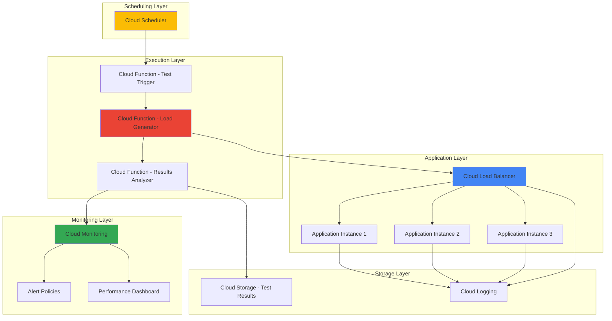

# Performance Testing Pipelines with Cloud Load Balancing and Cloud Monitoring

## Problem

Modern applications face unpredictable traffic patterns and performance demands that can lead to service degradation, user experience issues, and revenue loss during peak usage periods. Traditional manual performance testing approaches are time-consuming, inconsistent, and fail to provide continuous validation of application performance under varying load conditions. Organizations need automated systems that can continuously test application performance, detect bottlenecks before they impact users, and provide actionable insights for optimization.

## Solution

This recipe implements a comprehensive automated performance testing pipeline using Google Cloud's native services to continuously validate application performance. The solution combines Cloud Load Balancing for traffic distribution, Cloud Functions for executing automated load tests, Cloud Scheduler for orchestrating test execution, and Cloud Monitoring for real-time performance tracking and alerting. This architecture provides automated, scalable performance validation that adapts to changing application requirements and provides continuous feedback on system performance.

## Architecture Diagram



## Prerequisites

1. Google Cloud Platform account with billing enabled
2. Appropriate IAM permissions for Cloud Functions, Cloud Scheduler, Cloud Load Balancing, and Cloud Monitoring
3. Google Cloud SDK (gcloud CLI) installed and authenticated
4. Basic understanding of HTTP load testing concepts and performance metrics
5. Existing web application or willingness to deploy a sample application for testing
6. Estimated cost: $20-50 per month for moderate testing workloads (varies based on test frequency and duration)

> **Note**: This recipe creates resources that may incur charges. Monitor your usage through the [Google Cloud Billing dashboard](https://cloud.google.com/billing/docs) and set up budget alerts to control costs.

## Preparation

```bash
# Set environment variables for consistent resource naming
export PROJECT_ID="perf-testing-$(date +%s)"
export REGION="us-central1"
export ZONE="us-central1-a"

# Generate unique suffix for resource names
RANDOM_SUFFIX=$(openssl rand -hex 3)
export FUNCTION_NAME="perf-test-${RANDOM_SUFFIX}"
export BUCKET_NAME="${PROJECT_ID}-test-results"
export SERVICE_ACCOUNT_NAME="perf-test-sa"

# Set default project and region
gcloud config set project ${PROJECT_ID}
gcloud config set compute/region ${REGION}
gcloud config set compute/zone ${ZONE}

# Enable required Google Cloud APIs
gcloud services enable cloudfunctions.googleapis.com
gcloud services enable cloudscheduler.googleapis.com
gcloud services enable compute.googleapis.com
gcloud services enable monitoring.googleapis.com
gcloud services enable logging.googleapis.com
gcloud services enable storage.googleapis.com

# Create Cloud Storage bucket for test results
gsutil mb -p ${PROJECT_ID} \
    -c STANDARD \
    -l ${REGION} \
    gs://${BUCKET_NAME}

echo "✅ Project configured: ${PROJECT_ID}"
echo "✅ Required APIs enabled"
echo "✅ Storage bucket created: ${BUCKET_NAME}"
```

## Steps

1. **Create Service Account for Performance Testing Functions**:

   Google Cloud service accounts provide secure, programmatic access to Google Cloud resources without requiring user credentials. For our automated performance testing pipeline, we need a dedicated service account that can execute load tests, write results to Cloud Storage, and publish metrics to Cloud Monitoring. This follows the principle of least privilege by granting only the specific permissions needed for performance testing operations.

   ```bash
   # Create service account for performance testing
   gcloud iam service-accounts create ${SERVICE_ACCOUNT_NAME} \
       --display-name="Performance Testing Service Account" \
       --description="Service account for automated performance testing pipeline"
   
   # Get service account email
   SERVICE_ACCOUNT_EMAIL="${SERVICE_ACCOUNT_NAME}@${PROJECT_ID}.iam.gserviceaccount.com"
   
   # Grant necessary IAM roles
   gcloud projects add-iam-policy-binding ${PROJECT_ID} \
       --member="serviceAccount:${SERVICE_ACCOUNT_EMAIL}" \
       --role="roles/storage.objectAdmin"
   
   gcloud projects add-iam-policy-binding ${PROJECT_ID} \
       --member="serviceAccount:${SERVICE_ACCOUNT_EMAIL}" \
       --role="roles/monitoring.metricWriter"
   
   gcloud projects add-iam-policy-binding ${PROJECT_ID} \
       --member="serviceAccount:${SERVICE_ACCOUNT_EMAIL}" \
       --role="roles/logging.logWriter"
   
   echo "✅ Service account created with appropriate permissions"
   ```

   The service account now has the minimum permissions required to execute performance tests, store results, and publish monitoring data. This security model ensures that our automated testing functions can only access the resources they need while preventing unauthorized access to other project resources.

2. **Deploy Sample Application with Load Balancer**:

   Cloud Load Balancing distributes incoming requests across multiple backend instances, providing high availability and scalability for applications. For performance testing, we need a target application that demonstrates realistic load distribution patterns. This step creates a simple web application deployed across multiple instances behind a load balancer, simulating a production environment that can be subjected to various load testing scenarios.

   ```bash
   # Create instance template for application servers
   gcloud compute instance-templates create app-template-${RANDOM_SUFFIX} \
       --machine-type=e2-medium \
       --image-family=debian-11 \
       --image-project=debian-cloud \
       --startup-script='#!/bin/bash
         apt-get update
         apt-get install -y nginx
         cat > /var/www/html/index.html << EOF
   <!DOCTYPE html>
   <html>
   <head><title>Performance Test App</title></head>
   <body>
     <h1>Performance Testing Target Application</h1>
     <p>Instance: $(hostname)</p>
     <p>Timestamp: $(date)</p>
     <p>Request processed successfully</p>
   </body>
   </html>
   EOF
         systemctl enable nginx
         systemctl start nginx' \
       --tags=http-server \
       --scopes=https://www.googleapis.com/auth/monitoring.write
   
   # Create managed instance group
   gcloud compute instance-groups managed create app-group-${RANDOM_SUFFIX} \
       --base-instance-name=app-instance \
       --template=app-template-${RANDOM_SUFFIX} \
       --size=3 \
       --zone=${ZONE}
   
   # Configure autoscaling
   gcloud compute instance-groups managed set-autoscaling app-group-${RANDOM_SUFFIX} \
       --zone=${ZONE} \
       --max-num-replicas=10 \
       --min-num-replicas=2 \
       --target-cpu-utilization=0.7
   
   echo "✅ Application instances deployed with autoscaling enabled"
   ```

   The managed instance group provides a scalable foundation for performance testing, with automatic scaling based on CPU utilization. This configuration allows us to test how the application and load balancer respond to varying traffic loads while maintaining realistic production-like behavior patterns.

3. **Create HTTP Load Balancer Configuration**:

   Google Cloud's HTTP(S) Load Balancing provides global load distribution with advanced traffic management capabilities. Setting up a proper load balancer configuration enables us to test realistic traffic patterns and measure performance metrics that reflect actual user experience. The load balancer also provides built-in health checks and monitoring integration that supports comprehensive performance analysis.

   ```bash
   # Create firewall rule for load balancer health checks
   gcloud compute firewall-rules create allow-health-check-${RANDOM_SUFFIX} \
       --allow tcp:80 \
       --source-ranges 130.211.0.0/22,35.191.0.0/16 \
       --target-tags http-server \
       --description="Allow health check access to HTTP servers"
   
   # Create health check
   gcloud compute health-checks create http health-check-${RANDOM_SUFFIX} \
       --port 80 \
       --request-path / \
       --check-interval 10s \
       --timeout 5s \
       --healthy-threshold 2 \
       --unhealthy-threshold 3
   
   # Create backend service
   gcloud compute backend-services create backend-service-${RANDOM_SUFFIX} \
       --protocol HTTP \
       --health-checks health-check-${RANDOM_SUFFIX} \
       --global
   
   # Add instance group to backend service
   gcloud compute backend-services add-backend backend-service-${RANDOM_SUFFIX} \
       --instance-group app-group-${RANDOM_SUFFIX} \
       --instance-group-zone ${ZONE} \
       --global
   
   # Create URL map
   gcloud compute url-maps create url-map-${RANDOM_SUFFIX} \
       --default-service backend-service-${RANDOM_SUFFIX}
   
   # Create HTTP proxy
   gcloud compute target-http-proxies create http-proxy-${RANDOM_SUFFIX} \
       --url-map url-map-${RANDOM_SUFFIX}
   
   # Create global forwarding rule
   gcloud compute forwarding-rules create http-forwarding-rule-${RANDOM_SUFFIX} \
       --global \
       --target-http-proxy http-proxy-${RANDOM_SUFFIX} \
       --ports 80
   
   # Get load balancer IP address
   LB_IP=$(gcloud compute forwarding-rules describe http-forwarding-rule-${RANDOM_SUFFIX} \
       --global --format="value(IPAddress)")
   
   echo "✅ Load balancer configured with IP: ${LB_IP}"
   echo "✅ Health checks and backend services configured"
   ```

   The load balancer is now configured with proper health checks and backend distribution. This setup provides a realistic target for performance testing that includes the same components and behaviors found in production environments, enabling accurate performance measurements and capacity planning.

4. **Create Load Generation Cloud Function**:

   Cloud Functions provide serverless compute capabilities that scale automatically based on demand, making them ideal for generating variable load patterns in performance testing. This function implements HTTP load generation using concurrent requests and configurable test parameters. The serverless nature ensures that load generation capacity scales with testing requirements without managing underlying infrastructure.

   ```bash
   # Create temporary directory for function code
   mkdir -p /tmp/load-generator
   cd /tmp/load-generator
   
   # Create requirements.txt
   cat > requirements.txt << 'EOF'
   requests==2.31.0
   google-cloud-monitoring==2.16.0
   google-cloud-storage==2.10.0
   concurrent.futures
   EOF
   
   # Create main.py with load generation logic
   cat > main.py << 'EOF'
   import json
   import time
   import requests
   import concurrent.futures
   from datetime import datetime
   from google.cloud import monitoring_v3
   from google.cloud import storage
   import functions_framework
   
   def execute_load_test(target_url, duration_seconds, concurrent_users, requests_per_second):
       """Execute load test against target URL"""
       results = {
           'start_time': datetime.utcnow().isoformat(),
           'target_url': target_url,
           'duration_seconds': duration_seconds,
           'concurrent_users': concurrent_users,
           'requests_per_second': requests_per_second,
           'total_requests': 0,
           'successful_requests': 0,
           'failed_requests': 0,
           'response_times': [],
           'error_details': []
       }
       
       start_time = time.time()
       request_interval = 1.0 / requests_per_second if requests_per_second > 0 else 0.1
       
       def make_request():
           try:
               response_start = time.time()
               response = requests.get(target_url, timeout=30)
               response_time = time.time() - response_start
               
               if response.status_code == 200:
                   return {'success': True, 'response_time': response_time}
               else:
                   return {'success': False, 'error': f'HTTP {response.status_code}', 'response_time': response_time}
           except Exception as e:
               return {'success': False, 'error': str(e), 'response_time': 0}
       
       with concurrent.futures.ThreadPoolExecutor(max_workers=concurrent_users) as executor:
           while time.time() - start_time < duration_seconds:
               future = executor.submit(make_request)
               try:
                   result = future.result(timeout=35)
                   results['total_requests'] += 1
                   
                   if result['success']:
                       results['successful_requests'] += 1
                       results['response_times'].append(result['response_time'])
                   else:
                       results['failed_requests'] += 1
                       results['error_details'].append(result['error'])
                   
                   time.sleep(request_interval)
               except concurrent.futures.TimeoutError:
                   results['failed_requests'] += 1
                   results['error_details'].append('Request timeout')
       
       results['end_time'] = datetime.utcnow().isoformat()
       return results
   
   def publish_metrics(results, project_id):
       """Publish performance metrics to Cloud Monitoring"""
       client = monitoring_v3.MetricServiceClient()
       project_name = f"projects/{project_id}"
       
       series = monitoring_v3.TimeSeries()
       series.metric.type = "custom.googleapis.com/performance_test/response_time"
       series.resource.type = "global"
       
       if results['response_times']:
           avg_response_time = sum(results['response_times']) / len(results['response_times'])
           
           point = series.points.add()
           point.value.double_value = avg_response_time
           now = time.time()
           point.interval.end_time.seconds = int(now)
           point.interval.end_time.nanos = int((now - int(now)) * 10**9)
           
           client.create_time_series(name=project_name, time_series=[series])
   
   @functions_framework.http
   def load_test_function(request):
       """Cloud Function entry point for load testing"""
       try:
           request_json = request.get_json()
           
           target_url = request_json.get('target_url', '')
           duration_seconds = request_json.get('duration_seconds', 60)
           concurrent_users = request_json.get('concurrent_users', 10)
           requests_per_second = request_json.get('requests_per_second', 5)
           
           if not target_url:
               return {'error': 'target_url is required'}, 400
           
           # Execute load test
           results = execute_load_test(target_url, duration_seconds, concurrent_users, requests_per_second)
           
           # Publish metrics to Cloud Monitoring
           project_id = request_json.get('project_id', '')
           if project_id:
               publish_metrics(results, project_id)
           
           # Store results in Cloud Storage
           bucket_name = request_json.get('bucket_name', '')
           if bucket_name:
               storage_client = storage.Client()
               bucket = storage_client.bucket(bucket_name)
               blob_name = f"test-results/{datetime.utcnow().strftime('%Y%m%d_%H%M%S')}_results.json"
               blob = bucket.blob(blob_name)
               blob.upload_from_string(json.dumps(results, indent=2))
           
           return {'status': 'completed', 'results_summary': {
               'total_requests': results['total_requests'],
               'successful_requests': results['successful_requests'],
               'failed_requests': results['failed_requests'],
               'average_response_time': sum(results['response_times']) / len(results['response_times']) if results['response_times'] else 0
           }}
           
       except Exception as e:
           return {'error': str(e)}, 500
   EOF
   
   # Deploy Cloud Function
   gcloud functions deploy ${FUNCTION_NAME} \
       --runtime python311 \
       --trigger http \
       --entry-point load_test_function \
       --service-account ${SERVICE_ACCOUNT_EMAIL} \
       --memory 512MB \
       --timeout 540s \
       --max-instances 10 \
       --allow-unauthenticated
   
   echo "✅ Load generation function deployed successfully"
   ```

   The load generation function is now deployed and ready to execute configurable performance tests. This serverless approach automatically handles scaling and resource management while providing detailed performance metrics and results storage for comprehensive analysis and historical tracking.

5. **Create Performance Monitoring Dashboard**:

   Cloud Monitoring provides comprehensive observability for Google Cloud resources and applications through customizable dashboards and alerting policies. Creating a dedicated performance testing dashboard enables real-time visibility into test execution, application performance metrics, and load balancer behavior. This centralized monitoring approach supports both automated testing workflows and manual performance analysis.

   ```bash
   # Create custom dashboard configuration
   cat > /tmp/dashboard-config.json << EOF
   {
     "displayName": "Performance Testing Dashboard",
     "mosaicLayout": {
       "tiles": [
         {
           "width": 6,
           "height": 4,
           "widget": {
             "title": "HTTP Load Balancer Request Rate",
             "xyChart": {
               "dataSets": [
                 {
                   "timeSeriesQuery": {
                     "timeSeriesFilter": {
                       "filter": "resource.type=\"gce_backend_service\"",
                       "aggregation": {
                         "alignmentPeriod": "60s",
                         "perSeriesAligner": "ALIGN_RATE"
                       }
                     }
                   },
                   "plotType": "LINE"
                 }
               ],
               "yAxis": {
                 "label": "Requests/second"
               }
             }
           }
         },
         {
           "width": 6,
           "height": 4,
           "xPos": 6,
           "widget": {
             "title": "Backend Response Latency",
             "xyChart": {
               "dataSets": [
                 {
                   "timeSeriesQuery": {
                     "timeSeriesFilter": {
                       "filter": "resource.type=\"gce_backend_service\"",
                       "aggregation": {
                         "alignmentPeriod": "60s",
                         "perSeriesAligner": "ALIGN_MEAN"
                       }
                     }
                   },
                   "plotType": "LINE"
                 }
               ],
               "yAxis": {
                 "label": "Latency (ms)"
               }
             }
           }
         },
         {
           "width": 6,
           "height": 4,
           "yPos": 4,
           "widget": {
             "title": "Performance Test Response Time",
             "xyChart": {
               "dataSets": [
                 {
                   "timeSeriesQuery": {
                     "timeSeriesFilter": {
                       "filter": "metric.type=\"custom.googleapis.com/performance_test/response_time\"",
                       "aggregation": {
                         "alignmentPeriod": "60s",
                         "perSeriesAligner": "ALIGN_MEAN"
                       }
                     }
                   },
                   "plotType": "LINE"
                 }
               ],
               "yAxis": {
                 "label": "Response Time (seconds)"
               }
             }
           }
         },
         {
           "width": 6,
           "height": 4,
           "xPos": 6,
           "yPos": 4,
           "widget": {
             "title": "Instance Group Size",
             "xyChart": {
               "dataSets": [
                 {
                   "timeSeriesQuery": {
                     "timeSeriesFilter": {
                       "filter": "resource.type=\"gce_instance_group\"",
                       "aggregation": {
                         "alignmentPeriod": "60s",
                         "perSeriesAligner": "ALIGN_MEAN"
                       }
                     }
                   },
                   "plotType": "LINE"
                 }
               ],
               "yAxis": {
                 "label": "Number of Instances"
               }
             }
           }
         }
       ]
     }
   }
   EOF
   
   # Create dashboard using Cloud Monitoring API
   DASHBOARD_ID=$(gcloud monitoring dashboards create \
       --config-from-file=/tmp/dashboard-config.json \
       --format="value(name)" | sed 's|.*/||')
   
   echo "✅ Performance monitoring dashboard created"
   echo "Dashboard ID: ${DASHBOARD_ID}"
   ```

   The monitoring dashboard provides real-time visibility into both infrastructure performance and custom test metrics. This integrated monitoring approach enables correlation between load testing activities and system behavior, supporting data-driven performance optimization and capacity planning decisions.

6. **Create Alert Policies for Performance Thresholds**:

   Proactive alerting ensures that performance degradation is detected and addressed before it impacts users. Cloud Monitoring alert policies can monitor both infrastructure metrics and custom performance test results, triggering notifications when thresholds are exceeded. This automated alerting capability transforms performance testing from reactive analysis to proactive performance management.

   ```bash
   # Create alert policy for high response times
   cat > /tmp/alert-policy.json << EOF
   {
     "displayName": "Performance Test - High Response Time",
     "conditions": [
       {
         "displayName": "Response time exceeds threshold",
         "conditionThreshold": {
           "filter": "metric.type=\"custom.googleapis.com/performance_test/response_time\"",
           "comparison": "COMPARISON_GREATER_THAN",
           "thresholdValue": 2.0,
           "duration": "300s",
           "aggregations": [
             {
               "alignmentPeriod": "60s",
               "perSeriesAligner": "ALIGN_MEAN"
             }
           ]
         }
       }
     ],
     "alertStrategy": {
       "autoClose": "1800s"
     },
     "combiner": "OR",
     "enabled": true,
     "notificationChannels": []
   }
   EOF
   
   # Create the alert policy
   gcloud alpha monitoring policies create \
       --policy-from-file=/tmp/alert-policy.json
   
   # Create alert policy for high error rate
   cat > /tmp/error-alert-policy.json << EOF
   {
     "displayName": "Performance Test - High Error Rate",
     "conditions": [
       {
         "displayName": "Error rate exceeds 5%",
         "conditionThreshold": {
           "filter": "resource.type=\"gce_backend_service\"",
           "comparison": "COMPARISON_GREATER_THAN",
           "thresholdValue": 0.05,
           "duration": "300s",
           "aggregations": [
             {
               "alignmentPeriod": "60s",
               "perSeriesAligner": "ALIGN_RATE"
             }
           ]
         }
       }
     ],
     "alertStrategy": {
       "autoClose": "1800s"
     },
     "combiner": "OR",
     "enabled": true,
     "notificationChannels": []
   }
   EOF
   
   # Create the error rate alert policy
   gcloud alpha monitoring policies create \
       --policy-from-file=/tmp/error-alert-policy.json
   
   echo "✅ Alert policies created for performance monitoring"
   echo "✅ Alerts will trigger for response times > 2 seconds"
   echo "✅ Alerts will trigger for error rates > 5%"
   ```

   The alert policies now monitor critical performance indicators and will automatically notify stakeholders when performance degrades beyond acceptable thresholds. This proactive monitoring approach enables rapid response to performance issues and supports continuous performance validation.

7. **Schedule Automated Performance Tests**:

   Cloud Scheduler provides fully managed cron job scheduling for triggering automated workflows at specified intervals. By scheduling regular performance tests, organizations can continuously validate application performance and detect performance regressions before they impact production users. This automated approach ensures consistent performance monitoring without manual intervention.

   ```bash
   # Create Cloud Scheduler job for regular performance testing
   FUNCTION_URL=$(gcloud functions describe ${FUNCTION_NAME} \
       --format="value(httpsTrigger.url)")
   
   # Create payload for scheduled tests
   cat > /tmp/test-payload.json << EOF
   {
     "target_url": "http://${LB_IP}",
     "duration_seconds": 300,
     "concurrent_users": 20,
     "requests_per_second": 10,
     "project_id": "${PROJECT_ID}",
     "bucket_name": "${BUCKET_NAME}"
   }
   EOF
   
   # Create scheduled job for daily performance tests
   gcloud scheduler jobs create http daily-perf-test-${RANDOM_SUFFIX} \
       --schedule="0 2 * * *" \
       --uri="${FUNCTION_URL}" \
       --http-method=POST \
       --headers="Content-Type=application/json" \
       --message-body-from-file=/tmp/test-payload.json \
       --time-zone="UTC" \
       --description="Daily automated performance test"
   
   # Create scheduled job for hourly light testing
   cat > /tmp/light-test-payload.json << EOF
   {
     "target_url": "http://${LB_IP}",
     "duration_seconds": 60,
     "concurrent_users": 5,
     "requests_per_second": 5,
     "project_id": "${PROJECT_ID}",
     "bucket_name": "${BUCKET_NAME}"
   }
   EOF
   
   gcloud scheduler jobs create http hourly-perf-test-${RANDOM_SUFFIX} \
       --schedule="0 * * * *" \
       --uri="${FUNCTION_URL}" \
       --http-method=POST \
       --headers="Content-Type=application/json" \
       --message-body-from-file=/tmp/light-test-payload.json \
       --time-zone="UTC" \
       --description="Hourly light performance validation"
   
   echo "✅ Scheduled performance tests configured"
   echo "✅ Daily comprehensive tests at 2:00 AM UTC"
   echo "✅ Hourly light validation tests"
   ```

   The automated testing schedule now provides continuous performance validation with both comprehensive daily tests and frequent light validation. This scheduling approach balances thorough performance monitoring with cost efficiency while ensuring consistent performance oversight.

8. **Test the Performance Testing Pipeline**:

   Manual testing validates that all pipeline components function correctly and produce accurate performance data. This verification step ensures that automated schedules will execute successfully and that performance metrics are properly collected and analyzed. Testing the complete pipeline also provides baseline performance data for comparison with future automated test results.

   ```bash
   # Execute a manual test to verify pipeline functionality
   echo "Executing manual performance test..."
   
   curl -X POST "${FUNCTION_URL}" \
       -H "Content-Type: application/json" \
       -d '{
         "target_url": "http://'${LB_IP}'",
         "duration_seconds": 120,
         "concurrent_users": 15,
         "requests_per_second": 8,
         "project_id": "'${PROJECT_ID}'",
         "bucket_name": "'${BUCKET_NAME}'"
       }' | jq '.'
   
   # Wait for test completion and check results
   echo "Waiting for test completion..."
   sleep 130
   
   # List recent test results in Cloud Storage
   echo "Recent test results:"
   gsutil ls -l gs://${BUCKET_NAME}/test-results/ | tail -5
   
   # Check custom metrics in Cloud Monitoring
   echo "Verifying custom metrics..."
   gcloud monitoring metrics list \
       --filter="metric.type:custom.googleapis.com/performance_test" \
       --format="table(type,displayName)"
   
   echo "✅ Manual test completed successfully"
   echo "✅ Results stored in Cloud Storage"
   echo "✅ Custom metrics published to Cloud Monitoring"
   ```

   The manual test execution confirms that the entire performance testing pipeline functions correctly, from load generation through results storage and metric publication. This validation ensures that scheduled automated tests will execute reliably and provide consistent performance monitoring.

## Validation & Testing

1. **Verify Load Balancer Configuration**:

   ```bash
   # Check load balancer status and configuration
   gcloud compute forwarding-rules list \
       --filter="name:http-forwarding-rule-${RANDOM_SUFFIX}" \
       --format="table(name,IPAddress,target)"
   
   # Verify backend service health
   gcloud compute backend-services get-health backend-service-${RANDOM_SUFFIX} \
       --global \
       --format="table(instance,healthState,port)"
   
   # Test load balancer response
   curl -s "http://${LB_IP}" | grep "Performance Test App"
   ```

   Expected output: Load balancer should show healthy backends and respond with the sample application HTML.

2. **Validate Cloud Function Deployment**:

   ```bash
   # List deployed functions
   gcloud functions list --filter="name:${FUNCTION_NAME}" \
       --format="table(name,status,trigger.httpsTrigger.url)"
   
   # Test function accessibility
   curl -X POST "${FUNCTION_URL}" \
       -H "Content-Type: application/json" \
       -d '{"target_url": "http://example.com", "duration_seconds": 10}' \
       --max-time 30
   ```

   Expected output: Function should be listed as ACTIVE and respond to test requests.

3. **Check Scheduled Jobs Configuration**:

   ```bash
   # List Cloud Scheduler jobs
   gcloud scheduler jobs list \
       --format="table(name,schedule,state,uri)"
   
   # Check job execution history
   gcloud scheduler jobs describe daily-perf-test-${RANDOM_SUFFIX} \
       --format="yaml(lastAttemptTime,state)"
   ```

   Expected output: Scheduled jobs should be listed with ENABLED state and proper schedules.

4. **Verify Monitoring and Alerting Setup**:

   ```bash
   # List monitoring dashboards
   gcloud monitoring dashboards list \
       --format="table(displayName,name)"
   
   # Check alert policies
   gcloud alpha monitoring policies list \
       --format="table(displayName,enabled,conditions[0].displayName)"
   
   # Verify custom metrics are being published
   gcloud monitoring metrics list \
       --filter="metric.type:custom.googleapis.com/performance_test" \
       --format="table(type,labels)"
   ```

   Expected output: Dashboard and alert policies should be listed with appropriate configurations.

## Cleanup

1. **Delete Cloud Scheduler Jobs**:

   ```bash
   # Remove scheduled performance tests
   gcloud scheduler jobs delete daily-perf-test-${RANDOM_SUFFIX} --quiet
   gcloud scheduler jobs delete hourly-perf-test-${RANDOM_SUFFIX} --quiet
   
   echo "✅ Deleted scheduled jobs"
   ```

2. **Remove Load Balancer and Backend Resources**:

   ```bash
   # Delete forwarding rule
   gcloud compute forwarding-rules delete http-forwarding-rule-${RANDOM_SUFFIX} \
       --global --quiet
   
   # Delete HTTP proxy
   gcloud compute target-http-proxies delete http-proxy-${RANDOM_SUFFIX} --quiet
   
   # Delete URL map
   gcloud compute url-maps delete url-map-${RANDOM_SUFFIX} --quiet
   
   # Delete backend service
   gcloud compute backend-services delete backend-service-${RANDOM_SUFFIX} \
       --global --quiet
   
   # Delete health check
   gcloud compute health-checks delete health-check-${RANDOM_SUFFIX} --quiet
   
   echo "✅ Deleted load balancer components"
   ```

3. **Remove Compute Resources**:

   ```bash
   # Delete managed instance group
   gcloud compute instance-groups managed delete app-group-${RANDOM_SUFFIX} \
       --zone=${ZONE} --quiet
   
   # Delete instance template
   gcloud compute instance-templates delete app-template-${RANDOM_SUFFIX} --quiet
   
   # Delete firewall rule
   gcloud compute firewall-rules delete allow-health-check-${RANDOM_SUFFIX} --quiet
   
   echo "✅ Deleted compute resources"
   ```

4. **Clean Up Cloud Functions and Storage**:

   ```bash
   # Delete Cloud Function
   gcloud functions delete ${FUNCTION_NAME} --quiet
   
   # Remove Cloud Storage bucket and contents
   gsutil -m rm -r gs://${BUCKET_NAME}
   
   # Delete service account
   gcloud iam service-accounts delete ${SERVICE_ACCOUNT_EMAIL} --quiet
   
   echo "✅ Deleted functions and storage resources"
   ```

5. **Remove Monitoring Resources**:

   ```bash
   # Delete alert policies
   ALERT_POLICIES=$(gcloud alpha monitoring policies list \
       --filter="displayName:(Performance Test)" \
       --format="value(name)")
   
   for policy in $ALERT_POLICIES; do
       gcloud alpha monitoring policies delete $policy --quiet
   done
   
   # Delete dashboard
   if [ ! -z "$DASHBOARD_ID" ]; then
       gcloud monitoring dashboards delete $DASHBOARD_ID --quiet
   fi
   
   echo "✅ Deleted monitoring resources"
   echo "✅ All resources cleaned up successfully"
   ```

## Discussion

This automated performance testing pipeline leverages Google Cloud's native services to provide continuous performance validation without requiring dedicated infrastructure management. The architecture demonstrates several key cloud-native patterns: serverless execution through Cloud Functions eliminates the need to provision and manage load testing infrastructure, while Cloud Scheduler provides reliable automation without requiring dedicated scheduling systems. The integration with Cloud Monitoring creates a comprehensive observability solution that correlates performance test results with actual application metrics.

The pipeline's design addresses common performance testing challenges through automation and scalability. Traditional performance testing often requires significant manual effort to set up test environments, execute tests, and analyze results. By automating these processes with Cloud Functions and Cloud Scheduler, teams can ensure consistent performance validation without manual intervention. The serverless approach also means that testing capacity automatically scales with demand, eliminating the need to provision dedicated load testing infrastructure that may be underutilized between test cycles.

The integration between Cloud Load Balancing and Cloud Monitoring provides realistic performance testing conditions that mirror production environments. Load balancers distribute test traffic across multiple application instances, simulating real user traffic patterns while health checks ensure that only healthy instances receive traffic. This approach enables accurate capacity planning and performance optimization based on realistic load distribution scenarios. The monitoring integration captures both infrastructure metrics and custom performance indicators, providing comprehensive visibility into application behavior under load.

Cost optimization is inherent in the serverless architecture, as resources are only consumed during actual test execution. Cloud Functions automatically scale from zero to handle test workloads, then scale back down when tests complete, minimizing ongoing costs. Cloud Scheduler charges are minimal for typical testing frequencies, while Cloud Storage costs depend on test result retention requirements. This pay-per-use model makes automated performance testing accessible for organizations of all sizes without significant upfront infrastructure investments.

For additional implementation guidance, refer to the [Google Cloud Load Balancing documentation](https://cloud.google.com/load-balancing/docs) for advanced traffic management configurations and the [Cloud Monitoring best practices guide](https://cloud.google.com/monitoring/best-practices) for comprehensive observability strategies. The [Cloud Functions performance optimization guide](https://cloud.google.com/functions/docs/bestpractices/performance) provides insights for optimizing load generation function execution, while the [Cloud Scheduler documentation](https://cloud.google.com/scheduler/docs) covers advanced scheduling patterns and error handling strategies.

> **Tip**: Configure notification channels for alert policies to receive immediate notifications when performance thresholds are exceeded. This enables rapid response to performance degradation and supports proactive performance management across your applications.

## Challenge

Extend this automated performance testing solution by implementing these advanced capabilities:

1. **Multi-Region Performance Testing**: Deploy load generation functions across multiple Google Cloud regions to test application performance from different geographic locations. Configure Cloud Scheduler jobs to coordinate distributed testing and aggregate results for global performance analysis.

2. **Adaptive Load Testing**: Implement Cloud Functions that automatically adjust test parameters based on previous test results and current application capacity. Use Cloud Monitoring data to dynamically scale test intensity and duration based on observed performance trends.

3. **Performance Regression Detection**: Build a machine learning pipeline using Vertex AI to analyze historical performance test data and automatically detect performance regressions. Integrate with Cloud Build to trigger performance tests during CI/CD pipelines and block deployments that show performance degradation.

4. **Real User Monitoring Integration**: Combine synthetic performance testing with Real User Monitoring (RUM) data by integrating Google Analytics or custom user experience tracking. Create comprehensive performance dashboards that correlate synthetic test results with actual user experience metrics.

5. **Chaos Engineering Integration**: Extend the pipeline to include chaos engineering tests by randomly terminating application instances or introducing network latency during performance tests. Use this approach to validate application resilience and measure performance recovery patterns under adverse conditions.

## Infrastructure Code

*Infrastructure code will be generated after recipe approval.*