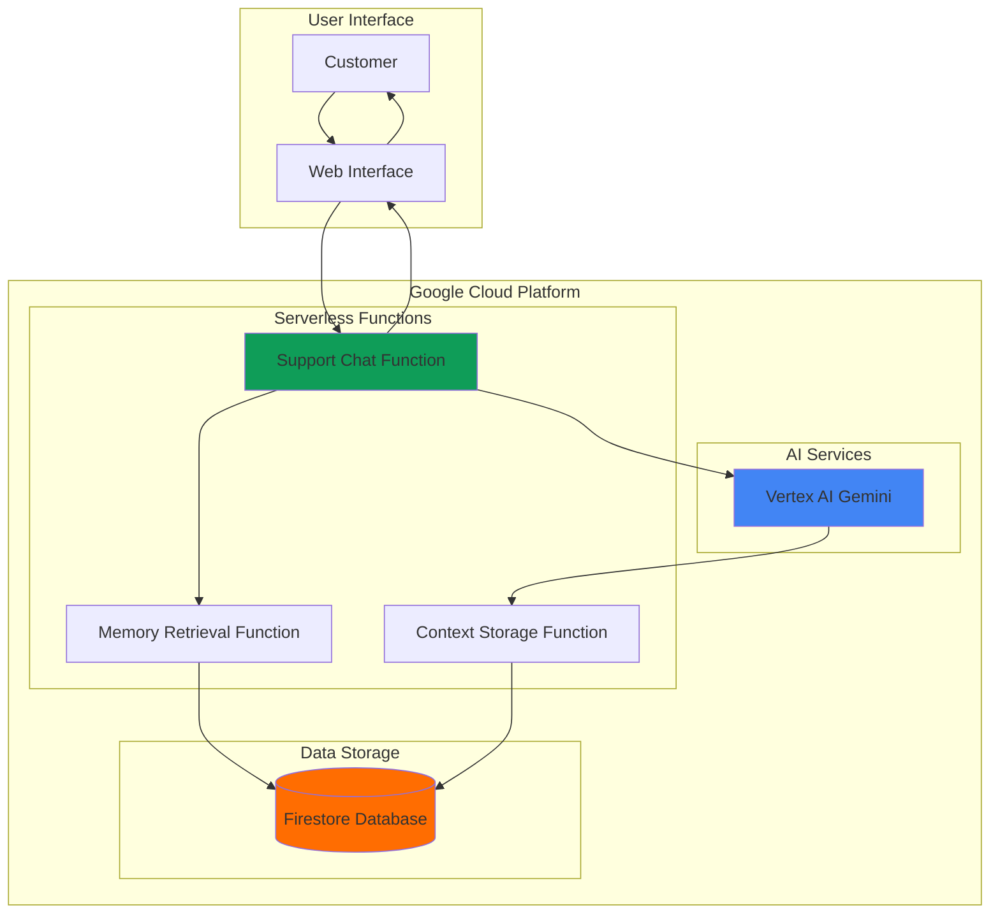

# Persistent AI Customer Support with Agent Engine Memory

## Problem

Customer support teams struggle with fragmented conversation experiences where agents lack visibility into previous customer interactions, leading to repetitive questions, frustrated customers, and inefficient resolution times. Without conversation memory, AI-powered support systems cannot provide personalized responses or maintain context across multiple support sessions, forcing customers to repeatedly explain their issues and reducing overall satisfaction with support experiences.

## Solution

Build an intelligent customer support agent using Vertex AI's Gemini model with persistent conversation memory stored in Firestore. Cloud Functions orchestrate the workflow by retrieving conversation history, enriching prompts with customer context, and storing new interactions for future reference. This serverless architecture enables personalized, contextual responses while maintaining conversation continuity across multiple support sessions.

## Architecture Diagram



## Prerequisites

1. Google Cloud account with Vertex AI API and Firestore API enabled
2. Google Cloud CLI (gcloud) installed and configured
3. Basic knowledge of serverless functions and NoSQL databases
4. Understanding of conversational AI and prompt engineering
5. Estimated cost: $5-15 for testing (Vertex AI usage, Firestore operations, Cloud Functions invocations)

> **Note**: This configuration follows Google Cloud best practices for serverless AI applications. Review the [Vertex AI pricing documentation](https://cloud.google.com/vertex-ai/pricing) for detailed cost estimates.

## Preparation

```bash
# Set environment variables for GCP resources
export PROJECT_ID="support-agent-$(date +%s)"
export REGION="us-central1"
export ZONE="us-central1-a"

# Generate unique suffix for resource names
RANDOM_SUFFIX=$(openssl rand -hex 3)
export FUNCTION_NAME="support-chat-${RANDOM_SUFFIX}"
export FIRESTORE_DATABASE="support-memory-${RANDOM_SUFFIX}"

# Set default project and region
gcloud config set project ${PROJECT_ID}
gcloud config set compute/region ${REGION}
gcloud config set functions/region ${REGION}

# Enable required APIs
gcloud services enable cloudfunctions.googleapis.com
gcloud services enable firestore.googleapis.com
gcloud services enable aiplatform.googleapis.com
gcloud services enable cloudbuild.googleapis.com

echo "✅ Project configured: ${PROJECT_ID}"
echo "✅ Function name: ${FUNCTION_NAME}"
```

## Steps

1. **Create Firestore Database for Conversation Memory**:

   Firestore provides a fully managed NoSQL database that excels at storing conversational data with real-time synchronization capabilities. Creating a Firestore database establishes the persistent memory layer that enables our AI agent to maintain context across customer interactions, supporting complex conversation threads and customer relationship building.

   ```bash
   # Create Firestore database in Native mode
   gcloud firestore databases create \
       --location=${REGION} \
       --type=firestore-native
   
   echo "✅ Firestore database created for conversation memory"
   ```

   The Firestore database now provides scalable, real-time conversation storage with automatic indexing and powerful querying capabilities. This foundation enables our AI agent to quickly retrieve relevant conversation history and maintain personalized customer context across support sessions.

2. **Create Cloud Function for Memory Retrieval**:

   Cloud Functions provide serverless execution for retrieving conversation history with automatic scaling based on support volume. The memory retrieval function queries Firestore to gather relevant customer context, enabling the AI to provide informed responses based on previous interactions and customer preferences.

   ```bash
   # Create directory for memory retrieval function
   mkdir -p memory-functions/retrieve
   cd memory-functions/retrieve
   
   # Create requirements.txt for dependencies
   cat > requirements.txt << EOF
   functions-framework==3.*
   google-cloud-firestore==2.*
   google-cloud-aiplatform==1.*
   flask==2.*
   EOF
   
   echo "✅ Memory retrieval function structure created"
   ```

3. **Implement Memory Retrieval Logic**:

   The memory retrieval function implements sophisticated conversation history analysis, extracting relevant context patterns and customer preferences from Firestore. This serverless approach ensures efficient memory lookup while maintaining security through Google Cloud IAM integration and providing foundation for personalized AI responses.

   ```bash
   # Create memory retrieval function code
   cat > main.py << 'EOF'
   import functions_framework
   from google.cloud import firestore
   import json
   from flask import Request
   from datetime import datetime, timedelta
   
   @functions_framework.http
   def retrieve_memory(request: Request):
       """Retrieve conversation memory for customer context."""
       
       if request.method == 'OPTIONS':
           headers = {
               'Access-Control-Allow-Origin': '*',
               'Access-Control-Allow-Methods': 'POST',
               'Access-Control-Allow-Headers': 'Content-Type',
               'Access-Control-Max-Age': '3600'
           }
           return ('', 204, headers)
       
       try:
           request_json = request.get_json()
           customer_id = request_json.get('customer_id')
           
           if not customer_id:
               return {'error': 'customer_id required'}, 400
           
           # Initialize Firestore client
           db = firestore.Client()
           
           # Retrieve recent conversations (last 30 days)
           thirty_days_ago = datetime.now() - timedelta(days=30)
           
           conversations_ref = db.collection('conversations')
           query = conversations_ref.where('customer_id', '==', customer_id) \
                                  .where('timestamp', '>=', thirty_days_ago) \
                                  .order_by('timestamp', \
                                           direction=firestore.Query.DESCENDING) \
                                  .limit(10)
           
           conversations = []
           for doc in query.stream():
               conversation = doc.to_dict()
               conversations.append({
                   'id': doc.id,
                   'message': conversation.get('message', ''),
                   'response': conversation.get('response', ''),
                   'timestamp': conversation.get('timestamp'),
                   'sentiment': conversation.get('sentiment', 'neutral'),
                   'resolved': conversation.get('resolved', False)
               })
           
           # Extract customer context
           customer_context = {
               'total_conversations': len(conversations),
               'recent_topics': [],
               'satisfaction_trend': 'neutral',
               'common_issues': []
           }
           
           if conversations:
               # Analyze conversation patterns
               unresolved_count = sum(1 for c in conversations \
                                    if not c['resolved'])
               customer_context['unresolved_issues'] = unresolved_count
               
               # Extract recent topics (simplified)
               recent_messages = [c['message'][:100] \
                                for c in conversations[:3]]
               customer_context['recent_topics'] = recent_messages
           
           response = {
               'customer_id': customer_id,
               'conversations': conversations,
               'context': customer_context,
               'retrieved_at': datetime.now().isoformat()
           }
           
           headers = {'Access-Control-Allow-Origin': '*'}
           return (response, 200, headers)
           
       except Exception as e:
           return {'error': str(e)}, 500
   EOF
   
   echo "✅ Memory retrieval function implemented"
   ```

4. **Deploy Memory Retrieval Function**:

   Deploying the memory retrieval function to Cloud Functions enables automatic scaling and integration with Google Cloud's security model. The serverless deployment provides cost-effective operation that scales from zero to handle peak support volumes while maintaining sub-second response times for memory queries.

   ```bash
   # Deploy memory retrieval function
   gcloud functions deploy retrieve-memory-${RANDOM_SUFFIX} \
       --runtime python311 \
       --trigger-http \
       --allow-unauthenticated \
       --source . \
       --entry-point retrieve_memory \
       --memory 256MB \
       --timeout 60s
   
   # Get function URL
   export RETRIEVE_MEMORY_URL=$(gcloud functions describe \
       retrieve-memory-${RANDOM_SUFFIX} \
       --format="value(httpsTrigger.url)")
   
   echo "✅ Memory retrieval function deployed"
   echo "Function URL: ${RETRIEVE_MEMORY_URL}"
   ```

5. **Create AI Support Chat Function**:

   The main support chat function orchestrates the entire conversation workflow by coordinating memory retrieval, Vertex AI interaction, and response storage. This serverless architecture provides the intelligence layer that combines customer context with Gemini's conversational capabilities to deliver personalized support experiences.

   ```bash
   # Create directory for main chat function
   cd ../..
   mkdir -p chat-function
   cd chat-function
   
   # Create requirements.txt
   cat > requirements.txt << EOF
   functions-framework==3.*
   google-cloud-firestore==2.*
   google-cloud-aiplatform==1.*
   flask==2.*
   requests==2.*
   EOF
   
   echo "✅ Chat function structure created"
   ```

6. **Implement AI Chat Logic with Memory Integration**:

   The chat function implements sophisticated prompt engineering that incorporates conversation history and customer context into Vertex AI requests. This approach enables the Gemini model to provide contextually aware responses while maintaining conversation continuity and building stronger customer relationships through personalized interactions.

   ```bash
   # Create main chat function
   cat > main.py << 'EOF'
   import functions_framework
   from google.cloud import firestore
   import vertexai
   from vertexai.generative_models import GenerativeModel
   import json
   import requests
   from flask import Request
   from datetime import datetime
   import os
   
   # Initialize Vertex AI
   PROJECT_ID = os.environ.get('GCP_PROJECT')
   REGION = 'us-central1'
   
   vertexai.init(project=PROJECT_ID, location=REGION)
   
   @functions_framework.http
   def support_chat(request: Request):
       """Main support chat function with memory integration."""
       
       if request.method == 'OPTIONS':
           headers = {
               'Access-Control-Allow-Origin': '*',
               'Access-Control-Allow-Methods': 'POST',
               'Access-Control-Allow-Headers': 'Content-Type',
               'Access-Control-Max-Age': '3600'
           }
           return ('', 204, headers)
       
       try:
           request_json = request.get_json()
           customer_id = request_json.get('customer_id')
           message = request_json.get('message')
           
           if not customer_id or not message:
               return {'error': 'customer_id and message required'}, 400
           
           # Retrieve conversation memory
           memory_response = requests.post(
               os.environ.get('RETRIEVE_MEMORY_URL'),
               json={'customer_id': customer_id},
               timeout=30
           )
           
           memory_data = {}
           if memory_response.status_code == 200:
               memory_data = memory_response.json()
           
           # Build context-aware prompt
           system_prompt = build_system_prompt(memory_data)
           user_prompt = f"Customer message: {message}"
           
           # Generate AI response using Vertex AI
           ai_response = generate_ai_response(system_prompt, user_prompt)
           
           # Store conversation in Firestore
           conversation_id = store_conversation(
               customer_id, message, ai_response, \
               memory_data.get('context', {})
           )
           
           response = {
               'conversation_id': conversation_id,
               'customer_id': customer_id,
               'message': message,
               'ai_response': ai_response,
               'memory_context_used': bool(memory_data),
               'timestamp': datetime.now().isoformat()
           }
           
           headers = {'Access-Control-Allow-Origin': '*'}
           return (response, 200, headers)
           
       except Exception as e:
           return {'error': str(e)}, 500
   
   def build_system_prompt(memory_data):
       """Build context-aware system prompt using memory data."""
       base_prompt = """You are a helpful customer support agent. You provide 
       professional, empathetic, and solution-focused responses to customer 
       inquiries.
       
       """
       
       if memory_data and memory_data.get('conversations'):
           context = memory_data.get('context', {})
           conversations = memory_data.get('conversations', [])
           
           base_prompt += f"""
   Customer Context:
   - Total previous conversations: {context.get('total_conversations', 0)}
   - Unresolved issues: {context.get('unresolved_issues', 0)}
   - Recent topics: {', '.join(context.get('recent_topics', [])[:2])}
   
   Recent conversation history:
   """
           
           for conv in conversations[:3]:
               base_prompt += f"- Customer: {conv.get('message', '')[:100]}...\n"
               base_prompt += f"  Agent: {conv.get('response', '')[:100]}...\n"
           
           base_prompt += "\nUse this context to provide personalized, relevant responses."
       
       return base_prompt
   
   def generate_ai_response(system_prompt, user_prompt):
       """Generate AI response using Vertex AI Gemini."""
       try:
           model = GenerativeModel("gemini-1.5-flash")
           
           full_prompt = f"{system_prompt}\n\n{user_prompt}"
           
           response = model.generate_content(
               full_prompt,
               generation_config={
                   "max_output_tokens": 1024,
                   "temperature": 0.7,
                   "top_p": 0.8
               }
           )
           return response.text
           
       except Exception as e:
           return f"I apologize, but I'm experiencing technical difficulties. Please try again or contact our support team directly. Error: {str(e)}"
   
   def store_conversation(customer_id, message, response, context):
       """Store conversation in Firestore."""
       try:
           db = firestore.Client()
           
           conversation_data = {
               'customer_id': customer_id,
               'message': message,
               'response': response,
               'timestamp': datetime.now(),
               'context_used': context,
               'resolved': False,  # Can be updated later
               'sentiment': 'neutral'  # Can be enhanced with sentiment analysis
           }
           
           doc_ref = db.collection('conversations').add(conversation_data)
           return doc_ref[1].id
           
       except Exception as e:
           print(f"Error storing conversation: {e}")
           return None
   EOF
   
   echo "✅ AI chat function implemented with memory integration"
   ```

7. **Deploy AI Support Chat Function**:

   Deploying the main chat function creates the intelligent orchestration layer that coordinates memory retrieval, AI processing, and conversation storage. The serverless deployment ensures reliable operation with automatic scaling while providing secure access to Vertex AI and Firestore through Google Cloud's integrated authentication system.

   ```bash
   # Deploy main chat function with environment variables
   gcloud functions deploy ${FUNCTION_NAME} \
       --runtime python311 \
       --trigger-http \
       --allow-unauthenticated \
       --source . \
       --entry-point support_chat \
       --memory 512MB \
       --timeout 300s \
       --set-env-vars="RETRIEVE_MEMORY_URL=${RETRIEVE_MEMORY_URL}"
   
   # Get chat function URL
   export CHAT_FUNCTION_URL=$(gcloud functions describe ${FUNCTION_NAME} \
       --format="value(httpsTrigger.url)")
   
   echo "✅ AI support chat function deployed"
   echo "Chat Function URL: ${CHAT_FUNCTION_URL}"
   ```

8. **Create Simple Web Interface for Testing**:

   A web interface provides an intuitive way to test the persistent support agent functionality, demonstrating how conversation memory enhances customer experience through contextual responses. The interface showcases the integration between frontend applications and the serverless AI architecture.

   ```bash
   # Create simple HTML interface for testing
   mkdir -p web-interface
   cd web-interface
   
   cat > index.html << EOF
   <!DOCTYPE html>
   <html lang="en">
   <head>
       <meta charset="UTF-8">
       <meta name="viewport" content="width=device-width, initial-scale=1.0">
       <title>AI Customer Support with Memory</title>
       <style>
           body { 
               font-family: Arial, sans-serif; 
               max-width: 800px; 
               margin: 0 auto; 
               padding: 20px; 
           }
           .chat-container { 
               border: 1px solid #ddd; 
               height: 400px; 
               overflow-y: auto; 
               padding: 10px; 
               margin: 10px 0; 
           }
           .message { 
               margin: 10px 0; 
               padding: 10px; 
               border-radius: 5px; 
           }
           .customer { 
               background-color: #e3f2fd; 
               text-align: right; 
           }
           .agent { 
               background-color: #f3e5f5; 
           }
           input[type="text"] { 
               width: 70%; 
               padding: 10px; 
           }
           button { 
               padding: 10px 20px; 
               background-color: #4285f4; 
               color: white; 
               border: none; 
               border-radius: 5px; 
               cursor: pointer; 
           }
           .customer-id { 
               margin: 10px 0; 
           }
       </style>
   </head>
   <body>
       <h1>AI Customer Support with Memory</h1>
       
       <div class="customer-id">
           <label for="customerId">Customer ID:</label>
           <input type="text" id="customerId" value="customer-123" \
                  placeholder="Enter customer ID">
       </div>
       
       <div class="chat-container" id="chatContainer"></div>
       
       <div>
           <input type="text" id="messageInput" \
                  placeholder="Type your message here..." \
                  onkeypress="handleKeyPress(event)">
           <button onclick="sendMessage()">Send</button>
       </div>
       
       <script>
           const CHAT_FUNCTION_URL = '${CHAT_FUNCTION_URL}';
           
           function handleKeyPress(event) {
               if (event.key === 'Enter') {
                   sendMessage();
               }
           }
           
           async function sendMessage() {
               const customerId = document.getElementById('customerId').value;
               const messageInput = document.getElementById('messageInput');
               const message = messageInput.value.trim();
               
               if (!message || !customerId) {
                   alert('Please enter both customer ID and message');
                   return;
               }
               
               // Add customer message to chat
               addMessageToChat('customer', message);
               messageInput.value = '';
               
               try {
                   const response = await fetch(CHAT_FUNCTION_URL, {
                       method: 'POST',
                       headers: {
                           'Content-Type': 'application/json',
                       },
                       body: JSON.stringify({
                           customer_id: customerId,
                           message: message
                       })
                   });
                   
                   const data = await response.json();
                   
                   if (data.ai_response) {
                       addMessageToChat('agent', data.ai_response);
                       if (data.memory_context_used) {
                           addMessageToChat('system', \
                               '🧠 Memory context used for personalized response');
                       }
                   } else {
                       addMessageToChat('agent', \
                           'Sorry, I encountered an error. Please try again.');
                   }
               } catch (error) {
                   addMessageToChat('agent', \
                       'Sorry, I encountered a technical error. Please try again.');
                   console.error('Error:', error);
               }
           }
           
           function addMessageToChat(sender, message) {
               const chatContainer = document.getElementById('chatContainer');
               const messageDiv = document.createElement('div');
               messageDiv.className = \`message \${sender}\`;
               
               if (sender === 'system') {
                   messageDiv.style.backgroundColor = '#fff3e0';
                   messageDiv.style.fontStyle = 'italic';
                   messageDiv.style.textAlign = 'center';
               }
               
               messageDiv.textContent = message;
               chatContainer.appendChild(messageDiv);
               chatContainer.scrollTop = chatContainer.scrollHeight;
           }
       </script>
   </body>
   </html>
   EOF
   
   echo "✅ Web interface created for testing"
   echo "Open index.html in your browser to test the support agent"
   ```

## Validation & Testing

1. **Test Memory Retrieval Function**:

   ```bash
   # Test memory retrieval with sample data
   curl -X POST ${RETRIEVE_MEMORY_URL} \
       -H "Content-Type: application/json" \
       -d '{"customer_id": "test-customer-001"}'
   ```

   Expected output: JSON response with empty conversations array for new customer.

2. **Test AI Chat Function**:

   ```bash
   # Test first conversation (no memory context)
   curl -X POST ${CHAT_FUNCTION_URL} \
       -H "Content-Type: application/json" \
       -d '{
         "customer_id": "test-customer-001",
         "message": "I am having trouble with my recent order"
       }'
   ```

   Expected output: AI response without memory context indicated.

3. **Test Conversation Memory Persistence**:

   ```bash
   # Send follow-up message to test memory
   curl -X POST ${CHAT_FUNCTION_URL} \
       -H "Content-Type: application/json" \
       -d '{
         "customer_id": "test-customer-001", 
         "message": "Can you help me with that order issue I mentioned before?"
       }'
   ```

   Expected output: AI response that references previous conversation context.

4. **Verify Firestore Data Storage**:

   ```bash
   # Check Firestore for stored conversations
   gcloud firestore collections list
   
   # Query conversation documents
   gcloud alpha firestore query \
       --collection-path=conversations \
       --limit=5
   ```

   Expected output: List showing conversations collection with stored interaction data.

## Cleanup

1. **Delete Cloud Functions**:

   ```bash
   # Delete chat function
   gcloud functions delete ${FUNCTION_NAME} \
       --region=${REGION} \
       --quiet
   
   # Delete memory retrieval function
   gcloud functions delete retrieve-memory-${RANDOM_SUFFIX} \
       --region=${REGION} \
       --quiet
   
   echo "✅ Cloud Functions deleted"
   ```

2. **Remove Firestore Database**:

   ```bash
   # Delete Firestore database
   gcloud firestore databases delete \
       --database='(default)' \
       --quiet
   
   echo "✅ Firestore database deleted"
   ```

3. **Clean up local files and environment variables**:

   ```bash
   # Remove local directories
   cd ../..
   rm -rf memory-functions chat-function web-interface
   
   # Unset environment variables
   unset PROJECT_ID REGION ZONE RANDOM_SUFFIX
   unset FUNCTION_NAME FIRESTORE_DATABASE
   unset RETRIEVE_MEMORY_URL CHAT_FUNCTION_URL
   
   echo "✅ Local files and environment variables cleaned up"
   ```

4. **Delete project (optional)**:

   ```bash
   # Delete entire project if created for testing
   gcloud projects delete ${PROJECT_ID} --quiet
   
   echo "✅ Project deleted successfully"
   echo "Note: Project deletion may take several minutes to complete"
   ```

## Discussion

This persistent AI customer support solution demonstrates the power of combining Google Cloud's serverless architecture with advanced AI capabilities to create intelligent, memory-enabled conversation systems. The architecture leverages Vertex AI's Gemini model for natural language understanding and generation, while Firestore provides the persistent memory layer that enables conversation continuity across multiple customer interactions.

The serverless approach using Cloud Functions offers significant operational advantages, including automatic scaling based on support volume, pay-per-use pricing that aligns costs with actual usage, and seamless integration with Google Cloud's security and monitoring ecosystem. The memory retrieval function implements sophisticated conversation history analysis, enabling the AI to understand customer context and provide increasingly personalized responses over time.

Firestore's real-time synchronization capabilities and powerful querying features make it ideal for conversation memory storage, supporting complex conversation threads and enabling advanced analytics on customer interaction patterns. The system can easily be extended to include sentiment analysis, conversation categorization, and automated escalation triggers based on conversation history and customer satisfaction trends.

The prompt engineering approach demonstrated in this solution shows how context-aware AI responses can significantly improve customer experience by reducing repetitive questions, maintaining conversation continuity, and building stronger customer relationships through personalized interactions. This architectural pattern can be adapted for various conversational AI use cases beyond customer support.

> **Tip**: Implement conversation sentiment analysis using Cloud Natural Language API to automatically identify frustrated customers and trigger human agent escalation for improved support outcomes.

For production deployments, consider implementing additional features such as conversation encryption, advanced conversation analytics, multi-language support through Cloud Translation API, and integration with existing CRM systems. The serverless architecture provides a solid foundation for scaling to enterprise-level support volumes while maintaining cost efficiency and operational simplicity.

*Sources:*
- [Vertex AI Generative AI Documentation](https://cloud.google.com/vertex-ai/generative-ai/docs/overview)
- [Cloud Functions Python Runtime](https://cloud.google.com/functions/docs/runtime-support)
- [Firestore Documentation](https://cloud.google.com/firestore/docs)
- [Google Cloud Architecture Framework](https://cloud.google.com/architecture/framework)
- [Vertex AI Python SDK Documentation](https://cloud.google.com/vertex-ai/docs/python-sdk/use-vertex-ai-python-sdk)

## Challenge

Extend this solution by implementing these enhancements:

1. **Sentiment Analysis Integration**: Add Cloud Natural Language API to analyze conversation sentiment and automatically escalate negative interactions to human agents with conversation context and customer history.

2. **Multi-language Support**: Implement Cloud Translation API to detect customer language and provide responses in their preferred language while maintaining conversation memory across language switches.

3. **Advanced Memory Analytics**: Build conversation analytics dashboard using BigQuery and Looker to identify common customer issues, track resolution patterns, and optimize AI response effectiveness over time.

4. **Voice Support Integration**: Extend the system with Speech-to-Text and Text-to-Speech APIs to support voice-based customer interactions while maintaining the same memory and context capabilities.

5. **CRM Integration**: Connect the system to external CRM platforms using Cloud Functions and Pub/Sub for real-time customer data synchronization and comprehensive support ticket management.

## Infrastructure Code

### Available Infrastructure as Code:

- [Infrastructure Code Overview](code/README.md) - Detailed description of all infrastructure components
- [Infrastructure Manager](code/infrastructure-manager/) - GCP Infrastructure Manager templates
- [Bash CLI Scripts](code/scripts/) - Example bash scripts using gcloud CLI commands to deploy infrastructure
- [Terraform](code/terraform/) - Terraform configuration files