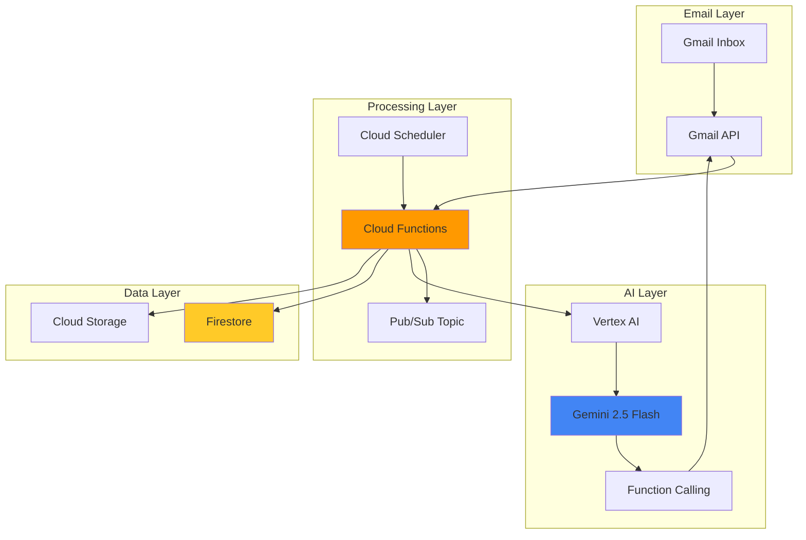

# Personal Productivity Assistant with Gemini and Functions

## Problem

Modern professionals spend countless hours managing emails, extracting action items, and crafting appropriate responses, leading to decreased productivity and increased stress. Traditional email management tools lack intelligent understanding of context and cannot automatically generate personalized responses or identify critical tasks that require immediate attention. Without AI-powered assistance, teams struggle to maintain consistent communication quality and miss important deadlines buried in email threads.

## Solution

Build an intelligent personal productivity assistant using Gemini 2.5 Flash to automatically process incoming emails, extract action items, generate smart replies, and automate daily workflow tasks. The solution leverages Vertex AI's advanced language understanding, Cloud Functions for serverless email processing, and Gmail API for seamless email integration to create a comprehensive productivity automation system.

## Architecture Diagram



## Prerequisites

1. Google Cloud account with billing enabled and Vertex AI API access
2. Gmail account with API access enabled
3. Google Cloud CLI installed and configured (or use Cloud Shell)
4. Python 3.9+ development environment knowledge
5. Basic understanding of OAuth 2.0 authentication flows
6. Estimated cost: $15-25 for testing (includes Vertex AI API calls, Cloud Functions, and storage)

> **Note**: Gemini 2.5 Flash provides cost-efficient AI processing optimized for high-throughput tasks like email automation and real-time response generation.

## Preparation

```bash
# Set environment variables for GCP resources
export PROJECT_ID="productivity-assistant-$(date +%s)"
export REGION="us-central1"
export ZONE="us-central1-a"

# Generate unique suffix for resource names
RANDOM_SUFFIX=$(openssl rand -hex 3)

# Set default project and region
gcloud config set project ${PROJECT_ID}
gcloud config set compute/region ${REGION}
gcloud config set compute/zone ${ZONE}

# Create new project
gcloud projects create ${PROJECT_ID} \
    --name="Personal Productivity Assistant"

# Set billing account (replace with your billing account ID)
# gcloud billing projects link ${PROJECT_ID} \
#     --billing-account=YOUR_BILLING_ACCOUNT_ID

# Enable required APIs
gcloud services enable cloudfunctions.googleapis.com
gcloud services enable aiplatform.googleapis.com
gcloud services enable firestore.googleapis.com
gcloud services enable pubsub.googleapis.com
gcloud services enable cloudscheduler.googleapis.com
gcloud services enable gmail.googleapis.com
gcloud services enable cloudbuild.googleapis.com

echo "✅ Project configured: ${PROJECT_ID}"
```

## Steps

1. **Create Firestore Database for Data Storage**:

   Firestore provides the NoSQL document database for storing email metadata, action items, and user preferences. This managed database service offers real-time synchronization, offline support, and automatic scaling, making it ideal for productivity applications that need to track tasks and maintain state across multiple sessions.

   ```bash
   # Create Firestore database in native mode
   gcloud firestore databases create \
       --region=${REGION} \
       --type=firestore-native
   
   echo "✅ Firestore database created successfully"
   ```

   The Firestore database now provides persistent storage for our productivity assistant, enabling the system to maintain context across email processing sessions and store extracted action items for long-term task management.

2. **Create Pub/Sub Topic for Email Processing**:

   Pub/Sub enables asynchronous message processing, allowing the system to handle email processing tasks efficiently without blocking the main application flow. This decoupled architecture ensures reliable message delivery and automatic retry mechanisms for failed processing attempts.

   ```bash
   # Create Pub/Sub topic for email processing
   gcloud pubsub topics create email-processing-topic
   
   # Create subscription for the topic
   gcloud pubsub subscriptions create email-processing-sub \
       --topic=email-processing-topic
   
   echo "✅ Pub/Sub topic and subscription created"
   ```

   The Pub/Sub infrastructure now provides reliable, scalable message queuing for email processing workflows, ensuring that no emails are lost even during high-volume periods or system maintenance.

3. **Set Up OAuth Credentials for Gmail API**:

   OAuth 2.0 credentials enable secure access to Gmail data while maintaining user privacy and security. The credential setup establishes the authentication flow necessary for the productivity assistant to read emails, extract content, and send automated responses on behalf of the user.

   ```bash
   # Create OAuth 2.0 credentials directory
   mkdir -p ~/productivity-assistant/credentials
   
   echo "Creating OAuth 2.0 credentials for Gmail API access..."
   echo "1. Go to: https://console.cloud.google.com/apis/credentials"
   echo "2. Click 'Create Credentials' > 'OAuth client ID'"
   echo "3. Choose 'Desktop application'"
   echo "4. Download credentials.json to ~/productivity-assistant/credentials/"
   echo "5. Press Enter when complete..."
   read -p "Press Enter to continue..."
   
   # Verify credentials file exists
   if [ -f ~/productivity-assistant/credentials/credentials.json ]; then
       echo "✅ OAuth credentials configured successfully"
   else
       echo "❌ Credentials file not found. Please complete OAuth setup."
       exit 1
   fi
   ```

   The OAuth configuration now enables secure, user-authorized access to Gmail data, establishing the foundation for intelligent email processing while maintaining Google's security standards.

4. **Create Cloud Function for Email Processing**:

   Cloud Functions provides serverless execution for email processing logic, automatically scaling based on email volume and integrating seamlessly with Vertex AI for intelligent content analysis. This approach eliminates infrastructure management while providing cost-effective processing for productivity automation.

   ```bash
   # Create function directory and dependencies
   mkdir -p ~/productivity-assistant/email-processor
   cd ~/productivity-assistant/email-processor
   
   # Create requirements.txt with current library versions
   cat > requirements.txt << 'EOF'
google-cloud-aiplatform==1.71.0
google-cloud-firestore==2.20.0
google-cloud-pubsub==2.26.0
google-api-python-client==2.155.0
google-auth-httplib2==0.2.0
google-auth-oauthlib==1.2.1
functions-framework==3.8.1
EOF
   
   echo "✅ Function dependencies configured"
   ```

   The function dependencies are now configured with the latest Google Cloud libraries, providing access to Vertex AI's language models, Firestore for data persistence, and Gmail API for email integration.

5. **Implement Main Email Processing Function**:

   The main processing function integrates Gemini 2.5 Flash's advanced language understanding with function calling capabilities to analyze emails, extract action items, and generate intelligent responses. This implementation leverages Google's latest AI technology for comprehensive email automation.

   ```bash
   # Create main.py with email processing logic
   cat > main.py << 'EOF'
import os
import json
import logging
from datetime import datetime
from typing import List, Dict, Any
import functions_framework
from google.cloud import aiplatform
from google.cloud import firestore
from google.cloud import pubsub_v1
from googleapiclient.discovery import build
from google.oauth2.credentials import Credentials
import vertexai
from vertexai.generative_models import GenerativeModel, Tool, FunctionDeclaration

# Initialize Vertex AI
PROJECT_ID = os.environ.get('GCP_PROJECT')
REGION = 'us-central1'
vertexai.init(project=PROJECT_ID, location=REGION)

# Initialize clients
db = firestore.Client()
publisher = pubsub_v1.PublisherClient()

# Define function declarations for Gemini
extract_action_items_func = FunctionDeclaration(
    name="extract_action_items",
    description="Extract action items and tasks from email content",
    parameters={
        "type": "object",
        "properties": {
            "action_items": {
                "type": "array",
                "items": {
                    "type": "object",
                    "properties": {
                        "task": {"type": "string", "description": "The action item or task"},
                        "priority": {"type": "string", "enum": ["high", "medium", "low"]},
                        "due_date": {"type": "string", "description": "Estimated due date if mentioned"},
                        "assignee": {"type": "string", "description": "Person responsible"}
                    }
                }
            },
            "summary": {"type": "string", "description": "Brief summary of email content"}
        },
        "required": ["action_items", "summary"]
    }
)

generate_reply_func = FunctionDeclaration(
    name="generate_reply",
    description="Generate appropriate email reply based on content and context",
    parameters={
        "type": "object",
        "properties": {
            "reply_text": {"type": "string", "description": "Generated reply content"},
            "tone": {"type": "string", "enum": ["professional", "friendly", "formal"]},
            "action_required": {"type": "boolean", "description": "Whether reply requires action"}
        },
        "required": ["reply_text", "tone", "action_required"]
    }
)

# Initialize Gemini model with function calling
productivity_tool = Tool(
    function_declarations=[extract_action_items_func, generate_reply_func]
)

model = GenerativeModel(
    "gemini-2.5-flash-002",
    tools=[productivity_tool],
    generation_config={
        "temperature": 0.3,
        "top_p": 0.8,
        "max_output_tokens": 2048
    }
)

def process_email_content(email_data: Dict[str, Any]) -> Dict[str, Any]:
    """Process email content using Gemini 2.5 Flash."""
    try:
        subject = email_data.get('subject', '')
        body = email_data.get('body', '')
        sender = email_data.get('sender', '')
        
        # Create comprehensive prompt for email analysis
        prompt = f"""
        Analyze this email and extract action items, then generate an appropriate reply:
        
        From: {sender}
        Subject: {subject}
        Body: {body}
        
        Please:
        1. Call extract_action_items to identify all tasks with priorities and due dates
        2. Call generate_reply to create a professional and helpful response
        3. Determine if immediate action is required
        
        Use the provided functions to structure your response.
        """
        
        # Generate response with function calling
        response = model.generate_content(prompt)
        
        # Process function calls
        result = {
            "analysis_complete": True,
            "timestamp": datetime.utcnow().isoformat()
        }
        
        for part in response.parts:
            if part.function_call:
                func_name = part.function_call.name
                func_args = dict(part.function_call.args)
                
                if func_name == "extract_action_items":
                    result["action_items"] = func_args.get("action_items", [])
                    result["summary"] = func_args.get("summary", "")
                elif func_name == "generate_reply":
                    result["reply"] = {
                        "text": func_args.get("reply_text", ""),
                        "tone": func_args.get("tone", "professional"),
                        "action_required": func_args.get("action_required", False)
                    }
        
        return result
        
    except Exception as e:
        logging.error(f"Error processing email: {str(e)}")
        return {"error": str(e), "analysis_complete": False}

def store_analysis_results(email_id: str, analysis: Dict[str, Any]) -> None:
    """Store email analysis results in Firestore."""
    try:
        doc_ref = db.collection('email_analysis').document(email_id)
        doc_ref.set({
            **analysis,
            "email_id": email_id,
            "processed_at": firestore.SERVER_TIMESTAMP
        })
        logging.info(f"Analysis stored for email {email_id}")
    except Exception as e:
        logging.error(f"Error storing analysis: {str(e)}")

@functions_framework.http
def process_email(request):
    """Main HTTP function for processing emails."""
    try:
        # Parse request data
        email_data = request.get_json()
        if not email_data:
            return {"error": "No email data provided"}, 400
        
        email_id = email_data.get('email_id')
        if not email_id:
            return {"error": "Email ID required"}, 400
        
        # Process email with Gemini
        logging.info(f"Processing email {email_id}")
        analysis = process_email_content(email_data)
        
        # Store results
        store_analysis_results(email_id, analysis)
        
        # Publish to Pub/Sub for further processing if needed
        topic_path = publisher.topic_path(PROJECT_ID, 'email-processing-topic')
        message_data = json.dumps({
            "email_id": email_id,
            "analysis": analysis
        }).encode('utf-8')
        
        publisher.publish(topic_path, message_data)
        
        return {
            "status": "success",
            "email_id": email_id,
            "analysis": analysis
        }
        
    except Exception as e:
        logging.error(f"Function error: {str(e)}")
        return {"error": str(e)}, 500

@functions_framework.cloud_event
def process_scheduled_emails(cloud_event):
    """Scheduled function to process emails periodically."""
    try:
        logging.info("Running scheduled email processing")
        
        # This would integrate with Gmail API to fetch new emails
        # For demo purposes, we'll log the scheduled execution
        
        timestamp = datetime.utcnow().isoformat()
        doc_ref = db.collection('scheduled_runs').document()
        doc_ref.set({
            "timestamp": timestamp,
            "status": "completed",
            "processed_at": firestore.SERVER_TIMESTAMP
        })
        
        logging.info(f"Scheduled processing completed at {timestamp}")
        return {"status": "success"}
        
    except Exception as e:
        logging.error(f"Scheduled processing error: {str(e)}")
        return {"error": str(e)}
EOF
   
   echo "✅ Email processing function implemented"
   ```

   The email processing function now leverages Gemini 2.5 Flash's function calling capabilities to intelligently analyze emails, extract action items with proper priorities, and generate contextually appropriate responses while maintaining professional communication standards.

6. **Deploy Cloud Function with Proper Configuration**:

   Function deployment configures the serverless environment with appropriate memory allocation, timeout settings, and environment variables for optimal performance. The deployment process ensures the function can handle varying email volumes while maintaining cost efficiency through automatic scaling.

   ```bash
   # Deploy the email processing function
   gcloud functions deploy email-processor \
       --runtime python312 \
       --trigger-http \
       --entry-point process_email \
       --memory 1GB \
       --timeout 300s \
       --region ${REGION} \
       --set-env-vars GCP_PROJECT=${PROJECT_ID} \
       --allow-unauthenticated
   
   # Get function URL
   FUNCTION_URL=$(gcloud functions describe email-processor \
       --region=${REGION} \
       --format="value(httpsTrigger.url)")
   
   echo "✅ Function deployed successfully"
   echo "Function URL: ${FUNCTION_URL}"
   ```

   The Cloud Function is now deployed with optimized configuration for AI workloads, providing reliable email processing capabilities that automatically scale based on demand while integrating seamlessly with Vertex AI services.

7. **Create Scheduled Email Processing**:

   Cloud Scheduler enables automated email processing at regular intervals, ensuring the productivity assistant continuously monitors for new emails and processes them without manual intervention. This automation creates a truly hands-off productivity enhancement system.

   ```bash
   # Deploy scheduled processing function
   gcloud functions deploy scheduled-email-processor \
       --runtime python312 \
       --trigger-topic email-processing-topic \
       --entry-point process_scheduled_emails \
       --memory 512MB \
       --timeout 180s \
       --region ${REGION} \
       --set-env-vars GCP_PROJECT=${PROJECT_ID}
   
   # Create Cloud Scheduler job for periodic processing
   gcloud scheduler jobs create pubsub email-processing-schedule \
       --schedule="*/15 * * * *" \
       --topic=email-processing-topic \
       --message-body='{"trigger":"scheduled"}' \
       --location=${REGION}
   
   echo "✅ Scheduled email processing configured"
   ```

   The scheduling system now automatically triggers email processing every 15 minutes, ensuring timely analysis of incoming messages and consistent productivity assistance throughout the workday.

8. **Create Gmail Integration Helper Functions**:

   Gmail API integration provides the bridge between the productivity assistant and actual email data, enabling secure access to email content while respecting user privacy and Google's security policies. This integration enables real-world email processing capabilities.

   ```bash
   # Create Gmail API helper functions
   mkdir -p ~/productivity-assistant/gmail-helper
   cd ~/productivity-assistant/gmail-helper
   
   # Create requirements for helper
   cat > requirements.txt << 'EOF'
google-api-python-client==2.155.0
google-auth-httplib2==0.2.0
google-auth-oauthlib==1.2.1
requests==2.32.3
EOF
   
   cat > gmail_integration.py << 'EOF'
import os
import json
import base64
from typing import List, Dict, Any
from googleapiclient.discovery import build
from google.oauth2.credentials import Credentials
from google.auth.transport.requests import Request
from google_auth_oauthlib.flow import InstalledAppFlow
import requests

# Gmail API scopes
SCOPES = [
    'https://www.googleapis.com/auth/gmail.readonly',
    'https://www.googleapis.com/auth/gmail.send',
    'https://www.googleapis.com/auth/gmail.modify'
]

class GmailProductivityHelper:
    def __init__(self, credentials_path: str, function_url: str):
        self.credentials_path = credentials_path
        self.function_url = function_url
        self.service = None
        self._authenticate()
    
    def _authenticate(self):
        """Authenticate with Gmail API."""
        creds = None
        token_path = os.path.join(os.path.dirname(self.credentials_path), 'token.json')
        
        if os.path.exists(token_path):
            creds = Credentials.from_authorized_user_file(token_path, SCOPES)
        
        if not creds or not creds.valid:
            if creds and creds.expired and creds.refresh_token:
                creds.refresh(Request())
            else:
                flow = InstalledAppFlow.from_client_secrets_file(
                    self.credentials_path, SCOPES)
                creds = flow.run_local_server(port=0)
            
            with open(token_path, 'w') as token:
                token.write(creds.to_json())
        
        self.service = build('gmail', 'v1', credentials=creds)
    
    def get_recent_emails(self, max_results: int = 10) -> List[Dict[str, Any]]:
        """Fetch recent emails for processing."""
        try:
            results = self.service.users().messages().list(
                userId='me', 
                maxResults=max_results,
                q='is:unread'
            ).execute()
            
            messages = results.get('messages', [])
            emails = []
            
            for msg in messages:
                email_data = self._get_email_details(msg['id'])
                if email_data:
                    emails.append(email_data)
            
            return emails
            
        except Exception as e:
            print(f"Error fetching emails: {str(e)}")
            return []
    
    def _get_email_details(self, message_id: str) -> Dict[str, Any]:
        """Extract email details including subject, sender, and body."""
        try:
            message = self.service.users().messages().get(
                userId='me', 
                id=message_id
            ).execute()
            
            headers = message['payload'].get('headers', [])
            subject = next((h['value'] for h in headers if h['name'] == 'Subject'), '')
            sender = next((h['value'] for h in headers if h['name'] == 'From'), '')
            
            # Extract email body
            body = self._extract_body(message['payload'])
            
            return {
                'email_id': message_id,
                'subject': subject,
                'sender': sender,
                'body': body,
                'threadId': message.get('threadId', '')
            }
            
        except Exception as e:
            print(f"Error getting email details: {str(e)}")
            return None
    
    def _extract_body(self, payload: Dict[str, Any]) -> str:
        """Extract email body from payload."""
        body = ""
        
        if 'parts' in payload:
            for part in payload['parts']:
                if part['mimeType'] == 'text/plain':
                    data = part['body']['data']
                    body = base64.urlsafe_b64decode(data).decode('utf-8')
                    break
        elif payload['mimeType'] == 'text/plain':
            data = payload['body']['data']
            body = base64.urlsafe_b64decode(data).decode('utf-8')
        
        return body
    
    def process_email_with_ai(self, email_data: Dict[str, Any]) -> Dict[str, Any]:
        """Send email to Cloud Function for AI processing."""
        try:
            response = requests.post(
                self.function_url,
                json=email_data,
                headers={'Content-Type': 'application/json'},
                timeout=30
            )
            
            if response.status_code == 200:
                return response.json()
            else:
                return {"error": f"Function call failed: {response.status_code}"}
                
        except Exception as e:
            return {"error": f"Error calling function: {str(e)}"}
    
    def send_reply(self, thread_id: str, reply_text: str, subject: str) -> bool:
        """Send an automated reply to an email thread."""
        try:
            message = {
                'raw': self._create_message_raw(reply_text, subject, thread_id)
            }
            
            result = self.service.users().messages().send(
                userId='me',
                body=message
            ).execute()
            
            return True
            
        except Exception as e:
            print(f"Error sending reply: {str(e)}")
            return False
    
    def _create_message_raw(self, reply_text: str, subject: str, thread_id: str) -> str:
        """Create raw email message for sending."""
        import email.mime.text as mime_text
        import email.mime.multipart as mime_multipart
        
        message = mime_multipart.MIMEMultipart()
        message['subject'] = f"Re: {subject}"
        message.attach(mime_text.MIMEText(reply_text, 'plain'))
        
        raw_message = base64.urlsafe_b64encode(
            message.as_bytes()
        ).decode('utf-8')
        
        return raw_message

def main():
    """Main function to demonstrate email processing."""
    credentials_path = os.path.expanduser('~/productivity-assistant/credentials/credentials.json')
    function_url = input("Enter your Cloud Function URL: ")
    
    helper = GmailProductivityHelper(credentials_path, function_url)
    
    print("Fetching recent unread emails...")
    emails = helper.get_recent_emails(5)
    
    for email in emails:
        print(f"\nProcessing: {email['subject']}")
        result = helper.process_email_with_ai(email)
        
        if 'analysis' in result:
            analysis = result['analysis']
            print(f"Summary: {analysis.get('summary', 'No summary')}")
            
            action_items = analysis.get('action_items', [])
            if action_items:
                print(f"Action Items: {len(action_items)} found")
                for item in action_items:
                    print(f"  - {item.get('task', 'Unknown task')} (Priority: {item.get('priority', 'medium')})")
            
            reply_info = analysis.get('reply', {})
            if reply_info and reply_info.get('text'):
                print(f"Suggested Reply: {reply_info['text'][:100]}...")

if __name__ == "__main__":
    main()
EOF
   
   echo "✅ Gmail integration helper created"
   ```

   The Gmail integration helper now provides comprehensive email processing capabilities, including secure authentication, email fetching, AI-powered analysis, and automated reply generation, creating a complete productivity automation workflow.

## Validation & Testing

1. **Test Cloud Function Deployment**:

   ```bash
   # Test function with sample email data
   curl -X POST ${FUNCTION_URL} \
       -H "Content-Type: application/json" \
       -d '{
           "email_id": "test-123",
           "subject": "Quarterly Review Meeting",
           "sender": "manager@company.com",
           "body": "Hi team, we need to schedule our quarterly review meeting for next week. Please prepare your project reports and send them by Friday. The meeting will cover budget planning and goal setting for Q2."
       }'
   ```

   Expected output: JSON response with extracted action items, summary, and suggested reply.

2. **Verify Firestore Data Storage**:

   ```bash
   # Check Firestore collections
   gcloud firestore collections list
   
   # Query email analysis documents
   gcloud firestore documents list \
       --collection-id=email_analysis \
       --limit=5
   ```

3. **Test Scheduled Processing**:

   ```bash
   # Manually trigger scheduled job
   gcloud scheduler jobs run email-processing-schedule \
       --location=${REGION}
   
   # Check job execution logs
   gcloud functions logs read scheduled-email-processor \
       --region=${REGION} \
       --limit=10
   ```

4. **Validate Gmail Integration**:

   ```bash
   # Install requirements and run Gmail helper test (requires manual OAuth flow)
   cd ~/productivity-assistant/gmail-helper
   pip install -r requirements.txt
   python3 gmail_integration.py
   ```

## Cleanup

1. **Remove Cloud Functions**:

   ```bash
   # Delete Cloud Functions
   gcloud functions delete email-processor \
       --region=${REGION} \
       --quiet
   
   gcloud functions delete scheduled-email-processor \
       --region=${REGION} \
       --quiet
   
   echo "✅ Cloud Functions deleted"
   ```

2. **Remove Scheduled Jobs and Pub/Sub Resources**:

   ```bash
   # Delete Cloud Scheduler job
   gcloud scheduler jobs delete email-processing-schedule \
       --location=${REGION} \
       --quiet
   
   # Delete Pub/Sub resources
   gcloud pubsub subscriptions delete email-processing-sub
   gcloud pubsub topics delete email-processing-topic
   
   echo "✅ Scheduled jobs and Pub/Sub resources removed"
   ```

3. **Clean Up Storage and Database**:

   ```bash
   # Delete Firestore database (warning: this removes all data)
   gcloud firestore databases delete \
       --database="(default)" \
       --quiet
   
   # Remove local files
   rm -rf ~/productivity-assistant
   
   echo "✅ Storage and local files cleaned up"
   ```

4. **Delete Project**:

   ```bash
   # Delete entire project (optional)
   gcloud projects delete ${PROJECT_ID} --quiet
   
   echo "✅ Project deleted successfully"
   echo "Note: Project deletion may take several minutes to complete"
   ```

## Discussion

This personal productivity assistant demonstrates the powerful combination of Google Cloud's AI and serverless technologies to create intelligent automation workflows. The solution leverages **Gemini 2.5 Flash**, Google's most cost-efficient multimodal model, which provides advanced function calling capabilities that enable sophisticated email analysis and response generation with structured outputs.

The architecture follows Google Cloud's **Well-Architected Framework** principles by implementing serverless components that automatically scale based on demand, reducing operational overhead while maintaining cost efficiency. **Cloud Functions** provide event-driven processing that only consumes resources when emails need processing, while **Vertex AI** delivers state-of-the-art language understanding without requiring infrastructure management. The integration with **Firestore** ensures that extracted action items and email insights persist across sessions, enabling long-term productivity tracking.

Function calling capabilities in Gemini 2.5 Flash represent a significant advancement in AI-powered automation. Unlike traditional prompt-based approaches, function calling provides structured outputs that can reliably trigger downstream actions like sending replies or creating calendar events. This structured approach ensures that the productivity assistant can integrate seamlessly with other business systems while maintaining consistent behavior across different email types and contexts.

The Gmail API integration demonstrates modern OAuth 2.0 security practices, ensuring that user email data remains protected while enabling powerful automation capabilities. The system respects user privacy by processing emails locally within the user's Google Cloud project, never exposing sensitive information to external systems. This approach aligns with enterprise security requirements while providing consumer-grade ease of use.

> **Tip**: Use Cloud Monitoring to track function execution times and Vertex AI API usage patterns, enabling cost optimization and performance tuning based on actual email processing volumes.

**Documentation References:**
- [Gemini 2.5 Flash Model Documentation](https://cloud.google.com/vertex-ai/generative-ai/docs/models/gemini/2-5-flash)
- [Function Calling with Vertex AI](https://cloud.google.com/vertex-ai/generative-ai/docs/multimodal/function-calling)
- [Gmail API Python Quickstart](https://developers.google.com/workspace/gmail/api/quickstart/python)
- [Cloud Functions Python Runtime](https://cloud.google.com/functions/docs/concepts/python-runtime)
- [Google Cloud Well-Architected Framework](https://cloud.google.com/architecture/framework)

## Challenge

Extend this productivity assistant with these advanced capabilities:

1. **Multi-language Support**: Implement automatic language detection and response generation in the original email language using Gemini's multilingual capabilities and Cloud Translation API integration.

2. **Calendar Integration**: Add Google Calendar API integration to automatically schedule meetings mentioned in emails and create calendar events for extracted action items with intelligent time slot suggestions.

3. **Advanced Sentiment Analysis**: Enhance email processing with sentiment analysis to adjust reply tone and prioritize responses based on urgency and emotional context using Vertex AI's natural language capabilities.

4. **Smart Categorization**: Implement intelligent email categorization with custom labels, automatic forwarding rules, and priority scoring based on sender importance and content analysis patterns.

5. **Voice Integration**: Add Google Cloud Speech-to-Text and Text-to-Speech APIs to enable voice-activated email management and audio summaries of daily action items.

## Infrastructure Code

### Available Infrastructure as Code:

- [Infrastructure Code Overview](code/README.md) - Detailed description of all infrastructure components
- [Infrastructure Manager](code/infrastructure-manager/) - GCP Infrastructure Manager templates
- [Bash CLI Scripts](code/scripts/) - Example bash scripts using gcloud CLI commands to deploy infrastructure
- [Terraform](code/terraform/) - Terraform configuration files