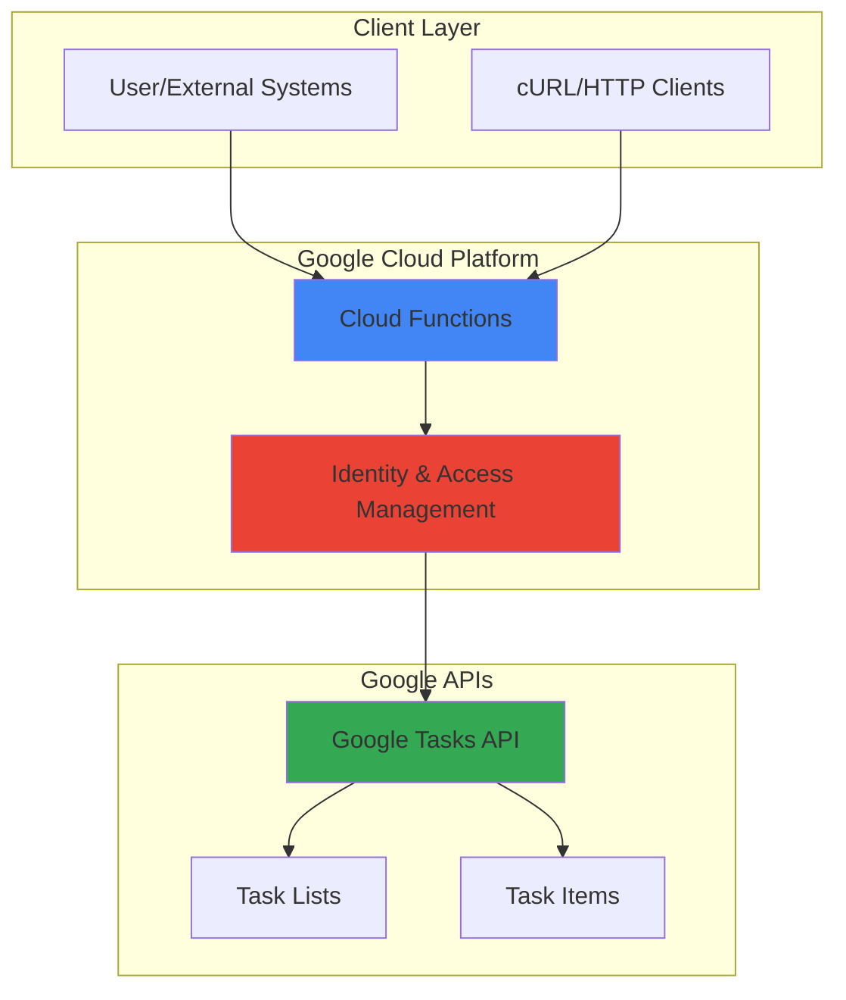

# Personal Task Manager with Cloud Functions and Google Tasks

## Problem

Many professionals struggle with scattered task management across different platforms, leading to missed deadlines and decreased productivity. Manual task creation and management become overwhelming when dealing with multiple projects, especially when trying to integrate productivity workflows with automated systems that could streamline task creation from external triggers.

## Solution

Build a serverless REST API using Google Cloud Functions that integrates with Google Tasks API to provide centralized task management capabilities. The solution enables automated task creation, reading, and management through HTTP endpoints, allowing integration with existing productivity workflows while leveraging Google's reliable task synchronization across devices.

## Architecture Diagram



## Prerequisites

1. Google Cloud Platform account with billing enabled
2. Google Cloud CLI (gcloud) installed and configured
3. Basic knowledge of Python and REST APIs
4. Google Tasks API enabled in your project
5. Estimated cost: $0.01-$0.10 per month for light usage (Cloud Functions free tier covers most development usage)

> **Note**: Google Tasks API has generous free quotas suitable for personal task management applications.

## Preparation

```bash
# Set environment variables for GCP resources
export PROJECT_ID="task-manager-$(date +%s)"
export REGION="us-central1"
export FUNCTION_NAME="task-manager"

# Generate unique suffix for resource names
RANDOM_SUFFIX=$(openssl rand -hex 3)

# Create new project and set as active
gcloud projects create ${PROJECT_ID} \
    --name="Personal Task Manager"
gcloud config set project ${PROJECT_ID}
gcloud config set compute/region ${REGION}

# Enable required APIs
gcloud services enable cloudfunctions.googleapis.com
gcloud services enable tasks.googleapis.com
gcloud services enable cloudbuild.googleapis.com

echo "✅ Project configured: ${PROJECT_ID}"
```

## Steps

1. **Create Project Directory and Dependencies**:

   Google Cloud Functions require a structured project with proper dependencies defined. The Google API Python Client library provides the interface to Google Tasks API, while the Functions Framework handles HTTP request routing in the serverless environment.

   ```bash
   # Create project directory
   mkdir task-manager-function
   cd task-manager-function
   
   # Create requirements.txt for Python dependencies
   cat > requirements.txt << 'EOF'
   google-api-python-client==2.150.0
   google-auth==2.35.0
   google-auth-httplib2==0.2.0
   functions-framework==3.8.1
   EOF
   
   echo "✅ Project structure created with dependencies"
   ```

2. **Create Service Account and Credentials**:

   Service accounts provide secure, programmatic access to Google APIs without requiring user interaction. This approach is ideal for serverless functions that need to access Google Tasks API on behalf of the application, following Google Cloud's principle of least privilege for security.

   ```bash
   # Create service account for the function
   gcloud iam service-accounts create task-manager-sa \
       --display-name="Task Manager Service Account" \
       --description="Service account for accessing Google Tasks API"
   
   # Download service account key
   gcloud iam service-accounts keys create credentials.json \
       --iam-account=task-manager-sa@${PROJECT_ID}.iam.gserviceaccount.com
   
   echo "✅ Service account created with credentials"
   ```

3. **Create the Cloud Function Code**:

   The main function implements REST API endpoints for task management operations. This serverless approach automatically scales based on request volume and provides built-in error handling and logging through Google Cloud's infrastructure.

   ```bash
   # Create main.py with the function code
   cat > main.py << 'EOF'
   import json
   import os
   import functions_framework
   from googleapiclient.discovery import build
   from google.oauth2 import service_account
   from flask import jsonify
   
   # Initialize credentials and service
   SCOPES = ['https://www.googleapis.com/auth/tasks']
   
   def get_tasks_service():
       """Initialize Google Tasks API service with credentials."""
       credentials = service_account.Credentials.from_service_account_file(
           'credentials.json',
           scopes=SCOPES
       )
       return build('tasks', 'v1', credentials=credentials)
   
   @functions_framework.http
   def task_manager(request):
       """HTTP Cloud Function for managing Google Tasks."""
       
       # Enable CORS for web clients
       if request.method == 'OPTIONS':
           headers = {
               'Access-Control-Allow-Origin': '*',
               'Access-Control-Allow-Methods': 'GET, POST, DELETE',
               'Access-Control-Allow-Headers': 'Content-Type',
           }
           return ('', 204, headers)
       
       headers = {'Access-Control-Allow-Origin': '*'}
       
       try:
           service = get_tasks_service()
           
           if request.method == 'GET' and request.path == '/tasks':
               # List all tasks from default task list
               task_lists = service.tasklists().list().execute()
               if not task_lists.get('items'):
                   return jsonify({'error': 'No task lists found'}), 404
               
               default_list = task_lists['items'][0]['id']
               tasks = service.tasks().list(tasklist=default_list).execute()
               return jsonify(tasks.get('items', [])), 200, headers
           
           elif request.method == 'POST' and request.path == '/tasks':
               # Create a new task
               request_json = request.get_json(silent=True)
               if not request_json or 'title' not in request_json:
                   return jsonify({'error': 'Task title is required'}), 400
               
               task_lists = service.tasklists().list().execute()
               if not task_lists.get('items'):
                   return jsonify({'error': 'No task lists found'}), 404
               
               default_list = task_lists['items'][0]['id']
               task = {
                   'title': request_json['title'],
                   'notes': request_json.get('notes', '')
               }
               
               result = service.tasks().insert(
                   tasklist=default_list, 
                   body=task
               ).execute()
               return jsonify(result), 201, headers
           
           elif request.method == 'DELETE' and '/tasks/' in request.path:
               # Delete a specific task
               task_id = request.path.split('/tasks/')[-1]
               if not task_id:
                   return jsonify({'error': 'Task ID is required'}), 400
               
               task_lists = service.tasklists().list().execute()
               if not task_lists.get('items'):
                   return jsonify({'error': 'No task lists found'}), 404
               
               default_list = task_lists['items'][0]['id']
               service.tasks().delete(
                   tasklist=default_list, 
                   task=task_id
               ).execute()
               return jsonify({'message': 'Task deleted successfully'}), 200, headers
           
           else:
               return jsonify({'error': 'Endpoint not found'}), 404, headers
               
       except Exception as e:
           return jsonify({'error': str(e)}), 500, headers
   EOF
   
   echo "✅ Cloud Function code created"
   ```

4. **Configure Authentication Permissions**:

   Proper IAM configuration ensures the service account has the necessary permissions to access Google Tasks API while following the principle of least privilege for security. Google Tasks API uses OAuth 2.0 for authentication.

   ```bash
   # Verify service account exists and is properly configured
   gcloud iam service-accounts describe \
       task-manager-sa@${PROJECT_ID}.iam.gserviceaccount.com
   
   # Note: Google Tasks API doesn't require specific IAM roles
   # The service account just needs to be authenticated with proper scopes
   
   echo "✅ Service account permissions configured"
   ```

5. **Deploy the Cloud Function**:

   Cloud Functions deployment automatically handles containerization, scaling configuration, and endpoint provisioning. The serverless platform manages all infrastructure concerns while providing integrated monitoring and logging capabilities.

   ```bash
   # Deploy the function with appropriate settings
   gcloud functions deploy ${FUNCTION_NAME} \
       --runtime python312 \
       --trigger-http \
       --allow-unauthenticated \
       --entry-point task_manager \
       --source . \
       --memory 256MB \
       --timeout 60s \
       --region ${REGION}
   
   # Get the function URL
   FUNCTION_URL=$(gcloud functions describe ${FUNCTION_NAME} \
       --region=${REGION} \
       --format="value(httpsTrigger.url)")
   
   echo "✅ Cloud Function deployed successfully"
   echo "Function URL: ${FUNCTION_URL}"
   ```

6. **Test Task Creation**:

   Verify the API functionality by creating a sample task. This validates both the authentication flow and the integration with Google Tasks API through the serverless function, ensuring the complete workflow operates correctly.

   ```bash
   # Create a sample task
   curl -X POST "${FUNCTION_URL}/tasks" \
       -H "Content-Type: application/json" \
       -d '{
           "title": "Test serverless task management",
           "notes": "Created via Cloud Functions API"
       }'
   
   echo "✅ Sample task created successfully"
   ```

7. **Verify Task Listing**:

   Test the read functionality to ensure tasks can be retrieved through the API. This confirms the complete CRUD workflow is operational within the serverless architecture and validates proper Google Tasks API integration.

   ```bash
   # List all tasks to verify creation
   curl -X GET "${FUNCTION_URL}/tasks" \
       -H "Content-Type: application/json"
   
   echo "✅ Task listing functionality verified"
   ```

## Validation & Testing

1. **Verify Cloud Function deployment**:

   ```bash
   # Check function status and configuration
   gcloud functions describe ${FUNCTION_NAME} \
       --region=${REGION} \
       --format="table(name,status,httpsTrigger.url)"
   ```

   Expected output: Function should show status as "ACTIVE" with an HTTPS URL.

2. **Test complete CRUD operations**:

   ```bash
   # Test task creation with different data
   curl -X POST "${FUNCTION_URL}/tasks" \
       -H "Content-Type: application/json" \
       -d '{
           "title": "Review Cloud Functions logs",
           "notes": "Check for any errors or performance issues"
       }'
   
   # Verify task appears in list
   TASK_RESPONSE=$(curl -s -X GET "${FUNCTION_URL}/tasks")
   echo "Tasks retrieved: $(echo $TASK_RESPONSE | jq length)"
   ```

3. **Test error handling**:

   ```bash
   # Test invalid request (missing title)
   curl -X POST "${FUNCTION_URL}/tasks" \
       -H "Content-Type: application/json" \
       -d '{"notes": "Task without title"}'
   ```

   Expected output: Should return 400 error with message about required title.

## Cleanup

1. **Delete Cloud Function**:

   ```bash
   # Remove the deployed function
   gcloud functions delete ${FUNCTION_NAME} \
       --region=${REGION} \
       --quiet
   
   echo "✅ Cloud Function deleted"
   ```

2. **Remove Service Account**:

   ```bash
   # Delete service account and its keys
   gcloud iam service-accounts delete \
       task-manager-sa@${PROJECT_ID}.iam.gserviceaccount.com \
       --quiet
   
   echo "✅ Service account removed"
   ```

3. **Clean up local files**:

   ```bash
   # Remove project directory and credentials
   cd ..
   rm -rf task-manager-function
   rm -f credentials.json
   
   echo "✅ Local files cleaned up"
   ```

4. **Delete project (optional)**:

   ```bash
   # Delete entire project if created specifically for this recipe
   gcloud projects delete ${PROJECT_ID} --quiet
   
   echo "✅ Project deleted (this may take several minutes)"
   ```

## Discussion

This serverless task management solution demonstrates the power of combining Google Cloud Functions with Google Workspace APIs to create productivity-focused applications. Cloud Functions provides an ideal serverless platform for API integrations because it automatically handles scaling, reduces operational overhead, and offers pay-per-invocation pricing that makes it cost-effective for personal productivity tools.

The integration with Google Tasks API leverages Google's robust task synchronization infrastructure, ensuring tasks created through this API are immediately available across all Google Tasks clients, including mobile apps and web interfaces. This creates a seamless experience where automated task creation complements manual task management. The service account authentication pattern used here is particularly suitable for server-to-server integrations, providing secure access without requiring user intervention for each API call.

The serverless architecture offers several advantages for this use case: automatic scaling handles varying request volumes, built-in monitoring and logging facilitate troubleshooting, and the stateless nature ensures reliable operation. The updated Python 3.12 runtime provides improved performance, better security features, and enhanced compatibility with modern Python libraries. However, developers should be aware of cold start latency for infrequently accessed functions and consider implementing connection pooling or persistent connections for high-frequency usage patterns.

From a security perspective, this implementation follows Google Cloud best practices by using service accounts with minimal necessary permissions, enabling CORS for web client compatibility while maintaining API security, and avoiding hardcoded credentials through Google Cloud's native authentication mechanisms. For production deployments, consider implementing additional security measures such as API key validation, rate limiting, and request validation middleware.

**Documentation Sources:**
- [Google Cloud Functions Documentation](https://cloud.google.com/functions/docs)
- [Google Tasks API Reference](https://developers.google.com/tasks/reference/rest)
- [Google API Python Client Library](https://github.com/googleapis/google-api-python-client)
- [Google Cloud Authentication Best Practices](https://cloud.google.com/docs/authentication/best-practices)
- [Serverless Application Security](https://cloud.google.com/security/best-practices)

> **Tip**: Use Cloud Monitoring to track function invocations and optimize performance based on actual usage patterns and response times.

## Challenge

Extend this solution by implementing these enhancements:

1. **Multi-list support**: Modify the API to handle multiple task lists, allowing users to organize tasks by project or category with endpoints like `/lists/{listId}/tasks`.

2. **Task scheduling**: Add support for due dates and reminders by integrating with Google Calendar API to create calendar events for important tasks.

3. **Webhook notifications**: Implement Cloud Pub/Sub integration to send notifications when tasks are created, completed, or approach their due dates.

4. **Authentication and user management**: Replace service account authentication with OAuth 2.0 to support multiple users, each managing their own tasks securely.

5. **Advanced search and filtering**: Add query parameters for filtering tasks by status, due date, or content, implementing full-text search capabilities using Google Cloud Search APIs.

## Infrastructure Code

### Available Infrastructure as Code:

- [Infrastructure Code Overview](code/README.md) - Detailed description of all infrastructure components
- [Infrastructure Manager](code/infrastructure-manager/) - GCP Infrastructure Manager templates
- [Bash CLI Scripts](code/scripts/) - Example bash scripts using gcloud CLI commands to deploy infrastructure
- [Terraform](code/terraform/) - Terraform configuration files