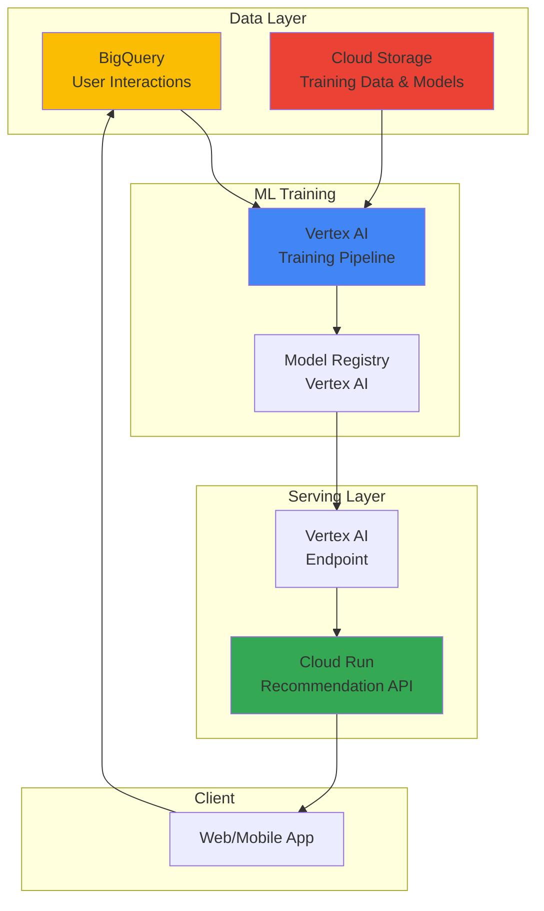

# Personalized Recommendation APIs with Vertex AI and Cloud Run

## Problem

E-commerce platforms and content streaming services struggle to provide real-time personalized recommendations that adapt to user behavior patterns and preferences at scale. Traditional recommendation systems often rely on batch processing that leads to stale recommendations, cannot handle sudden traffic spikes during peak shopping periods, and require complex infrastructure management for model serving and data pipeline orchestration.

## Solution

Create a serverless recommendation engine using Vertex AI for machine learning model training and inference, Cloud Run for scalable API serving, and Cloud Storage for data management. This architecture provides real-time personalization capabilities with automatic scaling, managed infrastructure, and seamless integration between training pipelines and serving endpoints while maintaining cost efficiency through pay-per-use pricing.

## Architecture Diagram



## Prerequisites

1. Google Cloud account with billing enabled and appropriate permissions for Vertex AI, Cloud Run, Cloud Storage, and BigQuery
2. gcloud CLI v2 installed and configured (or Google Cloud Shell)
3. Basic understanding of machine learning concepts, API development, and containerization
4. Python programming knowledge for model training and API development
5. Estimated cost: $50-100 for training and serving resources during this tutorial

> **Note**: This recipe uses Google Cloud's managed AI services, following the [Google Cloud Architecture Framework](https://cloud.google.com/architecture/framework) principles for scalable and cost-effective machine learning solutions.

## Preparation

```bash
# Set environment variables for consistent resource naming
export PROJECT_ID="recommendation-demo-$(date +%s)"
export REGION="us-central1"
export ZONE="us-central1-a"
export BUCKET_NAME="rec-system-data-${PROJECT_ID}"
export SERVICE_NAME="recommendation-api"
export MODEL_NAME="product-recommendations"

# Generate unique suffix for resources
RANDOM_SUFFIX=$(openssl rand -hex 3)
export ENDPOINT_NAME="rec-endpoint-${RANDOM_SUFFIX}"

# Create a new project for this demo
gcloud projects create ${PROJECT_ID} \
    --name="Recommendation System Demo"

# Set the project as default
gcloud config set project ${PROJECT_ID}
gcloud config set compute/region ${REGION}
gcloud config set compute/zone ${ZONE}

# Enable required Google Cloud APIs
gcloud services enable aiplatform.googleapis.com
gcloud services enable run.googleapis.com
gcloud services enable storage.googleapis.com
gcloud services enable bigquery.googleapis.com
gcloud services enable cloudbuild.googleapis.com

echo "✅ Project ${PROJECT_ID} configured with required APIs"
```

## Steps

1. **Create Cloud Storage Bucket for Data Management**:

   Cloud Storage provides the foundation for our recommendation system's data architecture, offering unified object storage with global edge caching and strong consistency guarantees. This bucket will store training datasets, model artifacts, and feature data while supporting the entire machine learning lifecycle from data ingestion through model deployment.

   ```bash
   # Create bucket with appropriate settings for ML workloads
   gsutil mb -p ${PROJECT_ID} \
       -c STANDARD \
       -l ${REGION} \
       gs://${BUCKET_NAME}
   
   # Enable versioning for data protection and model lineage
   gsutil versioning set on gs://${BUCKET_NAME}
   
   # Create organized folder structure for ML artifacts
   gsutil cp /dev/null gs://${BUCKET_NAME}/data/raw/.keep
   gsutil cp /dev/null gs://${BUCKET_NAME}/data/processed/.keep
   gsutil cp /dev/null gs://${BUCKET_NAME}/models/.keep
   gsutil cp /dev/null gs://${BUCKET_NAME}/features/.keep
   
   echo "✅ Cloud Storage bucket created with ML-optimized structure"
   ```

   The storage infrastructure is now established with versioning enabled for data lineage tracking and organized directories that follow machine learning best practices. This foundation supports both batch training workflows and real-time feature serving while Google's global infrastructure ensures low-latency access worldwide.

2. **Create BigQuery Dataset for User Interaction Data**:

   BigQuery serves as our data warehouse for storing and analyzing user interaction patterns, providing serverless analytics capabilities that scale automatically with query complexity. The columnar storage format optimizes analytical queries for recommendation model training while supporting real-time data ingestion from user applications.

   ```bash
   # Create BigQuery dataset for user interactions
   bq mk --dataset \
       --location=${REGION} \
       --description="User interaction data for recommendation system" \
       ${PROJECT_ID}:user_interactions
   
   # Create table for user behavior tracking
   bq mk --table \
       ${PROJECT_ID}:user_interactions.interactions \
       user_id:STRING,item_id:STRING,interaction_type:STRING,rating:FLOAT,timestamp:TIMESTAMP,category:STRING,features:JSON
   
   echo "✅ BigQuery dataset and interaction table created"
   ```

   The BigQuery infrastructure now provides a scalable foundation for storing user interaction data with schema designed for recommendation algorithms. This serverless data warehouse automatically handles query optimization and supports both batch analytics for model training and real-time lookups for personalization features.

3. **Generate Sample Training Data**:

   Creating representative training data is crucial for building effective recommendation models. This synthetic dataset simulates realistic user behavior patterns including viewing, purchasing, and rating activities across different product categories, providing the foundation for collaborative filtering and content-based recommendation algorithms.

   ```bash
   # Create Python script to generate sample recommendation data
   cat > generate_sample_data.py << 'EOF'
   import json
   import random
   import pandas as pd
   from datetime import datetime, timedelta
   
   # Generate synthetic user interaction data
   def generate_interactions(num_users=1000, num_items=500, num_interactions=10000):
       interactions = []
       
       for _ in range(num_interactions):
           user_id = f"user_{random.randint(1, num_users)}"
           item_id = f"item_{random.randint(1, num_items)}"
           interaction_type = random.choice(['view', 'purchase', 'rating', 'cart_add'])
           rating = round(random.uniform(1.0, 5.0), 1) if interaction_type == 'rating' else None
           timestamp = datetime.now() - timedelta(days=random.randint(0, 365))
           category = random.choice(['electronics', 'books', 'clothing', 'home', 'sports'])
           
           features = {
               'device_type': random.choice(['mobile', 'desktop', 'tablet']),
               'session_duration': random.randint(30, 3600),
               'page_views': random.randint(1, 20)
           }
           
           interactions.append({
               'user_id': user_id,
               'item_id': item_id,
               'interaction_type': interaction_type,
               'rating': rating,
               'timestamp': timestamp.isoformat(),
               'category': category,
               'features': json.dumps(features)
           })
       
       return pd.DataFrame(interactions)
   
   # Generate and save training data
   df = generate_interactions()
   df.to_csv('training_data.csv', index=False)
   print(f"Generated {len(df)} training samples")
   EOF
   
   # Run data generation script
   python3 generate_sample_data.py
   
   # Upload training data to Cloud Storage
   gsutil cp training_data.csv gs://${BUCKET_NAME}/data/raw/
   
   echo "✅ Sample training data generated and uploaded"
   ```

   The synthetic dataset now provides realistic user interaction patterns that mirror real-world e-commerce behavior. This training data includes temporal patterns, multi-category interactions, and rich feature sets that enable the development of sophisticated recommendation algorithms using both collaborative filtering and content-based approaches.

4. **Create Vertex AI Training Pipeline**:

   Vertex AI pipelines provide a managed environment for orchestrating machine learning workflows with automatic scaling, experiment tracking, and model versioning. This training pipeline implements a collaborative filtering recommendation model using TensorFlow, leveraging Google's infrastructure for distributed training and hyperparameter optimization.

   ```bash
   # Create training script for recommendation model
   cat > recommendation_trainer.py << 'EOF'
   import tensorflow as tf
   import tensorflow_recommenders as tfrs
   import pandas as pd
   import numpy as np
   from google.cloud import storage
   from google.cloud import aiplatform
   import os
   import argparse
   
   class RecommendationModel(tfrs.Model):
       def __init__(self, rating_weight: float = 1.0, retrieval_weight: float = 1.0):
           super().__init__()
           
           # Define vocabularies
           self.user_vocab = tf.keras.utils.StringLookup(mask_token=None)
           self.item_vocab = tf.keras.utils.StringLookup(mask_token=None)
           
           # Define embedding dimensions
           embedding_dimension = 64
           
           # User and item embeddings
           self.user_embedding = tf.keras.Sequential([
               self.user_vocab,
               tf.keras.layers.Embedding(self.user_vocab.vocabulary_size(), embedding_dimension)
           ])
           
           self.item_embedding = tf.keras.Sequential([
               self.item_vocab,
               tf.keras.layers.Embedding(self.item_vocab.vocabulary_size(), embedding_dimension)
           ])
           
           # Rating prediction task
           self.rating_model = tf.keras.Sequential([
               tf.keras.layers.Dense(256, activation="relu"),
               tf.keras.layers.Dropout(0.5),
               tf.keras.layers.Dense(64, activation="relu"),
               tf.keras.layers.Dense(1)
           ])
           
           # Retrieval task
           self.retrieval_model = tfrs.tasks.Retrieval(
               metrics=tfrs.metrics.FactorizedTopK(
                   metrics=[tf.keras.metrics.TopKCategoricalAccuracy(k=10)]
               )
           )
           
           # Rating task
           self.rating_task = tfrs.tasks.Ranking(
               loss=tf.keras.losses.MeanSquaredError(),
               metrics=[tf.keras.metrics.RootMeanSquaredError()]
           )
           
           self.rating_weight = rating_weight
           self.retrieval_weight = retrieval_weight
       
       def call(self, features):
           user_embeddings = self.user_embedding(features["user_id"])
           positive_item_embeddings = self.item_embedding(features["item_id"])
           
           return {
               "user_embedding": user_embeddings,
               "item_embedding": positive_item_embeddings,
               "predicted_rating": self.rating_model(
                   tf.concat([user_embeddings, positive_item_embeddings], axis=1)
               ),
           }
       
       def compute_loss(self, features, training=False):
           predictions = self(features)
           
           # Retrieval loss
           retrieval_loss = self.retrieval_model(
               query_embeddings=predictions["user_embedding"],
               candidate_embeddings=predictions["item_embedding"],
           )
           
           # Rating loss
           rating_loss = self.rating_task(
               labels=features["rating"],
               predictions=predictions["predicted_rating"],
           )
           
           return (
               self.retrieval_weight * retrieval_loss
               + self.rating_weight * rating_loss
           )
   
   def train_model():
       # Load training data from Cloud Storage
       client = storage.Client()
       bucket = client.bucket(os.environ['BUCKET_NAME'])
       blob = bucket.blob('data/raw/training_data.csv')
       blob.download_to_filename('training_data.csv')
       
       # Prepare data
       df = pd.read_csv('training_data.csv')
       df = df[df['rating'].notna()]  # Only use rated interactions
       
       # Create TensorFlow dataset
       ds = tf.data.Dataset.from_tensor_slices({
           "user_id": df['user_id'].astype(str),
           "item_id": df['item_id'].astype(str),
           "rating": df['rating'].astype(np.float32),
       })
       
       # Prepare dataset for training
       shuffled = ds.shuffle(10000, seed=42, reshuffle_each_iteration=False)
       train = shuffled.take(8000).batch(512).cache()
       test = shuffled.skip(8000).take(2000).batch(512).cache()
       
       # Create and train model
       model = RecommendationModel()
       model.compile(optimizer=tf.keras.optimizers.Adagrad(learning_rate=0.1))
       
       # Fit vocabularies
       feature_ds = ds.map(lambda x: {
           "user_id": x["user_id"],
           "item_id": x["item_id"]
       })
       model.user_vocab.adapt(feature_ds.map(lambda x: x["user_id"]))
       model.item_vocab.adapt(feature_ds.map(lambda x: x["item_id"]))
       
       # Train model
       model.fit(train, epochs=10, validation_data=test, verbose=2)
       
       # Save model to Cloud Storage
       model_path = f"gs://{os.environ['BUCKET_NAME']}/models/{os.environ['MODEL_NAME']}"
       model.save(model_path, save_format='tf')
       
       print(f"Model saved to {model_path}")
   
   if __name__ == "__main__":
       train_model()
   EOF
   
   # Upload training script to Cloud Storage
   gsutil cp recommendation_trainer.py gs://${BUCKET_NAME}/code/
   
   echo "✅ Training script created and uploaded"
   ```

   The training pipeline infrastructure is now ready with a sophisticated collaborative filtering model that combines retrieval and ranking tasks. This TensorFlow Recommenders implementation uses embedding layers for user and item representations, supporting both top-k recommendation retrieval and rating prediction for comprehensive personalization capabilities.

5. **Submit Training Job to Vertex AI**:

   Vertex AI Training provides managed infrastructure for machine learning model training with automatic resource scaling, distributed training capabilities, and integration with other Google Cloud services. This training job leverages custom containers and GPU acceleration to efficiently train the recommendation model on the prepared dataset.

   ```bash
   # Create custom training job
   gcloud ai custom-jobs create \
       --region=${REGION} \
       --display-name="recommendation-training-job" \
       --python-package-uris="gs://${BUCKET_NAME}/code/recommendation_trainer.py" \
       --python-module="recommendation_trainer" \
       --container-image-uri="gcr.io/cloud-aiplatform/training/tf-gpu.2-12.py310:latest" \
       --machine-type="n1-standard-4" \
       --accelerator-type="NVIDIA_TESLA_T4" \
       --accelerator-count=1 \
       --environment-variables="BUCKET_NAME=${BUCKET_NAME},MODEL_NAME=${MODEL_NAME}" \
       --max-running-time=3600
   
   # Wait for training job completion
   echo "Training job submitted. This may take 15-30 minutes..."
   echo "Monitor progress at: https://console.cloud.google.com/vertex-ai/training/custom-jobs"
   
   # Check job status
   sleep 60
   gcloud ai custom-jobs list --region=${REGION} --filter="displayName:recommendation-training-job"
   
   echo "✅ Training job submitted to Vertex AI"
   ```

   The training job is now running on Google's managed infrastructure with GPU acceleration for efficient model training. Vertex AI automatically handles resource provisioning, dependency management, and model artifact storage while providing comprehensive logging and monitoring for the machine learning workflow.

6. **Deploy Model to Vertex AI Endpoint**:

   Vertex AI endpoints provide managed model serving infrastructure with automatic scaling, A/B testing capabilities, and monitoring integration. Deploying the trained recommendation model to an endpoint enables real-time inference requests with low latency and high availability backed by Google's global infrastructure.

   ```bash
   # Wait for training completion and then deploy model
   echo "Waiting for training job to complete..."
   
   # Create model resource in Vertex AI
   gcloud ai models upload \
       --region=${REGION} \
       --display-name=${MODEL_NAME} \
       --container-image-uri="gcr.io/cloud-aiplatform/prediction/tf2-gpu.2-12:latest" \
       --artifact-uri="gs://${BUCKET_NAME}/models/${MODEL_NAME}" \
       --description="Collaborative filtering recommendation model"
   
   # Get model ID
   MODEL_ID=$(gcloud ai models list --region=${REGION} \
       --filter="displayName:${MODEL_NAME}" \
       --format="value(name)" | cut -d'/' -f6)
   
   # Create endpoint for model serving
   gcloud ai endpoints create \
       --region=${REGION} \
       --display-name=${ENDPOINT_NAME} \
       --description="Recommendation model serving endpoint"
   
   # Get endpoint ID
   ENDPOINT_ID=$(gcloud ai endpoints list --region=${REGION} \
       --filter="displayName:${ENDPOINT_NAME}" \
       --format="value(name)" | cut -d'/' -f6)
   
   # Deploy model to endpoint
   gcloud ai endpoints deploy-model ${ENDPOINT_ID} \
       --region=${REGION} \
       --model=${MODEL_ID} \
       --display-name="recommendation-deployment" \
       --machine-type="n1-standard-2" \
       --min-replica-count=1 \
       --max-replica-count=5 \
       --traffic-split=0=100
   
   echo "✅ Model deployed to Vertex AI endpoint: ${ENDPOINT_ID}"
   ```

   The recommendation model is now deployed to a managed endpoint with automatic scaling capabilities. This serverless inference infrastructure provides low-latency predictions with built-in monitoring, logging, and traffic management while ensuring high availability for production workloads.

7. **Create Cloud Run API Service**:

   Cloud Run provides a fully managed serverless platform for deploying containerized applications that scale automatically based on request volume. This API service acts as the interface between client applications and the Vertex AI model endpoint, implementing business logic, authentication, and response formatting for recommendation requests.

   ```bash
   # Create API application directory
   mkdir recommendation-api
   cd recommendation-api
   
   # Create Flask API application
   cat > main.py << 'EOF'
   import os
   import json
   from flask import Flask, request, jsonify
   from google.cloud import aiplatform
   from google.oauth2 import service_account
   import logging
   
   app = Flask(__name__)
   logging.basicConfig(level=logging.INFO)
   
   # Initialize Vertex AI client
   aiplatform.init(
       project=os.environ.get('PROJECT_ID'),
       location=os.environ.get('REGION')
   )
   
   @app.route('/', methods=['GET'])
   def health_check():
       return jsonify({'status': 'healthy', 'service': 'recommendation-api'})
   
   @app.route('/recommend', methods=['POST'])
   def get_recommendations():
       try:
           # Parse request
           data = request.get_json()
           user_id = data.get('user_id')
           num_recommendations = data.get('num_recommendations', 10)
           
           if not user_id:
               return jsonify({'error': 'user_id is required'}), 400
           
           # Get endpoint
           endpoint_name = f"projects/{os.environ.get('PROJECT_ID')}/locations/{os.environ.get('REGION')}/endpoints/{os.environ.get('ENDPOINT_ID')}"
           endpoint = aiplatform.Endpoint(endpoint_name)
           
           # Prepare prediction input
           instances = [{
               'user_id': user_id,
               'item_id': 'item_1'  # This would be replaced with candidate items
           }]
           
           # Get predictions
           predictions = endpoint.predict(instances=instances)
           
           # Format response
           recommendations = []
           for i, prediction in enumerate(predictions.predictions):
               recommendations.append({
                   'item_id': f'item_{i+1}',
                   'score': float(prediction[0]) if prediction else 0.0,
                   'category': 'electronics'  # This would come from item metadata
               })
           
           # Sort by score and limit results
           recommendations = sorted(recommendations, key=lambda x: x['score'], reverse=True)[:num_recommendations]
           
           return jsonify({
               'user_id': user_id,
               'recommendations': recommendations,
               'timestamp': json.dumps(None, default=str)
           })
           
       except Exception as e:
           logging.error(f"Error generating recommendations: {str(e)}")
           return jsonify({'error': 'Internal server error'}), 500
   
   @app.route('/feedback', methods=['POST'])
   def record_feedback():
       try:
           data = request.get_json()
           user_id = data.get('user_id')
           item_id = data.get('item_id')
           feedback_type = data.get('feedback_type')  # 'like', 'dislike', 'click', 'purchase'
           
           # Here you would typically store feedback in BigQuery for model retraining
           logging.info(f"Feedback recorded: {user_id} -> {item_id} ({feedback_type})")
           
           return jsonify({'status': 'feedback recorded'})
           
       except Exception as e:
           logging.error(f"Error recording feedback: {str(e)}")
           return jsonify({'error': 'Internal server error'}), 500
   
   if __name__ == '__main__':
       app.run(host='0.0.0.0', port=int(os.environ.get('PORT', 8080)))
   EOF
   
   # Create requirements file
   cat > requirements.txt << 'EOF'
   Flask==2.3.3
   google-cloud-aiplatform==1.38.1
   google-auth==2.23.4
   google-oauth2-tool==0.0.3
   gunicorn==21.2.0
   EOF
   
   # Create Dockerfile
   cat > Dockerfile << 'EOF'
   FROM python:3.9-slim
   
   WORKDIR /app
   
   COPY requirements.txt .
   RUN pip install -r requirements.txt
   
   COPY main.py .
   
   CMD exec gunicorn --bind :$PORT --workers 1 --threads 8 --timeout 0 main:app
   EOF
   
   echo "✅ Cloud Run API service created"
   ```

   The API service is now implemented with Flask providing RESTful endpoints for recommendation requests and feedback collection. This containerized application includes proper error handling, logging, and integration with Vertex AI endpoints while following Cloud Run best practices for scalability and reliability.

8. **Deploy API to Cloud Run**:

   Cloud Run deployment provides automatic containerization, scaling, and traffic management for the recommendation API. This serverless deployment model ensures cost efficiency by scaling to zero when not in use while providing rapid scale-up capabilities to handle traffic spikes during peak usage periods.

   ```bash
   # Build and deploy to Cloud Run
   gcloud run deploy ${SERVICE_NAME} \
       --source . \
       --region=${REGION} \
       --platform=managed \
       --allow-unauthenticated \
       --set-env-vars="PROJECT_ID=${PROJECT_ID},REGION=${REGION},ENDPOINT_ID=${ENDPOINT_ID}" \
       --memory=2Gi \
       --cpu=2 \
       --max-instances=100 \
       --timeout=300
   
   # Get service URL
   SERVICE_URL=$(gcloud run services describe ${SERVICE_NAME} \
       --region=${REGION} \
       --format="value(status.url)")
   
   echo "✅ API deployed to Cloud Run: ${SERVICE_URL}"
   
   # Test the health endpoint
   curl -X GET "${SERVICE_URL}/" \
       -H "Content-Type: application/json"
   
   cd ..
   ```

   The recommendation API is now live on Cloud Run with automatic HTTPS, load balancing, and global distribution. This serverless deployment provides enterprise-grade reliability and security while maintaining cost efficiency through Google's pay-per-request pricing model.

## Validation & Testing

1. **Test API Health Check**:

   ```bash
   # Verify API is responding
   curl -X GET "${SERVICE_URL}/" \
       -H "Content-Type: application/json"
   ```

   Expected output: `{"service":"recommendation-api","status":"healthy"}`

2. **Test Recommendation Endpoint**:

   ```bash
   # Test recommendation generation
   curl -X POST "${SERVICE_URL}/recommend" \
       -H "Content-Type: application/json" \
       -d '{
         "user_id": "user_123",
         "num_recommendations": 5
       }'
   ```

   Expected output: JSON response with user recommendations and scores

3. **Test Feedback Collection**:

   ```bash
   # Test feedback recording
   curl -X POST "${SERVICE_URL}/feedback" \
       -H "Content-Type: application/json" \
       -d '{
         "user_id": "user_123",
         "item_id": "item_456",
         "feedback_type": "like"
       }'
   ```

   Expected output: `{"status":"feedback recorded"}`

4. **Verify Vertex AI Resources**:

   ```bash
   # Check deployed models
   gcloud ai models list --region=${REGION}
   
   # Check active endpoints
   gcloud ai endpoints list --region=${REGION}
   
   # Check endpoint deployment status
   gcloud ai endpoints describe ${ENDPOINT_ID} --region=${REGION}
   ```

## Cleanup

1. **Remove Cloud Run service**:

   ```bash
   # Delete Cloud Run service
   gcloud run services delete ${SERVICE_NAME} \
       --region=${REGION} \
       --quiet
   
   echo "✅ Cloud Run service deleted"
   ```

2. **Clean up Vertex AI resources**:

   ```bash
   # Undeploy model from endpoint
   gcloud ai endpoints undeploy-model ${ENDPOINT_ID} \
       --region=${REGION} \
       --deployed-model-id=$(gcloud ai endpoints describe ${ENDPOINT_ID} \
           --region=${REGION} \
           --format="value(deployedModels[0].id)") \
       --quiet
   
   # Delete endpoint
   gcloud ai endpoints delete ${ENDPOINT_ID} \
       --region=${REGION} \
       --quiet
   
   # Delete model
   gcloud ai models delete ${MODEL_ID} \
       --region=${REGION} \
       --quiet
   
   echo "✅ Vertex AI resources deleted"
   ```

3. **Remove storage resources**:

   ```bash
   # Delete Cloud Storage bucket and contents
   gsutil -m rm -r gs://${BUCKET_NAME}
   
   # Delete BigQuery dataset
   bq rm -r -f ${PROJECT_ID}:user_interactions
   
   echo "✅ Storage resources deleted"
   ```

4. **Delete project (optional)**:

   ```bash
   # Delete entire project to ensure complete cleanup
   gcloud projects delete ${PROJECT_ID} --quiet
   
   echo "✅ Project ${PROJECT_ID} deleted"
   echo "Note: Project deletion may take several minutes to complete"
   ```

## Discussion

This recommendation system architecture demonstrates the power of Google Cloud's managed AI services for building scalable, real-time personalization solutions. The combination of Vertex AI for machine learning operations and Cloud Run for API serving creates a robust foundation that automatically handles infrastructure scaling, model versioning, and traffic management without requiring complex DevOps overhead.

The collaborative filtering approach using TensorFlow Recommenders provides sophisticated recommendation capabilities by learning user preferences from interaction patterns. This dual-task model architecture combines retrieval (finding relevant items) and ranking (scoring preferences) to deliver personalized recommendations that improve with more user data. The embedding-based approach captures latent relationships between users and items, enabling discovery of preferences that may not be immediately obvious from explicit ratings alone.

Vertex AI's managed training infrastructure eliminates the complexity of distributed machine learning while providing enterprise-grade features like experiment tracking, model versioning, and automated hyperparameter tuning. The integration with Cloud Storage ensures seamless data flow from training through deployment, while BigQuery provides the analytical foundation for understanding user behavior patterns and measuring recommendation effectiveness through comprehensive analytics capabilities.

The serverless architecture using Cloud Run ensures cost efficiency and automatic scaling, making this solution suitable for startups and enterprises alike. The pay-per-request pricing model means costs scale directly with usage, while Google's global infrastructure provides low-latency responses worldwide. This approach follows [Google Cloud's Well-Architected Framework](https://cloud.google.com/architecture/framework) principles for operational excellence, security, reliability, performance efficiency, and cost optimization.

> **Tip**: Monitor recommendation quality using A/B testing through Cloud Run traffic splitting, and continuously retrain models using fresh interaction data stored in BigQuery to maintain relevance and accuracy as user preferences evolve.

## Challenge

Extend this recommendation system by implementing these enhancements:

1. **Real-time Feature Engineering**: Implement streaming feature computation using Cloud Dataflow to process user interactions in real-time, updating user profiles and item popularity metrics for more responsive recommendations.

2. **Multi-Armed Bandit Optimization**: Add exploration strategies using Cloud Functions and Firestore to balance showing popular items with discovering new preferences, implementing epsilon-greedy or Thompson sampling algorithms.

3. **Cold Start Solutions**: Integrate content-based filtering using Vertex AI Vision API to analyze product images and Natural Language API for text descriptions, providing recommendations for new users and items without interaction history.

4. **Advanced Monitoring and Analytics**: Build comprehensive dashboards using Cloud Monitoring and Data Studio to track recommendation performance metrics like click-through rates, conversion rates, and user engagement patterns.

5. **Cross-Domain Recommendations**: Extend the system to handle multiple product categories or content types, implementing transfer learning techniques to leverage user preferences across different domains for improved personalization coverage.

## Infrastructure Code

*Infrastructure code will be generated after recipe approval.*