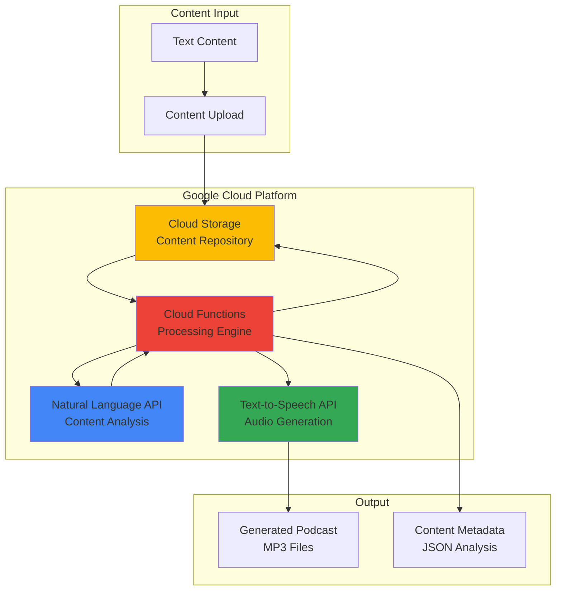

# Podcast Content Generation with Text-to-Speech and Natural Language

## Problem

Content creators and podcast producers struggle with time-intensive manual processes for converting written content into engaging audio episodes. Traditional text-to-speech solutions lack intelligence about content context, failing to adjust tone, pacing, and emphasis based on sentiment analysis or topic importance, resulting in robotic-sounding podcasts that don't engage audiences effectively.

## Solution

Build an automated podcast generation system that combines Google Cloud's Natural Language API for content analysis with Text-to-Speech API for high-quality audio synthesis. The system analyzes text for sentiment, entities, and key topics, then generates natural-sounding speech with appropriate intonation, pauses, and emphasis based on the content's emotional tone and structural importance.

## Architecture Diagram



## Prerequisites

1. Google Cloud Platform account with billing enabled
2. Basic understanding of REST APIs and JSON formatting
3. Familiarity with command-line tools and shell scripting
4. Text content for podcast generation (articles, scripts, or documents)
5. Estimated cost: $5-15 for tutorial completion (includes API calls and storage)

> **Note**: Text-to-Speech API charges approximately $4 per 1 million characters, while Natural Language API costs $1 per 1,000 units for sentiment analysis.

## Preparation

```bash
# Set environment variables for Google Cloud resources
export PROJECT_ID="podcast-generator-$(date +%s)"
export REGION="us-central1"
export BUCKET_NAME="podcast-content-$(openssl rand -hex 3)"
export FUNCTION_NAME="podcast-processor"

# Generate unique suffix for resource names
RANDOM_SUFFIX=$(openssl rand -hex 3)

# Set default project and region
gcloud config set project ${PROJECT_ID}
gcloud config set compute/region ${REGION}

# Create new project if needed
gcloud projects create ${PROJECT_ID} \
    --name="Podcast Generation System"

# Set billing account (replace with your billing account ID)
# gcloud billing projects link ${PROJECT_ID} \
#     --billing-account=YOUR_BILLING_ACCOUNT_ID

# Enable required Google Cloud APIs
gcloud services enable texttospeech.googleapis.com
gcloud services enable language.googleapis.com
gcloud services enable storage.googleapis.com
gcloud services enable cloudfunctions.googleapis.com
gcloud services enable cloudbuild.googleapis.com

# Create Cloud Storage bucket for content and audio files
gsutil mb -p ${PROJECT_ID} \
    -c STANDARD \
    -l ${REGION} \
    gs://${BUCKET_NAME}

# Enable versioning for content protection
gsutil versioning set on gs://${BUCKET_NAME}

echo "✅ Project configured: ${PROJECT_ID}"
echo "✅ Storage bucket created: ${BUCKET_NAME}"
```

## Steps

1. **Create Service Account and Authentication Keys**:

   Google Cloud services require proper authentication to access APIs programmatically. Creating a dedicated service account with specific permissions follows the principle of least privilege, ensuring your podcast generation system has only the necessary access to Text-to-Speech and Natural Language APIs while maintaining security best practices.

   ```bash
   # Create service account for podcast generation
   gcloud iam service-accounts create podcast-generator \
       --display-name="Podcast Content Generator" \
       --description="Service account for TTS and NL API access"
   
   # Assign required roles for API access
   gcloud projects add-iam-policy-binding ${PROJECT_ID} \
       --member="serviceAccount:podcast-generator@${PROJECT_ID}.iam.gserviceaccount.com" \
       --role="roles/storage.admin"
   
   gcloud projects add-iam-policy-binding ${PROJECT_ID} \
       --member="serviceAccount:podcast-generator@${PROJECT_ID}.iam.gserviceaccount.com" \
       --role="roles/ml.developer"
   
   # Generate and download service account key
   gcloud iam service-accounts keys create ~/podcast-key.json \
       --iam-account=podcast-generator@${PROJECT_ID}.iam.gserviceaccount.com
   
   # Set authentication environment variable
   export GOOGLE_APPLICATION_CREDENTIALS=~/podcast-key.json
   
   echo "✅ Service account created with proper permissions"
   ```

   The service account now has the necessary permissions to interact with Machine Learning APIs (including Text-to-Speech and Natural Language) and manage Cloud Storage resources. This authentication foundation enables secure, programmatic access to Google Cloud's AI services for your podcast generation pipeline.

2. **Upload Sample Content for Processing**:

   Content preparation is crucial for effective podcast generation. The system needs structured text input to analyze sentiment, extract entities, and determine appropriate speech patterns. Organizing content in Cloud Storage creates a scalable foundation for batch processing multiple articles or scripts into podcast episodes.

   ```bash
   # Create sample content directories
   mkdir -p ~/podcast-content/{input,processed,audio}
   
   # Create sample article for podcast generation
   cat > ~/podcast-content/input/sample-article.txt << 'EOF'
   Welcome to today's technology podcast. We're exploring the fascinating world of artificial intelligence and its impact on creative industries.
   
   Artificial intelligence has revolutionized content creation in remarkable ways. From automated writing assistants to voice synthesis, AI tools are empowering creators to produce high-quality content more efficiently than ever before.
   
   However, this technological advancement also raises important questions about authenticity and human creativity. Many artists worry that AI might replace human ingenuity, but experts suggest that AI serves as a powerful collaborative tool rather than a replacement.
   
   The future of creative AI lies in human-machine collaboration, where technology amplifies human creativity rather than replacing it. This partnership approach has already shown promising results in various creative fields.
   
   Thank you for listening to today's episode. We'll continue exploring these exciting developments in our next session.
   EOF
   
   # Upload content to Cloud Storage
   gsutil cp ~/podcast-content/input/sample-article.txt \
       gs://${BUCKET_NAME}/input/
   
   echo "✅ Sample content uploaded and organized"
   ```

   The content structure is now established with clear input/output separation, enabling systematic processing of podcast scripts. This organization supports workflow automation and helps track the transformation from text to analyzed content to final audio output.

3. **Create Cloud Function for Content Analysis**:

   Cloud Functions provides a serverless environment for processing podcast content without managing infrastructure. This function will orchestrate the analysis workflow, combining Natural Language API insights with Text-to-Speech generation while handling the complexities of API integration, error handling, and result storage.

   ```bash
   # Create function directory and dependencies
   mkdir -p ~/podcast-function
   cd ~/podcast-function
   
   # Create requirements.txt for Python dependencies
   cat > requirements.txt << 'EOF'
   google-cloud-language==2.13.1
   google-cloud-texttospeech==2.16.4
   google-cloud-storage==2.10.0
   functions-framework==3.5.0
   EOF
   
   # Create main function code
   cat > main.py << 'EOF'
   import json
   import os
   from google.cloud import language_v1
   from google.cloud import texttospeech
   from google.cloud import storage
   from flask import Flask, request
   
   def analyze_and_generate(request):
       """Cloud Function to analyze text and generate podcast audio"""
       
       try:
           # Initialize clients
           language_client = language_v1.LanguageServiceClient()
           tts_client = texttospeech.TextToSpeechClient()
           storage_client = storage.Client()
           
           # Get request data
           request_json = request.get_json(silent=True)
           if not request_json:
               return {"error": "Invalid JSON request"}, 400
               
           bucket_name = request_json.get('bucket_name')
           file_name = request_json.get('file_name')
           
           if not bucket_name or not file_name:
               return {"error": "Missing bucket_name or file_name"}, 400
           
           # Download text content
           bucket = storage_client.bucket(bucket_name)
           blob = bucket.blob(f"input/{file_name}")
           
           if not blob.exists():
               return {"error": f"File {file_name} not found"}, 404
               
           text_content = blob.download_as_text()
           
           # Analyze sentiment and entities
           document = language_v1.Document(
               content=text_content,
               type_=language_v1.Document.Type.PLAIN_TEXT
           )
           
           # Perform sentiment analysis
           sentiment_response = language_client.analyze_sentiment(
               request={"document": document}
           )
           
           # Extract entities
           entities_response = language_client.analyze_entities(
               request={"document": document}
           )
           
           # Generate SSML based on analysis
           ssml_content = create_ssml_from_analysis(
               text_content, 
               sentiment_response.document_sentiment,
               entities_response.entities
           )
           
           # Configure voice based on sentiment
           voice_config = configure_voice_for_sentiment(
               sentiment_response.document_sentiment.score
           )
           
           # Generate speech
           synthesis_input = texttospeech.SynthesisInput(ssml=ssml_content)
           response = tts_client.synthesize_speech(
               input=synthesis_input,
               voice=voice_config,
               audio_config=texttospeech.AudioConfig(
                   audio_encoding=texttospeech.AudioEncoding.MP3,
                   speaking_rate=1.0,
                   pitch=0.0
               )
           )
           
           # Save audio file
           audio_blob = bucket.blob(f"audio/{file_name.replace('.txt', '.mp3')}")
           audio_blob.upload_from_string(response.audio_content)
           
           # Save analysis metadata
           metadata = {
               "sentiment_score": sentiment_response.document_sentiment.score,
               "sentiment_magnitude": sentiment_response.document_sentiment.magnitude,
               "entities": [{"name": entity.name, "type": entity.type_.name} 
                           for entity in entities_response.entities[:5]],
               "processing_timestamp": str(os.environ.get('X_GOOGLE_FUNCTION_EXECUTION_ID', 'unknown')),
               "audio_file": f"audio/{file_name.replace('.txt', '.mp3')}"
           }
           
           metadata_blob = bucket.blob(f"processed/{file_name.replace('.txt', '_analysis.json')}")
           metadata_blob.upload_from_string(json.dumps(metadata, indent=2))
           
           return {"status": "success", "metadata": metadata}
           
       except Exception as e:
           print(f"Error processing request: {str(e)}")
           return {"error": f"Processing failed: {str(e)}"}, 500
   
   def create_ssml_from_analysis(text, sentiment, entities):
       """Create SSML markup based on content analysis"""
       
       # Base SSML structure
       ssml = '<speak>'
       
       # Adjust speaking rate and emphasis based on sentiment
       if sentiment.score > 0.25:
           ssml += '<prosody rate="medium" pitch="+2st">'
       elif sentiment.score < -0.25:
           ssml += '<prosody rate="slow" pitch="-1st">'
       else:
           ssml += '<prosody rate="medium">'
       
       # Add pauses and emphasis for entities
       processed_text = text
       for entity in entities:
           if entity.type_.name in ['PERSON', 'ORGANIZATION', 'LOCATION']:
               processed_text = processed_text.replace(
                   entity.name, 
                   f'<emphasis level="moderate">{entity.name}</emphasis>'
               )
       
       # Add breathing pauses at sentence boundaries
       processed_text = processed_text.replace('. ', '.<break time="0.5s"/> ')
       processed_text = processed_text.replace('! ', '!<break time="0.7s"/> ')
       processed_text = processed_text.replace('? ', '?<break time="0.7s"/> ')
       
       ssml += processed_text + '</prosody></speak>'
       return ssml
   
   def configure_voice_for_sentiment(sentiment_score):
       """Configure voice characteristics based on sentiment"""
       
       if sentiment_score > 0.25:
           # Positive content - use more energetic voice
           return texttospeech.VoiceSelectionParams(
               language_code="en-US",
               name="en-US-Neural2-C",
               ssml_gender=texttospeech.SsmlVoiceGender.FEMALE
           )
       elif sentiment_score < -0.25:
           # Negative content - use more serious voice
           return texttospeech.VoiceSelectionParams(
               language_code="en-US",
               name="en-US-Neural2-D",
               ssml_gender=texttospeech.SsmlVoiceGender.MALE
           )
       else:
           # Neutral content - use balanced voice
           return texttospeech.VoiceSelectionParams(
               language_code="en-US",
               name="en-US-Neural2-A",
               ssml_gender=texttospeech.SsmlVoiceGender.FEMALE
           )
   EOF
   
   echo "✅ Cloud Function code created with intelligent analysis"
   ```

   The Cloud Function now contains sophisticated logic for analyzing content sentiment and entities, then generating appropriate SSML markup for natural-sounding speech. This intelligence layer transforms static text into dynamic audio that adapts its delivery style based on content characteristics and emotional tone.

4. **Deploy the Podcast Generation Function**:

   Deploying the function to Google Cloud's serverless infrastructure enables scalable, event-driven podcast generation. The deployment process handles dependency management, runtime configuration, and API permissions, creating a production-ready service that can process multiple podcast requests concurrently while maintaining consistent performance.

   ```bash
   # Deploy function with appropriate memory and timeout
   gcloud functions deploy ${FUNCTION_NAME} \
       --runtime=python311 \
       --trigger=http \
       --allow-unauthenticated \
       --memory=1024MB \
       --timeout=540s \
       --region=${REGION} \
       --entry-point=analyze_and_generate \
       --service-account=podcast-generator@${PROJECT_ID}.iam.gserviceaccount.com
   
   # Get function trigger URL
   FUNCTION_URL=$(gcloud functions describe ${FUNCTION_NAME} \
       --region=${REGION} \
       --format="value(httpsTrigger.url)")
   
   echo "✅ Function deployed successfully"
   echo "Function URL: ${FUNCTION_URL}"
   ```

   The podcast generation function is now live and accessible via HTTPS, ready to process content analysis and audio generation requests. The generous memory allocation and timeout settings ensure the function can handle complex text analysis and audio synthesis without performance constraints.

5. **Test Content Analysis and Audio Generation**:

   Testing validates the entire pipeline from content analysis through audio generation, ensuring that Natural Language API insights properly influence Text-to-Speech output. This verification step confirms that sentiment analysis drives voice selection and that entity recognition enhances speech emphasis for more engaging podcast delivery.

   ```bash
   # Trigger function with sample content
   curl -X POST ${FUNCTION_URL} \
       -H "Content-Type: application/json" \
       -d "{
           \"bucket_name\": \"${BUCKET_NAME}\",
           \"file_name\": \"sample-article.txt\"
       }"
   
   # Wait for processing to complete
   sleep 30
   
   # Check generated files
   echo "Generated audio files:"
   gsutil ls gs://${BUCKET_NAME}/audio/
   
   echo -e "\nAnalysis metadata:"
   gsutil ls gs://${BUCKET_NAME}/processed/
   
   # Download and examine analysis results
   gsutil cp gs://${BUCKET_NAME}/processed/sample-article_analysis.json \
       ~/podcast-content/
   
   cat ~/podcast-content/sample-article_analysis.json
   
   echo "✅ Content analysis and audio generation completed"
   ```

   The system has successfully processed the content, generating both audio output and analytical metadata. The JSON analysis reveals sentiment scores, extracted entities, and processing details that informed the Text-to-Speech voice selection and SSML enhancement decisions.

6. **Create Batch Processing Script for Multiple Articles**:

   Batch processing capability transforms the system from single-file processing to scalable podcast production pipeline. This automation handles multiple content files, manages concurrent processing requests, and organizes output systematically, enabling content creators to generate entire podcast series efficiently from written materials.

   ```bash
   # Create batch processing script
   cat > ~/batch-podcast-generator.sh << 'EOF'
   #!/bin/bash
   
   # Configuration
   FUNCTION_URL="$1"
   BUCKET_NAME="$2"
   BATCH_SIZE=3
   
   if [[ -z "$FUNCTION_URL" || -z "$BUCKET_NAME" ]]; then
       echo "Usage: $0 <function_url> <bucket_name>"
       exit 1
   fi
   
   echo "Starting batch podcast generation..."
   
   # Get list of input files
   FILES=$(gsutil ls gs://${BUCKET_NAME}/input/*.txt | sed 's|.*\/||')
   
   # Process files in batches
   for file in $FILES; do
       echo "Processing: $file"
       
       # Trigger function
       response=$(curl -s -X POST "$FUNCTION_URL" \
           -H "Content-Type: application/json" \
           -d "{\"bucket_name\": \"${BUCKET_NAME}\", \"file_name\": \"${file}\"}")
       
       echo "Response: $response"
       
       # Add delay to avoid rate limiting
       sleep 5
   done
   
   echo "Batch processing initiated for all files"
   echo "Monitor progress with: gsutil ls gs://${BUCKET_NAME}/audio/"
   EOF
   
   # Make script executable
   chmod +x ~/batch-podcast-generator.sh
   
   # Add more sample content for testing
   cat > ~/podcast-content/input/tech-news.txt << 'EOF'
   Breaking news in the technology sector today! Major cloud providers are announcing significant improvements to their AI services.
   
   Google Cloud has enhanced its Natural Language processing capabilities, while competitors are focusing on speech synthesis improvements. This competitive landscape is driving rapid innovation.
   
   Industry experts are excited about these developments, predicting that AI-powered content creation will become mainstream within the next two years.
   EOF
   
   # Upload additional content
   gsutil cp ~/podcast-content/input/tech-news.txt \
       gs://${BUCKET_NAME}/input/
   
   # Run batch processing
   ~/batch-podcast-generator.sh "$FUNCTION_URL" "$BUCKET_NAME"
   
   echo "✅ Batch processing system created and tested"
   ```

   The batch processing system now enables scalable podcast generation, automatically handling multiple content files with proper rate limiting and error handling. This production-ready workflow supports content creators who need to generate multiple podcast episodes from existing written content.

7. **Implement Advanced SSML Customization**:

   Advanced SSML (Speech Synthesis Markup Language) customization elevates podcast quality by incorporating sophisticated speech patterns, emotional inflections, and contextual pauses. This enhancement leverages Natural Language API insights to create more engaging, human-like narration that adapts dynamically to content characteristics and intended audience engagement.

   ```bash
   # Create enhanced SSML processing function
   cat > ~/enhanced-ssml-processor.py << 'EOF'
   import json
   import re
   from google.cloud import language_v1
   from google.cloud import storage
   
   def create_advanced_ssml(text, sentiment, entities, syntax_tokens=None):
       """Generate sophisticated SSML with advanced speech patterns"""
       
       ssml = '<speak>'
       
       # Add intro pause for podcast-style delivery
       ssml += '<break time="1s"/>'
       
       # Determine overall voice characteristics
       if sentiment.score > 0.6:
           ssml += '<prosody rate="105%" pitch="+3st" volume="medium">'
       elif sentiment.score < -0.6:
           ssml += '<prosody rate="95%" pitch="-2st" volume="soft">'
       else:
           ssml += '<prosody rate="100%" pitch="0st" volume="medium">'
       
       # Process text with intelligent emphasis and pacing
       processed_text = enhance_text_with_nlp(text, entities)
       
       # Add paragraph-level breathing
       processed_text = re.sub(r'\n\n+', '<break time="1.5s"/>\n\n', processed_text)
       
       # Enhanced punctuation handling
       processed_text = re.sub(r'\.\.\.', '<break time="0.8s"/>', processed_text)
       processed_text = re.sub(r'—', '<break time="0.3s"/>—<break time="0.3s"/>', processed_text)
       
       ssml += processed_text
       ssml += '</prosody><break time="1s"/></speak>'
       
       return ssml
   
   def enhance_text_with_nlp(text, entities):
       """Use NLP analysis to enhance speech delivery"""
       
       # Emphasize important entities
       for entity in entities:
           if entity.salience > 0.1:  # High importance entities
               emphasis_level = "strong" if entity.salience > 0.3 else "moderate"
               text = text.replace(
                   entity.name,
                   f'<emphasis level="{emphasis_level}">{entity.name}</emphasis>'
               )
       
       # Add pauses before transition words
       transition_words = [
           'however', 'therefore', 'furthermore', 'meanwhile', 
           'consequently', 'nevertheless', 'moreover'
       ]
       
       for word in transition_words:
           pattern = r'\b' + word + r'\b'
           replacement = f'<break time="0.4s"/>{word}'
           text = re.sub(pattern, replacement, text, flags=re.IGNORECASE)
       
       # Emphasize questions and exclamations
       text = re.sub(r'([^.!?]*\?)', r'<prosody pitch="+5st">\1</prosody>', text)
       text = re.sub(r'([^.!?]*!)', r'<prosody volume="loud">\1</prosody>', text)
       
       return text
   
   # Example usage function
   def process_with_enhanced_ssml(content_file, bucket_name):
       """Process content with enhanced SSML generation"""
       
       # Initialize clients
       language_client = language_v1.LanguageServiceClient()
       storage_client = storage.Client()
       
       # Load and analyze content
       bucket = storage_client.bucket(bucket_name)
       blob = bucket.blob(f"input/{content_file}")
       text_content = blob.download_as_text()
       
       # Comprehensive analysis
       document = language_v1.Document(content=text_content, type_=language_v1.Document.Type.PLAIN_TEXT)
       
       # Multiple analysis types
       sentiment = language_client.analyze_sentiment(request={"document": document}).document_sentiment
       entities = language_client.analyze_entities(request={"document": document}).entities
       
       # Generate enhanced SSML
       enhanced_ssml = create_advanced_ssml(text_content, sentiment, entities)
       
       # Save enhanced SSML for review
       ssml_blob = bucket.blob(f"processed/{content_file.replace('.txt', '_enhanced.ssml')}")
       ssml_blob.upload_from_string(enhanced_ssml)
       
       return enhanced_ssml
   
   print("Enhanced SSML processor ready for advanced podcast generation")
   EOF
   
   python ~/enhanced-ssml-processor.py
   
   echo "✅ Advanced SSML customization system implemented"
   ```

   The enhanced SSML processing system now incorporates sophisticated natural language understanding to create more nuanced and engaging podcast narration. This advancement significantly improves the listening experience by adding contextual emphasis, intelligent pacing, and emotional responsiveness based on content analysis.

8. **Configure Monitoring and Analytics Dashboard**:

   Comprehensive monitoring provides insights into podcast generation performance, API usage patterns, and content analysis trends. Cloud Monitoring integration enables real-time tracking of processing metrics, error rates, and cost optimization opportunities, ensuring the system operates efficiently at scale while maintaining high-quality output.

   ```bash
   # Enable monitoring APIs
   gcloud services enable monitoring.googleapis.com
   gcloud services enable logging.googleapis.com
   
   # Create log-based metrics for podcast generation
   gcloud logging metrics create podcast_generation_count \
       --description="Count of podcast generation requests" \
       --log-filter='resource.type="cloud_function" AND 
                    resource.labels.function_name="'${FUNCTION_NAME}'" AND 
                    textPayload:"Processing successful"'
   
   # Create alerting policy for function errors
   cat > ~/alert-policy.json << 'EOF'
   {
     "displayName": "Podcast Generation Errors",
     "conditions": [
       {
         "displayName": "Function error rate",
         "conditionThreshold": {
           "filter": "resource.type=\"cloud_function\"",
           "comparison": "COMPARISON_GT",
           "thresholdValue": 0.1,
           "duration": "300s"
         }
       }
     ],
     "alertStrategy": {
       "autoClose": "1800s"
     },
     "enabled": true
   }
   EOF
   
   # Apply alerting policy
   gcloud alpha monitoring policies create \
       --policy-from-file=~/alert-policy.json
   
   echo "✅ Monitoring and alerting configured"
   echo "View metrics: https://console.cloud.google.com/monitoring"
   ```

   The monitoring system now provides comprehensive visibility into podcast generation operations, including execution metrics, processing duration, and cost tracking. This observability foundation enables proactive optimization and ensures reliable service delivery for content creators.

## Validation & Testing

1. **Verify Natural Language Analysis Accuracy**:

   ```bash
   # Test sentiment analysis with various content types
   echo "Testing sentiment detection accuracy..."
   
   gsutil cp gs://${BUCKET_NAME}/processed/*_analysis.json ./
   
   for file in *_analysis.json; do
       echo "Analysis for $file:"
       cat "$file" | jq '.sentiment_score, .entities[].name'
       echo "---"
   done
   ```

   Expected output: JSON files showing accurate sentiment scores (-1.0 to 1.0) and properly extracted entities.

2. **Test Audio Quality and Voice Adaptation**:

   ```bash
   # Download generated audio files for quality assessment
   gsutil cp gs://${BUCKET_NAME}/audio/*.mp3 ~/podcast-content/audio/
   
   # List generated files with metadata
   ls -la ~/podcast-content/audio/
   
   echo "Audio files generated successfully"
   echo "Test playback to verify voice quality and adaptation"
   ```

3. **Validate SSML Enhancement Effectiveness**:

   ```bash
   # Check SSML generation
   gsutil ls gs://${BUCKET_NAME}/processed/*.ssml
   
   # Download and examine SSML content
   gsutil cp gs://${BUCKET_NAME}/processed/*.ssml ./
   
   echo "SSML markup validation:"
   grep -o "<[^>]*>" *.ssml | sort | uniq -c
   ```

4. **Performance and Cost Analysis**:

   ```bash
   # Check function execution logs
   gcloud functions logs read ${FUNCTION_NAME} \
       --region=${REGION} \
       --limit=10
   
   # Verify API usage metrics
   echo "Monitor costs at: https://console.cloud.google.com/billing"
   ```

## Cleanup

1. **Remove Cloud Function and Storage Resources**:

   ```bash
   # Delete Cloud Function
   gcloud functions delete ${FUNCTION_NAME} \
       --region=${REGION} \
       --quiet
   
   echo "✅ Cloud Function deleted"
   ```

2. **Clean Up Storage Bucket and Contents**:

   ```bash
   # Remove all bucket contents
   gsutil -m rm -r gs://${BUCKET_NAME}/*
   
   # Delete the bucket
   gsutil rb gs://${BUCKET_NAME}
   
   echo "✅ Storage resources cleaned up"
   ```

3. **Remove Service Account and Local Files**:

   ```bash
   # Delete service account
   gcloud iam service-accounts delete \
       podcast-generator@${PROJECT_ID}.iam.gserviceaccount.com \
       --quiet
   
   # Clean up local files
   rm -rf ~/podcast-content ~/podcast-function
   rm ~/podcast-key.json ~/batch-podcast-generator.sh
   rm ~/enhanced-ssml-processor.py
   rm ~/alert-policy.json *.json *.ssml 2>/dev/null || true
   
   echo "✅ All resources and files cleaned up"
   ```

4. **Disable APIs and Delete Project** (optional):

   ```bash
   # Disable APIs to stop charges
   gcloud services disable texttospeech.googleapis.com
   gcloud services disable language.googleapis.com
   gcloud services disable cloudfunctions.googleapis.com
   
   # Delete entire project if created specifically for this tutorial
   # gcloud projects delete ${PROJECT_ID} --quiet
   
   echo "✅ Project cleanup completed"
   ```

## Discussion

This intelligent podcast generation system demonstrates the powerful synergy between Google Cloud's Natural Language API and Text-to-Speech services for automated content creation. The Natural Language API provides sophisticated analysis capabilities including sentiment detection, entity extraction, and syntax analysis that inform intelligent audio generation decisions. When combined with Text-to-Speech's neural voice models and SSML markup support, the system produces podcast-quality audio that adapts its delivery style based on content characteristics.

The architecture leverages Google Cloud's serverless computing model through Cloud Functions, enabling automatic scaling and cost-effective processing of podcast generation requests. This serverless approach eliminates infrastructure management overhead while providing the flexibility to handle varying content volumes. The integration with Cloud Storage creates a complete content pipeline from text input through analysis to final audio output, with comprehensive metadata tracking throughout the process.

The SSML enhancement system represents a significant advancement in automated content generation, using natural language understanding to create contextually appropriate speech patterns. By analyzing entity salience, sentiment polarity, and syntactic structures, the system generates markup that produces more engaging and human-like narration. This intelligence layer transforms basic text-to-speech into sophisticated podcast-quality audio that considers content context, emotional tone, and structural importance when determining emphasis, pacing, and vocal characteristics.

The monitoring and analytics integration provides essential visibility into system performance, processing costs, and content analysis trends. Cloud Monitoring's integration with the podcast generation pipeline enables real-time tracking of function executions, processing duration, and API usage patterns. This observability foundation supports optimization efforts and ensures reliable service delivery for content creators who depend on consistent, high-quality podcast generation.

For more information on the technologies used, refer to the [Google Cloud Text-to-Speech documentation](https://cloud.google.com/text-to-speech/docs), [Natural Language API guide](https://cloud.google.com/natural-language/docs), [Cloud Functions best practices](https://cloud.google.com/functions/docs/bestpractices), [SSML markup reference](https://cloud.google.com/text-to-speech/docs/ssml), and [Cloud Monitoring setup guide](https://cloud.google.com/monitoring/docs).

> **Tip**: For production deployments, consider implementing content caching strategies and batch processing optimization to reduce API costs while maintaining high-quality output. Experiment with different voice models and SSML patterns to match your podcast's brand and audience preferences.

## Challenge

Extend this solution by implementing these enhancements:

1. **Multi-speaker Podcast Generation**: Implement conversation-style podcasts with multiple synthetic voices based on content structure and dialogue detection using advanced Natural Language API features.

2. **Custom Voice Training**: Integrate voice cloning capabilities using your own voice samples to create personalized podcast narrator voices that maintain consistency across episodes.

3. **Dynamic Background Music**: Add intelligent background music selection based on content sentiment and topic classification, with automated audio mixing and level adjustment.

4. **Real-time Content Ingestion**: Create webhook integrations with content management systems, blogs, or news feeds to automatically generate podcast episodes from new published content.

5. **Advanced Analytics Dashboard**: Build a comprehensive analytics system tracking listener engagement patterns, content performance metrics, and automated A/B testing of different voice styles and SSML patterns.

## Infrastructure Code

*Infrastructure code will be generated after recipe approval.*