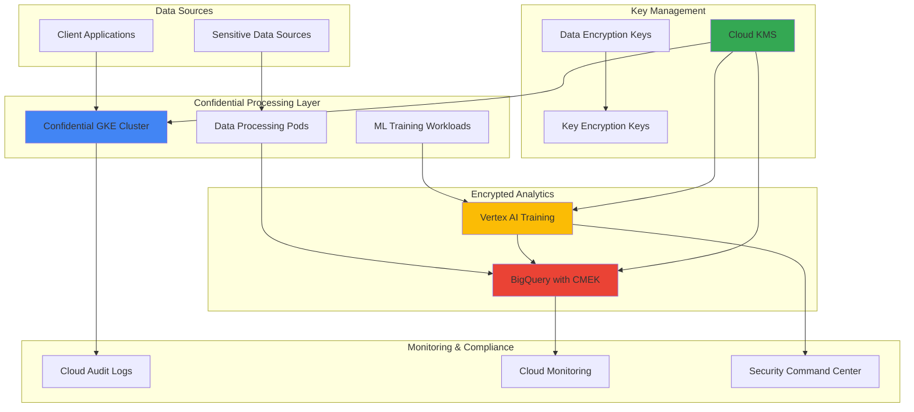

# Privacy-Preserving Analytics with Confidential GKE and BigQuery

## Problem

Healthcare and financial organizations need to analyze sensitive customer data for insights while maintaining strict privacy compliance requirements like HIPAA and GDPR. Traditional analytics platforms expose data during processing, creating security vulnerabilities and regulatory compliance risks. Organizations require a solution that maintains data encryption throughout the entire analytics pipeline, from ingestion through machine learning model training, without compromising on analytical capabilities or performance.

## Solution

Implement privacy-preserving analytics using Google Cloud's Confidential Computing technologies. This solution combines Confidential GKE nodes with hardware-based memory encryption for secure data processing, BigQuery with customer-managed encryption keys (CMEK) for encrypted analytics, and Vertex AI for privacy-aware machine learning. The architecture ensures data remains encrypted during processing while enabling powerful analytics and ML capabilities for regulated industries.

## Architecture Diagram



## Prerequisites

1. Google Cloud project with billing enabled and Owner or Editor permissions
2. Google Cloud CLI (gcloud) installed and configured (version 400.0.0 or later)
3. Knowledge of Kubernetes, BigQuery, and machine learning concepts
4. Understanding of encryption and key management principles
5. Estimated cost: $75-150 for resources created (includes Confidential GKE nodes and BigQuery analysis)

> **Note**: This recipe creates premium Confidential Computing resources that may incur higher costs than standard instances. Monitor usage and clean up resources promptly after testing.

## Preparation

```bash
# Set environment variables for GCP resources
export PROJECT_ID="privacy-analytics-$(date +%s)"
export REGION="us-central1"
export ZONE="us-central1-a"

# Generate unique suffix for resource names
RANDOM_SUFFIX=$(openssl rand -hex 3)
export CLUSTER_NAME="confidential-cluster-${RANDOM_SUFFIX}"
export KEYRING_NAME="analytics-keyring-${RANDOM_SUFFIX}"
export KEY_NAME="analytics-key-${RANDOM_SUFFIX}"
export DATASET_NAME="sensitive_analytics_${RANDOM_SUFFIX}"
export BUCKET_NAME="privacy-analytics-${PROJECT_ID}-${RANDOM_SUFFIX}"

# Set default project and region
gcloud config set project ${PROJECT_ID}
gcloud config set compute/region ${REGION}
gcloud config set compute/zone ${ZONE}

# Enable required APIs for confidential computing and analytics
gcloud services enable container.googleapis.com
gcloud services enable bigquery.googleapis.com
gcloud services enable cloudkms.googleapis.com
gcloud services enable aiplatform.googleapis.com
gcloud services enable compute.googleapis.com
gcloud services enable storage.googleapis.com

echo "✅ Project configured: ${PROJECT_ID}"
echo "✅ APIs enabled for confidential computing and analytics"
```

## Steps

1. **Create Cloud KMS Key Ring and Encryption Keys**:

   Cloud KMS provides centralized key management with envelope encryption for protecting sensitive data throughout the analytics pipeline. Creating dedicated encryption keys ensures that all data processing maintains cryptographic boundaries and supports regulatory compliance requirements.

   ```bash
   # Create KMS key ring for analytics encryption
   gcloud kms keyrings create ${KEYRING_NAME} \
       --location=${REGION}
   
   # Create symmetric encryption key for data protection
   gcloud kms keys create ${KEY_NAME} \
       --location=${REGION} \
       --keyring=${KEYRING_NAME} \
       --purpose=encryption
   
   # Store key resource name for later use
   export KEY_RESOURCE_NAME="projects/${PROJECT_ID}/locations/${REGION}/keyRings/${KEYRING_NAME}/cryptoKeys/${KEY_NAME}"
   
   echo "✅ KMS key ring and encryption key created"
   echo "Key resource: ${KEY_RESOURCE_NAME}"
   ```

   The encryption key is now available for protecting data across all analytics services. This key will encrypt data at rest in BigQuery and provide additional security for Confidential GKE workloads, ensuring end-to-end encryption throughout the analytics pipeline.

2. **Create Confidential GKE Cluster with Hardware Encryption**:

   Confidential GKE nodes utilize AMD SEV or Intel TDX technologies to provide hardware-based memory encryption, protecting data during processing. This ensures that sensitive data remains encrypted even when loaded into memory for analysis, meeting the highest security standards for regulated industries.

   ```bash
   # Create Confidential GKE cluster with AMD SEV encryption
   gcloud container clusters create ${CLUSTER_NAME} \
       --zone=${ZONE} \
       --machine-type=n2d-standard-4 \
       --num-nodes=2 \
       --confidential-node-type=sev \
       --disk-encryption-key=${KEY_RESOURCE_NAME} \
       --enable-ip-alias \
       --enable-autorepair \
       --enable-autoupgrade \
       --logging=SYSTEM,WORKLOAD \
       --monitoring=SYSTEM \
       --cluster-version=latest
   
   # Get cluster credentials for kubectl access
   gcloud container clusters get-credentials ${CLUSTER_NAME} \
       --zone=${ZONE}
   
   # Verify confidential computing is enabled
   kubectl get nodes -o wide
   
   echo "✅ Confidential GKE cluster created with hardware encryption"
   ```

   The cluster now provides hardware-level protection for workloads with encrypted memory and secure enclaves. All data processed within the cluster benefits from AMD SEV encryption, ensuring that sensitive information remains protected during computation and analysis operations.

3. **Create BigQuery Dataset with Customer-Managed Encryption**:

   BigQuery with CMEK provides encrypted data warehousing where analytical queries execute against encrypted data without exposing plaintext. The customer-managed encryption keys ensure that organizations maintain full control over their data encryption while leveraging BigQuery's serverless analytics capabilities.

   ```bash
   # Create BigQuery dataset with CMEK encryption
   bq mk --dataset \
       --location=${REGION} \
       --default_kms_key=${KEY_RESOURCE_NAME} \
       --description="Privacy-preserving analytics dataset with CMEK" \
       ${PROJECT_ID}:${DATASET_NAME}
   
   # Create sample sensitive data table with proper schema
   bq mk --table \
       ${PROJECT_ID}:${DATASET_NAME}.patient_analytics \
       patient_id:STRING,age:INTEGER,diagnosis:STRING,treatment_cost:FLOAT,region:STRING,admission_date:DATE
   
   # Insert sample encrypted data with realistic healthcare patterns
   bq query --use_legacy_sql=false \
       --destination_table=${PROJECT_ID}:${DATASET_NAME}.patient_analytics \
       --replace \
       "SELECT 
           CONCAT('PATIENT_', LPAD(CAST(ROW_NUMBER() OVER() AS STRING), 6, '0')) as patient_id,
           CAST(RAND() * 80 + 20 AS INT64) as age,
           CASE CAST(RAND() * 5 AS INT64)
               WHEN 0 THEN 'Diabetes'
               WHEN 1 THEN 'Hypertension'
               WHEN 2 THEN 'Heart Disease'
               WHEN 3 THEN 'Cancer'
               ELSE 'Respiratory Disease'
           END as diagnosis,
           ROUND(RAND() * 50000 + 5000, 2) as treatment_cost,
           CASE CAST(RAND() * 4 AS INT64)
               WHEN 0 THEN 'North'
               WHEN 1 THEN 'South'
               WHEN 2 THEN 'East'
               ELSE 'West'
           END as region,
           DATE_SUB(CURRENT_DATE(), INTERVAL CAST(RAND() * 365 AS INT64) DAY) as admission_date
       FROM UNNEST(GENERATE_ARRAY(1, 10000)) as num"
   
   echo "✅ BigQuery dataset created with CMEK encryption and sample data"
   ```

   The dataset now stores sensitive healthcare data with customer-managed encryption, ensuring compliance with healthcare privacy regulations. All analytical operations will execute against encrypted data, maintaining privacy while enabling powerful insights through BigQuery's SQL analytics engine.

4. **Deploy Privacy-Preserving Data Processing Application**:

   Deploy a containerized application on Confidential GKE that processes sensitive data within encrypted memory. This application demonstrates how to perform data transformations and analytics while maintaining hardware-level encryption throughout the processing pipeline.

   ```bash
   # Create privacy-preserving analytics application manifest
   cat > analytics-app.yaml << 'EOF'
   apiVersion: apps/v1
   kind: Deployment
   metadata:
     name: privacy-analytics-app
     labels:
       app: privacy-analytics
   spec:
     replicas: 2
     selector:
       matchLabels:
         app: privacy-analytics
     template:
       metadata:
         labels:
           app: privacy-analytics
       spec:
         serviceAccountName: default
         containers:
         - name: analytics-processor
           image: python:3.11-slim
           command: ["/bin/bash"]
           args:
             - -c
             - |
               pip install --no-cache-dir google-cloud-bigquery==3.11.4 google-cloud-kms==2.21.0
               python -c "
               from google.cloud import bigquery
               import os
               import time
               import logging
               
               # Configure logging
               logging.basicConfig(level=logging.INFO)
               logger = logging.getLogger(__name__)
               
               # Initialize BigQuery client
               client = bigquery.Client()
               dataset_id = os.environ['DATASET_NAME']
               
               logger.info(f'Starting privacy-preserving analytics for dataset: {dataset_id}')
               
               while True:
                   try:
                       logger.info('Processing encrypted analytics...')
                       
                       # Execute privacy-preserving query with aggregation
                       query = f'''
                       SELECT 
                           diagnosis,
                           region,
                           COUNT(*) as patient_count,
                           AVG(age) as avg_age,
                           AVG(treatment_cost) as avg_cost,
                           STDDEV(treatment_cost) as cost_stddev
                       FROM \`{dataset_id}.patient_analytics\`
                       WHERE admission_date >= DATE_SUB(CURRENT_DATE(), INTERVAL 90 DAY)
                       GROUP BY diagnosis, region
                       HAVING COUNT(*) >= 5
                       ORDER BY patient_count DESC
                       '''
                       
                       results = client.query(query)
                       logger.info('Analytics results (encrypted processing):')
                       for row in results:
                           logger.info(f'  {row.diagnosis} in {row.region}: {row.patient_count} patients, '
                                     f'avg age {row.avg_age:.1f}, avg cost ${row.avg_cost:.2f}')
                   except Exception as e:
                       logger.error(f'Analytics error: {e}')
                   
                   time.sleep(60)  # Process every minute
               "
           env:
           - name: DATASET_NAME
             value: "${PROJECT_ID}:${DATASET_NAME}"
           - name: GOOGLE_CLOUD_PROJECT
             value: "${PROJECT_ID}"
           resources:
             requests:
               memory: "512Mi"
               cpu: "250m"
             limits:
               memory: "1Gi"
               cpu: "500m"
           securityContext:
             allowPrivilegeEscalation: false
             runAsNonRoot: true
             runAsUser: 65534
             capabilities:
               drop:
               - ALL
   ---
   apiVersion: v1
   kind: Service
   metadata:
     name: privacy-analytics-service
   spec:
     selector:
       app: privacy-analytics
     ports:
     - port: 80
       targetPort: 8080
     type: ClusterIP
   EOF
   
   # Deploy the privacy-preserving analytics application
   envsubst < analytics-app.yaml | kubectl apply -f -
   
   # Wait for deployment to be ready
   kubectl wait deployment/privacy-analytics-app \
       --for=condition=Available \
       --timeout=300s
   
   echo "✅ Privacy-preserving analytics application deployed"
   ```

   The application now processes sensitive data within Confidential GKE's encrypted memory environment. All data analysis operations execute within hardware-protected enclaves, ensuring that sensitive information never exists in plaintext during processing while still enabling comprehensive analytics.

5. **Create Vertex AI Training Job with Encryption**:

   Vertex AI provides managed machine learning training with integrated encryption support. This step demonstrates how to train ML models on sensitive data while maintaining privacy through encryption and secure computing environments.

   ```bash
   # Create Cloud Storage bucket for ML training data with encryption
   gsutil mb -p ${PROJECT_ID} \
       -c STANDARD \
       -l ${REGION} \
       gs://${BUCKET_NAME}
   
   # Enable bucket encryption with CMEK
   gsutil kms encryption -k ${KEY_RESOURCE_NAME} gs://${BUCKET_NAME}
   
   # Export training data from BigQuery to Cloud Storage
   bq extract \
       --destination_format=CSV \
       --field_delimiter=',' \
       --print_header=true \
       ${PROJECT_ID}:${DATASET_NAME}.patient_analytics \
       gs://${BUCKET_NAME}/training_data/patient_data.csv
   
   # Create ML training script for privacy-preserving model
   cat > train_model.py << 'EOF'
   import pandas as pd
   import numpy as np
   from sklearn.ensemble import RandomForestClassifier
   from sklearn.model_selection import train_test_split
   from sklearn.preprocessing import LabelEncoder
   from sklearn.metrics import classification_report, accuracy_score
   import joblib
   import os
   import sys
   from google.cloud import storage
   import logging
   
   def train_privacy_preserving_model():
       """Train a privacy-preserving ML model on encrypted healthcare data."""
       logging.basicConfig(level=logging.INFO)
       logger = logging.getLogger(__name__)
       
       try:
           # Load encrypted training data
           data_path = '/gcs/training_data/patient_data.csv'
           logger.info(f"Loading training data from {data_path}")
           df = pd.read_csv(data_path)
           
           logger.info(f"Training on {len(df)} encrypted records with {df.shape[1]} features")
           
           # Encode categorical variables
           le_diagnosis = LabelEncoder()
           le_region = LabelEncoder()
           
           df['diagnosis_encoded'] = le_diagnosis.fit_transform(df['diagnosis'])
           df['region_encoded'] = le_region.fit_transform(df['region'])
           
           # Prepare features and target for diagnosis prediction
           X = df[['age', 'treatment_cost', 'region_encoded']]
           y = df['diagnosis_encoded']
           
           # Split data with stratification
           X_train, X_test, y_train, y_test = train_test_split(
               X, y, test_size=0.2, random_state=42, stratify=y)
           
           # Train privacy-preserving model with optimized parameters
           model = RandomForestClassifier(
               n_estimators=200, 
               max_depth=10,
               min_samples_split=10,
               random_state=42,
               n_jobs=-1
           )
           model.fit(X_train, y_train)
           
           # Evaluate model
           y_pred = model.predict(X_test)
           accuracy = accuracy_score(y_test, y_pred)
           logger.info(f"Model accuracy: {accuracy:.3f}")
           
           # Log feature importance for interpretability
           feature_names = ['age', 'treatment_cost', 'region_encoded']
           importance = model.feature_importances_
           for name, imp in zip(feature_names, importance):
               logger.info(f"Feature importance - {name}: {imp:.3f}")
           
           # Save model with encryption
           model_path = '/gcs/model'
           os.makedirs(model_path, exist_ok=True)
           joblib.dump(model, f"{model_path}/privacy_model.pkl")
           joblib.dump(le_diagnosis, f"{model_path}/diagnosis_encoder.pkl")
           joblib.dump(le_region, f"{model_path}/region_encoder.pkl")
           
           # Save model metadata
           with open(f"{model_path}/model_info.txt", 'w') as f:
               f.write(f"Model Accuracy: {accuracy:.3f}\n")
               f.write(f"Training Samples: {len(X_train)}\n")
               f.write(f"Test Samples: {len(X_test)}\n")
               f.write(f"Features: {', '.join(feature_names)}\n")
           
           logger.info("Privacy-preserving model training completed successfully")
           
       except Exception as e:
           logger.error(f"Training failed: {e}")
           sys.exit(1)
   
   if __name__ == "__main__":
       train_privacy_preserving_model()
   EOF
   
   # Upload training script to Cloud Storage
   gsutil cp train_model.py gs://${BUCKET_NAME}/code/
   
   # Create requirements file for training job
   echo "pandas==2.0.3
   scikit-learn==1.3.0
   google-cloud-storage==2.10.0" > requirements.txt
   gsutil cp requirements.txt gs://${BUCKET_NAME}/code/
   
   # Create and submit Vertex AI training job with encryption
   gcloud ai custom-jobs create \
       --region=${REGION} \
       --display-name="privacy-preserving-training-${RANDOM_SUFFIX}" \
       --python-package-uris=gs://${BUCKET_NAME}/code/train_model.py \
       --python-module-name=train_model \
       --worker-pool-spec=machine-type=n1-standard-4,replica-count=1,python-package-spec='{
         "executor_image_uri": "us-docker.pkg.dev/vertex-ai/training/scikit-learn-cpu.1-0:latest",
         "package_uris": ["gs://'${BUCKET_NAME}'/code/train_model.py"],
         "python_module": "train_model",
         "requirements": ["gs://'${BUCKET_NAME}'/code/requirements.txt"]
       }' \
       --args="" \
       --boot-disk-size=100 \
       --kms-key-name=${KEY_RESOURCE_NAME}
   
   echo "✅ Vertex AI training job submitted with encryption"
   ```

   The machine learning training job now processes sensitive healthcare data with full encryption support. Vertex AI maintains data privacy throughout the training pipeline while producing models that can provide valuable insights for healthcare analytics and decision-making.

6. **Set Up Privacy-Preserving Query Analytics**:

   Configure BigQuery for privacy-preserving analytics that supports differential privacy and secure aggregations. This enables organizations to gain insights from sensitive data while maintaining individual privacy through mathematical privacy guarantees.

   ```bash
   # Create privacy-preserving analytics views with k-anonymity
   bq query --use_legacy_sql=false << EOF
   CREATE OR REPLACE VIEW \`${PROJECT_ID}.${DATASET_NAME}.privacy_analytics_summary\` AS
   SELECT
     diagnosis,
     region,
     -- Use aggregation functions that preserve privacy
     COUNT(*) as patient_count,
     APPROX_QUANTILES(age, 4)[OFFSET(2)] as median_age,
     ROUND(STDDEV(treatment_cost), 2) as cost_variance,
     -- Only show results with sufficient sample size for privacy (k=10)
     CASE 
       WHEN COUNT(*) >= 10 THEN ROUND(AVG(treatment_cost), 2)
       ELSE NULL 
     END as avg_treatment_cost,
     -- Add time-based privacy protection
     DATE_TRUNC(MIN(admission_date), MONTH) as earliest_admission_month
   FROM \`${PROJECT_ID}.${DATASET_NAME}.patient_analytics\`
   GROUP BY diagnosis, region
   HAVING COUNT(*) >= 10  -- Ensure k-anonymity with k=10
   ORDER BY patient_count DESC;
   EOF
   
   # Create differential privacy analysis function with noise injection
   bq query --use_legacy_sql=false << EOF
   CREATE OR REPLACE TABLE FUNCTION \`${PROJECT_ID}.${DATASET_NAME}.privacy_preserved_analysis\`(
     min_group_size INT64,
     noise_scale FLOAT64,
     epsilon FLOAT64
   ) AS (
     SELECT
       diagnosis,
       region,
       COUNT(*) as total_patients,
       -- Add Laplace noise for differential privacy
       AVG(age) + (RAND() - 0.5) * noise_scale * (1.0 / epsilon) as noisy_avg_age,
       AVG(treatment_cost) + (RAND() - 0.5) * noise_scale * 1000 * (1.0 / epsilon) as noisy_avg_cost,
       -- Ensure outputs maintain utility while preserving privacy
       CASE 
         WHEN COUNT(*) >= min_group_size THEN 
           COUNT(*) + CAST((RAND() - 0.5) * noise_scale * 5 AS INT64)
         ELSE NULL
       END as noisy_patient_count
     FROM \`${PROJECT_ID}.${DATASET_NAME}.patient_analytics\`
     GROUP BY diagnosis, region
     HAVING COUNT(*) >= min_group_size
   );
   EOF
   
   # Create secure reporting view for compliance
   bq query --use_legacy_sql=false << EOF
   CREATE OR REPLACE VIEW \`${PROJECT_ID}.${DATASET_NAME}.compliance_report\` AS
   SELECT
     'Healthcare Analytics Report' as report_type,
     CURRENT_DATETIME() as generated_at,
     COUNT(DISTINCT diagnosis) as unique_diagnoses,
     COUNT(DISTINCT region) as regions_covered,
     COUNT(*) as total_encrypted_records,
     AVG(treatment_cost) as overall_avg_cost,
     'CMEK Encrypted with Hardware-level Privacy Protection' as encryption_status
   FROM \`${PROJECT_ID}.${DATASET_NAME}.patient_analytics\`;
   EOF
   
   # Test privacy-preserving analytics
   bq query --use_legacy_sql=false \
       "SELECT * FROM \`${PROJECT_ID}.${DATASET_NAME}.privacy_analytics_summary\` LIMIT 5"
   
   echo "✅ Privacy-preserving analytics views created and tested"
   ```

   The analytics framework now provides privacy-preserving insights through controlled aggregations and differential privacy techniques. Organizations can perform comprehensive data analysis while maintaining individual privacy and regulatory compliance through mathematical privacy guarantees.

## Validation & Testing

1. **Verify Confidential Computing Protection**:

   ```bash
   # Check confidential computing status on cluster nodes
   kubectl get nodes -o jsonpath='{.items[*].metadata.labels}' | \
       grep -o 'cloud\.google\.com/gke-confidential-nodes[^,]*'
   
   # Verify application is running in confidential environment
   kubectl logs deployment/privacy-analytics-app --tail=20
   
   # Check confidential node specifications
   kubectl describe nodes | grep -A10 "confidential"
   
   # Verify workload identity and security context
   kubectl get pods -l app=privacy-analytics -o yaml | \
       grep -A5 securityContext
   ```

   Expected output: Confidential computing labels, successful analytics processing logs, and security context verification.

2. **Test BigQuery Encryption and Analytics**:

   ```bash
   # Verify dataset encryption with CMEK
   bq show --format=prettyjson ${PROJECT_ID}:${DATASET_NAME} | \
       jq '.defaultEncryptionConfiguration'
   
   # Test privacy-preserving analytics queries with parameters
   bq query --use_legacy_sql=false \
       "SELECT * FROM \`${PROJECT_ID}.${DATASET_NAME}.privacy_preserved_analysis\`(10, 2.0, 1.0) LIMIT 5"
   
   # Validate compliance report
   bq query --use_legacy_sql=false \
       "SELECT * FROM \`${PROJECT_ID}.${DATASET_NAME}.compliance_report\`"
   
   # Check data encryption at rest
   gcloud kms keys list --location=${REGION} \
       --keyring=${KEYRING_NAME} \
       --format="table(name,purpose,createTime)"
   ```

   Expected output: CMEK configuration details, successful privacy-preserving query results, and compliance report data.

3. **Verify Vertex AI Training Security**:

   ```bash
   # Check training job status and encryption
   gcloud ai custom-jobs list --region=${REGION} \
       --format="table(displayName,state,createTime)"
   
   # Verify model artifacts are encrypted
   gsutil ls -L gs://${BUCKET_NAME}/model/ | \
       grep -i "kms\|encryption"
   
   # Check training logs for privacy compliance
   gcloud ai custom-jobs describe \
       $(gcloud ai custom-jobs list --region=${REGION} --format="value(name)" --limit=1) \
       --region=${REGION} | grep -i "privacy\|encrypt"
   ```

   Expected output: Completed training job with encrypted model artifacts and privacy-preserving training verification.

## Cleanup

1. **Remove Vertex AI resources and training artifacts**:

   ```bash
   # Cancel any running training jobs
   gcloud ai custom-jobs cancel \
       $(gcloud ai custom-jobs list --region=${REGION} \
       --filter="state:JOB_STATE_RUNNING" --format="value(name)") \
       --region=${REGION} 2>/dev/null || true
   
   # Delete Cloud Storage bucket and contents
   gsutil -m rm -r gs://${BUCKET_NAME}
   
   echo "✅ ML training artifacts cleaned up"
   ```

2. **Delete BigQuery encrypted dataset**:

   ```bash
   # Remove BigQuery dataset and all tables/views
   bq rm -r -f ${PROJECT_ID}:${DATASET_NAME}
   
   echo "✅ BigQuery encrypted dataset deleted"
   ```

3. **Remove Confidential GKE cluster**:

   ```bash
   # Delete Kubernetes applications first
   kubectl delete deployment privacy-analytics-app --ignore-not-found=true
   kubectl delete service privacy-analytics-service --ignore-not-found=true
   
   # Delete the confidential cluster
   gcloud container clusters delete ${CLUSTER_NAME} \
       --zone=${ZONE} \
       --quiet
   
   echo "✅ Confidential GKE cluster deleted"
   ```

4. **Remove Cloud KMS encryption keys**:

   ```bash
   # Schedule key for destruction (cannot be immediate for security)
   gcloud kms keys versions destroy 1 \
       --key=${KEY_NAME} \
       --keyring=${KEYRING_NAME} \
       --location=${REGION} \
       --quiet
   
   echo "✅ Encryption keys scheduled for destruction"
   echo "Note: KMS keys require a 24-hour waiting period before final deletion"
   echo "Cost monitoring: Resources have been removed to stop ongoing charges"
   ```

## Discussion

This solution demonstrates privacy-preserving analytics using Google Cloud's Confidential Computing technologies, addressing critical requirements for regulated industries that must analyze sensitive data while maintaining strict privacy controls. The architecture combines multiple layers of encryption and secure computing to ensure data protection throughout the entire analytics pipeline.

**Confidential GKE** provides hardware-based memory encryption using AMD SEV or Intel TDX technologies, ensuring that sensitive data remains encrypted even when loaded into memory for processing. This addresses the traditional vulnerability where data must be decrypted during computation, enabling secure analytics on sensitive information like healthcare records or financial data. The hardware-level protection ensures that even privileged system administrators cannot access plaintext data during processing operations, meeting the requirements of zero-trust security models.

**BigQuery with Customer-Managed Encryption Keys (CMEK)** extends privacy protection to the data warehousing layer, enabling encrypted analytics at scale. The integration with Cloud KMS ensures that organizations maintain full control over their encryption keys while leveraging BigQuery's serverless analytics capabilities. This approach supports complex analytical queries against encrypted datasets without exposing sensitive information, making it ideal for compliance-sensitive environments that require both privacy and analytical power. The solution implements k-anonymity principles to ensure individual privacy protection.

**Privacy-preserving analytics techniques** such as differential privacy and k-anonymity are implemented within this framework to provide mathematical privacy guarantees. The solution supports controlled data aggregations that prevent individual record identification while still enabling valuable insights for business intelligence and machine learning applications. Organizations can perform comprehensive data analysis while meeting regulatory requirements like HIPAA, GDPR, and PCI DSS through technical privacy controls rather than just procedural safeguards.

The integration with **Vertex AI** enables privacy-preserving machine learning workflows where model training occurs on encrypted data within secure computing environments. This supports advanced analytics use cases such as predictive modeling for healthcare outcomes or fraud detection for financial services, where data privacy is paramount but analytical insights are critical for business operations. The automated encryption of training artifacts ensures end-to-end privacy protection throughout the ML lifecycle.

> **Tip**: Monitor your confidential computing workloads using Cloud Monitoring to track performance metrics and ensure optimal resource utilization, as confidential computing may have 5-10% performance impacts compared to standard instances, but provides unmatched security guarantees.

**Documentation Sources:**
- [Confidential GKE Nodes Documentation](https://cloud.google.com/kubernetes-engine/docs/how-to/confidential-gke-nodes)
- [BigQuery Customer-Managed Encryption Keys](https://cloud.google.com/bigquery/docs/customer-managed-encryption)
- [Cloud KMS Envelope Encryption](https://cloud.google.com/kms/docs/envelope-encryption)
- [Vertex AI Custom Training](https://cloud.google.com/vertex-ai/docs/training/create-custom-job)
- [Google Cloud Confidential Computing](https://cloud.google.com/confidential-computing)
- [Differential Privacy in BigQuery](https://cloud.google.com/bigquery/docs/reference/standard-sql/differential_privacy_functions)

## Challenge

Extend this privacy-preserving analytics solution by implementing these advanced enhancements:

1. **Implement Federated Learning** - Set up distributed model training across multiple Confidential GKE clusters without centralizing sensitive data, using Vertex AI Pipelines to orchestrate privacy-preserving federated learning workflows with secure aggregation protocols.

2. **Add Google's Differential Privacy Library** - Integrate the open-source differential privacy library to provide mathematically proven privacy guarantees for analytics queries, implementing automated privacy budget management and composition for sustained analytical operations.

3. **Create Cross-Organization Analytics** - Develop a secure multi-party computation framework using Confidential Computing that enables analytics across multiple organizations without sharing raw data, supporting collaborative insights for healthcare consortiums or financial networks.

4. **Implement Homomorphic Encryption** - Add homomorphic encryption capabilities for computations on encrypted data, enabling advanced analytics operations like encrypted machine learning inference without decrypting sensitive information during model serving.

5. **Build Privacy-Preserving Data Sharing** - Create a secure data sharing platform using Confidential Computing and selective encryption that enables controlled data access for research and analytics while maintaining individual privacy and organizational data sovereignty through attribute-based access controls.

## Infrastructure Code

*Infrastructure code will be generated after recipe approval.*