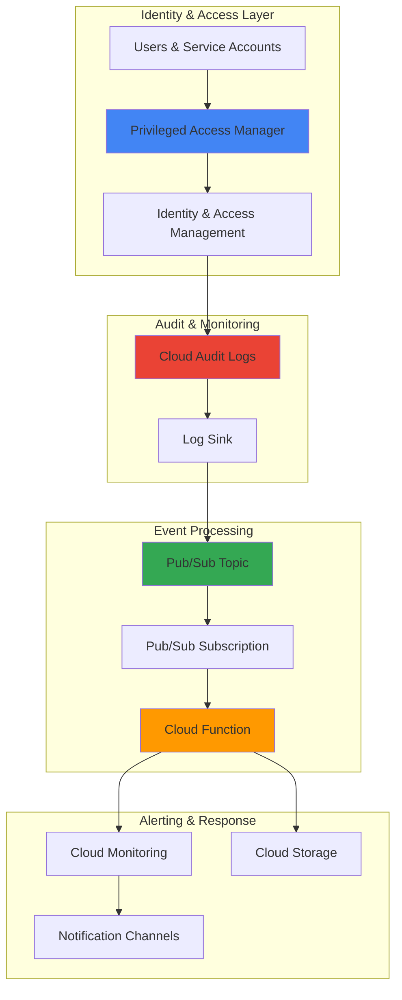

# Real-time Privilege Escalation Monitoring with PAM and Pub/Sub

## Problem

Organizations struggle to detect privilege escalation attacks and unauthorized access in real-time, leaving critical windows where malicious actors can abuse elevated permissions undetected. Traditional batch-based audit log analysis creates dangerous delays between security events and incident response, allowing attackers to establish persistence or exfiltrate sensitive data before security teams can respond.

## Solution

Implement real-time privilege escalation monitoring by streaming Cloud Audit Logs through Pub/Sub to immediately detect and alert on privileged access events. This approach combines Google Cloud's comprehensive audit logging with event-driven architecture to enable instant security alerting, automated response workflows, and continuous compliance monitoring for all IAM and privileged access activities.

## Architecture Diagram



## Prerequisites

1. Google Cloud project with billing enabled and appropriate IAM permissions
2. Google Cloud CLI installed and configured (or Cloud Shell access)
3. Basic understanding of IAM, audit logging, and event-driven architecture
4. Access to create IAM roles, log sinks, and Pub/Sub resources
5. Estimated cost: $2-5 per month for small-scale monitoring (varies by log volume)

> **Note**: This recipe follows Google Cloud security best practices and demonstrates enterprise-grade audit monitoring patterns recommended for compliance frameworks like SOC 2 and ISO 27001.

## Preparation

```bash
# Set environment variables for GCP resources
export PROJECT_ID=$(gcloud config get-value project)
export REGION="us-central1"
export ZONE="us-central1-a"

# Generate unique suffix for resource names
RANDOM_SUFFIX=$(openssl rand -hex 3)
export TOPIC_NAME="privilege-escalation-alerts-${RANDOM_SUFFIX}"
export SUBSCRIPTION_NAME="privilege-monitor-sub-${RANDOM_SUFFIX}"
export FUNCTION_NAME="privilege-alert-processor-${RANDOM_SUFFIX}"
export SINK_NAME="privilege-escalation-sink-${RANDOM_SUFFIX}"
export BUCKET_NAME="privilege-audit-logs-${PROJECT_ID}-${RANDOM_SUFFIX}"

# Set default project and region
gcloud config set project ${PROJECT_ID}
gcloud config set compute/region ${REGION}
gcloud config set functions/region ${REGION}

# Enable required APIs
gcloud services enable logging.googleapis.com \
    pubsub.googleapis.com \
    cloudfunctions.googleapis.com \
    monitoring.googleapis.com \
    storage.googleapis.com \
    privilegedaccessmanager.googleapis.com

echo "✅ Project configured: ${PROJECT_ID}"
echo "✅ Resources will use suffix: ${RANDOM_SUFFIX}"
```

## Steps

1. **Create Pub/Sub Topic for Real-time Audit Streaming**:

   Pub/Sub provides the scalable messaging infrastructure needed for real-time audit log processing. The topic acts as a buffer between audit log generation and processing, ensuring no security events are lost even during high-volume periods or downstream system maintenance.

   ```bash
   # Create Pub/Sub topic for privilege escalation alerts
   gcloud pubsub topics create ${TOPIC_NAME}
   
   # Create subscription for Cloud Function processing
   gcloud pubsub subscriptions create ${SUBSCRIPTION_NAME} \
       --topic=${TOPIC_NAME} \
       --ack-deadline=60 \
       --message-retention-duration=7d
   
   echo "✅ Pub/Sub topic and subscription created successfully"
   ```

   The Pub/Sub infrastructure is now ready to handle real-time audit log streams with proper message retention and acknowledgment handling to ensure reliable event processing.

2. **Configure Log Sink for Privileged Access Events**:

   Cloud Logging sinks enable real-time routing of specific audit logs to Pub/Sub. The filter captures all IAM-related activities, role bindings, service account operations, PAM grant requests, and access policy changes that could indicate privilege escalation attempts.

   ```bash
   # Create log sink to route IAM and PAM audit logs to Pub/Sub
   gcloud logging sinks create ${SINK_NAME} \
       pubsub.googleapis.com/projects/${PROJECT_ID}/topics/${TOPIC_NAME} \
       --log-filter='protoPayload.serviceName="iam.googleapis.com" OR
                     protoPayload.serviceName="cloudresourcemanager.googleapis.com" OR
                     protoPayload.serviceName="serviceusage.googleapis.com" OR
                     protoPayload.serviceName="privilegedaccessmanager.googleapis.com" OR
                     (protoPayload.methodName=~"setIamPolicy" OR
                      protoPayload.methodName=~"CreateRole" OR
                      protoPayload.methodName=~"UpdateRole" OR
                      protoPayload.methodName=~"CreateServiceAccount" OR
                      protoPayload.methodName=~"SetIamPolicy" OR
                      protoPayload.methodName=~"createGrant" OR
                      protoPayload.methodName=~"CreateGrant" OR
                      protoPayload.methodName=~"searchEntitlements")' \
       --project=${PROJECT_ID}
   
   echo "✅ Log sink created for privileged access monitoring"
   ```

   The log sink now automatically streams all privilege-related audit events including PAM grant activities to Pub/Sub in real-time, capturing the comprehensive security events needed for threat detection.

3. **Grant Pub/Sub Publisher Permissions to Log Sink**:

   Log sinks require explicit permissions to publish messages to Pub/Sub topics. Google Cloud automatically creates a service account for the sink, which must be granted the Publisher role to ensure secure and authorized message delivery.

   ```bash
   # Get the sink's service account
   SINK_SERVICE_ACCOUNT=$(gcloud logging sinks describe ${SINK_NAME} \
       --format="value(writerIdentity)")
   
   # Grant Pub/Sub Publisher role to the sink service account
   gcloud pubsub topics add-iam-policy-binding ${TOPIC_NAME} \
       --member="${SINK_SERVICE_ACCOUNT}" \
       --role="roles/pubsub.publisher"
   
   echo "✅ Sink service account granted Pub/Sub Publisher permissions"
   echo "Service Account: ${SINK_SERVICE_ACCOUNT}"
   ```

   The sink service account now has the minimum required permissions to publish audit logs to Pub/Sub, following the principle of least privilege for secure log routing.

4. **Create Cloud Storage Bucket for Alert Archive**:

   Cloud Storage provides durable, cost-effective storage for security event archives and audit trails. This bucket stores processed alerts for long-term retention, compliance reporting, and forensic analysis when investigating security incidents.

   ```bash
   # Create Cloud Storage bucket for alert archival
   gsutil mb -p ${PROJECT_ID} \
       -c STANDARD \
       -l ${REGION} \
       gs://${BUCKET_NAME}
   
   # Enable versioning for audit trail integrity
   gsutil versioning set on gs://${BUCKET_NAME}
   
   # Set lifecycle policy for cost optimization
   cat > lifecycle.json << EOF
   {
     "rule": [
       {
         "action": {"type": "SetStorageClass", "storageClass": "COLDLINE"},
         "condition": {"age": 30}
       },
       {
         "action": {"type": "SetStorageClass", "storageClass": "ARCHIVE"},
         "condition": {"age": 365}
       }
     ]
   }
   EOF
   
   gsutil lifecycle set lifecycle.json gs://${BUCKET_NAME}
   rm lifecycle.json
   
   echo "✅ Cloud Storage bucket created with lifecycle management"
   ```

   The storage bucket is configured with intelligent tiering to optimize costs while maintaining long-term audit trail integrity for compliance and forensic requirements.

5. **Deploy Cloud Function for Alert Processing**:

   Cloud Functions provides serverless event processing that automatically scales based on audit log volume. The function analyzes privilege escalation events, enriches alerts with context, and triggers appropriate notifications based on severity and risk assessment.

   ```bash
   # Create function source directory
   mkdir -p /tmp/privilege-monitor-function
   cd /tmp/privilege-monitor-function
   
   # Create main.py with alert processing logic
   cat > main.py << 'EOF'
   import json
   import base64
   import logging
   import os
   from datetime import datetime
   from google.cloud import storage
   from google.cloud import monitoring_v3
   
   # Configure logging
   logging.basicConfig(level=logging.INFO)
   logger = logging.getLogger(__name__)
   
   def process_privilege_alert(event, context):
       """Process privilege escalation events from Pub/Sub"""
       try:
           # Decode Pub/Sub message
           pubsub_message = base64.b64decode(event['data']).decode('utf-8')
           log_entry = json.loads(pubsub_message)
           
           # Extract audit log details
           proto_payload = log_entry.get('protoPayload', {})
           method_name = proto_payload.get('methodName', '')
           service_name = proto_payload.get('serviceName', '')
           principal_email = proto_payload.get('authenticationInfo', {}).get('principalEmail', 'Unknown')
           resource_name = proto_payload.get('resourceName', '')
           
           # Determine alert severity based on method and service
           severity = determine_severity(method_name, service_name, proto_payload)
           
           # Create alert object
           alert = {
               'timestamp': datetime.utcnow().isoformat(),
               'severity': severity,
               'principal': principal_email,
               'method': method_name,
               'service': service_name,
               'resource': resource_name,
               'raw_log': log_entry
           }
           
           # Log alert for monitoring
           logger.info(f"Privilege escalation detected: {severity} - {principal_email} - {method_name}")
           
           # Store alert in Cloud Storage
           store_alert(alert)
           
           # Send to Cloud Monitoring if high severity
           if severity in ['HIGH', 'CRITICAL']:
               send_monitoring_alert(alert)
               
           return 'Alert processed successfully'
           
       except Exception as e:
           logger.error(f"Error processing alert: {str(e)}")
           raise
   
   def determine_severity(method_name, service_name, proto_payload):
       """Determine alert severity based on the method, service, and context"""
       # Critical PAM operations
       critical_pam_methods = [
           'createGrant', 'CreateGrant', 'createEntitlement', 'CreateEntitlement'
       ]
       
       # High-risk IAM methods
       high_risk_methods = [
           'CreateRole', 'UpdateRole', 'DeleteRole',
           'CreateServiceAccount', 'SetIamPolicy'
       ]
       
       # Check for PAM-related activities
       if service_name == 'privilegedaccessmanager.googleapis.com':
           if any(method in method_name for method in critical_pam_methods):
               return 'CRITICAL'
           else:
               return 'HIGH'
       
       # Check for high-risk IAM operations
       if any(method in method_name for method in high_risk_methods):
           return 'HIGH'
       elif 'setIamPolicy' in method_name:
           return 'MEDIUM'
       else:
           return 'LOW'
   
   def store_alert(alert):
       """Store alert in Cloud Storage for audit trail"""
       try:
           client = storage.Client()
           bucket_name = os.environ.get('BUCKET_NAME', 'BUCKET_NAME_PLACEHOLDER')
           bucket = client.bucket(bucket_name)
           
           # Create filename with timestamp
           filename = f"alerts/{alert['timestamp'][:10]}/{alert['timestamp']}.json"
           blob = bucket.blob(filename)
           blob.upload_from_string(json.dumps(alert, indent=2))
           
       except Exception as e:
           logger.error(f"Failed to store alert: {str(e)}")
   
   def send_monitoring_alert(alert):
       """Send high-severity alerts to Cloud Monitoring"""
       try:
           client = monitoring_v3.MetricServiceClient()
           project_name = f"projects/{os.environ.get('GCP_PROJECT', 'unknown')}"
           
           # Create custom metric for privilege escalation
           series = monitoring_v3.TimeSeries()
           series.metric.type = "custom.googleapis.com/security/privilege_escalation"
           series.resource.type = "global"
           
           point = series.points.add()
           point.value.int64_value = 1
           point.interval.end_time.seconds = int(datetime.utcnow().timestamp())
           
           client.create_time_series(name=project_name, time_series=[series])
           
       except Exception as e:
           logger.error(f"Failed to send monitoring alert: {str(e)}")
   EOF
   
   # Create requirements.txt
   cat > requirements.txt << EOF
   google-cloud-storage==2.10.0
   google-cloud-monitoring==2.16.0
   EOF
   
   # Deploy Cloud Function with environment variables
   gcloud functions deploy ${FUNCTION_NAME} \
       --runtime python39 \
       --trigger-topic ${TOPIC_NAME} \
       --source . \
       --entry-point process_privilege_alert \
       --memory 256MB \
       --timeout 60s \
       --max-instances 10 \
       --set-env-vars "BUCKET_NAME=${BUCKET_NAME},GCP_PROJECT=${PROJECT_ID}"
   
   echo "✅ Cloud Function deployed for privilege escalation processing"
   cd - > /dev/null
   ```

   The Cloud Function is now deployed with comprehensive alert processing logic, automatic scaling, and integration with Cloud Storage and Monitoring for complete security event handling.

6. **Create Cloud Monitoring Alert Policy**:

   Cloud Monitoring provides enterprise-grade alerting capabilities with customizable notification channels. The alert policy triggers when privilege escalation events exceed defined thresholds, enabling immediate incident response and automated security workflows.

   ```bash
   # Create alert policy for privilege escalation events
   cat > alert-policy.json << EOF
   {
     "displayName": "Privilege Escalation Detection",
     "conditions": [
       {
         "displayName": "High privilege escalation rate",
         "conditionThreshold": {
           "filter": "metric.type=\"custom.googleapis.com/security/privilege_escalation\"",
           "comparison": "COMPARISON_GREATER_THAN",
           "thresholdValue": 2,
           "duration": "300s",
           "aggregations": [
             {
               "alignmentPeriod": "300s",
               "perSeriesAligner": "ALIGN_RATE"
             }
           ]
         }
       }
     ],
     "combiner": "OR",
     "enabled": true,
     "notificationChannels": [],
     "documentation": {
       "content": "Alert triggered when privilege escalation events exceed 2 per 5-minute window"
     }
   }
   EOF
   
   # Create the alert policy
   gcloud alpha monitoring policies create --policy-from-file=alert-policy.json
   
   echo "✅ Cloud Monitoring alert policy created"
   rm alert-policy.json
   ```

   The monitoring alert policy is configured to detect suspicious privilege escalation patterns and can be integrated with notification channels for immediate security team alerts.

## Validation & Testing

1. **Verify Pub/Sub topic and subscription creation**:

   ```bash
   # Check topic and subscription status
   gcloud pubsub topics describe ${TOPIC_NAME}
   gcloud pubsub subscriptions describe ${SUBSCRIPTION_NAME}
   ```

   Expected output: Topic and subscription details with creation timestamps and configuration.

2. **Test log sink configuration and filtering**:

   ```bash
   # Verify log sink is routing to Pub/Sub
   gcloud logging sinks describe ${SINK_NAME}
   
   # Check recent IAM audit logs
   gcloud logging read 'protoPayload.serviceName="iam.googleapis.com"' \
       --limit=5 \
       --format="value(timestamp,protoPayload.methodName,protoPayload.authenticationInfo.principalEmail)"
   ```

   Expected output: Sink details showing Pub/Sub destination and recent IAM activity logs.

3. **Generate test privilege escalation event**:

   ```bash
   # Create test IAM role to trigger audit logs
   gcloud iam roles create testPrivilegeRole${RANDOM_SUFFIX} \
       --project=${PROJECT_ID} \
       --title="Test Privilege Role" \
       --description="Test role for privilege escalation monitoring" \
       --permissions="storage.objects.get"
   
   # Wait for log processing
   sleep 30
   
   # Check Cloud Function logs for processing
   gcloud functions logs read ${FUNCTION_NAME} --limit=10
   ```

   Expected output: Function logs showing successful processing of the IAM role creation event.

4. **Test PAM entitlement search (if PAM is configured)**:

   ```bash
   # Search for available PAM entitlements
   gcloud pam entitlements search \
       --caller-access-type=grant-requester \
       --location=global \
       --project=${PROJECT_ID} || echo "No PAM entitlements found (expected if PAM not configured)"
   ```

   Expected output: List of available entitlements or message indicating no entitlements found.

5. **Verify alert storage in Cloud Storage**:

   ```bash
   # Check for stored alerts
   gsutil ls -r gs://${BUCKET_NAME}/alerts/ 2>/dev/null || echo "No alerts stored yet"
   
   # View recent alert (if exists)
   LATEST_ALERT=$(gsutil ls gs://${BUCKET_NAME}/alerts/$(date +%Y-%m-%d)/ 2>/dev/null | head -1)
   if [ ! -z "$LATEST_ALERT" ]; then
       gsutil cat "$LATEST_ALERT"
   fi
   ```

   Expected output: Alert files in Cloud Storage with JSON-formatted security event data.

## Cleanup

1. **Remove test IAM role**:

   ```bash
   # Delete test role created during validation
   gcloud iam roles delete testPrivilegeRole${RANDOM_SUFFIX} \
       --project=${PROJECT_ID} \
       --quiet
   
   echo "✅ Test IAM role removed"
   ```

2. **Delete Cloud Function and associated resources**:

   ```bash
   # Delete Cloud Function
   gcloud functions delete ${FUNCTION_NAME} \
       --region=${REGION} \
       --quiet
   
   echo "✅ Cloud Function deleted"
   ```

3. **Remove log sink and Pub/Sub resources**:

   ```bash
   # Delete log sink
   gcloud logging sinks delete ${SINK_NAME} --quiet
   
   # Delete Pub/Sub subscription and topic
   gcloud pubsub subscriptions delete ${SUBSCRIPTION_NAME} --quiet
   gcloud pubsub topics delete ${TOPIC_NAME} --quiet
   
   echo "✅ Log sink and Pub/Sub resources deleted"
   ```

4. **Remove Cloud Storage bucket and monitoring policy**:

   ```bash
   # Delete Cloud Storage bucket and contents
   gsutil -m rm -r gs://${BUCKET_NAME}
   
   # List and delete custom alert policies (manual cleanup required)
   echo "Remaining alert policies (manual deletion required):"
   gcloud alpha monitoring policies list \
       --filter="displayName:'Privilege Escalation Detection'" \
       --format="value(name)" | while read policy; do
       echo "Delete: $policy"
   done
   
   echo "✅ Storage bucket deleted"
   echo "Note: Manually delete alert policies from Cloud Monitoring console"
   ```

5. **Clean up environment variables**:

   ```bash
   # Clear environment variables
   unset TOPIC_NAME SUBSCRIPTION_NAME FUNCTION_NAME SINK_NAME BUCKET_NAME RANDOM_SUFFIX
   
   echo "✅ Environment variables cleared"
   ```

## Discussion

This recipe demonstrates how to implement enterprise-grade privilege escalation monitoring using Google Cloud's native audit logging and event-driven architecture. The solution provides real-time detection capabilities that are essential for modern security operations, particularly in environments where privileged access abuse represents a critical threat vector.

The architecture leverages Cloud Audit Logs as the authoritative source of security events, capturing all IAM-related activities with comprehensive metadata including principal identity, resource context, and method details. The enhanced log filtering now includes Google Cloud's Privileged Access Manager (PAM) service, which provides just-in-time access capabilities and generates critical audit events for grant requests and entitlement operations. By routing these logs through Pub/Sub, the system achieves near real-time processing while maintaining durability and ordered delivery guarantees.

Cloud Functions serve as the intelligent processing layer, analyzing each privilege escalation event and applying risk-based classification. The function enriches alerts with contextual information and implements severity-based routing to ensure critical security events receive immediate attention. The enhanced severity determination logic specifically identifies PAM-related activities as critical or high-priority events, recognizing their importance in privilege escalation scenarios. Integration with Cloud Storage provides long-term audit trail retention for compliance frameworks like SOC 2, PCI DSS, and ISO 27001, while Cloud Monitoring enables integration with existing security operations workflows.

The log sink filtering demonstrates advanced audit log analysis, capturing not only direct IAM operations but also related activities across Cloud Resource Manager, Service Usage APIs, and the new Privileged Access Manager service that could indicate privilege escalation attempts. This comprehensive approach ensures detection of sophisticated attack patterns that span multiple Google Cloud services and APIs, including modern just-in-time privilege elevation scenarios.

> **Tip**: Extend the monitoring scope by including additional Google Cloud services in the log sink filter, such as Compute Engine for VM-based privilege escalation or GKE for container-based security events. Consider integrating with Google Cloud Security Command Center for enhanced threat correlation.

**Documentation References:**
- [Google Cloud Audit Logs Overview](https://cloud.google.com/logging/docs/audit) - Comprehensive guide to audit logging capabilities
- [Cloud Logging Sinks Configuration](https://cloud.google.com/logging/docs/export/configure_export_v2) - Log routing and sink management
- [Privileged Access Manager Documentation](https://cloud.google.com/iam/docs/pam-overview) - PAM service overview and configuration
- [PAM Grant Request Documentation](https://cloud.google.com/iam/docs/pam-request-temporary-elevated-access) - Grant management and CLI commands
- [Pub/Sub Security Best Practices](https://cloud.google.com/pubsub/docs/security) - Messaging security patterns
- [Cloud Functions Security Guide](https://cloud.google.com/functions/docs/securing) - Serverless function security
- [Cloud Monitoring Custom Metrics](https://cloud.google.com/monitoring/custom-metrics) - Custom metric creation and alerting

## Challenge

Extend this solution by implementing these security enhancements:

1. **Advanced PAM Integration**: Configure PAM entitlements and test grant workflows to generate more comprehensive privilege escalation events, including automated approval workflows and just-in-time access patterns.

2. **Enhanced Threat Detection**: Integrate with Security Command Center to correlate privilege escalation events with other security findings and create comprehensive threat intelligence, including detection of privilege escalation chains.

3. **Automated Response Workflows**: Use Cloud Workflows to implement automated incident response, including privilege revocation, account suspension, and stakeholder notification based on alert severity and PAM grant patterns.

4. **Machine Learning Anomaly Detection**: Implement Vertex AI to analyze privilege access patterns and detect anomalous behavior that might indicate compromised accounts or insider threats, especially focusing on unusual PAM grant request patterns.

5. **Cross-Project PAM Monitoring**: Extend the solution to monitor privilege escalation across multiple Google Cloud projects using organization-level audit log aggregation and centralized PAM entitlement monitoring.

## Infrastructure Code

*Infrastructure code will be generated after recipe approval.*