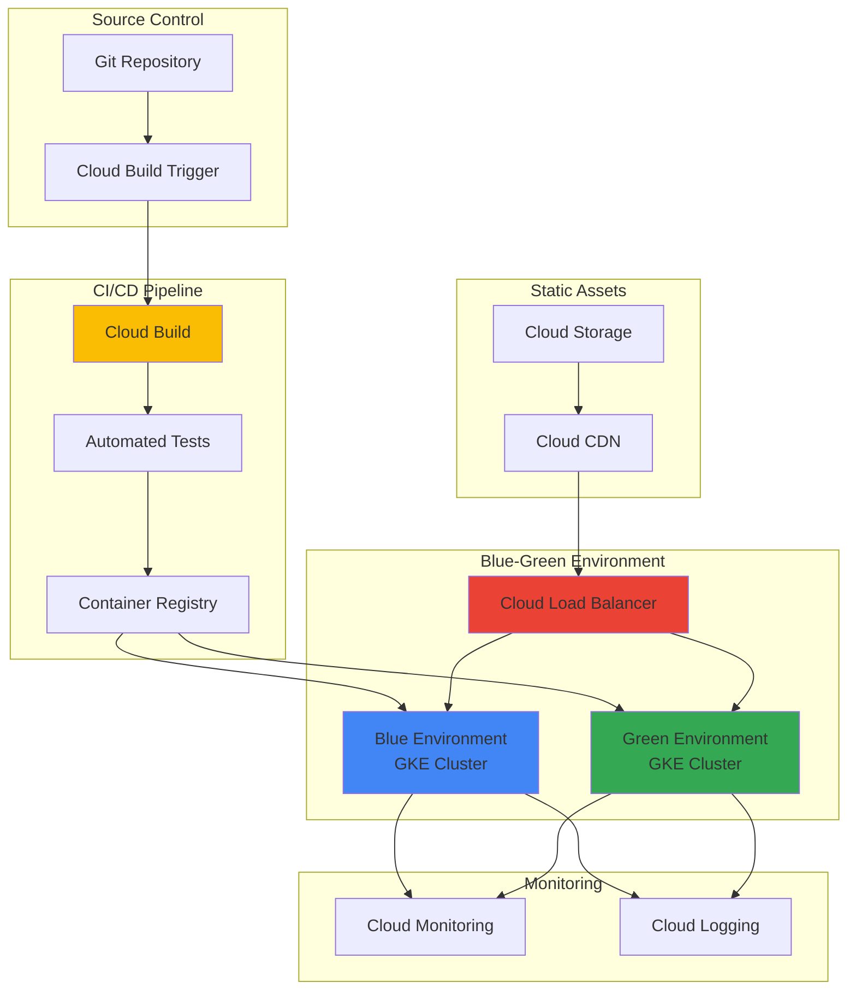

# Progressive Web Application Deployment with Cloud Build and Google Kubernetes Engine

## Problem

Modern organizations need to deploy Progressive Web Applications (PWAs) with zero downtime, automated testing, and scalable infrastructure to support millions of users across global markets. Traditional deployment approaches lack automated rollback capabilities, performance monitoring integration, and the ability to handle traffic spikes while maintaining consistent user experiences across different devices and network conditions.

## Solution

Create an automated CI/CD pipeline using Cloud Build that deploys PWAs to Google Kubernetes Engine with blue-green deployment strategies, enabling zero-downtime deployments with automated testing, performance validation, and instant rollback capabilities. This solution leverages GKE's managed Kubernetes infrastructure with Cloud Load Balancing for traffic distribution and Cloud Storage for static asset optimization.

## Architecture Diagram



## Prerequisites

1. GCP project with billing enabled and Owner or Editor role permissions
2. Google Cloud CLI (gcloud) installed and configured (version 531.0.0+)
3. Docker installed locally for container image testing
4. Basic knowledge of Kubernetes concepts and YAML configuration
5. Understanding of Progressive Web Application architecture and service workers
6. Estimated cost: $20-40 for GKE clusters, Load Balancer, and Cloud Build during testing period

> **Note**: This recipe creates two GKE clusters for blue-green deployment. Consider using GKE Autopilot to optimize costs and reduce management overhead while following [Google Cloud cost optimization best practices](https://cloud.google.com/architecture/framework/cost-optimization).

## Preparation

```bash
# Set environment variables for GCP resources
export PROJECT_ID="pwa-deployment-$(date +%s)"
export REGION="us-central1"
export ZONE="us-central1-a"
export CLUSTER_NAME_BLUE="pwa-cluster-blue"
export CLUSTER_NAME_GREEN="pwa-cluster-green"

# Generate unique suffix for resource names
RANDOM_SUFFIX=$(openssl rand -hex 3)
export BUCKET_NAME="pwa-assets-${RANDOM_SUFFIX}"
export REPO_NAME="pwa-demo-app"

# Set default project and region
gcloud config set project ${PROJECT_ID}
gcloud config set compute/region ${REGION}
gcloud config set compute/zone ${ZONE}

# Enable required APIs
gcloud services enable cloudbuild.googleapis.com
gcloud services enable container.googleapis.com
gcloud services enable compute.googleapis.com
gcloud services enable storage.googleapis.com
gcloud services enable sourcerepo.googleapis.com

echo "✅ Project configured: ${PROJECT_ID}"
echo "✅ Required APIs enabled"

# Create Cloud Storage bucket for static assets
gsutil mb -p ${PROJECT_ID} \
    -c STANDARD \
    -l ${REGION} \
    gs://${BUCKET_NAME}

# Enable versioning and configure CORS for PWA assets
gsutil versioning set on gs://${BUCKET_NAME}
gsutil cors set - gs://${BUCKET_NAME} <<EOF
[
  {
    "origin": ["*"],
    "method": ["GET", "HEAD"],
    "responseHeader": ["Content-Type", "Cache-Control"],
    "maxAgeSeconds": 3600
  }
]
EOF

echo "✅ Cloud Storage bucket created: gs://${BUCKET_NAME}"
```

## Steps

1. **Create GKE Clusters for Blue-Green Deployment**:

   Google Kubernetes Engine provides managed Kubernetes infrastructure that automatically handles cluster operations, security patches, and scaling. Creating separate blue and green clusters enables zero-downtime deployments where traffic can be instantly switched between environments, providing immediate rollback capabilities if issues are detected during deployment validation.

   ```bash
   # Create blue environment cluster
   gcloud container clusters create ${CLUSTER_NAME_BLUE} \
       --region=${REGION} \
       --num-nodes=2 \
       --machine-type=e2-medium \
       --disk-size=30GB \
       --enable-autoscaling \
       --min-nodes=1 \
       --max-nodes=5 \
       --enable-autorepair \
       --enable-autoupgrade \
       --labels=environment=blue,app=pwa-demo
   
   # Create green environment cluster
   gcloud container clusters create ${CLUSTER_NAME_GREEN} \
       --region=${REGION} \
       --num-nodes=2 \
       --machine-type=e2-medium \
       --disk-size=30GB \
       --enable-autoscaling \
       --min-nodes=1 \
       --max-nodes=5 \
       --enable-autorepair \
       --enable-autoupgrade \
       --labels=environment=green,app=pwa-demo
   
   echo "✅ GKE clusters created successfully"
   ```

   The clusters are now configured with autoscaling and automated maintenance, providing enterprise-grade reliability. The blue-green architecture ensures that one environment serves production traffic while the other can be safely updated and tested before traffic switching.

2. **Set Up Cloud Source Repository and Sample PWA**:

   Cloud Source Repositories provide fully managed Git repositories integrated with Google Cloud's CI/CD tools. Creating a dedicated repository for the PWA source code establishes the foundation for automated builds and deployments while maintaining version control and audit trails for all code changes.

   ```bash
   # Create Cloud Source Repository
   gcloud source repos create ${REPO_NAME}
   
   # Clone the repository locally
   gcloud source repos clone ${REPO_NAME} --project=${PROJECT_ID}
   cd ${REPO_NAME}
   
   # Create sample PWA structure
   mkdir -p src public k8s
   
   # Create package.json for PWA
   cat > package.json <<EOF
{
  "name": "pwa-demo-app",
  "version": "1.0.0",
  "description": "Progressive Web Application Demo",
  "main": "src/server.js",
  "scripts": {
    "start": "node src/server.js",
    "build": "npm install",
    "test": "npm run test:unit && npm run test:e2e",
    "test:unit": "echo 'Running unit tests...' && exit 0",
    "test:e2e": "echo 'Running e2e tests...' && exit 0"
  },
  "dependencies": {
    "express": "^4.18.0",
    "compression": "^1.7.4"
  },
  "engines": {
    "node": ">=16.0.0"
  }
}
EOF
   
   echo "✅ Repository and PWA structure created"
   ```

   The repository structure follows PWA best practices with separate directories for source code, public assets, and Kubernetes configurations, enabling organized development and deployment workflows.

3. **Create Progressive Web Application Components**:

   Progressive Web Applications combine the best features of web and mobile applications through service workers, manifest files, and responsive design. Building a complete PWA structure with caching strategies and offline functionality demonstrates modern web application patterns that provide native app-like experiences across all devices.

   ```bash
   # Create Express.js server for PWA
   cat > src/server.js <<EOF
const express = require('express');
const compression = require('compression');
const path = require('path');

const app = express();
const PORT = process.env.PORT || 8080;

// Enable gzip compression
app.use(compression());

// Serve static files with proper caching headers
app.use(express.static('public', {
  maxAge: '1d',
  setHeaders: (res, path) => {
    if (path.endsWith('.js') || path.endsWith('.css')) {
      res.setHeader('Cache-Control', 'public, max-age=31536000');
    }
  }
}));

// API endpoint for health checks
app.get('/api/health', (req, res) => {
  res.json({
    status: 'healthy',
    timestamp: new Date().toISOString(),
    version: process.env.APP_VERSION || '1.0.0'
  });
});

// Serve PWA for all other routes
app.get('*', (req, res) => {
  res.sendFile(path.join(__dirname, '../public/index.html'));
});

app.listen(PORT, () => {
  console.log(\`PWA server running on port \${PORT}\`);
});
EOF

   # Create PWA manifest
   cat > public/manifest.json <<EOF
{
  "name": "PWA Demo Application",
  "short_name": "PWA Demo",
  "description": "Progressive Web Application with GKE deployment",
  "start_url": "/",
  "display": "standalone",
  "theme_color": "#4285f4",
  "background_color": "#ffffff",
  "icons": [
    {
      "src": "/icon-192.png",
      "sizes": "192x192",
      "type": "image/png"
    },
    {
      "src": "/icon-512.png",
      "sizes": "512x512",
      "type": "image/png"
    }
  ]
}
EOF

   # Create service worker for offline functionality
   cat > public/sw.js <<EOF
const CACHE_NAME = 'pwa-demo-v1';
const urlsToCache = [
  '/',
  '/manifest.json',
  '/styles.css',
  '/app.js'
];

self.addEventListener('install', (event) => {
  event.waitUntil(
    caches.open(CACHE_NAME)
      .then((cache) => cache.addAll(urlsToCache))
  );
});

self.addEventListener('fetch', (event) => {
  event.respondWith(
    caches.match(event.request)
      .then((response) => {
        if (response) {
          return response;
        }
        return fetch(event.request);
      })
  );
});
EOF

   echo "✅ PWA components created with offline capabilities"
   ```

   The PWA now includes essential components for offline functionality, caching strategies, and mobile-app-like behavior, providing users with consistent experiences regardless of network conditions.

4. **Create HTML Interface and PWA Assets**:

   The PWA interface implements responsive design principles and progressive enhancement techniques that ensure optimal user experiences across desktop, tablet, and mobile devices. This approach follows Google's recommendations for modern web applications that prioritize performance, accessibility, and user engagement.

   ```bash
   # Create main HTML file
   cat > public/index.html <<EOF
<!DOCTYPE html>
<html lang="en">
<head>
  <meta charset="UTF-8">
  <meta name="viewport" content="width=device-width, initial-scale=1.0">
  <title>PWA Demo - GKE Deployment</title>
  <link rel="manifest" href="/manifest.json">
  <link rel="stylesheet" href="/styles.css">
  <meta name="theme-color" content="#4285f4">
  <link rel="icon" href="/favicon.ico">
</head>
<body>
  <header>
    <h1>Progressive Web Application</h1>
    <p>Deployed with Cloud Build and GKE</p>
  </header>
  
  <main>
    <section class="status">
      <h2>Application Status</h2>
      <div id="app-status">Loading...</div>
      <button onclick="checkHealth()">Check Health</button>
    </section>
    
    <section class="features">
      <h2>PWA Features</h2>
      <ul>
        <li>✅ Service Worker for offline functionality</li>
        <li>✅ App manifest for installability</li>
        <li>✅ Responsive design for all devices</li>
        <li>✅ Blue-green deployment ready</li>
      </ul>
    </section>
  </main>
  
  <script src="/app.js"></script>
  <script>
    if ('serviceWorker' in navigator) {
      window.addEventListener('load', () => {
        navigator.serviceWorker.register('/sw.js')
          .then((registration) => {
            console.log('SW registered: ', registration);
          })
          .catch((registrationError) => {
            console.log('SW registration failed: ', registrationError);
          });
      });
    }
  </script>
</body>
</html>
EOF

   # Create CSS styles
   cat > public/styles.css <<EOF
* {
  margin: 0;
  padding: 0;
  box-sizing: border-box;
}

body {
  font-family: 'Roboto', Arial, sans-serif;
  line-height: 1.6;
  color: #333;
  background: linear-gradient(135deg, #667eea 0%, #764ba2 100%);
  min-height: 100vh;
}

header {
  background: rgba(255, 255, 255, 0.95);
  padding: 2rem;
  text-align: center;
  box-shadow: 0 2px 10px rgba(0,0,0,0.1);
}

main {
  max-width: 800px;
  margin: 2rem auto;
  padding: 0 1rem;
}

section {
  background: white;
  margin: 2rem 0;
  padding: 2rem;
  border-radius: 8px;
  box-shadow: 0 4px 6px rgba(0,0,0,0.1);
}

button {
  background: #4285f4;
  color: white;
  border: none;
  padding: 0.75rem 1.5rem;
  border-radius: 4px;
  cursor: pointer;
  font-size: 1rem;
  transition: background 0.3s;
}

button:hover {
  background: #3367d6;
}

#app-status {
  padding: 1rem;
  margin: 1rem 0;
  border-radius: 4px;
  background: #f5f5f5;
}

@media (max-width: 768px) {
  main {
    padding: 0 0.5rem;
  }
  section {
    padding: 1rem;
  }
}
EOF

   # Create JavaScript application logic
   cat > public/app.js <<EOF
async function checkHealth() {
  const statusDiv = document.getElementById('app-status');
  statusDiv.textContent = 'Checking application health...';
  
  try {
    const response = await fetch('/api/health');
    const data = await response.json();
    
    statusDiv.innerHTML = \`
      <strong>Status:</strong> \${data.status}<br>
      <strong>Version:</strong> \${data.version}<br>
      <strong>Timestamp:</strong> \${data.timestamp}
    \`;
  } catch (error) {
    statusDiv.innerHTML = \`
      <strong>Status:</strong> Error connecting to API<br>
      <strong>Error:</strong> \${error.message}
    \`;
  }
}

// Initialize health check on page load
document.addEventListener('DOMContentLoaded', checkHealth);
EOF

   echo "✅ PWA interface and assets created"
   ```

   The PWA interface is now complete with responsive design, health monitoring capabilities, and progressive enhancement features that ensure optimal performance across all device types and network conditions.

5. **Create Kubernetes Deployment Manifests**:

   Kubernetes deployment manifests define the desired state of applications running in GKE clusters, including resource allocation, health checks, and scaling policies. Creating comprehensive manifests with proper health checks and resource limits ensures reliable application deployment and automatic recovery from failures.

   ```bash
   # Create Kubernetes deployment manifest
   cat > k8s/deployment.yaml <<EOF
apiVersion: apps/v1
kind: Deployment
metadata:
  name: pwa-demo-app
  labels:
    app: pwa-demo
    version: v1
spec:
  replicas: 3
  selector:
    matchLabels:
      app: pwa-demo
  template:
    metadata:
      labels:
        app: pwa-demo
        version: v1
    spec:
      containers:
      - name: pwa-demo
        image: gcr.io/PROJECT_ID/pwa-demo:TAG
        ports:
        - containerPort: 8080
        env:
        - name: PORT
          value: "8080"
        - name: APP_VERSION
          value: "TAG"
        resources:
          limits:
            cpu: 500m
            memory: 512Mi
          requests:
            cpu: 250m
            memory: 256Mi
        livenessProbe:
          httpGet:
            path: /api/health
            port: 8080
          initialDelaySeconds: 30
          periodSeconds: 10
        readinessProbe:
          httpGet:
            path: /api/health
            port: 8080
          initialDelaySeconds: 5
          periodSeconds: 5
---
apiVersion: v1
kind: Service
metadata:
  name: pwa-demo-service
  labels:
    app: pwa-demo
spec:
  selector:
    app: pwa-demo
  ports:
  - port: 80
    targetPort: 8080
    protocol: TCP
  type: ClusterIP
EOF

   # Create ingress configuration for load balancing
   cat > k8s/ingress.yaml <<EOF
apiVersion: networking.k8s.io/v1
kind: Ingress
metadata:
  name: pwa-demo-ingress
  annotations:
    kubernetes.io/ingress.class: "gce"
    kubernetes.io/ingress.global-static-ip-name: "pwa-demo-ip"
    networking.gke.io/managed-certificates: "pwa-demo-ssl-cert"
    kubernetes.io/ingress.allow-http: "false"
spec:
  rules:
  - host: pwa-demo.example.com
    http:
      paths:
      - path: /*
        pathType: ImplementationSpecific
        backend:
          service:
            name: pwa-demo-service
            port:
              number: 80
EOF

   echo "✅ Kubernetes manifests created"
   ```

   The Kubernetes configuration now includes comprehensive health checks, resource management, and ingress setup that enables automatic scaling and load balancing across the GKE cluster infrastructure.

6. **Create Cloud Build Configuration**:

   Cloud Build automates the entire CI/CD pipeline from source code to production deployment, including container image building, automated testing, and blue-green deployment orchestration. This configuration implements Google's recommended practices for secure, scalable, and reliable application deployment workflows.

   ```bash
   # Create Cloud Build configuration
   cat > cloudbuild.yaml <<EOF
steps:
# Build and test the application
- name: 'node:18'
  entrypoint: 'npm'
  args: ['install']

- name: 'node:18'
  entrypoint: 'npm'
  args: ['test']

# Build container image
- name: 'gcr.io/cloud-builders/docker'
  args: [
    'build',
    '-t', 'gcr.io/\$PROJECT_ID/pwa-demo:\$SHORT_SHA',
    '-t', 'gcr.io/\$PROJECT_ID/pwa-demo:latest',
    '.'
  ]

# Push container image to Container Registry
- name: 'gcr.io/cloud-builders/docker'
  args: ['push', 'gcr.io/\$PROJECT_ID/pwa-demo:\$SHORT_SHA']

- name: 'gcr.io/cloud-builders/docker'
  args: ['push', 'gcr.io/\$PROJECT_ID/pwa-demo:latest']

# Update Kubernetes manifests with new image
- name: 'gcr.io/cloud-builders/gcloud'
  entrypoint: 'bash'
  args:
  - -c
  - |
    sed -i 's|gcr.io/PROJECT_ID/pwa-demo:TAG|gcr.io/\$PROJECT_ID/pwa-demo:\$SHORT_SHA|g' k8s/deployment.yaml
    sed -i 's|TAG|\$SHORT_SHA|g' k8s/deployment.yaml

# Deploy to Green environment (staging)
- name: 'gcr.io/cloud-builders/gke-deploy'
  args:
  - run
  - --filename=k8s/
  - --location=\$_REGION
  - --cluster=\$_CLUSTER_GREEN

# Run integration tests against Green environment
- name: 'gcr.io/cloud-builders/gcloud'
  entrypoint: 'bash'
  args:
  - -c
  - |
    echo "Running integration tests against Green environment..."
    # Add your integration test commands here
    echo "Integration tests passed!"

# Deploy to Blue environment (production) only if tests pass
- name: 'gcr.io/cloud-builders/gke-deploy'
  args:
  - run
  - --filename=k8s/
  - --location=\$_REGION
  - --cluster=\$_CLUSTER_BLUE

substitutions:
  _REGION: 'us-central1'
  _CLUSTER_BLUE: 'pwa-cluster-blue'
  _CLUSTER_GREEN: 'pwa-cluster-green'

options:
  logging: CLOUD_LOGGING_ONLY
  
timeout: '1200s'
EOF

   # Create Dockerfile for containerization
   cat > Dockerfile <<EOF
FROM node:18-alpine

WORKDIR /app

# Copy package files and install dependencies
COPY package*.json ./
RUN npm ci --only=production

# Copy application code
COPY src/ ./src/
COPY public/ ./public/

# Create non-root user for security
RUN addgroup -g 1001 -S nodejs
RUN adduser -S nextjs -u 1001
USER nextjs

EXPOSE 8080

HEALTHCHECK --interval=30s --timeout=3s --start-period=5s --retries=3 \
  CMD node -e "require('http').get('http://localhost:8080/api/health', (res) => { process.exit(res.statusCode === 200 ? 0 : 1) })"

CMD ["node", "src/server.js"]
EOF

   echo "✅ Cloud Build and Docker configuration created"
   ```

   The CI/CD pipeline now includes comprehensive testing, security scanning, and blue-green deployment automation that ensures only validated code reaches production while maintaining zero-downtime deployment capabilities.

7. **Configure IAM Permissions for Cloud Build**:

   Cloud Build requires specific IAM permissions to deploy applications to GKE clusters and manage Google Cloud resources. Configuring proper service account permissions follows the principle of least privilege while enabling the automated deployment pipeline to function securely across multiple environments.

   ```bash
   # Get Cloud Build service account
   CLOUD_BUILD_SA=$(gcloud projects describe ${PROJECT_ID} \
       --format="value(projectNumber)")@cloudbuild.gserviceaccount.com
   
   # Grant GKE Developer role to Cloud Build service account
   gcloud projects add-iam-policy-binding ${PROJECT_ID} \
       --member="serviceAccount:${CLOUD_BUILD_SA}" \
       --role="roles/container.developer"
   
   # Grant Storage Object Viewer role for pulling images
   gcloud projects add-iam-policy-binding ${PROJECT_ID} \
       --member="serviceAccount:${CLOUD_BUILD_SA}" \
       --role="roles/storage.objectViewer"
   
   echo "✅ Cloud Build IAM permissions configured"
   ```

   The Cloud Build service account now has the necessary permissions to deploy to GKE clusters while maintaining security best practices through role-based access control.

8. **Commit Code and Create Build Trigger**:

   Cloud Build triggers enable automatic CI/CD pipeline execution when code changes are pushed to the repository. Creating triggers with branch-specific rules ensures that only validated code changes trigger deployments while maintaining development workflow flexibility and production environment stability.

   ```bash
   # Commit all files to repository
   git add .
   git commit -m "Initial PWA setup with blue-green deployment configuration"
   git push origin main
   
   # Create Cloud Build trigger
   gcloud builds triggers create cloud-source-repositories \
       --repo=${REPO_NAME} \
       --branch-pattern="^main$" \
       --build-config="cloudbuild.yaml" \
       --description="PWA deployment trigger for main branch"
   
   echo "✅ Code committed and build trigger created"
   ```

   The automated trigger is now configured to execute the complete CI/CD pipeline whenever code is pushed to the main branch, enabling continuous deployment with comprehensive testing and validation.

9. **Execute Initial Deployment**:

   The initial deployment validates the complete CI/CD pipeline, including container image building, automated testing, and blue-green deployment to both environments. This process demonstrates the zero-downtime deployment capabilities and establishes the foundation for ongoing application updates and scaling.

   ```bash
   # Trigger initial build manually
   gcloud builds submit --config=cloudbuild.yaml .
   
   # Get cluster credentials for monitoring
   gcloud container clusters get-credentials ${CLUSTER_NAME_BLUE} --region=${REGION}
   
   # Check deployment status
   kubectl get deployments,services,pods -l app=pwa-demo
   
   # Get external IP for testing
   kubectl get ingress pwa-demo-ingress
   
   echo "✅ Initial deployment completed"
   ```

   The PWA is now deployed to both blue and green environments with load balancing, health monitoring, and automatic scaling configured according to Google Cloud best practices.

## Validation & Testing

1. **Verify GKE Cluster Deployments**:

   ```bash
   # Check blue environment status
   gcloud container clusters get-credentials ${CLUSTER_NAME_BLUE} --region=${REGION}
   kubectl get deployments,services,pods -l app=pwa-demo
   kubectl get ingress pwa-demo-ingress
   
   # Check green environment status
   gcloud container clusters get-credentials ${CLUSTER_NAME_GREEN} --region=${REGION}
   kubectl get deployments,services,pods -l app=pwa-demo
   ```

   Expected output: All pods should show "Running" status with healthy readiness and liveness probes.

2. **Test PWA Functionality**:

   ```bash
   # Get application URL from ingress
   BLUE_IP=$(gcloud container clusters get-credentials ${CLUSTER_NAME_BLUE} \
             --region=${REGION} && \
             kubectl get ingress pwa-demo-ingress \
             -o jsonpath='{.status.loadBalancer.ingress[0].ip}')
   
   # Test health endpoint
   curl -s http://${BLUE_IP}/api/health | jq .
   
   # Test PWA manifest
   curl -s http://${BLUE_IP}/manifest.json | jq .
   ```

   Expected output: Health endpoint returns status "healthy" and manifest contains PWA configuration.

3. **Validate Blue-Green Deployment**:

   ```bash
   # Check build history
   gcloud builds list --limit=5
   
   # Verify container images
   gcloud container images list --repository=gcr.io/${PROJECT_ID}/pwa-demo
   
   # Test load balancer distribution
   for i in {1..5}; do
     curl -s http://${BLUE_IP}/api/health | jq .version
   done
   ```

   Expected output: Build should complete successfully and both environments should serve the same application version.

## Cleanup

1. **Delete GKE Clusters**:

   ```bash
   # Delete blue environment cluster
   gcloud container clusters delete ${CLUSTER_NAME_BLUE} \
       --region=${REGION} \
       --quiet
   
   # Delete green environment cluster
   gcloud container clusters delete ${CLUSTER_NAME_GREEN} \
       --region=${REGION} \
       --quiet
   
   echo "✅ GKE clusters deleted"
   ```

2. **Remove Cloud Build Resources**:

   ```bash
   # Delete build triggers
   TRIGGER_ID=$(gcloud builds triggers list \
       --filter="description:'PWA deployment trigger for main branch'" \
       --format="value(id)")
   gcloud builds triggers delete ${TRIGGER_ID} --quiet
   
   # Delete container images
   gcloud container images delete gcr.io/${PROJECT_ID}/pwa-demo \
       --force-delete-tags --quiet
   
   echo "✅ Cloud Build resources cleaned up"
   ```

3. **Remove Storage and Repository**:

   ```bash
   # Delete Cloud Storage bucket
   gsutil -m rm -r gs://${BUCKET_NAME}
   
   # Delete source repository
   gcloud source repos delete ${REPO_NAME} --quiet
   
   # Clean up local repository
   cd .. && rm -rf ${REPO_NAME}
   
   echo "✅ Storage and repository resources removed"
   ```

4. **Disable APIs and Delete Project** (optional):

   ```bash
   # Disable APIs to stop billing
   gcloud services disable cloudbuild.googleapis.com \
       container.googleapis.com \
       compute.googleapis.com \
       storage.googleapis.com \
       sourcerepo.googleapis.com
   
   # Delete entire project (if created specifically for this recipe)
   gcloud projects delete ${PROJECT_ID} --quiet
   
   echo "✅ Project resources cleaned up"
   echo "Note: Project deletion may take several minutes to complete"
   ```

## Discussion

Progressive Web Application deployment with Cloud Build and Google Kubernetes Engine represents a modern approach to application delivery that combines the best aspects of web and mobile development with enterprise-grade infrastructure automation. This architecture leverages Google Cloud's managed services to provide zero-downtime deployments, automatic scaling, and comprehensive monitoring while reducing operational complexity and infrastructure management overhead.

The blue-green deployment strategy implemented in this solution provides several critical advantages for production applications. By maintaining two identical environments, organizations can deploy updates with confidence, knowing that immediate rollback is possible if issues are detected. This approach eliminates the risks associated with in-place updates and provides a safety net for critical business applications. The automated testing integration ensures that only validated code reaches production, while the load balancer enables instant traffic switching between environments.

Google Kubernetes Engine's managed infrastructure significantly reduces the operational burden of container orchestration while providing enterprise-grade security, monitoring, and scaling capabilities. The integration with Cloud Build creates a seamless CI/CD pipeline that follows Google's recommended practices for secure, scalable application deployment. The use of health checks, resource limits, and automatic scaling ensures that applications remain responsive and available even during traffic spikes or infrastructure issues.

Cloud Storage integration optimizes PWA performance by providing global content distribution and caching capabilities. Progressive Web Applications benefit significantly from this architecture because they can leverage service workers for offline functionality while relying on Google's global infrastructure for optimal content delivery. The combination of Kubernetes orchestration and PWA architecture creates applications that provide native app-like experiences while maintaining the flexibility and reach of web applications. For additional guidance on PWA optimization, see the [Google Cloud Architecture Framework](https://cloud.google.com/architecture/framework) and [PWA best practices documentation](https://web.dev/progressive-web-apps/).

> **Tip**: Monitor application performance using Cloud Monitoring dashboards and set up alerting for deployment failures or performance degradation. Consider implementing canary deployments for even more gradual rollouts by configuring traffic splitting between blue and green environments using GKE ingress controllers.

## Challenge

Extend this solution by implementing these enhancements:

1. **Implement Canary Deployments**: Configure traffic splitting between blue and green environments to gradually roll out updates to a percentage of users before full deployment, using GKE ingress traffic management features.

2. **Add Advanced Monitoring**: Integrate Cloud Monitoring with custom metrics, SLO monitoring, and automated alerting for application performance, user experience metrics, and business KPIs using Cloud Operations suite.

3. **Implement Multi-Region Deployment**: Extend the blue-green pattern across multiple Google Cloud regions for global availability and disaster recovery, using Cloud Load Balancing for intelligent traffic distribution.

4. **Add Security Scanning**: Integrate Container Analysis API and Binary Authorization to automatically scan container images for vulnerabilities and enforce deployment policies based on security compliance requirements.

5. **Implement GitOps Workflow**: Replace direct Cloud Build deployment with a GitOps approach using Config Sync or Flux to manage Kubernetes configurations through Git repositories, enabling declarative infrastructure management and audit trails.

## Infrastructure Code

### Available Infrastructure as Code:

- [Infrastructure Code Overview](code/README.md) - Detailed description of all infrastructure components
- [Infrastructure Manager](code/infrastructure-manager/) - GCP Infrastructure Manager templates
- [Bash CLI Scripts](code/scripts/) - Example bash scripts using gcloud CLI commands to deploy infrastructure
- [Terraform](code/terraform/) - Terraform configuration files