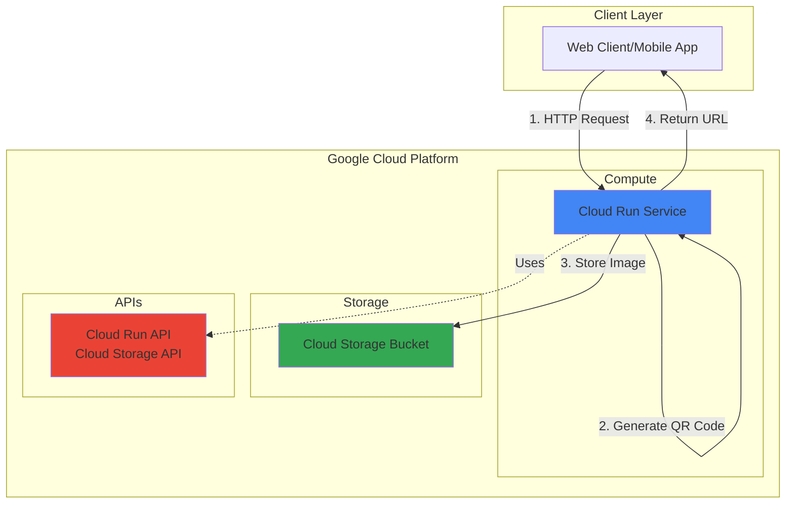

# QR Code Generator with Cloud Run and Storage

## Problem

Modern web applications frequently need to generate QR codes for sharing URLs, contact information, or other data with mobile users. Traditional server-based approaches require constant infrastructure management and scaling concerns when traffic fluctuates. Organizations need a cost-effective, scalable solution that can handle varying QR code generation demands without maintaining dedicated servers or worrying about capacity planning during traffic spikes.

## Solution

Deploy a containerized Python API service using Google Cloud Run that generates QR codes on-demand and stores them in Cloud Storage for persistent access. Cloud Run provides automatic scaling from zero to handle traffic bursts, while Cloud Storage offers durable object storage with global accessibility. This serverless approach eliminates infrastructure management overhead while providing cost-effective pay-per-use pricing that scales with actual demand.

## Architecture Diagram



## Prerequisites

1. Google Cloud Platform account with billing enabled
2. Google Cloud CLI installed and configured (or Cloud Shell access)
3. Basic knowledge of Python and REST APIs
4. Understanding of containerization concepts (Docker)
5. Estimated cost: $0.10-0.50 for testing (Cloud Run and Cloud Storage minimal usage)

> **Note**: Cloud Run provides 2 million requests per month in the free tier, making this recipe cost-effective for development and testing.

## Preparation

```bash
# Set environment variables for GCP resources
export PROJECT_ID="qr-generator-$(date +%s)"
export REGION="us-central1"
export SERVICE_NAME="qr-code-api"

# Generate unique suffix for resource names
RANDOM_SUFFIX=$(openssl rand -hex 3)
export BUCKET_NAME="qr-codes-${RANDOM_SUFFIX}"

# Create new project (optional - you can use existing project)
gcloud projects create ${PROJECT_ID} \
    --name="QR Code Generator Project"

# Set default project and region
gcloud config set project ${PROJECT_ID}
gcloud config set compute/region ${REGION}

# Enable required APIs
gcloud services enable run.googleapis.com
gcloud services enable storage.googleapis.com
gcloud services enable cloudbuild.googleapis.com

echo "✅ Project configured: ${PROJECT_ID}"
echo "✅ Region set to: ${REGION}"
```

## Steps

1. **Create Cloud Storage Bucket for QR Code Images**:

   Cloud Storage provides globally accessible object storage with strong consistency guarantees. Creating a bucket with appropriate location and access settings establishes the foundation for storing generated QR code images that can be accessed from anywhere with proper permissions.

   ```bash
   # Create Cloud Storage bucket for storing QR code images
   gsutil mb -p ${PROJECT_ID} \
       -c STANDARD \
       -l ${REGION} \
       gs://${BUCKET_NAME}
   
   # Enable public read access for generated QR codes
   gsutil iam ch allUsers:objectViewer gs://${BUCKET_NAME}
   
   echo "✅ Storage bucket created: gs://${BUCKET_NAME}"
   ```

   The storage bucket now provides a scalable repository for QR code images with public read access, enabling easy sharing while maintaining security through Google Cloud's IAM system.

2. **Create Application Directory and Dependencies**:

   Modern Python applications benefit from structured project organization and explicit dependency management. Creating a clean directory structure with a requirements file enables reproducible builds and makes the application container-ready for Cloud Run deployment.

   ```bash
   # Create project directory structure
   mkdir -p qr-generator-app
   cd qr-generator-app
   
   # Create requirements.txt with necessary Python packages
   cat > requirements.txt << 'EOF'
   Flask==3.0.3
   gunicorn==22.0.0
   qrcode[pil]==7.4.2
   google-cloud-storage==2.18.0
   Pillow==10.4.0
   EOF
   
   echo "✅ Project structure and dependencies created"
   ```

   The requirements file specifies exact versions of Flask for the web framework, qrcode for QR generation, google-cloud-storage for GCS integration, and gunicorn for production-ready WSGI serving with the latest stable versions.

3. **Develop the QR Code Generation API**:

   Flask provides a lightweight framework for building REST APIs that integrate seamlessly with Google Cloud services. This implementation creates endpoints for QR code generation and retrieval while leveraging Cloud Storage's native Python client library for file operations.

   ```bash
   # Create the main application file
   cat > main.py << 'EOF'
   import os
   import io
   import uuid
   from datetime import datetime
   from flask import Flask, request, jsonify
   from google.cloud import storage
   import qrcode
   from PIL import Image
   
   app = Flask(__name__)
   
   # Initialize Cloud Storage client
   storage_client = storage.Client()
   bucket_name = os.environ.get('BUCKET_NAME')
   if not bucket_name:
       raise ValueError("BUCKET_NAME environment variable is required")
   bucket = storage_client.bucket(bucket_name)
   
   @app.route('/')
   def health_check():
       """Health check endpoint for Cloud Run"""
       return jsonify({
           'status': 'healthy',
           'service': 'QR Code Generator',
           'timestamp': datetime.utcnow().isoformat()
       })
   
   @app.route('/generate', methods=['POST'])
   def generate_qr_code():
       """Generate QR code and store in Cloud Storage"""
       try:
           # Get data from request
           data = request.get_json()
           if not data or 'text' not in data:
               return jsonify({'error': 'Missing text parameter'}), 400
           
           text_to_encode = data['text']
           if len(text_to_encode) > 2000:
               return jsonify({'error': 'Text too long (max 2000 characters)'}), 400
           
           # Generate unique filename
           file_id = str(uuid.uuid4())
           filename = f"qr-{file_id}.png"
           
           # Create QR code with optimal settings
           qr = qrcode.QRCode(
               version=1,
               error_correction=qrcode.constants.ERROR_CORRECT_L,
               box_size=10,
               border=4,
           )
           qr.add_data(text_to_encode)
           qr.make(fit=True)
           
           # Create image
           img = qr.make_image(fill_color="black", back_color="white")
           
           # Convert to bytes
           img_bytes = io.BytesIO()
           img.save(img_bytes, format='PNG', optimize=True)
           img_bytes.seek(0)
           
           # Upload to Cloud Storage with metadata
           blob = bucket.blob(filename)
           blob.metadata = {
               'created_at': datetime.utcnow().isoformat(),
               'text_length': str(len(text_to_encode))
           }
           blob.upload_from_file(img_bytes, content_type='image/png')
           
           # Make the blob publicly accessible
           blob.make_public()
           
           # Return response with public URL
           public_url = blob.public_url
           
           return jsonify({
               'success': True,
               'qr_code_url': public_url,
               'filename': filename,
               'text_encoded': text_to_encode
           })
           
       except Exception as e:
           app.logger.error(f"Error generating QR code: {str(e)}")
           return jsonify({'error': 'Internal server error'}), 500
   
   @app.route('/list', methods=['GET'])
   def list_qr_codes():
       """List all QR codes in the bucket"""
       try:
           blobs = bucket.list_blobs(max_results=100)
           qr_codes = []
           
           for blob in blobs:
               if blob.name.startswith('qr-') and blob.name.endswith('.png'):
                   qr_codes.append({
                       'filename': blob.name,
                       'url': blob.public_url,
                       'created': blob.time_created.isoformat() if blob.time_created else None,
                       'size': blob.size
                   })
           
           return jsonify({
               'qr_codes': qr_codes,
               'count': len(qr_codes)
           })
           
       except Exception as e:
           app.logger.error(f"Error listing QR codes: {str(e)}")
           return jsonify({'error': 'Internal server error'}), 500
   
   if __name__ == '__main__':
       port = int(os.environ.get('PORT', 8080))
       app.run(debug=False, host='0.0.0.0', port=port)
   EOF
   
   echo "✅ QR Code API application created"
   ```

   The application implements three endpoints: a health check for Cloud Run monitoring, QR code generation with enhanced error handling and metadata, and a listing endpoint for viewing stored QR codes with improved performance limits.

4. **Create Dockerfile for Container Deployment**:

   Cloud Run requires containerized applications that follow specific conventions for port handling and startup commands. This Dockerfile creates an optimized Python runtime environment that integrates with Cloud Run's serverless infrastructure.

   ```bash
   # Create Dockerfile for Cloud Run deployment
   cat > Dockerfile << 'EOF'
   # Use the official Python runtime as base image
   FROM python:3.12-slim
   
   # Set environment variables
   ENV PYTHONDONTWRITEBYTECODE=1 \
       PYTHONUNBUFFERED=1 \
       PIP_NO_CACHE_DIR=1 \
       PIP_DISABLE_PIP_VERSION_CHECK=1
   
   # Set work directory
   WORKDIR /app
   
   # Install system dependencies
   RUN apt-get update \
       && apt-get install -y --no-install-recommends \
           gcc \
           libc6-dev \
       && rm -rf /var/lib/apt/lists/*
   
   # Install Python dependencies
   COPY requirements.txt .
   RUN pip install --no-cache-dir -r requirements.txt
   
   # Copy application code
   COPY main.py .
   
   # Create non-root user for security
   RUN useradd --create-home --shell /bin/bash app \
       && chown -R app:app /app
   USER app
   
   # Expose port 8080 (Cloud Run requirement)
   EXPOSE 8080
   
   # Command to run the application
   CMD exec gunicorn --bind :$PORT --workers 1 --threads 8 \
       --timeout 30 --keep-alive 2 main:app
   EOF
   
   echo "✅ Dockerfile created for Cloud Run deployment"
   ```

   The Dockerfile follows Cloud Run best practices including non-root user execution, proper port handling, optimized Python package installation for faster cold starts, and production-ready gunicorn configuration.

5. **Deploy Application to Cloud Run**:

   Cloud Run's source-based deployment automatically builds and deploys containerized applications with zero infrastructure management. The service configuration includes essential environment variables and resource limits appropriate for QR code generation workloads.

   ```bash
   # Deploy to Cloud Run from source code
   gcloud run deploy ${SERVICE_NAME} \
       --source . \
       --platform managed \
       --region ${REGION} \
       --allow-unauthenticated \
       --set-env-vars BUCKET_NAME=${BUCKET_NAME} \
       --memory 512Mi \
       --cpu 1 \
       --concurrency 100 \
       --max-instances 10 \
       --port 8080
   
   # Get the service URL
   SERVICE_URL=$(gcloud run services describe ${SERVICE_NAME} \
       --platform managed \
       --region ${REGION} \
       --format 'value(status.url)')
   
   echo "✅ Cloud Run service deployed successfully"
   echo "Service URL: ${SERVICE_URL}"
   ```

   The deployed service automatically scales based on incoming requests, with Cloud Run managing all infrastructure concerns including load balancing, health checks, and traffic routing with optimized configuration for better performance.

6. **Configure IAM Permissions for Cloud Storage Access**:

   Google Cloud's security model requires explicit permission grants for service-to-service communication. Configuring appropriate IAM roles ensures the Cloud Run service can access Cloud Storage while maintaining the principle of least privilege.

   ```bash
   # Get the Cloud Run service account
   SERVICE_ACCOUNT=$(gcloud run services describe ${SERVICE_NAME} \
       --platform managed \
       --region ${REGION} \
       --format 'value(spec.template.spec.serviceAccountName)')
   
   # If no custom service account, use the default Compute Engine service account
   if [ -z "$SERVICE_ACCOUNT" ]; then
       PROJECT_NUMBER=$(gcloud projects describe ${PROJECT_ID} \
           --format='value(projectNumber)')
       SERVICE_ACCOUNT="${PROJECT_NUMBER}-compute@developer.gserviceaccount.com"
   fi
   
   # Grant Storage Object Admin role to the service account
   gsutil iam ch serviceAccount:${SERVICE_ACCOUNT}:objectAdmin \
       gs://${BUCKET_NAME}
   
   echo "✅ IAM permissions configured for Cloud Storage access"
   echo "Service Account: ${SERVICE_ACCOUNT}"
   ```

   The Storage Object Admin role provides necessary permissions for creating, reading, and managing objects in the specified bucket while restricting access to other Cloud Storage resources.

## Validation & Testing

1. **Verify Cloud Run Service Health**:

   ```bash
   # Test the health check endpoint
   curl -s "${SERVICE_URL}/" | jq '.'
   ```

   Expected output: JSON response with service status and timestamp indicating healthy service status.

2. **Generate a Test QR Code**:

   ```bash
   # Create a QR code for a sample URL
   curl -X POST "${SERVICE_URL}/generate" \
       -H "Content-Type: application/json" \
       -d '{"text": "https://cloud.google.com/run"}' | jq '.'
   ```

   Expected output: JSON response containing the public URL of the generated QR code image with success confirmation.

3. **Test QR Code Image Access**:

   ```bash
   # Extract the QR code URL from the previous response and verify access
   QR_URL=$(curl -s -X POST "${SERVICE_URL}/generate" \
       -H "Content-Type: application/json" \
       -d '{"text": "Test QR Code"}' | jq -r '.qr_code_url')
   
   # Check if the image is accessible
   curl -I "${QR_URL}"
   ```

   Expected output: HTTP 200 OK response indicating successful image access.

4. **List Generated QR Codes**:

   ```bash
   # List all QR codes in the bucket
   curl -s "${SERVICE_URL}/list" | jq '.'
   ```

   Expected output: JSON array containing information about stored QR code files with metadata.

5. **Verify Cloud Storage Integration**:

   ```bash
   # Check bucket contents
   gsutil ls gs://${BUCKET_NAME}
   
   # Verify bucket permissions
   gsutil iam get gs://${BUCKET_NAME}
   ```

## Cleanup

1. **Delete Cloud Run Service**:

   ```bash
   # Delete the Cloud Run service
   gcloud run services delete ${SERVICE_NAME} \
       --platform managed \
       --region ${REGION} \
       --quiet
   
   echo "✅ Cloud Run service deleted"
   ```

2. **Remove Cloud Storage Bucket and Contents**:

   ```bash
   # Delete all objects in the bucket
   gsutil -m rm -r gs://${BUCKET_NAME}
   
   echo "✅ Storage bucket and contents deleted"
   ```

3. **Clean Up Local Files**:

   ```bash
   # Remove local application directory
   cd ..
   rm -rf qr-generator-app
   
   echo "✅ Local files cleaned up"
   ```

4. **Delete Project (Optional)**:

   ```bash
   # Delete the entire project if created specifically for this recipe
   gcloud projects delete ${PROJECT_ID} --quiet
   
   echo "✅ Project deletion initiated"
   echo "Note: Project deletion may take several minutes to complete"
   ```

## Discussion

This recipe demonstrates the power of Google Cloud's serverless computing model through Cloud Run and Cloud Storage integration. Cloud Run eliminates the complexity of container orchestration while providing enterprise-grade features like automatic scaling, traffic management, and integrated monitoring. The service scales from zero instances during idle periods to multiple instances under load, ensuring cost efficiency and optimal performance with pay-per-use pricing that aligns with actual usage patterns.

The integration between Cloud Run and Cloud Storage showcases Google Cloud's unified approach to cloud services. Using the Cloud Storage Python client library, the application seamlessly uploads generated QR codes and retrieves public URLs without complex authentication flows. Cloud Storage's global edge network ensures QR code images are accessible with low latency worldwide, while the standard storage class provides cost-effective storage for frequently accessed files with strong consistency guarantees.

The containerization approach offers several advantages beyond serverless deployment. Docker containers ensure consistent execution environments across development and production, while the lightweight Python base image optimizes cold start performance. The security-conscious Dockerfile implementation includes non-root user execution and minimal system dependencies, following container security best practices recommended in the [Google Cloud security documentation](https://cloud.google.com/security/best-practices).

For production deployments, consider implementing additional features such as request rate limiting, authentication using Google Cloud Identity and Access Management, and integration with Cloud Monitoring for comprehensive observability. The current implementation provides a solid foundation that can be extended with features like custom QR code styling, batch generation capabilities, or integration with other Google Cloud AI services for enhanced functionality as described in the [Cloud Run documentation](https://cloud.google.com/run/docs) and [Cloud Storage best practices guide](https://cloud.google.com/storage/docs/best-practices).

> **Tip**: Monitor your Cloud Run service using Cloud Monitoring dashboards to track request latency, error rates, and scaling patterns for optimization opportunities and cost management.

## Challenge

Extend this solution by implementing these enhancements:

1. **Add QR Code Customization**: Implement color schemes, logo embedding, and size variations using advanced qrcode library features and PIL image manipulation for branded QR codes.

2. **Implement Batch Generation**: Create an endpoint that accepts multiple text inputs and generates QR codes in parallel using Cloud Run's concurrent request handling capabilities.

3. **Add Caching Layer**: Integrate Cloud Memorystore (Redis) to cache frequently requested QR codes and reduce generation latency for duplicate requests.

4. **Enable Analytics Tracking**: Implement Cloud Firestore integration to track QR code usage statistics, generation timestamps, and access patterns for business intelligence.

5. **Create Web Interface**: Build a responsive frontend using Firebase Hosting that consumes the API and provides a user-friendly QR code generation interface with real-time preview capabilities.

## Infrastructure Code

*Infrastructure code will be generated after recipe approval.*