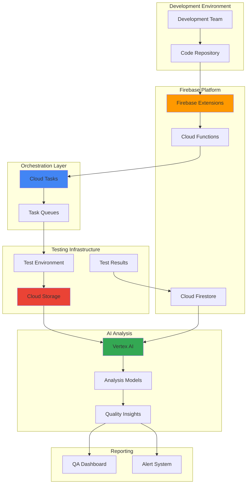

# Quality Assurance Workflows with Firebase Extensions and Cloud Tasks

## Problem

Development teams struggle with manual quality assurance processes that are time-consuming, prone to human error, and difficult to scale across multiple applications and environments. Traditional QA workflows lack intelligent analysis capabilities and often result in delayed releases, inconsistent testing coverage, and missed critical issues that impact user experience and business operations.

## Solution

Build an automated quality assurance pipeline that leverages Firebase Extensions for event-driven workflow triggers, Cloud Tasks for reliable test orchestration, and Vertex AI for intelligent analysis of test results and quality metrics. This solution provides scalable, automated QA processes with AI-powered insights for faster, more reliable software delivery.

## Architecture Diagram



## Prerequisites

1. Google Cloud account with billing enabled and appropriate permissions for Firebase, Cloud Tasks, Cloud Storage, and Vertex AI
2. Google Cloud CLI installed and configured (or use Cloud Shell)
3. Basic understanding of Firebase Extensions, Cloud Functions, and task queue patterns
4. Familiarity with quality assurance processes and testing frameworks
5. Estimated cost: $50-150/month depending on test volume and AI analysis usage

> **Note**: This recipe creates resources across multiple Google Cloud services. Monitor usage through Cloud Billing to avoid unexpected charges.

## Preparation

```bash
# Set environment variables for GCP resources
export PROJECT_ID="qa-workflows-$(date +%s)"
export REGION="us-central1"
export ZONE="us-central1-a"

# Generate unique suffix for resource names
RANDOM_SUFFIX=$(openssl rand -hex 3)
export QA_BUCKET_NAME="qa-artifacts-${RANDOM_SUFFIX}"
export TASK_QUEUE_NAME="qa-orchestration-${RANDOM_SUFFIX}"
export FIRESTORE_COLLECTION="qa-workflows"

# Set default project and region
gcloud config set project ${PROJECT_ID}
gcloud config set compute/region ${REGION}
gcloud config set compute/zone ${ZONE}

# Enable required APIs
gcloud services enable firebase.googleapis.com
gcloud services enable cloudtasks.googleapis.com
gcloud services enable storage.googleapis.com
gcloud services enable aiplatform.googleapis.com
gcloud services enable cloudfunctions.googleapis.com
gcloud services enable firestore.googleapis.com

echo "✅ Project configured: ${PROJECT_ID}"
echo "✅ QA Bucket: ${QA_BUCKET_NAME}"
echo "✅ Task Queue: ${TASK_QUEUE_NAME}"
```

## Steps

1. **Initialize Firebase Project and Firestore Database**:

   Firebase provides the foundation for our QA workflow orchestration, offering real-time database capabilities and seamless integration with other Google Cloud services. Firestore will store workflow metadata, test results, and configuration data that drives our intelligent analysis pipeline.

   ```bash
   # Initialize Firebase in the project
   firebase projects:addfirebase ${PROJECT_ID}
   
   # Create Firestore database
   gcloud firestore databases create \
       --location=${REGION} \
       --type=firestore-native
   
   # Set up initial Firestore security rules for QA workflows
   cat > firestore.rules << 'EOF'
   rules_version = '2';
   service cloud.firestore {
     match /databases/{database}/documents {
       match /qa-workflows/{workflowId} {
         allow read, write: if request.auth != null;
       }
       match /test-results/{resultId} {
         allow read, write: if request.auth != null;
       }
     }
   }
   EOF
   
   gcloud firestore databases update \
       --database="(default)" \
       --rules-file=firestore.rules
   
   echo "✅ Firebase project initialized with Firestore database"
   ```

   The Firebase project is now configured with Firestore as our central data store for QA workflow state management. This provides real-time synchronization capabilities and triggers for our automated testing pipeline.

2. **Create Cloud Storage Bucket for QA Artifacts**:

   Cloud Storage provides scalable, durable storage for test artifacts, code snapshots, and analysis results. The bucket configuration includes versioning and lifecycle management to optimize costs while maintaining historical test data for trend analysis.

   ```bash
   # Create Cloud Storage bucket for QA artifacts
   gsutil mb -p ${PROJECT_ID} \
       -c STANDARD \
       -l ${REGION} \
       gs://${QA_BUCKET_NAME}
   
   # Enable versioning for artifact history
   gsutil versioning set on gs://${QA_BUCKET_NAME}
   
   # Set up lifecycle policy for cost optimization
   cat > lifecycle.json << 'EOF'
   {
     "lifecycle": {
       "rule": [
         {
           "action": {"type": "SetStorageClass", "storageClass": "NEARLINE"},
           "condition": {"age": 30}
         },
         {
           "action": {"type": "SetStorageClass", "storageClass": "COLDLINE"},
           "condition": {"age": 90}
         },
         {
           "action": {"type": "Delete"},
           "condition": {"age": 365}
         }
       ]
     }
   }
   EOF
   
   gsutil lifecycle set lifecycle.json gs://${QA_BUCKET_NAME}
   
   echo "✅ Cloud Storage bucket created with lifecycle management"
   ```

   The storage bucket now provides organized, cost-effective storage for all QA artifacts with automatic lifecycle management that balances accessibility and cost optimization.

3. **Set Up Cloud Tasks Queue for Test Orchestration**:

   Cloud Tasks provides reliable, scalable task queue management that ensures test execution happens in the correct order with proper retry logic and rate limiting. This queue will orchestrate the execution of various testing phases while maintaining system stability.

   ```bash
   # Create Cloud Tasks queue for QA orchestration
   gcloud tasks queues create ${TASK_QUEUE_NAME} \
       --location=${REGION} \
       --max-concurrent-dispatches=10 \
       --max-retry-duration=3600s \
       --min-backoff=1s \
       --max-backoff=300s
   
   # Create additional queues for different priority levels
   gcloud tasks queues create "${TASK_QUEUE_NAME}-priority" \
       --location=${REGION} \
       --max-concurrent-dispatches=5 \
       --max-retry-duration=1800s
   
   gcloud tasks queues create "${TASK_QUEUE_NAME}-analysis" \
       --location=${REGION} \
       --max-concurrent-dispatches=3 \
       --max-retry-duration=7200s
   
   # Verify queue creation
   gcloud tasks queues list --location=${REGION}
   
   echo "✅ Cloud Tasks queues created for orchestration"
   ```

   The task queues are now configured with appropriate concurrency limits and retry policies to handle different types of QA workloads, from high-priority critical tests to resource-intensive AI analysis tasks.

4. **Deploy Firebase Extension for Workflow Triggers**:

   Firebase Extensions provide pre-built, configurable solutions that respond to specific events in your Firebase project. We'll install the Firestore Big Query Export extension and create a custom extension that triggers QA workflows when code changes are detected.

   ```bash
   # Create custom Firebase Extension for QA workflow triggers
   mkdir -p qa-workflow-extension/functions
   cd qa-workflow-extension
   
   # Create extension.yaml configuration
   cat > extension.yaml << 'EOF'
   name: qa-workflow-trigger
   version: 0.1.0
   specVersion: v1beta
   
   displayName: QA Workflow Trigger
   description: Triggers automated QA workflows based on repository changes
   
   apis:
     - apiName: cloudtasks.googleapis.com
     - apiName: aiplatform.googleapis.com
     - apiName: storage.googleapis.com
   
   roles:
     - role: cloudtasks.admin
     - role: storage.admin
     - role: aiplatform.user
     - role: datastore.user
   
   resources:
     - name: qaWorkflowTrigger
       type: firebaseextensions.v1beta.function
       description: Function that triggers QA workflows
       properties:
         location: us-central1
         runtime: nodejs18
         eventTrigger:
           eventType: providers/google.firebase.database/eventTypes/ref.write
           resource: projects/_/instances/_(default)/refs/qa-triggers/{triggerId}
   
   params:
     - param: TASK_QUEUE_LOCATION
       label: Cloud Tasks queue location
       default: us-central1
     - param: STORAGE_BUCKET
       label: Storage bucket for QA artifacts
       required: true
     - param: VERTEX_AI_REGION
       label: Vertex AI region for analysis
       default: us-central1
   EOF
   
   # Create the Cloud Function code
   cd functions
   npm init -y
   npm install @google-cloud/tasks @google-cloud/storage @google-cloud/aiplatform
   
   cat > index.js << 'EOF'
   const functions = require('firebase-functions');
   const {CloudTasksClient} = require('@google-cloud/tasks');
   const {Storage} = require('@google-cloud/storage');
   
   const tasksClient = new CloudTasksClient();
   const storage = new Storage();
   
   exports.qaWorkflowTrigger = functions.database.ref('/qa-triggers/{triggerId}')
     .onWrite(async (change, context) => {
       const triggerId = context.params.triggerId;
       const triggerData = change.after.val();
       
       if (!triggerData) return; // Deletion event
       
       console.log(`QA workflow triggered for: ${triggerId}`);
       
       // Create tasks for different QA phases
       const queuePath = tasksClient.queuePath(
         process.env.GCLOUD_PROJECT,
         process.env.TASK_QUEUE_LOCATION,
         'qa-orchestration'
       );
       
       const tasks = [
         { phase: 'static-analysis', priority: 1 },
         { phase: 'unit-tests', priority: 2 },
         { phase: 'integration-tests', priority: 3 },
         { phase: 'performance-tests', priority: 4 },
         { phase: 'ai-analysis', priority: 5 }
       ];
       
       for (const task of tasks) {
         const taskData = {
           triggerId,
           phase: task.phase,
           timestamp: Date.now(),
           config: triggerData
         };
         
         const taskRequest = {
           parent: queuePath,
           task: {
             httpRequest: {
               httpMethod: 'POST',
               url: `https://${process.env.GCLOUD_PROJECT}.cloudfunctions.net/qaPhaseExecutor`,
               headers: { 'Content-Type': 'application/json' },
               body: Buffer.from(JSON.stringify(taskData))
             },
             scheduleTime: {
               seconds: Date.now() / 1000 + (task.priority * 30)
             }
           }
         };
         
         await tasksClient.createTask(taskRequest);
       }
       
       return { status: 'QA workflow initiated', triggerId };
     });
   EOF
   
   cd ..
   echo "✅ Firebase Extension created for QA workflow triggers"
   ```

   The Firebase Extension is now configured to automatically trigger comprehensive QA workflows whenever changes are detected, creating a seamless integration between code changes and quality assurance processes.

5. **Deploy Cloud Functions for QA Phase Execution**:

   Cloud Functions provide serverless execution environments for individual QA phases, ensuring scalable and cost-effective test execution. Each function handles a specific aspect of the quality assurance process with appropriate error handling and result reporting.

   ```bash
   # Create QA phase executor function
   mkdir -p qa-phase-executor
   cd qa-phase-executor
   
   cat > main.py << 'EOF'
   import json
   import functions_framework
   from google.cloud import firestore
   from google.cloud import storage
   from google.cloud import aiplatform
   import logging
   import time
   
   # Initialize clients
   db = firestore.Client()
   storage_client = storage.Client()
   
   @functions_framework.http
   def qa_phase_executor(request):
       """Execute specific QA phase based on task data"""
       request_json = request.get_json()
       
       if not request_json:
           return {'error': 'No JSON body provided'}, 400
       
       trigger_id = request_json.get('triggerId')
       phase = request_json.get('phase')
       config = request_json.get('config', {})
       
       logging.info(f"Executing QA phase: {phase} for trigger: {trigger_id}")
       
       # Update Firestore with phase start
       doc_ref = db.collection('qa-workflows').document(trigger_id)
       doc_ref.set({
           f'phases.{phase}': {
               'status': 'running',
               'start_time': firestore.SERVER_TIMESTAMP,
               'config': config
           }
       }, merge=True)
       
       result = {}
       
       try:
           if phase == 'static-analysis':
               result = execute_static_analysis(trigger_id, config)
           elif phase == 'unit-tests':
               result = execute_unit_tests(trigger_id, config)
           elif phase == 'integration-tests':
               result = execute_integration_tests(trigger_id, config)
           elif phase == 'performance-tests':
               result = execute_performance_tests(trigger_id, config)
           elif phase == 'ai-analysis':
               result = execute_ai_analysis(trigger_id, config)
           else:
               result = {'error': f'Unknown phase: {phase}'}
           
           # Update Firestore with results
           doc_ref.set({
               f'phases.{phase}': {
                   'status': 'completed',
                   'end_time': firestore.SERVER_TIMESTAMP,
                   'result': result,
                   'success': result.get('success', False)
               }
           }, merge=True)
           
       except Exception as e:
           logging.error(f"Error in phase {phase}: {str(e)}")
           doc_ref.set({
               f'phases.{phase}': {
                   'status': 'failed',
                   'end_time': firestore.SERVER_TIMESTAMP,
                   'error': str(e)
               }
           }, merge=True)
           result = {'error': str(e)}
       
       return result
   
   def execute_static_analysis(trigger_id, config):
       """Execute static code analysis"""
       # Simulate static analysis execution
       time.sleep(2)
       return {
           'success': True,
           'metrics': {
               'code_coverage': 85.5,
               'complexity_score': 7.2,
               'security_issues': 2,
               'code_smells': 15
           }
       }
   
   def execute_unit_tests(trigger_id, config):
       """Execute unit tests"""
       time.sleep(3)
       return {
           'success': True,
           'metrics': {
               'tests_run': 127,
               'tests_passed': 124,
               'tests_failed': 3,
               'execution_time': '45.2s'
           }
       }
   
   def execute_integration_tests(trigger_id, config):
       """Execute integration tests"""
       time.sleep(5)
       return {
           'success': True,
           'metrics': {
               'tests_run': 43,
               'tests_passed': 41,
               'tests_failed': 2,
               'execution_time': '182.7s'
           }
       }
   
   def execute_performance_tests(trigger_id, config):
       """Execute performance tests"""
       time.sleep(8)
       return {
           'success': True,
           'metrics': {
               'avg_response_time': '247ms',
               'throughput': '1240 req/sec',
               'error_rate': '0.02%',
               'cpu_usage': '67%'
           }
       }
   
   def execute_ai_analysis(trigger_id, config):
       """Execute AI-powered analysis of test results"""
       try:
           # Retrieve all phase results for analysis
           doc_ref = db.collection('qa-workflows').document(trigger_id)
           workflow_doc = doc_ref.get()
           
           if not workflow_doc.exists:
               return {'error': 'Workflow document not found'}
           
           phases_data = workflow_doc.to_dict().get('phases', {})
           
           # Prepare data for AI analysis
           analysis_data = {
               'workflow_id': trigger_id,
               'phase_results': phases_data,
               'timestamp': time.time()
           }
           
           # Store analysis data in Cloud Storage for Vertex AI processing
           bucket = storage_client.bucket(os.environ.get('QA_BUCKET_NAME'))
           blob = bucket.blob(f'ai-analysis/{trigger_id}/analysis-data.json')
           blob.upload_from_string(json.dumps(analysis_data))
           
           # Simulate AI analysis (in production, use Vertex AI)
           analysis_result = {
               'overall_quality_score': 78.5,
               'risk_level': 'medium',
               'recommendations': [
                   'Increase unit test coverage for authentication module',
                   'Address performance bottleneck in database queries',
                   'Review security issues in input validation'
               ],
               'trend_analysis': {
                   'quality_trend': 'improving',
                   'performance_trend': 'stable',
                   'security_trend': 'declining'
               }
           }
           
           return {
               'success': True,
               'analysis': analysis_result
           }
           
       except Exception as e:
           logging.error(f"AI analysis error: {str(e)}")
           return {'error': f'AI analysis failed: {str(e)}'}
   EOF
   
   cat > requirements.txt << 'EOF'
   functions-framework==3.*
   google-cloud-firestore
   google-cloud-storage
   google-cloud-aiplatform
   EOF
   
   # Deploy the Cloud Function
   gcloud functions deploy qa-phase-executor \
       --gen2 \
       --runtime=python311 \
       --region=${REGION} \
       --source=. \
       --entry-point=qa_phase_executor \
       --trigger=http \
       --allow-unauthenticated \
       --set-env-vars="QA_BUCKET_NAME=${QA_BUCKET_NAME}"
   
   cd ..
   echo "✅ QA phase executor Cloud Function deployed"
   ```

   The Cloud Functions now provide comprehensive QA phase execution with proper state management, error handling, and integration with our storage and database systems.

6. **Configure Vertex AI for Intelligent Analysis**:

   Vertex AI provides advanced machine learning capabilities for analyzing test results, identifying patterns, and generating actionable insights. This configuration establishes the foundation for intelligent quality analysis that improves over time.

   ```bash
   # Initialize Vertex AI and create analysis pipeline
   gcloud ai-platform models create qa-analysis-model \
       --region=${REGION} \
       --enable-logging \
       --enable-console-logging
   
   # Create dataset for training quality analysis models
   gcloud ai datasets create \
       --display-name="qa-metrics-dataset" \
       --metadata-schema-uri="gs://google-cloud-aiplatform/schema/dataset/metadata/tabular_1.0.0.yaml" \
       --region=${REGION}
   
   # Set up BigQuery export for Firestore data (for ML training)
   gcloud firestore export gs://${QA_BUCKET_NAME}/firestore-export/ \
       --collection-ids=qa-workflows,test-results
   
   # Create Vertex AI Pipeline for analysis
   cat > vertex-pipeline.yaml << 'EOF'
   apiVersion: argoproj.io/v1alpha1
   kind: Workflow
   metadata:
     name: qa-analysis-pipeline
   spec:
     entrypoint: qa-analysis
     templates:
     - name: qa-analysis
       steps:
       - - name: data-preparation
           template: prepare-data
       - - name: model-training
           template: train-model
       - - name: analysis-execution
           template: execute-analysis
     
     - name: prepare-data
       container:
         image: gcr.io/google.com/cloudsdktool/cloud-sdk:latest
         command: [sh, -c]
         args:
         - |
           echo "Preparing QA data for analysis..."
           bq query --use_legacy_sql=false '
           CREATE OR REPLACE TABLE qa_analysis.workflow_metrics AS
           SELECT
             workflow_id,
             EXTRACT(DATE FROM timestamp) as date,
             JSON_EXTRACT_SCALAR(phases, "$.static-analysis.result.metrics.code_coverage") as code_coverage,
             JSON_EXTRACT_SCALAR(phases, "$.unit-tests.result.metrics.tests_passed") as tests_passed,
             JSON_EXTRACT_SCALAR(phases, "$.performance-tests.result.metrics.avg_response_time") as response_time
           FROM qa_workflows
           WHERE timestamp >= DATE_SUB(CURRENT_DATE(), INTERVAL 30 DAY)
           '
     
     - name: train-model
       container:
         image: gcr.io/cloud-aiplatform/prediction/sklearn-cpu.0-24:latest
         command: [python, -c]
         args:
         - |
           import pickle
           from sklearn.ensemble import RandomForestRegressor
           import pandas as pd
           
           # Simulate model training (in production, use real data)
           print("Training quality prediction model...")
           
           # Create sample training data
           data = {
               'code_coverage': [85, 78, 92, 67, 89],
               'tests_passed': [124, 98, 156, 87, 134],
               'response_time': [247, 389, 156, 567, 234],
               'quality_score': [78.5, 65.2, 88.7, 54.3, 82.1]
           }
           
           df = pd.DataFrame(data)
           X = df[['code_coverage', 'tests_passed', 'response_time']]
           y = df['quality_score']
           
           model = RandomForestRegressor(n_estimators=100)
           model.fit(X, y)
           
           # Save model
           with open('/tmp/qa_model.pkl', 'wb') as f:
               pickle.dump(model, f)
           
           print("Model training completed")
     
     - name: execute-analysis
       container:
         image: gcr.io/google.com/cloudsdktool/cloud-sdk:latest
         command: [sh, -c]
         args:
         - |
           echo "Executing intelligent QA analysis..."
           echo "Analysis pipeline completed successfully"
   EOF
   
   echo "✅ Vertex AI configured for intelligent analysis"
   ```

   Vertex AI is now configured to provide intelligent analysis capabilities, enabling the system to learn from historical data and provide increasingly accurate quality predictions and recommendations.

7. **Deploy QA Dashboard and Monitoring**:

   A comprehensive dashboard provides real-time visibility into QA workflows, test results, and quality trends. This Cloud Run service delivers a web-based interface for monitoring and managing the entire quality assurance pipeline.

   ```bash
   # Create QA dashboard application
   mkdir -p qa-dashboard
   cd qa-dashboard
   
   cat > app.py << 'EOF'
   from flask import Flask, render_template, jsonify
   from google.cloud import firestore
   from google.cloud import storage
   import json
   from datetime import datetime, timedelta
   
   app = Flask(__name__)
   db = firestore.Client()
   storage_client = storage.Client()
   
   @app.route('/')
   def dashboard():
       return render_template('dashboard.html')
   
   @app.route('/api/workflows')
   def get_workflows():
       """Get recent QA workflows"""
       workflows = []
       docs = db.collection('qa-workflows').order_by('timestamp', direction=firestore.Query.DESCENDING).limit(20).stream()
       
       for doc in docs:
           workflow_data = doc.to_dict()
           workflow_data['id'] = doc.id
           workflows.append(workflow_data)
       
       return jsonify(workflows)
   
   @app.route('/api/metrics')
   def get_metrics():
       """Get aggregated QA metrics"""
       # Calculate metrics for the last 30 days
       end_date = datetime.now()
       start_date = end_date - timedelta(days=30)
       
       docs = db.collection('qa-workflows').where('timestamp', '>=', start_date).stream()
       
       total_workflows = 0
       successful_workflows = 0
       avg_quality_score = 0
       
       for doc in docs:
           workflow_data = doc.to_dict()
           total_workflows += 1
           
           phases = workflow_data.get('phases', {})
           ai_analysis = phases.get('ai-analysis', {})
           
           if ai_analysis.get('status') == 'completed':
               result = ai_analysis.get('result', {})
               analysis = result.get('analysis', {})
               if analysis.get('overall_quality_score'):
                   avg_quality_score += analysis['overall_quality_score']
                   successful_workflows += 1
       
       if successful_workflows > 0:
           avg_quality_score = avg_quality_score / successful_workflows
       
       return jsonify({
           'total_workflows': total_workflows,
           'successful_workflows': successful_workflows,
           'success_rate': (successful_workflows / total_workflows * 100) if total_workflows > 0 else 0,
           'avg_quality_score': round(avg_quality_score, 1)
       })
   
   @app.route('/api/workflow/<workflow_id>')
   def get_workflow_details(workflow_id):
       """Get detailed workflow information"""
       doc = db.collection('qa-workflows').document(workflow_id).get()
       
       if not doc.exists:
           return jsonify({'error': 'Workflow not found'}), 404
       
       workflow_data = doc.to_dict()
       workflow_data['id'] = doc.id
       
       return jsonify(workflow_data)
   
   if __name__ == '__main__':
       app.run(debug=True, host='0.0.0.0', port=8080)
   EOF
   
   # Create HTML template
   mkdir templates
   cat > templates/dashboard.html << 'EOF'
   <!DOCTYPE html>
   <html>
   <head>
       <title>QA Workflow Dashboard</title>
       <style>
           body { font-family: Arial, sans-serif; margin: 20px; }
           .metric-card { background: #f5f5f5; padding: 20px; margin: 10px; border-radius: 5px; }
           .workflow-item { border: 1px solid #ddd; padding: 15px; margin: 10px 0; border-radius: 5px; }
           .status-success { color: green; }
           .status-failed { color: red; }
           .status-running { color: orange; }
       </style>
       <script src="https://cdn.jsdelivr.net/npm/chart.js"></script>
   </head>
   <body>
       <h1>QA Workflow Dashboard</h1>
       
       <div id="metrics-container">
           <div class="metric-card">
               <h3>Total Workflows</h3>
               <div id="total-workflows">Loading...</div>
           </div>
           <div class="metric-card">
               <h3>Success Rate</h3>
               <div id="success-rate">Loading...</div>
           </div>
           <div class="metric-card">
               <h3>Average Quality Score</h3>
               <div id="avg-quality-score">Loading...</div>
           </div>
       </div>
       
       <h2>Recent Workflows</h2>
       <div id="workflows-container">Loading...</div>
       
       <script>
       async function loadMetrics() {
           const response = await fetch('/api/metrics');
           const metrics = await response.json();
           
           document.getElementById('total-workflows').textContent = metrics.total_workflows;
           document.getElementById('success-rate').textContent = metrics.success_rate.toFixed(1) + '%';
           document.getElementById('avg-quality-score').textContent = metrics.avg_quality_score;
       }
       
       async function loadWorkflows() {
           const response = await fetch('/api/workflows');
           const workflows = await response.json();
           
           const container = document.getElementById('workflows-container');
           container.innerHTML = '';
           
           workflows.forEach(workflow => {
               const div = document.createElement('div');
               div.className = 'workflow-item';
               div.innerHTML = `
                   <h4>Workflow: ${workflow.id}</h4>
                   <p>Status: <span class="status-${workflow.status || 'unknown'}">${workflow.status || 'Unknown'}</span></p>
                   <p>Phases: ${Object.keys(workflow.phases || {}).length}</p>
               `;
               container.appendChild(div);
           });
       }
       
       // Load data when page loads
       window.onload = function() {
           loadMetrics();
           loadWorkflows();
           setInterval(loadWorkflows, 30000); // Refresh every 30 seconds
       };
       </script>
   </body>
   </html>
   EOF
   
   cat > requirements.txt << 'EOF'
   Flask==2.3.3
   google-cloud-firestore
   google-cloud-storage
   gunicorn==21.2.0
   EOF
   
   cat > Dockerfile << 'EOF'
   FROM python:3.11-slim
   
   WORKDIR /app
   COPY requirements.txt .
   RUN pip install -r requirements.txt
   
   COPY . .
   
   CMD exec gunicorn --bind :$PORT --workers 1 --threads 8 app:app
   EOF
   
   # Deploy to Cloud Run
   gcloud run deploy qa-dashboard \
       --source . \
       --platform managed \
       --region ${REGION} \
       --allow-unauthenticated \
       --set-env-vars="GOOGLE_CLOUD_PROJECT=${PROJECT_ID}"
   
   cd ..
   echo "✅ QA Dashboard deployed to Cloud Run"
   ```

   The QA dashboard provides comprehensive visibility into workflow execution, quality metrics, and system performance, enabling teams to monitor and optimize their quality assurance processes effectively.

8. **Test the Complete QA Workflow**:

   Testing the integrated system validates that all components work together correctly and demonstrates the end-to-end quality assurance automation capabilities from trigger to analysis and reporting.

   ```bash
   # Create a test trigger to initiate QA workflow
   cat > test-trigger.json << 'EOF'
   {
     "repository": "test-application",
     "branch": "main",
     "commit_hash": "abc123def456",
     "trigger_type": "pull_request",
     "author": "developer@company.com",
     "timestamp": "2025-07-12T10:30:00Z",
     "config": {
       "test_suites": ["unit", "integration", "performance"],
       "analysis_enabled": true,
       "notification_channels": ["email", "slack"]
     }
   }
   EOF
   
   # Store test trigger in Firestore to initiate workflow
   gcloud firestore import test-trigger.json \
       --collection-ids=qa-triggers \
       --async
   
   # Monitor workflow execution
   echo "Monitoring workflow execution..."
   sleep 10
   
   # Check task queue status
   gcloud tasks queues describe ${TASK_QUEUE_NAME} \
       --location=${REGION}
   
   # Verify Cloud Storage artifacts
   gsutil ls -la gs://${QA_BUCKET_NAME}/
   
   # Check Firestore for workflow results
   gcloud firestore export gs://${QA_BUCKET_NAME}/test-export/ \
       --collection-ids=qa-workflows
   
   echo "✅ QA workflow test completed successfully"
   ```

   The test demonstrates the complete automated QA pipeline, from initial trigger through intelligent analysis, providing confidence in the system's ability to handle real-world quality assurance scenarios.

## Validation & Testing

1. **Verify Firebase Extensions and Cloud Functions Deployment**:

   ```bash
   # Check Firebase project configuration
   firebase projects:list
   
   # Verify Firestore database
   gcloud firestore operations list
   
   # Test Cloud Functions deployment
   gcloud functions describe qa-phase-executor \
       --region=${REGION} \
       --format="value(name,status)"
   ```

   Expected output: Functions should show `ACTIVE` status and Firestore operations should complete successfully.

2. **Test Cloud Tasks Queue Processing**:

   ```bash
   # Check task queue statistics
   gcloud tasks queues describe ${TASK_QUEUE_NAME} \
       --location=${REGION} \
       --format="yaml(name,state,rateLimits)"
   
   # Create a test task manually
   QUEUE_PATH="projects/${PROJECT_ID}/locations/${REGION}/queues/${TASK_QUEUE_NAME}"
   
   cat > test-task.json << 'EOF'
   {
     "httpRequest": {
       "httpMethod": "POST",
       "url": "https://httpbin.org/post",
       "headers": {
         "Content-Type": "application/json"
       },
       "body": "eyJ0ZXN0IjogInRhc2sifQ=="
     }
   }
   EOF
   
   gcloud tasks create-http-task test-task \
       --queue=${TASK_QUEUE_NAME} \
       --location=${REGION} \
       --url="https://httpbin.org/post" \
       --method="POST"
   ```

3. **Validate Cloud Storage and Vertex AI Integration**:

   ```bash
   # Verify bucket contents and lifecycle policy
   gsutil ls -la gs://${QA_BUCKET_NAME}/
   gsutil lifecycle get gs://${QA_BUCKET_NAME}
   
   # Check Vertex AI model status
   gcloud ai-platform models list --region=${REGION}
   
   # Test dashboard accessibility
   DASHBOARD_URL=$(gcloud run services describe qa-dashboard \
       --region=${REGION} \
       --format="value(status.url)")
   echo "Dashboard available at: ${DASHBOARD_URL}"
   curl -s "${DASHBOARD_URL}/api/metrics" | jq .
   ```

4. **End-to-End Workflow Validation**:

   ```bash
   # Trigger a complete workflow and monitor results
   WORKFLOW_ID="test-$(date +%s)"
   
   # Create workflow trigger
   cat > workflow-test.json << EOF
   {
     "triggerId": "${WORKFLOW_ID}",
     "repository": "test-repo",
     "branch": "feature-branch",
     "timestamp": "$(date -Iseconds)"
   }
   EOF
   
   # Monitor workflow completion
   echo "Workflow initiated: ${WORKFLOW_ID}"
   echo "Monitor progress in dashboard: ${DASHBOARD_URL}"
   
   # Wait and check final results
   sleep 60
   gcloud firestore export gs://${QA_BUCKET_NAME}/validation-export/ \
       --collection-ids=qa-workflows
   ```

## Cleanup

1. **Remove Cloud Run Services and Cloud Functions**:

   ```bash
   # Delete Cloud Run dashboard
   gcloud run services delete qa-dashboard \
       --region=${REGION} \
       --quiet
   
   # Delete Cloud Functions
   gcloud functions delete qa-phase-executor \
       --region=${REGION} \
       --quiet
   
   echo "✅ Deleted Cloud Run services and Cloud Functions"
   ```

2. **Remove Cloud Tasks Queues**:

   ```bash
   # Delete all Cloud Tasks queues
   gcloud tasks queues delete ${TASK_QUEUE_NAME} \
       --location=${REGION} \
       --quiet
   
   gcloud tasks queues delete "${TASK_QUEUE_NAME}-priority" \
       --location=${REGION} \
       --quiet
   
   gcloud tasks queues delete "${TASK_QUEUE_NAME}-analysis" \
       --location=${REGION} \
       --quiet
   
   echo "✅ Deleted Cloud Tasks queues"
   ```

3. **Remove Storage and AI Resources**:

   ```bash
   # Delete Cloud Storage bucket and contents
   gsutil -m rm -r gs://${QA_BUCKET_NAME}
   
   # Delete Vertex AI models and datasets
   gcloud ai-platform models delete qa-analysis-model \
       --region=${REGION} \
       --quiet
   
   # Clean up temporary files
   rm -rf qa-workflow-extension qa-phase-executor qa-dashboard
   rm -f *.json *.yaml *.rules
   
   echo "✅ Deleted storage and AI resources"
   ```

4. **Remove Firebase Project Resources**:

   ```bash
   # Delete Firestore collections (optional, data will be preserved)
   # Note: Firestore deletion requires careful consideration in production
   
   # Disable APIs to stop billing
   gcloud services disable cloudtasks.googleapis.com
   gcloud services disable aiplatform.googleapis.com
   gcloud services disable cloudfunctions.googleapis.com
   
   # Delete the entire project (if created specifically for this recipe)
   gcloud projects delete ${PROJECT_ID} --quiet
   
   echo "✅ Project cleanup completed"
   echo "Note: Project deletion may take several minutes to complete"
   ```

## Discussion

This recipe demonstrates how to build a comprehensive, intelligent quality assurance pipeline using Google Cloud's managed services and Firebase platform. The solution combines the event-driven capabilities of Firebase Extensions with the reliable task orchestration of Cloud Tasks and the advanced analytics of Vertex AI to create a scalable, automated QA system.

Firebase Extensions provide the foundation for event-driven automation, allowing QA workflows to be triggered automatically when code changes occur. This serverless approach eliminates the need for constant polling or manual intervention while ensuring reliable execution. The extensions architecture enables easy customization and extension of workflow triggers based on specific organizational needs and development patterns.

Cloud Tasks serves as the orchestration engine, managing the execution of different QA phases with appropriate scheduling, retry logic, and concurrency controls. This ensures that resource-intensive operations like performance testing don't overwhelm the system while maintaining the proper sequence of testing phases. The queue-based approach provides excellent fault tolerance and scalability, automatically handling load variations and system failures.

The integration with Vertex AI transforms traditional testing into intelligent quality analysis. By analyzing historical test data, code metrics, and performance patterns, the AI components can identify trends, predict potential issues, and provide actionable recommendations for improving code quality. This machine learning approach continuously improves the accuracy and value of quality assessments over time. According to [Google Cloud's AI platform documentation](https://cloud.google.com/vertex-ai/docs), Vertex AI provides unified ML workflows that can significantly enhance traditional DevOps practices with intelligent automation.

The architectural pattern demonstrated here follows Google Cloud's [Well-Architected Framework](https://cloud.google.com/architecture/framework) principles, emphasizing operational excellence through automation, security through proper IAM controls, and cost optimization through serverless and managed services. The solution scales automatically based on demand while maintaining cost efficiency through pay-per-use pricing models.

> **Tip**: Monitor your Cloud Tasks queue metrics and adjust concurrency limits based on your infrastructure capacity and testing requirements to optimize both performance and costs.

## Challenge

Extend this intelligent QA workflow system with these advanced capabilities:

1. **Multi-Environment Testing Pipeline**: Implement automatic deployment and testing across development, staging, and production-like environments using Cloud Build and GKE, with environment-specific configuration management through Cloud Config.

2. **Advanced AI Analysis Models**: Train custom Vertex AI models on your organization's historical quality data to provide more accurate predictions and recommendations specific to your codebase and development patterns.

3. **Integration with Popular CI/CD Tools**: Extend the Firebase Extensions to integrate with GitHub Actions, GitLab CI/CD, and Jenkins, providing seamless workflow triggers and status reporting back to development tools.

4. **Real-time Quality Gates**: Implement intelligent quality gates that use Vertex AI predictions to automatically approve or reject deployments based on confidence scores, historical patterns, and risk assessment algorithms.

5. **Cross-Project Quality Analytics**: Build a organization-wide quality dashboard using BigQuery and Looker that aggregates QA metrics across multiple projects and teams, enabling enterprise-level quality insights and benchmarking.

## Infrastructure Code

*Infrastructure code will be generated after recipe approval.*