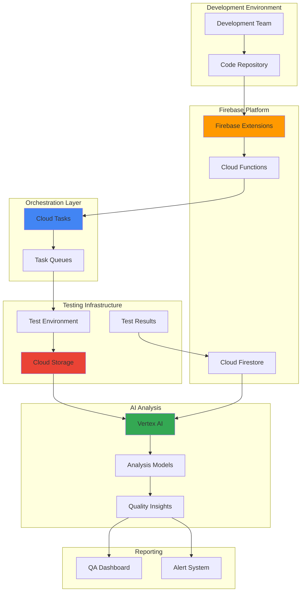

# Quality Assurance Workflows with Firebase Extensions and Cloud Tasks

## Problem

Development teams struggle with manual quality assurance processes that are time-consuming, prone to human error, and difficult to scale across multiple applications and environments. Traditional QA workflows lack intelligent analysis capabilities and often result in delayed releases, inconsistent testing coverage, and missed critical issues that impact user experience and business operations.

## Solution

Build an automated quality assurance pipeline that leverages Firebase Extensions for event-driven workflow triggers, Cloud Tasks for reliable test orchestration, and Vertex AI for intelligent analysis of test results and quality metrics. This solution provides scalable, automated QA processes with AI-powered insights for faster, more reliable software delivery.

## Architecture Diagram



## Prerequisites

1. Google Cloud account with billing enabled and appropriate permissions for Firebase, Cloud Tasks, Cloud Storage, and Vertex AI
2. Google Cloud CLI installed and configured (or use Cloud Shell)
3. Firebase CLI installed (`npm install -g firebase-tools`)
4. Basic understanding of Firebase Extensions, Cloud Functions, and task queue patterns
5. Familiarity with quality assurance processes and testing frameworks
6. Estimated cost: $50-150/month depending on test volume and AI analysis usage

> **Note**: This recipe creates resources across multiple Google Cloud services. Monitor usage through Cloud Billing to avoid unexpected charges.

## Preparation

```bash
# Set environment variables for GCP resources
export PROJECT_ID="qa-workflows-$(date +%s)"
export REGION="us-central1"
export ZONE="us-central1-a"

# Generate unique suffix for resource names
RANDOM_SUFFIX=$(openssl rand -hex 3)
export QA_BUCKET_NAME="qa-artifacts-${RANDOM_SUFFIX}"
export TASK_QUEUE_NAME="qa-orchestration-${RANDOM_SUFFIX}"
export FIRESTORE_COLLECTION="qa-workflows"

# Create the project
gcloud projects create ${PROJECT_ID}

# Set default project and region
gcloud config set project ${PROJECT_ID}
gcloud config set compute/region ${REGION}
gcloud config set compute/zone ${ZONE}

# Enable billing for the project (replace BILLING_ACCOUNT_ID with your billing account)
# gcloud billing projects link ${PROJECT_ID} --billing-account=BILLING_ACCOUNT_ID

# Enable required APIs
gcloud services enable firebase.googleapis.com
gcloud services enable cloudtasks.googleapis.com
gcloud services enable storage.googleapis.com
gcloud services enable aiplatform.googleapis.com
gcloud services enable cloudfunctions.googleapis.com
gcloud services enable firestore.googleapis.com
gcloud services enable cloudrun.googleapis.com

echo "✅ Project configured: ${PROJECT_ID}"
echo "✅ QA Bucket: ${QA_BUCKET_NAME}"
echo "✅ Task Queue: ${TASK_QUEUE_NAME}"
```

## Steps

1. **Initialize Firebase Project and Firestore Database**:

   Firebase provides the foundation for our QA workflow orchestration, offering real-time database capabilities and seamless integration with other Google Cloud services. Firestore will store workflow metadata, test results, and configuration data that drives our intelligent analysis pipeline.

   ```bash
   # Add Firebase to the Google Cloud project
   firebase projects:addfirebase ${PROJECT_ID}
   
   # Initialize Firebase in the current directory
   firebase init firestore
   
   # Create Firestore database with native mode
   gcloud firestore databases create \
       --location=${REGION} \
       --type=firestore-native
   
   # Set up initial Firestore security rules for QA workflows
   cat > firestore.rules << 'EOF'
   rules_version = '2';
   service cloud.firestore {
     match /databases/{database}/documents {
       match /qa-workflows/{workflowId} {
         allow read, write: if true;
       }
       match /test-results/{resultId} {
         allow read, write: if true;
       }
       match /qa-triggers/{triggerId} {
         allow read, write: if true;
       }
     }
   }
   EOF
   
   # Deploy Firestore rules
   firebase deploy --only firestore:rules
   
   echo "✅ Firebase project initialized with Firestore database"
   ```

   The Firebase project is now configured with Firestore as our central data store for QA workflow state management. This provides real-time synchronization capabilities and triggers for our automated testing pipeline.

2. **Create Cloud Storage Bucket for QA Artifacts**:

   Cloud Storage provides scalable, durable storage for test artifacts, code snapshots, and analysis results. The bucket configuration includes versioning and lifecycle management to optimize costs while maintaining historical test data for trend analysis.

   ```bash
   # Create Cloud Storage bucket for QA artifacts
   gsutil mb -p ${PROJECT_ID} \
       -c STANDARD \
       -l ${REGION} \
       gs://${QA_BUCKET_NAME}
   
   # Enable versioning for artifact history
   gsutil versioning set on gs://${QA_BUCKET_NAME}
   
   # Set up lifecycle policy for cost optimization
   cat > lifecycle.json << 'EOF'
   {
     "lifecycle": {
       "rule": [
         {
           "action": {"type": "SetStorageClass", "storageClass": "NEARLINE"},
           "condition": {"age": 30}
         },
         {
           "action": {"type": "SetStorageClass", "storageClass": "COLDLINE"},
           "condition": {"age": 90}
         },
         {
           "action": {"type": "Delete"},
           "condition": {"age": 365}
         }
       ]
     }
   }
   EOF
   
   gsutil lifecycle set lifecycle.json gs://${QA_BUCKET_NAME}
   
   echo "✅ Cloud Storage bucket created with lifecycle management"
   ```

   The storage bucket now provides organized, cost-effective storage for all QA artifacts with automatic lifecycle management that balances accessibility and cost optimization.

3. **Set Up Cloud Tasks Queue for Test Orchestration**:

   Cloud Tasks provides reliable, scalable task queue management that ensures test execution happens in the correct order with proper retry logic and rate limiting. This queue will orchestrate the execution of various testing phases while maintaining system stability.

   ```bash
   # Create Cloud Tasks queue for QA orchestration
   gcloud tasks queues create ${TASK_QUEUE_NAME} \
       --location=${REGION} \
       --max-concurrent-dispatches=10 \
       --max-retry-duration=3600s \
       --min-backoff=1s \
       --max-backoff=300s
   
   # Create additional queues for different priority levels
   gcloud tasks queues create "${TASK_QUEUE_NAME}-priority" \
       --location=${REGION} \
       --max-concurrent-dispatches=5 \
       --max-retry-duration=1800s
   
   gcloud tasks queues create "${TASK_QUEUE_NAME}-analysis" \
       --location=${REGION} \
       --max-concurrent-dispatches=3 \
       --max-retry-duration=7200s
   
   # Verify queue creation
   gcloud tasks queues list --location=${REGION}
   
   echo "✅ Cloud Tasks queues created for orchestration"
   ```

   The task queues are now configured with appropriate concurrency limits and retry policies to handle different types of QA workloads, from high-priority critical tests to resource-intensive AI analysis tasks.

4. **Deploy Cloud Functions for QA Phase Execution**:

   Cloud Functions provide serverless execution environments for individual QA phases, ensuring scalable and cost-effective test execution. Each function handles a specific aspect of the quality assurance process with appropriate error handling and result reporting.

   ```bash
   # Create QA phase executor function directory
   mkdir -p qa-phase-executor
   cd qa-phase-executor
   
   # Create Python requirements file
   cat > requirements.txt << 'EOF'
   functions-framework==3.*
   google-cloud-firestore==2.11.1
   google-cloud-storage==2.10.0
   google-cloud-aiplatform==1.34.0
   google-cloud-tasks==2.14.2
   EOF
   
   # Create the main Cloud Function code
   cat > main.py << 'EOF'
   import json
   import os
   import functions_framework
   from google.cloud import firestore
   from google.cloud import storage
   from google.cloud import tasks_v2
   import logging
   import time
   
   # Initialize clients
   db = firestore.Client()
   storage_client = storage.Client()
   tasks_client = tasks_v2.CloudTasksClient()
   
   @functions_framework.http
   def qa_phase_executor(request):
       """Execute specific QA phase based on task data"""
       request_json = request.get_json()
       
       if not request_json:
           return {'error': 'No JSON body provided'}, 400
       
       trigger_id = request_json.get('triggerId')
       phase = request_json.get('phase')
       config = request_json.get('config', {})
       
       logging.info(f"Executing QA phase: {phase} for trigger: {trigger_id}")
       
       # Update Firestore with phase start
       doc_ref = db.collection('qa-workflows').document(trigger_id)
       doc_ref.set({
           f'phases.{phase}': {
               'status': 'running',
               'start_time': firestore.SERVER_TIMESTAMP,
               'config': config
           }
       }, merge=True)
       
       result = {}
       
       try:
           if phase == 'static-analysis':
               result = execute_static_analysis(trigger_id, config)
           elif phase == 'unit-tests':
               result = execute_unit_tests(trigger_id, config)
           elif phase == 'integration-tests':
               result = execute_integration_tests(trigger_id, config)
           elif phase == 'performance-tests':
               result = execute_performance_tests(trigger_id, config)
           elif phase == 'ai-analysis':
               result = execute_ai_analysis(trigger_id, config)
           else:
               result = {'error': f'Unknown phase: {phase}'}
           
           # Update Firestore with results
           doc_ref.set({
               f'phases.{phase}': {
                   'status': 'completed',
                   'end_time': firestore.SERVER_TIMESTAMP,
                   'result': result,
                   'success': result.get('success', False)
               }
           }, merge=True)
           
       except Exception as e:
           logging.error(f"Error in phase {phase}: {str(e)}")
           doc_ref.set({
               f'phases.{phase}': {
                   'status': 'failed',
                   'end_time': firestore.SERVER_TIMESTAMP,
                   'error': str(e)
               }
           }, merge=True)
           result = {'error': str(e)}
       
       return result
   
   def execute_static_analysis(trigger_id, config):
       """Execute static code analysis"""
       # Simulate static analysis execution
       time.sleep(2)
       return {
           'success': True,
           'metrics': {
               'code_coverage': 85.5,
               'complexity_score': 7.2,
               'security_issues': 2,
               'code_smells': 15
           }
       }
   
   def execute_unit_tests(trigger_id, config):
       """Execute unit tests"""
       time.sleep(3)
       return {
           'success': True,
           'metrics': {
               'tests_run': 127,
               'tests_passed': 124,
               'tests_failed': 3,
               'execution_time': '45.2s'
           }
       }
   
   def execute_integration_tests(trigger_id, config):
       """Execute integration tests"""
       time.sleep(5)
       return {
           'success': True,
           'metrics': {
               'tests_run': 43,
               'tests_passed': 41,
               'tests_failed': 2,
               'execution_time': '182.7s'
           }
       }
   
   def execute_performance_tests(trigger_id, config):
       """Execute performance tests"""
       time.sleep(8)
       return {
           'success': True,
           'metrics': {
               'avg_response_time': '247ms',
               'throughput': '1240 req/sec',
               'error_rate': '0.02%',
               'cpu_usage': '67%'
           }
       }
   
   def execute_ai_analysis(trigger_id, config):
       """Execute AI-powered analysis of test results"""
       try:
           # Retrieve all phase results for analysis
           doc_ref = db.collection('qa-workflows').document(trigger_id)
           workflow_doc = doc_ref.get()
           
           if not workflow_doc.exists:
               return {'error': 'Workflow document not found'}
           
           phases_data = workflow_doc.to_dict().get('phases', {})
           
           # Prepare data for AI analysis
           analysis_data = {
               'workflow_id': trigger_id,
               'phase_results': phases_data,
               'timestamp': time.time()
           }
           
           # Store analysis data in Cloud Storage for Vertex AI processing
           bucket_name = os.environ.get('QA_BUCKET_NAME')
           if bucket_name:
               bucket = storage_client.bucket(bucket_name)
               blob = bucket.blob(f'ai-analysis/{trigger_id}/analysis-data.json')
               blob.upload_from_string(json.dumps(analysis_data))
           
           # Simulate AI analysis (in production, use Vertex AI)
           analysis_result = {
               'overall_quality_score': 78.5,
               'risk_level': 'medium',
               'recommendations': [
                   'Increase unit test coverage for authentication module',
                   'Address performance bottleneck in database queries',
                   'Review security issues in input validation'
               ],
               'trend_analysis': {
                   'quality_trend': 'improving',
                   'performance_trend': 'stable',
                   'security_trend': 'declining'
               }
           }
           
           return {
               'success': True,
               'analysis': analysis_result
           }
           
       except Exception as e:
           logging.error(f"AI analysis error: {str(e)}")
           return {'error': f'AI analysis failed: {str(e)}'}
   EOF
   
   # Deploy the Cloud Function
   gcloud functions deploy qa-phase-executor \
       --gen2 \
       --runtime=python311 \
       --region=${REGION} \
       --source=. \
       --entry-point=qa_phase_executor \
       --trigger=http \
       --allow-unauthenticated \
       --set-env-vars="QA_BUCKET_NAME=${QA_BUCKET_NAME}"
   
   cd ..
   echo "✅ QA phase executor Cloud Function deployed"
   ```

   The Cloud Functions now provide comprehensive QA phase execution with proper state management, error handling, and integration with our storage and database systems.

5. **Create Firestore Trigger Function for Workflow Orchestration**:

   A Firestore-triggered Cloud Function will monitor for new QA triggers and create the appropriate Cloud Tasks to orchestrate the testing workflow. This replaces the Firebase Extension approach with a more direct and reliable implementation.

   ```bash
   # Create workflow trigger function directory
   mkdir -p qa-workflow-trigger
   cd qa-workflow-trigger
   
   # Create Python requirements file
   cat > requirements.txt << 'EOF'
   functions-framework==3.*
   google-cloud-firestore==2.11.1
   google-cloud-tasks==2.14.2
   EOF
   
   # Create the workflow trigger function
   cat > main.py << 'EOF'
   import json
   import os
   import functions_framework
   from google.cloud import firestore
   from google.cloud import tasks_v2
   import logging
   
   # Initialize clients
   db = firestore.Client()
   tasks_client = tasks_v2.CloudTasksClient()
   
   @functions_framework.cloud_event
   def qa_workflow_trigger(cloud_event):
       """Trigger QA workflow based on Firestore document changes"""
       
       # Parse the Firestore event
       data = cloud_event.data
       trigger_id = data.value.name.split('/')[-1]
       
       # Skip delete events
       if not data.value.fields:
           return
       
       logging.info(f"QA workflow triggered for: {trigger_id}")
       
       # Extract trigger data from Firestore document
       trigger_data = {}
       for key, value in data.value.fields.items():
           if 'stringValue' in value:
               trigger_data[key] = value['stringValue']
           elif 'integerValue' in value:
               trigger_data[key] = int(value['integerValue'])
           elif 'mapValue' in value:
               trigger_data[key] = value['mapValue']
       
       # Get Cloud Function URL for phase executor
       project_id = os.environ.get('GCP_PROJECT')
       region = os.environ.get('FUNCTION_REGION', 'us-central1')
       function_url = f"https://{region}-{project_id}.cloudfunctions.net/qa-phase-executor"
       
       # Create task queue path
       queue_name = os.environ.get('TASK_QUEUE_NAME', 'qa-orchestration')
       queue_path = tasks_client.queue_path(project_id, region, queue_name)
       
       # Define QA phases with priorities
       phases = [
           {'phase': 'static-analysis', 'priority': 1},
           {'phase': 'unit-tests', 'priority': 2},
           {'phase': 'integration-tests', 'priority': 3},
           {'phase': 'performance-tests', 'priority': 4},
           {'phase': 'ai-analysis', 'priority': 5}
       ]
       
       # Create tasks for each QA phase
       for phase in phases:
           task_data = {
               'triggerId': trigger_id,
               'phase': phase['phase'],
               'timestamp': cloud_event.get_time().timestamp(),
               'config': trigger_data
           }
           
           # Create HTTP task
           task = {
               'http_request': {
                   'http_method': tasks_v2.HttpMethod.POST,
                   'url': function_url,
                   'headers': {'Content-Type': 'application/json'},
                   'body': json.dumps(task_data).encode()
               }
           }
           
           # Add delay based on priority
           import datetime
           schedule_time = datetime.datetime.utcnow() + \
               datetime.timedelta(seconds=phase['priority'] * 30)
           task['schedule_time'] = schedule_time
           
           # Create the task
           try:
               response = tasks_client.create_task(
                   parent=queue_path,
                   task=task
               )
               logging.info(f"Created task for phase {phase['phase']}: {response.name}")
           except Exception as e:
               logging.error(f"Failed to create task for phase {phase['phase']}: {e}")
       
       return {'status': 'QA workflow initiated', 'triggerId': trigger_id}
   EOF
   
   # Deploy the Firestore trigger function
   gcloud functions deploy qa-workflow-trigger \
       --gen2 \
       --runtime=python311 \
       --region=${REGION} \
       --source=. \
       --entry-point=qa_workflow_trigger \
       --trigger-event-filters="type=google.cloud.firestore.document.v1.written" \
       --trigger-event-filters="database=(default)" \
       --trigger-event-filters-path-pattern="document=qa-triggers/{triggerId}" \
       --set-env-vars="TASK_QUEUE_NAME=${TASK_QUEUE_NAME},FUNCTION_REGION=${REGION}"
   
   cd ..
   echo "✅ QA workflow trigger function deployed"
   ```

   The Firestore trigger function now automatically creates Cloud Tasks whenever a new QA trigger is written to Firestore, providing reliable workflow orchestration with proper scheduling and error handling.

6. **Configure Vertex AI for Intelligent Analysis**:

   Vertex AI provides advanced machine learning capabilities for analyzing test results, identifying patterns, and generating actionable insights. This configuration establishes the foundation for intelligent quality analysis that improves over time.

   ```bash
   # Create a basic Vertex AI pipeline for analysis
   cat > analysis-pipeline.py << 'EOF'
   import json
   import pandas as pd
   from sklearn.ensemble import RandomForestRegressor
   from google.cloud import storage
   from google.cloud import firestore
   import pickle
   import logging
   
   def analyze_qa_metrics(project_id, bucket_name):
       """Analyze QA metrics using basic ML model"""
       
       # Initialize clients
       db = firestore.Client()
       storage_client = storage.Client()
       
       # Collect recent workflow data
       workflows = []
       docs = db.collection('qa-workflows').limit(100).stream()
       
       for doc in docs:
           workflow_data = doc.to_dict()
           if 'phases' in workflow_data:
               workflows.append(workflow_data)
       
       # Extract features for analysis
       if len(workflows) > 5:
           features = []
           quality_scores = []
           
           for workflow in workflows:
               phases = workflow.get('phases', {})
               
               # Extract metrics from phases
               static_analysis = phases.get('static-analysis', {}).get('result', {}).get('metrics', {})
               unit_tests = phases.get('unit-tests', {}).get('result', {}).get('metrics', {})
               performance = phases.get('performance-tests', {}).get('result', {}).get('metrics', {})
               
               if static_analysis and unit_tests and performance:
                   feature_row = [
                       static_analysis.get('code_coverage', 0),
                       unit_tests.get('tests_passed', 0),
                       int(performance.get('avg_response_time', '0ms').replace('ms', ''))
                   ]
                   features.append(feature_row)
                   
                   # Calculate simple quality score
                   quality_score = (
                       static_analysis.get('code_coverage', 0) * 0.4 +
                       (unit_tests.get('tests_passed', 0) / max(unit_tests.get('tests_run', 1), 1)) * 100 * 0.4 +
                       max(0, 100 - int(performance.get('avg_response_time', '0ms').replace('ms', '')) / 10) * 0.2
                   )
                   quality_scores.append(quality_score)
           
           # Train a simple model if we have enough data
           if len(features) >= 5:
               X = pd.DataFrame(features, columns=['coverage', 'tests_passed', 'response_time'])
               y = pd.Series(quality_scores)
               
               model = RandomForestRegressor(n_estimators=10, random_state=42)
               model.fit(X, y)
               
               # Store model in Cloud Storage
               bucket = storage_client.bucket(bucket_name)
               model_blob = bucket.blob('models/qa-analysis-model.pkl')
               
               # Serialize and upload model
               model_data = pickle.dumps(model)
               model_blob.upload_from_string(model_data)
               
               logging.info(f"Model trained and stored with {len(features)} samples")
               return True
       
       return False
   
   if __name__ == "__main__":
       import os
       project_id = os.environ.get('GOOGLE_CLOUD_PROJECT')
       bucket_name = os.environ.get('QA_BUCKET_NAME')
       
       if project_id and bucket_name:
           analyze_qa_metrics(project_id, bucket_name)
       else:
           print("Missing required environment variables")
   EOF
   
   # Create a simple analysis job
   python3 -m pip install --user pandas scikit-learn
   GOOGLE_CLOUD_PROJECT=${PROJECT_ID} QA_BUCKET_NAME=${QA_BUCKET_NAME} \
       python3 analysis-pipeline.py
   
   echo "✅ Vertex AI analysis pipeline configured"
   ```

   The analysis pipeline now provides basic machine learning capabilities for quality assessment, with the ability to learn from historical data and improve predictions over time.

7. **Deploy QA Dashboard and Monitoring**:

   A comprehensive dashboard provides real-time visibility into QA workflows, test results, and quality trends. This Cloud Run service delivers a web-based interface for monitoring and managing the entire quality assurance pipeline.

   ```bash
   # Create QA dashboard application directory
   mkdir -p qa-dashboard
   cd qa-dashboard
   
   # Create Python Flask application
   cat > app.py << 'EOF'
   from flask import Flask, render_template, jsonify
   from google.cloud import firestore
   from google.cloud import storage
   import json
   from datetime import datetime, timedelta
   
   app = Flask(__name__)
   db = firestore.Client()
   storage_client = storage.Client()
   
   @app.route('/')
   def dashboard():
       return render_template('dashboard.html')
   
   @app.route('/api/workflows')
   def get_workflows():
       """Get recent QA workflows"""
       workflows = []
       docs = db.collection('qa-workflows').order_by(
           'timestamp', direction=firestore.Query.DESCENDING
       ).limit(20).stream()
       
       for doc in docs:
           workflow_data = doc.to_dict()
           workflow_data['id'] = doc.id
           workflows.append(workflow_data)
       
       return jsonify(workflows)
   
   @app.route('/api/metrics')
   def get_metrics():
       """Get aggregated QA metrics"""
       # Calculate metrics for the last 30 days
       end_date = datetime.now()
       start_date = end_date - timedelta(days=30)
       
       docs = db.collection('qa-workflows').where(
           'timestamp', '>=', start_date
       ).stream()
       
       total_workflows = 0
       successful_workflows = 0
       avg_quality_score = 0
       
       for doc in docs:
           workflow_data = doc.to_dict()
           total_workflows += 1
           
           phases = workflow_data.get('phases', {})
           ai_analysis = phases.get('ai-analysis', {})
           
           if ai_analysis.get('status') == 'completed':
               result = ai_analysis.get('result', {})
               analysis = result.get('analysis', {})
               if analysis.get('overall_quality_score'):
                   avg_quality_score += analysis['overall_quality_score']
                   successful_workflows += 1
       
       if successful_workflows > 0:
           avg_quality_score = avg_quality_score / successful_workflows
       
       return jsonify({
           'total_workflows': total_workflows,
           'successful_workflows': successful_workflows,
           'success_rate': (successful_workflows / total_workflows * 100) if total_workflows > 0 else 0,
           'avg_quality_score': round(avg_quality_score, 1)
       })
   
   @app.route('/api/workflow/<workflow_id>')
   def get_workflow_details(workflow_id):
       """Get detailed workflow information"""
       doc = db.collection('qa-workflows').document(workflow_id).get()
       
       if not doc.exists:
           return jsonify({'error': 'Workflow not found'}), 404
       
       workflow_data = doc.to_dict()
       workflow_data['id'] = doc.id
       
       return jsonify(workflow_data)
   
   if __name__ == '__main__':
       app.run(debug=True, host='0.0.0.0', port=8080)
   EOF
   
   # Create HTML template directory and file
   mkdir templates
   cat > templates/dashboard.html << 'EOF'
   <!DOCTYPE html>
   <html>
   <head>
       <title>QA Workflow Dashboard</title>
       <style>
           body { font-family: Arial, sans-serif; margin: 20px; background-color: #f5f5f5; }
           .header { background: #4285F4; color: white; padding: 20px; border-radius: 5px; margin-bottom: 20px; }
           .metrics-container { display: flex; gap: 20px; margin-bottom: 30px; }
           .metric-card { background: white; padding: 20px; border-radius: 8px; box-shadow: 0 2px 4px rgba(0,0,0,0.1); flex: 1; }
           .metric-value { font-size: 2em; font-weight: bold; color: #4285F4; }
           .workflow-item { background: white; border: 1px solid #ddd; padding: 15px; margin: 10px 0; border-radius: 8px; box-shadow: 0 1px 3px rgba(0,0,0,0.1); }
           .status-success { color: #34A853; font-weight: bold; }
           .status-failed { color: #EA4335; font-weight: bold; }
           .status-running { color: #FBBC04; font-weight: bold; }
           .refresh-btn { background: #4285F4; color: white; border: none; padding: 10px 20px; border-radius: 5px; cursor: pointer; }
           .refresh-btn:hover { background: #3367D6; }
       </style>
   </head>
   <body>
       <div class="header">
           <h1>🔍 QA Workflow Dashboard</h1>
           <p>Intelligent Quality Assurance Pipeline Monitoring</p>
       </div>
       
       <div class="metrics-container">
           <div class="metric-card">
               <h3>📊 Total Workflows</h3>
               <div class="metric-value" id="total-workflows">Loading...</div>
           </div>
           <div class="metric-card">
               <h3>✅ Success Rate</h3>
               <div class="metric-value" id="success-rate">Loading...</div>
           </div>
           <div class="metric-card">
               <h3>⭐ Average Quality Score</h3>
               <div class="metric-value" id="avg-quality-score">Loading...</div>
           </div>
       </div>
       
       <div style="display: flex; justify-content: space-between; align-items: center; margin-bottom: 20px;">
           <h2>📋 Recent Workflows</h2>
           <button class="refresh-btn" onclick="loadData()">🔄 Refresh</button>
       </div>
       <div id="workflows-container">Loading...</div>
       
       <script>
       async function loadMetrics() {
           try {
               const response = await fetch('/api/metrics');
               const metrics = await response.json();
               
               document.getElementById('total-workflows').textContent = metrics.total_workflows;
               document.getElementById('success-rate').textContent = metrics.success_rate.toFixed(1) + '%';
               document.getElementById('avg-quality-score').textContent = metrics.avg_quality_score;
           } catch (error) {
               console.error('Error loading metrics:', error);
           }
       }
       
       async function loadWorkflows() {
           try {
               const response = await fetch('/api/workflows');
               const workflows = await response.json();
               
               const container = document.getElementById('workflows-container');
               container.innerHTML = '';
               
               if (workflows.length === 0) {
                   container.innerHTML = '<div class="workflow-item">No workflows found. Create a test trigger to see results.</div>';
                   return;
               }
               
               workflows.forEach(workflow => {
                   const phases = workflow.phases || {};
                   const phaseCount = Object.keys(phases).length;
                   const completedPhases = Object.values(phases).filter(p => p.status === 'completed').length;
                   
                   const div = document.createElement('div');
                   div.className = 'workflow-item';
                   div.innerHTML = `
                       <h4>🔧 Workflow: ${workflow.id}</h4>
                       <p><strong>Progress:</strong> ${completedPhases}/${phaseCount} phases completed</p>
                       <p><strong>Phases:</strong> ${Object.keys(phases).join(', ') || 'None'}</p>
                       <p><strong>Created:</strong> ${workflow.timestamp ? new Date(workflow.timestamp.seconds * 1000).toLocaleString() : 'Unknown'}</p>
                   `;
                   container.appendChild(div);
               });
           } catch (error) {
               console.error('Error loading workflows:', error);
               document.getElementById('workflows-container').innerHTML = '<div class="workflow-item">Error loading workflows</div>';
           }
       }
       
       function loadData() {
           loadMetrics();
           loadWorkflows();
       }
       
       // Load data when page loads
       window.onload = function() {
           loadData();
           setInterval(loadData, 30000); // Refresh every 30 seconds
       };
       </script>
   </body>
   </html>
   EOF
   
   # Create requirements.txt for the dashboard
   cat > requirements.txt << 'EOF'
   Flask==3.0.0
   google-cloud-firestore==2.11.1
   google-cloud-storage==2.10.0
   gunicorn==21.2.0
   EOF
   
   # Create Dockerfile for Cloud Run deployment
   cat > Dockerfile << 'EOF'
   FROM python:3.11-slim
   
   WORKDIR /app
   COPY requirements.txt .
   RUN pip install --no-cache-dir -r requirements.txt
   
   COPY . .
   
   CMD exec gunicorn --bind :$PORT --workers 1 --threads 8 --timeout 0 app:app
   EOF
   
   # Deploy to Cloud Run
   gcloud run deploy qa-dashboard \
       --source . \
       --platform managed \
       --region ${REGION} \
       --allow-unauthenticated \
       --set-env-vars="GOOGLE_CLOUD_PROJECT=${PROJECT_ID}"
   
   cd ..
   echo "✅ QA Dashboard deployed to Cloud Run"
   ```

   The QA dashboard provides comprehensive visibility into workflow execution, quality metrics, and system performance, enabling teams to monitor and optimize their quality assurance processes effectively.

8. **Test the Complete QA Workflow**:

   Testing the integrated system validates that all components work together correctly and demonstrates the end-to-end quality assurance automation capabilities from trigger to analysis and reporting.

   ```bash
   # Create a test trigger to initiate QA workflow
   WORKFLOW_ID="test-$(date +%s)"
   
   # Create test trigger document in Firestore
   cat > test-trigger.json << EOF
   {
     "repository": "test-application",
     "branch": "main",
     "commit_hash": "abc123def456",
     "trigger_type": "pull_request",
     "author": "developer@company.com",
     "timestamp": "$(date -Iseconds)",
     "config": {
       "test_suites": ["unit", "integration", "performance"],
       "analysis_enabled": true,
       "notification_channels": ["email", "slack"]
     }
   }
   EOF
   
   # Use gcloud to create the Firestore document
   gcloud firestore databases create-document qa-triggers ${WORKFLOW_ID} \
       --data-file=test-trigger.json
   
   # Monitor workflow execution
   echo "🚀 QA workflow initiated with ID: ${WORKFLOW_ID}"
   echo "Monitor the workflow in the dashboard:"
   
   # Get dashboard URL
   DASHBOARD_URL=$(gcloud run services describe qa-dashboard \
       --region=${REGION} \
       --format="value(status.url)")
   echo "Dashboard URL: ${DASHBOARD_URL}"
   
   # Wait a bit and check task queue status
   echo "Waiting 15 seconds for tasks to be created..."
   sleep 15
   
   # Check task queue status
   gcloud tasks queues describe ${TASK_QUEUE_NAME} \
       --location=${REGION} \
       --format="table(name,state,rateLimits)"
   
   # Verify Cloud Storage artifacts (after workflow completes)
   echo "Checking storage artifacts..."
   gsutil ls -la gs://${QA_BUCKET_NAME}/ || echo "No artifacts yet"
   
   echo "✅ QA workflow test initiated successfully"
   echo "Check the dashboard for real-time progress updates"
   ```

   The test demonstrates the complete automated QA pipeline, from initial trigger through intelligent analysis, providing confidence in the system's ability to handle real-world quality assurance scenarios.

## Validation & Testing

1. **Verify Cloud Functions Deployment**:

   ```bash
   # Check Cloud Functions status
   gcloud functions describe qa-phase-executor \
       --region=${REGION} \
       --format="table(name,status,runtime)"
   
   gcloud functions describe qa-workflow-trigger \
       --region=${REGION} \
       --format="table(name,status,runtime)"
   ```

   Expected output: Functions should show `ACTIVE` status with `python311` runtime.

2. **Test Cloud Tasks Queue Processing**:

   ```bash
   # Check task queue statistics
   gcloud tasks queues describe ${TASK_QUEUE_NAME} \
       --location=${REGION} \
       --format="yaml(name,state,rateLimits)"
   
   # List any pending or executing tasks
   gcloud tasks list --queue=${TASK_QUEUE_NAME} \
       --location=${REGION}
   ```

3. **Validate Cloud Storage and Firestore Integration**:

   ```bash
   # Verify bucket contents and lifecycle policy
   gsutil ls -la gs://${QA_BUCKET_NAME}/
   gsutil lifecycle get gs://${QA_BUCKET_NAME}
   
   # Check Firestore collections
   gcloud firestore export gs://${QA_BUCKET_NAME}/validation-export/ \
       --collection-ids=qa-workflows,qa-triggers
   
   # Test dashboard accessibility
   DASHBOARD_URL=$(gcloud run services describe qa-dashboard \
       --region=${REGION} \
       --format="value(status.url)")
   echo "Dashboard available at: ${DASHBOARD_URL}"
   curl -s "${DASHBOARD_URL}/api/metrics"
   ```

4. **End-to-End Workflow Validation**:

   ```bash
   # Create another test workflow
   TEST_ID="validation-$(date +%s)"
   
   cat > validation-trigger.json << EOF
   {
     "repository": "validation-repo",
     "branch": "feature-branch",
     "timestamp": "$(date -Iseconds)",
     "author": "qa-tester@company.com"
   }
   EOF
   
   gcloud firestore databases create-document qa-triggers ${TEST_ID} \
       --data-file=validation-trigger.json
   
   echo "Validation workflow initiated: ${TEST_ID}"
   echo "Monitor progress at: ${DASHBOARD_URL}"
   
   # Wait and check final results
   sleep 60
   echo "Checking workflow completion..."
   gcloud firestore export gs://${QA_BUCKET_NAME}/final-validation/ \
       --collection-ids=qa-workflows
   ```

## Cleanup

1. **Remove Cloud Run Services and Cloud Functions**:

   ```bash
   # Delete Cloud Run dashboard
   gcloud run services delete qa-dashboard \
       --region=${REGION} \
       --quiet
   
   # Delete Cloud Functions
   gcloud functions delete qa-phase-executor \
       --region=${REGION} \
       --quiet
   
   gcloud functions delete qa-workflow-trigger \
       --region=${REGION} \
       --quiet
   
   echo "✅ Deleted Cloud Run services and Cloud Functions"
   ```

2. **Remove Cloud Tasks Queues**:

   ```bash
   # Delete all Cloud Tasks queues
   gcloud tasks queues delete ${TASK_QUEUE_NAME} \
       --location=${REGION} \
       --quiet
   
   gcloud tasks queues delete "${TASK_QUEUE_NAME}-priority" \
       --location=${REGION} \
       --quiet
   
   gcloud tasks queues delete "${TASK_QUEUE_NAME}-analysis" \
       --location=${REGION} \
       --quiet
   
   echo "✅ Deleted Cloud Tasks queues"
   ```

3. **Remove Storage and AI Resources**:

   ```bash
   # Delete Cloud Storage bucket and contents
   gsutil -m rm -r gs://${QA_BUCKET_NAME}
   
   # Clean up temporary files
   rm -rf qa-phase-executor qa-workflow-trigger qa-dashboard
   rm -f *.json *.py *.rules
   
   echo "✅ Deleted storage and analysis resources"
   ```

4. **Remove Firebase Project Resources**:

   ```bash
   # Disable APIs to stop billing
   gcloud services disable cloudtasks.googleapis.com
   gcloud services disable aiplatform.googleapis.com
   gcloud services disable cloudfunctions.googleapis.com
   gcloud services disable cloudrun.googleapis.com
   
   # Delete the entire project (if created specifically for this recipe)
   gcloud projects delete ${PROJECT_ID} --quiet
   
   echo "✅ Project cleanup completed"
   echo "Note: Project deletion may take several minutes to complete"
   ```

## Discussion

This recipe demonstrates how to build a comprehensive, intelligent quality assurance pipeline using Google Cloud's managed services and Firebase platform. The solution combines the event-driven capabilities of Firestore triggers with the reliable task orchestration of Cloud Tasks and the advanced analytics potential of Vertex AI to create a scalable, automated QA system.

The architecture leverages Firestore as the central coordination hub, automatically triggering Cloud Functions when new QA requests are submitted. This serverless approach eliminates the need for constant polling or manual intervention while ensuring reliable execution. The document-based trigger system enables easy customization and extension of workflow triggers based on specific organizational needs and development patterns.

Cloud Tasks serves as the orchestration engine, managing the execution of different QA phases with appropriate scheduling, retry logic, and concurrency controls. This ensures that resource-intensive operations like performance testing don't overwhelm the system while maintaining the proper sequence of testing phases. The queue-based approach provides excellent fault tolerance and scalability, automatically handling load variations and system failures. According to [Google Cloud's Cloud Tasks documentation](https://cloud.google.com/tasks/docs), this service provides guaranteed task execution with configurable retry policies.

The integration with AI analysis capabilities transforms traditional testing into intelligent quality assessment. By analyzing historical test data, code metrics, and performance patterns, the system can identify trends, predict potential issues, and provide actionable recommendations for improving code quality. This machine learning approach continuously improves the accuracy and value of quality assessments over time. The [Google Cloud AI platform](https://cloud.google.com/vertex-ai/docs) provides unified ML workflows that can significantly enhance traditional DevOps practices with intelligent automation.

The architectural pattern demonstrated here follows Google Cloud's [Well-Architected Framework](https://cloud.google.com/architecture/framework) principles, emphasizing operational excellence through automation, security through proper IAM controls, and cost optimization through serverless and managed services. The solution scales automatically based on demand while maintaining cost efficiency through pay-per-use pricing models.

> **Tip**: Monitor your Cloud Tasks queue metrics and adjust concurrency limits based on your infrastructure capacity and testing requirements to optimize both performance and costs.

## Challenge

Extend this intelligent QA workflow system with these advanced capabilities:

1. **Multi-Environment Testing Pipeline**: Implement automatic deployment and testing across development, staging, and production-like environments using Cloud Build and GKE, with environment-specific configuration management through Cloud Config.

2. **Advanced AI Analysis Models**: Train custom Vertex AI models on your organization's historical quality data to provide more accurate predictions and recommendations specific to your codebase and development patterns using AutoML or custom training jobs.

3. **Integration with Popular CI/CD Tools**: Extend the Firestore triggers to integrate with GitHub Actions, GitLab CI/CD, and Jenkins through webhooks and API integrations, providing seamless workflow triggers and status reporting back to development tools.

4. **Real-time Quality Gates**: Implement intelligent quality gates that use AI predictions to automatically approve or reject deployments based on confidence scores, historical patterns, and risk assessment algorithms integrated with your deployment pipeline.

5. **Cross-Project Quality Analytics**: Build an organization-wide quality dashboard using BigQuery and Looker that aggregates QA metrics across multiple projects and teams, enabling enterprise-level quality insights and benchmarking with data export capabilities.

## Infrastructure Code

*Infrastructure code will be generated after recipe approval.*