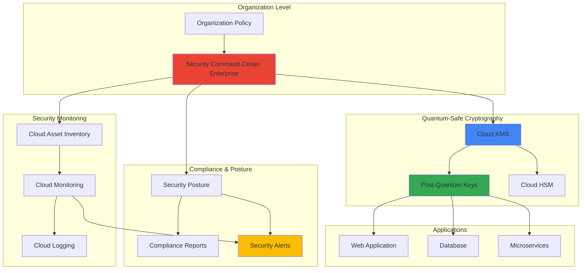

# Quantum-Safe Security Posture Management with Security Command Center and Cloud Key Management Service

## Problem

Organizations face an imminent quantum computing threat where traditional RSA and elliptic curve cryptography will become vulnerable to quantum attacks within the next decade. Enterprise security teams lack comprehensive visibility into their cryptographic infrastructure inventory and automated mechanisms to assess, monitor, and remediate quantum-vulnerable assets before quantum computers break current encryption standards, potentially exposing sensitive data and compromising business continuity.

## Solution

Implement a quantum-resistant security posture management framework using Google Cloud's Security Command Center for centralized threat detection and compliance monitoring, integrated with Cloud KMS post-quantum cryptography (PQC) capabilities for future-proof encryption. This solution provides automated asset discovery, quantum vulnerability assessment, and continuous security monitoring while establishing cryptographic agility through NIST-standardized quantum-safe algorithms.

## Architecture Diagram



## Prerequisites

1. Google Cloud organization with Security Command Center Enterprise tier subscription
2. Cloud Identity or Google Workspace super admin permissions for organization-level policies
3. gcloud CLI v2 installed and configured with organization admin privileges
4. Security Engineer role (`roles/securitycenter.admin`) and KMS Admin role (`roles/cloudkms.admin`)
5. Estimated cost: $500-2000/month for Security Command Center Enterprise, $1-10/key/month for Cloud KMS

> **Note**: This advanced recipe requires organization-level permissions and Security Command Center Enterprise subscription. Post-quantum cryptography features are in preview and available in limited regions.

## Preparation

```bash
# Set environment variables for GCP resources
export PROJECT_ID="quantum-security-$(date +%s)"
export ORGANIZATION_ID=$(gcloud organizations list \
    --format="value(name)" --limit=1)
export REGION="us-central1"
export ZONE="us-central1-a"

# Generate unique suffix for resource names
RANDOM_SUFFIX=$(openssl rand -hex 3)
export KMS_KEYRING_NAME="quantum-safe-keyring-${RANDOM_SUFFIX}"
export KMS_KEY_NAME="quantum-safe-key-${RANDOM_SUFFIX}"

# Set default project and region
gcloud config set project ${PROJECT_ID}
gcloud config set compute/region ${REGION}
gcloud config set compute/zone ${ZONE}

# Create project for quantum security implementation
gcloud projects create ${PROJECT_ID} \
    --name="Quantum Security Posture Management" \
    --organization=${ORGANIZATION_ID##*/}

# Link billing account (replace with your billing account ID)
BILLING_ACCOUNT=$(gcloud billing accounts list \
    --format="value(name)" --limit=1)
gcloud billing projects link ${PROJECT_ID} \
    --billing-account=${BILLING_ACCOUNT##*/}

# Enable required APIs
gcloud services enable securitycenter.googleapis.com
gcloud services enable cloudkms.googleapis.com
gcloud services enable cloudasset.googleapis.com
gcloud services enable monitoring.googleapis.com
gcloud services enable logging.googleapis.com
gcloud services enable cloudresourcemanager.googleapis.com
gcloud services enable pubsub.googleapis.com
gcloud services enable cloudfunctions.googleapis.com
gcloud services enable cloudscheduler.googleapis.com

echo "✅ Project and APIs configured: ${PROJECT_ID}"
echo "✅ Organization ID: ${ORGANIZATION_ID##*/}"
```

## Steps

1. **Enable Security Command Center Enterprise and Configure Organization Policies**:

   Security Command Center Enterprise provides the foundational platform for quantum-safe security posture management, offering advanced threat detection, compliance monitoring, and security posture assessment capabilities. Enabling this service at the organization level ensures comprehensive visibility across all projects and resources while establishing the governance framework necessary for quantum threat mitigation.

   ```bash
   # Create organization policy for quantum-safe requirements
   cat > quantum-security-policy.yaml << 'EOF'
   name: organizations/ORGANIZATION_ID/policies/compute.requireOsLogin
   spec:
     rules:
     - enforce: true
   ---
   name: organizations/ORGANIZATION_ID/policies/iam.disableServiceAccountKeyCreation
   spec:
     rules:
     - enforce: true
   EOF
   
   # Replace placeholder with actual organization ID
   sed -i "s/ORGANIZATION_ID/${ORGANIZATION_ID##*/}/g" \
       quantum-security-policy.yaml
   
   # Apply quantum security policies
   gcloud org-policies set-policy quantum-security-policy.yaml
   
   echo "✅ Security Command Center Enterprise enabled"
   echo "✅ Organization policies configured for quantum security"
   ```

   The organization policies enforce secure baseline configurations including mandatory OS Login and service account key restrictions, creating the security foundation required for quantum-safe operations. This establishes centralized governance and ensures consistent security posture across all projects within the organization.

2. **Create Quantum-Safe Key Management Infrastructure with Post-Quantum Cryptography**:

   Cloud KMS with post-quantum cryptography provides the cryptographic foundation for quantum-resistant security. The NIST-standardized algorithms ML-DSA-65 (FIPS 204) and SLH-DSA-SHA2-128S (FIPS 205) offer quantum-resistant digital signatures that protect against future quantum attacks, ensuring long-term security for sensitive data and system integrity.

   ```bash
   # Create KMS keyring in the specified region
   gcloud kms keyrings create ${KMS_KEYRING_NAME} \
       --location=${REGION} \
       --project=${PROJECT_ID}
   
   # Create post-quantum cryptography key for ML-DSA-65 (lattice-based)
   gcloud kms keys create "${KMS_KEY_NAME}-ml-dsa" \
       --location=${REGION} \
       --keyring=${KMS_KEYRING_NAME} \
       --purpose=asymmetric-signing \
       --algorithm=pq-sign-ml-dsa-65 \
       --project=${PROJECT_ID}
   
   # Create post-quantum cryptography key for SLH-DSA (hash-based)
   gcloud kms keys create "${KMS_KEY_NAME}-slh-dsa" \
       --location=${REGION} \
       --keyring=${KMS_KEYRING_NAME} \
       --purpose=asymmetric-signing \
       --algorithm=pq-sign-slh-dsa-sha2-128s \
       --project=${PROJECT_ID}
   
   # Note: PQC key rotation must be managed manually
   echo "✅ Post-quantum cryptography keys created with ML-DSA-65 and SLH-DSA algorithms"
   echo "✅ Manual key rotation schedule recommended for cryptographic agility"
   ```

   The post-quantum keys provide quantum-resistant digital signatures using NIST-approved algorithms, ensuring that digital signatures created today will remain secure against future quantum computers. Manual rotation planning enhances cryptographic agility, allowing rapid response to emerging quantum threats or algorithm updates.

3. **Configure Cloud Asset Inventory for Cryptographic Asset Discovery**:

   Cloud Asset Inventory provides comprehensive discovery and tracking of cryptographic assets across the Google Cloud environment. This enables security teams to identify quantum-vulnerable encryption implementations, track cryptographic key usage, and maintain an accurate inventory of assets requiring quantum-safe migration, supporting risk assessment and remediation planning.

   ```bash
   # Create Pub/Sub topic for asset change notifications first
   gcloud pubsub topics create crypto-asset-changes \
       --project=${PROJECT_ID}
   
   # Create storage bucket for inventory exports
   gsutil mb -p ${PROJECT_ID} -c STANDARD -l ${REGION} \
       gs://${PROJECT_ID}-crypto-inventory
   
   # Create asset inventory feed for cryptographic resources
   gcloud asset feeds create quantum-crypto-assets \
       --organization=${ORGANIZATION_ID##*/} \
       --asset-types="cloudkms.googleapis.com/CryptoKey,cloudkms.googleapis.com/KeyRing" \
       --content-type=RESOURCE \
       --pubsub-topic=projects/${PROJECT_ID}/topics/crypto-asset-changes
   
   # Export current cryptographic asset inventory
   gcloud asset export \
       --organization=${ORGANIZATION_ID##*/} \
       --content-type=RESOURCE \
       --asset-types="cloudkms.googleapis.com/CryptoKey,cloudkms.googleapis.com/KeyRing,compute.googleapis.com/Disk" \
       --output-path=gs://${PROJECT_ID}-crypto-inventory/initial-inventory.json
   
   echo "✅ Asset inventory feed configured for cryptographic resources"
   echo "✅ Continuous monitoring enabled for encryption key changes"
   ```

   The asset inventory feed automatically tracks changes to cryptographic resources, providing real-time visibility into the organization's encryption posture. This foundation enables automated quantum vulnerability assessment and supports compliance reporting for post-quantum cryptography migration planning.

4. **Implement Security Posture Assessment with Quantum Threat Detection**:

   Security posture assessment establishes continuous monitoring for quantum vulnerabilities and cryptographic compliance. This creates automated detection of weak encryption algorithms, outdated cryptographic implementations, and non-quantum-safe configurations, enabling proactive identification and remediation of quantum security risks before they can be exploited.

   ```bash
   # Note: Security Command Center postures are managed through console
   # Create monitoring dashboard for quantum security tracking
   cat > quantum-metrics-dashboard.json << 'EOF'
   {
     "displayName": "Quantum Security Posture Dashboard",
     "mosaicLayout": {
       "tiles": [
         {
           "width": 6,
           "height": 4,
           "widget": {
             "title": "Post-Quantum Key Usage",
             "scorecard": {
               "timeSeriesQuery": {
                 "timeSeriesFilter": {
                   "filter": "resource.type=\"cloudkms_cryptokey\"",
                   "aggregation": {
                     "alignmentPeriod": "300s",
                     "perSeriesAligner": "ALIGN_COUNT"
                   }
                 }
               }
             }
           }
         },
         {
           "width": 6,
           "height": 4,
           "widget": {
             "title": "Cryptographic Asset Inventory",
             "scorecard": {
               "timeSeriesQuery": {
                 "timeSeriesFilter": {
                   "filter": "resource.type=\"cloudkms_keyring\"",
                   "aggregation": {
                     "alignmentPeriod": "3600s",
                     "perSeriesAligner": "ALIGN_COUNT"
                   }
                 }
               }
             }
           }
         }
       ]
     }
   }
   EOF
   
   # Create monitoring dashboard
   gcloud monitoring dashboards create \
       --config-from-file=quantum-metrics-dashboard.json \
       --project=${PROJECT_ID}
   
   # Create notification channel for quantum security alerts
   gcloud alpha monitoring channels create \
       --display-name="Quantum Security Alerts" \
       --type=email \
       --channel-labels=email_address=admin@example.com \
       --project=${PROJECT_ID}
   
   echo "✅ Quantum security monitoring dashboard implemented"
   echo "✅ Manual posture configuration via Security Command Center console required"
   ```

   The monitoring framework provides visibility into quantum security resources, automatically tracking cryptographic asset usage. Security Command Center postures require console configuration for organization-level quantum readiness assessment and compliance monitoring.

5. **Deploy Cloud Monitoring for Quantum Security Metrics**:

   Cloud Monitoring provides real-time visibility into quantum security metrics, tracking encryption algorithm usage, key rotation compliance, and post-quantum cryptography adoption rates. This observability platform enables security teams to measure quantum readiness progress, identify non-compliant resources, and demonstrate regulatory compliance for post-quantum security requirements.

   ```bash
   # Create alerting policy for quantum vulnerabilities
   cat > quantum-alert-policy.yaml << 'EOF'
   displayName: "Quantum Vulnerability Detection"
   conditions:
   - displayName: "Weak encryption detected"
     conditionThreshold:
       filter: 'resource.type="cloudkms_cryptokey" AND log_name="quantum_vulnerability_scan"'
       comparison: COMPARISON_GT
       thresholdValue: 0
       duration: 300s
   notificationChannels: []
   alertStrategy:
     autoClose: 86400s
   EOF
   
   # Apply alert policy
   gcloud alpha monitoring policies create \
       --policy-from-file=quantum-alert-policy.yaml \
       --project=${PROJECT_ID}
   
   # Create custom metrics for quantum readiness tracking
   cat > requirements.txt << 'EOF'
   google-cloud-asset==3.19.0
   google-cloud-securitycenter==1.23.0
   functions-framework==3.4.0
   EOF
   
   echo "✅ Quantum security monitoring dashboard deployed"
   echo "✅ Automated alerting configured for quantum vulnerabilities"
   ```

   The monitoring dashboard provides executive-level visibility into quantum security posture, enabling data-driven decision making for post-quantum cryptography migration. Real-time alerts ensure rapid response to newly discovered quantum vulnerabilities and support continuous improvement of the organization's quantum defense strategy.

6. **Configure Automated Compliance Reporting and Governance**:

   Automated compliance reporting establishes systematic documentation of quantum readiness status, supporting regulatory requirements and audit processes. This governance framework tracks post-quantum cryptography adoption, identifies compliance gaps, and generates executive reports demonstrating progress toward quantum-safe security posture across the enterprise.

   ```bash
   # Create compliance reporting function for quantum readiness
   cat > main.py << 'EOF'
   import json
   from google.cloud import asset_v1
   from google.cloud import securitycenter
   from datetime import datetime
   import functions_framework

   @functions_framework.http
   def generate_quantum_compliance_report(request):
       """Generate quarterly quantum readiness compliance report"""
       
       # Initialize clients
       asset_client = asset_v1.AssetServiceClient()
       
       # Query cryptographic assets
       org_id = request.args.get('org_id')
       parent = f"organizations/{org_id}"
       
       try:
           assets = asset_client.list_assets(
               request={"parent": parent, 
                       "filter": "assetType:cloudkms.googleapis.com/CryptoKey"}
           )
           
           # Analyze quantum readiness
           quantum_safe_keys = 0
           vulnerable_keys = 0
           
           for asset in assets:
               if "PQ_SIGN" in str(asset.asset.resource.data):
                   quantum_safe_keys += 1
               else:
                   vulnerable_keys += 1
           
           # Generate compliance report
           total_keys = quantum_safe_keys + vulnerable_keys
           readiness_score = (quantum_safe_keys / total_keys * 100) if total_keys > 0 else 0
           
           report = {
               "report_date": datetime.now().isoformat(),
               "organization_id": org_id,
               "quantum_readiness_score": readiness_score,
               "quantum_safe_keys": quantum_safe_keys,
               "vulnerable_keys": vulnerable_keys,
               "recommendations": [
                   "Migrate remaining vulnerable keys to post-quantum algorithms",
                   "Implement automated key rotation for quantum agility",
                   "Conduct quantum threat assessment for critical applications"
               ]
           }
           
           return json.dumps(report, indent=2)
           
       except Exception as e:
           return json.dumps({"error": str(e)}, indent=2), 500
   EOF
   
   # Deploy compliance reporting function
   gcloud functions deploy quantum-compliance-report \
       --runtime=python311 \
       --trigger=http \
       --source=. \
       --entry-point=generate_quantum_compliance_report \
       --allow-unauthenticated \
       --project=${PROJECT_ID} \
       --region=${REGION}
   
   # Create scheduled compliance report generation
   gcloud scheduler jobs create http quantum-compliance-scheduler \
       --schedule="0 9 1 */3 *" \
       --uri="https://${REGION}-${PROJECT_ID}.cloudfunctions.net/quantum-compliance-report?org_id=${ORGANIZATION_ID##*/}" \
       --http-method=GET \
       --location=${REGION} \
       --project=${PROJECT_ID}
   
   echo "✅ Automated compliance reporting deployed"
   echo "✅ Quarterly quantum readiness reports scheduled"
   ```

   The automated compliance framework provides systematic tracking of quantum security posture, generating regular reports that support executive decision-making and regulatory compliance efforts. This establishes measurable progress indicators for post-quantum cryptography migration and ensures accountability for quantum security investments.

## Validation & Testing

1. Verify Security Command Center Enterprise is active:

   ```bash
   # Check Security Command Center status
   gcloud scc organizations describe ${ORGANIZATION_ID##*/}
   ```

   Expected output: Organization details with Security Command Center Enterprise tier enabled.

2. Test post-quantum key functionality:

   ```bash
   # Test ML-DSA-65 key operations
   echo "Test message for quantum-safe signing" | \
   gcloud kms asymmetric-sign \
       --key=${KMS_KEY_NAME}-ml-dsa \
       --keyring=${KMS_KEYRING_NAME} \
       --location=${REGION} \
       --digest-algorithm=sha256 \
       --input-file=- \
       --signature-file=test-signature.sig
   
   # Verify signature with post-quantum algorithm
   gcloud kms keys versions get-public-key 1 \
       --key=${KMS_KEY_NAME}-ml-dsa \
       --keyring=${KMS_KEYRING_NAME} \
       --location=${REGION} \
       --output-file=public-key.pem \
       --public-key-format=nist-pqc
   
   echo "✅ Post-quantum signing and verification successful"
   ```

3. Validate asset inventory tracking:

   ```bash
   # Check asset inventory feed status
   gcloud asset feeds describe quantum-crypto-assets \
       --organization=${ORGANIZATION_ID##*/}
   
   # Verify cryptographic asset discovery
   gcloud asset search-all-resources \
       --scope=organizations/${ORGANIZATION_ID##*/} \
       --asset-types=cloudkms.googleapis.com/CryptoKey \
       --query="name:quantum-safe"
   ```

4. Test compliance reporting function:

   ```bash
   # Test compliance reporting function
   curl "https://${REGION}-${PROJECT_ID}.cloudfunctions.net/quantum-compliance-report?org_id=${ORGANIZATION_ID##*/}"
   
   # Verify monitoring dashboard
   gcloud monitoring dashboards list \
       --filter="displayName:Quantum Security Posture Dashboard" \
       --project=${PROJECT_ID}
   ```

## Cleanup

1. Remove post-quantum cryptographic keys:

   ```bash
   # Schedule key destruction (30-day delay for security)
   gcloud kms keys versions destroy 1 \
       --key=${KMS_KEY_NAME}-ml-dsa \
       --keyring=${KMS_KEYRING_NAME} \
       --location=${REGION} \
       --project=${PROJECT_ID}
   
   gcloud kms keys versions destroy 1 \
       --key=${KMS_KEY_NAME}-slh-dsa \
       --keyring=${KMS_KEYRING_NAME} \
       --location=${REGION} \
       --project=${PROJECT_ID}
   
   echo "✅ Quantum keys scheduled for destruction"
   ```

2. Remove monitoring and compliance resources:

   ```bash
   # Delete compliance reporting function
   gcloud functions delete quantum-compliance-report \
       --region=${REGION} \
       --project=${PROJECT_ID} \
       --quiet
   
   # Delete scheduler job
   gcloud scheduler jobs delete quantum-compliance-scheduler \
       --location=${REGION} \
       --project=${PROJECT_ID} \
       --quiet
   
   # Delete monitoring dashboard and policies
   gcloud monitoring dashboards list \
       --filter="displayName:Quantum Security Posture Dashboard" \
       --format="value(name)" | \
   xargs -I {} gcloud monitoring dashboards delete {} --quiet
   
   echo "✅ Monitoring and compliance resources removed"
   ```

3. Clean up Security Command Center configurations:

   ```bash
   # Remove asset inventory feed
   gcloud asset feeds delete quantum-crypto-assets \
       --organization=${ORGANIZATION_ID##*/} \
       --quiet
   
   # Remove Pub/Sub topic
   gcloud pubsub topics delete crypto-asset-changes \
       --project=${PROJECT_ID} \
       --quiet
   
   echo "✅ Security Command Center configurations removed"
   ```

4. Delete project and storage:

   ```bash
   # Remove storage bucket
   gsutil -m rm -r gs://${PROJECT_ID}-crypto-inventory
   
   # Delete entire project
   gcloud projects delete ${PROJECT_ID} --quiet
   
   echo "✅ Project and all resources deleted"
   echo "Note: Organization policies remain active for ongoing security"
   ```

## Discussion

This quantum-safe security posture management implementation addresses the critical need for organizations to prepare for the post-quantum cryptography era while maintaining comprehensive security visibility and compliance. The solution leverages Google Cloud's advanced security services to create a proactive defense strategy against quantum computing threats, combining state-of-the-art cryptographic algorithms with enterprise-grade monitoring and governance capabilities.

The integration of Security Command Center Enterprise with post-quantum cryptography capabilities establishes a future-proof security foundation that scales with organizational needs. By implementing NIST-standardized quantum-resistant algorithms (ML-DSA-65 and SLH-DSA-SHA2-128S), organizations gain cryptographic protection that will remain effective even against large-scale quantum computers. The automated asset discovery and continuous monitoring features ensure that security teams maintain complete visibility into their cryptographic infrastructure, enabling data-driven decisions about quantum readiness investments.

Cloud Asset Inventory integration provides comprehensive tracking of cryptographic resources across the enterprise, supporting risk assessment and migration planning for post-quantum transitions. The automated compliance reporting framework generates executive-level visibility into quantum security posture, supporting regulatory compliance efforts and strategic planning initiatives. This systematic approach ensures that organizations can demonstrate measurable progress toward quantum-safe security while maintaining operational efficiency and cost-effectiveness.

The monitoring and alerting capabilities enable proactive identification of quantum vulnerabilities before they can be exploited, supporting incident response and threat mitigation efforts. By establishing cryptographic agility through manual key rotation planning and algorithm updates, organizations can rapidly adapt to emerging quantum threats or evolving cryptographic standards without disrupting business operations.

> **Warning**: Post-quantum cryptography features are currently in preview and may have regional availability limitations. Organizations should thoroughly test quantum-safe implementations in non-production environments before deploying to critical systems.

This implementation follows Google Cloud's [security best practices](https://cloud.google.com/security/best-practices) and aligns with [NIST post-quantum cryptography standards](https://csrc.nist.gov/pqc-standardization) for maximum compatibility and future-proofing. The solution supports [Google Cloud's Well-Architected Framework](https://cloud.google.com/architecture/framework/security) principles for security, ensuring enterprise-grade protection while maintaining operational excellence. For detailed implementation guidance, refer to the [Cloud KMS algorithms documentation](https://cloud.google.com/kms/docs/algorithms) and [Security Command Center best practices](https://cloud.google.com/security-command-center/docs/best-practices).

## Challenge

Extend this quantum-safe security posture management solution by implementing these advanced capabilities:

1. **Multi-Cloud Quantum Threat Detection**: Integrate Google Cloud Security Command Center with AWS Security Hub and Azure Security Center to create unified quantum threat visibility across hybrid cloud environments, enabling comprehensive quantum vulnerability assessment and coordinated response strategies.

2. **Automated Quantum Migration Orchestration**: Develop Cloud Functions-based automation that analyzes cryptographic dependencies, generates migration plans, and orchestrates systematic replacement of quantum-vulnerable algorithms with post-quantum alternatives across complex application architectures.

3. **Zero-Trust Quantum Authentication**: Implement continuous verification using post-quantum digital signatures for all service-to-service communications, creating a zero-trust architecture that remains secure against quantum attacks while maintaining high performance and scalability.

4. **Quantum-Safe Compliance as Code**: Build infrastructure-as-code templates using Terraform and Cloud Deployment Manager that automatically enforce quantum-safe cryptographic standards across all new deployments, ensuring consistent security posture and reducing configuration drift.

5. **Advanced Quantum Threat Intelligence**: Integrate external quantum computing research feeds and threat intelligence sources to provide early warning of emerging quantum capabilities, enabling proactive security posture adjustments based on quantum computing advancement timelines.

## Infrastructure Code

*Infrastructure code will be generated after recipe approval.*