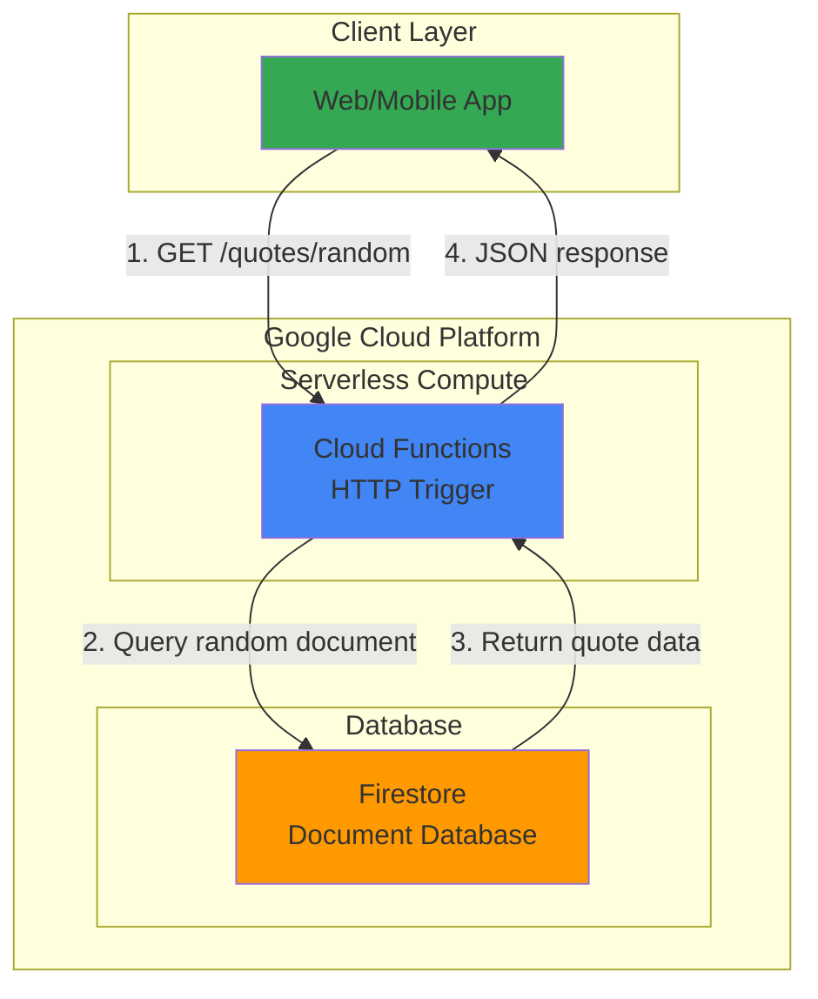

# Random Quote API with Cloud Functions and Firestore

## Problem

Small businesses and personal projects need simple REST APIs for displaying motivational content on websites or mobile applications. Managing server infrastructure for such lightweight functionality is overkill and expensive, while building a database-backed API traditionally requires complex setup with multiple services, authentication, and ongoing maintenance costs that exceed the value of the simple functionality.

## Solution

Build a serverless REST API using Cloud Functions for HTTP handling and Firestore as a NoSQL database for quote storage. This approach eliminates server management overhead while providing automatic scaling, built-in security, and pay-per-use pricing that makes it cost-effective for low-traffic applications requiring reliable quote delivery functionality.

## Architecture Diagram



## Prerequisites

1. Google Cloud account with billing enabled and appropriate permissions for Cloud Functions and Firestore
2. Google Cloud CLI installed and authenticated (or use Cloud Shell)
3. Basic knowledge of Node.js and REST API concepts
4. Text editor for writing function code
5. Estimated cost: $0.00 for development and testing (falls within free tier limits)

> **Note**: Both Cloud Functions and Firestore offer generous free tiers that easily cover development and light production usage.

## Preparation

```bash
# Set environment variables for consistent resource naming
export PROJECT_ID="quote-api-$(date +%s)"
export REGION="us-central1"
export FUNCTION_NAME="random-quote-api"
export DATABASE_ID="quotes-db"

# Create a new Google Cloud project for this recipe
gcloud projects create ${PROJECT_ID} \
    --name="Random Quote API Demo"

# Set the project as default and configure region
gcloud config set project ${PROJECT_ID}
gcloud config set functions/region ${REGION}

# Enable required APIs for Cloud Functions and Firestore
gcloud services enable cloudfunctions.googleapis.com
gcloud services enable firestore.googleapis.com

# Create Firestore database in Native mode with correct syntax
gcloud firestore databases create \
    --database=${DATABASE_ID} \
    --location=${REGION} \
    --type=firestore-native

echo "✅ Project ${PROJECT_ID} configured successfully"
echo "✅ Firestore database ${DATABASE_ID} created in ${REGION}"
```

## Steps

1. **Create function source directory and dependencies**:

   Modern serverless development requires proper project structure and dependency management. Cloud Functions supports Node.js runtime with npm package management, allowing us to leverage the official Firestore client library for database operations with built-in connection pooling and automatic retries.

   ```bash
   # Create project directory structure
   mkdir -p quote-function
   cd quote-function
   
   # Initialize Node.js project with package.json
   cat > package.json << 'EOF'
   {
     "name": "random-quote-api",
     "version": "1.0.0",
     "main": "index.js",
     "dependencies": {
       "@google-cloud/firestore": "^7.1.0",
       "@google-cloud/functions-framework": "^3.3.0"
     }
   }
   EOF
   
   echo "✅ Project structure and dependencies configured"
   ```

   The Functions Framework enables local testing and provides the HTTP request/response handling, while the Firestore client library offers type-safe document operations with automatic authentication in the Google Cloud environment.

2. **Implement the Cloud Function with Firestore integration**:

   Cloud Functions excel at stateless request processing, while Firestore provides serverless document storage with real-time capabilities. This combination creates a fully managed API that scales automatically from zero to millions of requests without infrastructure management.

   ```bash
   # Create the main function implementation
   cat > index.js << 'EOF'   
   const { Firestore } = require('@google-cloud/firestore');
   const functions = require('@google-cloud/functions-framework');
   
   // Initialize Firestore client with automatic project detection
   const firestore = new Firestore({
     databaseId: process.env.DATABASE_ID || 'quotes-db'
   });
   
   // HTTP Cloud Function that responds to GET requests
   functions.http('randomQuote', async (req, res) => {
     // Set CORS headers for web browser compatibility
     res.set('Access-Control-Allow-Origin', '*');
     res.set('Access-Control-Allow-Methods', 'GET');
     
     try {
       // Query all documents from the 'quotes' collection
       const quotesRef = firestore.collection('quotes');
       const snapshot = await quotesRef.get();
       
       if (snapshot.empty) {
         return res.status(404).json({ 
           error: 'No quotes found in database' 
         });
       }
       
       // Select a random document from the collection
       const quotes = snapshot.docs;
       const randomIndex = Math.floor(Math.random() * quotes.length);
       const randomQuote = quotes[randomIndex];
       
       // Return the quote data with metadata
       const quoteData = randomQuote.data();
       res.status(200).json({
         id: randomQuote.id,
         quote: quoteData.text,
         author: quoteData.author,
         category: quoteData.category || 'general',
         timestamp: new Date().toISOString()
       });
       
     } catch (error) {
       console.error('Error fetching quote:', error);
       res.status(500).json({ 
         error: 'Internal server error' 
       });
     }
   });
   EOF
   
   echo "✅ Cloud Function implementation completed"
   ```

   This implementation demonstrates serverless best practices: stateless design, proper error handling, CORS support for web clients, and efficient Firestore querying with random selection logic that works reliably across different collection sizes.

3. **Populate Firestore with sample quote data**:

   Firestore's document-based structure allows flexible schema design perfect for quote data. Each quote becomes a document with fields for text, author, and categorization, enabling future query capabilities by author or category while maintaining simple random access patterns.

   ```bash
   # Create a sample data population script
   cat > populate-quotes.js << 'EOF'
   const { Firestore } = require('@google-cloud/firestore');
   
   const firestore = new Firestore({
     databaseId: process.env.DATABASE_ID || 'quotes-db'
   });
   
   const sampleQuotes = [
     {
       text: "The only way to do great work is to love what you do.",
       author: "Steve Jobs",
       category: "motivation"
     },
     {
       text: "Innovation distinguishes between a leader and a follower.",
       author: "Steve Jobs", 
       category: "innovation"
     },
     {
       text: "Life is what happens to you while you're busy making other plans.",
       author: "John Lennon",
       category: "life"
     },
     {
       text: "The future belongs to those who believe in the beauty of their dreams.",
       author: "Eleanor Roosevelt",
       category: "inspiration"
     },
     {
       text: "Success is not final, failure is not fatal: it is the courage to continue that counts.",
       author: "Winston Churchill",
       category: "perseverance"
     }
   ];
   
   async function populateQuotes() {
     const quotesCollection = firestore.collection('quotes');
     
     for (const quote of sampleQuotes) {
       await quotesCollection.add(quote);
       console.log(`Added quote: "${quote.text.substring(0, 30)}..."`);
     }
     
     console.log('✅ Sample quotes added to Firestore');
   }
   
   populateQuotes().catch(console.error);
   EOF
   
   # Install dependencies and populate the database
   npm install
   node populate-quotes.js
   
   echo "✅ Sample quotes populated in Firestore"
   ```

   The document-based storage model provides natural JSON mapping for REST API responses, while Firestore's automatic indexing ensures fast queries even as the quote collection grows to thousands of documents.

4. **Deploy the Cloud Function with proper configuration**:

   Cloud Functions deployment includes runtime selection, memory allocation, and environment variable configuration. The service automatically handles HTTPS endpoints, SSL certificates, and global load balancing, providing enterprise-grade API infrastructure without manual configuration.

   ```bash
   # Deploy the function with appropriate settings
   gcloud functions deploy ${FUNCTION_NAME} \
       --runtime=nodejs20 \
       --trigger-http \
       --entry-point=randomQuote \
       --memory=256MB \
       --timeout=60s \
       --set-env-vars="DATABASE_ID=${DATABASE_ID}" \
       --allow-unauthenticated \
       --region=${REGION}
   
   # Get the function's HTTP URL for testing
   FUNCTION_URL=$(gcloud functions describe ${FUNCTION_NAME} \
       --region=${REGION} \
       --format="value(httpsTrigger.url)")
   
   echo "✅ Cloud Function deployed successfully"
   echo "Function URL: ${FUNCTION_URL}"
   ```

   The deployment creates a publicly accessible HTTPS endpoint with automatic SSL termination, global CDN distribution, and pay-per-invocation billing that scales from zero to handle traffic spikes seamlessly.

## Validation & Testing

1. **Test the API endpoint functionality**:

   ```bash
   # Test the random quote API
   curl -X GET "${FUNCTION_URL}" \
       -H "Accept: application/json"
   ```

   Expected output:
   ```json
   {
     "id": "document-id-string",
     "quote": "The only way to do great work is to love what you do.",
     "author": "Steve Jobs",
     "category": "motivation", 
     "timestamp": "2025-01-12T10:30:00.000Z"
   }
   ```

2. **Verify Firestore data integration**:

   ```bash
   # Check function logs for debugging
   gcloud functions logs read ${FUNCTION_NAME} \
       --region=${REGION} \
       --limit=5
   
   # Verify Firestore database exists and contains data
   gcloud firestore databases describe ${DATABASE_ID}
   ```

3. **Test multiple requests for randomness**:

   ```bash
   # Make several requests to verify random selection
   for i in {1..5}; do
     echo "Request $i:"
     curl -s "${FUNCTION_URL}" | jq '.quote'
     echo ""
   done
   ```

## Cleanup

1. **Delete the Cloud Function**:

   ```bash
   # Remove the deployed function
   gcloud functions delete ${FUNCTION_NAME} \
       --region=${REGION} \
       --quiet
   
   echo "✅ Cloud Function deleted"
   ```

2. **Delete the Firestore database**:

   ```bash
   # Delete the Firestore database and all data
   gcloud firestore databases delete ${DATABASE_ID} \
       --quiet
   
   echo "✅ Firestore database deleted"
   ```

3. **Clean up the project**:

   ```bash
   # Delete the entire project to remove all resources
   gcloud projects delete ${PROJECT_ID} \
       --quiet
   
   # Clean up local files
   cd ..
   rm -rf quote-function
   
   echo "✅ Project and local files cleaned up"
   ```

## Discussion

This serverless architecture demonstrates the power of combining Google Cloud's managed services for rapid API development. Cloud Functions provides event-driven compute that automatically scales from zero instances to handle traffic spikes, while Firestore offers a NoSQL document database with real-time synchronization capabilities and automatic multi-region replication following Google Cloud's Well-Architected Framework principles.

The solution showcases several key serverless patterns: stateless function design, managed database integration, and pay-per-use pricing that makes it cost-effective for applications with variable traffic patterns. The Cloud Functions runtime handles HTTP request routing, SSL termination, and global load balancing automatically, while Firestore manages data replication, backup, and scaling without manual intervention.

Security considerations include built-in authentication integration with Google Cloud IAM, automatic HTTPS enforcement, and network-level DDoS protection through Google's global infrastructure. For production deployments, you would typically add API key authentication, request rate limiting, and monitoring through Cloud Monitoring and Cloud Logging for operational visibility according to Google Cloud security best practices.

Performance optimization opportunities include implementing connection pooling in the Firestore client, adding response caching through Cloud CDN for frequently accessed quotes, and using Firestore's real-time listeners for applications requiring instant updates when new quotes are added to the collection. These optimizations align with Google Cloud's performance efficiency recommendations for serverless architectures.

> **Tip**: Use Cloud Monitoring to track function invocations, latency, and error rates to optimize performance and identify usage patterns for scaling decisions.

**Documentation References:**
- [Cloud Functions Node.js Quickstart](https://cloud.google.com/functions/docs/quickstart-nodejs)
- [Firestore Node.js Client Library](https://cloud.google.com/firestore/docs/quickstart-servers#node.js)
- [Google Cloud Functions Best Practices](https://cloud.google.com/functions/docs/bestpractices/tips)
- [Firestore Data Model Documentation](https://cloud.google.com/firestore/docs/data-model)
- [Cloud Functions HTTP Triggers Guide](https://cloud.google.com/functions/docs/calling/http)
- [Google Cloud Architecture Framework](https://cloud.google.com/architecture/framework)

## Challenge

Extend this solution by implementing these enhancements:

1. **Add quote categories endpoint** - Create a `/quotes/category/{category}` endpoint that returns quotes filtered by category using Firestore's `where()` queries
2. **Implement quote submission API** - Add a POST endpoint that allows users to submit new quotes with input validation and moderation workflows
3. **Add caching layer** - Integrate Cloud Memorystore (Redis) to cache frequently requested quotes and reduce Firestore read operations
4. **Build analytics dashboard** - Use BigQuery and Looker Studio to track API usage patterns, popular quotes, and user engagement metrics
5. **Create multi-language support** - Extend the data model to support quotes in multiple languages with language-specific API endpoints

## Infrastructure Code

### Available Infrastructure as Code:

- [Infrastructure Code Overview](code/README.md) - Detailed description of all infrastructure components
- [Infrastructure Manager](code/infrastructure-manager/) - GCP Infrastructure Manager templates
- [Bash CLI Scripts](code/scripts/) - Example bash scripts using gcloud CLI commands to deploy infrastructure
- [Terraform](code/terraform/) - Terraform configuration files