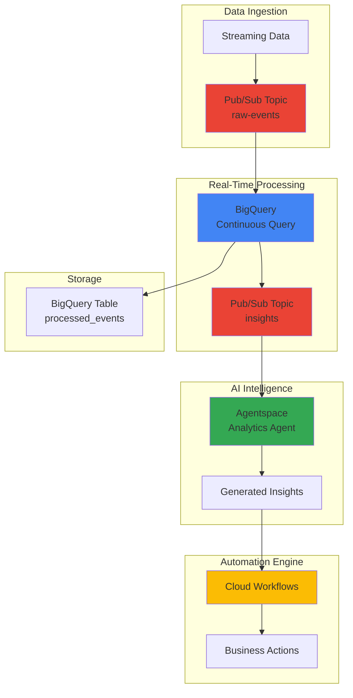

# Real-Time Analytics Automation with BigQuery Continuous Queries and Agentspace

## Problem

E-commerce companies struggle with delayed decision-making in fast-paced environments where customer behavior, inventory levels, and market conditions change rapidly. Traditional batch analytics create hours-long delays between data arrival and actionable insights, causing missed opportunities for dynamic pricing adjustments, personalized recommendations, and proactive customer service interventions. Manual monitoring of real-time metrics overwhelms operations teams and prevents timely responses to critical business events.

## Solution

Build an autonomous real-time analytics system using BigQuery's continuous queries to process streaming data as it arrives, automatically generate insights with AI agents via Agentspace, and orchestrate business responses through Cloud Workflows. This architecture enables immediate data-driven decision making by combining BigQuery's serverless real-time processing with intelligent AI agents that can analyze patterns, generate recommendations, and trigger automated responses within seconds of data ingestion.

## Architecture Diagram



## Prerequisites

1. Google Cloud Project with Owner or Editor permissions for BigQuery, Pub/Sub, Cloud Workflows, and AI services
2. Google Cloud CLI (gcloud) installed and configured
3. Basic understanding of SQL, streaming data concepts, and AI workflows
4. Active billing account (estimated cost: $5-15 for testing during recipe duration)
5. Agentspace access enabled in your Google Cloud organization

> **Note**: BigQuery Continuous Queries are currently in Preview. Ensure your project has access to preview features and that you understand the preview terms and limitations.

## Preparation

```bash
# Set environment variables for the project
export PROJECT_ID=$(gcloud config get-value project)
export REGION="us-central1"
export DATASET_NAME="realtime_analytics"
export TABLE_NAME="processed_events"

# Generate unique identifiers for resources
RANDOM_SUFFIX=$(openssl rand -hex 3)
export PUBSUB_TOPIC_RAW="raw-events-${RANDOM_SUFFIX}"
export PUBSUB_TOPIC_INSIGHTS="insights-${RANDOM_SUFFIX}"
export WORKFLOW_NAME="analytics-automation-${RANDOM_SUFFIX}"

# Set default region
gcloud config set compute/region ${REGION}

# Enable required Google Cloud APIs
gcloud services enable bigquery.googleapis.com
gcloud services enable pubsub.googleapis.com
gcloud services enable workflows.googleapis.com
gcloud services enable aiplatform.googleapis.com
gcloud services enable cloudbuild.googleapis.com

echo "✅ Project configured: ${PROJECT_ID}"
echo "✅ APIs enabled for real-time analytics automation"
```

## Steps

1. **Create Pub/Sub Infrastructure for Event Streaming**:

   Pub/Sub provides the foundation for our real-time data pipeline, offering reliable message delivery with automatic scaling and global distribution. The topic-subscription model ensures that streaming data can be processed by multiple consumers simultaneously while maintaining message ordering and delivery guarantees essential for real-time analytics.

   ```bash
   # Create topic for raw streaming events
   gcloud pubsub topics create ${PUBSUB_TOPIC_RAW}
   
   # Create topic for processed insights
   gcloud pubsub topics create ${PUBSUB_TOPIC_INSIGHTS}
   
   # Create subscription for BigQuery continuous query consumption
   gcloud pubsub subscriptions create ${PUBSUB_TOPIC_RAW}-bq-sub \
       --topic=${PUBSUB_TOPIC_RAW}
   
   echo "✅ Pub/Sub topics and subscriptions created"
   ```

   The Pub/Sub infrastructure now provides reliable event streaming capabilities with automatic message persistence and retry mechanisms. This foundation supports the continuous query processing pipeline while ensuring no data loss during high-volume streaming scenarios.

2. **Set Up BigQuery Dataset and Table Structure**:

   BigQuery's serverless architecture provides the scalability needed for real-time analytics workloads, while its columnar storage and distributed processing engine enable sub-second query performance on streaming data. Proper table design with partitioning and clustering optimizes performance for continuous query operations.

   ```bash
   # Create BigQuery dataset
   bq mk --dataset \
       --location=${REGION} \
       ${PROJECT_ID}:${DATASET_NAME}
   
   # Create table for processed events with optimized schema
   bq mk --table \
       ${PROJECT_ID}:${DATASET_NAME}.${TABLE_NAME} \
       event_id:STRING,timestamp:TIMESTAMP,user_id:STRING,event_type:STRING,value:FLOAT64,metadata:JSON
   
   # Create table for real-time insights
   bq mk --table \
       ${PROJECT_ID}:${DATASET_NAME}.insights \
       insight_id:STRING,generated_at:TIMESTAMP,insight_type:STRING,confidence:FLOAT64,recommendation:STRING,data_points:JSON
   
   echo "✅ BigQuery dataset and tables created"
   ```

   The BigQuery infrastructure is now configured with optimized schemas that support both high-throughput streaming ingestion and complex analytical queries. The JSON metadata fields provide flexibility for evolving data structures while maintaining query performance.

3. **Configure BigQuery Continuous Query for Real-Time Processing**:

   Continuous queries transform BigQuery from a traditional data warehouse into a real-time stream processing engine. This capability processes incoming data immediately upon arrival, enabling instantaneous analytics and ML inference without the latency associated with traditional batch processing workflows.

   ```bash
   # Create continuous query SQL file
   cat > continuous_query.sql << 'EOF'
   EXPORT DATA
   OPTIONS (
     uri = 'projects/PROJECT_ID/topics/INSIGHTS_TOPIC',
     format = 'JSON',
     overwrite = false
   ) AS
   WITH real_time_aggregates AS (
     SELECT
       GENERATE_UUID() as insight_id,
       CURRENT_TIMESTAMP() as generated_at,
       'anomaly_detection' as insight_type,
       user_id,
       event_type,
       AVG(value) OVER (
         PARTITION BY user_id, event_type 
         ORDER BY timestamp 
         ROWS BETWEEN 9 PRECEDING AND CURRENT ROW
       ) as moving_avg,
       value,
       CASE 
         WHEN ABS(value - AVG(value) OVER (
           PARTITION BY user_id, event_type 
           ORDER BY timestamp 
           ROWS BETWEEN 9 PRECEDING AND CURRENT ROW
         )) > 2 * STDDEV(value) OVER (
           PARTITION BY user_id, event_type 
           ORDER BY timestamp 
           ROWS BETWEEN 9 PRECEDING AND CURRENT ROW
         ) THEN 0.95
         ELSE 0.1
       END as confidence,
       metadata
     FROM `PROJECT_ID.DATASET_NAME.TABLE_NAME`
     WHERE timestamp >= TIMESTAMP_SUB(CURRENT_TIMESTAMP(), INTERVAL 5 MINUTE)
   )
   SELECT
     insight_id,
     generated_at,
     insight_type,
     confidence,
     CONCAT('Potential anomaly detected for user ', user_id, 
            ' with event type ', event_type,
            '. Value: ', CAST(value AS STRING),
            ', Expected: ', CAST(moving_avg AS STRING)) as recommendation,
     TO_JSON(STRUCT(
       user_id,
       event_type,
       value,
       moving_avg,
       metadata
     )) as data_points
   FROM real_time_aggregates
   WHERE confidence > 0.8;
   EOF
   
   # Replace placeholders in the query
   sed -i "s/PROJECT_ID/${PROJECT_ID}/g" continuous_query.sql
   sed -i "s/DATASET_NAME/${DATASET_NAME}/g" continuous_query.sql
   sed -i "s/TABLE_NAME/${TABLE_NAME}/g" continuous_query.sql
   sed -i "s/INSIGHTS_TOPIC/${PUBSUB_TOPIC_INSIGHTS}/g" continuous_query.sql
   
   echo "✅ Continuous query SQL prepared for real-time anomaly detection"
   ```

   The continuous query implements sophisticated anomaly detection using moving averages and statistical analysis, automatically identifying unusual patterns in streaming data. This real-time processing capability enables immediate detection of critical business events without manual intervention or batch processing delays.

4. **Deploy Continuous Query Job**:

   Starting a continuous query transforms the SQL statement into a long-running job that processes data as it arrives. This deployment creates a persistent real-time analytics pipeline that operates independently, monitoring streaming data and generating insights with minimal operational overhead.

   ```bash
   # Start the continuous query job
   bq query \
       --use_legacy_sql=false \
       --job_timeout=0 \
       --continuous \
       --job_id="continuous-analytics-${RANDOM_SUFFIX}" \
       "$(cat continuous_query.sql)"
   
   # Verify the continuous query is running
   bq ls -j --max_results=10 | grep "continuous-analytics"
   
   echo "✅ Continuous query deployed and running"
   echo "Query will process streaming data and export insights to Pub/Sub"
   ```

   The continuous query is now actively monitoring the BigQuery table for new data, automatically processing incoming events and publishing insights to Pub/Sub. This creates a real-time feedback loop that responds to data changes within seconds of ingestion.

5. **Configure Agentspace AI Agent for Insight Generation**:

   Agentspace provides enterprise-grade AI agents that can analyze complex data patterns and generate actionable business recommendations. The multimodal AI capabilities combine structured data analysis with natural language understanding to create human-readable insights from technical anomaly detection results.

   ```bash
   # Create service account for Agentspace integration
   gcloud iam service-accounts create agentspace-analytics \
       --display-name="Agentspace Analytics Service Account"
   
   # Grant necessary permissions
   gcloud projects add-iam-policy-binding ${PROJECT_ID} \
       --member="serviceAccount:agentspace-analytics@${PROJECT_ID}.iam.gserviceaccount.com" \
       --role="roles/pubsub.subscriber"
   
   gcloud projects add-iam-policy-binding ${PROJECT_ID} \
       --member="serviceAccount:agentspace-analytics@${PROJECT_ID}.iam.gserviceaccount.com" \
       --role="roles/bigquery.dataViewer"
   
   # Create agent configuration file
   cat > agentspace_config.json << 'EOF'
   {
     "agent_name": "RealTimeAnalyticsAgent",
     "description": "AI agent for processing real-time analytics insights and generating business recommendations",
     "capabilities": [
       "anomaly_analysis",
       "recommendation_generation",
       "business_impact_assessment"
     ],
     "data_sources": [
       "bigquery_insights",
       "pubsub_stream"
     ],
     "output_format": "structured_recommendations"
   }
   EOF
   
   echo "✅ Agentspace AI agent configured for insight generation"
   ```

   The AI agent configuration establishes the foundation for intelligent insight processing, enabling the system to understand business context and generate meaningful recommendations from raw anomaly detection data. This bridges the gap between technical metrics and actionable business intelligence.

6. **Create Cloud Workflows for Business Process Automation**:

   Cloud Workflows orchestrates complex business processes by connecting multiple Google Cloud services and external APIs. This serverless orchestration engine enables automated responses to AI-generated insights, creating end-to-end automation from data ingestion to business action execution.

   ```bash
   # Create workflow definition for automated responses
   cat > analytics_workflow.yaml << 'EOF'
   main:
     params: [input]
     steps:
       - extract_insight:
           assign:
             - insight_data: ${input.insight}
             - confidence: ${insight_data.confidence}
             - insight_type: ${insight_data.insight_type}
       
       - evaluate_confidence:
           switch:
             - condition: ${confidence > 0.9}
               next: high_priority_action
             - condition: ${confidence > 0.7}
               next: medium_priority_action
             - condition: true
               next: low_priority_action
       
       - high_priority_action:
           call: execute_immediate_response
           args:
             action_type: "immediate"
             insight: ${insight_data}
           next: log_action
       
       - medium_priority_action:
           call: execute_scheduled_response
           args:
             action_type: "scheduled"
             insight: ${insight_data}
           next: log_action
       
       - low_priority_action:
           call: execute_monitoring_response
           args:
             action_type: "monitoring"
             insight: ${insight_data}
           next: log_action
       
       - log_action:
           call: http.post
           args:
             url: "https://logging.googleapis.com/v2/entries:write"
             headers:
               Authorization: ${"Bearer " + sys.get_env("GOOGLE_CLOUD_ACCESS_TOKEN")}
             body:
               entries:
                 - logName: ${"projects/" + sys.get_env("GOOGLE_CLOUD_PROJECT_ID") + "/logs/analytics-automation"}
                   resource:
                     type: "workflow"
                   jsonPayload:
                     insight_id: ${insight_data.insight_id}
                     action_taken: "processed"
                     confidence: ${confidence}
           result: log_result
   
   execute_immediate_response:
     params: [action_type, insight]
     steps:
       - send_alert:
           call: http.post
           args:
             url: "https://pubsub.googleapis.com/v1/projects/PROJECT_ID/topics/alerts:publish"
             headers:
               Authorization: ${"Bearer " + sys.get_env("GOOGLE_CLOUD_ACCESS_TOKEN")}
             body:
               messages:
                 - data: ${base64.encode(json.encode(insight))}
                   attributes:
                     priority: "high"
                     action_type: ${action_type}
   
   execute_scheduled_response:
     params: [action_type, insight]
     steps:
       - schedule_review:
           call: sys.log
           args:
             data: ${"Scheduled review for insight: " + insight.insight_id}
   
   execute_monitoring_response:
     params: [action_type, insight]
     steps:
       - add_to_monitoring:
           call: sys.log
           args:
             data: ${"Added to monitoring: " + insight.insight_id}
   EOF
   
   # Replace PROJECT_ID placeholder
   sed -i "s/PROJECT_ID/${PROJECT_ID}/g" analytics_workflow.yaml
   
   # Deploy the workflow
   gcloud workflows deploy ${WORKFLOW_NAME} \
       --source=analytics_workflow.yaml \
       --location=${REGION}
   
   echo "✅ Cloud Workflows deployed for business process automation"
   ```

   The workflow automation system now provides intelligent routing of insights based on confidence levels, enabling appropriate business responses ranging from immediate alerts to scheduled reviews. This creates a scalable framework for translating AI insights into operational actions.

7. **Implement Data Simulation for Testing**:

   Realistic data simulation validates the entire real-time analytics pipeline under controlled conditions. This testing approach generates representative streaming data patterns that exercise all system components while providing measurable outcomes for performance verification and system tuning.

   ```bash
   # Create data simulation script
   cat > simulate_data.py << 'EOF'
   import json
   import random
   import time
   from datetime import datetime
   from google.cloud import pubsub_v1
   
   def generate_event():
       return {
           "event_id": f"evt_{random.randint(100000, 999999)}",
           "timestamp": datetime.utcnow().isoformat() + "Z",
           "user_id": f"user_{random.randint(1, 1000)}",
           "event_type": random.choice(["purchase", "view", "click", "add_to_cart"]),
           "value": random.normalvariate(100, 30) if random.random() > 0.95 else random.normalvariate(100, 5),
           "metadata": {
               "source": "web_app",
               "session_id": f"sess_{random.randint(10000, 99999)}"
           }
       }
   
   def publish_events(project_id, topic_name, num_events=100):
       publisher = pubsub_v1.PublisherClient()
       topic_path = publisher.topic_path(project_id, topic_name)
       
       for i in range(num_events):
           event = generate_event()
           data = json.dumps(event).encode("utf-8")
           future = publisher.publish(topic_path, data)
           print(f"Published event {i+1}: {future.result()}")
           time.sleep(0.1)  # 10 events per second
   
   if __name__ == "__main__":
       import sys
       project_id = sys.argv[1]
       topic_name = sys.argv[2]
       num_events = int(sys.argv[3]) if len(sys.argv) > 3 else 100
       publish_events(project_id, topic_name, num_events)
   EOF
   
   # Install required Python library
   pip install google-cloud-pubsub
   
   echo "✅ Data simulation script created for pipeline testing"
   ```

   The simulation script generates realistic e-commerce event data with controlled anomalies, providing a comprehensive test environment for validating the real-time analytics pipeline. This enables systematic testing of anomaly detection algorithms and business response automation.

## Validation & Testing

1. **Verify Continuous Query Operation**:

   ```bash
   # Check continuous query job status
   bq show -j "continuous-analytics-${RANDOM_SUFFIX}"
   
   # Monitor query execution
   bq ls -j --max_results=5 --format="table(jobId,state,jobType)"
   ```

   Expected output: Job should show state as "RUNNING" with jobType as "CONTINUOUS_QUERY"

2. **Test Real-Time Data Processing**:

   ```bash
   # Send test events to trigger the pipeline
   python simulate_data.py ${PROJECT_ID} ${PUBSUB_TOPIC_RAW} 50
   
   # Check if data is being processed in BigQuery
   bq query --use_legacy_sql=false \
       "SELECT COUNT(*) as event_count, MAX(timestamp) as latest_event 
        FROM \`${PROJECT_ID}.${DATASET_NAME}.${TABLE_NAME}\`"
   ```

   Expected output: Increasing event count showing real-time data ingestion

3. **Validate Insight Generation**:

   ```bash
   # Check insights published to Pub/Sub
   gcloud pubsub subscriptions pull ${PUBSUB_TOPIC_INSIGHTS}-test-sub \
       --limit=5 --auto-ack
   
   # Verify insights table population
   bq query --use_legacy_sql=false \
       "SELECT insight_type, confidence, COUNT(*) as insight_count
        FROM \`${PROJECT_ID}.${DATASET_NAME}.insights\`
        GROUP BY insight_type, confidence"
   ```

4. **Test Workflow Automation**:

   ```bash
   # Trigger workflow with sample insight
   gcloud workflows execute ${WORKFLOW_NAME} \
       --data='{"insight": {"insight_id": "test-001", "confidence": 0.95, "insight_type": "anomaly_detection"}}' \
       --location=${REGION}
   
   # Check workflow execution status
   gcloud workflows executions list \
       --workflow=${WORKFLOW_NAME} \
       --location=${REGION} \
       --limit=5
   ```

## Cleanup

1. **Stop Continuous Query and Remove Jobs**:

   ```bash
   # Cancel the continuous query job
   bq cancel "continuous-analytics-${RANDOM_SUFFIX}"
   
   # Verify cancellation
   bq show -j "continuous-analytics-${RANDOM_SUFFIX}"
   
   echo "✅ Continuous query stopped"
   ```

2. **Delete Cloud Workflows**:

   ```bash
   # Delete the workflow
   gcloud workflows delete ${WORKFLOW_NAME} \
       --location=${REGION} \
       --quiet
   
   echo "✅ Workflow deleted"
   ```

3. **Remove Pub/Sub Resources**:

   ```bash
   # Delete subscriptions first
   gcloud pubsub subscriptions delete ${PUBSUB_TOPIC_RAW}-bq-sub --quiet
   
   # Delete topics
   gcloud pubsub topics delete ${PUBSUB_TOPIC_RAW} --quiet
   gcloud pubsub topics delete ${PUBSUB_TOPIC_INSIGHTS} --quiet
   
   echo "✅ Pub/Sub resources deleted"
   ```

4. **Clean Up BigQuery Resources**:

   ```bash
   # Delete tables
   bq rm -t ${PROJECT_ID}:${DATASET_NAME}.${TABLE_NAME}
   bq rm -t ${PROJECT_ID}:${DATASET_NAME}.insights
   
   # Delete dataset
   bq rm -d ${PROJECT_ID}:${DATASET_NAME}
   
   echo "✅ BigQuery resources cleaned up"
   ```

5. **Remove Service Accounts and Files**:

   ```bash
   # Delete service account
   gcloud iam service-accounts delete \
       agentspace-analytics@${PROJECT_ID}.iam.gserviceaccount.com \
       --quiet
   
   # Remove local files
   rm -f continuous_query.sql analytics_workflow.yaml simulate_data.py agentspace_config.json
   
   echo "✅ All resources and files cleaned up"
   ```

## Discussion

This recipe demonstrates how Google Cloud's modern data platform enables real-time analytics automation that responds to business events within seconds rather than hours. The combination of BigQuery Continuous Queries with Agentspace AI agents creates an intelligent system that not only processes data in real-time but also understands business context and recommends appropriate actions. This architectural pattern represents a significant evolution from traditional batch analytics toward autonomous, event-driven decision making.

BigQuery Continuous Queries transform the traditional data warehouse paradigm by enabling SQL statements to run perpetually, processing streaming data as it arrives rather than waiting for scheduled batch jobs. This capability turns BigQuery into a real-time stream processing engine while maintaining its familiar SQL interface and serverless scalability. The integration with Pub/Sub creates a robust event-driven architecture that can handle high-velocity data streams while ensuring message durability and exactly-once processing guarantees. For more information about continuous queries, see the [BigQuery Continuous Queries documentation](https://cloud.google.com/bigquery/docs/continuous-queries-introduction).

The integration with Agentspace represents a new paradigm in enterprise AI where intelligent agents can operate autonomously within business workflows. Unlike traditional AI implementations that require extensive custom development, Agentspace provides pre-built AI capabilities that understand enterprise data patterns and can generate contextual business recommendations. The agents can analyze complex data relationships, identify anomalies, and suggest appropriate business responses while maintaining enterprise security and governance requirements. This approach significantly reduces the time-to-value for AI implementations in operational environments. Learn more about Agentspace capabilities in the [Google Cloud AI Platform documentation](https://cloud.google.com/ai-platform).

Cloud Workflows orchestrates the end-to-end automation by connecting real-time insights with business process execution. This serverless orchestration engine enables complex decision trees that route insights based on confidence levels, business rules, and operational constraints. The workflow automation ensures that high-confidence insights trigger immediate responses while lower-confidence signals are routed for human review or additional monitoring. This graduated response system prevents alert fatigue while ensuring critical issues receive immediate attention. For workflow patterns and best practices, refer to the [Cloud Workflows documentation](https://cloud.google.com/workflows/docs).

> **Tip**: Monitor your continuous query costs closely using BigQuery's query history and job monitoring features. Continuous queries consume slots continuously, so consider using slot reservations for predictable pricing in production environments.

The architectural pattern demonstrated here scales naturally with business growth, as all components are serverless and automatically adjust to data volume changes. Organizations can extend this foundation by adding more sophisticated AI models, integrating with external systems, or implementing more complex business logic in the workflow orchestration layer. The real-time nature of this system makes it particularly valuable for time-sensitive business scenarios such as fraud detection, dynamic pricing, personalized recommendations, and operational monitoring where rapid response to changing conditions provides competitive advantage.

## Challenge

Extend this real-time analytics automation solution with these enhancements:

1. **Implement Multi-Modal AI Analysis**: Integrate computer vision APIs to analyze uploaded images in real-time, combining visual insights with structured data analytics for comprehensive customer behavior understanding.

2. **Add Predictive Analytics Layer**: Deploy BigQuery ML models within continuous queries to perform real-time predictions on incoming data, such as customer lifetime value calculation or churn prediction, and automate retention campaigns through Cloud Workflows.

3. **Create Cross-Cloud Integration**: Extend the system to consume data from external cloud providers or on-premises systems using Cloud Data Fusion or Dataflow, demonstrating hybrid and multi-cloud real-time analytics capabilities.

4. **Build Advanced Alerting System**: Implement intelligent alerting with Cloud Monitoring that considers business context, escalation rules, and stakeholder availability to ensure critical insights reach the right people at the right time.

5. **Develop Real-Time Dashboard**: Create a live dashboard using Looker Studio or custom web applications that visualizes streaming insights and allows business users to interact with AI-generated recommendations and approve automated actions.

## Infrastructure Code

*Infrastructure code will be generated after recipe approval.*