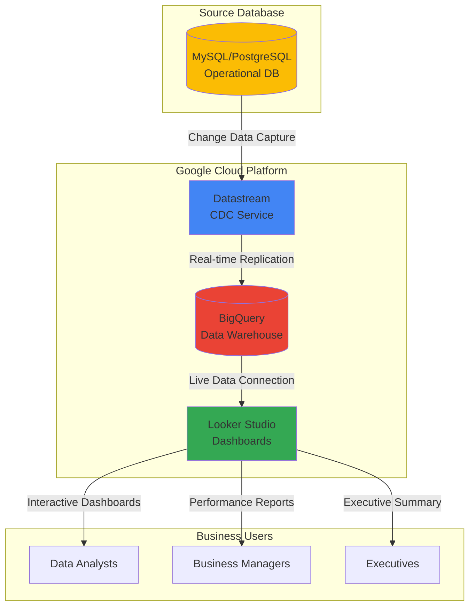

# Real-Time Analytics Dashboards with Datastream and Looker Studio

## Problem

E-commerce companies need immediate visibility into sales performance, inventory levels, and customer behavior to make data-driven decisions. Traditional batch ETL processes create delays of hours or days between operational database changes and analytical insights, causing missed opportunities for real-time promotions, inventory adjustments, and customer service improvements. Manual dashboard updates and delayed reporting prevent businesses from responding quickly to market changes and operational issues.

## Solution

Build a real-time analytics pipeline using Google Cloud Datastream to capture database changes instantly, replicate them to BigQuery for analytical processing, and visualize live business metrics through Looker Studio dashboards. This serverless architecture provides near real-time insights into transactional data while maintaining operational database performance and enabling business users to make immediate decisions based on current data.

## Architecture Diagram



## Prerequisites

1. Google Cloud project with Datastream, BigQuery, and Looker Studio APIs enabled
2. Source database (MySQL 5.7+, PostgreSQL 10+, Oracle 11g+, or SQL Server 2016+) with appropriate permissions
3. Google Cloud CLI installed and configured (or Cloud Shell access)
4. Database connectivity from Google Cloud (public IP, VPN, or Private Service Connect)
5. Estimated cost: $50-150/month for moderate data volumes (includes BigQuery storage, Datastream processing, and Looker Studio usage)

> **Note**: Datastream requires specific database configurations including binary logging for MySQL and logical replication for PostgreSQL. Review the [Datastream source requirements documentation](https://cloud.google.com/datastream/docs/sources) for detailed setup instructions.

## Preparation

```bash
# Set environment variables for the project
export PROJECT_ID="analytics-demo-$(date +%s)"
export REGION="us-central1"
export DATASET_NAME="ecommerce_analytics"
export STREAM_NAME="sales-stream"

# Generate unique identifiers for resources
RANDOM_SUFFIX=$(openssl rand -hex 3)
export CONNECTION_PROFILE_NAME="source-db-${RANDOM_SUFFIX}"
export BQ_CONNECTION_PROFILE_NAME="bigquery-${RANDOM_SUFFIX}"

# Set default project and region
gcloud config set project ${PROJECT_ID}
gcloud config set compute/region ${REGION}

# Enable required Google Cloud APIs
gcloud services enable datastream.googleapis.com
gcloud services enable bigquery.googleapis.com
gcloud services enable sqladmin.googleapis.com

echo "✅ Project configured: ${PROJECT_ID}"
echo "✅ APIs enabled for Datastream and BigQuery"
```

## Steps

1. **Create BigQuery Dataset for Analytics**:

   BigQuery serves as the central data warehouse for real-time analytics, providing serverless scalability and sub-second query performance. Creating a dedicated dataset with appropriate permissions establishes the foundation for storing replicated data from operational systems while enabling business users to run complex analytical queries without impacting source database performance.

   ```bash
   # Create BigQuery dataset for analytics data
   bq mk --dataset \
       --location=${REGION} \
       --description="Real-time e-commerce analytics dataset" \
       ${PROJECT_ID}:${DATASET_NAME}
   
   # Set dataset labels for cost tracking and organization
   bq update --set_label environment:production \
       --set_label purpose:analytics \
       ${PROJECT_ID}:${DATASET_NAME}
   
   echo "✅ BigQuery dataset created: ${DATASET_NAME}"
   ```

   The BigQuery dataset is now ready to receive real-time data from Datastream. This managed data warehouse will automatically handle schema evolution, data partitioning, and query optimization while providing the scalability needed for growing analytical workloads and concurrent dashboard users.

2. **Create Source Database Connection Profile**:

   Datastream connection profiles define secure connectivity parameters and authentication credentials for source databases. This configuration enables Datastream to establish encrypted connections to operational databases while maintaining network security and access controls through Google Cloud's managed infrastructure.

   ```bash
   # Create connection profile for source database
   # Note: Replace with your actual database details
   gcloud datastream connection-profiles create ${CONNECTION_PROFILE_NAME} \
       --location=${REGION} \
       --type=mysql \
       --mysql-hostname=10.0.0.10 \
       --mysql-port=3306 \
       --mysql-username=datastream_user \
       --mysql-password-file=<(echo "your_secure_password") \
       --display-name="Source Database Connection"
   
   # Verify connection profile creation
   gcloud datastream connection-profiles describe \
       ${CONNECTION_PROFILE_NAME} \
       --location=${REGION}
   
   echo "✅ Source database connection profile created"
   ```

   The connection profile securely stores database credentials and network configuration, enabling Datastream to authenticate and connect to the source database. This establishes the secure channel through which change data capture will continuously monitor and replicate database modifications to BigQuery.

3. **Create BigQuery Destination Connection Profile**:

   The BigQuery destination profile configures how Datastream writes replicated data to the data warehouse, including table creation patterns, data organization, and processing modes. This profile ensures that operational data is efficiently transformed and stored in BigQuery's columnar format for optimal analytical performance.

   ```bash
   # Create BigQuery destination connection profile
   gcloud datastream connection-profiles create ${BQ_CONNECTION_PROFILE_NAME} \
       --location=${REGION} \
       --type=bigquery \
       --bigquery-dataset=${DATASET_NAME} \
       --display-name="BigQuery Analytics Destination"
   
   # Verify BigQuery connection profile
   gcloud datastream connection-profiles describe \
       ${BQ_CONNECTION_PROFILE_NAME} \
       --location=${REGION}
   
   echo "✅ BigQuery destination profile configured"
   ```

   The BigQuery destination profile is now configured to receive replicated data with automatic table creation and schema management. Datastream will handle the complexity of mapping relational database structures to BigQuery's nested and repeated field support while maintaining referential integrity and data consistency.

4. **Configure Datastream for Change Data Capture**:

   Datastream's change data capture technology monitors database transaction logs to identify and replicate data modifications in near real-time. This step creates the streaming pipeline that captures INSERT, UPDATE, and DELETE operations from the source database and prepares them for replication to BigQuery with minimal impact on operational performance.

   ```bash
   # Create the Datastream configuration
   gcloud datastream streams create ${STREAM_NAME} \
       --location=${REGION} \
       --source-connection-profile=${CONNECTION_PROFILE_NAME} \
       --destination-connection-profile=${BQ_CONNECTION_PROFILE_NAME} \
       --display-name="Real-time Sales Analytics Stream" \
       --include-objects=mysql-database-name.sales_orders,mysql-database-name.customers,mysql-database-name.products \
       --oracle-source-config-max-concurrent-cdc-tasks=5 \
       --oracle-source-config-max-concurrent-backfill-tasks=12
   
   # Start the stream to begin data replication
   gcloud datastream streams start ${STREAM_NAME} \
       --location=${REGION}
   
   echo "✅ Datastream configured and started"
   ```

   The Datastream is now actively monitoring the source database and replicating changes to BigQuery. The service will perform an initial backfill of existing data followed by continuous streaming of new changes, typically achieving replication latency of seconds to minutes depending on transaction volume and network conditions.

5. **Verify Data Replication in BigQuery**:

   Monitoring the data replication process ensures that Datastream is successfully capturing and transferring database changes to BigQuery. This verification step confirms that tables are being created with the correct schema and that data is flowing consistently from the operational database to the analytical warehouse.

   ```bash
   # Check for replicated tables in BigQuery
   bq ls ${DATASET_NAME}
   
   # Examine the schema of a replicated table
   bq show --schema ${DATASET_NAME}.sales_orders
   
   # Query replicated data to verify content
   bq query --use_legacy_sql=false \
       "SELECT COUNT(*) as total_records, 
               MAX(_metadata_timestamp) as latest_update
        FROM \`${PROJECT_ID}.${DATASET_NAME}.sales_orders\`
        LIMIT 10"
   
   echo "✅ Data replication verified in BigQuery"
   ```

   The replicated tables now contain both historical data from the initial backfill and real-time changes from ongoing transactions. BigQuery's metadata columns provide audit trails and timestamps that enable tracking data freshness and ensuring analytical queries reflect the most current business state.

6. **Create Analytics Views for Business Intelligence**:

   BigQuery views abstract complex data transformations and provide business-friendly interfaces for Looker Studio dashboards. These views implement common analytical patterns such as aggregations, joins, and time-based calculations while maintaining real-time data access and enabling business users to focus on insights rather than technical implementation details.

   ```bash
   # Create sales performance view
   bq query --use_legacy_sql=false \
   "CREATE VIEW \`${PROJECT_ID}.${DATASET_NAME}.sales_performance\` AS
   SELECT 
       DATE(o.order_date) as order_date,
       o.customer_id,
       c.customer_name,
       o.product_id,
       p.product_name,
       o.quantity,
       o.unit_price,
       o.quantity * o.unit_price as total_amount,
       o._metadata_timestamp as last_updated
   FROM \`${PROJECT_ID}.${DATASET_NAME}.sales_orders\` o
   JOIN \`${PROJECT_ID}.${DATASET_NAME}.customers\` c 
       ON o.customer_id = c.customer_id
   JOIN \`${PROJECT_ID}.${DATASET_NAME}.products\` p 
       ON o.product_id = p.product_id
   WHERE o._metadata_deleted = false"
   
   # Create daily sales summary view
   bq query --use_legacy_sql=false \
   "CREATE VIEW \`${PROJECT_ID}.${DATASET_NAME}.daily_sales_summary\` AS
   SELECT 
       DATE(order_date) as sales_date,
       COUNT(*) as total_orders,
       SUM(total_amount) as total_revenue,
       AVG(total_amount) as avg_order_value,
       COUNT(DISTINCT customer_id) as unique_customers
   FROM \`${PROJECT_ID}.${DATASET_NAME}.sales_performance\`
   GROUP BY DATE(order_date)
   ORDER BY sales_date DESC"
   
   echo "✅ Business intelligence views created"
   ```

   The analytical views now provide clean, business-ready datasets that automatically reflect real-time changes from the operational database. These views implement best practices for dimensional modeling and time-series analysis while hiding technical complexities from business users who will access the data through Looker Studio dashboards.

7. **Connect BigQuery to Looker Studio**:

   Looker Studio provides self-service business intelligence capabilities with native BigQuery integration, enabling business users to create interactive dashboards and reports without technical expertise. This connection establishes the final link in the real-time analytics pipeline, transforming raw operational data into actionable business insights through compelling visualizations.

   ```bash
   # Get BigQuery connection details for Looker Studio
   echo "BigQuery Project ID: ${PROJECT_ID}"
   echo "Dataset Name: ${DATASET_NAME}"
   echo "Table/View Names:"
   bq ls ${DATASET_NAME}
   
   # Create a test query for Looker Studio
   echo "Sample query for Looker Studio:"
   echo "SELECT * FROM \`${PROJECT_ID}.${DATASET_NAME}.daily_sales_summary\` 
         ORDER BY sales_date DESC LIMIT 30"
   
   echo "✅ BigQuery connection details ready for Looker Studio"
   echo "Next: Open Looker Studio at https://lookerstudio.google.com/"
   ```

   The BigQuery data source is now configured for Looker Studio access. Business users can create dashboards using the analytical views while maintaining real-time data connectivity, ensuring that visualizations reflect the most current business performance and operational metrics as they occur in the source database.

8. **Create Real-Time Dashboard in Looker Studio**:

   Building interactive dashboards in Looker Studio transforms real-time data into actionable business intelligence through charts, tables, and key performance indicators. This step creates visual representations of sales performance, customer behavior, and operational metrics that automatically update as new data flows through the Datastream pipeline to BigQuery.

   ```bash
   # Open Looker Studio and follow these configuration steps:
   echo "1. Navigate to https://lookerstudio.google.com/"
   echo "2. Click 'Create' > 'Report'"
   echo "3. Select 'BigQuery' as data source"
   echo "4. Choose project: ${PROJECT_ID}"
   echo "5. Select dataset: ${DATASET_NAME}"
   echo "6. Choose table: daily_sales_summary"
   echo "7. Click 'Add to Report'"
   
   # Dashboard components to create:
   echo ""
   echo "Recommended dashboard components:"
   echo "- Time series chart: daily revenue trends"
   echo "- Scorecard: total revenue, orders, customers"
   echo "- Bar chart: top products by sales"
   echo "- Table: recent orders with customer details"
   echo "- Geo map: sales by customer location"
   
   echo "✅ Looker Studio dashboard configuration guide provided"
   ```

   The Looker Studio dashboard now provides real-time visibility into business performance with automatic data refresh capabilities. Business users can interact with visualizations, apply filters, and drill down into specific metrics while the underlying data continuously updates from operational systems through the Datastream pipeline.

## Validation & Testing

1. **Verify Real-Time Data Flow**:

   ```bash
   # Check Datastream status and performance
   gcloud datastream streams describe ${STREAM_NAME} \
       --location=${REGION} \
       --format="table(state,backfillAll.completed,errors[].message)"
   
   # Monitor data freshness in BigQuery
   bq query --use_legacy_sql=false \
       "SELECT 
           MAX(_metadata_timestamp) as latest_update,
           TIMESTAMP_DIFF(CURRENT_TIMESTAMP(), MAX(_metadata_timestamp), SECOND) as seconds_behind
        FROM \`${PROJECT_ID}.${DATASET_NAME}.sales_orders\`"
   ```

   Expected output: Stream state should be "RUNNING" with recent timestamp indicating active data replication.

2. **Test Dashboard Responsiveness**:

   ```bash
   # Insert test data into source database (adjust for your database)
   echo "INSERT INTO sales_orders (customer_id, product_id, quantity, unit_price, order_date) 
         VALUES (123, 456, 2, 29.99, NOW());"
   
   # Wait for replication and check BigQuery
   sleep 30
   bq query --use_legacy_sql=false \
       "SELECT COUNT(*) as recent_orders 
        FROM \`${PROJECT_ID}.${DATASET_NAME}.sales_orders\` 
        WHERE _metadata_timestamp > TIMESTAMP_SUB(CURRENT_TIMESTAMP(), INTERVAL 2 MINUTE)"
   ```

   Expected output: New records should appear in BigQuery within 1-2 minutes and automatically update Looker Studio dashboard.

3. **Validate Dashboard Performance**:

   Open Looker Studio dashboard and verify:
   - Charts load within 5 seconds
   - Data reflects recent changes from source database
   - Interactive filters respond quickly
   - Mobile view displays correctly

## Cleanup

1. **Stop Datastream replication**:

   ```bash
   # Stop the Datastream
   gcloud datastream streams stop ${STREAM_NAME} \
       --location=${REGION}
   
   # Delete the stream
   gcloud datastream streams delete ${STREAM_NAME} \
       --location=${REGION} \
       --quiet
   
   echo "✅ Datastream stopped and deleted"
   ```

2. **Remove connection profiles**:

   ```bash
   # Delete source connection profile
   gcloud datastream connection-profiles delete \
       ${CONNECTION_PROFILE_NAME} \
       --location=${REGION} \
       --quiet
   
   # Delete BigQuery connection profile
   gcloud datastream connection-profiles delete \
       ${BQ_CONNECTION_PROFILE_NAME} \
       --location=${REGION} \
       --quiet
   
   echo "✅ Connection profiles removed"
   ```

3. **Clean up BigQuery resources**:

   ```bash
   # Delete BigQuery dataset and all tables
   bq rm -r -f ${PROJECT_ID}:${DATASET_NAME}
   
   echo "✅ BigQuery dataset and tables deleted"
   ```

4. **Remove Looker Studio dashboard**:

   ```bash
   echo "Manual step: Delete Looker Studio reports at https://lookerstudio.google.com/"
   echo "Navigate to your reports and delete the analytics dashboard"
   
   echo "✅ Cleanup instructions provided for Looker Studio"
   ```

## Discussion

Real-time analytics dashboards transform how businesses respond to operational changes by eliminating the traditional delay between data generation and insight availability. Datastream's change data capture technology enables this transformation by monitoring database transaction logs and replicating modifications to BigQuery with minimal latency, typically achieving replication delays of seconds to minutes depending on transaction volume and network conditions.

The architecture leverages Google Cloud's serverless and managed services to minimize operational overhead while maximizing scalability and reliability. Datastream automatically handles complex tasks such as schema evolution, data type mapping, and error recovery, while BigQuery provides unlimited scalability for analytical workloads without requiring capacity planning or performance tuning. Looker Studio completes the solution by offering self-service business intelligence capabilities that democratize data access across the organization.

Performance optimization strategies include configuring appropriate BigQuery table partitioning and clustering based on query patterns, implementing BI Engine for sub-second dashboard response times, and using materialized views for frequently accessed aggregations. Cost optimization involves setting up appropriate data retention policies, leveraging BigQuery's slot allocation features, and implementing query governance to prevent expensive analytical operations. Security considerations include configuring proper IAM roles for data access, enabling audit logging for compliance requirements, and implementing row-level security for sensitive data protection.

> **Tip**: Enable BI Engine for your BigQuery dataset to achieve sub-second query performance in Looker Studio dashboards. BI Engine automatically caches frequently accessed data in memory, dramatically improving dashboard responsiveness for business users.

The solution scales seamlessly from small e-commerce operations to enterprise-level deployments with millions of transactions per day. Google Cloud's global infrastructure ensures low-latency data replication across regions while maintaining data consistency and durability through automatic backups and point-in-time recovery capabilities. For detailed implementation guidance, refer to the [Google Cloud Analytics and BI solutions](https://cloud.google.com/solutions/analytics-and-bi) documentation, [Datastream best practices](https://cloud.google.com/datastream/docs/best-practices), [BigQuery performance optimization guide](https://cloud.google.com/bigquery/docs/best-practices-performance-overview), [Looker Studio developer documentation](https://developers.google.com/looker-studio), and the [Google Cloud Architecture Framework for analytics](https://cloud.google.com/architecture/framework/analytics).

## Challenge

Extend this solution by implementing these enhancements:

1. **Add machine learning predictions** by integrating Vertex AI to forecast sales trends and customer behavior using BigQuery ML models trained on real-time data streams, providing predictive insights alongside current performance metrics.

2. **Implement data quality monitoring** using Cloud Data Loss Prevention and custom validation rules in BigQuery to automatically detect anomalies, data drift, and quality issues in real-time data streams with automated alerting.

3. **Create multi-source analytics** by adding additional Datastream connections from inventory management, customer service, and marketing automation systems to build comprehensive business intelligence across all operational data sources.

4. **Deploy advanced visualization features** including embedded Looker Studio reports in custom applications, real-time alerts for KPI thresholds, and automated report distribution to stakeholders based on business rules and schedules.

5. **Build event-driven automation** using Pub/Sub triggers from Datastream changes to automatically update inventory levels, send customer notifications, and trigger business processes based on real-time data patterns and business rules.

## Infrastructure Code

*Infrastructure code will be generated after recipe approval.*