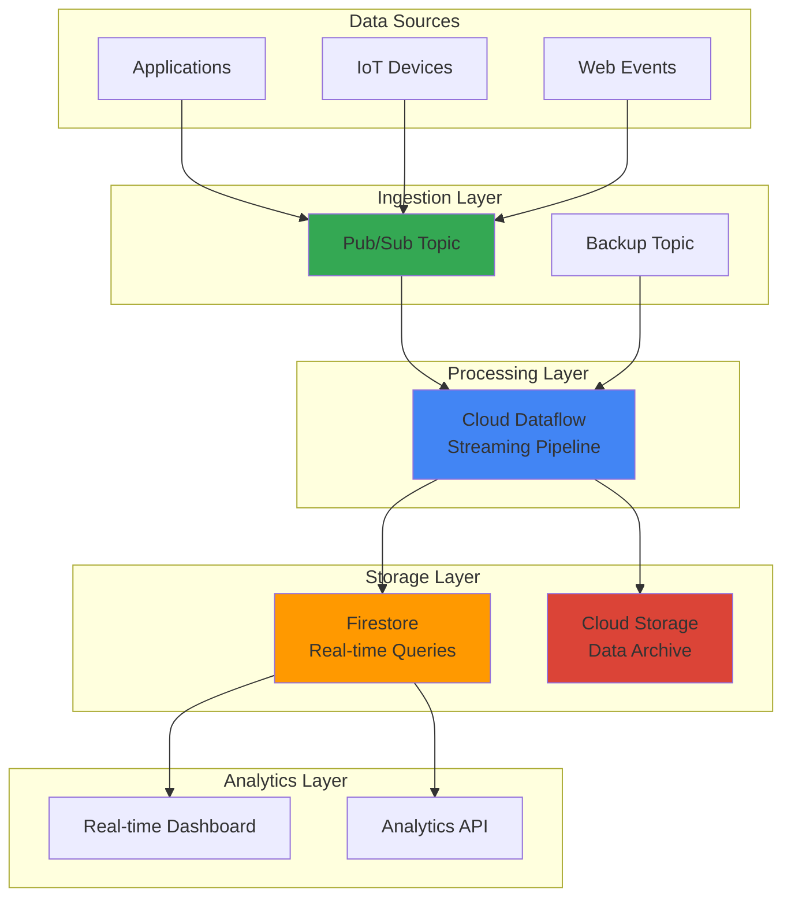

# Real-Time Analytics with Cloud Dataflow and Firestore

## Problem

Modern businesses need to process and analyze streaming data from multiple sources in real-time to make immediate business decisions, but traditional batch processing systems introduce unacceptable delays. Organizations struggle with building scalable streaming analytics platforms that can handle high-volume data ingestion, perform complex transformations, and provide instant query capabilities for dashboards and applications while maintaining data consistency and cost efficiency.

## Solution

Build a comprehensive real-time analytics platform using Cloud Dataflow for stream processing, Firestore for instant query capabilities, and Cloud Storage for long-term archival. This serverless architecture automatically scales to handle varying data volumes, processes streaming events through Apache Beam pipelines, stores aggregated results in Firestore for sub-second queries, and archives raw data for future analysis while maintaining strong consistency guarantees.

## Architecture Diagram



## Prerequisites

1. Google Cloud Project with Owner or Editor permissions for Dataflow, Pub/Sub, Firestore, and Cloud Storage
2. Google Cloud SDK (gcloud CLI) installed and authenticated
3. Apache Beam SDK knowledge (Python recommended)
4. Understanding of streaming data concepts and NoSQL database design
5. Estimated cost: $50-100 for running this recipe (varies by data volume and retention)

> **Note**: This recipe demonstrates production-ready patterns for real-time analytics using Google Cloud's serverless data processing services. Review [Google Cloud pricing documentation](https://cloud.google.com/pricing) for detailed cost estimates.

## Preparation

```bash
# Set environment variables for GCP resources
export PROJECT_ID="analytics-demo-$(date +%s)"
export REGION="us-central1"
export ZONE="us-central1-a"

# Generate unique suffix for resource names
RANDOM_SUFFIX=$(openssl rand -hex 3)

# Set resource names
export PUBSUB_TOPIC="events-topic-${RANDOM_SUFFIX}"
export SUBSCRIPTION="events-subscription-${RANDOM_SUFFIX}"
export DATAFLOW_JOB="streaming-analytics-${RANDOM_SUFFIX}"
export STORAGE_BUCKET="analytics-archive-${RANDOM_SUFFIX}"
export FIRESTORE_DATABASE="analytics-db-${RANDOM_SUFFIX}"

# Set default project and region
gcloud config set project ${PROJECT_ID}
gcloud config set compute/region ${REGION}
gcloud config set compute/zone ${ZONE}

# Enable required APIs
gcloud services enable dataflow.googleapis.com
gcloud services enable pubsub.googleapis.com
gcloud services enable firestore.googleapis.com
gcloud services enable storage.googleapis.com
gcloud services enable appengine.googleapis.com

echo "✅ Project configured: ${PROJECT_ID}"
echo "✅ APIs enabled for streaming analytics pipeline"
```

## Steps

1. **Create Pub/Sub Topic and Subscription for Event Ingestion**:

   Cloud Pub/Sub provides a globally distributed messaging service that decouples data producers from consumers, enabling reliable and scalable event ingestion. Creating a topic and subscription establishes the foundation for streaming data into your analytics pipeline with automatic load balancing and message durability.

   ```bash
   # Create Pub/Sub topic for streaming events
   gcloud pubsub topics create ${PUBSUB_TOPIC} \
       --message-retention-duration=7d \
       --message-storage-policy-allowed-regions=${REGION}
   
   # Create subscription for Dataflow pipeline
   gcloud pubsub subscriptions create ${SUBSCRIPTION} \
       --topic=${PUBSUB_TOPIC} \
       --ack-deadline=60 \
       --message-retention-duration=7d \
       --enable-exactly-once-delivery
   
   echo "✅ Pub/Sub topic and subscription created successfully"
   ```

   The messaging infrastructure is now ready to handle high-volume streaming data with exactly-once delivery guarantees. This configuration ensures reliable message processing and provides the scalability needed for real-time analytics workloads.

2. **Initialize Firestore Database for Real-Time Queries**:

   Firestore provides a serverless NoSQL document database with real-time synchronization capabilities and strong consistency. Initializing Firestore establishes the foundation for storing aggregated analytics results that can be queried with sub-second latency from web and mobile applications.

   ```bash
   # Create App Engine application (required for Firestore)
   gcloud app create --region=${REGION}
   
   # Initialize Firestore in Native mode
   gcloud firestore databases create \
       --location=${REGION} \
       --type=firestore-native
   
   # Create composite indexes for analytics queries
   cat > index.yaml << EOF
   indexes:
   - collectionGroup: analytics_metrics
     fields:
     - fieldPath: timestamp
       order: DESCENDING
     - fieldPath: metric_type
     - fieldPath: value
       order: DESCENDING
   
   - collectionGroup: user_sessions
     fields:
     - fieldPath: user_id
     - fieldPath: session_start
       order: DESCENDING
   EOF
   
   gcloud firestore indexes composite create --file=index.yaml
   
   echo "✅ Firestore database initialized with analytics indexes"
   ```

   Firestore is now configured for optimal real-time analytics queries with composite indexes that support complex filtering and sorting operations. This setup enables instant dashboard updates and API responses for analytics applications.

3. **Create Cloud Storage Bucket for Data Archival**:

   Cloud Storage provides unlimited object storage with multiple storage classes for cost optimization. Creating a bucket with intelligent tiering and lifecycle policies establishes a data lake for long-term analytics while minimizing storage costs through automatic tier transitions.

   ```bash
   # Create storage bucket for data archival
   gsutil mb -p ${PROJECT_ID} \
       -c STANDARD \
       -l ${REGION} \
       gs://${STORAGE_BUCKET}
   
   # Enable versioning for data protection
   gsutil versioning set on gs://${STORAGE_BUCKET}
   
   # Configure lifecycle policy for cost optimization
   cat > lifecycle.json << EOF
   {
     "lifecycle": {
       "rule": [
         {
           "action": {"type": "SetStorageClass", "storageClass": "NEARLINE"},
           "condition": {"age": 30}
         },
         {
           "action": {"type": "SetStorageClass", "storageClass": "COLDLINE"},
           "condition": {"age": 90}
         },
         {
           "action": {"type": "SetStorageClass", "storageClass": "ARCHIVE"},
           "condition": {"age": 365}
         }
       ]
     }
   }
   EOF
   
   gsutil lifecycle set lifecycle.json gs://${STORAGE_BUCKET}
   
   echo "✅ Cloud Storage bucket created with lifecycle management"
   ```

   The data lake is now ready with automated cost optimization through storage class transitions. This configuration balances accessibility with cost efficiency, ensuring raw data remains available for future analysis while minimizing long-term storage expenses.

4. **Create Service Account for Dataflow Pipeline**:

   Google Cloud service accounts provide secure authentication for applications without storing credentials in code. Creating a dedicated service account with minimal required permissions follows the principle of least privilege and enables secure access to multiple Google Cloud services within the Dataflow pipeline.

   ```bash
   # Create service account for Dataflow
   gcloud iam service-accounts create dataflow-analytics \
       --display-name="Dataflow Analytics Pipeline" \
       --description="Service account for streaming analytics pipeline"
   
   # Grant necessary permissions
   gcloud projects add-iam-policy-binding ${PROJECT_ID} \
       --member="serviceAccount:dataflow-analytics@${PROJECT_ID}.iam.gserviceaccount.com" \
       --role="roles/dataflow.worker"
   
   gcloud projects add-iam-policy-binding ${PROJECT_ID} \
       --member="serviceAccount:dataflow-analytics@${PROJECT_ID}.iam.gserviceaccount.com" \
       --role="roles/pubsub.subscriber"
   
   gcloud projects add-iam-policy-binding ${PROJECT_ID} \
       --member="serviceAccount:dataflow-analytics@${PROJECT_ID}.iam.gserviceaccount.com" \
       --role="roles/datastore.user"
   
   gcloud projects add-iam-policy-binding ${PROJECT_ID} \
       --member="serviceAccount:dataflow-analytics@${PROJECT_ID}.iam.gserviceaccount.com" \
       --role="roles/storage.admin"
   
   echo "✅ Service account created with appropriate permissions"
   ```

   The service account is now configured with the minimal permissions required for the streaming pipeline to operate securely across Google Cloud services while maintaining security best practices.

5. **Create Apache Beam Pipeline for Stream Processing**:

   Apache Beam provides a unified programming model for both batch and streaming data processing. Creating a streaming pipeline with windowing, aggregation, and multiple outputs demonstrates advanced stream processing patterns that handle real-time analytics requirements at scale.

   ```bash
   # Create directory for pipeline code
   mkdir -p dataflow-pipeline && cd dataflow-pipeline
   
   # Create requirements file with updated versions
   cat > requirements.txt << EOF
   apache-beam[gcp]==2.66.0
   google-cloud-firestore==2.21.0
   google-cloud-storage==2.19.0
   EOF
   
   # Create streaming pipeline
   cat > streaming_analytics.py << 'EOF'
   import apache_beam as beam
   from apache_beam.options.pipeline_options import PipelineOptions
   from apache_beam.transforms import window
   import json
   import logging
   from datetime import datetime
   from google.cloud import firestore
   
   class ParseEventsFn(beam.DoFn):
       def process(self, element):
           try:
               data = json.loads(element.decode('utf-8'))
               # Add processing timestamp
               data['processed_at'] = datetime.utcnow().isoformat()
               yield data
           except Exception as e:
               logging.error(f"Error parsing event: {e}")
   
   class AggregateMetrics(beam.DoFn):
       def process(self, element):
           window_start = element[1].start.to_utc_datetime()
           window_end = element[1].end.to_utc_datetime()
           events = element[0]
           
           # Calculate metrics
           total_events = len(events)
           event_types = {}
           user_sessions = {}
           
           for event in events:
               event_type = event.get('event_type', 'unknown')
               event_types[event_type] = event_types.get(event_type, 0) + 1
               
               user_id = event.get('user_id')
               if user_id:
                   if user_id not in user_sessions:
                       user_sessions[user_id] = {
                           'events': 0,
                           'first_event': event.get('timestamp'),
                           'last_event': event.get('timestamp')
                       }
                   user_sessions[user_id]['events'] += 1
                   user_sessions[user_id]['last_event'] = event.get('timestamp')
           
           yield {
               'window_start': window_start.isoformat(),
               'window_end': window_end.isoformat(),
               'total_events': total_events,
               'event_types': event_types,
               'unique_users': len(user_sessions),
               'user_sessions': user_sessions
           }
   
   class WriteToFirestore(beam.DoFn):
       def __init__(self, project_id):
           self.project_id = project_id
           self.db = None
       
       def setup(self):
           self.db = firestore.Client(project=self.project_id)
       
       def process(self, element):
           try:
               # Write aggregated metrics
               doc_ref = self.db.collection('analytics_metrics').document()
               doc_ref.set({
                   'timestamp': element['window_start'],
                   'metric_type': 'window_summary',
                   'value': element['total_events'],
                   'details': element
               })
               
               # Write user session data
               for user_id, session_data in element['user_sessions'].items():
                   session_ref = self.db.collection('user_sessions').document()
                   session_ref.set({
                       'user_id': user_id,
                       'session_start': element['window_start'],
                       'session_events': session_data['events'],
                       'first_event_time': session_data['first_event'],
                       'last_event_time': session_data['last_event']
                   })
               
               logging.info(f"Written analytics data for window: {element['window_start']}")
           except Exception as e:
               logging.error(f"Error writing to Firestore: {e}")
   
   def run_pipeline(argv=None):
       pipeline_options = PipelineOptions(argv)
       
       with beam.Pipeline(options=pipeline_options) as pipeline:
           # Read from Pub/Sub
           events = (pipeline 
                    | 'Read from Pub/Sub' >> beam.io.ReadFromPubSub(
                        subscription=f'projects/{pipeline_options.get_all_options()["project"]}/subscriptions/{pipeline_options.get_all_options()["subscription"]}')
                    | 'Parse Events' >> beam.ParDo(ParseEventsFn()))
           
           # Process streaming events
           windowed_events = (events
                            | 'Window Events' >> beam.WindowInto(window.FixedWindows(60))  # 1-minute windows
                            | 'Group Events' >> beam.GroupBy(lambda x: 1).aggregate_field(lambda x: x, beam.combiners.ToListCombineFn(), 'events'))
           
           # Aggregate metrics
           aggregated = (windowed_events
                        | 'Aggregate Metrics' >> beam.ParDo(AggregateMetrics()))
           
           # Write to Firestore
           (aggregated
            | 'Write to Firestore' >> beam.ParDo(WriteToFirestore(pipeline_options.get_all_options()["project"])))
           
           # Archive raw events to Cloud Storage
           (events
            | 'Format for Storage' >> beam.Map(lambda x: json.dumps(x))
            | 'Write to Storage' >> beam.io.WriteToText(
                f'gs://{pipeline_options.get_all_options()["bucket"]}/raw-events/',
                file_name_suffix='.json',
                num_shards=0))
   
   if __name__ == '__main__':
       logging.getLogger().setLevel(logging.INFO)
       run_pipeline()
   EOF
   
   echo "✅ Apache Beam streaming pipeline created with updated dependencies"
   ```

   The streaming pipeline is now ready to process real-time events with sophisticated windowing and aggregation logic. This implementation demonstrates production-ready patterns for handling high-volume streaming data with multiple output destinations, using the latest version of Apache Beam (2.66.0).

6. **Deploy Dataflow Streaming Pipeline**:

   Cloud Dataflow provides a fully managed service for executing Apache Beam pipelines with automatic scaling and resource management. Deploying the streaming pipeline establishes a serverless processing engine that can handle varying data volumes while maintaining low latency and high availability.

   ```bash
   # Install Python dependencies
   pip install -r requirements.txt
   
   # Deploy streaming pipeline to Dataflow
   python streaming_analytics.py \
       --runner=DataflowRunner \
       --project=${PROJECT_ID} \
       --region=${REGION} \
       --temp_location=gs://${STORAGE_BUCKET}/temp \
       --staging_location=gs://${STORAGE_BUCKET}/staging \
       --job_name=${DATAFLOW_JOB} \
       --subscription=${SUBSCRIPTION} \
       --bucket=${STORAGE_BUCKET} \
       --service_account_email=dataflow-analytics@${PROJECT_ID}.iam.gserviceaccount.com \
       --use_public_ips=false \
       --max_num_workers=10 \
       --streaming
   
   echo "✅ Dataflow streaming pipeline deployed successfully"
   cd ..
   ```

   The streaming analytics pipeline is now running on Dataflow with automatic scaling capabilities. This serverless deployment handles real-time event processing, aggregation, and storage distribution without requiring infrastructure management.

7. **Create Sample Data Generator for Testing**:

   Generating realistic test data validates the streaming pipeline functionality and demonstrates the system's ability to handle various event types and volumes. This simulation helps verify that all components work together correctly and provides a foundation for performance testing.

   ```bash
   # Create test data generator
   cat > generate_events.py << 'EOF'
   import json
   import random
   import time
   from datetime import datetime
   from google.cloud import pubsub_v1
   import sys
   
   def generate_event():
       event_types = ['page_view', 'click', 'purchase', 'signup', 'login']
       user_ids = [f'user_{i:04d}' for i in range(1, 1001)]
       
       return {
           'event_id': f'evt_{int(time.time() * 1000)}_{random.randint(1000, 9999)}',
           'event_type': random.choice(event_types),
           'user_id': random.choice(user_ids),
           'timestamp': datetime.utcnow().isoformat(),
           'properties': {
               'page': random.choice(['/home', '/products', '/checkout', '/profile']),
               'device': random.choice(['mobile', 'desktop', 'tablet']),
               'value': random.uniform(10, 1000) if random.random() > 0.7 else None
           }
       }
   
   def publish_events(project_id, topic_name, num_events=100):
       publisher = pubsub_v1.PublisherClient()
       topic_path = publisher.topic_path(project_id, topic_name)
       
       for i in range(num_events):
           event = generate_event()
           data = json.dumps(event).encode('utf-8')
           
           future = publisher.publish(topic_path, data)
           print(f'Published event {i+1}: {future.result()}')
           
           # Add some randomness to timing
           time.sleep(random.uniform(0.1, 0.5))
   
   if __name__ == '__main__':
       if len(sys.argv) != 4:
           print('Usage: python generate_events.py PROJECT_ID TOPIC_NAME NUM_EVENTS')
           sys.exit(1)
       
       project_id = sys.argv[1]
       topic_name = sys.argv[2]
       num_events = int(sys.argv[3])
       
       publish_events(project_id, topic_name, num_events)
   EOF
   
   # Install required library
   pip install google-cloud-pubsub
   
   # Generate test events
   python generate_events.py ${PROJECT_ID} ${PUBSUB_TOPIC} 50
   
   echo "✅ Test events generated and published to Pub/Sub"
   ```

   Sample events are now flowing through the streaming pipeline, demonstrating real-time data processing capabilities. This test data validates the entire analytics platform from ingestion through storage and aggregation.

8. **Create Real-Time Dashboard Query Examples**:

   Firestore's real-time query capabilities enable building responsive dashboards that update automatically as new data arrives. Creating query examples demonstrates how to retrieve analytics data for various use cases while leveraging Firestore's powerful indexing and filtering capabilities.

   ```bash
   # Create dashboard query examples
   cat > dashboard_queries.py << 'EOF'
   from google.cloud import firestore
   from datetime import datetime, timedelta
   import json
   
   def setup_firestore_client(project_id):
       return firestore.Client(project=project_id)
   
   def get_recent_metrics(db, hours=1):
       """Get metrics from the last N hours"""
       cutoff_time = datetime.utcnow() - timedelta(hours=hours)
       
       metrics_ref = db.collection('analytics_metrics')
       query = metrics_ref.where('timestamp', '>=', cutoff_time.isoformat()).order_by('timestamp', direction=firestore.Query.DESCENDING)
       
       metrics = []
       for doc in query.stream():
           metrics.append(doc.to_dict())
       
       return metrics
   
   def get_top_users_by_activity(db, limit=10):
       """Get most active users by session count"""
       sessions_ref = db.collection('user_sessions')
       query = sessions_ref.order_by('session_events', direction=firestore.Query.DESCENDING).limit(limit)
       
       top_users = []
       for doc in query.stream():
           top_users.append(doc.to_dict())
       
       return top_users
   
   def get_real_time_summary(db):
       """Get current analytics summary"""
       metrics_ref = db.collection('analytics_metrics')
       recent_query = metrics_ref.order_by('timestamp', direction=firestore.Query.DESCENDING).limit(5)
       
       total_events = 0
       unique_users = 0
       
       for doc in recent_query.stream():
           data = doc.to_dict()
           if 'details' in data:
               total_events += data['details'].get('total_events', 0)
               unique_users += data['details'].get('unique_users', 0)
       
       return {
           'total_events_last_5_windows': total_events,
           'unique_users_last_5_windows': unique_users,
           'last_updated': datetime.utcnow().isoformat()
       }
   
   def listen_for_real_time_updates(db):
       """Demonstrate real-time listener for dashboard updates"""
       def on_snapshot(doc_snapshot, changes, read_time):
           for change in changes:
               if change.type.name == 'ADDED':
                   print(f'New analytics data: {change.document.to_dict()}')
               elif change.type.name == 'MODIFIED':
                   print(f'Updated analytics data: {change.document.to_dict()}')
       
       # Listen for new analytics metrics
       metrics_ref = db.collection('analytics_metrics')
       query = metrics_ref.order_by('timestamp', direction=firestore.Query.DESCENDING).limit(1)
       
       # This would run continuously in a real dashboard
       query.on_snapshot(on_snapshot)
       
       return "Real-time listener configured"
   
   if __name__ == '__main__':
       import sys
       if len(sys.argv) != 2:
           print('Usage: python dashboard_queries.py PROJECT_ID')
           sys.exit(1)
       
       project_id = sys.argv[1]
       db = setup_firestore_client(project_id)
       
       print("=== Recent Metrics ===")
       metrics = get_recent_metrics(db)
       print(json.dumps(metrics[:3], indent=2, default=str))
       
       print("\n=== Real-time Summary ===")
       summary = get_real_time_summary(db)
       print(json.dumps(summary, indent=2))
       
       print("\n=== Top Active Users ===")
       top_users = get_top_users_by_activity(db, 5)
       print(json.dumps(top_users, indent=2, default=str))
   EOF
   
   # Install Firestore client
   pip install google-cloud-firestore
   
   # Wait for pipeline to process events, then run queries
   echo "Waiting 2 minutes for pipeline to process events..."
   sleep 120
   
   # Run dashboard queries
   python dashboard_queries.py ${PROJECT_ID}
   
   echo "✅ Dashboard queries demonstrate real-time analytics capabilities"
   ```

   The dashboard queries showcase Firestore's real-time capabilities for building responsive analytics applications. These examples demonstrate how to retrieve aggregated data, monitor top users, and implement real-time updates for live dashboards.

## Validation & Testing

1. **Verify Dataflow Pipeline Status**:

   ```bash
   # Check pipeline status
   gcloud dataflow jobs list \
       --filter="name:${DATAFLOW_JOB}" \
       --format="table(name,state,createTime)"
   
   # View pipeline metrics
   gcloud dataflow jobs describe ${DATAFLOW_JOB} \
       --format="value(currentState,createTime)"
   ```

   Expected output: Pipeline should show "JOB_STATE_RUNNING" status with recent creation time.

2. **Validate Pub/Sub Message Flow**:

   ```bash
   # Check topic and subscription status
   gcloud pubsub topics describe ${PUBSUB_TOPIC}
   
   # View subscription metrics
   gcloud pubsub subscriptions describe ${SUBSCRIPTION} \
       --format="value(ackDeadlineSeconds,messageRetentionDuration)"
   ```

   Expected output: Topic and subscription should be active with proper configuration settings.

3. **Test Firestore Data Population**:

   ```bash
   # Query Firestore for analytics data
   python -c "
   from google.cloud import firestore
   db = firestore.Client(project='${PROJECT_ID}')
   metrics = list(db.collection('analytics_metrics').limit(3).stream())
   sessions = list(db.collection('user_sessions').limit(3).stream())
   print(f'Analytics metrics: {len(metrics)} documents')
   print(f'User sessions: {len(sessions)} documents')
   "
   ```

   Expected output: Should show document counts indicating successful data processing and storage.

4. **Verify Cloud Storage Archives**:

   ```bash
   # Check archived data in Cloud Storage
   gsutil ls -la gs://${STORAGE_BUCKET}/raw-events/
   
   # View sample archived event
   gsutil cat gs://${STORAGE_BUCKET}/raw-events/*.json | head -n 1
   ```

   Expected output: Should show JSON files with archived event data and proper timestamps.

## Cleanup

1. **Stop Dataflow Pipeline**:

   ```bash
   # Drain and stop the streaming pipeline
   gcloud dataflow jobs cancel ${DATAFLOW_JOB} \
       --region=${REGION}
   
   echo "✅ Dataflow pipeline stopped"
   ```

2. **Delete Pub/Sub Resources**:

   ```bash
   # Delete subscription and topic
   gcloud pubsub subscriptions delete ${SUBSCRIPTION}
   gcloud pubsub topics delete ${PUBSUB_TOPIC}
   
   echo "✅ Pub/Sub resources deleted"
   ```

3. **Remove Cloud Storage Bucket**:

   ```bash
   # Delete all objects and bucket
   gsutil -m rm -r gs://${STORAGE_BUCKET}
   
   echo "✅ Cloud Storage bucket deleted"
   ```

4. **Clean Up Firestore Collections**:

   ```bash
   # Delete Firestore collections (requires manual cleanup or batch operations)
   python -c "
   from google.cloud import firestore
   db = firestore.Client(project='${PROJECT_ID}')
   
   # Delete analytics_metrics collection
   batch = db.batch()
   docs = db.collection('analytics_metrics').limit(500).stream()
   count = 0
   for doc in docs:
       batch.delete(doc.reference)
       count += 1
       if count % 100 == 0:
           batch.commit()
           batch = db.batch()
   if count % 100 != 0:
       batch.commit()
   
   # Delete user_sessions collection
   batch = db.batch()
   docs = db.collection('user_sessions').limit(500).stream()
   count = 0
   for doc in docs:
       batch.delete(doc.reference)
       count += 1
       if count % 100 == 0:
           batch.commit()
           batch = db.batch()
   if count % 100 != 0:
       batch.commit()
   
   print('Firestore collections cleaned up')
   "
   
   echo "✅ Firestore data deleted"
   ```

5. **Remove Service Account and IAM Bindings**:

   ```bash
   # Remove IAM policy bindings
   gcloud projects remove-iam-policy-binding ${PROJECT_ID} \
       --member="serviceAccount:dataflow-analytics@${PROJECT_ID}.iam.gserviceaccount.com" \
       --role="roles/dataflow.worker"
   
   # Delete service account
   gcloud iam service-accounts delete \
       dataflow-analytics@${PROJECT_ID}.iam.gserviceaccount.com \
       --quiet
   
   echo "✅ Service account and permissions cleaned up"
   ```

## Discussion

This real-time analytics platform demonstrates the power of Google Cloud's serverless data processing services for building scalable streaming architectures. Cloud Dataflow provides managed Apache Beam execution with automatic scaling, handling varying data volumes without infrastructure management. The platform processes streaming events through windowed aggregations, storing results in Firestore for instant queries while archiving raw data in Cloud Storage for long-term analysis.

The architecture leverages Firestore's real-time synchronization capabilities to enable responsive dashboards that update automatically as new analytics data arrives. This pattern is particularly valuable for applications requiring immediate insights, such as monitoring user behavior, tracking business metrics, or detecting anomalies. The combination of streaming processing with NoSQL storage provides both scalability and low-latency access to analytical results.

Cost optimization occurs through multiple mechanisms: Dataflow's automatic scaling reduces compute costs during low-traffic periods, Cloud Storage lifecycle policies automatically transition data to cheaper storage classes, and Firestore's pay-per-operation model ensures you only pay for actual usage. This serverless approach eliminates the need for capacity planning while maintaining performance during traffic spikes.

Security follows Google Cloud best practices with service accounts using least-privilege access, private IP addressing for Dataflow workers, and encryption at rest for all storage services. The platform integrates with Google Cloud's monitoring and logging services, providing comprehensive observability for troubleshooting and optimization. For additional guidance, refer to the [Google Cloud Architecture Framework](https://cloud.google.com/architecture/framework) and [Dataflow best practices documentation](https://cloud.google.com/dataflow/docs/guides/best-practices).

> **Tip**: Monitor Dataflow pipeline metrics in Cloud Monitoring to optimize worker allocation and detect processing bottlenecks. Use [Firestore monitoring](https://cloud.google.com/firestore/docs/monitoring) to track read/write operations and optimize query patterns for cost efficiency.

## Challenge

Extend this real-time analytics platform with these enhancements:

1. **Implement anomaly detection** using [Vertex AI](https://cloud.google.com/vertex-ai) to automatically identify unusual patterns in streaming data and trigger alerts through Cloud Functions and notification services.

2. **Add geographic analysis** by integrating [BigQuery GIS functions](https://cloud.google.com/bigquery/docs/gis) to process location-based events and create spatial analytics for regional insights and location-based recommendations.

3. **Build predictive analytics** using [Vertex AI AutoML](https://cloud.google.com/vertex-ai/docs/start/automl-users) to train models on historical data and generate real-time predictions for user behavior, churn probability, or demand forecasting.

4. **Implement data quality monitoring** with [Cloud Data Quality](https://cloud.google.com/dataplex/docs/data-quality-overview) to automatically validate incoming events, detect schema changes, and maintain data lineage for compliance and debugging.

5. **Create multi-region deployment** using [Pub/Sub global topics](https://cloud.google.com/pubsub/docs/topics) and [Firestore multi-region instances](https://cloud.google.com/firestore/docs/locations) to provide global data processing with regional data residency compliance.

## Infrastructure Code

*Infrastructure code will be generated after recipe approval.*