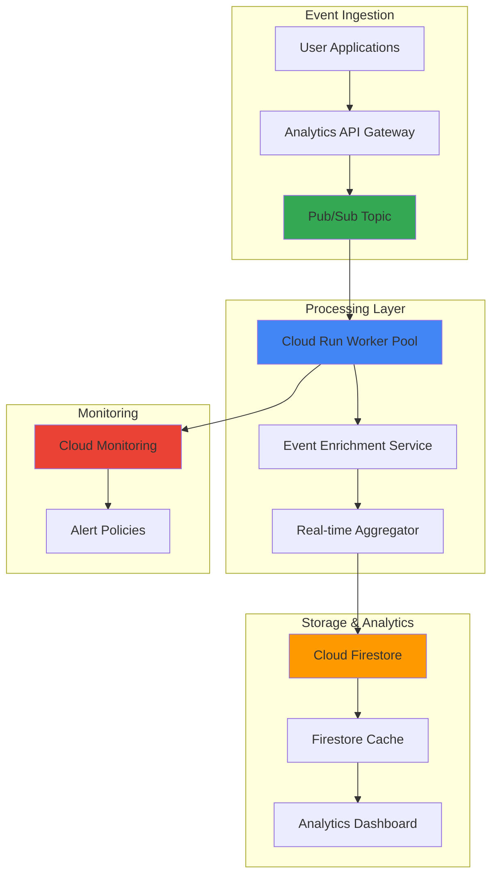

# Real-Time Behavioral Analytics with Cloud Run Worker Pools and Cloud Firestore

## Problem

E-commerce and digital product companies struggle to understand user behavior patterns in real-time, often relying on batch processing systems that provide insights hours or days after user interactions occur. This delay prevents immediate personalization, real-time fraud detection, and dynamic content optimization. Traditional analytics solutions either lack the scalability to handle high-volume event streams or require complex infrastructure management that diverts engineering resources from core business logic.

## Solution

Build a scalable real-time behavioral analytics system using Cloud Run Worker Pools for continuous background processing of user events, Cloud Firestore for fast analytics queries, and Pub/Sub for reliable event ingestion. This serverless architecture automatically scales based on event volume, provides millisecond query performance for real-time insights, and requires minimal infrastructure management while supporting millions of user interactions per day.

## Architecture Diagram



## Prerequisites

1. Google Cloud project with billing enabled and appropriate IAM permissions for Cloud Run, Firestore, Pub/Sub, and Cloud Monitoring
2. Google Cloud CLI installed and configured (or Cloud Shell)
3. Docker installed locally for container image building
4. Basic understanding of event-driven architectures and NoSQL databases
5. Estimated cost: $5-15 for testing (depending on event volume and duration)

> **Note**: This recipe uses Cloud Run Worker Pools which are currently in beta and designed specifically for pull-based background processing workloads.

## Preparation

```bash
# Set environment variables for GCP resources
export PROJECT_ID="behavioral-analytics-$(date +%s)"
export REGION="us-central1"
export ZONE="us-central1-a"

# Generate unique suffix for resource names
RANDOM_SUFFIX=$(openssl rand -hex 3)

# Set resource names
export PUBSUB_TOPIC="user-events-${RANDOM_SUFFIX}"
export SUBSCRIPTION_NAME="analytics-processor-${RANDOM_SUFFIX}"
export WORKER_POOL_NAME="behavioral-processor-${RANDOM_SUFFIX}"
export FIRESTORE_DATABASE="behavioral-analytics"
export SERVICE_ACCOUNT="analytics-processor-${RANDOM_SUFFIX}@${PROJECT_ID}.iam.gserviceaccount.com"

# Set default project and region
gcloud config set project ${PROJECT_ID}
gcloud config set compute/region ${REGION}
gcloud config set compute/zone ${ZONE}

# Enable required APIs
gcloud services enable run.googleapis.com
gcloud services enable firestore.googleapis.com
gcloud services enable pubsub.googleapis.com
gcloud services enable monitoring.googleapis.com
gcloud services enable cloudbuild.googleapis.com

echo "✅ Project configured: ${PROJECT_ID}"
echo "✅ APIs enabled successfully"

# Create Firestore database in Native mode
gcloud firestore databases create \
    --database=${FIRESTORE_DATABASE} \
    --location=${REGION} \
    --type=firestore-native

echo "✅ Firestore database created: ${FIRESTORE_DATABASE}"
```

## Steps

1. **Create Pub/Sub Topic and Subscription for Event Ingestion**:

   Pub/Sub provides the foundation for reliable event ingestion, offering guaranteed delivery and automatic scaling to handle varying event volumes. The topic acts as a central hub for all user behavioral events, while the subscription enables the worker pool to process events at its own pace with built-in retry mechanisms.

   ```bash
   # Create Pub/Sub topic for user events
   gcloud pubsub topics create ${PUBSUB_TOPIC}
   
   # Create subscription for worker pool processing
   gcloud pubsub subscriptions create ${SUBSCRIPTION_NAME} \
       --topic=${PUBSUB_TOPIC} \
       --ack-deadline=60 \
       --message-retention-duration=7d \
       --enable-message-ordering
   
   echo "✅ Pub/Sub topic and subscription created successfully"
   ```

   The subscription is configured with a 60-second acknowledgment deadline to handle complex event processing, 7-day message retention for reliability, and message ordering to maintain event sequence integrity for accurate behavioral analysis.

2. **Create Service Account with Appropriate Permissions**:

   Identity and Access Management (IAM) ensures secure access to Google Cloud services while following the principle of least privilege. The service account grants the worker pool only the permissions necessary for processing events and storing analytics data, maintaining security while enabling functionality.

   ```bash
   # Create dedicated service account for the worker pool
   gcloud iam service-accounts create analytics-processor-${RANDOM_SUFFIX} \
       --display-name="Behavioral Analytics Processor" \
       --description="Service account for Cloud Run worker pool processing behavioral events"
   
   # Grant necessary permissions for Pub/Sub processing
   gcloud projects add-iam-policy-binding ${PROJECT_ID} \
       --member="serviceAccount:${SERVICE_ACCOUNT}" \
       --role="roles/pubsub.subscriber"
   
   # Grant Firestore read/write permissions
   gcloud projects add-iam-policy-binding ${PROJECT_ID} \
       --member="serviceAccount:${SERVICE_ACCOUNT}" \
       --role="roles/datastore.user"
   
   # Grant Cloud Monitoring permissions for metrics
   gcloud projects add-iam-policy-binding ${PROJECT_ID} \
       --member="serviceAccount:${SERVICE_ACCOUNT}" \
       --role="roles/monitoring.metricWriter"
   
   echo "✅ Service account created with appropriate permissions"
   ```

   These IAM roles enable the worker pool to consume Pub/Sub messages, read and write Firestore documents, and publish custom metrics to Cloud Monitoring for observability and alerting.

3. **Create Application Code for Behavioral Event Processing**:

   The event processing application implements the core business logic for transforming raw user events into structured analytics data. This code demonstrates real-time aggregation patterns and Firestore optimization techniques for high-performance behavioral analytics.

   ```bash
   # Create application directory and files
   mkdir -p behavioral-processor
   cd behavioral-processor
   
   # Create requirements.txt for Python dependencies
   cat > requirements.txt << 'EOF'
google-cloud-pubsub==2.25.0
google-cloud-firestore==2.20.2
google-cloud-monitoring==2.27.1
python-json-logger==2.0.7
gunicorn==21.2.0
EOF

   # Create main application file
   cat > main.py << 'EOF'
import json
import logging
import os
import time
from datetime import datetime, timedelta
from concurrent.futures import ThreadPoolExecutor
from google.cloud import pubsub_v1, firestore, monitoring_v3
from pythonjsonlogger import jsonlogger

# Configure structured logging
logHandler = logging.StreamHandler()
formatter = jsonlogger.JsonFormatter()
logHandler.setFormatter(formatter)
logger = logging.getLogger()
logger.addHandler(logHandler)
logger.setLevel(logging.INFO)

class BehavioralAnalyticsProcessor:
    def __init__(self):
        self.project_id = os.environ['GOOGLE_CLOUD_PROJECT']
        self.subscription_path = os.environ['PUBSUB_SUBSCRIPTION']
        self.firestore_client = firestore.Client(database=os.environ.get('FIRESTORE_DATABASE', '(default)'))
        self.monitoring_client = monitoring_v3.MetricServiceClient()
        self.subscriber = pubsub_v1.SubscriberClient()
        
        # Initialize collections
        self.events_collection = self.firestore_client.collection('user_events')
        self.analytics_collection = self.firestore_client.collection('analytics_aggregates')
        
        logger.info("Behavioral Analytics Processor initialized")
    
    def process_event(self, message):
        """Process individual user behavioral event"""
        try:
            # Parse event data
            event_data = json.loads(message.data.decode('utf-8'))
            
            # Enrich event with processing timestamp
            event_data['processed_at'] = firestore.SERVER_TIMESTAMP
            event_data['processing_latency'] = time.time() - event_data.get('timestamp', time.time())
            
            # Store raw event for detailed analysis
            event_doc_ref = self.events_collection.document()
            event_doc_ref.set(event_data)
            
            # Update real-time aggregates
            self.update_analytics_aggregates(event_data)
            
            # Send custom metrics
            self.send_metrics(event_data)
            
            message.ack()
            logger.info(f"Successfully processed event: {event_data.get('event_type', 'unknown')}")
            
        except Exception as e:
            logger.error(f"Error processing event: {str(e)}")
            message.nack()
    
    def update_analytics_aggregates(self, event_data):
        """Update real-time analytics aggregates in Firestore"""
        user_id = event_data.get('user_id')
        event_type = event_data.get('event_type')
        timestamp = datetime.fromtimestamp(event_data.get('timestamp', time.time()))
        
        # Create time-based aggregation keys
        hourly_key = timestamp.strftime('%Y-%m-%d-%H')
        daily_key = timestamp.strftime('%Y-%m-%d')
        
        # Update user-specific aggregates
        if user_id:
            user_doc_ref = self.analytics_collection.document(f"user_{user_id}")
            user_doc_ref.set({
                'last_activity': firestore.SERVER_TIMESTAMP,
                'total_events': firestore.Increment(1),
                f'events_by_type.{event_type}': firestore.Increment(1)
            }, merge=True)
        
        # Update global hourly aggregates
        hourly_doc_ref = self.analytics_collection.document(f"hourly_{hourly_key}")
        hourly_doc_ref.set({
            'period': hourly_key,
            'total_events': firestore.Increment(1),
            f'events_by_type.{event_type}': firestore.Increment(1),
            'last_updated': firestore.SERVER_TIMESTAMP
        }, merge=True)
        
        # Update global daily aggregates
        daily_doc_ref = self.analytics_collection.document(f"daily_{daily_key}")
        daily_doc_ref.set({
            'period': daily_key,
            'total_events': firestore.Increment(1),
            f'events_by_type.{event_type}': firestore.Increment(1),
            'last_updated': firestore.SERVER_TIMESTAMP
        }, merge=True)
    
    def send_metrics(self, event_data):
        """Send custom metrics to Cloud Monitoring"""
        try:
            series = monitoring_v3.TimeSeries()
            series.metric.type = 'custom.googleapis.com/behavioral_analytics/events_processed'
            series.metric.labels['event_type'] = event_data.get('event_type', 'unknown')
            series.resource.type = 'cloud_run_revision'
            series.resource.labels['service_name'] = os.environ.get('K_SERVICE', 'behavioral-processor')
            series.resource.labels['revision_name'] = os.environ.get('K_REVISION', 'unknown')
            series.resource.labels['location'] = os.environ.get('GOOGLE_CLOUD_REGION', 'us-central1')
            
            point = monitoring_v3.Point()
            point.value.int64_value = 1
            point.interval.end_time.seconds = int(time.time())
            series.points = [point]
            
            project_name = f"projects/{self.project_id}"
            self.monitoring_client.create_time_series(name=project_name, time_series=[series])
            
        except Exception as e:
            logger.warning(f"Failed to send metrics: {str(e)}")
    
    def run(self):
        """Main processing loop for the worker pool"""
        logger.info("Starting behavioral analytics processing...")
        
        # Configure subscriber settings for optimal performance
        flow_control = pubsub_v1.types.FlowControl(max_messages=100, max_bytes=10*1024*1024)
        
        # Use ThreadPoolExecutor for concurrent message processing
        with ThreadPoolExecutor(max_workers=10) as executor:
            streaming_pull_future = self.subscriber.subscribe(
                self.subscription_path,
                callback=self.process_event,
                flow_control=flow_control
            )
            
            logger.info(f"Listening for messages on {self.subscription_path}")
            
            try:
                streaming_pull_future.result()
            except KeyboardInterrupt:
                streaming_pull_future.cancel()
                logger.info("Processing stopped")

if __name__ == '__main__':
    processor = BehavioralAnalyticsProcessor()
    processor.run()
EOF

   # Create Dockerfile for containerization
   cat > Dockerfile << 'EOF'
FROM python:3.11-slim

WORKDIR /app

COPY requirements.txt .
RUN pip install --no-cache-dir -r requirements.txt

COPY main.py .

# Run the application
CMD ["python", "main.py"]
EOF

   echo "✅ Application code created successfully"
   ```

   This application implements efficient event processing with concurrent message handling, real-time aggregation using Firestore atomic operations, and comprehensive monitoring integration for production-ready behavioral analytics.

4. **Build and Deploy Container Image to Artifact Registry**:

   Artifact Registry provides secure, managed container image storage with vulnerability scanning and fine-grained access controls. Building and storing the container image in Artifact Registry enables reliable deployment to Cloud Run while maintaining security and compliance standards.

   ```bash
   # Create Artifact Registry repository
   gcloud artifacts repositories create behavioral-analytics \
       --repository-format=docker \
       --location=${REGION} \
       --description="Container images for behavioral analytics system"
   
   # Configure Docker authentication
   gcloud auth configure-docker ${REGION}-docker.pkg.dev
   
   # Build and push container image
   IMAGE_URI="${REGION}-docker.pkg.dev/${PROJECT_ID}/behavioral-analytics/processor:latest"
   
   gcloud builds submit . --tag=${IMAGE_URI}
   
   echo "✅ Container image built and pushed: ${IMAGE_URI}"
   ```

   The container image is now securely stored in Artifact Registry with automatic vulnerability scanning enabled, providing a reliable foundation for deploying the behavioral analytics processor to Cloud Run Worker Pools.

5. **Deploy Cloud Run Worker Pool for Background Processing**:

   Cloud Run Worker Pools are specifically designed for pull-based workloads like Pub/Sub processing, offering continuous background processing capabilities without requiring HTTP endpoints. This deployment configuration optimizes for high-throughput event processing with automatic scaling based on queue depth.

   ```bash
   # Deploy Cloud Run Worker Pool
   gcloud beta run worker-pools deploy ${WORKER_POOL_NAME} \
       --image=${IMAGE_URI} \
       --region=${REGION} \
       --service-account=${SERVICE_ACCOUNT} \
       --set-env-vars="PUBSUB_SUBSCRIPTION=projects/${PROJECT_ID}/subscriptions/${SUBSCRIPTION_NAME}" \
       --set-env-vars="FIRESTORE_DATABASE=${FIRESTORE_DATABASE}" \
       --memory=1Gi \
       --cpu=1 \
       --min-instances=1 \
       --max-instances=10 \
       --concurrency=1000
   
   echo "✅ Cloud Run Worker Pool deployed successfully"
   
   # Verify deployment status
   gcloud beta run worker-pools describe ${WORKER_POOL_NAME} \
       --region=${REGION} \
       --format="value(status.conditions[0].status)"
   ```

   The worker pool is configured with 1GB memory and 1 CPU for optimal event processing performance, automatic scaling from 1 to 10 instances based on message queue depth, and high concurrency settings to maximize throughput while maintaining cost efficiency.

6. **Create Firestore Indexes for Analytics Queries**:

   Firestore indexes enable fast querying of behavioral data by optimizing data access patterns for real-time analytics. These composite indexes support complex queries on user behavior patterns, time-based aggregations, and event type filtering with millisecond response times.

   ```bash
   # Create firestore.indexes.json for composite indexes
   cat > firestore.indexes.json << 'EOF'
{
  "indexes": [
    {
      "collectionGroup": "user_events",
      "queryScope": "COLLECTION",
      "fields": [
        {"fieldPath": "user_id", "order": "ASCENDING"},
        {"fieldPath": "timestamp", "order": "DESCENDING"}
      ]
    },
    {
      "collectionGroup": "user_events",
      "queryScope": "COLLECTION",
      "fields": [
        {"fieldPath": "event_type", "order": "ASCENDING"},
        {"fieldPath": "timestamp", "order": "DESCENDING"}
      ]
    },
    {
      "collectionGroup": "analytics_aggregates",
      "queryScope": "COLLECTION",
      "fields": [
        {"fieldPath": "period", "order": "ASCENDING"},
        {"fieldPath": "last_updated", "order": "DESCENDING"}
      ]
    }
  ]
}
EOF

   # Deploy Firestore indexes
   gcloud firestore indexes composite create \
       --collection-group=user_events \
       --field-config=field-path=user_id,order=ascending \
       --field-config=field-path=timestamp,order=descending \
       --database=${FIRESTORE_DATABASE}
   
   gcloud firestore indexes composite create \
       --collection-group=user_events \
       --field-config=field-path=event_type,order=ascending \
       --field-config=field-path=timestamp,order=descending \
       --database=${FIRESTORE_DATABASE}
   
   echo "✅ Firestore indexes created for optimized analytics queries"
   ```

   These composite indexes enable efficient querying of user behavioral data by user ID and timestamp, event type and timestamp, and analytics aggregates by time period, ensuring sub-millisecond query performance even with millions of events.

7. **Set Up Cloud Monitoring Dashboards and Alerts**:

   Cloud Monitoring provides comprehensive observability for the behavioral analytics system, enabling proactive monitoring of event processing rates, system performance, and data quality. Custom dashboards and alerts ensure system reliability and optimal performance.

   ```bash
   # Create custom dashboard configuration
   cat > dashboard-config.json << 'EOF'
{
  "displayName": "Behavioral Analytics Dashboard",
  "mosaicLayout": {
    "tiles": [
      {
        "width": 6,
        "height": 4,
        "widget": {
          "title": "Events Processed Per Minute",
          "xyChart": {
            "dataSets": [{
              "timeSeriesQuery": {
                "timeSeriesFilter": {
                  "filter": "metric.type=\"custom.googleapis.com/behavioral_analytics/events_processed\"",
                  "aggregation": {
                    "alignmentPeriod": "60s",
                    "perSeriesAligner": "ALIGN_RATE"
                  }
                }
              }
            }]
          }
        }
      },
      {
        "width": 6,
        "height": 4,
        "xPos": 6,
        "widget": {
          "title": "Worker Pool Instance Count",
          "xyChart": {
            "dataSets": [{
              "timeSeriesQuery": {
                "timeSeriesFilter": {
                  "filter": "resource.type=\"cloud_run_revision\" AND metric.type=\"run.googleapis.com/container/instance_count\"",
                  "aggregation": {
                    "alignmentPeriod": "60s",
                    "perSeriesAligner": "ALIGN_MEAN"
                  }
                }
              }
            }]
          }
        }
      }
    ]
  }
}
EOF

   # Create monitoring dashboard
   gcloud monitoring dashboards create --config-from-file=dashboard-config.json
   
   # Create alert policy for high message lag
   gcloud alpha monitoring policies create \
       --display-name="High Pub/Sub Message Lag" \
       --condition-filter="resource.type=\"pubsub_subscription\"" \
       --condition-comparison="COMPARISON_GREATER_THAN" \
       --condition-threshold-value=100 \
       --condition-duration=300s \
       --notification-channels="" \
       --documentation="Alert when Pub/Sub subscription has high message lag"
   
   echo "✅ Monitoring dashboard and alerts configured"
   ```

   The monitoring setup provides real-time visibility into event processing rates, worker pool scaling behavior, and system health metrics, enabling proactive management and optimization of the behavioral analytics pipeline.

8. **Create Sample Event Generator for Testing**:

   A realistic event generator enables comprehensive testing of the behavioral analytics system with various event types and volumes. This testing approach validates system performance, data accuracy, and scaling behavior under different load conditions.

   ```bash
   # Create event generator script
   cat > generate_events.py << 'EOF'
import json
import random
import time
from datetime import datetime
from google.cloud import pubsub_v1

class EventGenerator:
    def __init__(self, project_id, topic_name):
        self.publisher = pubsub_v1.PublisherClient()
        self.topic_path = self.publisher.topic_path(project_id, topic_name)
        
        self.event_types = ['page_view', 'button_click', 'purchase', 'search', 'signup', 'login']
        self.user_ids = [f"user_{i}" for i in range(1, 101)]  # 100 test users
        
    def generate_event(self):
        """Generate a realistic user behavioral event"""
        event = {
            'event_id': f"evt_{random.randint(100000, 999999)}",
            'user_id': random.choice(self.user_ids),
            'event_type': random.choice(self.event_types),
            'timestamp': time.time(),
            'session_id': f"sess_{random.randint(1000, 9999)}",
            'properties': {
                'page_url': f"/page/{random.randint(1, 50)}",
                'referrer': random.choice(['google.com', 'direct', 'facebook.com', 'twitter.com']),
                'device_type': random.choice(['desktop', 'mobile', 'tablet']),
                'user_agent': 'BehavioralAnalytics/1.0'
            }
        }
        
        # Add event-specific properties
        if event['event_type'] == 'purchase':
            event['properties']['amount'] = round(random.uniform(10.0, 500.0), 2)
            event['properties']['currency'] = 'USD'
        elif event['event_type'] == 'search':
            event['properties']['query'] = f"search_term_{random.randint(1, 100)}"
        
        return event
    
    def send_events(self, count=100, interval=1):
        """Send multiple events to Pub/Sub topic"""
        print(f"Generating {count} events...")
        
        for i in range(count):
            event = self.generate_event()
            event_json = json.dumps(event)
            
            # Publish event to Pub/Sub
            future = self.publisher.publish(self.topic_path, event_json.encode('utf-8'))
            
            if i % 10 == 0:
                print(f"Sent {i+1}/{count} events")
            
            time.sleep(interval)
        
        print(f"✅ Successfully sent {count} events")

if __name__ == '__main__':
    import os
    project_id = os.environ['GOOGLE_CLOUD_PROJECT']
    topic_name = os.environ['PUBSUB_TOPIC']
    
    generator = EventGenerator(project_id, topic_name)
    generator.send_events(count=50, interval=0.5)
EOF

   # Generate sample events for testing
   python3 generate_events.py
   
   echo "✅ Sample events generated for testing"
   ```

   The event generator creates realistic user behavioral events with diverse properties, enabling comprehensive testing of the analytics pipeline's ability to handle various event types, user patterns, and data structures typical in production environments.

## Validation & Testing

1. Verify Cloud Run Worker Pool is processing events:

   ```bash
   # Check worker pool status and instances
   gcloud beta run worker-pools describe ${WORKER_POOL_NAME} \
       --region=${REGION} \
       --format="table(metadata.name,status.url,status.observedGeneration)"
   
   # View worker pool logs
   gcloud logs read "resource.type=cloud_run_revision AND resource.labels.service_name=${WORKER_POOL_NAME}" \
       --limit=20 \
       --format="value(timestamp,severity,textPayload)"
   ```

   Expected output: Worker pool status should show "Ready" and logs should display successful event processing messages.

2. Verify events are being stored in Firestore:

   ```bash
   # Query recent user events from Firestore
   gcloud firestore documents list --collection-ids=user_events \
       --database=${FIRESTORE_DATABASE} \
       --limit=5 \
       --format="table(name,createTime)"
   
   # Check analytics aggregates
   gcloud firestore documents list --collection-ids=analytics_aggregates \
       --database=${FIRESTORE_DATABASE} \
       --limit=5 \
       --format="table(name,updateTime)"
   ```

   Expected output: Documents should appear in both collections with recent timestamps indicating successful processing.

3. Test real-time analytics query performance:

   ```bash
   # Create a simple query test script
   cat > test_queries.py << 'EOF'
import os
from google.cloud import firestore
import time

client = firestore.Client(database=os.environ.get('FIRESTORE_DATABASE', '(default)'))

# Test user-specific analytics query
start_time = time.time()
user_analytics = client.collection('analytics_aggregates').document('user_user_1').get()
query_time = (time.time() - start_time) * 1000

print(f"User analytics query time: {query_time:.2f}ms")
if user_analytics.exists:
    print(f"User analytics data: {user_analytics.to_dict()}")

# Test hourly aggregates query
start_time = time.time()
hourly_docs = client.collection('analytics_aggregates').where('period', '>=', '2025-07-23').limit(10).get()
query_time = (time.time() - start_time) * 1000

print(f"Hourly aggregates query time: {query_time:.2f}ms")
print(f"Found {len(hourly_docs)} hourly aggregate documents")
EOF

   python3 test_queries.py
   ```

   Expected output: Query times should be under 100ms, demonstrating real-time performance capabilities.

4. Monitor system metrics and performance:

   ```bash
   # Check custom metrics in Cloud Monitoring
   gcloud monitoring metrics list \
       --filter="metric.type:custom.googleapis.com/behavioral_analytics" \
       --format="value(metric.type)"
   
   # View Pub/Sub subscription metrics
   gcloud pubsub subscriptions describe ${SUBSCRIPTION_NAME} \
       --format="value(name,messageRetentionDuration,ackDeadlineSeconds)"
   ```

   Expected output: Custom metrics should be present and Pub/Sub subscription should show healthy configuration.

## Cleanup

1. Delete Cloud Run Worker Pool:

   ```bash
   # Delete the worker pool
   gcloud beta run worker-pools delete ${WORKER_POOL_NAME} \
       --region=${REGION} \
       --quiet
   
   echo "✅ Cloud Run Worker Pool deleted"
   ```

2. Remove Pub/Sub resources:

   ```bash
   # Delete subscription and topic
   gcloud pubsub subscriptions delete ${SUBSCRIPTION_NAME}
   gcloud pubsub topics delete ${PUBSUB_TOPIC}
   
   echo "✅ Pub/Sub resources deleted"
   ```

3. Clean up Firestore data:

   ```bash
   # Delete Firestore collections (be careful in production)
   gcloud firestore collections delete user_events \
       --database=${FIRESTORE_DATABASE} \
       --recursive
   
   gcloud firestore collections delete analytics_aggregates \
       --database=${FIRESTORE_DATABASE} \
       --recursive
   
   echo "✅ Firestore data cleaned up"
   ```

4. Remove IAM and storage resources:

   ```bash
   # Delete service account
   gcloud iam service-accounts delete ${SERVICE_ACCOUNT} --quiet
   
   # Delete Artifact Registry repository
   gcloud artifacts repositories delete behavioral-analytics \
       --location=${REGION} \
       --quiet
   
   # Clean up local files
   cd ..
   rm -rf behavioral-processor
   rm -f generate_events.py test_queries.py
   
   echo "✅ All resources cleaned up successfully"
   ```

## Discussion

This behavioral analytics solution demonstrates the power of Google Cloud's serverless architecture for real-time data processing. Cloud Run Worker Pools represent a significant advancement in serverless computing, specifically designed for pull-based workloads that traditional request-driven services couldn't handle efficiently. Unlike Cloud Run services that require HTTP endpoints, worker pools continuously process background tasks, making them ideal for Pub/Sub message consumption, event streaming, and other long-running operations.

The architecture leverages Firestore's real-time capabilities and strong consistency guarantees to provide immediate insights into user behavior patterns. By using atomic increment operations and server timestamps, the system maintains data accuracy even under high concurrency while enabling millisecond query performance. The combination of document-based storage with composite indexes allows for flexible analytics queries that can adapt to changing business requirements without requiring schema migrations.

Cloud Monitoring integration provides comprehensive observability into the system's performance, from message processing rates to query latency. The custom metrics and dashboards enable proactive monitoring and capacity planning, while automated alerts ensure rapid response to any performance degradations. This observability is crucial for maintaining SLA commitments and optimizing cost efficiency in production environments as described in the [Google Cloud Operations Suite best practices](https://cloud.google.com/architecture/devops/devops-measurement-monitoring-and-observability).

The solution's serverless nature provides automatic scaling based on actual demand, eliminating the need for capacity planning while ensuring cost optimization. As event volumes fluctuate throughout the day, the worker pool scales instances up or down automatically, while Firestore's serverless architecture handles query load without manual intervention. This elastic scaling capability makes the solution suitable for businesses of all sizes, from startups processing thousands of events to enterprises handling millions of interactions daily, following [Google Cloud's Well-Architected Framework](https://cloud.google.com/architecture/framework) principles.

> **Tip**: For production deployments, implement data retention policies in Firestore to manage storage costs and consider using BigQuery for long-term analytical storage and complex reporting requirements as documented in the [Google Cloud data lifecycle management guide](https://cloud.google.com/architecture/data-lifecycle-cloud-platform).

## Challenge

Extend this behavioral analytics solution with these advanced enhancements:

1. **Implement Real-time Personalization Engine**: Add a Cloud Functions trigger that responds to Firestore changes and updates user recommendation models in real-time, integrating with Vertex AI for machine learning-powered content suggestions.

2. **Add Geographic and Temporal Analytics**: Enhance the event processing to include geographic clustering using BigQuery GIS functions and implement time-zone aware analytics aggregations for global user behavior patterns.

3. **Build Anomaly Detection Pipeline**: Integrate Vertex AI to detect unusual user behavior patterns in real-time, triggering alerts for potential fraud or security incidents through Cloud Monitoring and Cloud Functions.

4. **Create Data Lake Integration**: Implement automatic data archival from Firestore to Cloud Storage and BigQuery for long-term analytics, enabling historical trend analysis and machine learning model training on large datasets.

5. **Develop Multi-tenant Architecture**: Extend the system to support multiple client organizations with data isolation, custom analytics dashboards, and tenant-specific scaling policies using Cloud IAM and resource labeling strategies.

## Infrastructure Code

*Infrastructure code will be generated after recipe approval.*