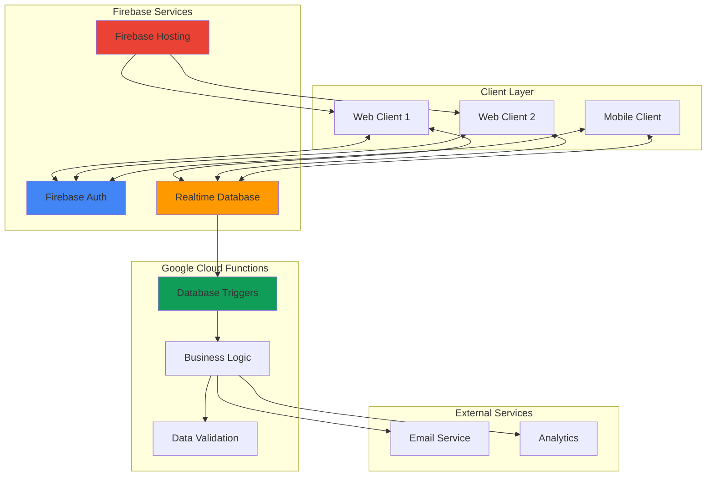

# Real-Time Collaborative Applications with Firebase Realtime Database and Cloud Functions

## Problem

Modern applications require real-time collaboration features where multiple users can interact simultaneously and see instant updates without page refreshes. Traditional REST APIs and polling mechanisms create latency issues, poor user experience, and unnecessary server load. Organizations need a seamless way to build collaborative features like live document editing, real-time chat, collaborative whiteboards, or multi-user dashboards without managing complex WebSocket infrastructure or handling data synchronization conflicts.

## Solution

Firebase Realtime Database provides automatic data synchronization across all connected clients in milliseconds, while Cloud Functions enables serverless business logic execution triggered by database events. This architecture combines real-time data sync with secure authentication and automated server-side processing to create responsive collaborative applications that scale automatically and maintain data consistency across all users.

## Architecture Diagram



## Prerequisites

1. Google Cloud Project with Firebase enabled
2. Firebase CLI installed and configured
3. Node.js 18+ and npm installed
4. Basic knowledge of JavaScript and Firebase concepts
5. Understanding of real-time data synchronization principles
6. Estimated cost: $0-5/month for development (Firebase Spark plan includes generous free tier)

> **Note**: Firebase Realtime Database is included in the free Spark plan with 1GB storage and 100 concurrent connections, perfect for development and small applications.

## Preparation

```bash
# Install Firebase CLI globally
npm install -g firebase-tools

# Authenticate with Firebase
firebase login

# Set environment variables
export PROJECT_ID="collab-app-$(date +%s)"
export REGION="us-central1"

# Create new Firebase project
firebase projects:create ${PROJECT_ID} \
    --display-name "Collaborative App"

# Set default project
firebase use ${PROJECT_ID}

# Initialize Firebase project structure
firebase init

# Select these options when prompted:
# - Functions (configure Cloud Functions)
# - Database (configure Realtime Database)
# - Hosting (configure static hosting)
# - Authentication (configure user auth)

echo "✅ Firebase project initialized: ${PROJECT_ID}"

# Create project structure
mkdir -p public/{js,css}
mkdir -p functions/lib
```

## Steps

1. **Configure Firebase Authentication for User Management**:

   Firebase Authentication provides secure user management with multiple sign-in methods including email/password, Google, and social providers. Setting up authentication first establishes the foundation for securing real-time data access and implementing user-specific collaborative features.

   ```bash
   # Enable Authentication providers via Firebase console API
   gcloud services enable identitytoolkit.googleapis.com \
       --project=${PROJECT_ID}

   # Create authentication configuration file
   cat > auth-providers.json << 'EOF'
   {
     "signIn": {
       "email": {
         "enabled": true,
         "passwordRequired": true
       },
       "googleProvider": {
         "enabled": true
       }
     }
   }
   EOF

   # Configure authentication via gcloud
   gcloud alpha identity providers describe \
       --project=${PROJECT_ID} || \
       gcloud alpha identity providers create email \
       --project=${PROJECT_ID}

   echo "✅ Authentication providers configured"
   ```

   Authentication is now enabled with email/password and Google sign-in options. This provides secure user identification required for collaborative applications where user actions need to be tracked and attributed correctly.

2. **Initialize Realtime Database with Security Rules**:

   Firebase Realtime Database stores data as JSON and synchronizes it in real-time across all connected clients. Proper security rules ensure that users can only access and modify data they're authorized to change, which is crucial for collaborative applications.

   ```bash
   # Create database security rules
   cat > database.rules.json << 'EOF'
   {
     "rules": {
       "documents": {
         "$documentId": {
           ".read": "auth != null && (auth.uid in data.collaborators || data.owner == auth.uid)",
           ".write": "auth != null && (auth.uid in data.collaborators || data.owner == auth.uid)",
           "content": {
             ".validate": "newData.isString() && newData.val().length <= 10000"
           },
           "lastModified": {
             ".write": "auth != null"
           },
           "collaborators": {
             "$uid": {
               ".write": "auth != null && (auth.uid == $uid || data.parent().parent().child('owner').val() == auth.uid)"
             }
           }
         }
       },
       "users": {
         "$uid": {
           ".read": "auth != null && auth.uid == $uid",
           ".write": "auth != null && auth.uid == $uid"
         }
       }
     }
   }
   EOF

   # Deploy security rules
   firebase deploy --only database

   echo "✅ Database security rules deployed"
   ```

   The security rules now protect collaborative documents by ensuring only authenticated users who are owners or collaborators can read and write data. This creates a secure foundation for multi-user collaboration.

3. **Create Cloud Functions for Document Management**:

   Cloud Functions provide serverless backend logic that responds to database events automatically. These functions handle document creation, user management, and business logic without requiring a dedicated server infrastructure.

   ```bash
   # Create main functions file
   cat > functions/index.js << 'EOF'
   const {onCall, onRequest, HttpsError} = require('firebase-functions/v2/https');
   const {onValueWritten} = require('firebase-functions/v2/database');
   const admin = require('firebase-admin');
   const {setGlobalOptions} = require('firebase-functions/v2');

   // Initialize Firebase Admin SDK
   admin.initializeApp();

   // Set global options
   setGlobalOptions({region: 'us-central1'});

   // Create new collaborative document
   exports.createDocument = onCall(async (request) => {
     if (!request.auth) {
       throw new HttpsError('unauthenticated', 'User must be authenticated');
     }

     const {title, initialContent = ''} = request.data;
     
     if (!title || title.trim().length === 0) {
       throw new HttpsError('invalid-argument', 'Document title is required');
     }

     const documentId = admin.database().ref().push().key;
     const documentData = {
       title: title.trim(),
       content: initialContent,
       owner: request.auth.uid,
       collaborators: {
         [request.auth.uid]: {
           role: 'owner',
           joinedAt: admin.database.ServerValue.TIMESTAMP
         }
       },
       createdAt: admin.database.ServerValue.TIMESTAMP,
       lastModified: admin.database.ServerValue.TIMESTAMP,
       version: 1
     };

     try {
       await admin.database()
         .ref(`documents/${documentId}`)
         .set(documentData);
       
       return { documentId, title };
     } catch (error) {
       throw new HttpsError('internal', 'Failed to create document');
     }
   });

   // Add collaborator to document
   exports.addCollaborator = onCall(async (request) => {
     if (!request.auth) {
       throw new HttpsError('unauthenticated', 'User must be authenticated');
     }

     const {documentId, collaboratorEmail} = request.data;
     
     if (!documentId || !collaboratorEmail) {
       throw new HttpsError('invalid-argument', 'Document ID and collaborator email required');
     }

     try {
       // Check if user is owner
       const docSnapshot = await admin.database()
         .ref(`documents/${documentId}`)
         .once('value');
       
       const document = docSnapshot.val();
       if (!document || document.owner !== request.auth.uid) {
         throw new HttpsError('permission-denied', 'Only document owner can add collaborators');
       }

       // Find user by email
       const userRecord = await admin.auth().getUserByEmail(collaboratorEmail);
       
       // Add collaborator
       await admin.database()
         .ref(`documents/${documentId}/collaborators/${userRecord.uid}`)
         .set({
           role: 'collaborator',
           joinedAt: admin.database.ServerValue.TIMESTAMP
         });

       return { success: true, userId: userRecord.uid };
     } catch (error) {
       if (error.code === 'auth/user-not-found') {
         throw new HttpsError('not-found', 'User not found');
       }
       throw new HttpsError('internal', 'Failed to add collaborator');
     }
   });

   // Track document changes for analytics
   exports.trackDocumentChange = onValueWritten(
     {ref: '/documents/{documentId}/content'},
     async (event) => {
       const documentId = event.params.documentId;
       const beforeData = event.data.before?.val();
       const afterData = event.data.after?.val();

       if (beforeData !== afterData) {
         // Update last modified timestamp
         await admin.database()
           .ref(`documents/${documentId}/lastModified`)
           .set(admin.database.ServerValue.TIMESTAMP);

         // Increment version
         const versionRef = admin.database().ref(`documents/${documentId}/version`);
         await versionRef.transaction((currentVersion) => {
           return (currentVersion || 0) + 1;
         });

         console.log(`Document ${documentId} modified`);
       }
     }
   );

   // Get user's documents
   exports.getUserDocuments = onCall(async (request) => {
     if (!request.auth) {
       throw new HttpsError('unauthenticated', 'User must be authenticated');
     }

     try {
       const snapshot = await admin.database()
         .ref('documents')
         .orderByChild(`collaborators/${request.auth.uid}`)
         .once('value');

       const documents = [];
       snapshot.forEach((child) => {
         const doc = child.val();
         documents.push({
           id: child.key,
           title: doc.title,
           lastModified: doc.lastModified,
           role: doc.collaborators[request.auth.uid]?.role || 'viewer'
         });
       });

       return { documents };
     } catch (error) {
       throw new HttpsError('internal', 'Failed to fetch documents');
     }
   });
   EOF

   # Install dependencies
   cd functions
   npm install firebase-admin firebase-functions

   # Deploy functions
   cd ..
   firebase deploy --only functions

   echo "✅ Cloud Functions deployed successfully"
   ```

   The Cloud Functions are now deployed and provide server-side logic for document management, user collaboration, and automatic change tracking. These functions handle business logic securely on the server while maintaining real-time synchronization.

4. **Build the Frontend Application with Real-Time Sync**:

   The frontend application connects to Firebase services and implements real-time collaboration features. This includes user authentication, live document editing, and synchronized changes across all connected clients.

   ```bash
   # Create main HTML file
   cat > public/index.html << 'EOF'
   <!DOCTYPE html>
   <html lang="en">
   <head>
       <meta charset="UTF-8">
       <meta name="viewport" content="width=device-width, initial-scale=1.0">
       <title>Collaborative Document Editor</title>
       <link rel="stylesheet" href="css/style.css">
   </head>
   <body>
       <div id="app">
           <header>
               <h1>Collaborative Editor</h1>
               <div id="user-info" style="display: none;">
                   <span id="user-email"></span>
                   <button id="logout-btn">Logout</button>
               </div>
           </header>

           <!-- Authentication Form -->
           <div id="auth-container">
               <h2>Sign In</h2>
               <form id="auth-form">
                   <input type="email" id="email" placeholder="Email" required>
                   <input type="password" id="password" placeholder="Password" required>
                   <button type="submit" id="signin-btn">Sign In</button>
                   <button type="button" id="signup-btn">Sign Up</button>
               </form>
           </div>

           <!-- Document List -->
           <div id="documents-container" style="display: none;">
               <div class="documents-header">
                   <h2>Your Documents</h2>
                   <button id="create-doc-btn">Create New Document</button>
               </div>
               <div id="documents-list"></div>
           </div>

           <!-- Document Editor -->
           <div id="editor-container" style="display: none;">
               <div class="editor-header">
                   <input type="text" id="document-title" placeholder="Document Title">
                   <div class="collaborators">
                       <span>Collaborators:</span>
                       <div id="collaborators-list"></div>
                       <button id="add-collaborator-btn">Add Collaborator</button>
                   </div>
                   <button id="back-to-documents">Back to Documents</button>
               </div>
               <textarea id="document-content" placeholder="Start typing..."></textarea>
               <div class="editor-status">
                   <span id="save-status">Saved</span>
                   <span id="collaborator-count">1 user online</span>
               </div>
           </div>
       </div>

       <!-- Firebase SDKs - Latest stable version -->
       <script src="https://www.gstatic.com/firebasejs/11.9.1/firebase-app-compat.js"></script>
       <script src="https://www.gstatic.com/firebasejs/11.9.1/firebase-auth-compat.js"></script>
       <script src="https://www.gstatic.com/firebasejs/11.9.1/firebase-database-compat.js"></script>
       <script src="https://www.gstatic.com/firebasejs/11.9.1/firebase-functions-compat.js"></script>
       <script src="js/app.js"></script>
   </body>
   </html>
   EOF

   echo "✅ HTML structure created"
   ```

   The HTML structure provides a complete interface for authentication, document management, and collaborative editing with proper element organization for real-time updates and uses the latest Firebase SDK version.

5. **Implement JavaScript Application Logic**:

   The JavaScript code handles Firebase initialization, user authentication, real-time database connections, and collaborative editing features. This creates the interactive experience that synchronizes changes across all connected users.

   ```bash
   # Create Firebase configuration and app logic
   cat > public/js/app.js << 'EOF'
   // Firebase configuration - automatically generated
   const firebaseConfig = {
     apiKey: "auto-generated-by-firebase-init",
     authDomain: `${location.hostname.split('.')[0]}.firebaseapp.com`,
     databaseURL: `https://${location.hostname.split('.')[0]}-default-rtdb.firebaseio.com/`,
     projectId: location.hostname.split('.')[0],
     storageBucket: `${location.hostname.split('.')[0]}.appspot.com`,
     messagingSenderId: "auto-generated",
     appId: "auto-generated"
   };

   // Initialize Firebase
   firebase.initializeApp(firebaseConfig);
   const auth = firebase.auth();
   const database = firebase.database();
   const functions = firebase.functions();

   // Global variables
   let currentUser = null;
   let currentDocument = null;
   let documentRef = null;
   let isUpdating = false;

   // UI elements
   const authContainer = document.getElementById('auth-container');
   const documentsContainer = document.getElementById('documents-container');
   const editorContainer = document.getElementById('editor-container');
   const userInfo = document.getElementById('user-info');
   const userEmail = document.getElementById('user-email');

   // Authentication state observer
   auth.onAuthStateChanged((user) => {
     if (user) {
       currentUser = user;
       userEmail.textContent = user.email;
       showDocuments();
     } else {
       currentUser = null;
       showAuth();
     }
   });

   // Authentication functions
   document.getElementById('auth-form').addEventListener('submit', async (e) => {
     e.preventDefault();
     const email = document.getElementById('email').value;
     const password = document.getElementById('password').value;

     try {
       await auth.signInWithEmailAndPassword(email, password);
     } catch (error) {
       console.error('Sign in error:', error);
       alert('Sign in failed: ' + error.message);
     }
   });

   document.getElementById('signup-btn').addEventListener('click', async () => {
     const email = document.getElementById('email').value;
     const password = document.getElementById('password').value;

     try {
       await auth.createUserWithEmailAndPassword(email, password);
     } catch (error) {
       console.error('Sign up error:', error);
       alert('Sign up failed: ' + error.message);
     }
   });

   document.getElementById('logout-btn').addEventListener('click', () => {
     auth.signOut();
   });

   // Document management
   document.getElementById('create-doc-btn').addEventListener('click', async () => {
     const title = prompt('Document title:');
     if (!title) return;

     try {
       const createDocument = functions.httpsCallable('createDocument');
       const result = await createDocument({ title });
       loadDocuments();
       openDocument(result.data.documentId);
     } catch (error) {
       console.error('Create document error:', error);
       alert('Failed to create document: ' + error.message);
     }
   });

   document.getElementById('back-to-documents').addEventListener('click', () => {
     if (documentRef) {
       documentRef.off();
       documentRef = null;
     }
     currentDocument = null;
     showDocuments();
   });

   // Real-time document editing
   const documentContent = document.getElementById('document-content');
   let debounceTimer;

   documentContent.addEventListener('input', () => {
     if (isUpdating) return;

     clearTimeout(debounceTimer);
     document.getElementById('save-status').textContent = 'Saving...';
     
     debounceTimer = setTimeout(() => {
       if (documentRef) {
         documentRef.child('content').set(documentContent.value);
       }
     }, 500);
   });

   // UI state management
   function showAuth() {
     authContainer.style.display = 'block';
     documentsContainer.style.display = 'none';
     editorContainer.style.display = 'none';
     userInfo.style.display = 'none';
   }

   function showDocuments() {
     authContainer.style.display = 'none';
     documentsContainer.style.display = 'block';
     editorContainer.style.display = 'none';
     userInfo.style.display = 'flex';
     loadDocuments();
   }

   function showEditor() {
     authContainer.style.display = 'none';
     documentsContainer.style.display = 'none';
     editorContainer.style.display = 'block';
     userInfo.style.display = 'flex';
   }

   // Load user documents
   async function loadDocuments() {
     try {
       const getUserDocuments = functions.httpsCallable('getUserDocuments');
       const result = await getUserDocuments();
       
       const documentsList = document.getElementById('documents-list');
       documentsList.innerHTML = '';

       result.data.documents.forEach(doc => {
         const docElement = document.createElement('div');
         docElement.className = 'document-item';
         docElement.innerHTML = `
           <h3>${doc.title}</h3>
           <p>Role: ${doc.role}</p>
           <p>Last modified: ${new Date(doc.lastModified).toLocaleString()}</p>
         `;
         docElement.addEventListener('click', () => openDocument(doc.id));
         documentsList.appendChild(docElement);
       });
     } catch (error) {
       console.error('Load documents error:', error);
     }
   }

   // Open document for editing
   function openDocument(documentId) {
     currentDocument = documentId;
     documentRef = database.ref(`documents/${documentId}`);
     
     // Listen for real-time changes
     documentRef.on('value', (snapshot) => {
       const doc = snapshot.val();
       if (!doc) return;

       isUpdating = true;
       document.getElementById('document-title').value = doc.title;
       document.getElementById('document-content').value = doc.content || '';
       document.getElementById('save-status').textContent = 'Saved';
       
       // Update collaborators list
       const collaboratorsList = document.getElementById('collaborators-list');
       collaboratorsList.innerHTML = '';
       Object.keys(doc.collaborators || {}).forEach(uid => {
         const span = document.createElement('span');
         span.textContent = doc.collaborators[uid].role;
         collaboratorsList.appendChild(span);
       });
       
       isUpdating = false;
     });

     showEditor();
   }

   // Add collaborator
   document.getElementById('add-collaborator-btn').addEventListener('click', async () => {
     const email = prompt('Collaborator email:');
     if (!email || !currentDocument) return;

     try {
       const addCollaborator = functions.httpsCallable('addCollaborator');
       await addCollaborator({ 
         documentId: currentDocument, 
         collaboratorEmail: email 
       });
       alert('Collaborator added successfully!');
     } catch (error) {
       console.error('Add collaborator error:', error);
       alert('Failed to add collaborator: ' + error.message);
     }
   });
   EOF

   echo "✅ JavaScript application logic created"
   ```

   The JavaScript application now provides complete real-time collaboration functionality with user authentication, document management, and synchronized editing across multiple clients using improved Firebase configuration.

6. **Add CSS Styling for Professional Appearance**:

   Professional styling enhances user experience and provides visual feedback for collaborative features like real-time status indicators and user presence.

   ```bash
   # Create CSS styles
   cat > public/css/style.css << 'EOF'
   * {
       margin: 0;
       padding: 0;
       box-sizing: border-box;
   }

   body {
       font-family: -apple-system, BlinkMacSystemFont, 'Segoe UI', Roboto, sans-serif;
       background-color: #f5f5f5;
       color: #333;
   }

   header {
       background: #4285F4;
       color: white;
       padding: 1rem 2rem;
       display: flex;
       justify-content: space-between;
       align-items: center;
   }

   #user-info {
       display: flex;
       align-items: center;
       gap: 1rem;
   }

   #auth-container {
       max-width: 400px;
       margin: 4rem auto;
       padding: 2rem;
       background: white;
       border-radius: 8px;
       box-shadow: 0 2px 10px rgba(0,0,0,0.1);
   }

   #auth-form {
       display: flex;
       flex-direction: column;
       gap: 1rem;
   }

   input, button, textarea {
       padding: 0.75rem;
       border: 1px solid #ddd;
       border-radius: 4px;
       font-size: 1rem;
   }

   button {
       background: #4285F4;
       color: white;
       border: none;
       cursor: pointer;
       transition: background 0.2s;
   }

   button:hover {
       background: #3367D6;
   }

   #documents-container {
       max-width: 800px;
       margin: 2rem auto;
       padding: 0 2rem;
   }

   .documents-header {
       display: flex;
       justify-content: space-between;
       align-items: center;
       margin-bottom: 2rem;
   }

   .document-item {
       background: white;
       padding: 1.5rem;
       margin-bottom: 1rem;
       border-radius: 8px;
       box-shadow: 0 2px 4px rgba(0,0,0,0.1);
       cursor: pointer;
       transition: transform 0.2s, box-shadow 0.2s;
   }

   .document-item:hover {
       transform: translateY(-2px);
       box-shadow: 0 4px 12px rgba(0,0,0,0.15);
   }

   #editor-container {
       max-width: 1000px;
       margin: 2rem auto;
       padding: 0 2rem;
   }

   .editor-header {
       background: white;
       padding: 1rem;
       border-radius: 8px 8px 0 0;
       display: flex;
       align-items: center;
       gap: 1rem;
       box-shadow: 0 2px 4px rgba(0,0,0,0.1);
   }

   #document-title {
       flex: 1;
       font-size: 1.2rem;
       font-weight: bold;
   }

   .collaborators {
       display: flex;
       align-items: center;
       gap: 0.5rem;
   }

   #collaborators-list {
       display: flex;
       gap: 0.5rem;
   }

   #collaborators-list span {
       background: #E8F0FE;
       color: #1967D2;
       padding: 0.25rem 0.5rem;
       border-radius: 12px;
       font-size: 0.8rem;
   }

   #document-content {
       width: 100%;
       height: 500px;
       border: none;
       border-radius: 0 0 8px 8px;
       padding: 2rem;
       font-size: 1rem;
       line-height: 1.6;
       resize: vertical;
       background: white;
       box-shadow: 0 2px 4px rgba(0,0,0,0.1);
   }

   .editor-status {
       display: flex;
       justify-content: space-between;
       padding: 0.5rem 1rem;
       background: #f8f9fa;
       border-radius: 0 0 8px 8px;
       font-size: 0.9rem;
       color: #666;
   }

   #save-status {
       color: #0F9D58;
   }

   @media (max-width: 768px) {
       .editor-header {
           flex-direction: column;
           align-items: stretch;
           gap: 0.5rem;
       }
       
       .collaborators {
           justify-content: space-between;
       }
   }
   EOF

   echo "✅ CSS styling applied"
   ```

   The application now has a professional appearance with responsive design, visual feedback for real-time operations, and clear interface hierarchy for collaborative features.

7. **Configure Firebase Hosting and Deploy**:

   Firebase Hosting provides fast, secure hosting for the collaborative application with global CDN distribution and automatic SSL certificates.

   ```bash
   # Configure Firebase Hosting
   cat > firebase.json << 'EOF'
   {
     "hosting": {
       "public": "public",
       "ignore": [
         "firebase.json",
         "**/.*",
         "**/node_modules/**"
       ],
       "rewrites": [
         {
           "source": "**",
           "destination": "/index.html"
         }
       ],
       "headers": [
         {
           "source": "**/*.@(js|css)",
           "headers": [
             {
               "key": "Cache-Control",
               "value": "max-age=31536000"
             }
           ]
         }
       ]
     },
     "database": {
       "rules": "database.rules.json"
     },
     "functions": {
       "source": "functions"
     }
   }
   EOF

   # Deploy everything
   firebase deploy

   echo "✅ Application deployed to Firebase Hosting"
   echo "🌐 Access your app at: https://${PROJECT_ID}.web.app"
   ```

   The collaborative application is now deployed and accessible globally with automatic scaling, SSL security, and real-time synchronization capabilities.

## Validation & Testing

1. **Verify Authentication System**:

   ```bash
   # Test project configuration
   firebase projects:list --format="table(projectId,displayName)"
   
   # Verify authentication configuration
   gcloud alpha identity providers list --project=${PROJECT_ID}
   ```

   Expected output: Project information and enabled authentication providers.

2. **Test Real-time Database Connection**:

   ```bash
   # Check database rules deployment
   firebase database:get / --project ${PROJECT_ID}
   
   # Test database connectivity
   firebase database:test --project ${PROJECT_ID}
   ```

   Expected output: Database content and successful security rules validation.

3. **Test Cloud Functions Deployment**:

   ```bash
   # List deployed functions
   firebase functions:list --project ${PROJECT_ID}
   
   # Test function logs
   firebase functions:log --project ${PROJECT_ID}
   ```

   Expected output: List of deployed functions and their execution logs.

4. **Validate Real-time Collaboration**:

   Open the application in multiple browser windows/tabs and test:
   - User registration and login
   - Document creation and sharing  
   - Real-time text synchronization
   - Collaborator management
   - Automatic save functionality

> **Tip**: Use browser developer tools Network tab to monitor WebSocket connections and real-time data synchronization events.

## Cleanup

1. **Remove Cloud Functions**:

   ```bash
   # Delete all functions
   firebase functions:delete createDocument \
       --project ${PROJECT_ID} --force
   firebase functions:delete addCollaborator \
       --project ${PROJECT_ID} --force
   firebase functions:delete trackDocumentChange \
       --project ${PROJECT_ID} --force
   firebase functions:delete getUserDocuments \
       --project ${PROJECT_ID} --force
   
   echo "✅ Cloud Functions deleted"
   ```

2. **Clear Realtime Database**:

   ```bash
   # Remove all database data
   firebase database:remove / --project ${PROJECT_ID}
   
   echo "✅ Database data cleared"
   ```

3. **Delete Firebase Project**:

   ```bash
   # Delete entire project (this removes all resources)
   firebase projects:delete ${PROJECT_ID}
   
   echo "✅ Firebase project deleted"
   
   # Clean up local files
   rm -rf functions/node_modules
   rm -rf .firebase
   rm -f database.rules.json
   rm -f auth-providers.json
   ```

## Discussion

This recipe demonstrates building a production-ready collaborative application using Firebase's real-time capabilities and serverless architecture. Firebase Realtime Database provides automatic data synchronization with offline support, while Cloud Functions handle server-side business logic and security validation. The combination creates a scalable solution that can support thousands of concurrent users without managing server infrastructure.

The architecture implements several key collaborative application patterns: real-time data synchronization ensures all users see changes immediately, server-side validation maintains data integrity, and role-based access control secures collaborative features. Firebase's automatic scaling handles traffic spikes, while the NoSQL document structure supports flexible content types and rapid development iterations.

Security considerations include comprehensive database rules that restrict access based on user authentication and document ownership, Cloud Functions that validate all operations server-side, and Firebase Auth integration that provides secure user management. The client-side implementation includes proper error handling, optimistic updates for responsive UI, and connection state management for offline scenarios.

Performance optimizations include debounced input handling to reduce database writes, selective data synchronization to minimize bandwidth usage, and efficient database queries using Firebase's real-time listeners. The hosting configuration implements proper caching headers and content delivery optimization for global performance.

For comprehensive documentation on Firebase real-time capabilities, see the [Firebase Realtime Database Guide](https://firebase.google.com/docs/database). Additional patterns and best practices are covered in the [Firebase Architecture Patterns](https://firebase.google.com/docs/database/web/structure-data) documentation. Security implementation details can be found in the [Firebase Security Rules Guide](https://firebase.google.com/docs/database/security). For Cloud Functions integration patterns, reference the [Firebase Functions Documentation](https://firebase.google.com/docs/functions). Production deployment considerations are detailed in the [Firebase Hosting Best Practices](https://firebase.google.com/docs/hosting/full-config) guide.

> **Note**: Firebase Realtime Database is optimized for real-time applications but consider Cloud Firestore for applications requiring complex queries, better scalability, or multi-region deployment capabilities.

## Challenge

Extend this collaborative application by implementing these advanced features:

1. **Version History and Document Recovery**: Implement automatic version saving using Cloud Functions triggers and provide UI for browsing and restoring previous document versions with conflict resolution for concurrent edits using Firebase's transaction capabilities.

2. **Rich Text Editing with Operational Transform**: Replace the basic textarea with a rich text editor like Quill.js and implement operational transform algorithms to handle concurrent formatting changes and maintain consistency across all clients using Firebase's real-time synchronization.

3. **Real-time Presence and Cursor Tracking**: Add user presence indicators showing who is currently viewing/editing the document using Firebase's connection state monitoring, implement real-time cursor position tracking, and display collaborator cursors with user identification.

4. **Advanced Permission Management**: Create granular permission system with roles like viewer, commenter, editor, and admin using Cloud Functions for validation, implement document sharing via secure links with configurable permissions, and add organizational team management with inheritance permissions.

5. **Performance Optimization and Monitoring**: Implement differential sync to only transmit document changes rather than full content using Firebase's patch operations, add Cloud Monitoring integration for real-time collaboration metrics, and create automated performance testing for concurrent user scenarios.

## Infrastructure Code

*Infrastructure code will be generated after recipe approval.*