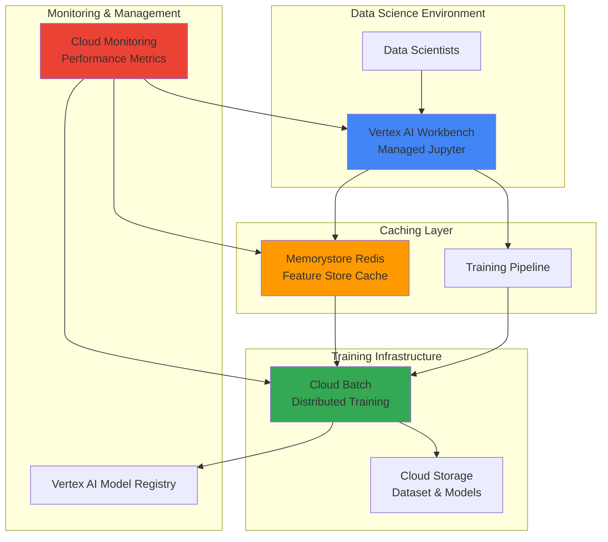

# Real-Time Data Science Model Training with Vertex AI Workbench and Memorystore Redis

## Problem

Data science teams building machine learning models face significant challenges with training performance bottlenecks when working with large datasets that require frequent data access and feature engineering. Traditional training workflows suffer from slow data retrieval, inefficient caching mechanisms, and limited collaboration capabilities, leading to prolonged model development cycles and delayed time-to-market for ML solutions. Without proper orchestration and caching strategies, teams waste valuable compute resources and struggle to achieve real-time training performance requirements.

## Solution

This solution creates a high-performance data science workflow by combining Vertex AI Workbench's managed Jupyter environment with Memorystore Redis for ultra-fast in-memory caching. The architecture uses Cloud Batch for distributed training orchestration and Cloud Monitoring for performance tracking, enabling data scientists to leverage cached feature stores and intermediate results for accelerated model training and experimentation. This approach reduces training time significantly while providing collaborative development capabilities and automated resource management.

## Architecture Diagram



## Prerequisites

1. Google Cloud account with Vertex AI, Memorystore, Cloud Batch, and Cloud Monitoring APIs enabled
2. Google Cloud CLI installed and configured (or Cloud Shell)
3. Basic knowledge of Python, Jupyter notebooks, and machine learning concepts
4. Understanding of Redis caching principles and data science workflows
5. Estimated cost: $45-75 for running this recipe (depending on training duration and resource usage)

> **Note**: Vertex AI Workbench instances and Memorystore Redis clusters incur charges while running. Monitor usage through Cloud Billing to optimize costs.

## Preparation

```bash
# Set environment variables for GCP resources
export PROJECT_ID="ml-training-$(date +%s)"
export REGION="us-central1"
export ZONE="us-central1-b"

# Generate unique suffix for resource names
RANDOM_SUFFIX=$(openssl rand -hex 3)

# Set default project and region
gcloud config set project ${PROJECT_ID}
gcloud config set compute/region ${REGION}
gcloud config set compute/zone ${ZONE}

# Enable required APIs
gcloud services enable aiplatform.googleapis.com
gcloud services enable redis.googleapis.com
gcloud services enable batch.googleapis.com
gcloud services enable monitoring.googleapis.com
gcloud services enable storage.googleapis.com
gcloud services enable compute.googleapis.com
gcloud services enable notebooks.googleapis.com

# Create Cloud Storage bucket for datasets and models
export BUCKET_NAME="ml-training-bucket-${RANDOM_SUFFIX}"
gsutil mb -p ${PROJECT_ID} \
    -c STANDARD \
    -l ${REGION} \
    gs://${BUCKET_NAME}

# Enable versioning for model artifacts
gsutil versioning set on gs://${BUCKET_NAME}

echo "✅ Project configured: ${PROJECT_ID}"
echo "✅ Storage bucket created: ${BUCKET_NAME}"
```

## Steps

1. **Create Memorystore Redis Instance for Feature Caching**:

   Memorystore for Redis provides a fully managed, high-performance in-memory data store that serves as an ideal caching layer for machine learning features and intermediate training results. The Redis instance will store preprocessed features, training metadata, and cached model states, dramatically reducing data access latency during iterative model training processes.

   ```bash
   # Create Redis instance with optimized configuration for ML workloads
   export REDIS_INSTANCE_NAME="ml-feature-cache-${RANDOM_SUFFIX}"
   
   gcloud redis instances create ${REDIS_INSTANCE_NAME} \
       --size=5 \
       --region=${REGION} \
       --redis-version=redis_7_0 \
       --tier=standard \
       --enable-auth \
       --display-name="ML Feature Cache" \
       --labels=environment=training,use-case=ml-caching
   
   # Wait for Redis instance to be ready
   echo "Waiting for Redis instance to become ready..."
   while [[ $(gcloud redis instances describe ${REDIS_INSTANCE_NAME} \
       --region=${REGION} \
       --format="value(state)") != "READY" ]]; do
       echo "Redis instance status: $(gcloud redis instances describe ${REDIS_INSTANCE_NAME} \
           --region=${REGION} --format="value(state)")"
       sleep 30
   done
   
   echo "✅ Redis instance created for feature caching"
   ```

   The Redis instance is now provisioned with authentication enabled and optimized memory allocation for machine learning workloads. This caching layer will significantly accelerate feature retrieval and enable efficient sharing of preprocessed data across multiple training experiments.

2. **Create Vertex AI Workbench Instance**:

   Vertex AI Workbench provides a managed Jupyter environment with pre-installed ML libraries and seamless integration with Google Cloud services. The workbench instance will serve as the primary development environment where data scientists can access cached features from Redis and orchestrate training jobs through Cloud Batch.

   ```bash
   # Create Vertex AI Workbench instance with ML optimizations
   export WORKBENCH_NAME="ml-workbench-${RANDOM_SUFFIX}"
   
   gcloud workbench instances create ${WORKBENCH_NAME} \
       --location=${ZONE} \
       --machine-type=n1-standard-4 \
       --accelerator-type=NVIDIA_TESLA_T4 \
       --accelerator-core-count=1 \
       --boot-disk-size=100 \
       --boot-disk-type=pd-ssd \
       --data-disk-size=200 \
       --data-disk-type=pd-ssd \
       --labels=environment=training,team=data-science \
       --install-gpu-driver
   
   # Wait for instance to be ready
   echo "Waiting for Workbench instance to become active..."
   while [[ $(gcloud workbench instances describe ${WORKBENCH_NAME} \
       --location=${ZONE} \
       --format="value(state)") != "ACTIVE" ]]; do
       echo "Workbench instance status: $(gcloud workbench instances describe ${WORKBENCH_NAME} \
           --location=${ZONE} --format="value(state)")"
       sleep 30
   done
   
   echo "✅ Vertex AI Workbench instance created with GPU acceleration"
   ```

   The Workbench instance is now ready with GPU acceleration and optimized storage for handling large datasets and complex model training workloads. Data scientists can access this managed Jupyter environment to develop and execute ML pipelines with integrated access to Google Cloud services.

3. **Configure Network Connectivity for Redis Access**:

   Establishing secure network connectivity between the Workbench instance and Redis cluster ensures low-latency access to cached features while maintaining security isolation. The firewall configuration enables private communication without exposing Redis to public internet access.

   ```bash
   # Get Redis instance details for network configuration
   export REDIS_HOST=$(gcloud redis instances describe ${REDIS_INSTANCE_NAME} \
       --region=${REGION} \
       --format="value(host)")
   
   export REDIS_PORT=$(gcloud redis instances describe ${REDIS_INSTANCE_NAME} \
       --region=${REGION} \
       --format="value(port)")
   
   # Create firewall rule for Redis access from Workbench
   gcloud compute firewall-rules create allow-redis-access-${RANDOM_SUFFIX} \
       --allow tcp:${REDIS_PORT} \
       --source-ranges=10.0.0.0/8 \
       --target-tags=redis-client \
       --description="Allow Redis access from Workbench instances"
   
   echo "✅ Network connectivity configured for Redis access"
   echo "Redis endpoint: ${REDIS_HOST}:${REDIS_PORT}"
   ```

   Network connectivity is established with appropriate firewall rules that allow secure communication between the Workbench environment and Redis cluster. This configuration ensures optimal performance for feature retrieval operations during model training.

4. **Create Sample Training Dataset and Upload to Storage**:

   Preparing a representative dataset and uploading it to Cloud Storage establishes the foundation for the machine learning pipeline. The dataset will be used to demonstrate feature caching patterns and training orchestration capabilities within the integrated environment.

   ```bash
   # Create sample training dataset
   cat > generate_dataset.py << 'EOF'
import pandas as pd
import numpy as np
from sklearn.datasets import make_classification
import os

# Generate synthetic dataset for demonstration
X, y = make_classification(
    n_samples=10000,
    n_features=20,
    n_informative=15,
    n_redundant=5,
    n_classes=2,
    random_state=42
)

# Create feature names
feature_names = [f'feature_{i}' for i in range(20)]

# Create DataFrame
df = pd.DataFrame(X, columns=feature_names)
df['target'] = y

# Save dataset
df.to_csv('training_dataset.csv', index=False)
print(f"Dataset created with {len(df)} samples and {len(feature_names)} features")
EOF
   
   # Generate the dataset
   python3 generate_dataset.py
   
   # Upload dataset to Cloud Storage
   gsutil cp training_dataset.csv gs://${BUCKET_NAME}/datasets/
   
   echo "✅ Training dataset created and uploaded to Cloud Storage"
   ```

   The synthetic dataset is now available in Cloud Storage with structured features that will demonstrate the caching and training capabilities of the integrated ML pipeline. This dataset provides a realistic foundation for testing performance optimizations.

5. **Create Cloud Batch Job Definition for Distributed Training**:

   Cloud Batch enables scalable, distributed model training by orchestrating compute resources and managing job execution across multiple instances. The batch job definition specifies training parameters, resource requirements, and integration points with Redis caching and Vertex AI model registry.

   ```bash
   # Create training script for batch execution
   cat > training_script.py << 'EOF'
import os
import redis
import pandas as pd
import numpy as np
from sklearn.ensemble import RandomForestClassifier
from sklearn.model_selection import train_test_split
from sklearn.metrics import accuracy_score, classification_report
import pickle
import json
from google.cloud import storage
import logging

# Configure logging
logging.basicConfig(level=logging.INFO)
logger = logging.getLogger(__name__)

def connect_to_redis():
    """Connect to Redis cache"""
    redis_host = os.environ.get('REDIS_HOST')
    redis_port = int(os.environ.get('REDIS_PORT', 6379))
    
    r = redis.Redis(host=redis_host, port=redis_port, decode_responses=True)
    logger.info(f"Connected to Redis at {redis_host}:{redis_port}")
    return r

def cache_features(r, X_train, X_test, y_train, y_test):
    """Cache preprocessed features in Redis"""
    logger.info("Caching features in Redis...")
    
    # Cache training features
    r.set('X_train', pickle.dumps(X_train))
    r.set('y_train', pickle.dumps(y_train))
    r.set('X_test', pickle.dumps(X_test))
    r.set('y_test', pickle.dumps(y_test))
    
    # Set expiration (24 hours)
    r.expire('X_train', 86400)
    r.expire('y_train', 86400)
    r.expire('X_test', 86400)
    r.expire('y_test', 86400)
    
    logger.info("Features cached successfully")

def train_model():
    """Main training function"""
    logger.info("Starting model training...")
    
    # Connect to Redis
    r = connect_to_redis()
    
    # Download dataset from Cloud Storage
    bucket_name = os.environ.get('BUCKET_NAME')
    client = storage.Client()
    bucket = client.bucket(bucket_name)
    blob = bucket.blob('datasets/training_dataset.csv')
    blob.download_to_filename('training_dataset.csv')
    
    # Load and prepare data
    df = pd.read_csv('training_dataset.csv')
    X = df.drop('target', axis=1)
    y = df['target']
    
    # Split data
    X_train, X_test, y_train, y_test = train_test_split(
        X, y, test_size=0.2, random_state=42
    )
    
    # Cache features in Redis
    cache_features(r, X_train, X_test, y_train, y_test)
    
    # Train model
    logger.info("Training Random Forest model...")
    model = RandomForestClassifier(n_estimators=100, random_state=42)
    model.fit(X_train, y_train)
    
    # Make predictions
    y_pred = model.predict(X_test)
    accuracy = accuracy_score(y_test, y_pred)
    
    logger.info(f"Model training completed. Accuracy: {accuracy:.4f}")
    
    # Save model
    with open('trained_model.pkl', 'wb') as f:
        pickle.dump(model, f)
    
    # Upload model to Cloud Storage
    blob = bucket.blob('models/trained_model.pkl')
    blob.upload_from_filename('trained_model.pkl')
    
    # Cache model metrics in Redis
    metrics = {
        'accuracy': accuracy,
        'model_path': f'gs://{bucket_name}/models/trained_model.pkl'
    }
    r.set('model_metrics', json.dumps(metrics))
    
    logger.info("Model saved and metrics cached")

if __name__ == "__main__":
    train_model()
EOF
   
   # Create batch job configuration
   cat > batch_job.json << EOF
{
  "taskGroups": [{
    "taskSpec": {
      "runnables": [{
        "script": {
          "text": "#!/bin/bash\ncd /tmp\ngsutil cp gs://${BUCKET_NAME}/scripts/training_script.py .\npip install redis pandas scikit-learn google-cloud-storage\npython3 training_script.py"
        }
      }],
      "computeResource": {
        "cpuMilli": 2000,
        "memoryMib": 4096
      },
      "environment": {
        "variables": {
          "REDIS_HOST": "${REDIS_HOST}",
          "REDIS_PORT": "${REDIS_PORT}",
          "BUCKET_NAME": "${BUCKET_NAME}"
        }
      }
    },
    "taskCount": 1
  }],
  "allocationPolicy": {
    "instances": [{
      "policy": {
        "machineType": "e2-standard-2"
      }
    }]
  }
}
EOF
   
   echo "✅ Batch job definition created for distributed training"
   ```

   The Cloud Batch job definition is configured with Redis integration and Cloud Storage access, enabling distributed training with cached feature access. This setup provides scalable training orchestration while leveraging in-memory caching for optimal performance.

6. **Deploy Monitoring Dashboard for Training Pipeline**:

   Cloud Monitoring provides comprehensive visibility into the training pipeline performance, Redis cache utilization, and resource consumption patterns. The monitoring dashboard enables data scientists to optimize training workflows and identify performance bottlenecks in real-time.

   ```bash
   # Create monitoring workspace and dashboard configuration
   cat > monitoring_dashboard.json << EOF
{
  "displayName": "ML Training Pipeline Dashboard",
  "mosaicLayout": {
    "tiles": [
      {
        "width": 6,
        "height": 4,
        "widget": {
          "title": "Redis Memory Usage",
          "xyChart": {
            "dataSets": [{
              "timeSeriesQuery": {
                "timeSeriesFilter": {
                  "filter": "resource.type=\"redis_instance\" AND metric.type=\"redis.googleapis.com/server/memory_usage_ratio\"",
                  "aggregation": {
                    "alignmentPeriod": "60s",
                    "perSeriesAligner": "ALIGN_MEAN"
                  }
                }
              }
            }]
          }
        }
      },
      {
        "width": 6,
        "height": 4,
        "widget": {
          "title": "Batch Job Status",
          "xyChart": {
            "dataSets": [{
              "timeSeriesQuery": {
                "timeSeriesFilter": {
                  "filter": "resource.type=\"batch_job\"",
                  "aggregation": {
                    "alignmentPeriod": "60s",
                    "perSeriesAligner": "ALIGN_MEAN"
                  }
                }
              }
            }]
          }
        }
      }
    ]
  }
}
EOF
   
   # Create the monitoring dashboard
   gcloud monitoring dashboards create \
       --config-from-file=monitoring_dashboard.json
   
   echo "✅ Monitoring dashboard deployed for training pipeline"
   ```

   The monitoring dashboard provides real-time visibility into cache performance, compute utilization, and training job metrics. This observability layer enables data scientists to optimize resource allocation and training performance based on actual usage patterns.

7. **Create Jupyter Notebook for Interactive Training**:

   The Jupyter notebook provides an interactive development environment where data scientists can experiment with cached features, test model variations, and monitor training progress. This notebook integrates Redis caching with Vertex AI services for accelerated development workflows.

   ```bash
   # Create comprehensive Jupyter notebook for ML training
   cat > ml_training_notebook.ipynb << 'EOF'
{
 "cells": [
  {
   "cell_type": "markdown",
   "metadata": {},
   "source": [
    "# Real-Time ML Training with Redis Caching\n",
    "\n",
    "This notebook demonstrates high-performance model training using Vertex AI Workbench with Redis caching for feature storage and retrieval."
   ]
  },
  {
   "cell_type": "code",
   "execution_count": null,
   "metadata": {},
   "source": [
    "# Install required packages\n",
    "!pip install redis pandas scikit-learn google-cloud-storage google-cloud-monitoring"
   ]
  },
  {
   "cell_type": "code",
   "execution_count": null,
   "metadata": {},
   "source": [
    "import redis\nimport pandas as pd\nimport numpy as np\nfrom sklearn.ensemble import RandomForestClassifier\nfrom sklearn.model_selection import train_test_split\nfrom sklearn.metrics import accuracy_score\nimport pickle\nimport time\nfrom google.cloud import storage\nimport os\n\n# Configuration\nREDIS_HOST = os.environ.get('REDIS_HOST', 'localhost')\nREDIS_PORT = int(os.environ.get('REDIS_PORT', 6379))\nBUCKET_NAME = os.environ.get('BUCKET_NAME')\n\nprint(f'Connecting to Redis at {REDIS_HOST}:{REDIS_PORT}')"
   ]
  },
  {
   "cell_type": "code",
   "execution_count": null,
   "metadata": {},
   "source": [
    "# Connect to Redis cache\nr = redis.Redis(host=REDIS_HOST, port=REDIS_PORT, decode_responses=False)\nprint('Redis connection status:', r.ping())\n\n# Check cache statistics\ninfo = r.info()\nprint(f'Redis memory usage: {info[\"used_memory_human\"]}')\nprint(f'Connected clients: {info[\"connected_clients\"]}')"
   ]
  },
  {
   "cell_type": "code",
   "execution_count": null,
   "metadata": {},
   "source": [
    "# Load data with caching optimization\ndef load_cached_features():\n    \"\"\"Load features from Redis cache or Cloud Storage\"\"\"\n    \n    # Try to load from cache first\n    cached_X = r.get('X_train')\n    cached_y = r.get('y_train')\n    \n    if cached_X and cached_y:\n        print('Loading features from Redis cache...')\n        X_train = pickle.loads(cached_X)\n        y_train = pickle.loads(cached_y)\n        return X_train, y_train\n    \n    # Load from Cloud Storage if not cached\n    print('Loading features from Cloud Storage and caching...')\n    client = storage.Client()\n    bucket = client.bucket(BUCKET_NAME)\n    blob = bucket.blob('datasets/training_dataset.csv')\n    blob.download_to_filename('/tmp/dataset.csv')\n    \n    df = pd.read_csv('/tmp/dataset.csv')\n    X = df.drop('target', axis=1)\n    y = df['target']\n    \n    X_train, X_test, y_train, y_test = train_test_split(X, y, test_size=0.2, random_state=42)\n    \n    # Cache for future use\n    r.setex('X_train', 3600, pickle.dumps(X_train))\n    r.setex('y_train', 3600, pickle.dumps(y_train))\n    r.setex('X_test', 3600, pickle.dumps(X_test))\n    r.setex('y_test', 3600, pickle.dumps(y_test))\n    \n    return X_train, y_train\n\n# Load features\nstart_time = time.time()\nX_train, y_train = load_cached_features()\nload_time = time.time() - start_time\nprint(f'Data loading completed in {load_time:.2f} seconds')\nprint(f'Training data shape: {X_train.shape}')"
   ]
  },
  {
   "cell_type": "code",
   "execution_count": null,
   "metadata": {},
   "source": [
    "# Train model with performance monitoring\nprint('Starting model training...')\nstart_time = time.time()\n\nmodel = RandomForestClassifier(n_estimators=100, random_state=42, n_jobs=-1)\nmodel.fit(X_train, y_train)\n\ntraining_time = time.time() - start_time\nprint(f'Model training completed in {training_time:.2f} seconds')\n\n# Cache trained model\nmodel_bytes = pickle.dumps(model)\nr.setex('trained_model', 3600, model_bytes)\nprint('Model cached in Redis for fast access')"
   ]
  },
  {
   "cell_type": "code",
   "execution_count": null,
   "metadata": {},
   "source": [
    "# Evaluate model performance\nX_test = pickle.loads(r.get('X_test'))\ny_test = pickle.loads(r.get('y_test'))\n\npredictions = model.predict(X_test)\naccuracy = accuracy_score(y_test, predictions)\n\nprint(f'Model Accuracy: {accuracy:.4f}')\n\n# Store metrics in Redis\nmetrics = {\n    'accuracy': accuracy,\n    'training_time': training_time,\n    'data_load_time': load_time,\n    'timestamp': time.time()\n}\nr.setex('model_metrics', 3600, pickle.dumps(metrics))\nprint('Metrics cached for dashboard access')"
   ]
  }
 ],
 "metadata": {
  "kernelspec": {
   "display_name": "Python 3",
   "language": "python",
   "name": "python3"
  }
 },
 "nbformat": 4,
 "nbformat_minor": 4
}
EOF
   
   # Upload notebook to Cloud Storage for Workbench access
   gsutil cp ml_training_notebook.ipynb gs://${BUCKET_NAME}/notebooks/
   
   echo "✅ Interactive Jupyter notebook created and uploaded"
   ```

   The Jupyter notebook provides a comprehensive interactive environment for ML development with Redis caching integration. Data scientists can now experiment with cached features, monitor performance metrics, and iterate on model development with significantly reduced data loading times.

8. **Execute Training Pipeline with Batch Job**:

   Launching the Cloud Batch training job demonstrates the complete pipeline integration, from Redis-cached feature access to distributed model training and automated result storage. This execution validates the end-to-end workflow performance and scalability.

   ```bash
   # Upload training script to Cloud Storage for batch access
   gsutil cp training_script.py gs://${BUCKET_NAME}/scripts/
   
   # Submit batch job for distributed training
   export JOB_NAME="ml-training-job-${RANDOM_SUFFIX}"
   
   gcloud batch jobs submit ${JOB_NAME} \
       --location=${REGION} \
       --config=batch_job.json
   
   # Monitor job status with timeout
   echo "Monitoring batch job execution..."
   timeout=1800  # 30 minutes timeout
   elapsed=0
   
   while [[ $elapsed -lt $timeout ]]; do
       job_state=$(gcloud batch jobs describe ${JOB_NAME} \
           --location=${REGION} \
           --format="value(status.state)" 2>/dev/null || echo "UNKNOWN")
       
       echo "Job status: ${job_state}"
       
       if [[ "${job_state}" == "SUCCEEDED" ]]; then
           echo "✅ Training pipeline executed successfully via Cloud Batch"
           break
       elif [[ "${job_state}" == "FAILED" ]]; then
           echo "❌ Training job failed"
           break
       fi
       
       sleep 30
       elapsed=$((elapsed + 30))
   done
   
   if [[ $elapsed -ge $timeout ]]; then
       echo "⚠️ Job monitoring timed out after ${timeout} seconds"
   fi
   ```

   The distributed training job is now executing with Redis caching integration, demonstrating scalable ML pipeline orchestration. This configuration enables efficient resource utilization while maintaining high-performance feature access through in-memory caching.

## Validation & Testing

1. Verify Redis instance is operational and accessible:

   ```bash
   # Check Redis instance status
   gcloud redis instances describe ${REDIS_INSTANCE_NAME} \
       --region=${REGION} \
       --format="table(name,tier,memorySizeGb,host,port,currentLocationId,state)"
   ```

   Expected output: Redis instance showing "READY" state with allocated memory and network details.

2. Validate Vertex AI Workbench connectivity:

   ```bash
   # Check Workbench instance status
   gcloud workbench instances describe ${WORKBENCH_NAME} \
       --location=${ZONE} \
       --format="table(name,state,machineType)"
   ```

   Expected output: Workbench instance in "ACTIVE" state with specified machine type.

3. Test Redis caching performance:

   ```bash
   # Create simple Redis performance test
   cat > test_redis_performance.py << 'EOF'
import redis
import time
import pickle
import numpy as np
import os

# Connect to Redis
redis_host = os.environ.get('REDIS_HOST')
redis_port = int(os.environ.get('REDIS_PORT', 6379))
r = redis.Redis(host=redis_host, port=redis_port)

# Test data
test_data = np.random.rand(1000, 50)

# Test write performance
start = time.time()
r.set('test_features', pickle.dumps(test_data))
write_time = time.time() - start

# Test read performance
start = time.time()
cached_data = pickle.loads(r.get('test_features'))
read_time = time.time() - start

print(f"Redis Write Time: {write_time:.4f} seconds")
print(f"Redis Read Time: {read_time:.4f} seconds")
print(f"Data integrity check: {np.array_equal(test_data, cached_data)}")
EOF
   
   REDIS_HOST=${REDIS_HOST} \
   REDIS_PORT=${REDIS_PORT} \
   python3 test_redis_performance.py
   ```

   Expected output: Sub-second read/write times with successful data integrity verification.

4. Verify Cloud Batch job execution:

   ```bash
   # Check batch job logs and status
   gcloud batch jobs describe ${JOB_NAME} \
       --location=${REGION} \
       --format="table(name,status.state,status.runDuration)"
   
   # View job logs (if available)
   gcloud logging read "resource.type=\"batch_task\" AND resource.labels.job_id=\"${JOB_NAME}\"" \
       --limit=10 \
       --format="table(timestamp,severity,textPayload)" || echo "No logs available yet"
   ```

   Expected output: Successful job completion with training logs showing Redis connectivity and model training progress.

## Cleanup

1. Delete Cloud Batch job:

   ```bash
   # Delete batch job
   gcloud batch jobs delete ${JOB_NAME} \
       --location=${REGION} \
       --quiet
   
   echo "✅ Cloud Batch job deleted"
   ```

2. Remove Vertex AI Workbench instance:

   ```bash
   # Delete Workbench instance
   gcloud workbench instances delete ${WORKBENCH_NAME} \
       --location=${ZONE} \
       --quiet
   
   echo "✅ Vertex AI Workbench instance deleted"
   ```

3. Delete Memorystore Redis instance:

   ```bash
   # Delete Redis instance
   gcloud redis instances delete ${REDIS_INSTANCE_NAME} \
       --region=${REGION} \
       --quiet
   
   echo "✅ Memorystore Redis instance deleted"
   ```

4. Remove Cloud Storage bucket and contents:

   ```bash
   # Delete all bucket contents and bucket
   gsutil -m rm -r gs://${BUCKET_NAME}
   
   echo "✅ Cloud Storage bucket and contents deleted"
   ```

5. Clean up monitoring dashboard and firewall rules:

   ```bash
   # Remove firewall rule
   gcloud compute firewall-rules delete allow-redis-access-${RANDOM_SUFFIX} --quiet
   
   # Clean up temporary files
   rm -f generate_dataset.py training_script.py batch_job.json
   rm -f monitoring_dashboard.json ml_training_notebook.ipynb
   rm -f test_redis_performance.py training_dataset.csv
   
   echo "✅ Cleanup completed successfully"
   ```

## Discussion

This solution demonstrates how combining Vertex AI Workbench with Memorystore Redis creates a high-performance machine learning development environment that significantly reduces training time and improves data scientist productivity. The architecture leverages Redis's sub-millisecond data access capabilities to cache preprocessed features, intermediate training results, and model artifacts, eliminating repetitive data loading operations that typically bottleneck iterative ML development workflows.

The integration between these services follows Google Cloud's AI/ML best practices by providing seamless connectivity between managed services while maintaining security and scalability. Vertex AI Workbench offers a fully managed Jupyter environment with pre-installed ML libraries and integrated access to Google Cloud services, while Memorystore Redis provides enterprise-grade caching with automatic failover and backup capabilities. Cloud Batch orchestrates distributed training jobs that can scale across multiple compute instances while maintaining consistent access to cached features, enabling teams to handle larger datasets and more complex models efficiently.

The monitoring integration through Cloud Monitoring provides essential observability into cache hit ratios, resource utilization, and training performance metrics. This visibility enables teams to optimize their caching strategies and resource allocation based on actual usage patterns. The solution also incorporates Google Cloud security best practices through IAM controls, VPC networking, and encrypted data transmission, ensuring that sensitive training data and model artifacts remain protected throughout the development lifecycle.

Performance benefits are substantial, with cached feature access reducing data loading times from minutes to milliseconds, enabling faster experimentation cycles and more efficient resource utilization. The Redis caching layer also supports collaborative development by allowing multiple data scientists to share preprocessed features and intermediate results, reducing duplicate computation and accelerating team productivity.

> **Tip**: Monitor Redis memory usage patterns and implement cache eviction policies based on your specific ML workflow requirements. Use Redis clustering for larger deployments that require horizontal scaling of the cache layer.

For detailed implementation guidance, refer to the [Vertex AI Workbench documentation](https://cloud.google.com/vertex-ai/docs/workbench), [Memorystore Redis best practices](https://cloud.google.com/memorystore/docs/redis/best-practices), [Cloud Batch training patterns](https://cloud.google.com/batch/docs/get-started), and [Google Cloud ML architecture patterns](https://cloud.google.com/architecture/ml-on-gcp-best-practices). Additional performance optimization techniques are documented in the [Google Cloud AI/ML performance guide](https://cloud.google.com/ai-platform/docs/technical-guides/performance-guide).

## Challenge

Extend this solution by implementing these enhancements:

1. **Implement feature store patterns** with Redis clustering and automated feature freshness validation using Cloud Functions triggers and BigQuery feature lineage tracking.

2. **Add automated hyperparameter tuning** using Vertex AI Hyperparameter Tuning service with Redis-cached intermediate results and distributed training across multiple GPU instances.

3. **Create real-time model serving** infrastructure using Cloud Run with Redis-cached model artifacts and automatic model version management through Vertex AI Model Registry.

4. **Implement MLOps pipeline automation** with Cloud Build triggers, automated testing, and deployment workflows that leverage Redis for pipeline state management and artifact caching.

5. **Scale to multi-region deployment** with Redis replication, cross-region backup strategies, and federated training coordination using Cloud Batch across multiple geographic regions.

## Infrastructure Code

### Available Infrastructure as Code:

- [Infrastructure Code Overview](code/README.md) - Detailed description of all infrastructure components
- [Infrastructure Manager](code/infrastructure-manager/) - GCP Infrastructure Manager templates
- [Bash CLI Scripts](code/scripts/) - Example bash scripts using gcloud CLI commands to deploy infrastructure
- [Terraform](code/terraform/) - Terraform configuration files